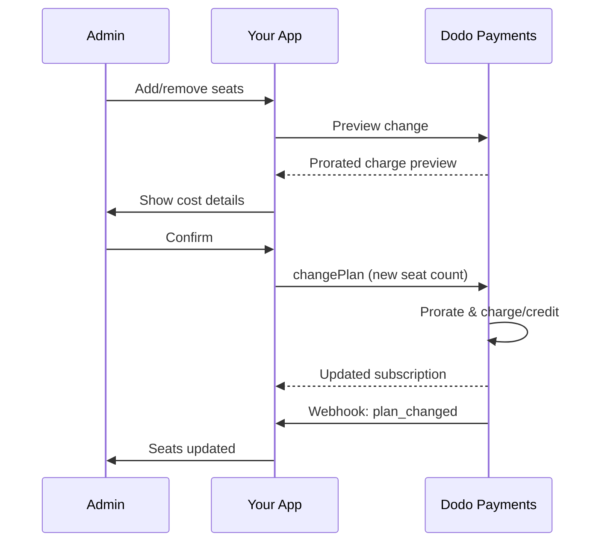

<Info>
La facturation par siège vous permet de facturer les clients en fonction du nombre d'utilisateurs, de membres d'équipe ou de licences dont ils ont besoin. C'est le modèle de tarification standard pour les outils de collaboration d'équipe, les logiciels d'entreprise et les produits SaaS B2B.
</Info>

<CardGroup cols={2}>
<Card title="Tutoriel d'Implémentation" icon="code" href="/developer-resources/seat-based-pricing">
  Guide étape par étape avec des exemples de code.
</Card>

<Card title="Documentation des Add-ons" icon="puzzle" href="/features/addons">
  Découvrez le système d'add-ons qui alimente la facturation par siège.
</Card>

<Card title="Gestion des Abonnements" icon="repeat" href="/features/subscription">
  Gérez les abonnements basés sur les sièges et les changements de plan.
</Card>

<Card title="Webhooks" icon="bell" href="/developer-resources/webhooks/intents/subscription">
  Suivez les changements de sièges avec les webhooks d'abonnement.
</Card>
</CardGroup>

---

## Qu'est-ce que la Facturation par Siège ?

La facturation par siège (également appelée tarification par utilisateur ou par siège) facture les clients en fonction du nombre d'utilisateurs qui accèdent à votre produit. Au lieu d'un tarif fixe, le prix évolue avec la taille de l'équipe.

### Cas d'Utilisation Courants

| Industrie | Exemple | Modèle de Tarification |
|----------|---------|---------------|
| Collaboration d'Équipe | Slack, Notion, Asana | Par utilisateur actif/mois |
| Outils de Développement | GitHub, GitLab, Jira | Par siège/mois |
| Logiciels CRM | Salesforce, HubSpot | Par licence utilisateur |
| Outils de Design | Figma, Canva | Par siège d'éditeur |
| Logiciels de Sécurité | 1Password, Okta | Par utilisateur/mois |
| Vidéoconférence | Zoom, Teams | Par licence d'hôte |

### Avantages de la Tarification par Siège

**Pour Votre Entreprise :**
- Les revenus évoluent naturellement à mesure que les clients grandissent
- Tarification prévisible que les clients peuvent budgétiser
- Chemin de mise à niveau clair de l'individuel à l'équipe puis à l'entreprise
- Valeur à vie plus élevée à mesure que les équipes s'agrandissent

**Pour Vos Clients :**
- Ne payez que pour ce qu'ils utilisent
- Facile à comprendre et à prévoir les coûts
- Flexibilité pour ajouter/retirer des utilisateurs selon les besoins
- Tarification équitable qui correspond à la taille de l'équipe

---

## Comment Fonctionne la Facturation par Siège dans Dodo Payments

Dodo Payments implémente la facturation par siège en utilisant le système **Add-ons**. Voici comment cela fonctionne :

### Vue d'Ensemble de l'Architecture

Un abonnement Team Pro coûte 99 $/mois et inclut 5 sièges. Si vous avez plus de 5 utilisateurs, vous payez un supplément de 15 $/mois pour chaque siège supplémentaire.

Par exemple, si votre équipe a besoin de 15 sièges :
- Plan de base : 99 $/mois (inclut 5 sièges)
- Suppléments : 10 sièges supplémentaires × 15 $/mois = 150 $/mois
- Coût mensuel total : 99 $ + 150 $ = 249 $ pour 15 sièges

### Composants Clés

| Composant | Objectif | Exemple |
|-----------|---------|---------|
| Produit de Base | Abonnement principal avec sièges inclus | "Plan Équipe - 99 $/mois (5 sièges inclus)" |
| Add-on de Siège | Charge par siège pour utilisateurs supplémentaires | "Siège Supplémentaire - 15 $/mois chacun" |
| Quantité | Nombre de sièges supplémentaires achetés | 10 sièges supplémentaires |

---

## Stratégies de Tarification

Choisissez la stratégie de tarification par siège qui convient à votre entreprise :

### Stratégie 1 : Base + Add-on par Siège

Incluez un nombre fixe de sièges dans le plan de base, facturez pour les sièges supplémentaires.

**Exemple :**

```
Starter Plan: $49/month
├── Includes: 3 seats
├── Extra seats: $10/month each
└── 8 total seats = $49 + (5 × $10) = $99/month
```

**Idéal pour :** Produits où de petites équipes peuvent fonctionner avec l'offre de base.

### Stratégie 2 : Tarification Pure par Siège

Facturez un tarif fixe par siège sans frais de base.

**Exemple :**

```
Per User: $12/month
├── 5 users = $60/month
├── 20 users = $240/month
└── 100 users = $1,200/month
```

**Implémentation :** Fixez le prix du plan de base à 0 $, utilisez uniquement l'add-on de siège.

**Idéal pour :** Tarification simple et transparente ; modèles basés sur l'utilisation.

### Stratégie 3 : Tarification par Siège par Niveaux

Différents plans de base avec différents tarifs par siège.

**Exemple :**

```
Starter: $0/month base + $15/seat
├── Lower features, higher per-seat cost

Professional: $99/month base + $10/seat
├── More features, lower per-seat cost

Enterprise: $499/month base + $7/seat
└── All features, volume discount on seats
```

**Implémentation :** Créez des produits séparés pour chaque niveau avec des prix d'add-ons différents.

**Idéal pour :** Encourager les mises à niveau vers des niveaux supérieurs ; ventes aux entreprises.

### Stratégie 4 : Packs de Sièges

Vendez des sièges en packs plutôt qu'individuellement.

**Exemple :**

```
5-Seat Pack: $50/month ($10/seat)
10-Seat Pack: $80/month ($8/seat)
25-Seat Pack: $175/month ($7/seat)
```

**Implémentation :** Créez plusieurs add-ons pour différentes tailles de packs.

**Idéal pour :** Simplifier les décisions d'achat ; encourager des engagements plus importants.

---

## Mise en Place de la Facturation par Siège

### Étape 1 : Planifiez Votre Tarification

Avant l'implémentation, définissez votre structure tarifaire :

<Steps>
<Step title="Définir le Plan de Base">
Décidez ce qui est inclus dans l'abonnement de base :
- Prix de base (peut être 0 $ pour une tarification pure par siège)
- Nombre de sièges inclus
- Fonctionnalités disponibles à ce niveau
</Step>

<Step title="Définir le Prix par Siège">
Déterminez le coût de l'add-on par siège :
- Prix par siège supplémentaire
- Éventuelles remises sur volume (via plusieurs add-ons)
- Nombre maximum de sièges autorisés (le cas échéant)
</Step>

<Step title="Considérer la Fréquence de Facturation">
Alignez la tarification des sièges avec votre cycle de facturation :
- Abonnements mensuels → charges mensuelles par siège
- Abonnements annuels → charges annuelles par siège (souvent à prix réduit)
</Step>
</Steps>

### Étape 2 : Créez l'Add-on de Siège

Dans votre tableau de bord Dodo Payments :

1. Accédez à **Produits** → **Add-Ons**
2. Cliquez sur **Créer un Add-On**
3. Configurez l'add-on :

| Champ | Valeur | Remarques |
|-------|-------|-------|
| Nom | "Siège Supplémentaire" ou "Membre d'Équipe" | Nom clair et convivial |
| Description | "Ajoutez un autre membre d'équipe à votre espace de travail" | Expliquez ce que les clients obtiennent |
| Prix | Votre prix par siège | par exemple, 10,00 $ |
| Devise | Correspondre à votre produit de base | Doit être la même devise |
| Catégorie de Taxe | Identique au produit de base | Assure un traitement fiscal cohérent |

<Tip>
Créez des noms d'add-ons descriptifs qui ont du sens sur les factures. "Siège d'Équipe Supplémentaire" est plus clair que "Add-on de Siège" pour les clients qui examinent leurs factures.
</Tip>

### Étape 3 : Créez l'Abonnement de Base

Créez votre produit d'abonnement :

1. Accédez à **Produits** → **Créer un Produit**
2. Sélectionnez **Abonnement**
3. Configurez les prix et les détails
4. Dans la section **Add-Ons**, attachez votre add-on de siège

### Étape 4 : Attachez l'Add-on au Produit

Liez l'add-on de siège à votre abonnement :

1. Modifiez votre produit d'abonnement
2. Faites défiler jusqu'à la section **Add-Ons**
3. Cliquez sur **Ajouter des Add-Ons**
4. Sélectionnez votre add-on de siège
5. Enregistrez les modifications

<Check>
Votre produit d'abonnement prend désormais en charge la tarification par siège. Les clients peuvent acheter n'importe quelle quantité de sièges supplémentaires lors du paiement.
</Check>

---

## Gestion des Sièges

### Ajout de Sièges aux Nouveaux Abonnements

Lors de la création d'une session de paiement, spécifiez la quantité de sièges :

```typescript
const session = await client.checkoutSessions.create({
  product_cart: [{
    product_id: 'prod_team_plan',
    quantity: 1,
    addons: [{
      addon_id: 'addon_seat',
      quantity: 10  // 10 additional seats
    }]
  }],
  customer: { email: 'admin@company.com' },
  return_url: 'https://yourapp.com/success'
});
```

### Changement de Nombre de Sièges sur des Abonnements Existants

Utilisez l'API Changer de Plan pour ajuster les sièges :

```typescript
// Add 5 more seats to existing subscription
await client.subscriptions.changePlan('sub_123', {
  product_id: 'prod_team_plan',
  quantity: 1,
  proration_billing_mode: 'prorated_immediately',
  addons: [{
    addon_id: 'addon_seat',
    quantity: 15  // New total: 15 additional seats
  }]
});
```

### Suppression de Sièges

Pour réduire le nombre de sièges, spécifiez la quantité inférieure :

```typescript
// Reduce from 15 to 8 additional seats
await client.subscriptions.changePlan('sub_123', {
  product_id: 'prod_team_plan',
  quantity: 1,
  proration_billing_mode: 'difference_immediately',
  addons: [{
    addon_id: 'addon_seat',
    quantity: 8  // Reduced to 8 additional seats
  }]
});
```

### Suppression de Tous les Sièges Supplémentaires

Passez un tableau d'add-ons vide pour supprimer tous les add-ons :

```typescript
// Remove all additional seats, keep only base plan seats
await client.subscriptions.changePlan('sub_123', {
  product_id: 'prod_team_plan',
  quantity: 1,
  proration_billing_mode: 'difference_immediately',
  addons: []  // Removes all add-ons
});
```

---

## Proratisation pour les Changements de Siège

Lorsque les clients ajoutent ou retirent des sièges en cours de cycle, la proratisation détermine comment ils sont facturés.



### Modes de proratisation

| Mode | Ajout de sièges | Suppression de sièges |
|------|-------------|----------------|
| `prorated_immediately` | Facturer les jours restants dans le cycle | Crédit pour les jours non utilisés |
| `difference_immediately` | Facturer le prix complet du siège | Crédit appliqué aux renouvellements futurs |
| `full_immediately` | Facturer le prix complet du siège, réinitialiser le cycle de facturation | Aucun crédit |

### Exemples de proratisation

**Scénario : 15 jours de cycle de facturation restants, ajout de 5 sièges à 10 $/siège**

<Tabs>
<Tab title="prorated_immediately">

```
Prorated charge = ($10 × 5 seats) × (15 days / 30 days)
                = $50 × 0.5
                = $25 immediate charge
```

Le client paie 25 $ maintenant, puis 50 $/mois à la date de renouvellement.
</Tab>

<Tab title="difference_immediately">

```
Immediate charge = $10 × 5 seats = $50
```

Le client paie le montant total de 50 $ maintenant, peu importe la position dans le cycle.
</Tab>

<Tab title="full_immediately">

```
Immediate charge = Full subscription + add-ons
Billing cycle resets to today
```

Le client paie le montant total, un nouveau cycle de facturation commence.
</Tab>
</Tabs>

**Scénario : Suppression de 3 sièges en milieu de cycle avec proratisation immédiate**

```
Current: Team Plan ($99/month) + 10 extra seats × $10/seat = $199/month
Change: Remove 3 seats (10 → 7 extra seats) on day 20 of 30-day cycle
Remaining: 10 days

Credit for removed seats:
  = ($10 × 3 seats) × (10 days / 30 days)
  = $30 × 0.333
  = $10.00 credit

→ $10.00 credit added to subscription
→ Next renewal: $99 + (7 × $10) = $169.00/month
→ Credit auto-applies: $169.00 − $10.00 = $159.00 on next invoice
```

<Tip>
**Choisir un mode de proratisation pour les changements de sièges** : Utilisez `prorated_immediately` pour une facturation équitable basée sur les jours lorsque les équipes ajustent fréquemment les sièges. Utilisez `difference_immediately` pour des calculs plus simples qui facturent ou créditent le prix complet du siège. Consultez le [Guide de proratisation](/developer-resources/subscription-upgrade-downgrade#proration-modes) pour des comparaisons détaillées.
</Tip>

### Aperçu avant de modifier

Aperçu toujours la proratisation avant de faire des changements :

```typescript
const preview = await client.subscriptions.previewChangePlan('sub_123', {
  product_id: 'prod_team_plan',
  quantity: 1,
  proration_billing_mode: 'prorated_immediately',
  addons: [{ addon_id: 'addon_seat', quantity: 20 }]
});

console.log('Immediate charge:', preview.immediate_charge.summary);
// Show customer: "Adding 5 seats will cost $25 today"
```

---

## Suivi des sièges avec des Webhooks

Surveillez les changements de sièges en écoutant les webhooks de souscription :

### Événements pertinents

| Événement | Lorsqu'il est déclenché | Cas d'utilisation |
|-------|----------------|----------|
| `subscription.active` | Nouvelle souscription activée | Provisionner les sièges initiaux |
| `subscription.plan_changed` | Sièges ajoutés/supprimés | Mettre à jour le nombre de sièges dans votre application |
| `subscription.renewed` | Souscription renouvelée | Confirmer que le nombre de sièges est inchangé |
| `subscription.cancelled` | Souscription annulée | Déprovisionner tous les sièges |

### Exemple de gestionnaire de Webhook

```typescript
app.post('/webhooks/dodo', async (req, res) => {
  const event = req.body;

  switch (event.type) {
    case 'subscription.active':
      // New subscription - provision seats
      const seats = calculateTotalSeats(event.data);
      await provisionSeats(event.data.customer_id, seats);
      break;

    case 'subscription.plan_changed':
      // Seats changed - update access
      const newSeats = calculateTotalSeats(event.data);
      await updateSeatCount(event.data.subscription_id, newSeats);
      break;

    case 'subscription.cancelled':
      // Subscription cancelled - deprovision
      await deprovisionAllSeats(event.data.subscription_id);
      break;
  }

  res.json({ received: true });
});

function calculateTotalSeats(subscriptionData) {
  const baseSeats = 5;  // Included in plan
  const addonSeats = subscriptionData.addons?.reduce(
    (total, addon) => total + addon.quantity, 0
  ) || 0;
  return baseSeats + addonSeats;
}
```

---

## Application des limites de sièges

Votre application doit appliquer des limites de sièges. Dodo Payments suit la facturation, mais vous contrôlez l'accès.

### Stratégies d'application

<Tabs>
<Tab title="Limite stricte">
Empêchez strictement l'ajout d'utilisateurs au-delà du nombre de sièges.

```typescript
async function inviteUser(teamId: string, email: string) {
  const team = await getTeam(teamId);
  const subscription = await getSubscription(team.subscriptionId);
  const totalSeats = calculateTotalSeats(subscription);
  const usedSeats = await countTeamMembers(teamId);

  if (usedSeats >= totalSeats) {
    throw new Error('No seats available. Please upgrade your plan.');
  }

  await sendInvitation(teamId, email);
}
```

</Tab>

<Tab title="Limite douce avec avertissement">
Autorisez le dépassement avec un avertissement et une période de grâce.

```typescript
async function inviteUser(teamId: string, email: string) {
  const team = await getTeam(teamId);
  const { totalSeats, usedSeats } = await getSeatInfo(team);

  if (usedSeats >= totalSeats) {
    // Allow but flag for billing
    await flagOverage(teamId, usedSeats - totalSeats + 1);
    await notifyAdmin(team.adminEmail, 'You have exceeded your seat limit');
  }

  await sendInvitation(teamId, email);
}
```

</Tab>

<Tab title="Auto-Mise à Niveau">
Ajoutez automatiquement des sièges lorsque la limite est atteinte.

```typescript
async function inviteUser(teamId: string, email: string) {
  const team = await getTeam(teamId);
  const { totalSeats, usedSeats, subscriptionId } = await getSeatInfo(team);

  if (usedSeats >= totalSeats) {
    // Automatically add a seat
    await client.subscriptions.changePlan(subscriptionId, {
      product_id: team.productId,
      quantity: 1,
      proration_billing_mode: 'prorated_immediately',
      addons: [{ addon_id: 'addon_seat', quantity: totalSeats - baseSeats + 1 }]
    });

    await notifyAdmin(team.adminEmail, 'A new seat was added to your plan');
  }

  await sendInvitation(teamId, email);
}
```

</Tab>
</Tabs>

---

## Modèles avancés

### Différents types de sièges

Offrez différents types de sièges avec des prix différents :

```
Full Seats: $20/month - Full access to all features
View-Only Seats: $5/month - Read-only access
Guest Seats: $0/month - Limited external collaborator access
```

**Mise en œuvre :** Créez des suppléments séparés pour chaque type de siège.

```typescript
const session = await client.checkoutSessions.create({
  product_cart: [{
    product_id: 'prod_team_plan',
    quantity: 1,
    addons: [
      { addon_id: 'addon_full_seat', quantity: 10 },
      { addon_id: 'addon_viewer_seat', quantity: 25 },
      { addon_id: 'addon_guest_seat', quantity: 50 }
    ]
  }]
});
```

### Remises sur les sièges annuels

Offrez un tarif réduit pour les sièges annuels :

```
Monthly: $15/seat/month
Annual: $12/seat/month (20% savings)
```

**Mise en œuvre :** Créez des produits séparés pour les plans mensuels et annuels avec différents prix de suppléments.

### Exigences de sièges minimum

Exigez un nombre minimum de sièges pour certains plans :

```typescript
async function validateSeatCount(planId: string, seatCount: number) {
  const minimums = {
    'prod_starter': 1,
    'prod_team': 5,
    'prod_enterprise': 25
  };

  if (seatCount < minimums[planId]) {
    throw new Error(`${planId} requires at least ${minimums[planId]} seats`);
  }
}
```

---

## Meilleures pratiques

### Meilleures pratiques de tarification

- **Communication claire :** Affichez les prix par siège de manière évidente sur votre page de tarification
- **Sièges inclus :** Envisagez d'inclure quelques sièges dans le prix de base afin de réduire les frictions
- **Remises sur volume :** Offrez des taux par siège inférieurs pour les équipes plus importantes afin de gagner des contrats d'entreprise
- **Incitations annuelles :** Remisez les plans annuels pour améliorer les flux de trésorerie et la fidélisation

### Meilleures pratiques techniques

- **Mettre en cache le nombre de sièges :** Mettez en cache les nombres de sièges des souscriptions localement pour éviter les appels API à chaque demande
- **Synchroniser régulièrement :** Synchronisez périodiquement votre nombre de sièges local avec Dodo Payments via API
- **Gérer les échecs :** Si un changement de siège échoue, affichez des messages d'erreur clairs et des options de réessai
- **Traçabilité :** Journalisez tous les changements de sièges pour des litiges de facturation et des conformités

### Meilleures pratiques d'expérience utilisateur

- **Retour d'information en temps réel :** Montrez l'impact immédiat sur le coût lors de l'ajustement des sièges
- **Étapes de confirmation :** Exigez une confirmation avant les changements de facturation
- **Transparence de la proratisation :** Expliquez clairement les charges proratisées avant de les appliquer
- **Facile à rétrograder :** Ne compliquez pas la réduction des sièges (cela crée de la confiance)

---

## Dépannage

<AccordionGroup>
<Accordion title="Incohérence du nombre de sièges entre l'application et la facturation">
**Symptôme :** Votre application affiche un nombre de sièges différent de la souscription.

**Causes :**
- Webhook non reçu ou non traité
- Condition de concurrence pendant le changement de siège
- Données mises en cache non mises à jour

**Solutions :**
1. Implémentez des gestionnaires de webhook pour `subscription.plan_changed`
2. Ajoutez un bouton "Synchroniser avec la facturation" qui récupère l'abonnement actuel
3. Définissez un TTL de cache pour garantir un rafraîchissement régulier
</Accordion>

<Accordion title="Charges proratisées inattendues">
**Symptôme :** Le client se sent confus par le montant de la charge en milieu de cycle.

**Causes :**
- Mode de proratisation non communiqué clairement
- Le client n'a pas vu l'aperçu avant de confirmer

**Solutions :**
1. Utilisez toujours `previewChangePlan` avant de faire des changements
2. Affichez une ventilation claire : "Ajouter X sièges = Y $ aujourd'hui (proratisé pour Z jours)"
3. Documentez votre politique de proratisation dans le centre d'aide
</Accordion>

<Accordion title="Supplément non apparaissant au paiement">
**Symptôme :** Le supplément de siège n'est pas disponible lors du paiement.

**Causes :**
- Supplément non attaché au produit
- Supplément archivé ou supprimé
- Mismatch de devise entre le produit et le supplément

**Solutions :**
1. Vérifiez que le supplément est attaché dans les paramètres du produit
2. Vérifiez le statut du supplément dans le tableau de bord des Suppléments
3. Assurez-vous que les devises correspondent exactement
</Accordion>

<Accordion title="Impossible de réduire les sièges en dessous de l'utilisation actuelle">
**Symptôme :** Le client souhaite réduire les sièges mais a des utilisateurs assignés.

**Solutions :**
1. Montrez quels utilisateurs doivent être supprimés avant de réduire les sièges
2. Implémentez un flux de travail : Supprimer des utilisateurs → Réduire des sièges
3. Envisagez une période de grâce avant d'appliquer la réduction des sièges
</Accordion>
</AccordionGroup>

---

## Documentation connexe

<CardGroup cols={2}>
<Card title="Tutoriel de tarification basée sur les sièges" icon="code" href="/developer-resources/seat-based-pricing">
  Guide de mise en œuvre complet avec code.
</Card>

<Card title="Suppléments" icon="puzzle" href="/features/addons">
  Comprendre en profondeur le système de suppléments.
</Card>

<Card title="Changements de plan & Proratisation" icon="arrows-rotate" href="/developer-resources/subscription-upgrade-downgrade">
  Gérer les modifications d'abonnements.
</Card>

<Card title="Webhooks de souscription" icon="bell" href="/developer-resources/webhooks/intents/subscription">
  Suivre les événements de souscription.
</Card>
</CardGroup>
