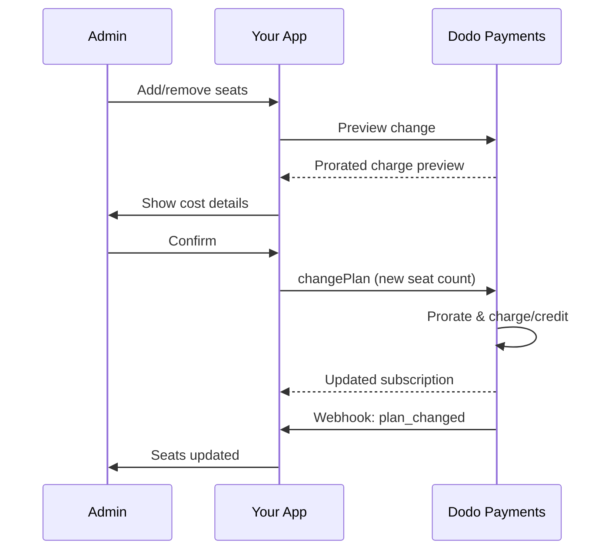

<Info>
Seat-based billing lets you charge customers based on the number of users, team members, or licenses they need. It's the standard pricing model for team collaboration tools, enterprise software, and B2B SaaS products.
</Info>

<CardGroup cols={2}>
<Card title="Implementation Tutorial" icon="code" href="/developer-resources/seat-based-pricing">
  Step-by-step guide with code examples.
</Card>

<Card title="Add-ons Documentation" icon="puzzle" href="/features/addons">
  Learn about the add-on system that powers seat-based billing.
</Card>

<Card title="Subscription Management" icon="repeat" href="/features/subscription">
  Manage seat-based subscriptions and plan changes.
</Card>

<Card title="Webhooks" icon="bell" href="/developer-resources/webhooks/intents/subscription">
  Track seat changes with subscription webhooks.
</Card>
</CardGroup>

---

## What is Seat-Based Billing?

Seat-based billing (also called per-user or per-seat pricing) charges customers based on the number of users who access your product. Instead of a flat fee, the price scales with team size.

### Common Use Cases

| Industry | Example | Pricing Model |
|----------|---------|---------------|
| Team Collaboration | Slack, Notion, Asana | Per active user/month |
| Developer Tools | GitHub, GitLab, Jira | Per seat/month |
| CRM Software | Salesforce, HubSpot | Per user license |
| Design Tools | Figma, Canva | Per editor seat |
| Security Software | 1Password, Okta | Per user/month |
| Video Conferencing | Zoom, Teams | Per host license |

### Benefits of Seat-Based Pricing

**For Your Business:**
- Revenue scales naturally as customers grow
- Predictable pricing customers can budget for
- Clear upgrade path from individual to team to enterprise
- Higher lifetime value as teams expand

**For Your Customers:**
- Pay only for what they use
- Easy to understand and forecast costs
- Flexibility to add/remove users as needed
- Fair pricing that matches team size

---

## How Seat-Based Billing Works in Dodo Payments

Dodo Payments implements seat-based billing using the **Add-ons** system. Here's how it works:

### Architecture Overview

Un abonnement Team Pro coûte \$99/mois et inclut 5 sièges. Si vous avez plus de 5 utilisateurs, vous payez \$15/mois supplémentaires pour chaque siège additionnel.

Par exemple, si votre équipe a besoin de 15 sièges :
- Forfait de base : \$99/mois (inclut 5 sièges)
- Modules complémentaires : 10 sièges supplémentaires × \$15/mois = \$150/mois
- Coût mensuel total : \$99 + \$150 = \$249 pour 15 sièges

### Key Components

| Component | Purpose | Example |
|-----------|---------|---------|
| Base Product | Core subscription with included seats | "Team Plan - $99/month (5 seats included)" |
| Seat Add-on | Per-seat charge for additional users | "Extra Seat - $15/month each" |
| Quantity | Number of additional seats purchased | 10 extra seats |

---

## Pricing Strategies

Choose the seat-based pricing strategy that fits your business:

### Strategy 1: Base + Per-Seat Add-on

Include a set number of seats in the base plan, charge for additional seats.

**Example:**

```
Starter Plan: $49/month
├── Includes: 3 seats
├── Extra seats: $10/month each
└── 8 total seats = $49 + (5 × $10) = $99/month
```

**Best for:** Products where small teams can function with the base offering.

### Strategy 2: Pure Per-Seat Pricing

Charge a flat rate per seat with no base fee.

**Example:**

```
Per User: $12/month
├── 5 users = $60/month
├── 20 users = $240/month
└── 100 users = $1,200/month
```

**Implementation:** Set base plan price to $0, use only the seat add-on.

**Best for:** Simple, transparent pricing; usage-based models.

### Strategy 3: Tiered Seat Pricing

Different base plans with different per-seat rates.

**Example:**

```
Starter: $0/month base + $15/seat
├── Lower features, higher per-seat cost

Professional: $99/month base + $10/seat
├── More features, lower per-seat cost

Enterprise: $499/month base + $7/seat
└── All features, volume discount on seats
```

**Implementation:** Create separate products for each tier with different add-on prices.

**Best for:** Encouraging upgrades to higher tiers; enterprise sales.

### Strategy 4: Seat Bundles

Sell seats in packs rather than individually.

**Example:**

```
5-Seat Pack: $50/month ($10/seat)
10-Seat Pack: $80/month ($8/seat)
25-Seat Pack: $175/month ($7/seat)
```

**Implementation:** Create multiple add-ons for different pack sizes.

**Best for:** Simplifying purchasing decisions; encouraging larger commitments.

---

## Setting Up Seat-Based Billing

### Step 1: Plan Your Pricing

Before implementation, define your pricing structure:

<Steps>
<Step title="Define Base Plan">
Decide what's included in the base subscription:
- Base price (can be $0 for pure per-seat)
- Number of included seats
- Features available at this tier
</Step>

<Step title="Set Seat Pricing">
Determine the per-seat add-on cost:
- Price per additional seat
- Any volume discounts (via multiple add-ons)
- Maximum seats allowed (if applicable)
</Step>

<Step title="Consider Billing Frequency">
Align seat pricing with your billing cycle:
- Monthly subscriptions → monthly seat charges
- Annual subscriptions → annual seat charges (often discounted)
</Step>
</Steps>

### Step 2: Create the Seat Add-on

In your Dodo Payments dashboard:

1. Navigate to **Products** → **Add-Ons**
2. Click **Create Add-On**
3. Configure the add-on:

| Field | Value | Notes |
|-------|-------|-------|
| Name | "Additional Seat" or "Team Member" | Clear, user-friendly name |
| Description | "Add another team member to your workspace" | Explain what customers get |
| Price | Your per-seat price | e.g., $10.00 |
| Currency | Match your base product | Must be the same currency |
| Tax Category | Same as base product | Ensures consistent tax handling |

<Tip>
Create descriptive add-on names that make sense on invoices. "Additional Team Seat" is clearer than "Seat Add-on" for customers reviewing their bills.
</Tip>

### Step 3: Create the Base Subscription

Create your subscription product:

1. Navigate to **Products** → **Create Product**
2. Select **Subscription**
3. Configure pricing and details
4. In the **Add-Ons** section, attach your seat add-on

### Step 4: Attach Add-on to Product

Link the seat add-on to your subscription:

1. Edit your subscription product
2. Scroll to **Add-Ons** section
3. Click **Add Add-Ons**
4. Select your seat add-on
5. Save changes

<Check>
Your subscription product now supports seat-based pricing. Customers can purchase any quantity of additional seats during checkout.
</Check>

---

## Managing Seats

### Adding Seats to New Subscriptions

When creating a checkout session, specify the seat quantity:

```typescript
const session = await client.checkoutSessions.create({
  product_cart: [{
    product_id: 'pdt_team_plan',
    quantity: 1,
    addons: [{
      addon_id: 'addon_seat',
      quantity: 10  // 10 additional seats
    }]
  }],
  customer: { email: 'admin@company.com' },
  return_url: 'https://yourapp.com/success'
});
```

### Changing Seat Count on Existing Subscriptions

Use the Change Plan API to adjust seats:

```typescript
// Add 5 more seats to existing subscription
await client.subscriptions.changePlan('sub_123', {
  product_id: 'pdt_team_plan',
  quantity: 1,
  proration_billing_mode: 'prorated_immediately',
  addons: [{
    addon_id: 'addon_seat',
    quantity: 15  // New total: 15 additional seats
  }]
});
```

### Removing Seats

To reduce seat count, specify the lower quantity:

```typescript
// Reduce from 15 to 8 additional seats
await client.subscriptions.changePlan('sub_123', {
  product_id: 'pdt_team_plan',
  quantity: 1,
  proration_billing_mode: 'difference_immediately',
  addons: [{
    addon_id: 'addon_seat',
    quantity: 8  // Reduced to 8 additional seats
  }]
});
```

### Removing All Additional Seats

Pass an empty addons array to remove all add-ons:

```typescript
// Remove all additional seats, keep only base plan seats
await client.subscriptions.changePlan('sub_123', {
  product_id: 'pdt_team_plan',
  quantity: 1,
  proration_billing_mode: 'difference_immediately',
  addons: []  // Removes all add-ons
});
```

---

## Proration for Seat Changes

When customers add or remove seats mid-cycle, proration determines how they're billed.



### Proration Modes

| Mode | Ajout de sièges | Suppression de sièges | Cycle de facturation |
|------|----------------|------------------------|------------------------|
| `prorated_immediately` | Facturation des jours restants dans le cycle | Crédit pour les jours non utilisés | Réinitialisation aujourd'hui |
| `difference_immediately` | Facturation du prix total par siège | Crédit appliqué aux futurs renouvellements | Réinitialisation aujourd'hui |
| `full_immediately` | Facturation du prix total par siège | Aucun crédit | Réinitialisation aujourd'hui |
| `do_not_bill` | Siège ajouté, pas de frais maintenant | Siège supprimé, aucun crédit | Reste le même |

<Warning>
`prorated_immediately`, `difference_immediately`, et `full_immediately` **réinitialisent tous le cycle de facturation** à la date du changement, le prochain renouvellement est ré-ancré au jour où le changement de siège est appliqué. Seul **`do_not_bill`** conserve la date de renouvellement d'origine (le nouveau nombre de sièges est facturé intégralement au prochain renouvellement, sans frais au moment du changement).
</Warning>

### Exemples de Proration

**Scénario : 15 jours restants dans le cycle, ajout de 5 sièges à $10/siege**

<Tabs>
<Tab title="prorated_immediately">

```
Prorated charge = ($10 × 5 seats) × (15 days / 30 days)
                = $50 × 0.5
                = $25 immediate charge
Billing cycle resets to today
```

Le client paie le montant au prorata maintenant, et le cycle de facturation est ré-ancré à la date du changement — le prochain renouvellement ($50/mois pour les sièges ajoutés) est facturé un cycle à partir d'aujourd'hui, pas à partir de la date de renouvellement d'origine.
</Tab>

<Tab title="difference_immediately">

```
Immediate charge = $10 × 5 seats = $50
Billing cycle resets to today
```

Le client paie le prix total du siège maintenant, quelle que soit la position dans le cycle, et le cycle de facturation est ré-ancré à la date du changement.
</Tab>

<Tab title="full_immediately">

```
Immediate charge = Full subscription + add-ons
Billing cycle resets to today
```

Le client paie le montant total, un nouveau cycle de facturation commence.
</Tab>

<Tab title="do_not_bill">

```
Immediate charge = $0
Billing cycle unchanged
```

Les sièges sont ajoutés immédiatement sans frais au moment du changement. La date de renouvellement d'origine est préservée, et le nouveau nombre de sièges est facturé intégralement au prochain renouvellement. Utilisez ceci lorsque vous devez conserver le cycle de facturation existant.
</Tab>
</Tabs>

**Scénario : Suppression de 3 sièges à mi-parcours avec proration immédiate**

```
Current: Team Plan ($99/month) + 10 extra seats × $10/seat = $199/month
Change: Remove 3 seats (10 → 7 extra seats) on day 20 of 30-day cycle
Remaining: 10 days

Credit for removed seats:
  = ($10 × 3 seats) × (10 days / 30 days)
  = $30 × 0.333
  = $10.00 credit

→ $10.00 credit added to subscription
→ Next renewal: $99 + (7 × $10) = $169.00/month
→ Credit auto-applies: $169.00 − $10.00 = $159.00 on next invoice
```

<Tip>
**Choisir un mode de proration pour les changements de sièges** : Utilisez `prorated_immediately` pour une facturation juste basée sur les jours lorsque les équipes ajustent fréquemment le nombre de sièges. Utilisez `difference_immediately` pour des calculs plus simples qui facturent ou créditent le prix total par siège. Si vous devez conserver la date de renouvellement existante inchangée, utilisez `do_not_bill` — le seul mode qui ne réinitialise pas le cycle de facturation (le nouveau nombre de sièges est facturé au prochain renouvellement). Consultez le [Guide de Proration](/developer-resources/subscription-upgrade-downgrade#proration-modes) pour des comparaisons détaillées.
</Tip>

### Aperçu Avant Changement

Toujours prévisualiser la proration avant de faire des changements :

```typescript
const preview = await client.subscriptions.previewChangePlan('sub_123', {
  product_id: 'pdt_team_plan',
  quantity: 1,
  proration_billing_mode: 'prorated_immediately',
  addons: [{ addon_id: 'addon_seat', quantity: 20 }]
});

console.log('Immediate charge:', preview.immediate_charge.summary);
// Show customer: "Adding 5 seats will cost $25 today"
```

---

## Suivi des Sièges avec les Webhooks

Surveillez les changements de sièges en écoutant les webhooks d'abonnement :

### Événements Pertinents

| Événement | Quand Déclenché | Cas d'Utilisation |
|-----------|-----------------|------------------|
| `subscription.active` | Nouvel abonnement activé | Approvisionner les sièges initiaux |
| `subscription.plan_changed` | Sièges ajoutés/supprimés | Mettre à jour le nombre de sièges dans votre application |
| `subscription.renewed` | Abonnement renouvelé | Confirmer que le nombre de sièges n'a pas changé |
| `subscription.cancelled` | Abonnement annulé | Déprovisionner tous les sièges |

### Exemple de Gestionnaire de Webhook

```typescript
app.post('/webhooks/dodo', async (req, res) => {
  const event = req.body;

  switch (event.type) {
    case 'subscription.active':
      // New subscription - provision seats
      const seats = calculateTotalSeats(event.data);
      await provisionSeats(event.data.customer_id, seats);
      break;

    case 'subscription.plan_changed':
      // Seats changed - update access
      const newSeats = calculateTotalSeats(event.data);
      await updateSeatCount(event.data.subscription_id, newSeats);
      break;

    case 'subscription.cancelled':
      // Subscription cancelled - deprovision
      await deprovisionAllSeats(event.data.subscription_id);
      break;
  }

  res.json({ received: true });
});

function calculateTotalSeats(subscriptionData) {
  const baseSeats = 5;  // Included in plan
  const addonSeats = subscriptionData.addons?.reduce(
    (total, addon) => total + addon.quantity, 0
  ) || 0;
  return baseSeats + addonSeats;
}
```

---

## Imposition des Limites de Sièges

Votre application doit imposer des limites de sièges. Dodo Payments suit la facturation, mais vous contrôlez l'accès.

### Stratégies d'Imposition

<Tabs>
<Tab title="Hard Limit">
Empêchez strictement l'ajout d'utilisateurs au-delà du nombre de sièges.

```typescript
async function inviteUser(teamId: string, email: string) {
  const team = await getTeam(teamId);
  const subscription = await getSubscription(team.subscriptionId);
  const totalSeats = calculateTotalSeats(subscription);
  const usedSeats = await countTeamMembers(teamId);

  if (usedSeats >= totalSeats) {
    throw new Error('No seats available. Please upgrade your plan.');
  }

  await sendInvitation(teamId, email);
}
```

</Tab>

<Tab title="Soft Limit with Warning">
Autorisez le dépassement avec un avertissement et une période de grâce.

```typescript
async function inviteUser(teamId: string, email: string) {
  const team = await getTeam(teamId);
  const { totalSeats, usedSeats } = await getSeatInfo(team);

  if (usedSeats >= totalSeats) {
    // Allow but flag for billing
    await flagOverage(teamId, usedSeats - totalSeats + 1);
    await notifyAdmin(team.adminEmail, 'You have exceeded your seat limit');
  }

  await sendInvitation(teamId, email);
}
```

</Tab>

<Tab title="Auto-Upgrade">
Ajoutez automatiquement des sièges lorsque la limite est atteinte.

```typescript
async function inviteUser(teamId: string, email: string) {
  const team = await getTeam(teamId);
  const { totalSeats, usedSeats, subscriptionId } = await getSeatInfo(team);

  if (usedSeats >= totalSeats) {
    // Automatically add a seat
    await client.subscriptions.changePlan(subscriptionId, {
      product_id: team.productId,
      quantity: 1,
      proration_billing_mode: 'prorated_immediately',
      addons: [{ addon_id: 'addon_seat', quantity: totalSeats - baseSeats + 1 }]
    });

    await notifyAdmin(team.adminEmail, 'A new seat was added to your plan');
  }

  await sendInvitation(teamId, email);
}
```

</Tab>
</Tabs>

---

## Modèles Avancés

### Différents Types de Sièges

Offrez différents types de sièges avec des prix différents :

```
Full Seats: $20/month - Full access to all features
View-Only Seats: $5/month - Read-only access
Guest Seats: $0/month - Limited external collaborator access
```

**Mise en œuvre :** Créez des add-ons séparés pour chaque type de siège.

```typescript
const session = await client.checkoutSessions.create({
  product_cart: [{
    product_id: 'pdt_team_plan',
    quantity: 1,
    addons: [
      { addon_id: 'addon_full_seat', quantity: 10 },
      { addon_id: 'addon_viewer_seat', quantity: 25 },
      { addon_id: 'addon_guest_seat', quantity: 50 }
    ]
  }]
});
```

### Réductions sur Sièges Annuels

Offrez des prix réduits pour les sièges annuels :

```
Monthly: $15/seat/month
Annual: $12/seat/month (20% savings)
```

**Mise en œuvre :** Créez des produits séparés pour les plans mensuels et annuels avec des prix d'add-ons différents.

### Exigences Minima de Sièges

Exigez un nombre minimum de sièges pour certains plans :

```typescript
async function validateSeatCount(planId: string, seatCount: number) {
  const minimums = {
    'pdt_starter': 1,
    'pdt_team': 5,
    'pdt_enterprise': 25
  };

  if (seatCount < minimums[planId]) {
    throw new Error(`${planId} requires at least ${minimums[planId]} seats`);
  }
}
```

---

## Meilleures Pratiques

### Meilleures Pratiques de Tarification

- **Communication Claire** : Affichez clairement le prix par siège sur votre page de tarification
- **Sièges Inclus** : Envisagez d'inclure quelques sièges dans le prix de base pour réduire les frictions
- **Réductions de Volume** : Offrez des tarifs réduits par siège pour les grandes équipes afin de conclure des accords d'entreprise
- **Incentives Annuels** : Réduisez les plans annuels pour améliorer le flux de trésorerie et la rétention

### Meilleures Pratiques Techniques

- **Mettre en Cache les Comptes de Sièges** : Mettez en cache localement les comptes d'abonnement pour éviter les appels API à chaque demande
- **Synchroniser Régulièrement** : Synchronisez périodiquement votre nombre de sièges locaux avec Dodo Payments via API
- **Gérer les Échecs** : Si un changement de siège échoue, affichez des messages d'erreur clairs et des options de réessai
- **Piste d'Audit** : Enregistrez tous les changements de sièges pour les différends de facturation et la conformité

### Meilleures Pratiques d'Expérience Utilisateur

- **Retour d'Information en Temps Réel** : Affichez l'impact coût immédiat lors de l'ajustement des sièges
- **Étapes de Confirmation** : Demandez confirmation avant les changements de facturation
- **Transparence de la Proration** : Expliquez clairement les frais proratisés avant de les appliquer
- **Facilité de Réduction** : Ne rendez pas difficile la réduction du nombre de sièges (cela renforce la confiance)

---

## Dépannage

<AccordionGroup>
<Accordion title="Seat count mismatch between app and billing">
**Symptôme** : Votre application affiche un nombre de sièges différent de celui de l'abonnement.

**Causes** :
- Webhook non reçu ou traité
- Problème de synchronisation lors du changement de siège
- Données mises en cache non mises à jour

**Solutions** :
1. Implémentez des gestionnaires de webhook pour `subscription.plan_changed`
2. Ajoutez un bouton "Synchroniser avec la facturation" qui récupère l'abonnement actuel
3. Définissez le cache TTL pour assurer un rafraîchissement régulier
</Accordion>

<Accordion title="Proration charges unexpected">
**Symptôme** : Le client est confus par le montant facturé à mi-parcours.

**Causes** :
- Mode de proration non communiqué clairement
- Le client n'a pas vu l'aperçu avant confirmation

**Solutions** :
1. Utilisez toujours `previewChangePlan` avant de faire des changements
2. Affichez une répartition claire : "Ajout de X sièges = $Y aujourd'hui (proratisé pour Z jours)"
3. Documentez votre politique de proration dans le centre d'aide
</Accordion>

<Accordion title="Add-on not appearing in checkout">
**Symptôme** : Add-on de siège non disponible lors du paiement.

**Causes** :
- Add-on non attaché au produit
- Add-on archivé ou supprimé
- Incompatibilité de devise entre le produit et l'add-on

**Solutions** :
1. Vérifiez que l'add-on est attaché dans les paramètres du produit
2. Vérifiez le statut de l'add-on dans le tableau de bord des Add-Ons
3. Assurez-vous que les devises correspondent exactement
</Accordion>

<Accordion title="Cannot reduce seats below current usage">
**Symptôme** : Le client veut réduire le nombre de sièges mais a des utilisateurs assignés.

**Solutions** :
1. Affichez quels utilisateurs doivent être supprimés avant de réduire le nombre de sièges
2. Implémentez un flux de travail : Supprimer des utilisateurs → Réduire le nombre de sièges
3. Envisagez une période de grâce avant d'appliquer la réduction de sièges
</Accordion>
</AccordionGroup>

---

## Documentation Connexe

<CardGroup cols={2}>
<Card title="Seat-Based Pricing Tutorial" icon="code" href="/developer-resources/seat-based-pricing">
  Guide de mise en œuvre complet avec code.
</Card>

<Card title="Add-ons" icon="puzzle" href="/features/addons">
  Comprenez en profondeur le système d'add-ons.
</Card>

<Card title="Plan Changes & Proration" icon="arrows-rotate" href="/developer-resources/subscription-upgrade-downgrade">
  Gérer les modifications d'abonnement.
</Card>

<Card title="Subscription Webhooks" icon="bell" href="/developer-resources/webhooks/intents/subscription">
  Suivre les événements d'abonnement.
</Card>
</CardGroup>