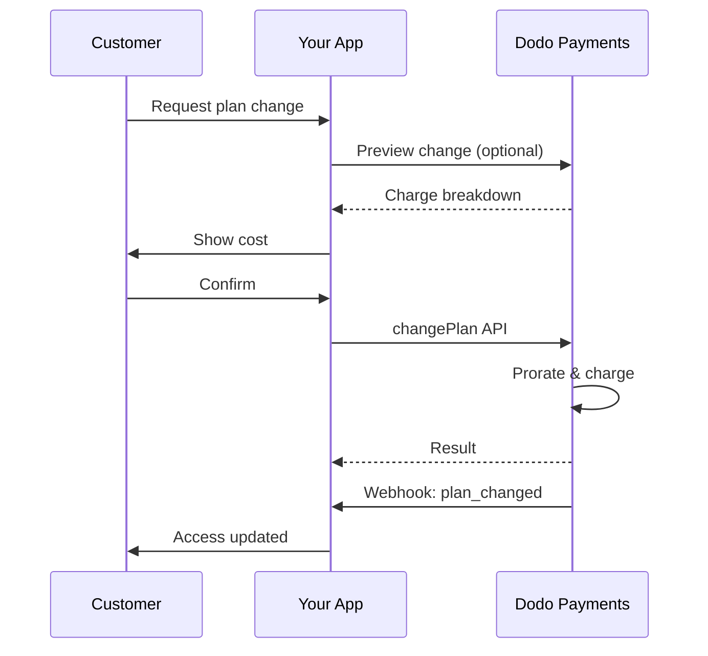
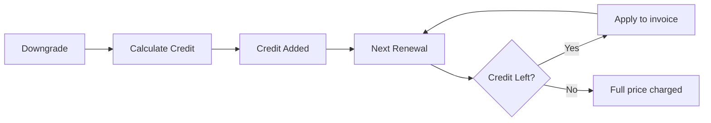
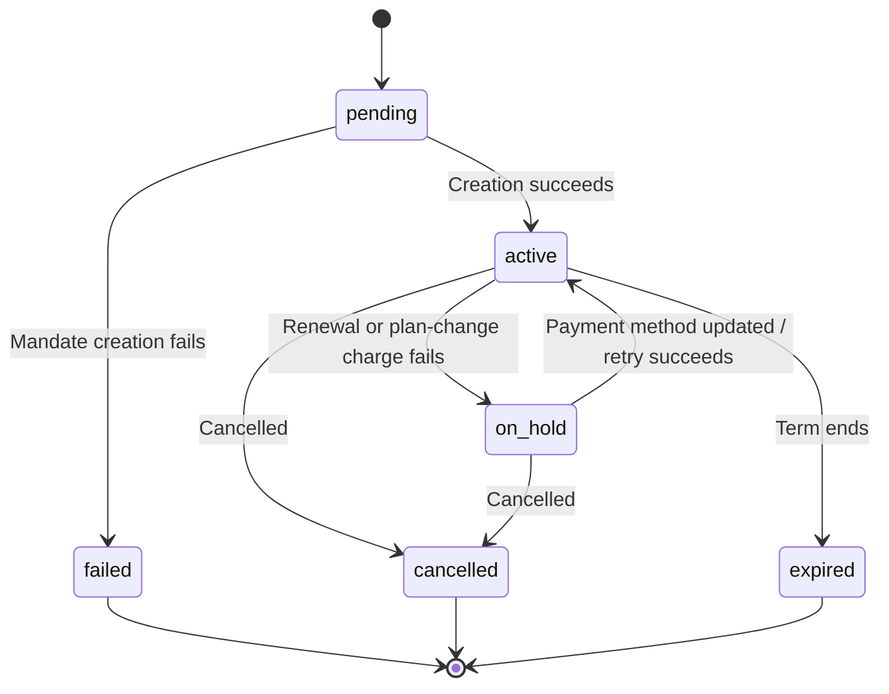

<Info>
Subscriptions let you sell ongoing access with automated renewals. Use flexible billing cycles, free trials, plan changes, and add‑ons to tailor pricing for each customer.
</Info>

<CardGroup cols={2}>
<Card title="Upgrade & Downgrade" icon="repeat" href="/developer-resources/subscription-upgrade-downgrade">
Control plan changes with proration and quantity updates.
</Card>

<Card title="On‑Demand Subscriptions" icon="bolt" href="/developer-resources/ondemand-subscriptions">
Authorize a mandate now and charge later with custom amounts.
</Card>

<Card title="Customer Portal" icon="id-card" href="/features/customer-portal">
Let customers manage plans, billing, and cancellations.
</Card>

<Card title="Subscription Webhooks" icon="code" href="/developer-resources/webhooks/intents/subscription">
React to lifecycle events like created, renewed, and canceled.
</Card>
</CardGroup>

## What Are Subscriptions?

Subscriptions are recurring products customers purchase on a schedule. They’re ideal for:

- **SaaS licenses**: Apps, APIs, or platform access
- **Memberships**: Communities, programs, or clubs
- **Digital content**: Courses, media, or premium content
- **Support plans**: SLAs, success packages, or maintenance

## Key Benefits

- **Predictable revenue**: Recurring billing with automated renewals
- **Flexible cycles**: Monthly, annual, custom intervals, and trials
- **Plan agility**: Proration for upgrades and downgrades
- **Add‑ons and seats**: Attach optional, quantifiable upgrades
- **Seamless checkout**: Hosted checkout and customer portal
- **Developer-first**: Clear APIs for creation, changes, and usage tracking

## Creating Subscriptions

Create subscription products in your Dodo Payments dashboard, then sell them through checkout or your API. Separating products from active subscriptions lets you version pricing, attach add‑ons, and track performance independently.

### Subscription product creation

Configure the fields in the dashboard to define how your subscription sells, renews, and bills. The sections below map directly to what you see in the creation form.

#### Product details

- **Product Name** (required): The display name shown in checkout, customer portal, and invoices.
- **Product Description** (required): A clear value statement that appears in checkout and invoices.
- **Product Image** (required): PNG/JPG/WebP up to 3 MB. Used on checkout and invoices.
- **Brand**: Associate the product with a specific brand for theming and emails.
- **Tax Category** (required): Choose the category (for example, SaaS) to determine tax rules.

<Tip>
Pick the most accurate tax category to ensure correct tax collection per region.
</Tip>

#### Pricing

- **Type de tarification** : Choisissez <b>Subscription</b> (ce guide). Les alternatives sont Single Payment et Usage Based Billing.
- **Prix** (obligatoire) : Prix récurrent de base avec devise. Le prix doit être d'au moins **$1** (ou l'équivalent dans la devise choisie). Les montants inférieurs à ce minimum ne sont pas pris en charge et l'abonnement ne fonctionnera pas.
- **Remise applicable (%)** : Remise en pourcentage facultative appliquée au prix de base ; reflétée lors du checkout et sur les factures.
- **Répéter le paiement tous les** (obligatoire) : Intervalle entre les renouvellements, par exemple tous les 1 Month. Sélectionnez la cadence (mois ou années) et la quantité.
- **Période d'abonnement** (obligatoire) : Durée totale pendant laquelle l'abonnement reste actif (par exemple, 10 Years). Une fois cette période terminée, les renouvellements s'arrêtent sauf prolongation.
- **Jours de période d'essai** (obligatoire) : Définissez la durée de l'essai en jours. Utilisez 0 pour désactiver les essais. Le premier prélèvement est effectué automatiquement à la fin de l'essai.
- **Montant de l'essai** : Frais initiaux facultatifs pour un essai payant. Laissez ce champ vide pour un essai gratuit. Consultez [Paid Trials](#paid-trials).
- **Sélectionner un add-on** : Ajoutez jusqu'à 10 add-ons que les clients peuvent acheter avec le forfait de base.

<Warning>
Changing pricing on an active product affects new purchases. Existing subscriptions follow your plan‑change and proration settings.
</Warning>

<Info>
Add‑ons are ideal for quantifiable extras such as seats or storage. You can control allowed quantities and proration behavior when customers change them.
</Info>

#### Advanced settings

- **Tax Inclusive Pricing**: Display prices inclusive of applicable taxes. Final tax calculation still varies by customer location.
- **Generate license keys**: Issue a unique key to each customer after purchase. See the <a href="/features/license-keys">License Keys</a> guide.
- **Digital Product Delivery**: Deliver files or content automatically after purchase. Learn more in <a href="/features/digital-product-delivery">Digital Product Delivery</a>.
- **Metadata**: Attach custom key–value pairs for internal tagging or client integrations. See <a href="/api-reference/metadata">Metadata</a>.

<Tip>
Use metadata to store identifiers from your system (e.g., accountId) so you can reconcile events and invoices later.
</Tip>

## Subscription Trials

Les essais permettent aux clients d'évaluer un abonnement avant de payer le prix récurrent complet. Un essai peut être **gratuit**, auquel cas aucun montant n'est facturé avant sa fin, ou **payant**, auquel cas un montant réduit est facturé à l'avance. Dans les deux cas, le prix complet commence au premier renouvellement suivant la fin de l'essai.

### Configuring Trials

Set **Trial Period Days** in the product pricing section (use `0` to disable). You can override this when creating subscriptions:

```typescript
// Via subscription creation
const subscription = await client.subscriptions.create({
  customer_id: 'cus_123',
  product_id: 'prod_monthly',
  trial_period_days: 14  // Overrides product's trial period
});

// Via checkout session
const session = await client.checkoutSessions.create({
  product_cart: [{ product_id: 'prod_monthly', quantity: 1 }],
  subscription_data: { trial_period_days: 14 }
});
```

<Warning>
The `trial_period_days` value must be between 0 and 10,000 days.
</Warning>

### Essais payants

Les essais ne doivent pas nécessairement être gratuits. Définissez un **Montant de l'essai** sur le prix récurrent d'un produit d'abonnement pour facturer des frais initiaux réduits pendant la période d'essai. Le prix récurrent complet prend ensuite le relais au premier renouvellement.

<Frame>

</Frame>

Les essais payants sont configurés sur le prix du produit, et non par abonnement ou par session de checkout :

| Champ | Type | Description |
|-------|------|-------------|
| `trial_amount` | integer | Montant facturé aujourd'hui pour l'essai, dans les unités mineures de la devise du prix (par exemple, `500` pour $5.00). Nécessite `trial_period_days > 0`. Omettez-le ou définissez-le sur `null` pour un essai gratuit. |
| `trial_apply_discounts` | boolean | Indique si les codes de remise du checkout réduisent les frais de l'essai. La valeur par défaut est `false` : le montant de l'essai est donc facturé intégralement même lorsqu'une remise s'applique au prix récurrent. |

```typescript
const product = await client.products.create({
  name: 'Pro Plan',
  tax_category: 'saas',
  price: {
    type: 'recurring_price',
    price: 2900,                      // $29.00 per month after the trial
    currency: 'USD',
    payment_frequency_count: 1,
    payment_frequency_interval: 'Month',
    subscription_period_count: 1,
    subscription_period_interval: 'Year',
    trial_period_days: 14,            // A paid trial requires a positive trial period
    trial_amount: 500,                // $5.00 charged today
    trial_apply_discounts: false      // Discounts apply to the recurring price only
  }
});
```

Les essais payants passent également par le checkout. Le montant de l'essai est soumis aux taxes, apparaît dans les calculs de la session de checkout et dans la tarification des payment links, et la majoration Adaptive Currency est appliquée par devise. L'[endpoint de prévisualisation](/developer-resources/checkout-session) renvoie `trial_amount` et `trial_period_days` afin que vous puissiez afficher le montant dû aujourd'hui avant la création de l'abonnement.

<Info>
Les essais gratuits restent inchangés. Si vous laissez le **Montant de l'essai** vide, le comportement existant est conservé : le premier prélèvement est `0` et le prix complet est facturé à la fin de l'essai.
</Info>

### Prévenir les abus des essais

**Prévenir les abus des essais** empêche les clients de réclamer plusieurs fois des essais pour la même entreprise. Lorsque cette option est activée, un client ayant déjà utilisé un essai est automatiquement redirigé vers un **achat payant sans essai**, au lieu de bénéficier d'un nouvel essai.

<Frame>

</Frame>

Activez cette option depuis l'onglet **Subscriptions** dans **Settings**. Une fois activée :

- Les clients sont identifiés par leur **adresse e-mail normalisée**, avec suppression des alias utilisant le signe plus ; `user+trial@example.com` et `user@example.com` désignent donc la même personne.
- Les utilisations sont enregistrées lors de l'**activation de l'essai** : un client qui annule le jour même a tout de même consommé son essai.
- Les clients existants sont complétés à partir de leurs essais historiques par e-mail ; les anciens utilisateurs d'essai sont donc reconnus immédiatement.

<Info>
Le paramètre est **désactivé par défaut**. Consultez [Subscription Settings](/features/product-collections#subscription-settings) pour obtenir la liste complète des contrôles d'abonnement au niveau de l'entreprise.
</Info>

### Détecter l'état d'essai

<Warning>
Il n'existe actuellement aucun champ direct permettant de détecter l'état d'essai. La solution de contournement suivante nécessite d'interroger les paiements, ce qui est inefficace. Nous travaillons sur une solution plus efficace.
</Warning>

Pour déterminer si un abonnement en **essai gratuit** est en période d'essai, récupérez la liste des paiements de l'abonnement. S'il existe exactement un paiement d'un montant de 0, l'abonnement est en période d'essai :

```typescript
const subscription = await client.subscriptions.retrieve('sub_123');
const payments = await client.payments.list({
  subscription_id: subscription.subscription_id
});

// Check if subscription is in trial
const isInTrial = payments.items.length === 1 && 
                  payments.items[0].total_amount === 0;
```

<Warning>
Cette vérification du montant nul ne fonctionne que pour les essais gratuits. Pour un [essai payant](#paid-trials), le premier paiement correspond au montant de l'essai, et non à `0`. Comparez plutôt le premier paiement à `trial_amount` de l'abonnement, ou vérifiez si `next_billing_date` se trouve toujours dans la période d'essai.
</Warning>

### Mettre à jour la période d'essai

Prolongez l'essai en mettant à jour `next_billing_date` :

```typescript
await client.subscriptions.update('sub_123', {
  next_billing_date: '2025-02-15T00:00:00Z'  // New trial end date
});
```

<Warning>
Vous ne pouvez pas définir `next_billing_date` sur une date passée. La date doit être ultérieure à la date actuelle.
</Warning>

## Modifications des forfaits d'abonnement

Les modifications de forfait permettent de mettre à niveau ou de rétrograder les abonnements, d'ajuster les quantités ou de migrer vers d'autres produits. Selon le mode de proratisation sélectionné, une modification peut entraîner une facturation immédiate, créer un crédit ou n'appliquer aucun ajustement de facturation.

<Tip>
Vous pouvez modifier les forfaits d'abonnement et mettre à jour la prochaine date de facturation directement depuis le tableau de bord Dodo Payments. Cela permet d'ajuster rapidement les abonnements pour répondre aux demandes du support client, effectuer des mises à niveau promotionnelles ou migrer des forfaits sans effectuer d'appels API.
</Tip>

<Tip>
**Activer les modifications de forfait en libre-service :** Vous souhaitez que les clients puissent mettre eux-mêmes à niveau ou rétrograder leurs abonnements via le Customer Portal ? Ajoutez vos produits d'abonnement à une Product Collection et activez « Allow Subscription Updates » dans vos Subscription Settings.
</Tip>



<Card title="Product Collections" icon="layer-group" href="/features/product-collections">
  Regroupez les produits associés dans des collections pour permettre des parcours fluides de mise à niveau ou de rétrogradation dans le Customer Portal.
</Card>

### Modes de proratisation

Choisissez la manière dont les clients sont facturés lors d'une modification de forfait :

<Info>
**Comparaison rapide des quatre modes de proratisation :**

| | `prorated_immediately` | `difference_immediately` | `full_immediately` | `do_not_bill` |
|---|---|---|---|---|
| **Mise à niveau** | Frais proratisés pour les jours restants | Différence de prix complète facturée | Prix complet du nouveau forfait facturé | Aucun frais — changement immédiat |
| **Rétrogradation** | Crédit proratisé pour les jours restants | Différence de prix complète sous forme de crédit | Aucun crédit, facturation complète | Aucun crédit — changement immédiat |
| **Cycle de facturation** | Réinitialisé à aujourd'hui | Réinitialisé à aujourd'hui | Réinitialisé à aujourd'hui | Reste inchangé |
| **Idéal pour** | Une facturation équitable basée sur le temps | Des changements de niveau simples | La réinitialisation du cycle de facturation | Les migrations gratuites ou changements commerciaux |
</Info>

#### `prorated_immediately`
Facture un montant proratisé en fonction du temps restant dans le cycle de facturation actuel. Idéal pour une facturation équitable tenant compte du temps non utilisé.

```typescript
await client.subscriptions.changePlan('sub_123', {
  product_id: 'prod_pro',
  quantity: 1,
  proration_billing_mode: 'prorated_immediately'
});
```

#### `difference_immediately`
Facture immédiatement la différence de prix (mise à niveau) ou ajoute un crédit pour les renouvellements futurs (rétrogradation). Idéal pour les scénarios simples de mise à niveau ou de rétrogradation.

```typescript
// Upgrade: charges $50 (difference between $30 and $80)
// Downgrade: credits remaining value, auto-applied to renewals
await client.subscriptions.changePlan('sub_123', {
  product_id: 'prod_pro',
  quantity: 1,
  proration_billing_mode: 'difference_immediately'
});
```

<Info>
Les crédits issus des rétrogradations avec `difference_immediately` sont associés à l'abonnement et appliqués automatiquement aux renouvellements futurs. Ils sont distincts des avantages de <a href="/features/credit-based-billing">Credit-Based Billing</a>.
</Info>

Lorsqu'un client rétrograde son forfait avec `difference_immediately`, la valeur non utilisée devient un crédit associé à l'abonnement qui compense automatiquement les renouvellements futurs :



#### `full_immediately`
Facture immédiatement le montant total du nouveau forfait, sans tenir compte du temps restant. Idéal pour réinitialiser les cycles de facturation.

```typescript
await client.subscriptions.changePlan('sub_123', {
  product_id: 'prod_monthly',
  quantity: 1,
  proration_billing_mode: 'full_immediately'
});
```

#### `do_not_bill`
Passe au nouveau forfait sans aucun ajustement de facturation. Aucun frais de proratisation ni crédit : le client passe simplement au nouveau forfait. Idéal pour les migrations commerciales, les changements gratuits de forfait ou les situations où vous souhaitez absorber la différence de coût.

```typescript
await client.subscriptions.changePlan('sub_123', {
  product_id: 'prod_new_plan',
  quantity: 1,
  proration_billing_mode: 'do_not_bill'
});
```

<AccordionGroup>
<Accordion title="Example: Prorated upgrade calculation">

**Scénario** : Un client disposant du forfait Basic ($30/month) passe au forfait Pro ($80/month) au 16e jour d'un cycle de 30 jours avec `prorated_immediately`.

```
Unused credit from Basic = $30 × (15 remaining / 30 total) = $15.00
Prorated cost of Pro     = $80 × (15 remaining / 30 total) = $40.00
────────────────────────────────────────────────────────────────────
Immediate charge         = $40.00 − $15.00 = $25.00
```

Prochain renouvellement le **15 février** (16 janvier + 30 jours) : **$80.00/month**.

<Tip>
Pour consulter des exemples de calcul plus détaillés et des cas particuliers, reportez-vous à notre [Guide complet des mises à niveau et rétrogradations](/developer-resources/subscription-upgrade-downgrade).
</Tip>

</Accordion>
<Accordion title="Example: Downgrade credit calculation">

**Scénario** : Un client disposant du forfait Pro ($80/month) rétrograde vers Starter ($20/month) avec `difference_immediately`.

```
Credit = Old plan − New plan = $80 − $20 = $60.00
```

Le crédit de $60 s'applique automatiquement aux renouvellements futurs :
- Renouvellement 1 : $20 − $20 (crédit) = **$0.00** (crédit restant de $40)
- Renouvellement 2 : $20 − $20 (crédit) = **$0.00** (crédit restant de $20)  
- Renouvellement 3 : $20 − $20 (crédit) = **$0.00** (crédit épuisé)
- Renouvellement 4 : **$20.00** (prix complet)

<Info>
Pour en savoir plus sur la gestion des crédits, consultez le [Guide des mises à niveau et rétrogradations](/developer-resources/subscription-upgrade-downgrade).
</Info>

</Accordion>
</AccordionGroup>

### Modifier les forfaits avec des add-ons

Modifiez les add-ons lors d'un changement de forfait. Les add-ons sont inclus dans les calculs de proratisation :

```typescript
await client.subscriptions.changePlan('sub_123', {
  product_id: 'prod_pro',
  quantity: 1,
  proration_billing_mode: 'difference_immediately',
  addons: [{ addon_id: 'addon_extra_seats', quantity: 2 }]  // Add add-ons
  // addons: []  // Empty array removes all existing add-ons
});
```

<Info>
Les changements de forfait déclenchent des frais immédiats. Les frais échoués peuvent faire passer l'abonnement à l'état `on_hold`. Suivez les changements via les événements webhook `subscription.plan_changed`.
</Info>

### Prévisualiser les changements de forfait

Avant de confirmer un changement de forfait, prévisualisez les frais exacts et l'abonnement qui en résultera :

```typescript
const preview = await client.subscriptions.previewChangePlan('sub_123', {
  product_id: 'prod_pro',
  quantity: 1,
  proration_billing_mode: 'prorated_immediately'
});

// Show customer the charge before confirming
console.log('You will be charged:', preview.immediate_charge.summary);
```

<Card title="Preview Change Plan API" icon="eye" href="/api-reference/subscriptions/preview-change-plan">
  Prévisualisez les changements de forfait avant de les confirmer.
</Card>

## États des abonnements

Un abonnement passe par un ensemble défini d'états au cours de son cycle de vie. Ce tableau constitue la référence pour chaque état, sa cause et la manière dont vous pouvez — ou non — le rétablir.

| État | Signification | Récupérable ? | Procédure de récupération / étape suivante |
|--------|---------------|--------------|---------------------------|
| `pending` | L'abonnement est en cours de création ou de traitement | — | Attendez `subscription.active` (ou `subscription.failed`) |
| `active` | L'abonnement est actif et se renouvellera automatiquement | — | Aucune action requise |
| `on_hold` | Un paiement de renouvellement (ou des frais de changement de forfait) a échoué ; l'abonnement est suspendu | **Oui** | Mettez à jour le mode de paiement pour le réactiver — automatiquement via [Payment Retries](/features/recovery/payment-retries) et [Dunning](/features/recovery/subscription-dunning), ou manuellement via l'[API de mise à jour du mode de paiement](/api-reference/subscriptions/update-payment-method) |
| `cancelled` | L'abonnement a été annulé et ne sera pas renouvelé | Rachat uniquement | Le client doit démarrer un nouvel abonnement ; [Dunning](/features/recovery/subscription-dunning) peut l'inciter à effectuer un nouvel achat |
| `failed` | La **création** de l'abonnement a échoué (le mandat initial ou le paiement n'a pas abouti) | **Non — terminal** | Le client doit créer un nouvel abonnement avec un mode de paiement valide |
| `expired` | L'abonnement a atteint la fin de sa durée | — | Le client doit démarrer un nouvel abonnement s'il le souhaite |

<Warning>
`on_hold` et `failed` sont souvent confondus. `on_hold` est un état **récupérable** pour un abonnement déjà actif dont le renouvellement a échoué. `failed` est un état **terminal** qui ne survient que lorsque la **création initiale** de l'abonnement échoue ; il ne peut pas être réactivé.
</Warning>

### Machine à états



### État suspendu

Un abonnement passe à l'état `on_hold` lorsque :

- Un paiement de renouvellement échoue (fonds insuffisants, carte expirée, etc.)
- Les frais liés à un changement de forfait échouent
- L'autorisation du mode de paiement échoue

<Warning>
Lorsqu'un abonnement est à l'état `on_hold`, il ne se renouvelle pas automatiquement. Vous devez mettre à jour le mode de paiement pour le réactiver.
</Warning>

### Réactiver depuis l'état suspendu

Pour réactiver un abonnement depuis l'état `on_hold`, mettez à jour le mode de paiement. Cette opération :

1. Crée des frais correspondant aux sommes restant dues
2. Génère une facture
3. Traite le paiement avec le nouveau mode de paiement
4. Réactive l'abonnement à l'état `active` une fois le paiement effectué

```typescript
// Reactivate subscription from on_hold
const response = await client.subscriptions.updatePaymentMethod('sub_123', {
  payment_method: {
    type: 'new',
    return_url: 'https://example.com/return'
  }
});

// For on_hold subscriptions, a charge is automatically created
if (response.payment_id) {
  console.log('Charge created:', response.payment_id);
  // Redirect customer to response.payment_link to complete payment
  // Monitor webhooks for payment.succeeded and subscription.active
}
```

<Info>
Après la mise à jour réussie du mode de paiement d'un abonnement `on_hold`, vous recevez les événements webhook `payment.succeeded`, puis `subscription.active`.
</Info>

### Événements webhook par transition

Chaque transition émet un webhook afin que vous puissiez gérer la logique des droits sans effectuer de polling :

| Transition | Événement |
|------------|-------|
| Abonnement activé | `subscription.active` |
| Renouvellement réussi | `subscription.renewed` |
| Échec du renouvellement → suspendu | `subscription.on_hold` |
| Échec de la création | `subscription.failed` |
| Forfait mis à niveau/rétrogradé | `subscription.plan_changed` |
| Annulé | `subscription.cancelled` |
| Durée terminée | `subscription.expired` |
| Toute modification de champ | `subscription.updated` |

<Card title="Subscription Webhook Payloads" icon="webhook" href="/developer-resources/webhooks/intents/subscription">
Consultez le schéma complet des payloads pour les événements du cycle de vie des abonnements.
</Card>

## Gestion via l'API

<AccordionGroup>
<Accordion title="Create subscriptions">
Utilisez `POST /subscriptions` pour créer des abonnements par programmation à partir de produits, avec des essais et des add-ons facultatifs.

<Card title="API Reference" icon="code" href="/api-reference/subscriptions/post-subscriptions">
Consultez l'API de création d'abonnement.
</Card>
</Accordion>

<Accordion title="Update subscriptions">
Utilisez `PATCH /subscriptions/{id}` pour mettre à jour les quantités, annuler à la prochaine date de facturation ou modifier les métadonnées.

<Card title="API Reference" icon="code" href="/api-reference/subscriptions/patch-subscriptions">
Découvrez comment mettre à jour les informations d'un abonnement.
</Card>
</Accordion>

<Accordion title="Change plans (proration)">
Modifiez le produit actif et les quantités avec les contrôles de proratisation.

<Card title="API Reference" icon="code" href="/api-reference/subscriptions/change-plan">
Consultez les options de modification du forfait.
</Card>
</Accordion>

<Accordion title="On‑demand charges">
Pour les abonnements à la demande, facturez des montants spécifiques à la demande.

<Card title="API Reference" icon="code" href="/api-reference/subscriptions/create-charge">
Facturez un abonnement à la demande.
</Card>
</Accordion>

<Accordion title="List and retrieve">
Utilisez `GET /subscriptions` pour répertorier tous les abonnements et `GET /subscriptions/{id}` pour en récupérer un.

<Card title="API Reference" icon="code" href="/api-reference/subscriptions/get-subscriptions">
Parcourez les API de listage et de récupération.
</Card>
</Accordion>

<Accordion title="Usage history">
Récupérez l'utilisation enregistrée pour les modèles de tarification à la consommation ou hybrides.

<Card title="API Reference" icon="code" href="/api-reference/subscriptions/get-usage-history">
Consultez l'API d'historique d'utilisation.
</Card>
</Accordion>

<Accordion title="Update payment method">
Mettez à jour le mode de paiement d'un abonnement. Pour les abonnements actifs, cela met à jour le mode de paiement des renouvellements futurs. Pour les abonnements à l'état `on_hold`, cela réactive l'abonnement en créant des frais correspondant aux sommes restant dues.

Lors de la génération d'un nouveau lien de mode de paiement (le type de requête `New`), vous pouvez transmettre `allowed_payment_method_types` pour limiter les modes de paiement visibles par le client sur cette page. Les clients ne verront jamais un mode qui ne figure pas dans la liste, mais la présence d'un mode ne garantit pas qu'il apparaîtra (sa disponibilité dépend toujours de facteurs tels que la localisation du client et les paramètres de votre entreprise).

<Card title="API Reference" icon="code" href="/api-reference/subscriptions/update-payment-method">
Découvrez comment mettre à jour les modes de paiement et réactiver les abonnements.
</Card>
</Accordion>
</AccordionGroup>

## Cas d'utilisation courants

- **SaaS et API** : Accès par niveaux avec des add-ons pour les sièges ou l'utilisation
- **Contenu et médias** : Accès mensuel avec essais d'introduction
- **Forfaits de support B2B** : Contrats annuels avec add-ons de support premium
- **Outils et plugins** : Clés de licence et versions publiées

## Exemples d'intégration

### Sessions de checkout (abonnements)
Lors de la création de sessions de checkout, incluez votre produit d'abonnement et les add-ons facultatifs :

```typescript
const session = await client.checkoutSessions.create({
  product_cart: [
    {
      product_id: 'prod_subscription',
      quantity: 1
    }
  ]
});
```

### Modifications de forfait avec proratisation
Mettez à niveau ou rétrogradez un abonnement et contrôlez le comportement de la proratisation :

```typescript
await client.subscriptions.changePlan('sub_123', {
  product_id: 'prod_new',
  quantity: 1,
  proration_billing_mode: 'difference_immediately'
});
```

### Annuler à la prochaine date de facturation
Programmez une annulation qui prendra effet à la fin de la période de facturation actuelle :

```typescript
await client.subscriptions.update('sub_123', {
  cancel_at_next_billing_date: true
});
```

### Prolonger la période d'abonnement
Prolongez la durée d'un abonnement en transmettant un nouveau `subscription_period_count` et `subscription_period_interval` à `PATCH /subscriptions/{id}`. L'expiration de l'abonnement est recalculée à partir du nouveau nombre et du nouvel intervalle — par exemple, pour accorder du temps supplémentaire à un client sur son forfait actuel :

```typescript
await client.subscriptions.update('sub_123', {
  subscription_period_count: 5,
  subscription_period_interval: 'Month'
});
```

<Note>
La période d'un abonnement peut uniquement être **prolongée**, jamais raccourcie.
</Note>

### Abonnements à la demande
Créez un abonnement à la demande et facturez-le ultérieurement selon les besoins :

```typescript
const onDemand = await client.subscriptions.create({
  customer_id: 'cus_123',
  product_id: 'prod_on_demand',
  on_demand: { mandate_only: true }
});

await client.subscriptions.charge(onDemand.subscription_id, {
  product_price: 4900,
  product_currency: 'USD',
  product_description: 'Extra usage for September'
});
```

### Mettre à jour le mode de paiement d'un abonnement actif
Mettez à jour le mode de paiement d'un abonnement actif :

```typescript
// Update with new payment method
const response = await client.subscriptions.updatePaymentMethod('sub_123', {
  payment_method: {
    type: 'new',
    return_url: 'https://example.com/return'
  }
});

// Or use existing payment method
await client.subscriptions.updatePaymentMethod('sub_123', {
  payment_method: {
    type: 'existing',
    payment_method_id: 'pm_abc123'
  }
});
```

### Réactiver un abonnement depuis on_hold
Réactivez un abonnement suspendu en raison d'un échec de paiement :

```typescript
// Update payment method - automatically creates charge for remaining dues
const response = await client.subscriptions.updatePaymentMethod('sub_123', {
  payment_method: {
    type: 'new',
    return_url: 'https://example.com/return'
  }
});

if (response.payment_id) {
  // Charge created for remaining dues
  // Redirect customer to response.payment_link
  // Monitor webhooks: payment.succeeded → subscription.active
}
```

## Abonnements avec des mandats conformes aux exigences de la RBI

  Les abonnements UPI et par carte indienne sont soumis aux réglementations de la RBI (Reserve Bank of India), qui imposent des exigences spécifiques concernant les mandats :

  ### Limites des mandats

  Le type et le montant du mandat dépendent des frais récurrents de votre abonnement :

  - **Frais inférieurs au seuil du mandat (₹15,000 par défaut) :** Nous créons un mandat à la demande pour le montant du seuil. Le montant de l'abonnement est facturé périodiquement selon sa fréquence, jusqu'à la limite du mandat.
  - **Frais égaux ou supérieurs au seuil du mandat :** Nous créons un mandat d'abonnement (ou un mandat à la demande) correspondant exactement au montant de l'abonnement.

  Le seuil du mandat peut être configuré par marchand ou par requête via `mandate_min_amount_inr_paise` (paise INR). Le montant enregistré auprès de la banque est `max(mandate_floor, billing_amount)` ; le seuil devient donc effectivement le plafond d'autorisation visible par le client lorsque la facturation est inférieure.

Pour plus d'informations sur les mandats conformes aux exigences de la RBI et sur le seuil configurable des mandats pour les modes de paiement indiens, consultez la page <a href="/features/payment-methods/india#configurable-mandate-floor">Modes de paiement en Inde</a>.

  ### Considérations relatives aux mises à niveau et rétrogradations

  **Important :** Lors de la mise à niveau ou de la rétrogradation d'abonnements, tenez soigneusement compte des limites des mandats :

  - Si une mise à niveau ou une rétrogradation entraîne des frais supérieurs à Rs 15,000 et dépasse la limite de paiement à la demande existante, les frais de la transaction peuvent échouer.
  - Dans ce cas, le client devra peut-être mettre à jour son mode de paiement ou modifier à nouveau l'abonnement afin d'établir un nouveau mandat avec la limite appropriée.

  ### Autorisation des frais élevés

  Pour les frais d'abonnement de Rs 15,000 ou plus :

  - La banque du client lui demandera d'autoriser la transaction.
  - Si le client n'autorise pas la transaction, celle-ci échouera et l'abonnement sera suspendu.

  ### Délai de traitement de 48 heures

  **Calendrier de traitement :** Les frais récurrents des cartes indiennes et des abonnements UPI suivent un processus particulier :

  - Les frais sont **initiés** à la date prévue selon la fréquence de votre abonnement.
  - Le **prélèvement** effectif sur le compte du client n'a lieu que **48 heures** après l'initiation du paiement.
  - Cette fenêtre de 48 heures peut être prolongée de **2 à 3 heures supplémentaires** selon les réponses de l'API bancaire.

  ### Fenêtre d'annulation du mandat

  Pendant la fenêtre de traitement de 48 heures :

  - Les clients peuvent annuler le mandat depuis leurs applications bancaires.
  - Si un client annule le mandat pendant cette période, l'abonnement reste **actif** (il s'agit d'un cas particulier propre aux abonnements par carte indienne et UPI AutoPay).
  - Toutefois, le prélèvement effectif peut échouer ; dans ce cas, nous suspendons l'abonnement.

  **Gestion des cas particuliers :** Si vous accordez immédiatement aux clients des avantages, crédits ou droits d'utilisation d'abonnement lors de l'initiation des frais, vous devez gérer correctement cette fenêtre de 48 heures dans votre application. Envisagez les mesures suivantes :

  - Retarder l'activation des avantages jusqu'à la confirmation du paiement
  - Mettre en place des périodes de grâce ou un accès temporaire
  - Surveiller l'état de l'abonnement pour détecter les annulations de mandat
  - Gérer les états d'abonnement suspendu dans la logique de votre application

  <Tip>
  Surveillez les webhooks d'abonnement afin de suivre les changements d'état des paiements et de gérer les cas particuliers où les mandats sont annulés pendant la fenêtre de 48 heures.
  </Tip>

## Bonnes pratiques

- **Commencez par des niveaux clairs** : 2 à 3 forfaits présentant des différences évidentes
- **Communiquez les prix** : Affichez les totaux, la proratisation et le prochain renouvellement
- **Utilisez les essais avec discernement** : Convertissez grâce à l'intégration, pas uniquement grâce à la durée
- **Tirez parti des add-ons** : Gardez des forfaits de base simples et proposez des options supplémentaires
- **Testez les changements** : Validez les modifications de forfait et la proratisation en mode test

<Info>
Les abonnements constituent une base flexible pour générer des revenus récurrents. Commencez simplement, testez rigoureusement et améliorez votre approche en fonction des indicateurs d'adoption, d'attrition et d'expansion.
</Info>