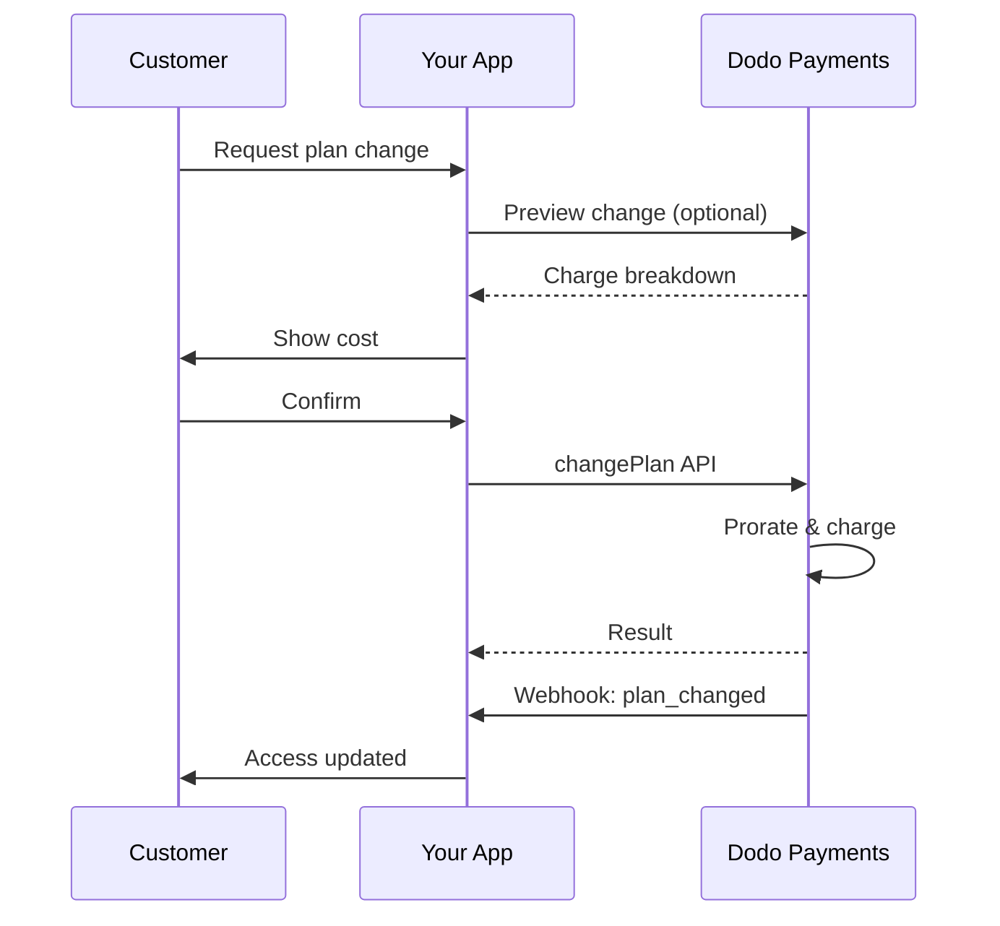
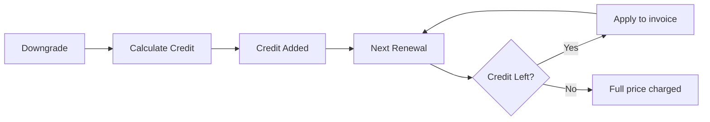
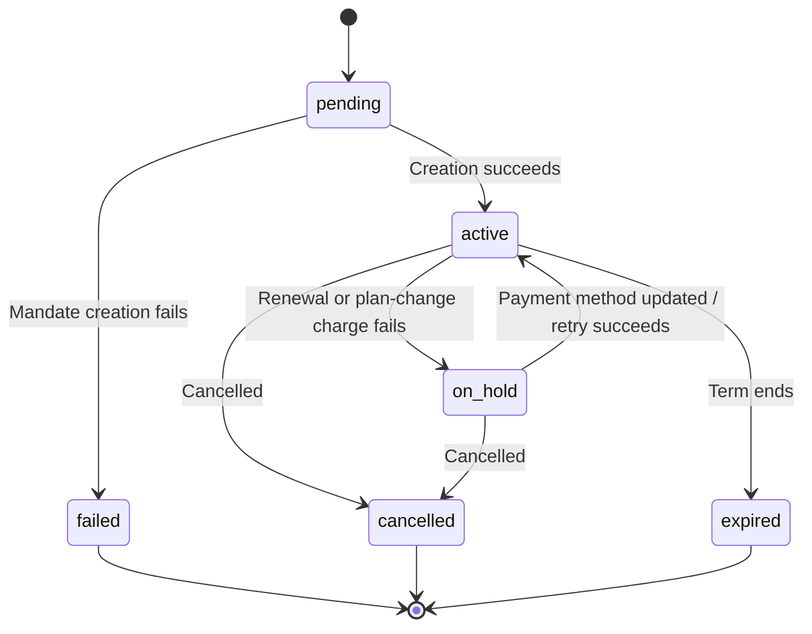

<Info>
Subscriptions let you sell ongoing access with automated renewals. Use flexible billing cycles, free trials, plan changes, and add‑ons to tailor pricing for each customer.
</Info>

<CardGroup cols={2}>
<Card title="Upgrade & Downgrade" icon="repeat" href="/developer-resources/subscription-upgrade-downgrade">
Control plan changes with proration and quantity updates.
</Card>

<Card title="On‑Demand Subscriptions" icon="bolt" href="/developer-resources/ondemand-subscriptions">
Authorize a mandate now and charge later with custom amounts.
</Card>

<Card title="Customer Portal" icon="id-card" href="/features/customer-portal">
Let customers manage plans, billing, and cancellations.
</Card>

<Card title="Subscription Webhooks" icon="code" href="/developer-resources/webhooks/intents/subscription">
React to lifecycle events like created, renewed, and canceled.
</Card>
</CardGroup>

## What Are Subscriptions?

Subscriptions are recurring products customers purchase on a schedule. They’re ideal for:

- **SaaS licenses**: Apps, APIs, or platform access
- **Memberships**: Communities, programs, or clubs
- **Digital content**: Courses, media, or premium content
- **Support plans**: SLAs, success packages, or maintenance

## Key Benefits

- **Predictable revenue**: Recurring billing with automated renewals
- **Flexible cycles**: Monthly, annual, custom intervals, and trials
- **Plan agility**: Proration for upgrades and downgrades
- **Add‑ons and seats**: Attach optional, quantifiable upgrades
- **Seamless checkout**: Hosted checkout and customer portal
- **Developer-first**: Clear APIs for creation, changes, and usage tracking

## Creating Subscriptions

Create subscription products in your Dodo Payments dashboard, then sell them through checkout or your API. Separating products from active subscriptions lets you version pricing, attach add‑ons, and track performance independently.

### Subscription product creation

Configure the fields in the dashboard to define how your subscription sells, renews, and bills. The sections below map directly to what you see in the creation form.

#### Product details

- **Product Name** (required): The display name shown in checkout, customer portal, and invoices.
- **Product Description** (required): A clear value statement that appears in checkout and invoices.
- **Product Image** (required): PNG/JPG/WebP up to 3 MB. Used on checkout and invoices.
- **Brand**: Associate the product with a specific brand for theming and emails.
- **Tax Category** (required): Choose the category (for example, SaaS) to determine tax rules.

<Tip>
Pick the most accurate tax category to ensure correct tax collection per region.
</Tip>

#### Pricing

- **Type de tarification** : Choisissez <b>Abonnement</b> (ce guide). Les alternatives sont Paiement Unique et Facturation Basée sur l'Utilisation.
- **Prix** (obligatoire) : Prix récurrent de base avec la devise. Le prix doit être d'au moins **1 $** (ou l'équivalent dans la devise choisie). Les montants inférieurs à ce minimum ne sont pas pris en charge et l'abonnement ne fonctionnera pas.
- **Remise applicable (%)** : Pourcentage de remise optionnel appliqué au prix de base ; reflété lors du paiement et sur les factures.
- **Répéter le paiement tous les** (obligatoire) : Intervalle pour les renouvellements, par exemple, tous les 1 mois. Sélectionnez la cadence (mois ou années) et la quantité.
- **Période d'abonnement** (obligatoire) : Durée totale pendant laquelle l'abonnement reste actif (par exemple, 10 ans). Après cette période, les renouvellements cessent sauf prolongation.
- **Jours de période d'essai** (obligatoire) : Définissez la durée de l'essai en jours. Utilisez 0 pour désactiver les essais. Le premier prélèvement se produit automatiquement à la fin de l'essai.
- **Sélectionner l'add-on** : Attachez jusqu'à 10 add-ons que les clients peuvent acheter avec le plan de base.

<Warning>
Changing pricing on an active product affects new purchases. Existing subscriptions follow your plan‑change and proration settings.
</Warning>

<Info>
Add‑ons are ideal for quantifiable extras such as seats or storage. You can control allowed quantities and proration behavior when customers change them.
</Info>

#### Advanced settings

- **Tax Inclusive Pricing**: Display prices inclusive of applicable taxes. Final tax calculation still varies by customer location.
- **Generate license keys**: Issue a unique key to each customer after purchase. See the <a href="/features/license-keys">License Keys</a> guide.
- **Digital Product Delivery**: Deliver files or content automatically after purchase. Learn more in <a href="/features/digital-product-delivery">Digital Product Delivery</a>.
- **Metadata**: Attach custom key–value pairs for internal tagging or client integrations. See <a href="/api-reference/metadata">Metadata</a>.

<Tip>
Use metadata to store identifiers from your system (e.g., accountId) so you can reconcile events and invoices later.
</Tip>

## Subscription Trials

Trials let customers access subscriptions without immediate payment. The first charge occurs automatically when the trial ends.

### Configuring Trials

Set **Trial Period Days** in the product pricing section (use `0` to disable). You can override this when creating subscriptions:

```typescript
// Via subscription creation
const subscription = await client.subscriptions.create({
  customer_id: 'cus_123',
  product_id: 'prod_monthly',
  trial_period_days: 14  // Overrides product's trial period
});

// Via checkout session
const session = await client.checkoutSessions.create({
  product_cart: [{ product_id: 'prod_monthly', quantity: 1 }],
  subscription_data: { trial_period_days: 14 }
});
```

<Warning>
The `trial_period_days` value must be between 0 and 10,000 days.
</Warning>

### Detecting Trial Status

<Warning>
Currently, there is no direct field to detect trial status. The following is a workaround that requires querying payments, which is inefficient. We are working on a more efficient solution.
</Warning>

To determine if a subscription is in trial, retrieve the list of payments for the subscription. If there is exactly one payment with amount 0, the subscription is in trial period:

```typescript
const subscription = await client.subscriptions.retrieve('sub_123');
const payments = await client.payments.list({
  subscription_id: subscription.subscription_id
});

// Check if subscription is in trial
const isInTrial = payments.items.length === 1 && 
                  payments.items[0].total_amount === 0;
```

### Updating Trial Period

Extend the trial by updating `next_billing_date`:

```typescript
await client.subscriptions.update('sub_123', {
  next_billing_date: '2025-02-15T00:00:00Z'  // New trial end date
});
```

<Warning>
You cannot set `next_billing_date` to a past time. The date must be in the future.
</Warning>

## Subscription Plan Changes

Plan changes let you upgrade or downgrade subscriptions, adjust quantities, or migrate to different products. Depending on the proration mode you select, a change may trigger an immediate charge, create credit, or apply no billing adjustment.

<Tip>
You can change subscription plans and update the next billing date directly from the Dodo Payments dashboard. This provides a quick way to adjust subscriptions for customer support requests, promotional upgrades, or plan migrations without making API calls.
</Tip>

<Tip>
**Enable self-service plan changes:** Want customers to upgrade or downgrade their own subscriptions via the Customer Portal? Add your subscription products to a Product Collection and enable "Allow Subscription Updates" in your Subscription Settings.
</Tip>



<Card title="Product Collections" icon="layer-group" href="/features/product-collections">
  Group related products into collections to enable seamless upgrade/downgrade paths in the Customer Portal.
</Card>

### Proration Modes

Choose how customers are billed when changing plans:

<Info>
**Quick comparison of the four proration modes:**

| | `prorated_immediately` | `difference_immediately` | `full_immediately` | `do_not_bill` |
|---|---|---|---|---|
| **Mise à niveau** | Frais au prorata pour les jours restants | Différence de prix totale facturée | Prix total du nouveau plan facturé | Aucun frais — changement immédiat |
| **Rétrogradation** | Crédit au prorata pour les jours restants | Différence de prix totale en tant que crédit | Aucun crédit, pleine charge | Aucun crédit — changement immédiat |
| **Cycle de facturation** | Remis à aujourd'hui | Remis à aujourd'hui | Remis à aujourd'hui | Reste le même |
| **Meilleur pour** | Facturation équitable basée sur le temps | Changements de niveaux simples | Réinitialisations du cycle de facturation | Migrations gratuites ou changements à titre gracieux |
</Info>

#### `prorated_immediately`
Charges prorated amount based on remaining time in the current billing cycle. Best for fair billing that accounts for unused time.

```typescript
await client.subscriptions.changePlan('sub_123', {
  product_id: 'prod_pro',
  quantity: 1,
  proration_billing_mode: 'prorated_immediately'
});
```

#### `difference_immediately`
Charges the price difference immediately (upgrade) or adds credit for future renewals (downgrade). Best for simple upgrade/downgrade scenarios.

```typescript
// Upgrade: charges $50 (difference between $30 and $80)
// Downgrade: credits remaining value, auto-applied to renewals
await client.subscriptions.changePlan('sub_123', {
  product_id: 'prod_pro',
  quantity: 1,
  proration_billing_mode: 'difference_immediately'
});
```

<Info>
Credits from downgrades using `difference_immediately` are subscription-scoped and auto-applied to future renewals. They're distinct from <a href="/features/credit-based-billing">Credit-Based Billing</a> entitlements.
</Info>

When a customer downgrades with `difference_immediately`, the unused value becomes a subscription-scoped credit that automatically offsets future renewals:



#### `full_immediately`
Charges full new plan amount immediately, ignoring remaining time. Best for resetting billing cycles.

```typescript
await client.subscriptions.changePlan('sub_123', {
  product_id: 'prod_monthly',
  quantity: 1,
  proration_billing_mode: 'full_immediately'
});
```

#### `do_not_bill`
Switches to the new plan without any billing adjustment. No proration charges, no credits — the customer simply moves to the new plan. Best for courtesy migrations, free plan switches, or scenarios where you want to absorb the cost difference.

```typescript
await client.subscriptions.changePlan('sub_123', {
  product_id: 'prod_new_plan',
  quantity: 1,
  proration_billing_mode: 'do_not_bill'
});
```

<AccordionGroup>
<Accordion title="Example: Prorated upgrade calculation">

**Scenario**: Customer on Basic ($30/month) upgrades to Pro ($80/month) on day 16 of a 30-day cycle using `prorated_immediately`.

```
Unused credit from Basic = $30 × (15 remaining / 30 total) = $15.00
Prorated cost of Pro     = $80 × (15 remaining / 30 total) = $40.00
────────────────────────────────────────────────────────────────────
Immediate charge         = $40.00 − $15.00 = $25.00
```

Prochain renouvellement le **15 février** (16 janvier + 30 jours) : **80,00 $/mois**.

<Tip>
For more detailed calculation examples and edge cases, see our full [Upgrade & Downgrade Guide](/developer-resources/subscription-upgrade-downgrade).
</Tip>

</Accordion>
<Accordion title="Example: Downgrade credit calculation">

**Scenario**: Customer on Pro ($80/month) downgrades to Starter ($20/month) using `difference_immediately`.

```
Credit = Old plan − New plan = $80 − $20 = $60.00
```

The $60 credit auto-applies to future renewals:
- Renewal 1: $20 − $20 (credit) = **$0.00** ($40 credit remaining)
- Renewal 2: $20 − $20 (credit) = **$0.00** ($20 credit remaining)  
- Renewal 3: $20 − $20 (credit) = **$0.00** (credit exhausted)
- Renewal 4: **$20.00** (full price)

<Info>
Learn more about how credits are managed in the [Upgrade & Downgrade Guide](/developer-resources/subscription-upgrade-downgrade).
</Info>

</Accordion>
</AccordionGroup>

### Changing Plans with Add-ons

Modify add-ons when changing plans. Add-ons are included in proration calculations:

```typescript
await client.subscriptions.changePlan('sub_123', {
  product_id: 'prod_pro',
  quantity: 1,
  proration_billing_mode: 'difference_immediately',
  addons: [{ addon_id: 'addon_extra_seats', quantity: 2 }]  // Add add-ons
  // addons: []  // Empty array removes all existing add-ons
});
```

<Info>
Plan changes trigger immediate charges. Failed charges may move the subscription to `on_hold` status. Track changes via `subscription.plan_changed` webhook events.
</Info>

### Previewing Plan Changes

Before committing to a plan change, preview the exact charge and resulting subscription:

```typescript
const preview = await client.subscriptions.previewChangePlan('sub_123', {
  product_id: 'prod_pro',
  quantity: 1,
  proration_billing_mode: 'prorated_immediately'
});

// Show customer the charge before confirming
console.log('You will be charged:', preview.immediate_charge.summary);
```

<Card title="Preview Change Plan API" icon="eye" href="/api-reference/subscriptions/preview-change-plan">
  Preview plan changes before committing to them.
</Card>

## Subscription States

Un abonnement passe par un ensemble défini de statuts au cours de son cycle de vie. Ce tableau est la référence pour chaque statut, ce qui le cause et comment (ou si) vous pouvez le récupérer.

| Statut | Ce que cela signifie | Récupérable ? | Chemin de récupération / prochaine étape |
|--------|----------------------|---------------|---------------------------|
| `pending` | L'abonnement est en cours de création ou de traitement | — | Attendre `subscription.active` (ou `subscription.failed`) |
| `active` | L'abonnement est actif et se renouvellera automatiquement | — | Aucune action nécessaire |
| `on_hold` | Un paiement de renouvellement (ou un changement de plan) a échoué ; l'abonnement est en pause | **Oui** | Mettre à jour la méthode de paiement pour réactiver — automatiquement via [Relances de paiement](/features/recovery/payment-retries) et [Recouvrement](/features/recovery/subscription-dunning), ou manuellement via l'[API de mise à jour de la méthode de paiement](/api-reference/subscriptions/update-payment-method) |
| `cancelled` | L'abonnement a été annulé et ne se renouvellera pas | Réachat uniquement | Le client doit commencer un nouvel abonnement ; [Recouvrement](/features/recovery/subscription-dunning) peut inciter à un réachat |
| `failed` | L'**initialisation** de l'abonnement a échoué (le mandat initial ou le paiement n'a pas réussi) | **Non — terminal** | Le client doit créer un nouvel abonnement avec une méthode de paiement fonctionnelle |
| `expired` | L'abonnement a atteint la fin de son terme | — | Le client doit commencer un nouvel abonnement si désiré |

<Warning>
`on_hold` et `failed` sont souvent confondus. `on_hold` est un état **récupérable** pour un abonnement déjà actif dont le renouvellement a échoué. `failed` est un état **terminal** qui ne se produit que lorsque la **création initiale** de l'abonnement échoue — il ne peut pas être réactivé.
</Warning>

### Machine à états



### État de mise en pause

Un abonnement entre dans l'état `on_hold` quand :

- Un paiement de renouvellement échoue (fonds insuffisants, carte expirée, etc.)
- Un changement de plan échoue
- L'autorisation de la méthode de paiement échoue

<Warning>
Lorsqu'un abonnement est en état `on_hold`, il ne se renouvellera pas automatiquement. Vous devez mettre à jour la méthode de paiement pour réactiver l'abonnement.
</Warning>

### Réactivation depuis l'état de pause

Pour réactiver un abonnement depuis l'état `on_hold`, mettez à jour la méthode de paiement. Cela permet automatiquement de :

1. Créer une charge pour les montants dus
2. Générer une facture
3. Traiter le paiement avec la nouvelle méthode de paiement
4. Réactiver l'abonnement à l'état `active` après paiement réussi

```typescript
// Reactivate subscription from on_hold
const response = await client.subscriptions.updatePaymentMethod('sub_123', {
  type: 'new',
  return_url: 'https://example.com/return'
});

// For on_hold subscriptions, a charge is automatically created
if (response.payment_id) {
  console.log('Charge created:', response.payment_id);
  // Redirect customer to response.payment_link to complete payment
  // Monitor webhooks for payment.succeeded and subscription.active
}
```

<Info>
Après avoir mis à jour avec succès la méthode de paiement pour un abonnement `on_hold`, vous recevrez `payment.succeeded` suivi par les événements webhook `subscription.active`.
</Info>

### Événements Webhook par transition

Chaque transition émet un webhook afin que vous puissiez gérer la logique d'autorisation sans sondage :

| Transition | Événement |
|------------|----------|
| Abonnement activé | `subscription.active` |
| Renouvellement réussi | `subscription.renewed` |
| Renouvellement échoue → en pause | `subscription.on_hold` |
| Échec de la création | `subscription.failed` |
| Plan amélioré/dégradé | `subscription.plan_changed` |
| Annulé | `subscription.cancelled` |
| Fin du terme | `subscription.expired` |
| Changement de n'importe quel champ | `subscription.updated` |

<Card title="Subscription Webhook Payloads" icon="webhook" href="/developer-resources/webhooks/intents/subscription">
Consultez le schéma de charge utile complet pour les événements du cycle de vie de l'abonnement.
</Card>

## Gestion de l'API

<AccordionGroup>
<Accordion title="Create subscriptions">
Utilisez `POST /subscriptions` pour créer des abonnements programmatiquement à partir de produits, avec des essais et add-ons optionnels.

<Card title="API Reference" icon="code" href="/api-reference/subscriptions/post-subscriptions">
Voir l'API de création d'abonnement.
</Card>
</Accordion>

<Accordion title="Update subscriptions">
Utilisez `PATCH /subscriptions/{id}` pour mettre à jour les quantités, annuler à la prochaine date de facturation ou modifier les métadonnées.

<Card title="API Reference" icon="code" href="/api-reference/subscriptions/patch-subscriptions">
Apprenez à mettre à jour les détails de l'abonnement.
</Card>
</Accordion>

<Accordion title="Change plans (proration)">
Changez le produit actif et les quantités avec des contrôles de proration.

<Card title="API Reference" icon="code" href="/api-reference/subscriptions/change-plan">
Examinez les options de changement de plan.
</Card>
</Accordion>

<Accordion title="On‑demand charges">
Pour les abonnements à la demande, facturez des montants spécifiques à la demande.

<Card title="API Reference" icon="code" href="/api-reference/subscriptions/create-charge">
Facturez un abonnement à la demande.
</Card>
</Accordion>

<Accordion title="List and retrieve">
Utilisez `GET /subscriptions` pour lister tous les abonnements et `GET /subscriptions/{id}` pour récupérer un seul.

<Card title="API Reference" icon="code" href="/api-reference/subscriptions/get-subscriptions">
Parcourez les API de listing et de récupération.
</Card>
</Accordion>

<Accordion title="Usage history">
Récupérez l'utilisation enregistrée pour les modèles de tarification au compteur ou hybrides.

<Card title="API Reference" icon="code" href="/api-reference/subscriptions/get-usage-history">
Consultez l'API d'historique d'utilisation.
</Card>
</Accordion>

<Accordion title="Update payment method">
Mettez à jour la méthode de paiement pour un abonnement. Pour les abonnements actifs, cela met à jour la méthode de paiement pour les renouvellements futurs. Pour les abonnements en état `on_hold`, cela réactive l'abonnement en créant une charge pour les montants restants.

Lors de la génération d'un nouveau lien de méthode de paiement (le type de requête `New`), vous pouvez passer `allowed_payment_method_types` pour restreindre les méthodes de paiement que le client voit sur cette page. Les clients ne verront jamais une méthode qui n'est pas dans la liste, bien que l'inclusion d'une méthode ne garantisse pas qu'elle apparaisse (la disponibilité dépend encore de facteurs tels que le lieu du client et vos paramètres commerciaux).

<Card title="API Reference" icon="code" href="/api-reference/subscriptions/update-payment-method">
Apprenez à mettre à jour les méthodes de paiement et à réactiver les abonnements.
</Card>
</Accordion>
</AccordionGroup>

## Cas d'utilisation courants

- **SaaS et API** : Accès par niveaux avec add-ons pour des sièges ou l'utilisation
- **Contenu et médias** : Accès mensuel avec essais introductifs
- **Plans de support B2B** : Contrats annuels avec add-ons de support premium
- **Outils et plugins** : Clés de licence et versions légalisées

## Exemples d'intégration

### Sessions de paiement (abonnements)
Lors de la création de sessions de paiement, incluez votre produit d'abonnement et des add-ons optionnels :

```typescript
const session = await client.checkoutSessions.create({
  product_cart: [
    {
      product_id: 'prod_subscription',
      quantity: 1
    }
  ]
});
```

### Modifications de plan avec proration
Améliorez ou dégradez un abonnement et contrôlez le comportement de la proration :

```typescript
await client.subscriptions.changePlan('sub_123', {
  product_id: 'prod_new',
  quantity: 1,
  proration_billing_mode: 'difference_immediately'
});
```

### Annulation à la prochaine date de facturation
Planifiez une annulation qui prend effet à la fin de la période de facturation actuelle :

```typescript
await client.subscriptions.update('sub_123', {
  cancel_at_next_billing_date: true
});
```

### Abonnements à la demande
Créez un abonnement à la demande et facturez plus tard si nécessaire :

```typescript
const onDemand = await client.subscriptions.create({
  customer_id: 'cus_123',
  product_id: 'prod_on_demand',
  on_demand: true
});

await client.subscriptions.charge(onDemand.id, {
  amount: 4900,
  currency: 'USD',
  description: 'Extra usage for September'
});
```

### Mise à jour de la méthode de paiement pour un abonnement actif
Mettez à jour la méthode de paiement pour un abonnement actif :

```typescript
// Update with new payment method
const response = await client.subscriptions.updatePaymentMethod('sub_123', {
  type: 'new',
  return_url: 'https://example.com/return'
});

// Or use existing payment method
await client.subscriptions.updatePaymentMethod('sub_123', {
  type: 'existing',
  payment_method_id: 'pm_abc123'
});
```

### Réactivation de l'abonnement en pause
Réactivez un abonnement mis en pause en raison d'un paiement échoué :

```typescript
// Update payment method - automatically creates charge for remaining dues
const response = await client.subscriptions.updatePaymentMethod('sub_123', {
  type: 'new',
  return_url: 'https://example.com/return'
});

if (response.payment_id) {
  // Charge created for remaining dues
  // Redirect customer to response.payment_link
  // Monitor webhooks: payment.succeeded → subscription.active
}
```

## Abonnements avec Mandats conformes à la RBI

  Les abonnements UPI et par carte indienne fonctionnent selon les règlements RBI (Reserve Bank of India) avec des exigences de mandat spécifiques :

  ### Limites de Mandat

  Le type et le montant du mandat dépendent de la charge récurrente de votre abonnement :

  - **Frais en dessous du seuil de mandat (par défaut ₹15 000) :** Nous créons un mandat à la demande pour le montant seuil. Le montant de l'abonnement est facturé périodiquement selon la fréquence de votre abonnement, jusqu'à la limite de mandat.
  - **Frais égaux ou supérieurs au seuil de mandat :** Nous créons un mandat d'abonnement (ou un mandat à la demande) pour le montant exact de l'abonnement.

  Le seuil de mandat est configurable par commerçant ou par demande via `mandate_min_amount_inr_paise` (INR paise). Le montant enregistré auprès de la banque est `max(mandate_floor, billing_amount)` — donc le seuil devient effectivement le plafond d'autorisation côté client lorsque la facturation est inférieure.

Pour des informations détaillées sur les mandats conformes à la RBI et le seuil de mandat configurable pour les méthodes de paiement indiennes, consultez la page <a href="/features/payment-methods/india#configurable-mandate-floor">Méthodes de paiement en Inde</a>.

  ### Considérations d'Amélioration et de Déclassement

  **Important :** Lors d'une amélioration ou d'un déclassement d'abonnement, réfléchissez attentivement aux limites de mandat :

  - Si une amélioration ou un déclassement entraîne un montant de facturation qui dépasse Rs 15 000 et dépasse la limite de paiement actuelle à la demande, le débit peut échouer.
  - Dans de tels cas, le client peut avoir besoin de mettre à jour sa méthode de paiement ou de modifier à nouveau l'abonnement pour établir un nouveau mandat avec la limite correcte.

  ### Autorisation pour Frais de Haute Valeur

  Pour les frais d'abonnement de Rs 15 000 ou plus :

  - Le client sera invité par sa banque à autoriser la transaction.
  - Si le client ne réussit pas à autoriser la transaction, celle-ci échouera et l'abonnement sera mis en pause.

  ### Délai de Traitement de 48 Heures

  **Calendrier de Traitement :** Les frais récurrents sur les cartes indiennes et les abonnements UPI suivent un modèle de traitement unique :

  - Les frais sont **initiés** à la date prévue selon la fréquence de votre abonnement.
  - La **déduction** réelle du compte du client a lieu seulement après **48 heures** à partir de l'initiation du paiement.
  - Cette fenêtre de 48 heures peut s'étendre jusqu'à **2-3 heures** supplémentaires selon les réponses de l'API bancaire.

  ### Fenêtre d'Annulation de Mandat

  Pendant la fenêtre de traitement de 48 heures :

  - Les clients peuvent annuler le mandat via leurs applications bancaires.
  - Si un client annule le mandat pendant cette période, l'abonnement restera **actif** (c'est un cas particulier propre aux abonnements par carte indienne et UPI AutoPay).
  - Cependant, la déduction réelle peut échouer, et dans ce cas, nous mettrons l'abonnement **en pause**.

  **Gestion des Cas Particuliers :** Si vous offrez des avantages, crédits ou utilisations d'abonnement aux clients immédiatement après l'initiation du débit, vous devez gérer cette fenêtre de 48 heures correctement dans votre application. Pensez à :

  - Retarder l'activation des avantages jusqu'à la confirmation du paiement
  - Mettre en œuvre des périodes de grâce ou un accès temporaire
  - Surveiller l'état de l'abonnement pour les annulations de mandat
  - Gérer les états de mise en pause dans votre logique d'application

  <Tip>
  Surveillez les webhooks d'abonnement pour suivre les changements d'état de paiement et gérer les cas particuliers où les mandats sont annulés pendant la fenêtre de 48 heures.
  </Tip>

## Meilleures Pratiques

- **Commencez avec des niveaux clairs** : 2 à 3 plans avec des différences évidentes
- **Communiquez les prix** : Montrez les totaux, la proration et le prochain renouvellement
- **Utilisez judicieusement les essais** : Convertissez avec l'intégration, pas seulement le temps
- **Exploitez les add‑ons** : Gardez les plans de base simples et vendez des extras
- **Testez les changements** : Validez les changements de plan et la proration en mode test

<Info>
Les abonnements sont une base flexible pour des revenus récurrents. Commencez simplement, testez soigneusement et itérez en fonction des métriques d'adoption, de résiliation et d'expansion.
</Info>