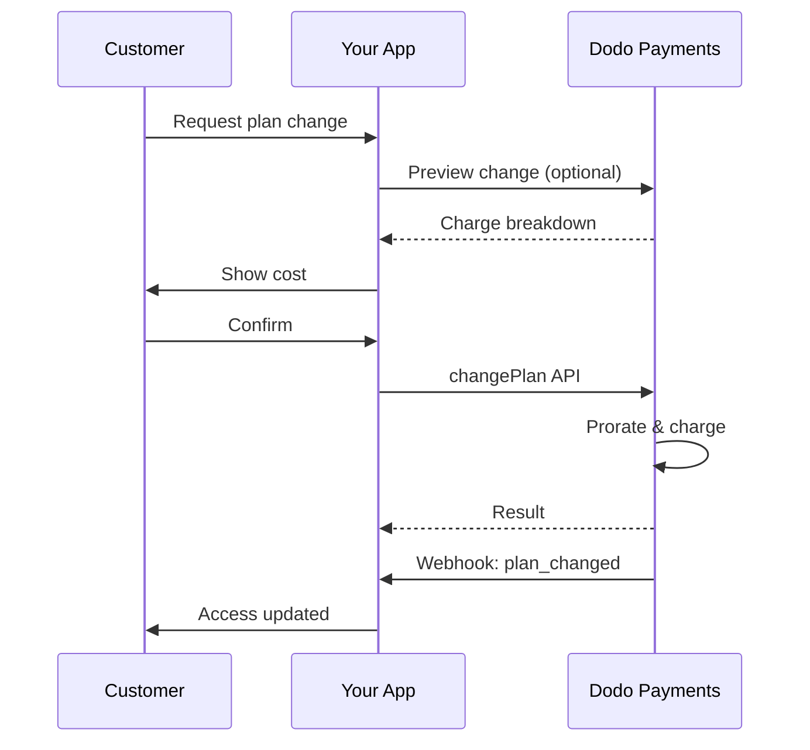
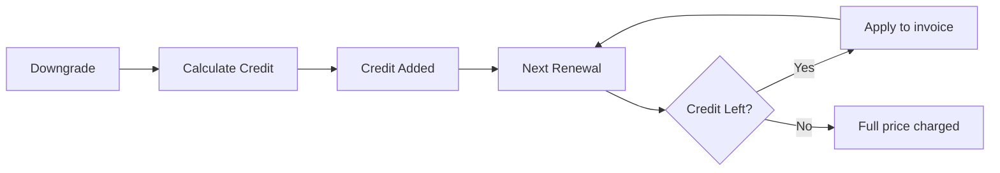

<Info>
Subscriptions let you sell ongoing access with automated renewals. Use flexible billing cycles, free trials, plan changes, and add‑ons to tailor pricing for each customer.
</Info>

<CardGroup cols={2}>
<Card title="Upgrade & Downgrade" icon="repeat" href="/developer-resources/subscription-upgrade-downgrade">
Control plan changes with proration and quantity updates.
</Card>

<Card title="On‑Demand Subscriptions" icon="bolt" href="/developer-resources/ondemand-subscriptions">
Authorize a mandate now and charge later with custom amounts.
</Card>

<Card title="Customer Portal" icon="id-card" href="/features/customer-portal">
Let customers manage plans, billing, and cancellations.
</Card>

<Card title="Subscription Webhooks" icon="code" href="/developer-resources/webhooks/intents/subscription">
React to lifecycle events like created, renewed, and canceled.
</Card>
</CardGroup>

## What Are Subscriptions?

Subscriptions are recurring products customers purchase on a schedule. They’re ideal for:

- **SaaS licenses**: Apps, APIs, or platform access
- **Memberships**: Communities, programs, or clubs
- **Digital content**: Courses, media, or premium content
- **Support plans**: SLAs, success packages, or maintenance

## Key Benefits

- **Predictable revenue**: Recurring billing with automated renewals
- **Flexible cycles**: Monthly, annual, custom intervals, and trials
- **Plan agility**: Proration for upgrades and downgrades
- **Add‑ons and seats**: Attach optional, quantifiable upgrades
- **Seamless checkout**: Hosted checkout and customer portal
- **Developer-first**: Clear APIs for creation, changes, and usage tracking

## Creating Subscriptions

Create subscription products in your Dodo Payments dashboard, then sell them through checkout or your API. Separating products from active subscriptions lets you version pricing, attach add‑ons, and track performance independently.

### Subscription product creation

Configure the fields in the dashboard to define how your subscription sells, renews, and bills. The sections below map directly to what you see in the creation form.

#### Product details

- **Product Name** (required): The display name shown in checkout, customer portal, and invoices.
- **Product Description** (required): A clear value statement that appears in checkout and invoices.
- **Product Image** (required): PNG/JPG/WebP up to 3 MB. Used on checkout and invoices.
- **Brand**: Associate the product with a specific brand for theming and emails.
- **Tax Category** (required): Choose the category (for example, SaaS) to determine tax rules.

<Tip>
Pick the most accurate tax category to ensure correct tax collection per region.
</Tip>

#### Pricing

- **Pricing Type**: Choose <b>Subscription</b> (this guide). Alternatives are Single Payment and Usage Based Billing.
- **Price** (required): Base recurring price with currency.
- **Discount Applicable (%)**: Optional percentage discount applied to the base price; reflected in checkout and invoices.
- **Repeat payment every** (required): Interval for renewals, e.g., every 1 Month. Select the cadence (months or years) and quantity.
- **Subscription Period** (required): Total term for which the subscription remains active (e.g., 10 Years). After this period ends, renewals stop unless extended.
- **Trial Period Days** (required): Set trial length in days. Use 0 to disable trials. The first charge occurs automatically when the trial ends.
- **Select add‑on**: Attach up to 10 add‑ons that customers can purchase alongside the base plan.

<Warning>
Changing pricing on an active product affects new purchases. Existing subscriptions follow your plan‑change and proration settings.
</Warning>

<Info>
Add‑ons are ideal for quantifiable extras such as seats or storage. You can control allowed quantities and proration behavior when customers change them.
</Info>

#### Advanced settings

- **Tax Inclusive Pricing**: Display prices inclusive of applicable taxes. Final tax calculation still varies by customer location.
- **Generate license keys**: Issue a unique key to each customer after purchase. See the <a href="/features/license-keys">License Keys</a> guide.
- **Digital Product Delivery**: Deliver files or content automatically after purchase. Learn more in <a href="/features/digital-product-delivery">Digital Product Delivery</a>.
- **Metadata**: Attach custom key–value pairs for internal tagging or client integrations. See <a href="/api-reference/metadata">Metadata</a>.

<Tip>
Use metadata to store identifiers from your system (e.g., accountId) so you can reconcile events and invoices later.
</Tip>

## Subscription Trials

Trials let customers access subscriptions without immediate payment. The first charge occurs automatically when the trial ends.

### Configuring Trials

Set **Trial Period Days** in the product pricing section (use `0` to disable). You can override this when creating subscriptions:

```typescript
// Via subscription creation
const subscription = await client.subscriptions.create({
  customer_id: 'cus_123',
  product_id: 'prod_monthly',
  trial_period_days: 14  // Overrides product's trial period
});

// Via checkout session
const session = await client.checkoutSessions.create({
  product_cart: [{ product_id: 'prod_monthly', quantity: 1 }],
  subscription_data: { trial_period_days: 14 }
});
```

<Warning>
The `trial_period_days` value must be between 0 and 10,000 days.
</Warning>

### Detecting Trial Status

<Warning>
Currently, there is no direct field to detect trial status. The following is a workaround that requires querying payments, which is inefficient. We are working on a more efficient solution.
</Warning>

To determine if a subscription is in trial, retrieve the list of payments for the subscription. If there is exactly one payment with amount 0, the subscription is in trial period:

```typescript
const subscription = await client.subscriptions.retrieve('sub_123');
const payments = await client.payments.list({
  subscription_id: subscription.subscription_id
});

// Check if subscription is in trial
const isInTrial = payments.items.length === 1 && 
                  payments.items[0].total_amount === 0;
```

### Updating Trial Period

Extend the trial by updating `next_billing_date`:

```typescript
await client.subscriptions.update('sub_123', {
  next_billing_date: '2025-02-15T00:00:00Z'  // New trial end date
});
```

<Warning>
You cannot set `next_billing_date` to a past time. The date must be in the future.
</Warning>

## Subscription Plan Changes

Plan changes let you upgrade or downgrade subscriptions, adjust quantities, or migrate to different products. Depending on the proration mode you select, a change may trigger an immediate charge, create credit, or apply no billing adjustment.

<Tip>
You can change subscription plans and update the next billing date directly from the Dodo Payments dashboard. This provides a quick way to adjust subscriptions for customer support requests, promotional upgrades, or plan migrations without making API calls.
</Tip>

<Tip>
**Enable self-service plan changes:** Want customers to upgrade or downgrade their own subscriptions via the Customer Portal? Add your subscription products to a Product Collection and enable "Allow Subscription Updates" in your Subscription Settings.
</Tip>



<Card title="Product Collections" icon="layer-group" href="/features/product-collections">
  Group related products into collections to enable seamless upgrade/downgrade paths in the Customer Portal.
</Card>

### Proration Modes

Choose how customers are billed when changing plans:

<Info>
**Quick comparison of the four proration modes:**

| | `prorated_immediately` | `difference_immediately` | `full_immediately` | `do_not_bill` |
|---|---|---|---|---|
| **Upgrade** | Prorated charge for remaining days | Full price difference charged | Full new plan price charged | No charge — switch immediately |
| **Downgrade** | Prorated credit for remaining days | Full price difference as credit | No credit, full charge | No credit — switch immediately |
| **Billing cycle** | Stays the same | Stays the same | Resets to today | Stays the same |
| **Best for** | Fair time-based billing | Simple tier changes | Billing cycle resets | Free migrations or courtesy switches |
</Info>

#### `prorated_immediately`
Charges prorated amount based on remaining time in the current billing cycle. Best for fair billing that accounts for unused time.

```typescript
await client.subscriptions.changePlan('sub_123', {
  product_id: 'prod_pro',
  quantity: 1,
  proration_billing_mode: 'prorated_immediately'
});
```

#### `difference_immediately`
Charges the price difference immediately (upgrade) or adds credit for future renewals (downgrade). Best for simple upgrade/downgrade scenarios.

```typescript
// Upgrade: charges $50 (difference between $30 and $80)
// Downgrade: credits remaining value, auto-applied to renewals
await client.subscriptions.changePlan('sub_123', {
  product_id: 'prod_pro',
  quantity: 1,
  proration_billing_mode: 'difference_immediately'
});
```

<Info>
Credits from downgrades using `difference_immediately` are subscription-scoped and auto-applied to future renewals. They're distinct from <a href="/features/credit-based-billing">Credit-Based Billing</a> entitlements.
</Info>

When a customer downgrades with `difference_immediately`, the unused value becomes a subscription-scoped credit that automatically offsets future renewals:



#### `full_immediately`
Charges full new plan amount immediately, ignoring remaining time. Best for resetting billing cycles.

```typescript
await client.subscriptions.changePlan('sub_123', {
  product_id: 'prod_monthly',
  quantity: 1,
  proration_billing_mode: 'full_immediately'
});
```

#### `do_not_bill`
Switches to the new plan without any billing adjustment. No proration charges, no credits — the customer simply moves to the new plan. Best for courtesy migrations, free plan switches, or scenarios where you want to absorb the cost difference.

```typescript
await client.subscriptions.changePlan('sub_123', {
  product_id: 'prod_new_plan',
  quantity: 1,
  proration_billing_mode: 'do_not_bill'
});
```

<AccordionGroup>
<Accordion title="Example: Prorated upgrade calculation">

**Scenario**: Customer on Basic ($30/month) upgrades to Pro ($80/month) on day 16 of a 30-day cycle using `prorated_immediately`.

```
Unused credit from Basic = $30 × (15 remaining / 30 total) = $15.00
Prorated cost of Pro     = $80 × (15 remaining / 30 total) = $40.00
────────────────────────────────────────────────────────────────────
Immediate charge         = $40.00 − $15.00 = $25.00
```

Next renewal on the original billing date: **$80.00/month**.

<Tip>
For more detailed calculation examples and edge cases, see our full [Upgrade & Downgrade Guide](/developer-resources/subscription-upgrade-downgrade).
</Tip>

</Accordion>
<Accordion title="Example: Downgrade credit calculation">

**Scenario**: Customer on Pro ($80/month) downgrades to Starter ($20/month) using `difference_immediately`.

```
Credit = Old plan − New plan = $80 − $20 = $60.00
```

The $60 credit auto-applies to future renewals:
- Renewal 1: $20 − $20 (credit) = **$0.00** ($40 credit remaining)
- Renewal 2: $20 − $20 (credit) = **$0.00** ($20 credit remaining)  
- Renewal 3: $20 − $20 (credit) = **$0.00** (credit exhausted)
- Renewal 4: **$20.00** (full price)

<Info>
Learn more about how credits are managed in the [Upgrade & Downgrade Guide](/developer-resources/subscription-upgrade-downgrade).
</Info>

</Accordion>
</AccordionGroup>

### Changing Plans with Add-ons

Modify add-ons when changing plans. Add-ons are included in proration calculations:

```typescript
await client.subscriptions.changePlan('sub_123', {
  product_id: 'prod_pro',
  quantity: 1,
  proration_billing_mode: 'difference_immediately',
  addons: [{ addon_id: 'addon_extra_seats', quantity: 2 }]  // Add add-ons
  // addons: []  // Empty array removes all existing add-ons
});
```

<Info>
Plan changes trigger immediate charges. Failed charges may move the subscription to `on_hold` status. Track changes via `subscription.plan_changed` webhook events.
</Info>

### Previewing Plan Changes

Before committing to a plan change, preview the exact charge and resulting subscription:

```typescript
const preview = await client.subscriptions.previewChangePlan('sub_123', {
  product_id: 'prod_pro',
  quantity: 1,
  proration_billing_mode: 'prorated_immediately'
});

// Show customer the charge before confirming
console.log('You will be charged:', preview.immediate_charge.summary);
```

<Card title="Preview Change Plan API" icon="eye" href="/api-reference/subscriptions/preview-change-plan">
  Preview plan changes before committing to them.
</Card>

## Subscription States

Subscriptions can be in different states throughout their lifecycle:

- **`active`**: Subscription is active and will renew automatically
- **`on_hold`**: Subscription is paused due to failed payment. Payment method update required to reactivate
- **`cancelled`**: Subscription is cancelled and will not renew
- **`expired`**: Subscription has reached its end date
- **`pending`**: Subscription is being created or processed

### On Hold State

A subscription enters `on_hold` state when:

- A renewal payment fails (insufficient funds, expired card, etc.)
- A plan change charge fails
- Payment method authorization fails

<Warning>
When a subscription is in `on_hold` state, it will not renew automatically. You must update the payment method to reactivate the subscription.
</Warning>

### Reactivating from On Hold

To reactivate a subscription from `on_hold` state, update the payment method. This automatically:

1. Creates a charge for remaining dues
2. Generates an invoice
3. Processes the payment using the new payment method
4. Reactivates the subscription to `active` state upon successful payment

```typescript
// Reactivate subscription from on_hold
const response = await client.subscriptions.updatePaymentMethod('sub_123', {
  type: 'new',
  return_url: 'https://example.com/return'
});

// For on_hold subscriptions, a charge is automatically created
if (response.payment_id) {
  console.log('Charge created:', response.payment_id);
  // Redirect customer to response.payment_link to complete payment
  // Monitor webhooks for payment.succeeded and subscription.active
}
```

<Info>
After successfully updating the payment method for an `on_hold` subscription, you'll receive `payment.succeeded` followed by `subscription.active` webhook events.
</Info>

## API Management

<AccordionGroup>
<Accordion title="Create subscriptions">
Use `POST /subscriptions` to create subscriptions programmatically from products, with optional trials and add‑ons.

<Card title="API Reference" icon="code" href="/api-reference/subscriptions/post-subscriptions">
View the create subscription API.
</Card>
</Accordion>

<Accordion title="Update subscriptions">
Use `PATCH /subscriptions/{id}` to update quantities, cancel at next billing date, or modify metadata.

<Card title="API Reference" icon="code" href="/api-reference/subscriptions/patch-subscriptions">
Learn how to update subscription details.
</Card>
</Accordion>

<Accordion title="Change plans (proration)">
Change the active product and quantities with proration controls.

<Card title="API Reference" icon="code" href="/api-reference/subscriptions/change-plan">
Review plan change options.
</Card>
</Accordion>

<Accordion title="On‑demand charges">
For on‑demand subscriptions, charge specific amounts on demand.

<Card title="API Reference" icon="code" href="/api-reference/subscriptions/create-charge">
Charge an on‑demand subscription.
</Card>
</Accordion>

<Accordion title="List and retrieve">
Use `GET /subscriptions` to list all subscriptions and `GET /subscriptions/{id}` to retrieve one.

<Card title="API Reference" icon="code" href="/api-reference/subscriptions/get-subscriptions">
Browse listing and retrieval APIs.
</Card>
</Accordion>

<Accordion title="Usage history">
Fetch recorded usage for metered or hybrid pricing models.

<Card title="API Reference" icon="code" href="/api-reference/subscriptions/get-usage-history">
See usage history API.
</Card>
</Accordion>

<Accordion title="Update payment method">
Update the payment method for a subscription. For active subscriptions, this updates the payment method for future renewals. For subscriptions in `on_hold` state, this reactivates the subscription by creating a charge for remaining dues.

<Card title="API Reference" icon="code" href="/api-reference/subscriptions/update-payment-method">
Learn how to update payment methods and reactivate subscriptions.
</Card>
</Accordion>
</AccordionGroup>

## Common Use Cases

- **SaaS and APIs**: Tiered access with add‑ons for seats or usage
- **Content and media**: Monthly access with introductory trials
- **B2B support plans**: Annual contracts with premium support add‑ons
- **Tools and plugins**: License keys and versioned releases

## Integration Examples

### Checkout Sessions (subscriptions)
When creating checkout sessions, include your subscription product and optional add‑ons:

```typescript
const session = await client.checkoutSessions.create({
  product_cart: [
    {
      product_id: 'prod_subscription',
      quantity: 1
    }
  ]
});
```

### Plan changes with proration
Upgrade or downgrade a subscription and control proration behavior:

```typescript
await client.subscriptions.changePlan('sub_123', {
  product_id: 'prod_new',
  quantity: 1,
  proration_billing_mode: 'difference_immediately'
});
```

### Cancel at next billing date
Schedule a cancellation that takes effect at the end of the current billing period:

```typescript
await client.subscriptions.update('sub_123', {
  cancel_at_next_billing_date: true
});
```

### On‑demand subscriptions
Create an on‑demand subscription and charge later as needed:

```typescript
const onDemand = await client.subscriptions.create({
  customer_id: 'cus_123',
  product_id: 'prod_on_demand',
  on_demand: true
});

await client.subscriptions.createCharge(onDemand.id, {
  amount: 4900,
  currency: 'USD',
  description: 'Extra usage for September'
});
```

### Update payment method for active subscription
Update the payment method for an active subscription:

```typescript
// Update with new payment method
const response = await client.subscriptions.updatePaymentMethod('sub_123', {
  type: 'new',
  return_url: 'https://example.com/return'
});

// Or use existing payment method
await client.subscriptions.updatePaymentMethod('sub_123', {
  type: 'existing',
  payment_method_id: 'pm_abc123'
});
```

### Reactivate subscription from on_hold
Reactivate a subscription that went on hold due to failed payment:

```typescript
// Update payment method - automatically creates charge for remaining dues
const response = await client.subscriptions.updatePaymentMethod('sub_123', {
  type: 'new',
  return_url: 'https://example.com/return'
});

if (response.payment_id) {
  // Charge created for remaining dues
  // Redirect customer to response.payment_link
  // Monitor webhooks: payment.succeeded → subscription.active
}
```

## Subscriptions with RBI-Compliant Mandates

  UPI and Indian card subscriptions operate under RBI (Reserve Bank of India) regulations with specific mandate requirements:

  ### Mandate Limits

  The mandate type and amount depend on your subscription's recurring charge:

  - **Frais en dessous du seuil du mandat (par défaut ₹15,000) :** Nous créons un mandat à la demande pour le montant minimum. Le montant de l'abonnement est prélevé périodiquement selon votre fréquence d'abonnement, jusqu'à la limite du mandat.
  - **Frais au niveau ou au-dessus du seuil du mandat :** Nous créons un mandat d'abonnement (ou un mandat à la demande) pour le montant exact de l'abonnement.

  Le seuil du mandat est configurable par marchand ou par demande via `mandate_min_amount_inr_paise` (INR paise). Le montant enregistré auprès de la banque est `max(mandate_floor, billing_amount)` — ainsi, le seuil devient effectivement le plafond d'autorisation côté client lorsque la facturation est inférieure.

Pour des informations détaillées sur les mandats conformes à la RBI et le seuil de mandat configurable pour les méthodes de paiement indiennes, consultez la page <a href="/features/payment-methods/india#configurable-mandate-floor">Méthodes de paiement en Inde</a>.

  ### Considérations sur la mise à niveau et la rétrogradation

  **Important :** Lorsque vous mettez à niveau ou rétrogradez les abonnements, considérez attentivement les limites de mandat :

  - Si une mise à niveau/rétrogradation entraîne un montant de frais supérieur à 15 000 Rs et dépasse la limite de paiement à la demande existante, la charge de transaction peut échouer.
  - Dans de tels cas, le client peut devoir mettre à jour sa méthode de paiement ou modifier à nouveau l'abonnement pour établir un nouveau mandat avec la bonne limite.

  ### Autorisation pour les frais de grande valeur

  Pour les frais d'abonnement de 15 000 Rs ou plus :

  - Le client sera invité par sa banque à autoriser la transaction.
  - Si le client n'autorise pas la transaction, celle-ci échouera et l'abonnement sera suspendu.

  ### Délai de traitement de 48 heures

  **Chronologie du traitement :** Les frais récurrents sur les cartes indiennes et les abonnements UPI suivent un schéma de traitement unique :

  - Les frais sont **initiés** à la date prévue selon votre fréquence d'abonnement.
  - La **déduction** réelle du compte du client a lieu seulement après **48 heures** depuis l'initiation du paiement.
  - Cette fenêtre de 48 heures peut être prolongée de **2-3 heures supplémentaires** selon les réponses des API bancaires.

  ### Fenêtre d'annulation du mandat

  Pendant la fenêtre de traitement de 48 heures :

  - Les clients peuvent annuler le mandat via leurs applications bancaires.
  - Si un client annule le mandat pendant cette période, l'abonnement restera **actif** (c'est un cas particulier spécifique aux abonnements AutoPay par carte indienne et UPI).
  - Cependant, la déduction réelle peut échouer, et dans ce cas, nous mettrons l'abonnement **en attente**.

  **Gestion des cas particuliers :** Si vous fournissez des avantages, crédits ou utilisation d'abonnement aux clients immédiatement après l'initiation des frais, vous devez gérer cette fenêtre de 48 heures de manière appropriée dans votre application. Considérez :

  - Retarder l'activation des avantages jusqu'à la confirmation du paiement
  - Mettre en œuvre des périodes de grâce ou un accès temporaire
  - Surveiller le statut de l'abonnement pour les annulations de mandat
  - Gérer les états de suspension de l'abonnement dans votre logique d'application

  <Tip>
  Surveillez les webhooks d'abonnement pour suivre les changements de statut de paiement et gérer les cas particuliers où les mandats sont annulés pendant la fenêtre de 48 heures.
  </Tip>

## Meilleures Pratiques

- **Commencez par des niveaux clairs :** 2–3 plans avec des différences évidentes
- **Communiquez le tarif :** Montrez les totaux, la proratisation et le prochain renouvellement
- **Utilisez les essais judicieusement :** Convertissez avec l'intégration, pas seulement le temps
- **Exploitez les compléments :** Gardez les plans de base simples et proposez des extras
- **Testez les changements :** Validez les changements de plan et la proratisation en mode test

<Info>
Les abonnements sont une base flexible pour les revenus récurrents. Commencez simple, testez soigneusement et itérez en fonction des métriques d'adoption, de rétention et d'expansion.
</Info>