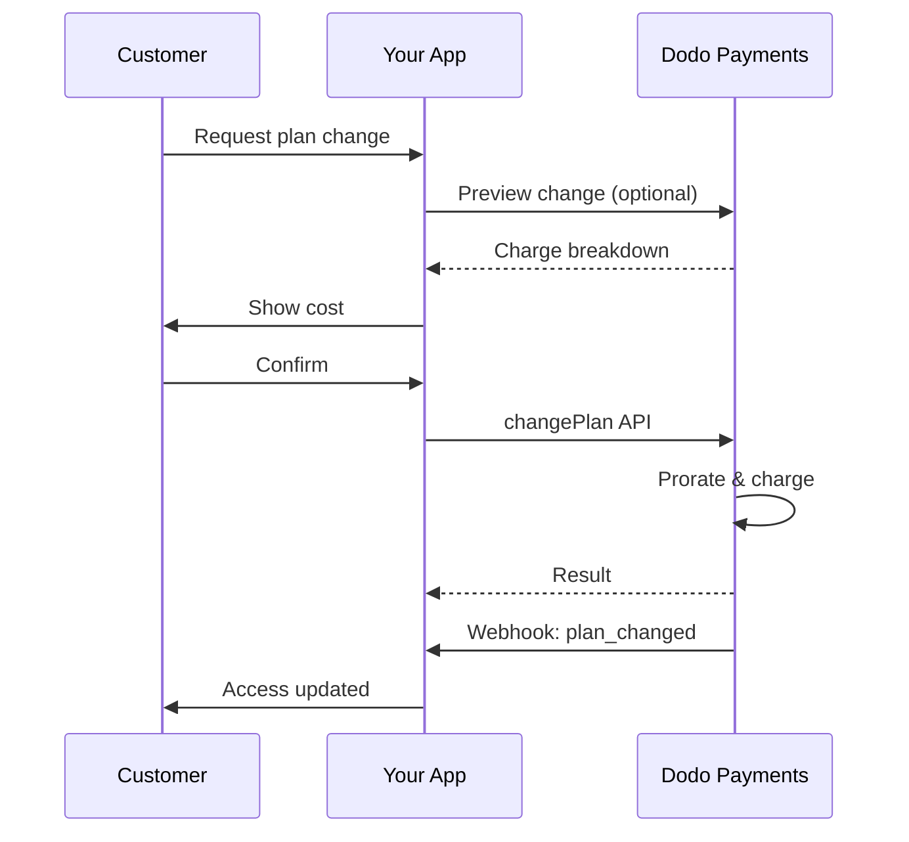
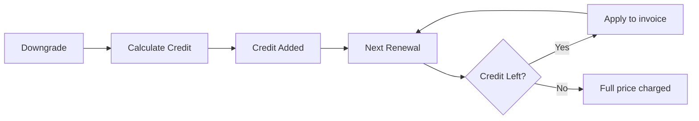

<Info>
Les abonnements vous permettent de vendre un accès continu avec des renouvellements automatisés. Utilisez des cycles de facturation flexibles, des essais gratuits, des changements de plan et des options supplémentaires pour adapter les prix à chaque client.
</Info>

<CardGroup cols={2}>
<Card title="Mise à niveau & Rétrogradation" icon="repeat" href="/developer-resources/subscription-upgrade-downgrade">
Contrôlez les changements de plan avec prorata et mises à jour de quantité.
</Card>

<Card title="Abonnements à la demande" icon="bolt" href="/developer-resources/ondemand-subscriptions">
Autorisez un mandat maintenant et facturez plus tard avec des montants personnalisés.
</Card>

<Card title="Portail Client" icon="id-card" href="/features/customer-portal">
Permettez aux clients de gérer les plans, la facturation et les annulations.
</Card>

<Card title="Webhooks d'Abonnement" icon="code" href="/developer-resources/webhooks/intents/subscription">
Réagissez aux événements de cycle de vie tels que créé, renouvelé et annulé.
</Card>
</CardGroup>

## Qu'est-ce que les Abonnements ?

Les abonnements sont des produits récurrents que les clients achètent selon un calendrier. Ils sont idéaux pour :

- **Licences SaaS** : Applications, API ou accès à des plateformes
- **Adhésions** : Communautés, programmes ou clubs
- **Contenu numérique** : Cours, médias ou contenu premium
- **Plans de support** : SLA, packages de réussite ou maintenance

## Avantages Clés

- **Revenus prévisibles** : Facturation récurrente avec renouvellements automatisés
- **Cycles flexibles** : Mensuels, annuels, intervalles personnalisés et essais
- **Agilité des plans** : Prorata pour les mises à niveau et rétrogradations
- **Options supplémentaires et sièges** : Attachez des mises à niveau optionnelles et quantifiables
- **Paiement sans friction** : Paiement hébergé et portail client
- **Orienté développeur** : API claires pour la création, les changements et le suivi d'utilisation

## Création d'Abonnements

Créez des produits d'abonnement dans votre tableau de bord Dodo Payments, puis vendez-les via le paiement ou votre API. Séparer les produits des abonnements actifs vous permet de versionner les prix, d'attacher des options supplémentaires et de suivre les performances de manière indépendante.

### Création de produit d'abonnement

Configurez les champs dans le tableau de bord pour définir comment votre abonnement se vend, se renouvelle et se facture. Les sections ci-dessous correspondent directement à ce que vous voyez dans le formulaire de création.

#### Détails du produit

- **Nom du produit** (obligatoire) : Le nom affiché dans le paiement, le portail client et les factures.
- **Description du produit** (obligatoire) : Une déclaration de valeur claire qui apparaît dans le paiement et les factures.
- **Image du produit** (obligatoire) : PNG/JPG/WebP jusqu'à 3 Mo. Utilisé dans le paiement et les factures.
- **Marque** : Associez le produit à une marque spécifique pour le thème et les e-mails.
- **Catégorie fiscale** (obligatoire) : Choisissez la catégorie (par exemple, SaaS) pour déterminer les règles fiscales.

<Tip>
Choisissez la catégorie fiscale la plus précise pour garantir une collecte correcte des taxes par région.
</Tip>

#### Tarification

- **Type de tarification** : Choisissez <b>Abonnement</b> (ce guide). Les alternatives sont Paiement unique et Facturation basée sur l'utilisation.
- **Prix** (obligatoire) : Prix de base récurrent avec devise.
- **Remise applicable (%)** : Pourcentage de remise optionnel appliqué au prix de base ; reflété dans le processus de paiement et les factures.
- **Répéter le paiement tous les** (obligatoire) : Intervalle pour les renouvellements, par exemple, tous les 1 mois. Sélectionnez la cadence (mois ou années) et la quantité.
- **Période d'abonnement** (obligatoire) : Durée totale pendant laquelle l'abonnement reste actif (par exemple, 10 ans). Après cette période, les renouvellements s'arrêtent à moins d'être prolongés.
- **Jours de période d'essai** (obligatoire) : Définissez la durée de l'essai en jours. Utilisez 0 pour désactiver les essais. Le premier prélèvement se produit automatiquement à la fin de l'essai.
- **Sélectionner un add-on** : Attachez jusqu'à 10 add-ons que les clients peuvent acheter en plus du plan de base.

<Warning>
Modifier le prix d'un produit actif affecte les nouveaux achats. Les abonnements existants suivent vos paramètres de changement de plan et de prorata.
</Warning>

<Info>
Les options supplémentaires sont idéales pour des extras quantifiables tels que des sièges ou du stockage. Vous pouvez contrôler les quantités autorisées et le comportement de prorata lorsque les clients les changent.
</Info>

#### Paramètres avancés

- **Tarification incluant les taxes** : Affichez les prix incluant les taxes applicables. Le calcul final des taxes varie toujours selon l'emplacement du client.
- **Générer des clés de licence** : Émettez une clé unique à chaque client après achat. Consultez le guide des <a href="/features/license-keys">Clés de licence</a>.
- **Livraison de produit numérique** : Livrez des fichiers ou du contenu automatiquement après achat. En savoir plus dans <a href="/features/digital-product-delivery">Livraison de produit numérique</a>.
- **Métadonnées** : Attachez des paires clé-valeur personnalisées pour le marquage interne ou les intégrations client. Consultez <a href="/api-reference/metadata">Métadonnées</a>.

<Tip>
Utilisez les métadonnées pour stocker des identifiants de votre système (par exemple, accountId) afin de pouvoir réconcilier les événements et les factures plus tard.
</Tip>

## Essais d'Abonnement

Les essais permettent aux clients d'accéder aux abonnements sans paiement immédiat. Le premier prélèvement se produit automatiquement à la fin de l'essai.

### Configuration des Essais

Définissez les **Jours de Période d'Essai** dans la section de tarification du produit (utilisez `0` pour désactiver). Vous pouvez remplacer cela lors de la création d'abonnements :

```typescript
// Via subscription creation
const subscription = await client.subscriptions.create({
  customer_id: 'cus_123',
  product_id: 'prod_monthly',
  trial_period_days: 14  // Overrides product's trial period
});

// Via checkout session
const session = await client.checkoutSessions.create({
  product_cart: [{ product_id: 'prod_monthly', quantity: 1 }],
  subscription_data: { trial_period_days: 14 }
});
```

<Warning>
La valeur `trial_period_days` doit être comprise entre 0 et 10 000 jours.
</Warning>

### Détection de l'État d'Essai

<Warning>
Actuellement, il n'y a pas de champ direct pour détecter l'état d'essai. Ce qui suit est une solution de contournement qui nécessite de requêter les paiements, ce qui est inefficace. Nous travaillons sur une solution plus efficace.
</Warning>

Pour déterminer si un abonnement est en période d'essai, récupérez la liste des paiements pour l'abonnement. S'il y a exactement un paiement d'un montant de 0, l'abonnement est en période d'essai :

```typescript
const subscription = await client.subscriptions.retrieve('sub_123');
const payments = await client.payments.list({
  subscription_id: subscription.subscription_id
});

// Check if subscription is in trial
const isInTrial = payments.items.length === 1 && 
                  payments.items[0].total_amount === 0;
```

### Mise à Jour de la Période d'Essai

Prolongez l'essai en mettant à jour `next_billing_date` :

```typescript
await client.subscriptions.update('sub_123', {
  next_billing_date: '2025-02-15T00:00:00Z'  // New trial end date
});
```

<Warning>
Vous ne pouvez pas définir `next_billing_date` sur un moment passé. La date doit être dans le futur.
</Warning>

## Changements de Plan d'Abonnement

Les changements de plan vous permettent de mettre à niveau ou de rétrograder des abonnements, d'ajuster les quantités ou de migrer vers différents produits. Chaque changement déclenche un prélèvement immédiat basé sur le mode de prorata que vous sélectionnez.

<Tip>
Vous pouvez changer de plan d'abonnement et mettre à jour la date de facturation suivante directement depuis le tableau de bord Dodo Payments. Cela fournit un moyen rapide d'ajuster les abonnements pour les demandes de support client, les mises à niveau promotionnelles ou les migrations de plan sans effectuer d'appels API.
</Tip>

<Tip>
**Activer les modifications de plan en libre-service :** Vous souhaitez que les clients puissent mettre à niveau ou rétrograder leurs propres abonnements via le portail client ? Ajoutez vos produits d'abonnement à une Collection de Produits et activez "Autoriser les mises à jour d'abonnement" dans vos paramètres d'abonnement.
</Tip>



<Card title="Collections de Produits" icon="layer-group" href="/features/product-collections">
  Regroupez des produits liés en collections pour permettre des chemins de mise à niveau/rétrogradation fluides dans le portail client.
</Card>

### Modes de Prorata

Choisissez comment les clients sont facturés lors du changement de plans :

<Info>
**Comparaison rapide des trois modes de prorata :**

| | `prorated_immediately` | `difference_immediately` | `full_immediately` |
|---|---|---|---|
| **Mise à Niveau** | Charge prorata pour les jours restants | Différence de prix totale facturée | Montant total du nouveau plan facturé |
| **Rétrogradation** | Crédit prorata pour les jours restants | Différence de prix totale en crédit | Pas de crédit, charge totale |
| **Cycle de facturation** | Reste le même | Reste le même | Réinitialise à aujourd'hui |
| **Idéal pour** | Facturation équitable basée sur le temps | Changements de niveaux simples | Réinitialise les cycles de facturation |
</Info>

#### `prorated_immediately`
Facture un montant prorata basé sur le temps restant dans le cycle de facturation actuel. Idéal pour une facturation équitable qui prend en compte le temps inutilisé.

```typescript
await client.subscriptions.changePlan('sub_123', {
  product_id: 'prod_pro',
  quantity: 1,
  proration_billing_mode: 'prorated_immediately'
});
```

#### `difference_immediately`
Facture la différence de prix immédiatement (mise à niveau) ou ajoute un crédit pour des renouvellements futurs (rétrogradation). Idéal pour des scénarios de mise à niveau/rétrogradation simples.

```typescript
// Upgrade: charges $50 (difference between $30 and $80)
// Downgrade: credits remaining value, auto-applied to renewals
await client.subscriptions.changePlan('sub_123', {
  product_id: 'prod_pro',
  quantity: 1,
  proration_billing_mode: 'difference_immediately'
});
```

<Info>
Les crédits provenant des rétrogradations utilisant `difference_immediately` sont à portée d'abonnement et sont automatiquement appliqués aux renouvellements futurs. Ils sont distincts des <a href="/features/customer-credit">Crédits Client</a>.
</Info>

Lorsqu'un client rétrograde avec `difference_immediately`, la valeur inutilisée devient un crédit à portée d'abonnement qui compense automatiquement les renouvellements futurs :



#### `full_immediately`
Facture immédiatement le montant total du nouveau plan, en ignorant le temps restant. Idéal pour réinitialiser les cycles de facturation.

```typescript
await client.subscriptions.changePlan('sub_123', {
  product_id: 'prod_monthly',
  quantity: 1,
  proration_billing_mode: 'full_immediately'
});
```

<AccordionGroup>
<Accordion title="Exemple : Calcul de mise à niveau prorata">

**Scénario** : Un client passe de Basic (30$/mois) à Pro (80$/mois) le jour 16 d'un cycle de 30 jours en utilisant `prorated_immediately`.

```
Unused credit from Basic = $30 × (15 remaining / 30 total) = $15.00
Prorated cost of Pro     = $80 × (15 remaining / 30 total) = $40.00
────────────────────────────────────────────────────────────────────
Immediate charge         = $40.00 − $15.00 = $25.00
```

Prochain renouvellement à la date de facturation d'origine : **80,00$/mois**.

<Tip>
Pour des exemples de calculs plus détaillés et des cas particuliers, consultez notre [Guide sur les Mises à Niveau et Rétrogradations](/developer-resources/subscription-upgrade-downgrade).
</Tip>

</Accordion>
<Accordion title="Exemple : Calcul de crédit de rétrogradation">

**Scénario** : Un client passe de Pro (80$/mois) à Starter (20$/mois) en utilisant `difference_immediately`.

```
Credit = Old plan − New plan = $80 − $20 = $60.00
```

Le crédit de 60 $ s'applique automatiquement aux renouvellements futurs :
- Renouvellement 1 : 20 $ − 20 $ (crédit) = **0,00 $** (40 $ de crédit restant)
- Renouvellement 2 : 20 $ − 20 $ (crédit) = **0,00 $** (20 $ de crédit restant)
- Renouvellement 3 : 20 $ − 20 $ (crédit) = **0,00 $** (crédit épuisé)
- Renouvellement 4 : **20,00 $** (prix plein)

<Info>
Apprenez-en davantage sur la gestion des crédits dans le [Guide sur les Mises à Niveau et Rétrogradations](/developer-resources/subscription-upgrade-downgrade).
</Info>

</Accordion>
</AccordionGroup>

### Changement de Plans avec Add-ons

Modifiez les add-ons lors du changement de plans. Les add-ons sont inclus dans les calculs de prorata :

```typescript
await client.subscriptions.changePlan('sub_123', {
  product_id: 'prod_pro',
  quantity: 1,
  proration_billing_mode: 'difference_immediately',
  addons: [{ addon_id: 'addon_extra_seats', quantity: 2 }]  // Add add-ons
  // addons: []  // Empty array removes all existing add-ons
});
```

<Info>
Les changements de plan déclenchent des charges immédiates. Les charges échouées peuvent déplacer l'abonnement à l'état `on_hold`. Suivez les changements via les événements webhook `subscription.plan_changed`.
</Info>

### Prévisualisation des Changements de Plan

Avant de vous engager à un changement de plan, prévisualisez la charge exacte et l'abonnement résultant :

```typescript
const preview = await client.subscriptions.previewChangePlan('sub_123', {
  product_id: 'prod_pro',
  quantity: 1,
  proration_billing_mode: 'prorated_immediately'
});

// Show customer the charge before confirming
console.log('You will be charged:', preview.immediate_charge.summary);
```

<Card title="API de Prévisualisation du Changement de Plan" icon="eye" href="/api-reference/subscriptions/preview-change-plan">
  Prévisualisez les changements de plan avant de vous engager.
</Card>

## États d'Abonnement

Les abonnements peuvent se trouver dans différents états tout au long de leur cycle de vie :

- **`active`** : L'abonnement est actif et se renouvellera automatiquement
- **`on_hold`** : L'abonnement est suspendu en raison d'un paiement échoué. Une mise à jour du mode de paiement est requise pour le réactiver
- **`cancelled`** : L'abonnement est annulé et ne se renouvellera pas
- **`expired`** : L'abonnement a atteint sa date d'échéance
- **`pending`** : L'abonnement est en cours de création ou de traitement

### État en Attente

Un abonnement entre dans l'état `on_hold` lorsque :

- Un paiement de renouvellement échoue (fonds insuffisants, carte expirée, etc.)
- Un changement de plan échoue
- L'autorisation du mode de paiement échoue

<Warning>
Lorsque l'abonnement est dans l'état `on_hold`, il ne se renouvellera pas automatiquement. Vous devez mettre à jour le mode de paiement pour réactiver l'abonnement.
</Warning>

### Réactivation depuis l'État de Suspension

Pour réactiver un abonnement depuis l'état `on_hold`, mettez à jour le mode de paiement. Cela effectuera automatiquement :

1. Crée une charge pour les dues restantes
2. Génère une facture
3. Traite le paiement en utilisant le nouveau mode de paiement
4. Réactive l'abonnement à l'état `active` après le paiement réussi

```typescript
// Reactivate subscription from on_hold
const response = await client.subscriptions.updatePaymentMethod('sub_123', {
  type: 'new',
  return_url: 'https://example.com/return'
});

// For on_hold subscriptions, a charge is automatically created
if (response.payment_id) {
  console.log('Charge created:', response.payment_id);
  // Redirect customer to response.payment_link to complete payment
  // Monitor webhooks for payment.succeeded and subscription.active
}
```

<Info>
Après la mise à jour réussie du mode de paiement pour un abonnement `on_hold`, vous recevrez les événements webhook `payment.succeeded` suivis des événements `subscription.active`.
</Info>

## Gestion de l'API

<AccordionGroup>
<Accordion title="Créer des abonnements">
Utilisez `POST /subscriptions` pour créer des abonnements de manière programmatique à partir de produits, avec des essais et des add-ons facultatifs.

<Card title="Référence API" icon="code" href="/api-reference/subscriptions/post-subscriptions">
Voir l'API de création d'abonnement.
</Card>
</Accordion>

<Accordion title="Mettre à jour des abonnements">
Utilisez `PATCH /subscriptions/{id}` pour mettre à jour les quantités, annuler à la prochaine date de facturation ou modifier les métadonnées.

<Card title="Référence API" icon="code" href="/api-reference/subscriptions/patch-subscriptions">
Découvrez comment mettre à jour les détails de l'abonnement.
</Card>
</Accordion>

<Accordion title="Changer de plans (prorata)">
Changez le produit actif et les quantités avec des contrôles de prorata.

<Card title="Référence API" icon="code" href="/api-reference/subscriptions/change-plan">
Examinez les options de changement de plan.
</Card>
</Accordion>

<Accordion title="Charges à la demande">
Pour les abonnements à la demande, facturez des montants spécifiques à la demande.

<Card title="Référence API" icon="code" href="/api-reference/subscriptions/create-charge">
Facturez un abonnement à la demande.
</Card>
</Accordion>

<Accordion title="Lister et récupérer">
Utilisez `GET /subscriptions` pour lister tous les abonnements et `GET /subscriptions/{id}` pour en récupérer un.

<Card title="Référence API" icon="code" href="/api-reference/subscriptions/get-subscriptions">
Parcourez les APIs de listing et de récupération.
</Card>
</Accordion>

<Accordion title="Historique d'utilisation">
Récupérez l'utilisation enregistrée pour les modèles de tarification mesurés ou hybrides.

<Card title="Référence API" icon="code" href="/api-reference/subscriptions/get-usage-history">
Voir l'API d'historique d'utilisation.
</Card>
</Accordion>

<Accordion title="Mettre à jour le mode de paiement">
Mettez à jour le mode de paiement pour un abonnement. Pour les abonnements actifs, cela met à jour le mode de paiement pour les renouvellements futurs. Pour les abonnements dans l'état `on_hold`, cela réactive l'abonnement en créant une charge pour les dues restantes.

<Card title="Référence API" icon="code" href="/api-reference/subscriptions/update-payment-method">
Découvrez comment mettre à jour les modes de paiement et réactiver des abonnements.
</Card>
</Accordion>
</AccordionGroup>

## Cas d'Utilisation Communs

- **SaaS et APIs** : Accès par niveaux avec des add-ons pour sièges ou utilisation
- **Contenu et médias** : Accès mensuel avec des essais d'introduction
- **Plans de soutien B2B** : Contrats annuels avec des add-ons de soutien premium
- **Outils et plugins** : Clés de licence et versions publiées

## Exemples d'Intégration

### Sessions de Check-out (abonnements)
Lors de la création de sessions de check-out, incluez votre produit d'abonnement et des add-ons facultatifs :

```typescript
const session = await client.checkoutSessions.create({
  product_cart: [
    {
      product_id: 'prod_subscription',
      quantity: 1
    }
  ]
});
```

### Changements de plan avec prorata
Mettez à niveau ou rétrogradez un abonnement et contrôlez le comportement de prorata :

```typescript
await client.subscriptions.changePlan('sub_123', {
  product_id: 'prod_new',
  quantity: 1,
  proration_billing_mode: 'difference_immediately'
});
```

### Annuler à la prochaine date de facturation
Programmez une annulation qui prend effet à la fin de la période de facturation actuelle :

```typescript
await client.subscriptions.update('sub_123', {
  cancel_at_next_billing_date: true
});
```

### Abonnements à la demande
Créez un abonnement à la demande et facturez plus tard si nécessaire :

```typescript
const onDemand = await client.subscriptions.create({
  customer_id: 'cus_123',
  product_id: 'prod_on_demand',
  on_demand: true
});

await client.subscriptions.createCharge(onDemand.id, {
  amount: 4900,
  currency: 'USD',
  description: 'Extra usage for September'
});
```

### Mettre à jour le mode de paiement pour un abonnement actif
Mettez à jour le mode de paiement pour un abonnement actif :

```typescript
// Update with new payment method
const response = await client.subscriptions.updatePaymentMethod('sub_123', {
  type: 'new',
  return_url: 'https://example.com/return'
});

// Or use existing payment method
await client.subscriptions.updatePaymentMethod('sub_123', {
  type: 'existing',
  payment_method_id: 'pm_abc123'
});
```

### Réactiver un abonnement depuis l'état en attente
Réactivez un abonnement qui est passé en attente en raison d'un paiement échoué :

```typescript
// Update payment method - automatically creates charge for remaining dues
const response = await client.subscriptions.updatePaymentMethod('sub_123', {
  type: 'new',
  return_url: 'https://example.com/return'
});

if (response.payment_id) {
  // Charge created for remaining dues
  // Redirect customer to response.payment_link
  // Monitor webhooks: payment.succeeded → subscription.active
}
```

## Abonnements avec Mandats Conformes RBI

  Les abonnements par UPI et carte indienne fonctionnent selon les réglementations RBI (Réserve Bank of India) avec des exigences spécifiques en matière de mandats :

  ### Limites de Mandat

  Le type de mandat et le montant dépendent de la charge récurrente de votre abonnement :

  - **Charges inférieures à 15 000 Rs :** Nous créons un mandat à la demande pour 15 000 INR. Le montant de l'abonnement est facturé périodiquement selon la fréquence de votre abonnement, jusqu'à la limite du mandat.
  - **Charges de 15 000 Rs ou plus :** Nous créons un mandat d'abonnement (ou un mandat à la demande) pour le montant exact de l'abonnement.

Pour des informations détaillées sur les mandats conformes RBI pour les méthodes de paiement indiennes, consultez la page <a href="/features/payment-methods/india">Méthodes de Paiement en Inde</a>.

  ### Considérations sur les Mises à Niveau et Rétrogradations

  **Important :** Lorsque vous mettez à niveau ou rétrogradez des abonnements, considérez soigneusement les limites de mandat :

  - Si une mise à niveau/rétrogradation entraîne un montant de charge qui dépasse 15 000 Rs et va au-delà de la limite de paiement à la demande existante, la charge de transaction peut échouer.
  - Dans de tels cas, le client peut avoir besoin de mettre à jour son mode de paiement ou de changer l'abonnement à nouveau pour établir un nouveau mandat avec la limite correcte.

  ### Autorisation pour Charges de Haute Valeur

  Pour les charges d'abonnement de 15 000 Rs ou plus :

  - Le client sera invité par sa banque à autoriser la transaction.
  - Si le client échoue à autoriser la transaction, celle-ci échouera et l'abonnement sera mis en attente.

  ### Délai de Traitement de 48 Heures

  **Calendrier de Traitement :** Les charges récurrentes sur les cartes indiennes et les abonnements UPI suivent un modèle de traitement unique :

  - Les charges sont **initiées** à la date prévue selon la fréquence de votre abonnement.
  - La **décote** réelle du compte du client se produit uniquement après **48 heures** à partir de l'initiation du paiement.
  - Cette fenêtre de 48 heures peut être prolongée jusqu'à **2-3 heures supplémentaires** en fonction des réponses de l'API bancaire.

  ### Fenêtre d'Annulation de Mandat

  Pendant la fenêtre de traitement de 48 heures :

  - Les clients peuvent annuler le mandat via leurs applications bancaires.
  - Si un client annule le mandat pendant cette période, l'abonnement restera **actif** (c'est un cas particulier spécifique aux abonnements indiens par carte et par UPI AutoPay).
  - Cependant, la décote réelle peut échouer, et dans ce cas, nous mettrons l'abonnement **en attente**.

  **Gestion des Cas Particuliers :** Si vous fournissez des avantages, des crédits ou une utilisation d'abonnement aux clients immédiatement après l'initialisation de la charge, vous devez gérer correctement cette fenêtre de 48 heures dans votre application. Envisagez de :

  - Retarder l'activation des avantages jusqu'à la confirmation du paiement
  - Implémenter des périodes de grâce ou un accès temporaire
  - Surveiller l'état des abonnements pour les annulations de mandat
  - Gérer les états de mise en attente d'abonnement dans la logique de votre application

  <Tip>
  Surveillez les webhooks d'abonnement pour suivre les changements d'état de paiement et gérer les cas particuliers où les mandats sont annulés pendant la fenêtre de 48 heures.
  </Tip>

## Meilleures Pratiques

- **Commencez avec des niveaux clairs** : 2–3 plans avec des différences évidentes
- **Communiquez les prix** : Affichez les totaux, le prorata et le prochain renouvellement
- **Utilisez les essais avec réflexion** : Convertissez par l'intégration, pas seulement par le temps
- **Exploitez les add-ons** : Gardez les plans de base simples et vendez des extras
- **Testez les changements** : Validez les changements de plan et le prorata en mode test

<Info>
Les abonnements sont une base flexible pour un revenu récurrent. Commencez simple, testez minutieusement et itérez en fonction de l'adoption, du churn et des métriques d'expansion.
</Info>