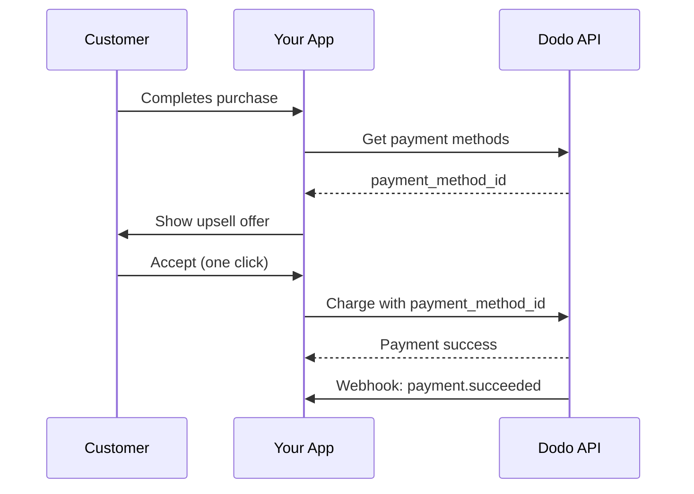
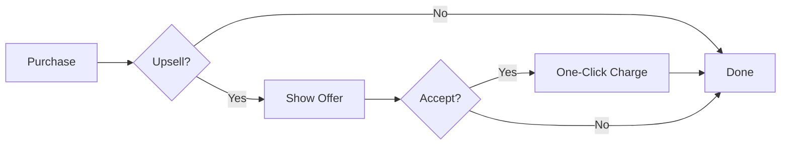
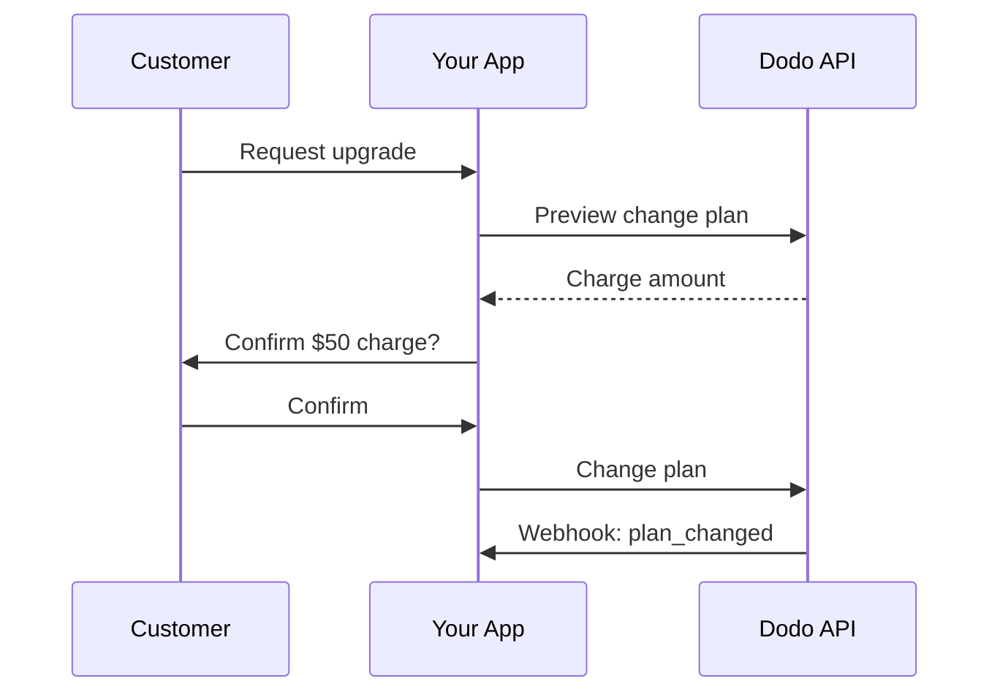
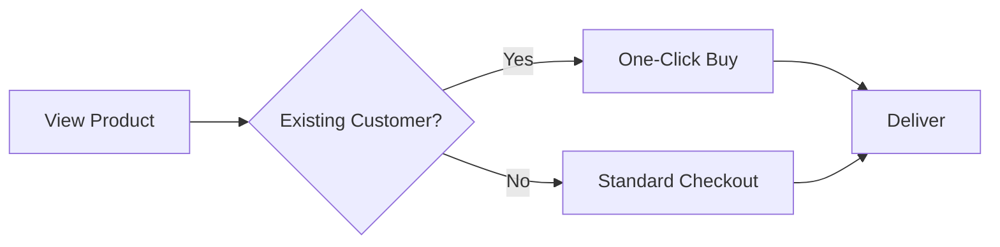

<Info>
Les upsells et downsells vous permettent d'offrir des produits supplémentaires ou des changements de plan aux clients en utilisant leurs méthodes de paiement enregistrées. Cela permet des achats en un clic qui évitent la collecte des paiements, améliorant ainsi considérablement les taux de conversion.
</Info>

<CardGroup cols={3}>
<Card title="Upsells après achat" icon="cart-plus">
  Proposez des produits complémentaires immédiatement après le paiement avec un achat en un clic.
</Card>

<Card title="Mises à niveau d'abonnement" icon="arrow-up">
  Déplacez les clients vers des niveaux supérieurs avec une proration automatique et une facturation instantanée.
</Card>

<Card title="Ventes croisées" icon="grid-2-plus">
  Ajoutez des produits connexes aux clients existants sans qu'ils aient besoin de ressaisir leurs détails de paiement.
</Card>
</CardGroup>

## Vue d'ensemble

Les upsells et downsells sont des stratégies puissantes d'optimisation des revenus :

- **Upsells** : Proposez un produit ou une mise à niveau de plus grande valeur (par exemple, le plan Pro au lieu du plan Basique)
- **Downsells** : Proposez une alternative à prix inférieur lorsque le client décline ou rétrograde
- **Ventes croisées** : Suggérez des produits complémentaires (par exemple, des modules complémentaires, des articles connexes)

Dodo Payments permet ces flux grâce au paramètre `payment_method_id`, qui vous permet de facturer la méthode de paiement enregistrée d'un client sans qu'il ait besoin de ressaisir ses détails de carte.

### Avantages clés

| Avantage | Impact |
|---------|--------|
| **Achats en un clic** | Évitez complètement le formulaire de paiement pour les clients récurrents |
| **Taux de conversion plus élevés** | Réduisez la friction au moment de la décision |
| **Traitement instantané** | Les charges sont traitées immédiatement avec `confirm: true` |
| **UX fluide** | Les clients restent dans votre application tout au long du flux |

## Comment ça fonctionne



## Prérequis

Avant de mettre en œuvre des upsells et downsells, assurez-vous d'avoir :

<Steps>
<Step title="Client avec méthode de paiement enregistrée">
  Les clients doivent avoir effectué au moins un achat. Les méthodes de paiement sont automatiquement enregistrées lorsque les clients complètent le paiement.
</Step>

<Step title="Produits configurés">
  Créez vos produits d'upsell dans le tableau de bord Dodo Payments. Ce peuvent être des paiements uniques, des abonnements ou des modules complémentaires.
</Step>

<Step title="Point de terminaison Webhook">
  Configurez des webhooks pour gérer les événements `payment.succeeded`, `payment.failed` et `subscription.plan_changed`.
</Step>
</Steps>

## Récupérer les méthodes de paiement des clients

Avant d'offrir un upsell, récupérez les méthodes de paiement enregistrées du client :

<Tabs>
<Tab title="TypeScript">

```typescript
import DodoPayments from 'dodopayments';

const client = new DodoPayments({
  bearerToken: process.env.DODO_PAYMENTS_API_KEY,
  environment: 'live_mode',
});

async function getPaymentMethods(customerId: string) {
  const paymentMethods = await client.customers.listPaymentMethods(customerId);
  
  // Returns array of saved payment methods
  // Each has: payment_method_id, type, card (last4, brand, exp_month, exp_year)
  return paymentMethods;
}

// Example usage
const methods = await getPaymentMethods('cus_123');
console.log('Available payment methods:', methods);

// Use the first available method for upsell
const primaryMethod = methods[0]?.payment_method_id;
```

</Tab>

<Tab title="Python">

```python
import os
from dodopayments import DodoPayments

client = DodoPayments(
    bearer_token=os.environ.get("DODO_PAYMENTS_API_KEY"),
    environment="live_mode",
)

def get_payment_methods(customer_id: str):
    payment_methods = client.customers.list_payment_methods(customer_id)
    
    # Returns list of saved payment methods
    # Each has: payment_method_id, type, card (last4, brand, exp_month, exp_year)
    return payment_methods

# Example usage
methods = get_payment_methods("cus_123")
print("Available payment methods:", methods)

# Use the first available method for upsell
primary_method = methods[0].payment_method_id if methods else None
```

</Tab>

<Tab title="Go">

```go
package main

import (
    "context"
    "fmt"
    "github.com/dodopayments/dodopayments-go"
    "github.com/dodopayments/dodopayments-go/option"
)

func getPaymentMethods(customerID string) ([]dodopayments.PaymentMethod, error) {
    client := dodopayments.NewClient(
        option.WithBearerToken(os.Getenv("DODO_PAYMENTS_API_KEY")),
    )
    
    methods, err := client.Customers.ListPaymentMethods(
        context.TODO(),
        customerID,
    )
    if err != nil {
        return nil, err
    }
    
    return methods, nil
}

func main() {
    methods, err := getPaymentMethods("cus_123")
    if err != nil {
        panic(err)
    }
    
    fmt.Println("Available payment methods:", methods)
    
    // Use the first available method for upsell
    if len(methods) > 0 {
        primaryMethod := methods[0].PaymentMethodID
        fmt.Println("Primary method:", primaryMethod)
    }
}
```

</Tab>
</Tabs>

<Info>
Les méthodes de paiement sont automatiquement enregistrées lorsque les clients complètent le paiement. Vous n'avez pas besoin de les enregistrer explicitement.
</Info>

## Upsells en un clic après achat

Proposez des produits supplémentaires immédiatement après un achat réussi. Le client peut accepter d'un simple clic puisque sa méthode de paiement est déjà enregistrée.



### Mise en œuvre

<Tabs>
<Tab title="TypeScript">

```typescript
import DodoPayments from 'dodopayments';

const client = new DodoPayments({
  bearerToken: process.env.DODO_PAYMENTS_API_KEY,
  environment: 'live_mode',
});

async function createOneClickUpsell(
  customerId: string,
  paymentMethodId: string,
  upsellProductId: string
) {
  // Create checkout session with saved payment method
  // confirm: true processes the payment immediately
  const session = await client.checkoutSessions.create({
    product_cart: [
      {
        product_id: upsellProductId,
        quantity: 1
      }
    ],
    customer: {
      customer_id: customerId
    },
    payment_method_id: paymentMethodId,
    confirm: true,  // Required when using payment_method_id
    return_url: 'https://yourapp.com/upsell-success',
    feature_flags: {
      redirect_immediately: true  // Skip success page
    },
    metadata: {
      upsell_source: 'post_purchase',
      original_order_id: 'order_123'
    }
  });

  return session;
}

// Example: Offer premium add-on after initial purchase
async function handlePostPurchaseUpsell(customerId: string) {
  // Get customer's payment methods
  const methods = await client.customers.listPaymentMethods(customerId);
  
  if (methods.length === 0) {
    console.log('No saved payment methods available');
    return null;
  }

  // Create the upsell with one-click checkout
  const upsell = await createOneClickUpsell(
    customerId,
    methods[0].payment_method_id,
    'prod_premium_addon'
  );

  console.log('Upsell processed:', upsell.session_id);
  return upsell;
}
```

</Tab>

<Tab title="Python">

```python
import os
from dodopayments import DodoPayments

client = DodoPayments(
    bearer_token=os.environ.get("DODO_PAYMENTS_API_KEY"),
    environment="live_mode",
)

def create_one_click_upsell(
    customer_id: str,
    payment_method_id: str,
    upsell_product_id: str
):
    """Create a one-click upsell using saved payment method."""
    
    # Create checkout session with saved payment method
    # confirm=True processes the payment immediately
    session = client.checkout_sessions.create(
        product_cart=[
            {
                "product_id": upsell_product_id,
                "quantity": 1
            }
        ],
        customer={
            "customer_id": customer_id
        },
        payment_method_id=payment_method_id,
        confirm=True,  # Required when using payment_method_id
        return_url="https://yourapp.com/upsell-success",
        feature_flags={
            "redirect_immediately": True  # Skip success page
        },
        metadata={
            "upsell_source": "post_purchase",
            "original_order_id": "order_123"
        }
    )
    
    return session

def handle_post_purchase_upsell(customer_id: str):
    """Offer premium add-on after initial purchase."""
    
    # Get customer's payment methods
    methods = client.customers.list_payment_methods(customer_id)
    
    if not methods:
        print("No saved payment methods available")
        return None
    
    # Create the upsell with one-click checkout
    upsell = create_one_click_upsell(
        customer_id=customer_id,
        payment_method_id=methods[0].payment_method_id,
        upsell_product_id="prod_premium_addon"
    )
    
    print(f"Upsell processed: {upsell.session_id}")
    return upsell
```

</Tab>

<Tab title="Go">

```go
package main

import (
    "context"
    "fmt"
    "os"
    
    "github.com/dodopayments/dodopayments-go"
    "github.com/dodopayments/dodopayments-go/option"
)

func createOneClickUpsell(
    customerID string,
    paymentMethodID string,
    upsellProductID string,
) (*dodopayments.CheckoutSession, error) {
    client := dodopayments.NewClient(
        option.WithBearerToken(os.Getenv("DODO_PAYMENTS_API_KEY")),
    )
    
    // Create checkout session with saved payment method
    // Confirm: true processes the payment immediately
    session, err := client.CheckoutSessions.Create(context.TODO(), dodopayments.CheckoutSessionCreateParams{
        ProductCart: dodopayments.F([]dodopayments.CheckoutSessionCreateParamsProductCart{
            {
                ProductID: dodopayments.F(upsellProductID),
                Quantity:  dodopayments.F(int64(1)),
            },
        }),
        Customer: dodopayments.F(dodopayments.CheckoutSessionCreateParamsCustomer{
            CustomerID: dodopayments.F(customerID),
        }),
        PaymentMethodID: dodopayments.F(paymentMethodID),
        Confirm:         dodopayments.F(true), // Required when using payment_method_id
        ReturnURL:       dodopayments.F("https://yourapp.com/upsell-success"),
        FeatureFlags: dodopayments.F(dodopayments.CheckoutSessionCreateParamsFeatureFlags{
            RedirectImmediately: dodopayments.F(true), // Skip success page
        }),
        Metadata: dodopayments.F(map[string]string{
            "upsell_source":     "post_purchase",
            "original_order_id": "order_123",
        }),
    })
    
    return session, err
}

func handlePostPurchaseUpsell(customerID string) (*dodopayments.CheckoutSession, error) {
    client := dodopayments.NewClient(
        option.WithBearerToken(os.Getenv("DODO_PAYMENTS_API_KEY")),
    )
    
    // Get customer's payment methods
    methods, err := client.Customers.ListPaymentMethods(context.TODO(), customerID)
    if err != nil {
        return nil, err
    }
    
    if len(methods) == 0 {
        fmt.Println("No saved payment methods available")
        return nil, nil
    }
    
    // Create the upsell with one-click checkout
    upsell, err := createOneClickUpsell(
        customerID,
        methods[0].PaymentMethodID,
        "prod_premium_addon",
    )
    if err != nil {
        return nil, err
    }
    
    fmt.Printf("Upsell processed: %s\n", upsell.SessionID)
    return upsell, nil
}
```

</Tab>
</Tabs>

<Warning>
Lors de l'utilisation de `payment_method_id`, vous devez définir `confirm: true` et fournir un `customer_id` existant. La méthode de paiement doit appartenir à ce client.
</Warning>

## Mises à niveau d'abonnement

Déplacez les clients vers des plans d'abonnement de niveau supérieur avec une gestion automatique des proratas.



### Aperçu avant engagement

Toujours prévisualiser les changements de plan pour montrer aux clients exactement ce qu'ils vont être facturés :

<Tabs>
<Tab title="TypeScript">

```typescript
async function previewUpgrade(
  subscriptionId: string,
  newProductId: string
) {
  const preview = await client.subscriptions.previewChangePlan(subscriptionId, {
    product_id: newProductId,
    quantity: 1,
    proration_billing_mode: 'difference_immediately'
  });

  return {
    immediateCharge: preview.immediate_charge?.summary,
    newPlan: preview.new_plan,
    effectiveDate: preview.effective_date
  };
}

// Show customer the charge before confirming
const preview = await previewUpgrade('sub_123', 'prod_pro_plan');
console.log(`Upgrade will charge: ${preview.immediateCharge}`);
```

</Tab>

<Tab title="Python">

```python
def preview_upgrade(subscription_id: str, new_product_id: str):
    preview = client.subscriptions.preview_change_plan(
        subscription_id=subscription_id,
        product_id=new_product_id,
        quantity=1,
        proration_billing_mode="difference_immediately"
    )
    
    return {
        "immediate_charge": preview.immediate_charge.summary if preview.immediate_charge else None,
        "new_plan": preview.new_plan,
        "effective_date": preview.effective_date
    }

# Show customer the charge before confirming
preview = preview_upgrade("sub_123", "prod_pro_plan")
print(f"Upgrade will charge: {preview['immediate_charge']}")
```

</Tab>

<Tab title="Go">

```go
func previewUpgrade(subscriptionID string, newProductID string) (map[string]interface{}, error) {
    client := dodopayments.NewClient(
        option.WithBearerToken(os.Getenv("DODO_PAYMENTS_API_KEY")),
    )
    
    preview, err := client.Subscriptions.PreviewChangePlan(
        context.TODO(),
        subscriptionID,
        dodopayments.SubscriptionPreviewChangePlanParams{
            ProductID:             dodopayments.F(newProductID),
            Quantity:              dodopayments.F(int64(1)),
            ProrationBillingMode:  dodopayments.F(dodopayments.ProrationBillingModeDifferenceImmediately),
        },
    )
    if err != nil {
        return nil, err
    }
    
    return map[string]interface{}{
        "immediate_charge": preview.ImmediateCharge.Summary,
        "new_plan":         preview.NewPlan,
        "effective_date":   preview.EffectiveDate,
    }, nil
}
```

</Tab>
</Tabs>

### Exécuter la mise à niveau

<Tabs>
<Tab title="TypeScript">

```typescript
async function upgradeSubscription(
  subscriptionId: string,
  newProductId: string,
  prorationMode: 'prorated_immediately' | 'difference_immediately' | 'full_immediately' = 'difference_immediately'
) {
  const result = await client.subscriptions.changePlan(subscriptionId, {
    product_id: newProductId,
    quantity: 1,
    proration_billing_mode: prorationMode
  });

  return {
    status: result.status,
    subscriptionId: result.subscription_id,
    paymentId: result.payment_id,
    invoiceId: result.invoice_id
  };
}

// Upgrade from Basic ($30) to Pro ($80)
// With difference_immediately: charges $50 instantly
const upgrade = await upgradeSubscription('sub_123', 'prod_pro_plan');
console.log('Upgrade status:', upgrade.status);
```

</Tab>

<Tab title="Python">

```python
def upgrade_subscription(
    subscription_id: str,
    new_product_id: str,
    proration_mode: str = "difference_immediately"
):
    result = client.subscriptions.change_plan(
        subscription_id=subscription_id,
        product_id=new_product_id,
        quantity=1,
        proration_billing_mode=proration_mode
    )
    
    return {
        "status": result.status,
        "subscription_id": result.subscription_id,
        "payment_id": result.payment_id,
        "invoice_id": result.invoice_id
    }

# Upgrade from Basic ($30) to Pro ($80)
# With difference_immediately: charges $50 instantly
upgrade = upgrade_subscription("sub_123", "prod_pro_plan")
print(f"Upgrade status: {upgrade['status']}")
```

</Tab>

<Tab title="Go">

```go
func upgradeSubscription(
    subscriptionID string,
    newProductID string,
    prorationMode dodopayments.ProrationBillingMode,
) (*dodopayments.SubscriptionChangePlanResponse, error) {
    client := dodopayments.NewClient(
        option.WithBearerToken(os.Getenv("DODO_PAYMENTS_API_KEY")),
    )
    
    result, err := client.Subscriptions.ChangePlan(
        context.TODO(),
        subscriptionID,
        dodopayments.SubscriptionChangePlanParams{
            ProductID:            dodopayments.F(newProductID),
            Quantity:             dodopayments.F(int64(1)),
            ProrationBillingMode: dodopayments.F(prorationMode),
        },
    )
    
    return result, err
}

// Upgrade from Basic ($30) to Pro ($80)
// With DifferenceImmediately: charges $50 instantly
upgrade, err := upgradeSubscription(
    "sub_123",
    "prod_pro_plan",
    dodopayments.ProrationBillingModeDifferenceImmediately,
)
if err != nil {
    panic(err)
}
fmt.Printf("Upgrade status: %s\n", upgrade.Status)
```

</Tab>
</Tabs>

### Modes de proration

Choisissez comment les clients sont facturés lors de la mise à niveau :

| Mode | Comportement | Idéal pour |
|------|----------|----------|
| `difference_immediately` | Facture immédiatement la différence de prix ($30→$80 = $50) | Mises à niveau simples |
| `prorated_immediately` | Facture en fonction du temps restant dans le cycle de facturation | Facturation équitable basée sur le temps |
| `full_immediately` | Facture le prix total du nouveau plan, ignore le temps restant | Réinitialise le cycle de facturation |

<Tip>
Utilisez `difference_immediately` pour des flux de mise à niveau simples. Utilisez `prorated_immediately` lorsque vous souhaitez tenir compte du temps inutilisé sur le plan actuel.
</Tip>

## Ventes croisées

Ajoutez des produits complémentaires pour les clients existants sans nécessiter qu'ils ressaisissent leurs détails de paiement.



### Mise en œuvre

<Tabs>
<Tab title="TypeScript">

```typescript
async function createCrossSell(
  customerId: string,
  paymentMethodId: string,
  productId: string,
  quantity: number = 1
) {
  // Create a one-time payment using saved payment method
  const payment = await client.payments.create({
    product_cart: [
      {
        product_id: productId,
        quantity: quantity
      }
    ],
    customer_id: customerId,
    payment_method_id: paymentMethodId,
    return_url: 'https://yourapp.com/purchase-complete',
    metadata: {
      purchase_type: 'cross_sell',
      source: 'product_recommendation'
    }
  });

  return payment;
}

// Example: Customer bought a course, offer related ebook
async function offerRelatedProduct(customerId: string, relatedProductId: string) {
  const methods = await client.customers.listPaymentMethods(customerId);
  
  if (methods.length === 0) {
    // Fall back to standard checkout
    return client.checkoutSessions.create({
      product_cart: [{ product_id: relatedProductId, quantity: 1 }],
      customer: { customer_id: customerId },
      return_url: 'https://yourapp.com/purchase-complete'
    });
  }

  // One-click purchase
  return createCrossSell(customerId, methods[0].payment_method_id, relatedProductId);
}
```

</Tab>

<Tab title="Python">

```python
def create_cross_sell(
    customer_id: str,
    payment_method_id: str,
    product_id: str,
    quantity: int = 1
):
    """Create a one-time payment using saved payment method."""
    
    payment = client.payments.create(
        product_cart=[
            {
                "product_id": product_id,
                "quantity": quantity
            }
        ],
        customer_id=customer_id,
        payment_method_id=payment_method_id,
        return_url="https://yourapp.com/purchase-complete",
        metadata={
            "purchase_type": "cross_sell",
            "source": "product_recommendation"
        }
    )
    
    return payment

def offer_related_product(customer_id: str, related_product_id: str):
    """Offer related product with one-click purchase if possible."""
    
    methods = client.customers.list_payment_methods(customer_id)
    
    if not methods:
        # Fall back to standard checkout
        return client.checkout_sessions.create(
            product_cart=[{"product_id": related_product_id, "quantity": 1}],
            customer={"customer_id": customer_id},
            return_url="https://yourapp.com/purchase-complete"
        )
    
    # One-click purchase
    return create_cross_sell(customer_id, methods[0].payment_method_id, related_product_id)
```

</Tab>

<Tab title="Go">

```go
func createCrossSell(
    customerID string,
    paymentMethodID string,
    productID string,
    quantity int64,
) (*dodopayments.Payment, error) {
    client := dodopayments.NewClient(
        option.WithBearerToken(os.Getenv("DODO_PAYMENTS_API_KEY")),
    )
    
    payment, err := client.Payments.Create(context.TODO(), dodopayments.PaymentCreateParams{
        ProductCart: dodopayments.F([]dodopayments.PaymentCreateParamsProductCart{
            {
                ProductID: dodopayments.F(productID),
                Quantity:  dodopayments.F(quantity),
            },
        }),
        CustomerID:      dodopayments.F(customerID),
        PaymentMethodID: dodopayments.F(paymentMethodID),
        ReturnURL:       dodopayments.F("https://yourapp.com/purchase-complete"),
        Metadata: dodopayments.F(map[string]string{
            "purchase_type": "cross_sell",
            "source":        "product_recommendation",
        }),
    })
    
    return payment, err
}

func offerRelatedProduct(customerID string, relatedProductID string) (interface{}, error) {
    client := dodopayments.NewClient(
        option.WithBearerToken(os.Getenv("DODO_PAYMENTS_API_KEY")),
    )
    
    methods, err := client.Customers.ListPaymentMethods(context.TODO(), customerID)
    if err != nil {
        return nil, err
    }
    
    if len(methods) == 0 {
        // Fall back to standard checkout
        return client.CheckoutSessions.Create(context.TODO(), dodopayments.CheckoutSessionCreateParams{
            ProductCart: dodopayments.F([]dodopayments.CheckoutSessionCreateParamsProductCart{
                {ProductID: dodopayments.F(relatedProductID), Quantity: dodopayments.F(int64(1))},
            }),
            Customer:  dodopayments.F(dodopayments.CheckoutSessionCreateParamsCustomer{CustomerID: dodopayments.F(customerID)}),
            ReturnURL: dodopayments.F("https://yourapp.com/purchase-complete"),
        })
    }
    
    // One-click purchase
    return createCrossSell(customerID, methods[0].PaymentMethodID, relatedProductID, 1)
}
```

</Tab>
</Tabs>

## Rétrogradations d'abonnement

Lorsque les clients souhaitent passer à un plan de niveau inférieur, gérez la transition en douceur avec des crédits automatiques.

### Comment fonctionnent les rétrogradations

1. Le client demande une rétrogradation (Pro → Basic)
2. Le système calcule la valeur restante sur le plan actuel
3. Un crédit est ajouté à l'abonnement pour les renouvellements futurs
4. Le client passe immédiatement au nouveau plan

<Tabs>
<Tab title="TypeScript">

```typescript
async function downgradeSubscription(
  subscriptionId: string,
  newProductId: string
) {
  // Preview the downgrade first
  const preview = await client.subscriptions.previewChangePlan(subscriptionId, {
    product_id: newProductId,
    quantity: 1,
    proration_billing_mode: 'difference_immediately'
  });

  console.log('Credit to be applied:', preview.credit_amount);

  // Execute the downgrade
  const result = await client.subscriptions.changePlan(subscriptionId, {
    product_id: newProductId,
    quantity: 1,
    proration_billing_mode: 'difference_immediately'
  });

  // Credits are automatically applied to future renewals
  return result;
}

// Downgrade from Pro ($80) to Basic ($30)
// $50 credit added to subscription, auto-applied on next renewal
const downgrade = await downgradeSubscription('sub_123', 'prod_basic_plan');
```

</Tab>

<Tab title="Python">

```python
def downgrade_subscription(subscription_id: str, new_product_id: str):
    # Preview the downgrade first
    preview = client.subscriptions.preview_change_plan(
        subscription_id=subscription_id,
        product_id=new_product_id,
        quantity=1,
        proration_billing_mode="difference_immediately"
    )
    
    print(f"Credit to be applied: {preview.credit_amount}")
    
    # Execute the downgrade
    result = client.subscriptions.change_plan(
        subscription_id=subscription_id,
        product_id=new_product_id,
        quantity=1,
        proration_billing_mode="difference_immediately"
    )
    
    # Credits are automatically applied to future renewals
    return result

# Downgrade from Pro ($80) to Basic ($30)
# $50 credit added to subscription, auto-applied on next renewal
downgrade = downgrade_subscription("sub_123", "prod_basic_plan")
```

</Tab>

<Tab title="Go">

```go
func downgradeSubscription(subscriptionID string, newProductID string) (*dodopayments.SubscriptionChangePlanResponse, error) {
    client := dodopayments.NewClient(
        option.WithBearerToken(os.Getenv("DODO_PAYMENTS_API_KEY")),
    )
    
    // Preview the downgrade first
    preview, err := client.Subscriptions.PreviewChangePlan(
        context.TODO(),
        subscriptionID,
        dodopayments.SubscriptionPreviewChangePlanParams{
            ProductID:            dodopayments.F(newProductID),
            Quantity:             dodopayments.F(int64(1)),
            ProrationBillingMode: dodopayments.F(dodopayments.ProrationBillingModeDifferenceImmediately),
        },
    )
    if err != nil {
        return nil, err
    }
    
    fmt.Printf("Credit to be applied: %v\n", preview.CreditAmount)
    
    // Execute the downgrade
    result, err := client.Subscriptions.ChangePlan(
        context.TODO(),
        subscriptionID,
        dodopayments.SubscriptionChangePlanParams{
            ProductID:            dodopayments.F(newProductID),
            Quantity:             dodopayments.F(int64(1)),
            ProrationBillingMode: dodopayments.F(dodopayments.ProrationBillingModeDifferenceImmediately),
        },
    )
    
    return result, err
}
```

</Tab>
</Tabs>

<Info>
Les crédits issus des rétrogradations utilisant `difference_immediately` sont limités à l'abonnement et appliqués automatiquement aux renouvellements futurs. Ils sont distincts des [Crédits clients](/features/customer-credit).
</Info>

## Exemple complet : Flux d'upsell après achat

Voici une mise en œuvre complète montrant comment offrir un upsell après un achat réussi :

<Tabs>
<Tab title="TypeScript">

```typescript
import DodoPayments from 'dodopayments';
import express from 'express';

const client = new DodoPayments({
  bearerToken: process.env.DODO_PAYMENTS_API_KEY,
  environment: 'live_mode',
});

const app = express();

// Store for tracking upsell eligibility (use your database in production)
const eligibleUpsells = new Map<string, { customerId: string; productId: string }>();

// Webhook handler for initial purchase success
app.post('/webhooks/dodo', express.raw({ type: 'application/json' }), async (req, res) => {
  const event = JSON.parse(req.body.toString());
  
  switch (event.type) {
    case 'payment.succeeded':
      // Check if customer is eligible for upsell
      const customerId = event.data.customer_id;
      const productId = event.data.product_id;
      
      // Define upsell rules (e.g., bought Basic, offer Pro)
      const upsellProduct = getUpsellProduct(productId);
      
      if (upsellProduct) {
        eligibleUpsells.set(customerId, {
          customerId,
          productId: upsellProduct
        });
      }
      break;
      
    case 'payment.failed':
      console.log('Payment failed:', event.data.payment_id);
      // Handle failed upsell payment
      break;
  }
  
  res.json({ received: true });
});

// API endpoint to check upsell eligibility
app.get('/api/upsell/:customerId', async (req, res) => {
  const { customerId } = req.params;
  const upsell = eligibleUpsells.get(customerId);
  
  if (!upsell) {
    return res.json({ eligible: false });
  }
  
  // Get payment methods
  const methods = await client.customers.listPaymentMethods(customerId);
  
  if (methods.length === 0) {
    return res.json({ eligible: false, reason: 'no_payment_method' });
  }
  
  // Get product details for display
  const product = await client.products.retrieve(upsell.productId);
  
  res.json({
    eligible: true,
    product: {
      id: product.product_id,
      name: product.name,
      price: product.price,
      currency: product.currency
    },
    paymentMethodId: methods[0].payment_method_id
  });
});

// API endpoint to accept upsell
app.post('/api/upsell/:customerId/accept', async (req, res) => {
  const { customerId } = req.params;
  const upsell = eligibleUpsells.get(customerId);
  
  if (!upsell) {
    return res.status(400).json({ error: 'No upsell available' });
  }
  
  try {
    const methods = await client.customers.listPaymentMethods(customerId);
    
    // Create one-click purchase
    const session = await client.checkoutSessions.create({
      product_cart: [{ product_id: upsell.productId, quantity: 1 }],
      customer: { customer_id: customerId },
      payment_method_id: methods[0].payment_method_id,
      confirm: true,
      return_url: `${process.env.APP_URL}/upsell-success`,
      feature_flags: { redirect_immediately: true },
      metadata: { upsell: 'true', source: 'post_purchase' }
    });
    
    // Clear the upsell offer
    eligibleUpsells.delete(customerId);
    
    res.json({ success: true, sessionId: session.session_id });
  } catch (error) {
    console.error('Upsell failed:', error);
    res.status(500).json({ error: 'Upsell processing failed' });
  }
});

// Helper function to determine upsell product
function getUpsellProduct(purchasedProductId: string): string | null {
  const upsellMap: Record<string, string> = {
    'prod_basic_plan': 'prod_pro_plan',
    'prod_starter_course': 'prod_complete_bundle',
    'prod_single_license': 'prod_team_license'
  };
  
  return upsellMap[purchasedProductId] || null;
}

app.listen(3000);
```

</Tab>

<Tab title="Python">

```python
import os
from flask import Flask, request, jsonify
from dodopayments import DodoPayments

client = DodoPayments(
    bearer_token=os.environ.get("DODO_PAYMENTS_API_KEY"),
    environment="live_mode",
)

app = Flask(__name__)

# Store for tracking upsell eligibility (use your database in production)
eligible_upsells = {}

@app.route('/webhooks/dodo', methods=['POST'])
def webhook_handler():
    event = request.json
    
    if event['type'] == 'payment.succeeded':
        # Check if customer is eligible for upsell
        customer_id = event['data']['customer_id']
        product_id = event['data']['product_id']
        
        # Define upsell rules
        upsell_product = get_upsell_product(product_id)
        
        if upsell_product:
            eligible_upsells[customer_id] = {
                'customer_id': customer_id,
                'product_id': upsell_product
            }
    
    elif event['type'] == 'payment.failed':
        print(f"Payment failed: {event['data']['payment_id']}")
    
    return jsonify({'received': True})

@app.route('/api/upsell/<customer_id>', methods=['GET'])
def check_upsell(customer_id):
    upsell = eligible_upsells.get(customer_id)
    
    if not upsell:
        return jsonify({'eligible': False})
    
    # Get payment methods
    methods = client.customers.list_payment_methods(customer_id)
    
    if not methods:
        return jsonify({'eligible': False, 'reason': 'no_payment_method'})
    
    # Get product details for display
    product = client.products.retrieve(upsell['product_id'])
    
    return jsonify({
        'eligible': True,
        'product': {
            'id': product.product_id,
            'name': product.name,
            'price': product.price,
            'currency': product.currency
        },
        'payment_method_id': methods[0].payment_method_id
    })

@app.route('/api/upsell/<customer_id>/accept', methods=['POST'])
def accept_upsell(customer_id):
    upsell = eligible_upsells.get(customer_id)
    
    if not upsell:
        return jsonify({'error': 'No upsell available'}), 400
    
    try:
        methods = client.customers.list_payment_methods(customer_id)
        
        # Create one-click purchase
        session = client.checkout_sessions.create(
            product_cart=[{'product_id': upsell['product_id'], 'quantity': 1}],
            customer={'customer_id': customer_id},
            payment_method_id=methods[0].payment_method_id,
            confirm=True,
            return_url=f"{os.environ['APP_URL']}/upsell-success",
            feature_flags={'redirect_immediately': True},
            metadata={'upsell': 'true', 'source': 'post_purchase'}
        )
        
        # Clear the upsell offer
        del eligible_upsells[customer_id]
        
        return jsonify({'success': True, 'session_id': session.session_id})
    
    except Exception as error:
        print(f"Upsell failed: {error}")
        return jsonify({'error': 'Upsell processing failed'}), 500

def get_upsell_product(purchased_product_id: str) -> str:
    """Determine upsell product based on purchased product."""
    upsell_map = {
        'prod_basic_plan': 'prod_pro_plan',
        'prod_starter_course': 'prod_complete_bundle',
        'prod_single_license': 'prod_team_license'
    }
    return upsell_map.get(purchased_product_id)

if __name__ == '__main__':
    app.run(port=3000)
```

</Tab>
</Tabs>

## Meilleures pratiques

<AccordionGroup>
<Accordion title="Chronométrez vos upsells stratégiquement">
Le meilleur moment pour proposer un upsell est immédiatement après un achat réussi lorsque les clients sont dans un état d'esprit d'achat. D'autres moments efficaces :
- Après des jalons d'utilisation des fonctionnalités
- Lorsqu'ils approchent des limites de plan
- Pendant l'achèvement de l'onboarding
</Accordion>

<Accordion title="Validez l'éligibilité de la méthode de paiement">
Avant d'essayer une charge en un clic, vérifiez que la méthode de paiement :
- Est compatible avec la monnaie du produit
- N'a pas expiré
- Appartient au client

L'API validera ces points, mais vérifier proactivement améliore l'UX.
</Accordion>

<Accordion title="Gérez les échecs avec grâce">
Lorsque les charges en un clic échouent :
1. Revenez à un flux de paiement standard
2. Informez le client avec un message clair
3. Proposez de mettre à jour la méthode de paiement
4. Ne tentez pas de charges échouées plusieurs fois
</Accordion>

<Accordion title="Fournissez une proposition de valeur claire">
Les upsells se convertissent mieux lorsque les clients comprennent la valeur :
- Montrez ce qu'ils obtiennent par rapport au plan actuel
- Mettez en avant la différence de prix, pas le prix total
- Utilisez une preuve sociale (par exemple, "Mise à niveau la plus populaire")
</Accordion>

<Accordion title="Respectez le choix des clients">
- Offrez toujours un moyen simple de décliner
- Ne montrez pas le même upsell plusieurs fois après un refus
- Suivez et analysez quels upsells se convertissent pour optimiser les offres
</Accordion>
</AccordionGroup>

## Webhooks à surveiller

Suivez ces événements webhook pour les flux d'upsell et de rétrogradation :

| Événement | Déclencheur | Action |
|-------|---------|--------|
| `payment.succeeded` | Paiement d'upsell/cross-sell terminé | Livrer le produit, mettre à jour l'accès |
| `payment.failed` | Échec de la charge en un clic | Afficher une erreur, proposer de réessayer ou de revenir en arrière |
| `subscription.plan_changed` | Mise à niveau/rétrogradation terminée | Mettre à jour les fonctionnalités, envoyer une confirmation |
| `subscription.active` | Abonnement réactivé après un changement de plan | Accorder l'accès au nouveau niveau |

<Card title="Guide d'intégration Webhook" icon="webhook" href="/developer-resources/webhooks">
  Apprenez à configurer et vérifier les points de terminaison de webhook.
</Card>

## Ressources connexes

<CardGroup cols={2}>
<Card title="Guide de mise à niveau d'abonnement" icon="arrows-rotate" href="/developer-resources/subscription-upgrade-downgrade">
  Guide détaillé sur les changements de plan, les modes de proration et la gestion des échecs.
</Card>

<Card title="Sessions de paiement" icon="cart-shopping" href="/developer-resources/checkout-session">
  Référence complète pour la création de sessions de paiement avec toutes les options.
</Card>

<Card title="API des méthodes de paiement des clients" icon="credit-card" href="/api-reference/customers/get-customer-payment-methods">
  Référence API pour lister les méthodes de paiement des clients.
</Card>

<Card title="Modules complémentaires" icon="puzzle-piece" href="/features/addons">
  Améliorez les abonnements avec des modules complémentaires flexibles pour un revenu supplémentaire.
</Card>
</CardGroup>
