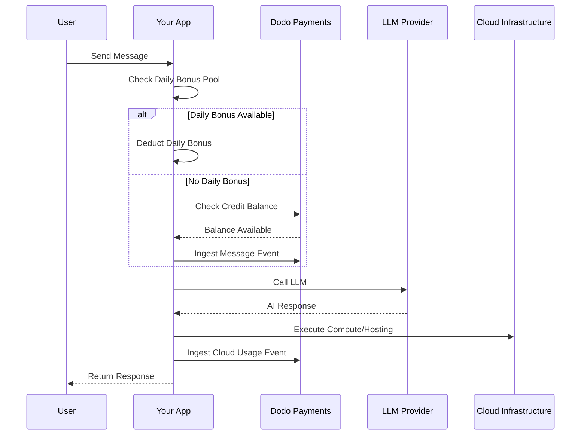

लवेबल (lovable.dev) एक AI वेब ऐप बिल्डर है जो क्रेडिट-आधारित सदस्यता मॉडल का उपयोग करता है। टोकन-आधारित सिस्टम के विपरीत, लवेबल उपयोगकर्ता अनुभव को सरल बनाता है और प्रति संदेश एक क्रेडिट चार्ज करता है। यह मॉडल मासिक क्रेडिट पूल को दैनिक बोनस ड्रिप के साथ जोड़ता है ताकि लगातार जुड़ाव को प्रोत्साहित किया जा सके और बर्स्ट उपयोग की अनुमति दी जा सके।

## लवेबल का बिलिंग मॉडल

लवेबल की प्राइसिंग मैसेज क्रेडिट और क्लाउड इन्फ्रास्ट्रक्चर के लिए अलग मीटरिंग बिलिंग के इर्द-गिर्द बनाई गई है।

| योजना | मूल्य | मासिक क्रेडिट | दैनिक बोनस | प्रमुख विशेषताएं |
| :--- | :--- | :--- | :--- | :--- |
| फ्री | \$0/माह | 0 | 5/दिन (अधिकतम 30/माह) | केवल सार्वजनिक प्रोजेक्ट्स |
| प्रो | \$25/माह | 100 | 5/दिन (अधिकतम 150/माह) | ऑन-डिमांड टॉप-अप्स, उपयोग-आधारित क्लाउड + AI, कस्टम डोमेंस |
| बिजनेस | \$50/माह | 100 | 5/दिन | SSO, टीम वर्कस्पेस, डिज़ाइन टेम्पलेट्स, सिक्योरिटी सेंटर |
| एंटरप्राइज | कस्टम | कस्टम | कस्टम | SCIM, समर्पित समर्थन, ऑडिट लॉग्स |

- **क्रेडिट-आधारित सदस्यता**: 1 क्रेडिट = AI को 1 मैसेज/प्रॉम्प्ट।
- **क्रेडिट अनलिमिटेड यूज़र्स में शेयर किए जाते हैं**: टीम-वाइड पूल, प्रति सीट नहीं।
- **प्रत्येक बिलिंग साइकल में क्रेडिट रीसेट होते हैं**: मासिक क्रेडिट नवीकरण पर ताज़ा होते हैं।
- **ऑन-डिमांड क्रेडिट टॉप-अप**: अगर उपयोगकर्ता क्रेडिट समाप्त करते हैं, तो और अधिक खरीद सकते हैं।
- **अलग उपयोग-आधारित क्लाउड + AI बिलिंग**: होस्टिंग और कंप्यूट के लिए मीटर्ड बिलिंग।
- **दैनिक बोनस क्रेडिट प्रत्येक दिन रीसेट होते हैं**: उपयोग न करने पर खोने वाले 5 क्रेडिट का दैनिक ड्रिप।

## इसे अनोखा क्या बनाता है

- **मैसेज-आधारित सरलता**: 1 क्रेडिट = 1 मैसेज चाहे जितना जटिल हो। कोई टोकन गिनती या मॉडल वजनन नहीं।
- **दैनिक ड्रिप + मासिक पूल हाइब्रिड**: 5 दैनिक बोनस क्रेडिट एक दैनिक जुड़ाव प्रोत्साहन बनाते हैं, जबकि 100 मासिक क्रेडिट बर्स्ट उपयोग की अनुमति देते हैं।
- **टीम-वाइड साझा पूल**: अनलिमिटेड यूज़र्स के लिए फ्लैट टीम मूल्य पर क्रेडिट साझा होते हैं, प्रति सीट नहीं।
- **दो-स्तरीय बिलिंग**: AI इंटरैक्शंस के लिए क्रेडिट + क्लाउड इन्फ्रास्ट्रक्चर के लिए अलग मीटर्ड बिलिंग।

## इसे Dodo पेमेंट्स के साथ बनाएं

आप Dodo पेमेंट्स के क्रेडिट अधिकारों और उपयोग-आधारित मीटरों का उपयोग करके लवेबल के हाइब्रिड मॉडल की नकल कर सकते हैं।

<Steps>
  <Step title="Create a Custom Unit Credit Entitlement">
    अपने Dodo पेमेंट्स डैशबोर्ड में मैसेज क्रेडिट सिस्टम को परिभाषित करें। यह अधिकार मासिक क्रेडिट पूल को संभालता है।

    - **क्रेडिट प्रकार**: कस्टम यूनिट
    - **यूनिट का नाम**: "Messages"
    - **प्रिसिजन**: 0
    - **क्रेडिट समाप्ति**: 30 दिन
    - **ओवरेज**: अक्षम (जब क्रेडिट 0 पर हिट हो जाता है तब सख्त सीमा)

  <Step title="Create Subscription Products">
    अपनी योजनाएँ बनाएं और क्रेडिट अधिकार को संलग्न करें। फ्री योजना के लिए, आप दैनिक बोनस को एप्लिकेशन लॉजिक के माध्यम से संभालेंगे।

    - **फ्री**: \$0/माह, 0 क्रेडिट (दैनिक बोनस ऐप लॉजिक द्वारा संभाला गया)
    - **प्रो**: \$25/माह, 100 क्रेडिट/साइकल, क्रेडिट अधिकार संलग्न करें
    - **बिजनेस**: \$50/माह, 100 क्रेडिट/साइकल, क्रेडिट अधिकार संलग्न करें

    ```typescript
    import DodoPayments from 'dodopayments';

    const client = new DodoPayments({
      bearerToken: process.env.DODO_PAYMENTS_API_KEY,
    });

    const session = await client.checkoutSessions.create({
      product_cart: [
        { product_id: 'prod_lovable_pro', quantity: 1 }
      ],
      customer: { email: 'user@example.com' },
      return_url: 'https://lovable.dev/dashboard'
    });
    ```

  </Step>

  <Step title="Create a Usage Meter for Cloud + AI">
    लवेबल क्लाउड इन्फ्रास्ट्रक्चर के लिए अलग से बिल करता है। इन लागतों को ट्रैक करने के लिए एक मीटर बनाएं।

    - **मीटर नाम**: `cloud.compute_seconds`
    - **एग्रीगेशन**: Sum on `compute_seconds` property

    अपने सब्सक्रिप्शन प्रोडक्ट्स के लिए प्रति यूनिट मूल्य के साथ इस मीटर को संलग्न करें। जब आप उपयोग स्वीकार करते हैं, तो Dodo आपकी दरों के आधार पर लागत की गणना करता है।

    ```typescript
    await client.usageEvents.ingest({
      events: [{
        event_id: `compute_${Date.now()}`,
        customer_id: 'cust_123',
        event_name: 'cloud.compute_seconds',
        timestamp: new Date().toISOString(),
        metadata: {
          compute_seconds: 3600,
          project_id: 'proj_abc'
        }
      }]
    });
    ```

  </Step>

  <Step title="Implement Daily Bonus Credits (Application Logic)">
    दैनिक बोनस ड्रिप एप्लिकेशन स्तर पर संभाला जाता है। आप इन क्रेडिट्स को देने के लिए एक क्रोन जॉब का उपयोग कर सकते हैं या अपनी डेटाबेस में उन्हें अलग से ट्रैक कर सकते हैं।

    Dodo में मुख्य अधिकार बैलेंस को तुरंत समाप्त किए बिना इन बोनस क्रेडिट्स के उपयोग को ट्रैक करने के लिए, आप एक अलग इवेंट नाम का उपयोग कर सकते हैं या अपने ऐप में लॉजिक संभाल सकते हैं ताकि पहले बोनस पूल को चेक किया जा सके।

    ```typescript
    // Example cron job logic (pseudo-code)
    // Every day at midnight UTC:
    // 1. Reset 'daily_bonus_used' to 0 for all users in your DB
    
    // When a user sends a message:
    async function handleMessage(userId: string) {
      const user = await db.users.findUnique({ where: { id: userId } });
      
      if (user.daily_bonus_used < 5) {
        // Use daily bonus
        await db.users.update({
          where: { id: userId },
          data: { daily_bonus_used: { increment: 1 } }
        });
        // Track for analytics but don't deduct from Dodo credits yet
        await client.usageEvents.ingest({
          events: [{
            event_id: `msg_bonus_${Date.now()}`,
            customer_id: userId,
            event_name: 'ai.message.bonus',
            timestamp: new Date().toISOString(),
            metadata: { type: 'daily_bonus' }
          }]
        });
      } else {
        // Deduct from Dodo credit entitlement
        await client.usageEvents.ingest({
          events: [{
            event_id: `msg_${Date.now()}`,
            customer_id: userId,
            event_name: 'ai.message',
            timestamp: new Date().toISOString(),
            metadata: { type: 'subscription_credit' }
          }]
        });
      }
    }
    ```

  </Step>

  <Step title="Send Usage Events for Messages">
    प्रत्येक AI मैसेज को उपयोग इवेंट के रूप में ट्रैक करें। `ai.message` इवेंट को Dodo डैशबोर्ड में आपके "Messages" क्रेडिट अधिकार से लिंक करें।

    ```typescript
    await client.usageEvents.ingest({
      events: [{
        event_id: `msg_${Date.now()}`,
        customer_id: 'cust_123',
        event_name: 'ai.message',
        timestamp: new Date().toISOString(),
        metadata: {
          content_length: 450,
          project_id: 'proj_abc',
          feature_type: 'editor'
        }
      }]
    });
    ```

  </Step>

  <Step title="Handle Webhooks for Low Balance">
    उपयोगकर्ताओं को सूचित करें जब उनके पास क्रेडिट कम हो रहे हों ताकि वे टॉप अप कर सकें या अपग्रेड कर सकें।

    ```typescript
    import DodoPayments from 'dodopayments';
    import express from 'express';

    const app = express();
    app.use(express.raw({ type: 'application/json' }));

    const client = new DodoPayments({
      bearerToken: process.env.DODO_PAYMENTS_API_KEY,
      webhookKey: process.env.DODO_PAYMENTS_WEBHOOK_KEY,
    });

    app.post('/webhooks/dodo', async (req, res) => {
      try {
        const event = client.webhooks.unwrap(req.body.toString(), {
          headers: {
            'webhook-id': req.headers['webhook-id'] as string,
            'webhook-signature': req.headers['webhook-signature'] as string,
            'webhook-timestamp': req.headers['webhook-timestamp'] as string,
          },
        });

        if (event.type === 'credit.balance_low') {
          const { customer_id, available_balance } = event.data;
          await notifyUser(customer_id, `Your balance is low: ${available_balance} messages left.`);
        }

        res.json({ received: true });
      } catch (error) {
        res.status(401).json({ error: 'Invalid signature' });
      }
    });
    ```

  </Step>
</Steps>

## LLM इनजेशन ब्लूप्रिंट के साथ गति बढ़ाएं

[LLM इनजेशन ब्लूप्रिंट](/developer-resources/ingestion-blueprints/llm) आपके AI क्लाइंट को रैप करके ट्रैकिंग को सरल बनाता है।

```typescript
import { createLLMTracker } from '@dodopayments/ingestion-blueprints';
import OpenAI from 'openai';

const tracker = createLLMTracker({
  apiKey: process.env.DODO_PAYMENTS_API_KEY,
  environment: 'live_mode',
  eventName: 'ai.message',
});

const trackedClient = tracker.wrap({
  client: new OpenAI(),
  customerId: 'cust_123',
});

// Automatically tracks the message and deducts 1 credit (if configured)
await trackedClient.chat.completions.create({
  model: 'gpt-4o',
  messages: [{ role: 'user', content: 'Build a landing page' }],
});
```

<Tip>
  [पूरा ब्लूप्रिंट दस्तावेज़](/developer-resources/ingestion-blueprints/llm) देखें स्वचालित ट्रैकिंग पर अधिक विवरण के लिए।
</Tip>

## आर्किटेक्चर अवलोकन



## प्रमुख Dodo फीचर्स का उपयोग

उन विशेषताओं का अन्वेषण करें जो इस कार्यान्वयन को संभव बनाते हैं।

<CardGroup cols={2}>
  <Card title="Credit-Based Billing" icon="coins" href="/features/credit-based-billing">
    मैसेज क्रेडिट्स और साझा टीम पूल को प्रबंधित करें।
  </Card>
  <Card title="Subscriptions" icon="calendar" href="/features/subscription">
    प्रो और बिजनेस स्तरों के लिए आवर्ती योजनाएँ सेट करें।
  </Card>
  <Card title="Usage-Based Billing" icon="chart-line" href="/features/usage-based-billing/introduction">
    AI क्रेडिट से अलग क्लाउड इन्फ्रास्ट्रक्चर उपयोग का मीटर सेट करें।
  </Card>
  <Card title="Event Ingestion" icon="bolt" href="/features/usage-based-billing/event-ingestion">
    Dodo को उच्च-वाल्यूम मैसेज और कंप्यूट इवेंट्स भेजें।
  </Card>
  <Card title="Webhooks" icon="webhook" href="/developer-resources/webhooks/intents/credit">
    कम क्रेडिट बैलेंस के लिए अधिसूचनाओं को स्वचालित करें।
  </Card>
  <Card title="LLM Ingestion Blueprint" icon="brain-circuit" href="/developer-resources/ingestion-blueprints/llm">
    प्री-बिल्ट इंटीग्रेशन के साथ AI उपयोग ट्रैकिंग को सरल बनाएं।
  </Card>
</CardGroup>
