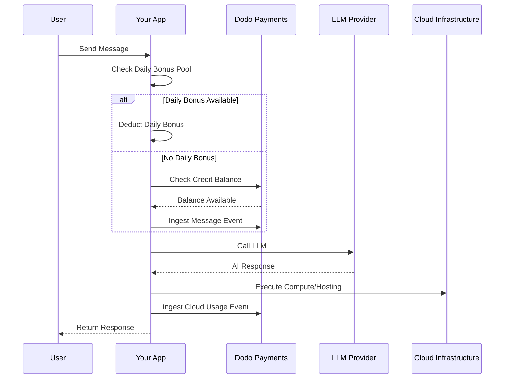

Lovable (lovable.dev) एक AI web app builder है जो credit-based subscription model का उपयोग करता है। token-based systems के विपरीत, Lovable हर message के लिए एक credit लेकर user experience को सरल बनाता है। यह model monthly credit pool को daily bonus drip के साथ जोड़ता है, ताकि लगातार engagement को प्रोत्साहित किया जा सके और burst usage की सुविधा भी बनी रहे।

## Lovable's Billing Model

Lovable की pricing message credits और cloud infrastructure के लिए separate metered billing पर आधारित है।

| Plan | Price | Monthly Credits | Daily Bonus | Key Features |
| :--- | :--- | :--- | :--- | :--- |
| Free | \$0/month | 0 | 5/day (up to 30/month) | केवल public projects |
| Pro | \$25/month | 100 | 5/day (up to 150/month total) | On-demand top-ups, usage-based Cloud + AI, custom domains |
| Business | \$50/month | 100 | 5/day | SSO, team workspace, design templates, security center |
| Enterprise | Custom | Custom | Custom | SCIM, dedicated support, audit logs |

- **Credit-based subscription**: 1 credit = AI को 1 message/prompt।
- **Credits are shared across unlimited users**: पूरे team के लिए shared pool, per-seat नहीं।
- **Credits reset each billing cycle**: Renewal पर monthly credits refresh होते हैं।
- **On-demand credit top-ups**: Credits समाप्त होने पर users और credits खरीद सकते हैं।
- **Separate usage-based Cloud + AI billing**: Hosting और compute के लिए metered billing।
- **Daily bonus credits reset each day**: प्रतिदिन 5 credits का use-it-or-lose-it daily drip।

## What Makes It Unique

- **Message-based simplicity**: Complexity की परवाह किए बिना 1 credit = 1 message। Token counting या model weighting नहीं।
- **Daily drip + monthly pool hybrid**: 5 daily bonus credits प्रतिदिन engagement को प्रोत्साहित करते हैं, जबकि 100 monthly credits burst usage की सुविधा देते हैं।
- **Team-wide shared pool**: Flat team price पर unlimited users के बीच shared credits, per-seat नहीं।
- **Two-layer billing**: AI interactions के लिए credits + cloud infrastructure के लिए separate metered billing।

## Build This with Dodo Payments

आप Dodo Payments के credit entitlements और usage-based meters का उपयोग करके Lovable के hybrid model को दोहरा सकते हैं।

<Steps>
  <Step title="Create a Custom Unit Credit Entitlement">
    अपने Dodo Payments dashboard में message credit system को define करें। यह entitlement monthly credit pool को संभालता है।

    - **Credit Type**: Custom Unit
    - **Unit Name**: "Messages"
    - **Precision**: 0
    - **Credit Expiry**: 30 days
    - **Overage**: Disabled (credits के 0 पर पहुंचने पर hard cap)
  </Step>

  <Step title="Create Subscription Products">
    अपने plans बनाएं और credit entitlement attach करें। Free plan के लिए daily bonus को application logic के माध्यम से संभालें।

    - **Free**: \$0/mo, 0 credits (daily bonus app logic द्वारा संभाला जाएगा)
    - **Pro**: \$25/mo, 100 credits/cycle, credit entitlement attach करें
    - **Business**: \$50/mo, 100 credits/cycle, credit entitlement attach करें

    ```typescript
    import DodoPayments from 'dodopayments';

    const client = new DodoPayments({
      bearerToken: process.env.DODO_PAYMENTS_API_KEY,
    });

    const session = await client.checkoutSessions.create({
      product_cart: [
        { product_id: 'prod_lovable_pro', quantity: 1 }
      ],
      customer: { email: 'user@example.com' },
      return_url: 'https://lovable.dev/dashboard'
    });
    ```

  </Step>

  <Step title="Create a Usage Meter for Cloud + AI">
    Lovable cloud infrastructure के लिए अलग से billing करता है। इन costs को track करने के लिए एक meter बनाएं।

    - **Meter name**: `cloud.compute_seconds`
    - **Aggregation**: `compute_seconds` property पर Sum

    इस meter को per-unit pricing वाले अपने subscription products से attach करें। जब आप usage ingest करते हैं, तो Dodo आपकी rates के आधार पर cost calculate करता है।

    ```typescript
    await client.usageEvents.ingest({
      events: [{
        event_id: `compute_${Date.now()}`,
        customer_id: 'cust_123',
        event_name: 'cloud.compute_seconds',
        timestamp: new Date().toISOString(),
        metadata: {
          compute_seconds: 3600,
          project_id: 'proj_abc'
        }
      }]
    });
    ```

  </Step>

  <Step title="Implement Daily Bonus Credits (Application Logic)">
    Daily bonus drip को application level पर संभाला जाता है। इन credits को grant करने या अपने database में अलग से track करने के लिए cron job का उपयोग कर सकते हैं।

    इन bonus credits के usage को Dodo में track करने के लिए, main entitlement balance को तुरंत deplete किए बिना, आप अलग event name का उपयोग कर सकते हैं या अपने app में logic संभाल सकते हैं, ताकि पहले bonus pool check किया जा सके।

    ```typescript
    // Example cron job logic (pseudo-code)
    // Every day at midnight UTC:
    // 1. Reset 'daily_bonus_used' to 0 for all users in your DB
    
    // When a user sends a message:
    async function handleMessage(userId: string) {
      const user = await db.users.findUnique({ where: { id: userId } });
      
      if (user.daily_bonus_used < 5) {
        // Use daily bonus
        await db.users.update({
          where: { id: userId },
          data: { daily_bonus_used: { increment: 1 } }
        });
        // Track for analytics but don't deduct from Dodo credits yet
        await client.usageEvents.ingest({
          events: [{
            event_id: `msg_bonus_${Date.now()}`,
            customer_id: userId,
            event_name: 'ai.message.bonus',
            timestamp: new Date().toISOString(),
            metadata: { type: 'daily_bonus' }
          }]
        });
      } else {
        // Deduct from Dodo credit entitlement
        await client.usageEvents.ingest({
          events: [{
            event_id: `msg_${Date.now()}`,
            customer_id: userId,
            event_name: 'ai.message',
            timestamp: new Date().toISOString(),
            metadata: { type: 'subscription_credit' }
          }]
        });
      }
    }
    ```

  </Step>

  <Step title="Send Usage Events for Messages">
    प्रत्येक AI message को usage event के रूप में track करें। `ai.message` event को Dodo dashboard में अपने "Messages" credit entitlement से link करें।

    ```typescript
    await client.usageEvents.ingest({
      events: [{
        event_id: `msg_${Date.now()}`,
        customer_id: 'cust_123',
        event_name: 'ai.message',
        timestamp: new Date().toISOString(),
        metadata: {
          content_length: 450,
          project_id: 'proj_abc',
          feature_type: 'editor'
        }
      }]
    });
    ```

  </Step>

  <Step title="Handle Webhooks for Low Balance">
    Users को notify करें जब उनके credits कम हो रहे हों, ताकि वे top up या upgrade कर सकें।

    ```typescript
    import DodoPayments from 'dodopayments';
    import express from 'express';

    const app = express();
    app.use(express.raw({ type: 'application/json' }));

    const client = new DodoPayments({
      bearerToken: process.env.DODO_PAYMENTS_API_KEY,
      webhookKey: process.env.DODO_PAYMENTS_WEBHOOK_KEY,
    });

    app.post('/webhooks/dodo', async (req, res) => {
      try {
        const event = client.webhooks.unwrap(req.body.toString(), {
          headers: {
            'webhook-id': req.headers['webhook-id'] as string,
            'webhook-signature': req.headers['webhook-signature'] as string,
            'webhook-timestamp': req.headers['webhook-timestamp'] as string,
          },
        });

        if (event.type === 'credit.balance_low') {
          const { customer_id, available_balance } = event.data;
          await notifyUser(customer_id, `Your balance is low: ${available_balance} messages left.`);
        }

        res.json({ received: true });
      } catch (error) {
        res.status(401).json({ error: 'Invalid signature' });
      }
    });
    ```

  </Step>
</Steps>

## Accelerate with the LLM Ingestion Blueprint

[LLM Ingestion Blueprint](/developer-resources/ingestion-blueprints/llm) आपके AI client को wrap करके tracking को सरल बनाता है।

```typescript
import { createLLMTracker } from '@dodopayments/ingestion-blueprints';
import OpenAI from 'openai';

const tracker = createLLMTracker({
  apiKey: process.env.DODO_PAYMENTS_API_KEY,
  environment: 'live_mode',
  eventName: 'ai.message',
});

const trackedClient = tracker.wrap({
  client: new OpenAI(),
  customerId: 'cust_123',
});

// Automatically tracks the message and deducts 1 credit (if configured)
await trackedClient.chat.completions.create({
  model: 'gpt-4o',
  messages: [{ role: 'user', content: 'Build a landing page' }],
});
```

<Tip>
  Automatic tracking के बारे में अधिक जानकारी के लिए [full blueprint documentation](/developer-resources/ingestion-blueprints/llm) देखें।
</Tip>

## Architecture Overview



## Key Dodo Features Used

उन features को explore करें जो इस implementation को संभव बनाते हैं।

<CardGroup cols={2}>
  <Card title="Credit-Based Billing" icon="coins" href="/features/credit-based-billing">
    Message credits और shared team pools manage करें।
  </Card>
  <Card title="Subscriptions" icon="calendar" href="/features/subscription">
    Pro और Business tiers के लिए recurring plans set up करें।
  </Card>
  <Card title="Usage-Based Billing" icon="chart-line" href="/features/usage-based-billing/introduction">
    Cloud infrastructure usage को AI credits से अलग meter करें।
  </Card>
  <Card title="Event Ingestion" icon="bolt" href="/features/usage-based-billing/event-ingestion">
    High-volume message और compute events को Dodo पर भेजें।
  </Card>
  <Card title="Webhooks" icon="webhook" href="/developer-resources/webhooks/intents/credit">
    Low credit balances के लिए notifications automate करें।
  </Card>
  <Card title="LLM Ingestion Blueprint" icon="brain-circuit" href="/developer-resources/ingestion-blueprints/llm">
    Pre-built integrations के साथ AI usage tracking को सरल बनाएं।
  </Card>
</CardGroup>
