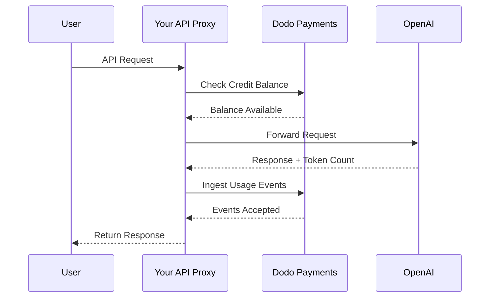
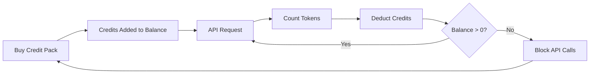

OpenAI का billing model AI कंपनियों के लिए gold standard है। यह API usage के लिए prepaid fiat credits को consumer products के flat-rate subscriptions के साथ जोड़ता है। यह hybrid approach predictable revenue सुनिश्चित करती है और developers को बिना रुकावट अपना usage बढ़ाने देती है।

## OpenAI का Model Standard क्यों है

AI industry को ऐसी अनोखी चुनौतियों का सामना करना पड़ता है जिन्हें traditional SaaS billing हमेशा संबोधित नहीं करती। OpenAI का model इनमें से कई समस्याओं को एक साथ हल करता है।

1. **Predictable Revenue और Low Risk**: API usage के लिए prepaid credits आवश्यक करके OpenAI उन users के massive bills बढ़ाने का risk समाप्त करता है जिन्हें वे चुका नहीं सकते। आपको पैसे पहले मिल जाते हैं और user service का उपयोग करते हुए भुगतान करता है।
2. **Developers के लिए Scalability**: \$5 का top-up प्रवेश की कम बाधा है। जैसे-जैसे उनका application बढ़ता है, developers top-ups automate कर सकते हैं या बड़े packs खरीद सकते हैं। शुरुआत का friction लगभग शून्य है, लेकिन growth की सीमा असीमित है।
3. **User Psychology**: Abstract "tokens" या "points" के बजाय credits को fiat currency (USD) में व्यक्त करने से value स्पष्ट रहती है। यह AI services के लिए bank account जैसा महसूस होता है, जिससे trust बनता है और companies के लिए budgeting आसान हो जाती है।

## OpenAI Billing कैसे करता है

OpenAI अलग-अलग user needs के अनुसार दो distinct billing models संचालित करता है।

1. **API (Pay-as-you-go)**: API prepaid fiat-denominated credits का उपयोग करता है। Users अपने accounts में \$5, \$10, \$50 या उससे अधिक का top-up करते हैं। इन credits में dollar value दिखाई देती है, लेकिन OpenAI के बाहर इनका कोई monetary value नहीं होता। OpenAI input और output tokens के लिए अलग-अलग rates के साथ per-token billing करता है। Credits कभी expire नहीं होते और जब user का balance \$0 तक पहुंच जाता है, तो उसकी API calls तुरंत fail हो जाती हैं।
2. **ChatGPT Plus, Team और Enterprise**: ये flat-rate subscriptions हैं। ChatGPT Plus की कीमत \$20 प्रति माह है, जबकि Team plan की कीमत \$25 प्रति user प्रति माह है। इन plans में soft usage caps होते हैं, जहां users को block करने के बजाय छोटे model पर downgrade कर दिया जाता है।
3. **Spend-based rate tiers**: समय के साथ कुल अधिक money spend करने पर आप higher API rate limits unlock करते हैं। यह trust-based access scaling system है, जो सीधे आपके billing history से जुड़ा है।

| Model | Pricing | Input Tokens | Output Tokens |
| :--- | :--- | :--- | :--- |
| GPT-4o | Usage-based | \$2.50 / 1M | \$10.00 / 1M |
| GPT-4o-mini | Usage-based | \$0.15 / 1M | \$0.60 / 1M |
| o1 | Usage-based | \$15.00 / 1M | \$60.00 / 1M |

| Plan | Price | Type |
| :--- | :--- | :--- |
| Free | \$0 | Limited access |
| Plus | \$20 / mo | Subscription with soft caps |
| Team | \$25 / user / mo | Per-seat subscription |
| Enterprise | Custom | Invoiced billing |
## इसे Unique क्या बनाता है

OpenAI की billing strategy में कई प्रमुख विशेषताएं हैं जो इसे AI services के लिए प्रभावी बनाती हैं।

- **Fiat-denominated credits**: Credits USD में denominated होने के कारण money जैसे महसूस होते हैं। इससे developers के लिए pricing transparent और समझने में आसान होती है।
- **No expiry**: कभी expire न होने वाले balances "use it or lose it" के pressure को कम करते हैं। Users बड़े amounts का top-up करने में सहज महसूस करते हैं क्योंकि उन्हें पता होता है कि value गायब नहीं होगी।
- **Multi-dimensional metering**: Input और output tokens को अलग-अलग track किया जाता है, लेकिन deduction एक ही credit balance से होती है। इससे OpenAI महंगे output tokens की pricing सस्ते input tokens से अलग रख सकता है।
- **Trust tiers**: Rate limits को total spend से जोड़ने पर users platform पर बने रहने के लिए प्रोत्साहित होते हैं और long-term customers को बेहतर performance मिलती है।
## Strategic Advantages

यह model एक powerful flywheel बनाता है। कम entry costs developers को आकर्षित करती हैं। Prepaid credits immediate cash flow प्रदान करते हैं। Usage-based scaling सुनिश्चित करती है कि developers के सफल होने के साथ OpenAI भी सफल हो। Subscription side non-developers से steady और predictable baseline revenue प्रदान करती है।

## इसे Dodo Payments के साथ बनाएं

आप Dodo Payments का उपयोग करके OpenAI के billing model को replicate कर सकते हैं। हम API के लिए Credit-Based Billing और ChatGPT Plus side के लिए standard subscriptions का उपयोग करेंगे।

<Steps>
  <Step title="Create a Fiat Credit Entitlement">
    अपने Dodo Payments dashboard में credit entitlement बनाकर शुरुआत करें। यह आपके users के लिए central balance के रूप में काम करेगा।

    * **Credit Type:** Fiat Credits (USD)
    * **Credit Expiry:** Never
    * **Rollover:** Not needed (since they never expire)
    * **Overage:** Disabled

    Overage को disable करने से यह सुनिश्चित होता है कि balance \$0 तक पहुंचने पर API calls fail हों, बिल्कुल OpenAI की तरह।
  </Step>

  <Step title="Create Top-Up Products">
    अलग-अलग credit packs के लिए one-time payment products बनाएं। आप \$5, \$10, \$50 और \$100 के options दे सकते हैं। प्रत्येक product से अपना fiat credit entitlement attach करें।

    प्रत्येक product द्वारा जारी किए जाने वाले credits को cents में set करें। \$50 pack के लिए आप 5000 credits जारी करेंगे।

    ```typescript
    import DodoPayments from 'dodopayments';

    const client = new DodoPayments({
      bearerToken: process.env.DODO_PAYMENTS_API_KEY,
    });

    const session = await client.checkoutSessions.create({
      product_cart: [
        { product_id: 'pdt_credit_pack_50', quantity: 1 }
      ],
      customer: { email: 'developer@example.com' },
      return_url: 'https://yourapp.com/dashboard'
    });
    ```

  </Step>

  <Step title="Create Usage Meters">
    Token usage track करने के लिए दो अलग meters बनाएं।

    * `llm.input_tokens`: `tokens` property पर Sum aggregation।
    * `llm.output_tokens`: `tokens` property पर Sum aggregation।

    दोनों meters को अपने fiat credit entitlement से link करें। आपको प्रत्येक के लिए "Meter units per credit" configure करना होगा।

    ### Meter Units per Credit की गणना

    OpenAI की GPT-4o pricing (\$2.50 प्रति 1M input tokens) से match करने के लिए आपको calculate करना होगा कि \$1 (100 cents) के बराबर कितने tokens हैं।

    * **Input Tokens:** 1,000,000 tokens / \$2.50 = \$1 प्रति 400,000 tokens।
    * **Output Tokens:** 1,000,000 tokens / \$10.00 = \$1 प्रति 100,000 tokens।

    Dodo dashboard में आप input के लिए "Meter units per credit" को 400,000 और output के लिए 100,000 set करेंगे।
  </Step>

  <Step title="Send Usage Events">
    प्रत्येक LLM request के बाद usage data को Dodo Payments पर भेजें। आप एक ही request में input और output दोनों events भेज सकते हैं।

    ```typescript
    await client.usageEvents.ingest({
      events: [{
        event_id: `req_${requestId}`,
        customer_id: customerId,
        event_name: 'llm.input_tokens',
        timestamp: new Date().toISOString(),
        metadata: {
          model: 'gpt-4o',
          tokens: 1500
        }
      }, {
        event_id: `req_${requestId}_out`,
        customer_id: customerId,
        event_name: 'llm.output_tokens',
        timestamp: new Date().toISOString(),
        metadata: {
          model: 'gpt-4o',
          tokens: 800
        }
      }]
    });
    ```

  </Step>

  <Step title="Handle Balance Depletion">
    API request process करने से पहले user का balance check करना चाहिए। यदि balance zero या negative है, तो 402 error return करें।

    ```typescript
    async function checkCreditsBeforeRequest(customerId: string) {
      const balance = await client.creditEntitlements.balances.retrieve(customerId, {
        credit_entitlement_id: 'credit_entitlement_id',
      });

      if (Number(balance.balance) <= 0) {
        throw new Error('Insufficient credits. Please top up your account.');
      }
    }
    ```

    ### Low Balance Webhooks को Handle करना

User के \$0 तक पहुंचने का इंतजार न करें। जब balance किसी निश्चित threshold से नीचे गिर जाए, तो email या in-app notification trigger करने के लिए webhooks का उपयोग करें।

    ```typescript
    import DodoPayments from 'dodopayments';
    import express from 'express';

    const app = express();
    app.use(express.raw({ type: 'application/json' }));

    const client = new DodoPayments({
      bearerToken: process.env.DODO_PAYMENTS_API_KEY,
      webhookKey: process.env.DODO_PAYMENTS_WEBHOOK_KEY,
    });

    app.post('/webhooks/dodo', async (req, res) => {
      try {
        const event = client.webhooks.unwrap(req.body.toString(), {
          headers: {
            'webhook-id': req.headers['webhook-id'] as string,
            'webhook-signature': req.headers['webhook-signature'] as string,
            'webhook-timestamp': req.headers['webhook-timestamp'] as string,
          },
        });

        if (event.type === 'credit.balance_low') {
          const { customer_id, available_balance } = event.data;
          await sendLowBalanceEmail(customer_id, available_balance);
        }

        res.json({ received: true });
      } catch (error) {
        res.status(401).json({ error: 'Invalid signature' });
      }
    });
    ```

    <Tip>
      OpenAI ये emails तब भेजता है जब user का balance लगभग समाप्त होने वाला होता है, जिससे उन्हें service interruption के बिना top-up करने का समय मिल जाता है।
    </Tip>
  </Step>

  <Step title="Build the ChatGPT Subscription Side (Optional)">
    यदि आप ChatGPT Plus जैसा subscription plan देना चाहते हैं, तो Dodo Payments में एक अलग subscription product बनाएं। इनके लिए credit entitlements आवश्यक नहीं हैं।

    Team plan के लिए प्रत्येक additional user के लिए add-ons जोड़कर seat-based billing का उपयोग करें।

    ```typescript
    const session = await client.checkoutSessions.create({
      product_cart: [
        { product_id: 'pdt_plus_subscription', quantity: 1 }
      ],
      customer: { email: 'user@example.com' },
      return_url: 'https://yourapp.com/billing'
    });
    ```

    ### Soft Caps को Implement करना

    OpenAI के soft caps को replicate करने के लिए आप अपने subscription users का usage उन्हीं meters का उपयोग करके track कर सकते हैं, लेकिन उन्हें credit entitlement से link न करें। अपने application logic में current billing period का usage check करें।

    ```typescript
    async function checkSubscriptionUsage(customerId: string) {
      const usage = await getUsageForCurrentPeriod(customerId);
      
      if (usage > SOFT_CAP_THRESHOLD) {
        // Route to a smaller model instead of blocking
        return 'gpt-4o-mini';
      }
      
      return 'gpt-4o';
    }
    ```

  </Step>
</Steps>

## LLM Ingestion Blueprint के साथ Accelerate करें

ऊपर दिए गए steps दिखाते हैं कि usage events को manually कैसे construct और send किया जाता है। Production deployments के लिए, [LLM Ingestion Blueprint](/developer-resources/ingestion-blueprints/llm automatic token tracking प्रदान करता है, जो आपके OpenAI client को सीधे wrap करता है।

```bash
npm install @dodopayments/ingestion-blueprints
```

```typescript
import { createLLMTracker } from '@dodopayments/ingestion-blueprints';
import OpenAI from 'openai';

const openai = new OpenAI({ apiKey: process.env.OPENAI_API_KEY });

const tracker = createLLMTracker({
  apiKey: process.env.DODO_PAYMENTS_API_KEY,
  environment: 'live_mode',
  eventName: 'llm.chat_completion',
});

const trackedClient = tracker.wrap({
  client: openai,
  customerId: customerId,
});

// Every API call now automatically tracks token usage
const response = await trackedClient.chat.completions.create({
  model: 'gpt-4o',
  messages: [{ role: 'user', content: prompt }],
});

// inputTokens, outputTokens, and totalTokens are sent automatically
console.log('Tokens used:', response.usage);
```

Blueprint प्रत्येक API response से `inputTokens`, `outputTokens` और `totalTokens` capture करता है और उन्हें event metadata के रूप में भेजता है। अपने meter को उपयुक्त token property पर aggregate करने के लिए configure करें।

<Tip>
LLM Blueprint OpenAI, Anthropic, Groq, Google Gemini, OpenRouter और Vercel AI SDK को support करता है। Provider-specific examples और advanced configuration के लिए [full blueprint documentation](/developer-resources/ingestion-blueprints/llm देखें।
</Tip>

## Spend-Based Rate Tiers को Implement करना

OpenAI के rate tiers capacity manage करने का एक powerful तरीका हैं। आप customer के total lifetime spend को track करके इसे implement कर सकते हैं।

1. **Track Lifetime Spend:** `payment.succeeded` webhooks को listen करें और उस customer के लिए अपने database में `total_spend` field update करें।
2. **Define Tiers:** Spend amounts और rate limits की mapping बनाएं।
   * Tier 1: \$0 - \$50 spend -> 3 RPM
   * Tier 2: \$50 - \$250 spend -> 10 RPM
   * Tier 3: \$250+ spend -> 50 RPM
3. **Enforce Limits:** अपने API middleware में customer का tier check करें और corresponding rate limit लागू करें।

```typescript
async function getRateLimitForCustomer(customerId: string) {
  const customer = await db.customers.findUnique({ where: { id: customerId } });
  const totalSpend = customer.total_spend;

  if (totalSpend >= 25000) return TIER_3_LIMITS; // $250.00
  if (totalSpend >= 5000) return TIER_2_LIMITS;  // $50.00
  return TIER_1_LIMITS;
}
```

## Full Implementation Example: API Proxy

Real-world scenario में आपके पास संभवतः एक API proxy होगा जो आपके users और LLM provider के बीच बैठता है। यह proxy authentication, credit checks और usage reporting संभालता है।



```typescript
import DodoPayments from 'dodopayments';
import OpenAI from 'openai';

const client = new DodoPayments({
  bearerToken: process.env.DODO_PAYMENTS_API_KEY,
});
const openai = new OpenAI({ apiKey: process.env.OPENAI_API_KEY });

export async function handleApiRequest(req, res) {
  const { customerId, prompt, model } = req.body;

  try {
    // 1. Check credit balance
    const balance = await client.creditEntitlements.balances.retrieve(customerId, {
      credit_entitlement_id: 'credit_entitlement_id',
    });

    if (Number(balance.balance) <= 0) {
      return res.status(402).json({ error: 'Insufficient credits. Please top up.' });
    }

    // 2. Call OpenAI
    const completion = await openai.chat.completions.create({
      model: model,
      messages: [{ role: 'user', content: prompt }],
    });

    const { prompt_tokens, completion_tokens } = completion.usage;

    // 3. Ingest usage events to Dodo
    await client.usageEvents.ingest({
      events: [
        {
          event_id: `req_${completion.id}_in`,
          customer_id: customerId,
          event_name: 'llm.input_tokens',
          timestamp: new Date().toISOString(),
          metadata: { model, tokens: prompt_tokens }
        },
        {
          event_id: `req_${completion.id}_out`,
          customer_id: customerId,
          event_name: 'llm.output_tokens',
          timestamp: new Date().toISOString(),
          metadata: { model, tokens: completion_tokens }
        }
      ]
    });

    // 4. Return response to user
    res.json(completion);

  } catch (error) {
    console.error('API Error:', error);
    res.status(500).json({ error: 'Internal server error' });
  }
}
```

## Edge Cases को Handle करना

OpenAI जितना complex billing system बनाते समय आपको कई edge cases मिलेंगे जिन्हें सावधानी से handle करना आवश्यक है।

### Race Conditions

यदि user का balance बहुत कम है और वह एक साथ multiple requests भेजता है, तो पहला event process होने से पहले वह अपनी credit limit पार कर सकता है। इसे रोकने के लिए आप एक छोटा "buffer" implement कर सकते हैं या request के दौरान customer के balance पर distributed lock का उपयोग कर सकते हैं।

### Event Ingestion Latency

Dodo Payments events को asynchronously process करता है। इसका अर्थ है कि API call और credit deduction के बीच थोड़ा delay हो सकता है। अधिकांश use cases के लिए यह स्वीकार्य है। यदि आपको strict real-time enforcement चाहिए, तो आप user के balance का local cache maintain करके उसे optimistically update कर सकते हैं।

### Refund Handling

यदि आप किसी credit pack purchase का refund करते हैं, तो Dodo Payments configured होने पर credit entitlement को automatically handle करेगा। हालांकि, आपको यह सुनिश्चित करना चाहिए कि आपका application logic इस change को तुरंत reflect करे, ताकि users उन credits का उपयोग न कर सकें जो अब उनके पास नहीं हैं।

### Multi-Model Support

यदि आप अलग-अलग pricing वाले multiple models को support करते हैं, तो आपके पास दो options हैं:
1. **Separate Meters:** प्रत्येक model के लिए अलग meters बनाएं (जैसे, `gpt-4o.input_tokens`, `gpt-4o-mini.input_tokens`)।
2. **Weighted Events:** एक single meter का उपयोग करें, लेकिन `tokens` value को Dodo पर भेजने से पहले weight से multiply करें। उदाहरण के लिए, यदि GPT-4o, GPT-4o-mini से 10x अधिक महंगा है, तो आप GPT-4o requests के लिए tokens की संख्या 10x भेज सकते हैं।

OpenAI usage per model के clear records बनाए रखने के लिए internally separate meter approach का उपयोग करता है।

## Architecture Overview



Meters tokens को track करते हैं और configured rates के आधार पर user के credit balance से corresponding value deduct करते हैं।

## Conclusion

Dodo Payments के साथ OpenAI के billing model को replicate करने पर आपको दोनों worlds का best मिलता है: usage-based billing की flexibility और prepaid credits की predictability। इस guide का पालन करके आप ऐसा billing system बना सकते हैं जो आपके users के साथ scale हो और आपके margins की सुरक्षा करे।

चाहे आप अगला बड़ा LLM बना रहे हों या कोई niche AI tool, ये patterns आपको professional और developer-friendly experience बनाने में मदद करेंगे। यह approach सुनिश्चित करती है कि आपका billing infrastructure उतना ही scalable और reliable हो जितने AI models आप अपने customers को deliver कर रहे हैं।

## उपयोग की गई Dodo की मुख्य Features

उन features को explore करें जो इस implementation को संभव बनाते हैं।

<CardGroup cols={2}>
  <Card title="Credit-Based Billing" icon="coins" href="/features/credit-based-billing">
    अपने users के लिए prepaid fiat credits और entitlements manage करें।
  </Card>
  <Card title="Usage-Based Billing" icon="chart-line" href="/features/usage-based-billing/introduction">
    Tokens जैसे granular usage को track करें और real-time में उसके लिए bill करें।
  </Card>
  <Card title="One-Time Payments" icon="credit-card" href="/features/one-time-payment-products">
    Simple checkout flow के साथ credit packs और top-ups बेचें।
  </Card>
  <Card title="Event Ingestion" icon="bolt" href="/features/usage-based-billing/event-ingestion">
    High-volume usage data को आसानी से Dodo Payments पर भेजें।
  </Card>
  <Card title="Webhooks" icon="webhook" href="/developer-resources/webhooks/intents/credit">
    Credit balance changes और low balance alerts की जानकारी पाते रहें।
  </Card>
  <Card title="LLM Ingestion Blueprint" icon="brain-circuit" href="/developer-resources/ingestion-blueprints/llm">
    OpenAI और अन्य LLM providers के लिए automatic token tracking।
  </Card>
</CardGroup>
