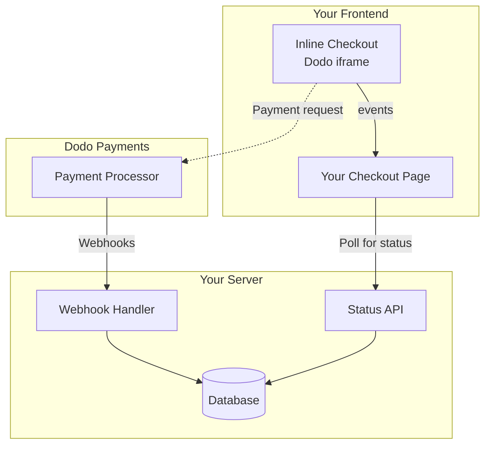

## अवलोकन

इनलाइन चेकआउट आपको पूरी तरह से एकीकृत चेकआउट अनुभव बनाने की अनुमति देता है जो आपकी वेबसाइट या एप्लिकेशन के साथ सहजता से मिश्रित होता है। [ओवरले चेकआउट](/developer-resources/overlay-checkout) के विपरीत, जो आपकी पृष्ठ पर एक मोडल के रूप में खुलता है, इनलाइन चेकआउट भुगतान फॉर्म को सीधे आपकी पृष्ठ लेआउट में एम्बेड करता है।

इनलाइन चेकआउट का उपयोग करके, आप:

- ऐसे चेकआउट अनुभव बनाएं जो आपके ऐप या वेबसाइट के साथ पूरी तरह से एकीकृत हों
- डोडो पेमेंट्स को सुरक्षित रूप से ग्राहक और भुगतान जानकारी एक अनुकूलित चेकआउट फ्रेम में कैप्चर करने दें
- अपनी पृष्ठ पर डोडो पेमेंट्स से आइटम, कुल और अन्य जानकारी प्रदर्शित करें
- उन्नत चेकआउट अनुभव बनाने के लिए SDK विधियों और घटनाओं का उपयोग करें

<Frame>
    
</Frame>

## यह कैसे काम करता है

इनलाइन चेकआउट आपकी वेबसाइट या ऐप में एक सुरक्षित डोडो पेमेंट्स फ्रेम को एम्बेड करके काम करता है।

चेकआउट फ्रेम ग्राहक जानकारी एकत्र करने और भुगतान विवरण कैप्चर करने का काम करता है। आपकी पृष्ठ पर आइटम सूची, कुल और चेकआउट पर जो कुछ है उसे बदलने के विकल्प प्रदर्शित होते हैं। SDK आपकी पृष्ठ और चेकआउट फ्रेम के बीच बातचीत करने की अनुमति देता है।

डोडो पेमेंट्स स्वचालित रूप से एक चेकआउट पूरा होने पर एक सदस्यता बनाता है, जिसे आप प्रावधान करने के लिए तैयार कर सकते हैं।

<Note>
इनलाइन चेकआउट फ्रेम सभी संवेदनशील भुगतान जानकारी को सुरक्षित रूप से संभालता है, आपके पक्ष पर अतिरिक्त प्रमाणपत्र के बिना PCI अनुपालन सुनिश्चित करता है।
</Note>

## एक अच्छा इनलाइन चेकआउट क्या बनाता है?

यह महत्वपूर्ण है कि ग्राहकों को पता हो कि वे किससे खरीद रहे हैं, वे क्या खरीद रहे हैं, और वे कितना भुगतान कर रहे हैं।

एक इनलाइन चेकआउट बनाने के लिए जो अनुपालन में हो और रूपांतरण के लिए अनुकूलित हो, आपकी कार्यान्वयन में शामिल होना चाहिए:

<Frame caption="Example inline checkout layout showing required elements">
    
</Frame>

1. **दोहराने की जानकारी**: यदि यह दोहराने वाला है, तो यह कितनी बार दोहराता है और नवीनीकरण पर कुल कितना भुगतान करना है। यदि यह एक परीक्षण है, तो परीक्षण कितने समय तक चलता है।
2. **आइटम विवरण**: जो खरीदा जा रहा है उसका विवरण।
3. **लेनदेन कुल**: लेनदेन कुल, जिसमें उप-योग, कुल कर, और समग्र कुल शामिल हैं। सुनिश्चित करें कि मुद्रा भी शामिल है।
4. **डोडो पेमेंट्स फ़ुटर**: पूरा इनलाइन चेकआउट फ्रेम, जिसमें चेकआउट फ़ुटर शामिल है जिसमें डोडो पेमेंट्स, हमारी बिक्री की शर्तें, और हमारी गोपनीयता नीति के बारे में जानकारी है।
5. **रिफंड नीति**: आपकी रिफंड नीति का एक लिंक, यदि यह डोडो पेमेंट्स की मानक रिफंड नीति से भिन्न है।

<Warning>
हमेशा पूरा इनलाइन चेकआउट फ़्रेम, फ़ूटर सहित, प्रदर्शित करें। कानूनी जानकारी को हटाना या छिपाना अनुपालन आवश्यकताओं का उल्लंघन करता है।
</Warning>

## ग्राहक यात्रा

चेकआउट प्रवाह आपकी चेकआउट सत्र कॉन्फ़िगरेशन द्वारा निर्धारित होता है। जिस तरह से आप चेकआउट सत्र को कॉन्फ़िगर करते हैं, उसके आधार पर, ग्राहक एक चेकआउट का अनुभव करेंगे जो एक ही पृष्ठ पर सभी जानकारी प्रस्तुत कर सकता है या कई चरणों में।

<Steps>
<Step title="Customer opens checkout">

आप इनलाइन चेकआउट को आइटम या मौजूदा लेनदेन पास करके खोल सकते हैं। SDK का उपयोग पेज पर जानकारी दिखाने और अपडेट करने के लिए करें, और ग्राहक संपर्क के आधार पर आइटम अपडेट करने के लिए SDK विधियों का उपयोग करें।
    

</Step>

<Step title="Customer enters their details">

इनलाइन चेकआउट पहले ग्राहकों से उनके ईमेल पते, उनके देश का चयन करने, और (जहां आवश्यक हो) उनके ZIP या पोस्टल कोड दर्ज करने के लिए कहता है। यह चरण सभी आवश्यक जानकारी एकत्र करता है ताकि कर और उपलब्ध भुगतान विकल्पों का निर्धारण किया जा सके।

आप ग्राहक विवरण को पूर्व-भर सकते हैं और अनुभव को सरल बनाने के लिए सहेजे गए पते प्रस्तुत कर सकते हैं।

</Step>

<Step title="Customer selects payment method">

अपने विवरण दर्ज करने के बाद, ग्राहकों को उपलब्ध भुगतान विधियों और भुगतान फॉर्म के साथ प्रस्तुत किया जाता है। विकल्पों में क्रेडिट या डेबिट कार्ड, PayPal, Apple Pay, Google Pay, और उनके स्थान के आधार पर अन्य स्थानीय भुगतान विधियाँ शामिल हो सकती हैं।

यदि उपलब्ध हो तो चेकआउट को तेज़ करने के लिए सहेजे गए भुगतान विधियों को प्रदर्शित करें।


</Step>

<Step title="Checkout completed">

डोडो पेमेंट्स हर भुगतान को उस बिक्री के लिए सबसे अच्छे अधिग्रहणकर्ता के पास रूट करता है ताकि सफलता की सबसे अच्छी संभावना मिल सके। ग्राहक एक सफलता कार्यप्रवाह में प्रवेश करते हैं जिसे आप बना सकते हैं।


</Step>

<Step title="Dodo Payments creates subscription">

डोडो पेमेंट्स स्वचालित रूप से ग्राहक के लिए एक सदस्यता बनाता है, जिसे आप प्रावधान करने के लिए तैयार कर सकते हैं। ग्राहक द्वारा उपयोग की गई भुगतान विधि नवीनीकरण या सदस्यता परिवर्तनों के लिए फ़ाइल पर रखी जाती है।


</Step>
</Steps>

## त्वरित प्रारंभ

कुछ कोड की पंक्तियों में Dodo Payments इनलाइन चेकआउट के साथ शुरू करें:

```typescript
import { DodoPayments } from "dodopayments-checkout";

// Initialize the SDK for inline mode
DodoPayments.Initialize({
  mode: "test",
  displayType: "inline",
  onEvent: (event) => {
    console.log("Checkout event:", event);
  },
});

// Open checkout in a specific container
DodoPayments.Checkout.open({
  checkoutUrl: "https://test.dodopayments.com/session/cks_123",
  elementId: "dodo-inline-checkout" // ID of the container element
});
```

<Tip>
सुनिश्चित करें कि आपके पेज पर संबंधित `id` वाला एक container element मौजूद है: `<div id="dodo-inline-checkout"></div>`।
</Tip>

## चरण-दर-चरण एकीकरण गाइड

<Steps>
<Step title="Install the SDK">

Dodo Payments चेकआउट SDK स्थापित करें:

<CodeGroup>

```bash npm
npm install dodopayments-checkout
```

```bash yarn
yarn add dodopayments-checkout
```

```bash pnpm
pnpm add dodopayments-checkout
```

</CodeGroup>

</Step>

<Step title="Initialize the SDK for Inline Display">

SDK को इनिशियलाइज़ करें और `displayType: 'inline'` निर्दिष्ट करें। आपको `checkout.breakdown` इवेंट को भी सुनना चाहिए ताकि आप अपने UI को वास्तविक समय के कर और कुल गणनाओं के साथ अपडेट कर सकें।

```typescript
import { DodoPayments } from "dodopayments-checkout";

DodoPayments.Initialize({
  mode: "test",
  displayType: "inline",
  onEvent: (event) => {
    if (event.event_type === "checkout.breakdown") {
      const breakdown = event.data?.message;
      // Update your UI with breakdown.subTotal, breakdown.tax, breakdown.total, etc.
    }
  },
});
```

</Step>

<Step title="Create a Container Element">

अपने HTML में एक तत्व जोड़ें जहाँ चेकआउट फ्रेम इंजेक्ट किया जाएगा:

```html
<div id="dodo-inline-checkout"></div>
```

</Step>

<Step title="Open the Checkout">

अपने कंटेनर के `checkoutUrl` और `elementId` के साथ `DodoPayments.Checkout.open()` कॉल करें:

```typescript
DodoPayments.Checkout.open({
  checkoutUrl: "https://test.dodopayments.com/session/cks_123",
  elementId: "dodo-inline-checkout"
});
```

</Step>

<Step title="Test Your Integration">

1. अपने विकास सर्वर को प्रारंभ करें:

```bash
npm run dev
```

2. चेकआउट प्रवाह का परीक्षण करें:
   - इनलाइन फ्रेम में अपना ईमेल और पता विवरण दर्ज करें।
   - सत्यापित करें कि आपका कस्टम ऑर्डर सारांश वास्तविक समय में अपडेट होता है।
   - परीक्षण क्रेडेंशियल्स का उपयोग करके भुगतान प्रवाह का परीक्षण करें।
   - पुष्टि करें कि रीडायरेक्ट सही ढंग से काम करते हैं।

<Check>
यदि आपने `onEvent` कॉलबैक में एक कंसोल लॉग जोड़ा है, तो आपको ब्राउज़र कंसोल में `checkout.breakdown` इवेंट्स लॉग होते हुए दिखने चाहिए।
</Check>

</Step>

<Step title="Go Live">

जब आप उत्पादन के लिए तैयार हों:

1. मोड को `'live'` में बदलें:

```typescript
DodoPayments.Initialize({
  mode: "live",
  displayType: "inline",
  onEvent: (event) => {
    // Handle events
  }
});
```

2. अपने चेकआउट URLs को अपने बैकएंड से लाइव चेकआउट सत्रों का उपयोग करने के लिए अपडेट करें।
3. उत्पादन में पूरे प्रवाह का परीक्षण करें।

</Step>
</Steps>

## पूर्ण React उदाहरण

यह उदाहरण दिखाता है कि कैसे इनलाइन चेकआउट के साथ एक कस्टम ऑर्डर सारांश को लागू किया जाए, `checkout.breakdown` इवेंट का उपयोग करके उन्हें सिंक में रखा जाए।

```tsx
"use client";

import { useEffect, useState } from 'react';
import { DodoPayments, CheckoutBreakdownData } from 'dodopayments-checkout';

export default function CheckoutPage() {
  const [breakdown, setBreakdown] = useState<Partial<CheckoutBreakdownData>>({});

  useEffect(() => {
    // 1. Initialize the SDK
    DodoPayments.Initialize({
      mode: 'test',
      displayType: 'inline',
      onEvent: (event) => {
        // 2. Listen for the 'checkout.breakdown' event
        if (event.event_type === "checkout.breakdown") {
          const message = event.data?.message as CheckoutBreakdownData;
          if (message) setBreakdown(message);
        }
      }
    });

    // 3. Open the checkout in the specified container
    DodoPayments.Checkout.open({
      checkoutUrl: 'https://test.dodopayments.com/session/cks_123',
      elementId: 'dodo-inline-checkout'
    });

    return () => DodoPayments.Checkout.close();
  }, []);

  const format = (amt: number | null | undefined, curr: string | null | undefined) => 
    amt != null && curr ? `${curr} ${(amt/100).toFixed(2)}` : '0.00';

  const currency = breakdown.currency ?? breakdown.finalTotalCurrency ?? '';

  return (
    <div className="flex flex-col md:flex-row min-h-screen">
      {/* Left Side - Checkout Form */}
      <div className="w-full md:w-1/2 flex items-center">
        <div id="dodo-inline-checkout" className='w-full' />
      </div>

      {/* Right Side - Custom Order Summary */}
      <div className="w-full md:w-1/2 p-8 bg-gray-50">
        <h2 className="text-2xl font-bold mb-4">Order Summary</h2>
        <div className="space-y-2">
          {breakdown.subTotal && (
            <div className="flex justify-between">
              <span>Subtotal</span>
              <span>{format(breakdown.subTotal, currency)}</span>
            </div>
          )}
          {breakdown.discount && (
            <div className="flex justify-between">
              <span>Discount</span>
              <span>{format(breakdown.discount, currency)}</span>
            </div>
          )}
          {breakdown.tax != null && (
            <div className="flex justify-between">
              <span>Tax</span>
              <span>{format(breakdown.tax, currency)}</span>
            </div>
          )}
          <hr />
          {(breakdown.finalTotal ?? breakdown.total) && (
            <div className="flex justify-between font-bold text-xl">
              <span>Total</span>
              <span>{format(breakdown.finalTotal ?? breakdown.total, breakdown.finalTotalCurrency ?? currency)}</span>
            </div>
          )}
        </div>
      </div>
    </div>
  );
}

```

## API संदर्भ

### कॉन्फ़िगरेशन

#### प्रारंभिक विकल्प

```typescript
interface InitializeOptions {
  mode: "test" | "live";
  displayType: "inline"; // Required for inline checkout
  onEvent: (event: CheckoutEvent) => void;
}
```

| विकल्प | प्रकार | आवश्यक | विवरण |
|--------|------|----------|-------------|
| `mode` | `"test" \| "live"` | Yes | Environment mode. |
| `displayType` | `"inline" \| "overlay"` | Yes | Must be set to `"inline"` to embed the checkout. |
| `onEvent` | `function` | Yes | Callback function for handling checkout events. |

#### चेकआउट विकल्प

```typescript
export type FontSize = "xs" | "sm" | "md" | "lg" | "xl" | "2xl";
export type FontWeight = "normal" | "medium" | "bold" | "extraBold";

interface CheckoutOptions {
  checkoutUrl: string;
  elementId: string; // Required for inline checkout
  options?: {
    showTimer?: boolean;
    showSecurityBadge?: boolean;
    payButtonText?: string;
    fontSize?: FontSize;
    fontWeight?: FontWeight;
  };
}
```

| विकल्प | प्रकार | आवश्यक | विवरण |
|--------|------|----------|-------------|
| `checkoutUrl` | `string` | हाँ | चेकआउट सत्र URL। |
| `elementId` | `string` | हाँ | वह `id` जहां चेकआउट रेंडर होना चाहिए। |
| `options.showTimer` | `boolean` | नहीं | चेकआउट टाइमर दिखाएं या छिपाएं। डिफॉल्ट्स से `true`। जब अक्षम किया जाता है, तो आपको सत्र समाप्त होने पर `checkout.link_expired` घटना प्राप्त होगी। |
| `options.showSecurityBadge` | `boolean` | नहीं | सुरक्षा बैज दिखाएं या छिपाएं। डिफॉल्ट्स से `true`। |
| `options.payButtonText` | `string` | नहीं | पे बटन पर प्रदर्शित करने के लिए कस्टम टेक्स्ट। |
| `options.fontSize` | `FontSize` | नहीं | चेकआउट के लिए वैश्विक फॉन्ट साइज। |
| `options.fontWeight` | `FontWeight` | नहीं | चेकआउट के लिए वैश्विक फॉन्ट वेट। |

### विधियाँ

#### चेकआउट खोलें

निर्दिष्ट कंटेनर में चेकआउट फ्रेम खोलता है।

```typescript
DodoPayments.Checkout.open({
  checkoutUrl: "https://test.dodopayments.com/session/cks_123",
  elementId: "dodo-inline-checkout"
});
```

आप चेकआउट व्यवहार को अनुकूलित करने के लिए अतिरिक्त विकल्प भी पास कर सकते हैं:

```typescript
DodoPayments.Checkout.open({
  checkoutUrl: "https://test.dodopayments.com/session/cks_123",
  elementId: "dodo-inline-checkout",
  options: {
    showTimer: false,
    showSecurityBadge: false,
    payButtonText: "Pay Now",
  },
});
```

#### चेकआउट बंद करें

प्रोग्रामेटिक रूप से चेकआउट फ्रेम को हटा देता है और इवेंट लिसेनर्स को साफ करता है।

```typescript
DodoPayments.Checkout.close();
```

#### स्थिति जांचें

विवरण देता है कि चेकआउट फ्रेम वर्तमान में इंजेक्टेड है या नहीं।

```typescript
const isOpen = DodoPayments.Checkout.isOpen();
// Returns: boolean
```

### इवेंट्स

SDK वास्तविक समय की घटनाएं प्रदान करता है `onEvent` कॉलबैक के माध्यम से। इनलाइन चेकआउट के लिए, `checkout.breakdown` विशेष रूप से आपके UI को सिंक करने के लिए उपयोगी है।

| इवेंट प्रकार | विवरण |
|------------|-------------|
| `checkout.opened` | चेकआउट फ्रेम लोड हो गया है। |
| `checkout.form_ready` | चेकआउट फॉर्म उपयोगकर्ता द्वारा इनपुट प्राप्त करने के लिए तैयार है। लोडिंग राज्यों को छिपाने और चेकआउट UI दिखाने के लिए उपयोगी है। |
| `checkout.breakdown` | जब कीमतें, कर, या छूट अपडेट की जाती है, फ़ायर किया जाता है। |
| `checkout.customer_details_submitted` | ग्राहक विवरण सबमिट कर दिए गए हैं। |
| `checkout.pay_button_clicked` | जब ग्राहक पे बटन पर क्लिक करता है तो फ़ायर किया जाता है। एनालिटिक्स और रूपांतरण फ़नल ट्रैक करने के लिए उपयोगी। |
| `checkout.redirect` | चेकआउट एक रीडायरेक्ट करेगा (जैसे, एक बैंक पृष्ठ पर)। |
| `checkout.error` | चेकआउट के दौरान कोई त्रुटि हुई। |
| `checkout.link_expired` | जब चेकआउट सत्र समाप्त होता है तो फ़ायर किया जाता है। केवल तभी प्राप्त होता है जब `showTimer` को `false` पर सेट किया गया हो। |

#### चेकआउट ब्रेकडाउन डेटा

`checkout.breakdown` घटना निम्न डेटा प्रदान करती है:

```typescript
interface CheckoutBreakdownData {
  subTotal?: number;          // Amount in cents
  discount?: number;         // Amount in cents
  tax?: number;              // Amount in cents
  total?: number;            // Amount in cents
  currency?: string;         // e.g., "USD"
  finalTotal?: number;       // Final amount including adjustments
  finalTotalCurrency?: string; // Currency for the final total
}
```

#### ब्रेकडाउन इवेंट को समझना

`checkout.breakdown` घटना आपके एप्लिकेशन के UI को Dodo Payments चेकआउट स्थिति के साथ सिंक में रखने का प्राथमिक तरीका है।

**यह कब फायर करता है:**
- **आरंभ करने पर**: ठीक बाद में जब चेकआउट फ्रेम लोड हो जाता है और तैयार होता है।
- **पता बदलने पर**: जब भी ग्राहक किसी देश का चयन करता है या एक पोस्टल कोड दर्ज करता है जिससे टैक्स पुनर्गणना होती है।

**फील्ड विवरण:**

| फील्ड | विवरण |
|-------|-------------|
| `subTotal` | सत्र में सभी लाइन आइटम्स का योग, किसी भी डिस्काउंट या टैक्स को लागू करने से पहले। |
| `discount` | सभी लागू डिस्काउंट्स का कुल मूल्य। |
| `tax` | गणना की गई कर राशि। `inline` मोड में, यह उपयोगकर्ता द्वारा पता फ़ील्ड के साथ इंटरैक्ट करने के दौरान डायनामिक रूप से अपडेट होती है। |
| `total` | सत्र की आधार मुद्रा में `subTotal - discount + tax` का गणितीय परिणाम। |
| `currency` | मानक सबटोटल, डिस्काउंट, और टैक्स मूल्यों के लिए ISO मुद्रा कोड (जैसे, `"USD"`)। |
| `finalTotal` | ग्राहक से वास्तविक चार्ज की गई राशि। इसमें अतिरिक्त विदेशी मुद्रा समायोजन या स्थानीय भुगतान विधि शुल्क शामिल हो सकते हैं जो मूल मूल्य ब्रेकडाउन का हिस्सा नहीं हैं। |
| `finalTotalCurrency` | वह मुद्रा जिसमें ग्राहक वास्तव में भुगतान कर रहा है। यह `currency` से भिन्न हो सकता है यदि क्रय शक्ति समानता या स्थानीय मुद्रा रूपांतरण सक्रिय है। |

**प्रमुख एकीकरण युक्तियाँ:**

1.  **मुद्रा स्वरूपण**: मूल्य हमेशा सबसे छोटी मुद्रा इकाई (जैसे, USD के लिए सेंट्स, JPY के लिए येन) में पूर्णांकों के रूप में लौटाए जाते हैं। उन्हें दिखाने के लिए, 100 से विभाजित करें (या उपयुक्त 10 की शक्ति) या एक स्वरूपण लाइब्रेरी का उपयोग करें जैसे `Intl.NumberFormat`।
2.  **प्रारंभिक राज्यों को संभालना**: जब चेकआउट पहली बार लोड होता है, `tax` और `discount` `0` या `null` हो सकते हैं जब तक कि उपयोगकर्ता अपने बिलिंग जानकारी प्रदान नहीं करता या एक कोड लागू नहीं करता। आपका UI इन राज्यों को अनुग्रहपूर्वक संभालना चाहिए (जैसे, एक डैश `—` दिखाना या रो को छिपाना)।
3.  **"फाइनल टोटल" बनाम "टोटल"**: जबकि `total` आपको मानक मूल्य की गणना देता है, `finalTotal` लेनदेन के लिए सत्य का स्रोत है। यदि `finalTotal` मौजूद है, तो यह ग्राहक के कार्ड पर सही रूप से चार्ज किया जाएगा, जिसमें कोई डायनामिक समायोजन शामिल हो।
4.  **वास्तविक समय प्रतिक्रिया**: टैक्‍सेस को वास्तविक समय में उपयोगकर्ताओं को दिखाने के लिए `tax` फ़ील्ड का उपयोग करें। इससे आपके चेकआउट पेज को "लाइव" फील मिलता है और पते के प्रवेश चरण के दौरान घर्षण कम होता है।

## कार्यान्वयन विकल्प

### पैकेज प्रबंधक स्थापना

[स्टेप-बाय-स्टेप इंटीग्रेशन गाइड](#step-by-step-integration-guide) में दिखाए गए अनुसार npm, yarn, या pnpm के माध्यम से इंस्टॉल करें।

### CDN कार्यान्वयन

बिल्ड स्टेप के बिना त्वरित एकीकरण के लिए, आप हमारे CDN का उपयोग कर सकते हैं:

```html
<!DOCTYPE html>
<html lang="en">
<head>
    <meta charset="UTF-8">
    <meta name="viewport" content="width=device-width, initial-scale=1.0">
    <title>Dodo Payments Inline Checkout</title>
    
    <!-- Load DodoPayments -->
    <script src="https://cdn.jsdelivr.net/npm/dodopayments-checkout@latest/dist/index.js"></script>
    <script>
        // Initialize the SDK
        DodoPaymentsCheckout.DodoPayments.Initialize({
            mode: "test",
            displayType: "inline",
            onEvent: (event) => {
                console.log('Checkout event:', event);
            }
        });
    </script>
</head>
<body>
    <div id="dodo-inline-checkout"></div>

    <script>
        // Open the checkout
        DodoPaymentsCheckout.DodoPayments.Checkout.open({
            checkoutUrl: "https://test.dodopayments.com/session/cks_123",
            elementId: "dodo-inline-checkout"
        });
    </script>
</body>
</html>
```

## भुगतान विधि अपडेट करें

इनलाइन चेकआउट सदस्यताओं के लिए **भुगतान विधि अपडेट** का समर्थन करता है। जब किसी ग्राहक को उनकी भुगतान विधि अपडेट करने की ज़रूरत होती है - चाहे किसी सक्रिय सदस्यता के लिए हो या किसी स्थगित सदस्यता को पुन: सक्रिय करने के लिए - आप अपनी पेज लेआउट के भीतर सीधे अपडेट प्रवाह प्रस्तुत कर सकते हैं।

### यह कैसे काम करता है

1. [भुगतान विधि अपडेट API](/features/subscription#update-payment-method-for-active-subscription) को कॉल करें ताकि आपको एक `payment_link` मिल सके:

```typescript
const response = await client.subscriptions.updatePaymentMethod('sub_123', {
  payment_method: { type: 'new', return_url: 'https://example.com/return' }
});
```

2. पारित किए गए `payment_link` को `checkoutUrl` के रूप में इनलाइन चेकआउट खोलने के लिए:

```typescript
DodoPayments.Checkout.open({
  checkoutUrl: response.payment_link,
  elementId: "dodo-inline-checkout"
});
```

इनलाइन फ्रेम केवल भुगतान विधि संग्रह फॉर्म प्रस्तुत करता है। ग्राहक नए कार्ड विवरण दर्ज कर सकते हैं या बिना आपके पेज को छोड़े एक सहेजी गई भुगतान विधि का चयन कर सकते हैं।

### होल्ड पर सदस्यताओं के लिए

जब `on_hold` स्थिति में सदस्यता के लिए भुगतान विधि को अपडेट किया जाता है, Dodo Payments किसी भी बकाया शुल्क के लिए स्वतः चार्ज बनाता है। पुन: सक्रियता की पुष्टि के लिए `payment.succeeded` और `subscription.active` वेबहुक मॉनिटर करें।

```typescript
const response = await client.subscriptions.updatePaymentMethod('sub_123', {
  payment_method: { type: 'new', return_url: 'https://example.com/return' }
});

if (response.payment_id) {
  // Charge created for remaining dues
  // Open inline checkout for payment collection
  DodoPayments.Checkout.open({
    checkoutUrl: response.payment_link,
    elementId: "dodo-inline-checkout"
  });
}
```

<Tip>
आप नवीन विवरण एकत्र करने के बजाय एक मौजूदा सहेजी गई भुगतान विधि का उपयोग कर सकते हैं, इसके लिए_`type: 'existing'` को `payment_method_id` के साथ भुगतान विधि अपडेट API में पास करके।
</Tip>

## त्रुटि प्रबंधन

SDK इवेंट सिस्टम के माध्यम से विस्तृत त्रुटि जानकारी प्रदान करता है। हमेशा अपने `onEvent` कॉलबैक में उचित त्रुटि प्रबंधन को लागू करें:

```typescript
DodoPayments.Initialize({
  mode: "test",
  displayType: "inline",
  onEvent: (event: CheckoutEvent) => {
    if (event.event_type === "checkout.error") {
      console.error("Checkout error:", event.data?.message);
      // Handle error appropriately
    }
  }
});
```

<Warning>
जब समस्याएं होती हैं तो उपयोगकर्ता अनुभव को बेहतर बनाने के लिए हमेशा `checkout.error` इवेंट को संसाधित करें।
</Warning>

## सर्वोत्तम प्रथाएँ

1. **उत्तरदायी डिज़ाइन**: सुनिश्चित करें कि आपकी कंटेनर तत्व में पर्याप्त चौड़ाई और ऊंचाई है। आईफ्रेम आमतौर पर इसके कंटेनर को भरने के लिए विस्तार करेगा।
2. **सिंक्रनाइज़ेशन**: अपने कस्टम ऑर्डर सारांश या मूल्य निर्धारण टेबल को चेकआउट फ्रेम में दिखाए गए ग्राहक की दृष्टि से सिंक में रखने के लिए `checkout.breakdown` इवेंट का उपयोग करें।
3. **स्केलेटन स्टेट्स**: जब तक `checkout.opened` इवेंट फायर ना हो, तब तक अपने कंटेनर में एक लोडिंग इंडिकेटर दिखाएं।
4. **सफाई**: जब आपका घटक अनमाउंट हो तो आईफ्रेम और इवेंट लिसनर्स की सफाई के लिए `DodoPayments.Checkout.close()` को कॉल करें।

<Info>
डार्क मोड कार्यान्वयन के लिए, इनलाइन चेकआउट फ्रेम के साथ अधिकतम दृश्य इंटीग्रेशन के लिए `#0d0d0d` को पृष्ठभूमि के रंग के रूप में उपयोग करने की अनुशंसा की जाती है।
</Info>

## भुगतान स्थिति सत्यापन

<Warning>
चेकआउट इवेंट्स पर विशेष रूप से निर्भर न रहें ताकि भुगतान का सफल या असफल होना जान सकें। हमेशा वेबहुक और/या पोलिंग का उपयोग करके सर्वर-साइड वेलिडेशन को लागू करें।
</Warning>

### क्यों सर्वर-साइड सत्यापन आवश्यक है

हालांकि इनलाइन चेकआउट इवेंट्स वास्तविक समय प्रतिक्रिया प्रदान करते हैं, वे आपके भुगतान स्टेटस का एकमात्र सत्य का स्रोत नहीं होना चाहिए। नेटवर्क समस्याएँ, ब्राउज़र क्रैश, या उपयोगकर्ताओं द्वारा पेज बंद करने से घटनाएँ छूट सकती हैं। विश्वसनीय भुगतान सत्यापन सुनिश्चित करने के लिए:

1. **आपका सर्वर वेबहुक इवेंट्स सुने** - Dodo Payments भुगतान स्थिति परिवर्तनों के लिए वेबहुक भेजता है
2. **एक पोलिंग तंत्र लागू करें** - आपकी फ्रंटेंड को आपके सर्वर से स्थिति अपडेट्स के लिए पोल करें
3. **दोनों दृष्टिकोणों का संयोजन करें** - वेबहुक को प्राथमिक स्रोत के रूप में उपयोग करें और पोलिंग को बैकअप के रूप में

### सिफारिश की गई संरचना



### कार्यान्वयन चरण

**1. चेकआउट इवेंट्स सुनें** - जब उपयोगकर्ता पे पर क्लिक करता है, तो स्थिति की सत्यता की तैयारी शुरू करें:

```typescript
onEvent: (event) => {
  if (event.event_type === 'checkout.pay_button_clicked') {
    // Start polling your server for confirmed status
    startPolling();
  }
}
```

**2. अपने सर्वर को पोल करें** - एक एंडपॉइंट बनाएं जो आपके डेटाबेस में भुगतान की स्थिति की जांच करता है (जो वेबहुक्स द्वारा अपडेट किया गया है):

```typescript
// Poll every 2 seconds until status is confirmed
const interval = setInterval(async () => {
  const { status } = await fetch(`/api/payments/${paymentId}/status`).then(r => r.json());
  if (status === 'succeeded' || status === 'failed') {
    clearInterval(interval);
    handlePaymentResult(status);
  }
}, 2000);
```

**3. वेबहुक्स को सर्वर-साइड पर प्रबंधित करें** - जब Dodo `payment.succeeded` या `payment.failed` वेबहुक्स भेजता है, तो अपने डेटाबेस को अपडेट करें। विवरण के लिए हमारे [वेबहुक्स दस्तावेज़ीकरण](/developer-resources/webhooks) देखें।

## समस्या निवारण

<AccordionGroup>
<Accordion title="Checkout frame is not appearing">
- सत्यापित करें कि `elementId` यथार्थ में DOM में मौजूद `id` से मेल खाता है।
- सुनिश्चित करें कि `displayType: 'inline'` को `Initialize` को पास किया गया था।
- यह जांचें कि `checkoutUrl` वैध है।
</Accordion>

<Accordion title="Taxes are not updating in my UI">
- सुनिश्चित करें कि आप `checkout.breakdown` इवेंट सुन रहे हैं।
- टैक्स केवल तभी गणना किए जाते हैं जब उपयोगकर्ता चेकआउट फ्रेम में एक वैध देश और पोस्टल कोड दर्ज करता है।
</Accordion>
</AccordionGroup>

## डिजिटल वॉलेट्स सक्षम करें

Apple Pay, Google Pay, और अन्य डिजिटल वॉलेट्स सेट अप करने के लिए विस्तृत जानकारी के लिए <a href="/features/payment-methods/digital-wallets">डिजिटल वॉलेट्स</a> पृष्ठ देखें।

### Apple Pay के लिए त्वरित सेटअप

<Info>
**inline (embedded) checkout** के लिए ही डोमेन सत्यापन आवश्यक है। hosted checkout के लिए इसकी आवश्यकता नहीं है।
</Info>

<Warning>
overlay checkout के लिए Apple Pay उपलब्ध नहीं है।
</Warning>

Apple Pay को dashboard से प्रत्येक डोमेन के लिए सत्यापित किया जाता है।

<Steps>
<Step title="Open Wallet domains">
**Settings → Payment Methods** पर जाएँ और **Apple Pay** पंक्ति में **Manage domains** पर क्लिक करें।

<Frame caption="Open Wallet domains from the Apple Pay row">
  
</Frame>
</Step>

<Step title="Download the domain association file">
Wallet domains पैनल से association file डाउनलोड करें।

<Frame caption="Download the Apple Pay domain association file">
  
</Frame>
</Step>

<Step title="Register your domain">
**Register domain** पर क्लिक करें और वह डोमेन दर्ज करें जहाँ आप inline checkout एम्बेड करते हैं (उदाहरण के लिए `shop.example.com`), फिर **Continue** पर क्लिक करें।

<Frame caption="Register the domain where you embed inline checkout">
  
</Frame>
</Step>

<Step title="Host the file on your domain">
इसे यहाँ होस्ट करें:

```
https://shop.example.com/.well-known/apple-developer-merchantid-domain-association
```

इसे HTTPS पर सर्व किया जाना चाहिए, redirects के बिना पहुँच योग्य होना चाहिए और इसे `Content-Type: application/octet-stream` या `text/plain` के साथ सर्व किया जाना चाहिए।
</Step>

<Step title="Verify the domain">
**Verify domain** पर क्लिक करें। Dodo Payments पुष्टि करता है कि फ़ाइल लाइव है और आपका डोमेन Apple को सबमिट करता है।

<Frame caption="Verify the hosted association file">
  
</Frame>
</Step>

<Step title="Confirm it's active">
जब status **Active** दिखाए, तो उस डोमेन के लिए Apple Pay सक्षम हो जाता है। प्रत्येक डोमेन के लिए इसे चालू या बंद करने हेतु **Enabled** toggle का उपयोग करें।

<Frame caption="Verified domains show an Active status">
  
</Frame>
</Step>

<Step title="Test the integration">
1. Apple device पर checkout खोलें
2. सत्यापित करें कि Apple Pay बटन दिखाई दे रहा है
3. एक test transaction पूरा करें
</Step>
</Steps>

## Browser Support

Dodo Payments Checkout SDK निम्नलिखित browsers को support करता है:

- Chrome (latest)
- Firefox (latest)
- Safari (latest)
- Edge (latest)
- IE11+

## Inline vs Overlay Checkout

अपने use case के लिए सही checkout प्रकार चुनें:

| Feature | Inline Checkout | Overlay Checkout |
|---------|-----------------|------------------|
| Integration depth | पेज में पूरी तरह embedded | पेज के ऊपर modal |
| Layout control | पूर्ण नियंत्रण | सीमित |
| Branding | पेज के साथ सहज रूप से एकीकृत | पेज से अलग |
| Implementation effort | अधिक | कम |
| Best for | Custom checkout pages, high-conversion flows | Quick integration, existing pages |

<Tip>
जब आप checkout अनुभव पर अधिकतम नियंत्रण और सहज branding चाहते हैं, तब **inline checkout** का उपयोग करें। अपने मौजूदा पेजों में न्यूनतम बदलावों के साथ तेज़ integration के लिए **overlay checkout** का उपयोग करें।
</Tip>

## Related Resources

<CardGroup cols={2}>
<Card title="Overlay Checkout" icon="layer-group" href="/developer-resources/overlay-checkout">
    त्वरित modal-based integration के लिए overlay checkout का उपयोग करें।
</Card>

<Card title="Checkout Sessions API" icon="code" href="/api-reference/checkout-sessions/create">
    अपने checkout अनुभवों को सक्षम करने के लिए checkout sessions बनाएँ।
</Card>

<Card title="Webhooks" icon="webhook" href="/developer-resources/webhooks">
    webhooks के साथ server-side payment events संभालें।
</Card>

<Card title="Integration Guide" icon="book" href="/developer-resources/integration-guide">
    Dodo Payments को integrate करने की पूरी guide।
</Card>
</CardGroup>

अधिक सहायता के लिए हमारे [Discord community](https://discord.gg/bYqAp4ayYh) पर जाएँ या हमारी developer support team से संपर्क करें।
