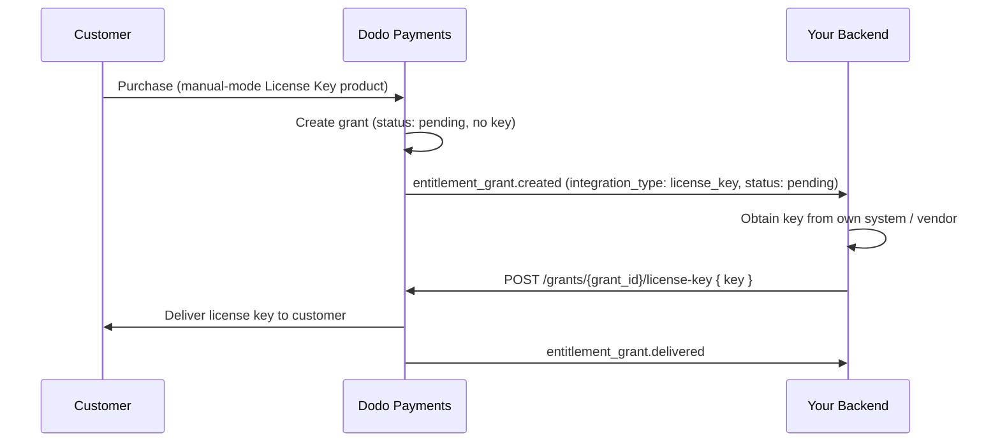

यह गाइड **मैन्युअल लाइसेंस कुंजी पूर्ति** प्रणाली के निर्माण को शुरू से अंत तक दिखाता है। Dodo Payments के भुगतान पर स्वतः कुंजी बनाने की बजाय, प्रत्येक खरीददारी एक `pending` ग्रांट बनाता है और *आप* से आपकी स्वयं की प्रणाली, प्रथम-पक्ष विक्रेता, या कोड के सीमित पूल से कुंजी मान आपूर्ति करने की प्रतीक्षा करता है।

अंत में आपके पास होगा:

- एक उत्पाद जिसमें लाइसेंस कुंजी अधिकार सेट है `manual` पूर्ति के लिए।
- एक वेबहुक लिसनर जो यह पता लगाता है कि ग्राहक कुंजी की प्रतीक्षा कर रहा है।
- एक पूर्ति कॉल जो कुंजी डिलीवर करता है और स्वतः ग्राहक को सूचित करता है।

कुंजी के पूर्ण जीवनचक्र और `fulfillment_mode` सेटिंग।
कुंजी डिलीवर करने के लिए आप जिस एंडपॉइंट को कॉल करते हैं उसका एपीआई संदर्भ।

## यह कैसे काम करता है



मैन्युअल पूर्ति केवल **प्रदायगी** चरण को बदलता है। एक बार डिलीवर हो जाने के बाद सक्रियण, सत्यापन, निष्क्रियता, समाप्ति, और निरसन स्वतः उत्पन्न कुंजी की तरह ही व्यवहार करते हैं।

## आवश्यकताएँ

इस गाइड का पालन करने के लिए आपको आवश्यकता होगी:

- एक Dodo Payments व्यापारी खाता।
- आपका एपीआई कुंजी (`DODO_PAYMENTS_API_KEY`) और डैशबोर्ड से वेबहुक सीक्रेट कुंजी। [एपीआई कुंजी निर्माण गाइड](/api-reference/introduction#api-key-generation) देखें।
- एक बैकेंड एंडपॉइंट जो वेबहुक्स प्राप्त कर सकता है।

निर्माण करते समय `https://test.dodopayments.com` और टेस्ट-मोड क्रेडेंशियल्स का उपयोग करें। उत्पादन में जाने पर `https://live.dodopayments.com` और लाइव कुंजियों पर स्विच करें।

## स्टेप 1 — मैन्युअल मोड में एक लाइसेंस कुंजी अधिकार बनाएँ

एक **अधिकार** वह पुन: प्रयोज्य परिभाषा है जिसे आप प्रदान करते हैं। एक लाइसेंस कुंजी अधिकार बनाएं और इसकी `fulfillment_mode` को `manual` पर सेट करें।

अपने डैशबोर्ड में **अधिकार** पर जाएं और एक नया अधिकार बनाने के लिए **+** पर क्लिक करें।

- **पूर्ति मोड** — डिफ़ॉल्ट रूप से `Automatic`। यह मैन्युअल पूर्ति की अनुमति देने वाला सेटिंग है; इसे आप अगले चरण में बदलते हैं।
- **लाइसेंस अवधि** — कितने समय तक प्रत्येक जारी की गई कुंजी मान्य रहती है, या **कोई समाप्ति नहीं**।
- **सक्रियण सीमा** — प्रति कुंजी अधिकतम सक्रियण, या **असीमित**।
- **सक्रियण संदेश** — वैकल्पिक उपयोगकर्ता-सामना संदेश जो वे कुंजी को सक्रिय करते समय दिखाया जाता है।

पूर्णता मोड ड्रॉपडाउन खोलें और इसे **मैन्युअल** में बदलें। यह वह सेटिंग है जो इस पूरे गाइड को अग्रसर करती है — इसके बिना, कुंजियाँ स्वतः उत्पन्न होती हैं और ईमेल की जाती हैं और कोई पेंडिंग ग्रांट नहीं बनाई जाती। **मैन्युअल** चुने जाने पर, प्रत्येक खरीद आपके पूर्ति के लिए एक `pending` ग्रांट बनाता है। **अधिकार बनाएं** पर क्लिक करके सेव करें।

`integration_config.fulfillment_mode` को `manual` पर सेट करके अधिकार बनाएं।

```typescript Node.js theme={null}
import DodoPayments from 'dodopayments';

const client = new DodoPayments({
  bearerToken: process.env.DODO_PAYMENTS_API_KEY,
  environment: 'test_mode', // defaults to 'live_mode'
});

const entitlement = await client.entitlements.create({
  name: 'Pro License (Manual)',
  integration_type: 'license_key',
  integration_config: {
    fulfillment_mode: 'manual',
    activations_limit: 5,
    duration_count: 1,
    duration_interval: 'Year',
  },
});

console.log(entitlement.id); // ent_...
```

```python Python theme={null}
import os
from dodopayments import DodoPayments

client = DodoPayments(
    bearer_token=os.environ.get("DODO_PAYMENTS_API_KEY"),
    environment="test_mode",  # defaults to "live_mode"
)

entitlement = client.entitlements.create(
    name="Pro License (Manual)",
    integration_type="license_key",
    integration_config={
        "fulfillment_mode": "manual",
        "activations_limit": 5,
        "duration_count": 1,
        "duration_interval": "Year",
    },
)

print(entitlement.id)
```

```bash cURL theme={null}
curl -X POST https://test.dodopayments.com/entitlements \
  -H "Authorization: Bearer $DODO_PAYMENTS_API_KEY" \
  -H "Content-Type: application/json" \
  -d '{
    "name": "Pro License (Manual)",
    "integration_type": "license_key",
    "integration_config": {
      "fulfillment_mode": "manual",
      "activations_limit": 5,
      "duration_count": 1,
      "duration_interval": "Year"
    }
  }'
```

`fulfillment_mode` डिफ़ॉल्ट रूप से `auto` पर होता है। इसे छोड़ने से, या किसी मौजूदा अधिकार को बिना बदले छोड़ने से, स्वचालित व्यवहार बना रहता है। केवल वह अधिकार जो स्पष्ट रूप से `manual` पर सेट होते हैं, पेंडिंग ग्रांट बनाते हैं।

## स्टेप 2 — उत्पाद के साथ अधिकार संलग्न करें

उस उत्पाद को खोलें जिसे आप बेचना चाहते हैं, **उन्नत सेटिंग्स → अधिकार और क्रेडिट** विस्तार करें, और Step 1 में सेट किए गए **लाइसेंस कुंजी अधिकार** का चयन करें। एक अकेला उत्पाद इस लाइसेंस कुंजी को अन्य अधिकारों के साथ इस खरीददारी में डिलीवर कर सकता है।

पूर्ति मोड **अधिकार** की संपत्ति है, उत्पाद की नहीं। चूंकि आपने इसे Step 1 में **मैन्युअल** पर सेट किया था, इसलिए इस अधिकार के साथ जुड़े प्रत्येक उत्पाद खरीद पर `pending` लाइसेंस-कुंजी ग्रांट बनाता है — यहाँ कोई अतिरिक्त कॉन्फ़िगरेशन की आवश्यकता नहीं है।

यदि आपके पास अभी तक कोई उत्पाद नहीं है, तो पहले एक (एकमुश्त या सब्सक्रिप्शन) बनाएं। चेकआउट के माध्यम से उत्पाद को बेचने के लिए [वन-टाइम पेमेंट्स इंटीग्रेशन गाइड](/developer-resources/integration-guide) देखें।

## स्टेप 3 — पेंडिंग ग्रांट्स का पता लगाएं

जब ग्राहक उत्पाद खरीदता है, तो Dodo Payments भनेर `pending` स्थिति में कोई कुंजी संलग्न नहीं होने के साथ एक ग्रांट बनाता है और एक `entitlement_grant.created` वेबहुक लॉन्च करता है। यह आपके लिए संकेत है कि ग्राहक एक कुंजी की प्रतीक्षा कर रहा है।

### वेबहुक के लिए सुनें

एक वेबहुक एंडपॉइंट सेट अप करें (डैशबोर्ड में डेवलपर → वेबहुक्स) और पेंडिंग लाइसेंस-कुंजी ग्रांट्स पर कार्रवाई करें। कार्यान्वयन [स्टैंडर्ड वेबहुक्स](https://standardwebhooks.com/) विशिष्टता का पालन करता है।

```typescript theme={null}
import { Webhook } from 'standardwebhooks';

const webhook = new Webhook(process.env.DODO_WEBHOOK_KEY!);

export async function POST(request: Request) {
  const rawBody = await request.text();
  const headers = {
    'webhook-id': request.headers.get('webhook-id') || '',
    'webhook-signature': request.headers.get('webhook-signature') || '',
    'webhook-timestamp': request.headers.get('webhook-timestamp') || '',
  };

  await webhook.verify(rawBody, headers);
  const event = JSON.parse(rawBody);

  // A customer bought a manual-mode license key and is waiting for it.
  if (
    event.type === 'entitlement_grant.created' &&
    event.data.integration_type === 'license_key' &&
    event.data.status === 'pending'
  ) {
    await queueLicenseKeyFulfillment({
      grantId: event.data.id,
      customerId: event.data.customer_id,
    });
  }

  return new Response('ok');
}
```

ग्रांट पेलोड `integration_type: "license_key"` ले जाता है, ताकि आप बिना किसी अतिरिक्त लुकअप के लाइसेंस-कुंजी ग्रांट को पहचान सकें। पूरा पेलोड [एंटाइटलमेंट ग्रांट वेबहुक संदर्भ](/developer-resources/webhooks/intents/entitlement-grant) देखें।

### या लिस्ट ग्रांट्स एपीआई को पोल करें

यदि आप वेबहुक्स पर निर्भर नहीं होना चाहते हैं, तो एंटाइटलमेंट के लिए ग्रांट्स सूचीबद्ध करें और `integration_type` और `status` से फिल्टर करें:

```typescript Node.js theme={null}
const pending = await client.entitlements.grants.list('ent_license_key_id', {
  integration_type: 'license_key',
  status: 'pending',
});

for (const grant of pending.items) {
  console.log(`Grant ${grant.id} for customer ${grant.customer_id} needs a key`);
}
```

```bash cURL theme={null}
curl -G https://test.dodopayments.com/entitlements/ent_license_key_id/grants \
  -H "Authorization: Bearer $DODO_PAYMENTS_API_KEY" \
  --data-urlencode "integration_type=license_key" \
  --data-urlencode "status=pending"
```

## स्टेप 4 — कुंजी डिलीवर करें

अपने स्वयं के सिस्टम से कुंजी मान प्राप्त करें, फिर इसे [फुलफिल लाइसेंस कुंजी ग्रांट](/api-reference/entitlements/fulfill-license-key) एंडपॉइंट के साथ भेजें। इसके लिए आपका सीक्रेट एपीआई कुंजी (संपादक अनुमति) की आवश्यकता होती है; यह सार्वजनिक लाइसेंस एंडपॉइंट्स में से एक **नहीं** है।

```typescript Node.js theme={null}
async function fulfill(grantId: string, key: string) {
  const res = await fetch(
    `https://test.dodopayments.com/grants/${grantId}/license-key`,
    {
      method: 'POST',
      headers: {
        'Content-Type': 'application/json',
        Authorization: `Bearer ${process.env.DODO_PAYMENTS_API_KEY}`,
      },
      body: JSON.stringify({
        key,
        // Optional — fall back to the entitlement config when omitted
        activations_limit: 5,
        expires_at: '2027-05-01T00:00:00Z',
      }),
    },
  );

  if (!res.ok) {
    // See the status code table below for handling
    throw new Error(`Fulfillment failed: ${res.status}`);
  }

  return res.json(); // updated grant, now status: "delivered"
}
```

```bash cURL theme={null}
curl -X POST https://test.dodopayments.com/grants/grant_8VbC6JDZ/license-key \
  -H "Authorization: Bearer $DODO_PAYMENTS_API_KEY" \
  -H "Content-Type: application/json" \
  -d '{
    "key": "PRO-AAAA-BBBB-CCCC-DDDD",
    "activations_limit": 5,
    "expires_at": "2027-05-01T00:00:00Z"
  }'
```

### अनुरोध फील्ड्स

देने के लिए लाइसेंस कुंजी स्ट्रिंग। सफेद स्थान हटा दिया जाता है; एक खाली या सफेद स्थान अस्वीकृत किया जाता है।

प्रति कुंजी सक्रियण सीमा। छोड़े जाने पर एंटाइटलमेंट कॉन्फ़िग पर निर्भर रहता है।

प्रति कुंजी समाप्ति (ISO 8601)। छोड़े जाने पर एंटाइटलमेंट कॉन्फ़िग की अवधि पर निर्भर रहता है। सब्सक्रिप्शन-निर्गत ग्रांट्स के लिए, वैधता सब्सक्रिप्शन से जुडी रहती है।

सफलता पर ग्रांट `delivered` में चला जाता है, ग्राहक को स्वतः कुंजी भेजी जाती है (उसी ईमेल के माध्यम से जो वे स्वतः पूर्ति के तहत प्राप्त करते), और `entitlement_grant.delivered` फायर होता है।

ग्राहक को लाइसेंस कुंजी, उत्पाद, सक्रियण सीमा, समाप्ति, और आपके सक्रियण निर्देशों के साथ एक ईमेल प्राप्त होता है:

आपको स्वयं कुंजी ईमेल करने की आवश्यकता नहीं है — जब ग्रांट पूरा होता है तो डिलीवरी स्वतः हो जाती है।

## स्टेप 5 — त्रुटियों और पुन: प्रयासों को संभालें

एंडपॉइंट किसी भी चीज़ को डिलीवर करने से पहले ग्रांट को मान्य करता है। इन प्रतिक्रियाओं को संभालें:

| स्थिति | अर्थ | क्या करें |
|---|---|---|
| `200` | कुंजी वितरित हुई, ग्रांट अब `delivered`। | समाप्त। |
| `400` | न तो लाइसेंस-कुंजी ग्रांट, और न ही कुंजी खाली/सफेद स्थान है। | अनुरोध सुधारें; जैसा है फिर से प्रयास न करें। |
| `404` | आपके व्यवसाय के लिए उस आईडी के साथ कोई ग्रांट नहीं। | `grant_id` सत्यापित करें। |
| `409` | ग्रांट पूर्ति की प्रतीक्षा नहीं कर रहा (पहले से ही वितरित या पहले से ही कुंजी है), **या** कुंजी मान पहले से मौजूद है। | यदि पहले से वितरित है, तो सफल मानें। यदि एक डुप्लिकेट कुंजी है, तो एक अलग कुंजी प्रदान करें। |
| `422` | अनुरोध बॉडी सत्यापन में विफल (उदा. `activations_limit < 1`)। | फील्ड को सही करें और पुनः प्रयास करें। |

समय-समय पर हुई त्रुटियों (टाइमआउट्स, `5xx`) पर पुनः प्रयास करना सुरक्षित है। प्रत्येक ग्रांट को केवल एक बार भरा जा सकता है, इसलिए सफल-पर बिना मान्यता प्राप्त कॉल के बाद पुनः प्रयास `409` लौटाता है बजाय इसके कि एक दूसरी कुंजी जारी या दोहराऊं ईमेल भेजता। अपना एंटाइटलमेंट `id` को अपनी इडेम्पोटेंसी कुंजी के रूप में उपयोग करें।

## प्रवाह को सत्यापित करें

1. टेस्ट मोड में उत्पाद खरीदें ([चेकआउट गाइड्स](/developer-resources/integration-guide) देखें)।
2. पुष्टि करें कि आपका वेबहुक `entitlement_grant.created` के साथ `status: "pending"` और `integration_type: "license_key"` प्राप्त हुआ है, या वह ग्रांट सूची ग्रांट्स प्रतिक्रिया में उन फिल्टर्स के साथ प्रकट होता है।
3. टेस्ट कुंजी के साथ फुलफिल एंडपॉइंट को कॉल करें।
4. पुष्टि करें कि प्रतिक्रिया `status: "delivered"` को एक भरी हुई `license_key` के साथ दिखाती है, ग्राहक को कुंजी ईमेल मिलती है, और `entitlement_grant.delivered` फायर होता है।

एक बार वितरित होने पर, ग्राहक [सक्रिय और सत्यापित](/features/license-keys#activation-validation-deactivation) कर सकते हैं कुंजी को सार्वजनिक लाइसेंस एंडपॉइंट्स के खिलाफ ठीक उसी तरह जैसे स्वतः उत्पन्न कुंजी।

## संबंधित एपीआई संदर्भ

`fulfillment_mode: manual` के साथ लाइसेंस कुंजी एंटाइटलमेंट बनाएं।

`integration_type` और `status` द्वाराभंड के रूप में फ़िल्टर करें।

कुंजी मान वितरित करें और ग्रांट को वितरित में ट्रांज़िशन करें।

`entitlement_grant.*` घटनाएँ जो पेंडिंग और वितरित ग्रांट्स का संकेत देती हैं।

## Verify the Flow

1. Buy the product in test mode (see the [checkout guides](/developer-resources/integration-guide)).
2. Confirm your webhook received `entitlement_grant.created` with `status: "pending"` and `integration_type: "license_key"`, or that the grant appears in the List Grants response with those filters.
3. Call the fulfill endpoint with a test key.
4. Confirm the response shows `status: "delivered"` with a populated `license_key`, the customer receives the key email, and `entitlement_grant.delivered` fires.

<Check>
Once delivered, the customer can [activate and validate](/features/license-keys#activation-validation-deactivation) the key against the public license endpoints exactly like an auto-generated key.
</Check>

## Related API Reference

<CardGroup cols={2}>
<Card title="Create Entitlement" icon="plus" href="/api-reference/entitlements/create-entitlement">
Create the License Key entitlement with `fulfillment_mode: manual`.
</Card>
<Card title="List Grants" icon="users" href="/api-reference/entitlements/list-grants">
Filter by `integration_type` and `status` to find pending grants.
</Card>
<Card title="Fulfill License Key Grant" icon="code" href="/api-reference/entitlements/fulfill-license-key">
Deliver the key value and transition the grant to delivered.
</Card>
<Card title="Entitlement Grant Webhooks" icon="webhook" href="/developer-resources/webhooks/intents/entitlement-grant">
The `entitlement_grant.*` events that signal pending and delivered grants.
</Card>
</CardGroup>
