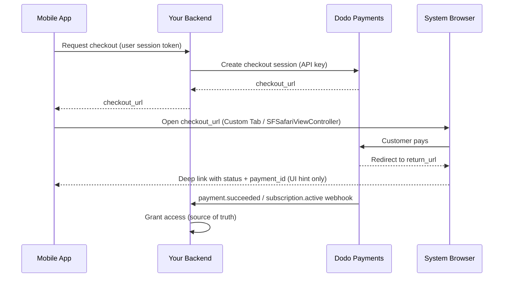

<CardGroup cols={4}>
<Card title="Quick Start" icon="rocket" href="#integration-workflow">
  अपना mobile payment integration 4 आसान steps में शुरू करें
</Card>

<Card title="Platform Examples" icon="code" href="#choose-your-sdk">
  Android, iOS, React Native और Flutter के लिए complete code examples
</Card>

<Card title="Checkout Customization" icon="sliders" href="#checkout-page-customization">
  themes, pre-fill और 14 mobile-specific parameters configure करें
</Card>

<Card title="Mobile Recipes" icon="flask" href="#mobile-optimized-recipes">
  5 सामान्य mobile scenarios के लिए copy-paste checkout configs
</Card>
</CardGroup>

<Info>
Dodo Payments **Android, iOS, React Native,
और Flutter** के लिए official checkout SDK उपलब्ध कराता है। इनमें से हर SDK नीचे दिए गए pattern (checkout
URL खोलना, return को capture करना, result को parse करना) को एक single typed `start(...)`
call के पीछे wrap करता है और abandoned-session recovery built in होती है। Manual WebView का उपयोग केवल
तभी करें जब इनमें से कोई भी आपके stack के लिए उपयुक्त न हो।
</Info>

## आवश्यकताएँ

अपने mobile app में Dodo Payments को integrate करने से पहले सुनिश्चित करें कि आपके पास ये हैं:

- **Dodo Payments Account**: API access वाला active merchant account
- **API Credentials**: आपके dashboard से API key और webhook secret key
- **Mobile App Project**: Android, iOS, React Native या Flutter application
- **Backend Server**: checkout session creation को securely handle करने के लिए

## Integration Workflow

Mobile integration एक secure 4-step process का पालन करता है, जिसमें आपका backend API calls handle करता है और आपका mobile app user experience manage करता है।



<Info>
Deep-link `status` user को क्या दिखाना है, इसका केवल **UI hint** है। Access हमेशा अपने backend पर `payment.succeeded` / `subscription.active` **webhook** से grant करें — केवल mobile result के आधार पर कभी नहीं।
</Info>

<Steps>
<Step title="Backend: Create Checkout Session">
<Card title="Checkout Session API Docs" icon="book" href="/developer-resources/checkout-session">
Node.js, Python और अन्य भाषाओं का उपयोग करके अपने backend में checkout session बनाना सीखें। Dedicated <strong>Checkout Sessions API</strong> documentation में complete examples और parameter references देखें।
</Card>
<Note>
**Security**: Checkout sessions आपके backend server पर ही बनाए जाने चाहिए, mobile app में कभी नहीं। इससे आपकी API keys सुरक्षित रहती हैं और proper validation सुनिश्चित होता है।
</Note>

</Step>

<Step title="Mobile: Get Checkout URL">

आपका mobile app checkout URL प्राप्त करने के लिए आपके backend को call करता है।
इस request को signed-in user के अपने session token से authenticate करें।

<Tabs>
<Tab title="iOS (Swift)">

```swift
func getCheckoutURL(productId: String, customerEmail: String, customerName: String) async throws -> String {
    let url = URL(string: "https://your-backend.com/api/create-checkout-session")!
    var request = URLRequest(url: url)
    request.httpMethod = "POST"
    request.setValue("application/json", forHTTPHeaderField: "Content-Type")
    request.setValue("Bearer \(userSessionToken)", forHTTPHeaderField: "Authorization")
    
    let requestData: [String: Any] = [
        "productId": productId,
        "customerEmail": customerEmail,
        "customerName": customerName
    ]
    request.httpBody = try JSONSerialization.data(withJSONObject: requestData)
    
    let (data, _) = try await URLSession.shared.data(for: request)
    let response = try JSONDecoder().decode(CheckoutResponse.self, from: data)
    return response.checkout_url
}
```

</Tab>
<Tab title="Android (Kotlin)">

```kotlin
suspend fun getCheckoutURL(productId: String, customerEmail: String, customerName: String): String {
    val client = OkHttpClient()
    val requestBody = JSONObject().apply {
        put("productId", productId)
        put("customerEmail", customerEmail)
        put("customerName", customerName)
    }.toString().toRequestBody("application/json".toMediaType())
    
    val request = Request.Builder()
        .url("https://your-backend.com/api/create-checkout-session")
        .header("Authorization", "Bearer $userSessionToken")
        .post(requestBody)
        .build()
    
    val response = client.newCall(request).execute()
    val responseBody = response.body?.string()
    val jsonResponse = JSONObject(responseBody ?: "")
    return jsonResponse.getString("checkout_url")
}
```

</Tab>
<Tab title="React Native (JavaScript)">

```javascript
const getCheckoutURL = async (productId, customerEmail, customerName) => {
  try {
    const response = await fetch('https://your-backend.com/api/create-checkout-session', {
      method: 'POST',
      headers: {
        'Content-Type': 'application/json',
        'Authorization': `Bearer ${userSessionToken}`,
      },
      body: JSON.stringify({
        productId,
        customerEmail,
        customerName
      })
    });
    
    const data = await response.json();
    return data.checkout_url;
  } catch (error) {
    console.error('Failed to get checkout URL:', error);
    throw error;
  }
};
```

</Tab>
<Tab title="Flutter (Dart)">

```dart
import 'dart:convert';
import 'package:http/http.dart' as http;

Future<String> getCheckoutUrl({
  required String productId,
  required String customerEmail,
  required String customerName,
}) async {
  final response = await http.post(
    Uri.parse('https://your-backend.com/api/create-checkout-session'),
    headers: {
      'Content-Type': 'application/json',
      'Authorization': 'Bearer $userSessionToken',
    },
    body: jsonEncode({
      'productId': productId,
      'customerEmail': customerEmail,
      'customerName': customerName,
    }),
  );

  if (response.statusCode != 200) {
    throw Exception('Failed to get checkout URL: ${response.statusCode}');
  }
  return jsonDecode(response.body)['checkout_url'] as String;
}
```

</Tab>
</Tabs>
<Note>
**Security**: Mobile apps केवल आपके backend से communicate करते हैं, Dodo Payments API से सीधे कभी नहीं।
</Note>
</Step>

<Step title="Mobile: Open Checkout in Browser">
Payment processing के लिए checkout URL को secure in-app browser में खोलें।
या अपने platform के लिए official checkout SDK का उपयोग करके manual setup पूरी तरह छोड़ दें।

<Card title="Pick your mobile SDK" icon="box" href="#choose-your-sdk">
  Android, iOS, React Native और Flutter के लिए installation steps और setup instructions।
</Card>

</Step>

<Step title="Backend: Handle Payment Completion">
Payment status की पुष्टि करने के लिए webhooks और redirect URLs के माध्यम से payment completion process करें।
</Step>
</Steps>

## अपना SDK चुनें

हर mobile SDK एक ही contract expose करता है: एक `start(...)` call Dodo के
hosted checkout को platform के native browser surface में खोलता है और एक typed
`CheckoutResult` लौटाता है, जिसका `status` `succeeded`,
`failed`, `cancelled`,
`pending` या `expired` होता है। इनमें से कोई भी API key store नहीं करता या Dodo
Payments API को call नहीं करता, और सभी चार abandoned-session recovery support करते हैं।

<CardGroup cols={2}>
<Card title="Android" icon="android" href="/developer-resources/sdks/android">
  `com.dodopayments.api:checkout-android` एक Chrome Custom Tab खोलता है। इसके लिए `minSdk` 23 आवश्यक है।
</Card>
<Card title="iOS" icon="apple" href="/developer-resources/sdks/ios">
  `dodopayments-mobile-sdk-ios`, `SFSafariViewController` खोलता है। इसके लिए iOS 16+ आवश्यक है।
</Card>
<Card title="React Native" icon="react" href="/developer-resources/sdks/react-native">
  `@dodopayments/react-native-checkout`, दोनों native cores पर एक Turbo Module। इसके लिए React Native 0.76+ आवश्यक है।
</Card>
<Card title="Flutter" icon="layer-group" href="/developer-resources/sdks/flutter">
  `dodopayments_checkout`, दोनों native cores पर एक Pigeon channel। इसके लिए Flutter 3.44+ आवश्यक है।
</Card>
</CardGroup>

<Warning>
आपको वापस मिलने वाला `status` payment का प्रमाण नहीं, बल्कि केवल UI hint है। हर
payment की पुष्टि अपने backend से `payment.succeeded` / `subscription.active`
webhook के माध्यम से करें, या अपनी secret key से payment retrieve करें।
</Warning>

### Callback URL Scheme register करना

सभी चार SDK आपके चुने हुए custom URL scheme के माध्यम से control वापस आपके app को देते हैं,
उदाहरण के लिए `myapp://checkout/return`। इसे प्रत्येक
platform पर एक बार register करें:

<Tabs>
<Tab title="Android">

```kotlin android/app/build.gradle
android {
    defaultConfig {
        manifestPlaceholders["dodoCallbackScheme"] = "myapp"
    }
}
```

SDK का अपना manifest redirect activity पहले से declare करता है, इसलिए जोड़ने के लिए कोई
manifest XML नहीं है।
</Tab>
<Tab title="iOS">

```xml Info.plist
<key>CFBundleURLTypes</key>
<array>
  <dict>
    <key>CFBundleURLName</key>
    <string>myapp</string>
    <key>CFBundleURLSchemes</key>
    <array>
      <string>myapp</string>
    </array>
  </dict>
</array>
```

iOS पर आपको incoming URLs को SDK में forward भी करना होगा, क्योंकि
`SFSafariViewController` अपना return URL catch नहीं कर सकता। Exact
handler के लिए [iOS](/developer-resources/sdks/ios) या
[React Native](/developer-resources/sdks/react-native) page देखें।
</Tab>
<Tab title="Expo">
`@dodopayments/react-native-checkout` एक config plugin उपलब्ध कराता है जो दोनों platforms के लिए
`prebuild` पर scheme register करता है। इसे एक `scheme` option दें:

```json app.json
{
  "expo": {
    "scheme": "myapp",
    "plugins": [
      [
        "@dodopayments/react-native-checkout",
        { "scheme": "myappcheckout" }
      ]
    ]
  }
}
```

`scheme` का मिलान `returnUrl` से होना चाहिए और यह `expo.scheme` से अलग होना चाहिए, जिसे Expo
पहले से `MainActivity` पर register करता है। Details के लिए
[React Native SDK](/developer-resources/sdks/react-native) page देखें।

यदि `android/app/build.gradle` को standard `defaultConfig { }` block के बिना manually maintain किया जाता है, तो इसके बजाय placeholder manually set करें (Android tab देखें)।

यह केवल development builds के साथ काम करता है, Expo Go के साथ नहीं। INLINE_CODE_PLACEHOLDER_85b7553c260c0f8_END edit करने के बाद
`npx expo prebuild --clean` चलाएँ।
</Tab>
</Tabs>

<Note>
इसे स्वयं build करना पसंद करेंगे? `checkout_url` को platform के system
browser (Android Custom Tabs / iOS `SFSafariViewController`) में खोलें और
navigation को अपने `return_url` पर intercept करें, फिर `status` और `payment_id` query
parameters पढ़ें। ऊपर दिए गए SDK आपके लिए यही काम करते हैं।
</Note>

<Warning>
**Checkout को embedded WebView (`WKWebView` / Android
`WebView`) के अंदर न खोलें।** यह mobile integration की सबसे सामान्य समस्या है: embedded WebView
**Apple Pay और Google Pay को suppress करता है**, और 3-D Secure challenges तथा saved-card autofill को भी तोड़ सकता है - जिससे
customers को payment options कम दिखाई देते हैं और failures बढ़ते हैं। हमेशा SDK का उपयोग करें या `checkout_url` को
system browser (Custom Tabs / `SFSafariViewController`) में खोलें। यही native browser
surface Apple Pay और Google Pay को काम करते रहने देता है।
</Warning>

## Appearance Customization

हर SDK `start(...)` / `CheckoutParams` पर एक optional `customization` parameter स्वीकार करता है, जो native browser surface के appearance और behavior - toolbar, buttons और presentation - को control करता है। यह checkout page की अपनी theme से अलग है, जिसे आप checkout session पर [`customization.theme_config`](/developer-resources/checkout-session) के माध्यम से server-side configure करते हैं।

Options को platform के अनुसार group किया गया है, क्योंकि Android का Custom Tab और iOS का `SFSafariViewController` अलग-अलग native controls expose करते हैं। सभी fields optional हैं; `customization` को पूरी तरह omit करने पर प्रत्येक platform का default appearance उपयोग होता है।

<AccordionGroup>
<Accordion title="Android - Custom Tab">

<ParamField body="toolbarColor" type="Color">
Toolbar का background color।
</ParamField>

<ParamField body="navigationBarColor" type="Color">
Navigation bar का color।
</ParamField>

<ParamField body="navigationBarDividerColor" type="Color">
Navigation bar के ऊपर divider का color।
</ParamField>

<ParamField body="closeButtonStyle" type="'default' | 'back'">
`default` system का "X" icon दिखाता है; `back` इसके बजाय back arrow draw करता है।
</ParamField>

<ParamField body="closeButtonPosition" type="'start' | 'end'">
Toolbar में close button किस side पर दिखाई देता है।
</ParamField>

<ParamField body="shareButtonEnabled" type="boolean">
Toolbar का share icon दिखाता है।
</ParamField>

<ParamField body="showTitleEnabled" type="boolean">
Toolbar में URL के नीचे page title दिखाता है।
</ParamField>

<ParamField body="urlBarHidingEnabled" type="boolean">
Page scroll होने पर toolbar को auto-hide होने देता है।
</ParamField>

<ParamField body="bookmarksButtonEnabled" type="boolean">
Overflow menu में "Bookmark this page" दिखाता है।
</ParamField>

<ParamField body="downloadsButtonEnabled" type="boolean">
Overflow menu में "Download page" दिखाता है।
</ParamField>

<ParamField body="colorScheme" type="'system' | 'light' | 'dark'">
Device की system setting की परवाह किए बिना light या dark appearance लागू करता है।
</ParamField>

</Accordion>

<Accordion title="iOS - SFSafariViewController">

<ParamField body="dismissButtonStyle" type="'done' | 'close' | 'cancel'">
Dismiss button के लिए label या icon।
</ParamField>

<ParamField body="presentationStyle" type="'pageSheet' | 'fullScreen'">
`pageSheet` swipe-to-dismiss वाले card के रूप में प्रस्तुत होता है; `fullScreen` पूरी screen को cover करता है।
</ParamField>

<ParamField body="barCollapsingEnabled" type="boolean">
Scroll करने पर toolbar को collapse होने देता है। यह केवल तब visible होता है जब `presentationStyle` `fullScreen` हो - `pageSheet` इस setting की परवाह किए बिना bars को pinned रखता है।
</ParamField>

<ParamField body="colorScheme" type="'system' | 'light' | 'dark'">
Device की system setting की परवाह किए बिना light या dark appearance लागू करता है।
</ParamField>

</Accordion>
</AccordionGroup>

<Tabs>
<Tab title="React Native">

```typescript
const result = await DodoCheckout.start({
  checkoutUrl,
  returnUrl: 'myapp://checkout/return',
  customization: {
    android: { toolbarColor: '#6366F1', closeButtonStyle: 'back' },
    ios: { presentationStyle: 'fullScreen', colorScheme: 'dark' },
  },
});
```

</Tab>
<Tab title="Flutter">

```dart
final result = await DodoCheckout.instance.start(
  CheckoutParams(
    checkoutUrl: Uri.parse(checkoutUrl),
    returnUrl: Uri.parse('myapp://checkout/return'),
    customization: BrowserCustomization(
      android: AndroidBrowserOptions(
        toolbarColor: Color(0xFF6366F1),
        closeButtonStyle: CloseButtonStyle.back,
      ),
      ios: IosBrowserOptions(
        presentationStyle: PresentationStyle.fullScreen,
        colorScheme: BrowserColorScheme.dark,
      ),
    ),
  ),
);
```

</Tab>
<Tab title="Android (Kotlin)">

```kotlin
val result = DodoCheckout.start(
    activity,
    CheckoutParams(
        checkoutUrl = checkoutUrl,
        returnUrl = "myapp://checkout/return",
        customization = BrowserCustomization(
            toolbarColor = Color.parseColor("#6366F1"),
            closeButtonStyle = BrowserCustomization.CloseButtonStyle.BACK,
        )
    )
) { event -> }
```

</Tab>
<Tab title="iOS (Swift)">

```swift
let result = try await DodoCheckout.start(
    checkoutUrl: checkoutUrl,
    returnUrl: URL(string: "myapp://checkout/return")!,
    customization: BrowserCustomization(
        presentationStyle: .fullScreen,
        colorScheme: .dark
    )
)
```

</Tab>
</Tabs>

## Checkout Page Customization

ऊपर का [Appearance Customization](#appearance-customization) section native browser surface - toolbar, buttons और color scheme - को control करता है। checkout *page स्वयं* - कौन से fields दिखाई दें, theme और कौन से payment methods दिखें - checkout session बनाते समय server-side configure किया जाता है। इन parameters का mobile conversion पर सबसे अधिक प्रभाव पड़ता है।

नीचे दिए गए parameters checkout session request में तीन अलग-अलग स्थानों पर होते हैं - **Where it goes** column बताता है कि प्रत्येक parameter किस object में होना चाहिए। इसे गलत रखना सबसे सामान्य गलती है: गलत object में रखा गया parameter silently ignore हो जाता है।

| Parameter | Where it goes | Mobile benefit | Default | Set when… |
|-----------|---------------|---------------|---------|-----------|
| `show_order_details` | `customization` | Order summary को collapse करता है ताकि payment methods screen के ऊपर दिखाई दें | `true` | Mobile पर हमेशा `false` set करें - payment methods को above the fold ले जाने से drop-off काफी कम होता है |
| `minimal_address` | top-level | केवल postcode आवश्यक करता है; street, city और state fields छिपाता है | `false` | Mobile पर लगभग हमेशा - हर अतिरिक्त field conversions कम करता है |
| `theme` | `customization` | Checkout page का light या dark appearance control करता है | Business default | Device OS preference से match करने के लिए `"system"` का उपयोग करें |
| `theme_config` | `customization` | Full brand palette - colors, fonts, border radius, pay-button label | None | जब checkout को आपके app का हिस्सा जैसा महसूस होना चाहिए |
| `force_language` | `customization` | Browser locale detection को override करता है | Auto-detect | Browser पर निर्भर रहने के बजाय इसे अपने app locale से set करें |
| `show_on_demand_tag` | `customization` | Checkout page पर "on-demand" label दिखाता या छिपाता है | `true` | जब on-demand billing का उपयोग केवल card tokenisation के लिए करें, तब `false` set करें |
| `show_saved_payment_methods` | top-level | Returning customer के saved cards को one-tap payment के लिए दिखाता है | `false` | पहले payment कर चुके signed-in users के लिए enable करें |
| `allow_discount_code` | `feature_flags` | Promo-code input field दिखाता है | `true` | Form छोटा करने के लिए `false` set करें; code ढूँढने के लिए जाने वाले users अक्सर वापस नहीं आते |
| `allow_currency_selection` | `feature_flags` | Customer को billing currency बदलने देता है | `true` | जब `billing_currency` से currency lock करें, तब `false` set करें |
| `redirect_immediately` | `feature_flags` | Success page को skip करके सीधे `return_url` पर ले जाता है | `false` | App पर seamless handoff के लिए enable करें |
| `confirm` | top-level | Extra confirmation step के बिना payment finalise करता है | `false` | One-click checkout के लिए `payment_method_id` के साथ उपयोग करें |
| `short_link` | top-level | छोटा checkout URL लौटाता है | `false` | जब URL को push notification या SMS में fit होना हो, तब उपयोगी |
| `payment_method_id` | top-level | Saved payment method को pre-select करता है | - | One-click checkout के लिए `confirm: true` के साथ pass करें |
| `allowed_payment_method_types` | top-level | दिखाई देने वाले payment methods को whitelist करता है | All enabled | अपने product type के लिए काम करने वाले methods तक सीमित करें |

<Warning>
**`billing_currency` और `billing_address.country` को हमेशा साथ pass करें।** यदि इनमें से कोई एक omit किया जाता है, तो adaptive currency customer के IP address के आधार पर billing currency को silently बदल सकती है। एक merchant ने देखा कि उसके customer के Europe यात्रा करने पर US subscription EUR में बदल गया - क्योंकि billing country explicitly set नहीं किया गया था।
</Warning>

<Tip>
**Mobile पर conversion बढ़ाने वाला सबसे बड़ा single improvement:** `show_order_details: false` और `minimal_address: true` set करें। Payment methods को above the fold ले जाना और form fields कम करना, आपके द्वारा किए जा सकने वाले दो सबसे प्रभावी बदलाव हैं।
</Tip>

<Frame caption="show_order_details: false moves the contact and payment fields above the fold, instead of behind the order summary.">
  
</Frame>

Full street, city और state fields के बजाय केवल postcode collect करने के लिए `minimal_address: true` set करें:

<Frame caption="minimal_address: true reduces the billing address to a single postcode field.">
  
</Frame>

Checkout को device की light या dark mode preference का पालन कराने के लिए `theme: "system"` set करें:

<Frame caption="With theme: system, the checkout follows the device's light or dark appearance automatically.">
  
</Frame>

<Info>
**Payment method availability product type के अनुसार अलग होती है।** Apple Pay और Cash App non-zero recurring subscriptions के लिए supported हैं। One-time payments के लिए सभी enabled methods उपलब्ध हैं।
</Info>

<Card title="Full checkout session parameter reference" icon="book" href="/developer-resources/checkout-session">
  Checkout Sessions guide में हर available parameter, type और default value देखें।
</Card>

## Mobile-Optimized Recipes

नीचे दिया गया प्रत्येक recipe एक complete checkout session request body है। अपने scenario से मेल खाने वाला recipe copy करें, उसमें अपना product ID डालें और उसे अपने backend के session-creation endpoint पर pass करें।

<AccordionGroup>
<Accordion title="Minimal Mobile Checkout - fastest path to payment">

जब आपको सबसे छोटा संभव form चाहिए, तब इसका उपयोग करें: ऊपर payment methods, address के लिए केवल postcode आवश्यक, discount field नहीं और theme device से match करती है।

<Tabs>
<Tab title="Node.js SDK">

```javascript expandable
import DodoPayments from 'dodopayments';

const client = new DodoPayments({
  bearerToken: process.env.DODO_PAYMENTS_API_KEY,
  environment: 'test_mode',
});

const session = await client.checkoutSessions.create({
  product_cart: [{ product_id: 'pdt_your_product_id', quantity: 1 }],
  customer: { email: 'user@example.com', name: 'Jane Smith' },
  billing_address: { country: 'US' },
  return_url: 'myapp://checkout/success',
  cancel_url: 'myapp://checkout/cancelled',
  billing_currency: 'USD',
  minimal_address: true,
  customization: {
    show_order_details: false,
    theme: 'system',
  },
  feature_flags: {
    allow_discount_code: false,
    allow_currency_selection: false,
  },
});

console.log(session.checkout_url);
```

</Tab>
<Tab title="Python SDK">

```python expandable
import os
import dodopayments

client = dodopayments.DodoPayments(
    bearer_token=os.environ.get("DODO_PAYMENTS_API_KEY"),
    environment="test_mode",
)

session = client.checkout_sessions.create(
    product_cart=[{"product_id": "pdt_your_product_id", "quantity": 1}],
    customer={"email": "user@example.com", "name": "Jane Smith"},
    billing_address={"country": "US"},
    return_url="myapp://checkout/success",
    cancel_url="myapp://checkout/cancelled",
    billing_currency="USD",
    minimal_address=True,
    customization={
        "show_order_details": False,
        "theme": "system",
    },
    feature_flags={
        "allow_discount_code": False,
        "allow_currency_selection": False,
    },
)

print(session.checkout_url)
```

</Tab>
</Tabs>

<Note>
सभी available parameters और उनके defaults के लिए [Checkout Sessions](/developer-resources/checkout-session) देखें।
</Note>
</Accordion>

<Accordion title="Branded Mobile Checkout - custom colors, fonts, and button label">

जब checkout page को आपके app का हिस्सा जैसा महसूस होना चाहिए, तब इसका उपयोग करें। अपने brand colors, custom font और localized pay-button label set करें।

<Frame>
  
</Frame>

<Tabs>
<Tab title="Node.js SDK">

```javascript expandable
const session = await client.checkoutSessions.create({
  product_cart: [{ product_id: 'pdt_your_product_id', quantity: 1 }],
  customer: { email: 'user@example.com', name: 'Jane Smith' },
  billing_address: { country: 'US' },
  billing_currency: 'USD',
  return_url: 'myapp://checkout/success',
  minimal_address: true,
  customization: {
    show_order_details: false,
    theme: 'dark',
    theme_config: {
      dark: {
        button_primary: '#7C3AED',
        button_primary_hover: '#6D28D9',
        button_text_primary: '#FFFFFF',
        bg_primary: '#1A1A2E',
        bg_secondary: '#16213E',
        text_primary: '#E2E8F0',
      },
      pay_button_text: 'Complete Purchase',
      radius: '8px',
    },
  },
});
```

</Tab>
<Tab title="Python SDK">

```python expandable
session = client.checkout_sessions.create(
    product_cart=[{"product_id": "pdt_your_product_id", "quantity": 1}],
    customer={"email": "user@example.com", "name": "Jane Smith"},
    billing_address={"country": "US"},
    billing_currency="USD",
    return_url="myapp://checkout/success",
    minimal_address=True,
    customization={
        "show_order_details": False,
        "theme": "dark",
        "theme_config": {
            "dark": {
                "button_primary": "#7C3AED",
                "button_primary_hover": "#6D28D9",
                "button_text_primary": "#FFFFFF",
                "bg_primary": "#1A1A2E",
                "bg_secondary": "#16213E",
                "text_primary": "#E2E8F0",
            },
            "pay_button_text": "Complete Purchase",
            "radius": "8px",
        },
    },
)
```

</Tab>
</Tabs>

<Note>
`theme_config` अलग-अलग `dark` और `light` objects स्वीकार करता है, ताकि palette device के current appearance के अनुसार adapt हो सके। पूर्ण color key reference के लिए [Checkout Sessions](/developer-resources/checkout-session) देखें।
</Note>
</Accordion>

<Accordion title="One-Click Returning Customer - saved card, instant confirmation">

पहले payment कर चुके signed-in users के लिए इसका उपयोग करें। Checkout form को पूरी तरह skip करने के लिए customer ID, उनका saved payment method और `confirm: true` combine करें।

<Tabs>
<Tab title="Node.js SDK">

```javascript expandable
const session = await client.checkoutSessions.create({
  product_cart: [{ product_id: 'pdt_your_product_id', quantity: 1 }],
  customer: { customer_id: 'cus_returning_customer_id' },
  billing_address: { country: 'US' },
  billing_currency: 'USD',
  return_url: 'myapp://checkout/success',
  payment_method_id: 'pm_saved_payment_method_id',
  confirm: true,
  show_saved_payment_methods: true,           // top-level parameter
  feature_flags: { redirect_immediately: true },
});
```

</Tab>
<Tab title="Python SDK">

```python expandable
session = client.checkout_sessions.create(
    product_cart=[{"product_id": "pdt_your_product_id", "quantity": 1}],
    customer={"customer_id": "cus_returning_customer_id"},
    billing_address={"country": "US"},
    billing_currency="USD",
    return_url="myapp://checkout/success",
    payment_method_id="pm_saved_payment_method_id",
    confirm=True,
    show_saved_payment_methods=True,           # top-level parameter
    feature_flags={"redirect_immediately": True},
)
```

</Tab>
</Tabs>

<Note>
Deep-link return में `status` केवल UI hint है। अपने backend पर `payment.succeeded` webhook सुनकर access की पुष्टि करें।
</Note>
</Accordion>

<Accordion title="Subscription with Free Trial - trial before first charge">

Subscription products के लिए इसका उपयोग करें जो पहले billing cycle से पहले free trial period offer करते हैं।

<Tabs>
<Tab title="Node.js SDK">

```javascript expandable
const session = await client.checkoutSessions.create({
  product_cart: [{ product_id: 'pdt_your_subscription_product_id', quantity: 1 }],
  customer: { email: 'user@example.com', name: 'Jane Smith' },
  billing_address: { country: 'US' },
  billing_currency: 'USD',
  return_url: 'myapp://subscription/activated',
  cancel_url: 'myapp://subscription/cancelled',
  minimal_address: true,
  customization: {
    show_order_details: false,
    theme: 'system',
  },
  subscription_data: { trial_period_days: 14 },
});
```

</Tab>
<Tab title="Python SDK">

```python expandable
session = client.checkout_sessions.create(
    product_cart=[{"product_id": "pdt_your_subscription_product_id", "quantity": 1}],
    customer={"email": "user@example.com", "name": "Jane Smith"},
    billing_address={"country": "US"},
    billing_currency="USD",
    return_url="myapp://subscription/activated",
    cancel_url="myapp://subscription/cancelled",
    minimal_address=True,
    customization={"show_order_details": False, "theme": "system"},
    subscription_data={"trial_period_days": 14},
)
```

</Tab>
</Tabs>

<Note>
जब आपके backend को `subscription.active` webhook प्राप्त हो, तब feature access grant करें - mobile SDK के return पर नहीं। पूरे webhook flow के लिए [Subscription Integration Guide](/developer-resources/subscription-integration-guide) देखें।
</Note>
</Accordion>

<Accordion title="On-Demand Mandate - save a card for future variable charges">

Customer के card को बाद के charges (wallet top-ups, pay-as-you-go, BNPL) के लिए tokenize करने हेतु इसका उपयोग करें, बिना "subscription" label दिखाए। Customer अपने payment method को एक बार authorize करता है; बाद में आप variable amounts को on demand charge करते हैं।

<Info>
यह pattern usage के आधार पर charge करने वाले apps में उपयोग होता है - उदाहरण के लिए, एक astrology app जो fixed schedule के बजाय pre-authorized card से प्रति session charge करता है।
</Info>

<Tabs>
<Tab title="Node.js SDK">

```javascript expandable
// Step 1: Authorize the mandate (no charge yet)
const session = await client.checkoutSessions.create({
  product_cart: [{ product_id: 'pdt_your_subscription_product_id', quantity: 1 }],
  customer: { email: 'user@example.com', name: 'Jane Smith' },
  billing_address: { country: 'US' },
  billing_currency: 'USD',
  return_url: 'myapp://mandate/authorized',
  cancel_url: 'myapp://mandate/cancelled',
  minimal_address: true,
  customization: {
    show_order_details: false,
    show_on_demand_tag: false, // hides the "on-demand" / "subscription" label
    theme: 'system',
  },
  subscription_data: {
    on_demand: { mandate_only: true },
  },
});

// Step 2: Later, charge any amount using the subscription ID
// (received via the subscription.active webhook after mandate authorization)
// await client.subscriptions.charge(subscriptionId, {
//   product_price: 2000,         // $20.00 in cents
//   product_currency: 'USD',
//   product_description: 'Session credits',
// });
```

</Tab>
<Tab title="Python SDK">

```python expandable
# Step 1: Authorize the mandate (no charge yet)
session = client.checkout_sessions.create(
    product_cart=[{"product_id": "pdt_your_subscription_product_id", "quantity": 1}],
    customer={"email": "user@example.com", "name": "Jane Smith"},
    billing_address={"country": "US"},
    billing_currency="USD",
    return_url="myapp://mandate/authorized",
    cancel_url="myapp://mandate/cancelled",
    minimal_address=True,
    customization={
        "show_order_details": False,
        "show_on_demand_tag": False,  # hides the "on-demand" / "subscription" label
        "theme": "system",
    },
    subscription_data={"on_demand": {"mandate_only": True}},
)

# Step 2: Later, charge any amount using the subscription ID
# client.subscriptions.charge(subscription_id, {
#     "product_price": 2000,  # $20.00 in cents
#     "product_currency": "USD",
#     "product_description": "Session credits",
# })
```

</Tab>
</Tabs>

<Warning>
On-demand charges के लिए कम से कम 1 USD (100 cents) आवश्यक है। 1 USD से कम amounts को `"value out of range"` के साथ reject कर दिया जाएगा। Zero-amount authorization के लिए ऊपर दिखाए गए अनुसार `mandate_only: true` का उपयोग करें, फिर बाद की calls में कम से कम 1 USD charge करें।
</Warning>

<Note>
Complete charge flow, webhook events और retry policies के लिए [On-Demand Subscriptions](/developer-resources/ondemand-subscriptions) देखें।
</Note>
</Accordion>
</AccordionGroup>

## Mobile से Subscription Flows

Subscriptions उसी checkout session flow के माध्यम से बनाई जाती हैं जिसका उपयोग one-time payments के लिए होता है - mobile SDK hosted checkout खोलता है, customer subscribe करता है और आपका app deep-link return handle करता है। इसके बाद subscription lifecycle पूरी तरह backend पर manage किया जाता है।

### Regular Recurring Subscriptions

Fixed-interval billing (monthly, annual) के लिए subscription product और deep-link `return_url` के साथ checkout session बनाएँ। Subscription confirm होने पर आपका backend `subscription.active` प्राप्त करता है।

<Info>
**Apple Pay** और **Cash App**, non-zero recurring subscriptions के लिए supported हैं।
</Info>

Complete backend webhook flow के लिए [Subscription Integration Guide](/developer-resources/subscription-integration-guide) देखें।

---

### On-Demand Subscriptions

On-demand subscriptions customer के payment method को एक बार authorize करके बाद में variable amounts charge करने देती हैं - wallet top-ups, pay-as-you-go और उन सभी scenarios के लिए आदर्श जहाँ charge amount पहले से ज्ञात नहीं होता। Complete request body के लिए ऊपर दिया गया **On-Demand Mandate** recipe देखें।

मुख्य mobile considerations:

- `show_on_demand_tag: false` set करें ताकि checkout page पर "subscription" या "on-demand" language दिखाई न दे। Card-tokenization use cases में customers subscription terminology की अपेक्षा नहीं करते।
- Mandate authorize होने के बाद आपका backend `subscription.active` प्राप्त करता है। `subscription_id` store करें - सभी future charges के लिए इसका उपयोग होगा।

<Warning>
Minimum charge 1 USD (100 cents) है। 1 USD से कम के on-demand charges को `"value out of range"` के साथ reject कर दिया जाएगा। कम से कम 1 USD charge करें, या बिना charge किए authorize करने के लिए `mandate_only: true` का उपयोग करें और बाद में पहली वास्तविक amount collect करें।
</Warning>

<Warning>
**Rapid-fire retries से बचें।** यदि पिछला charge अभी भी processing में है, तो उसी subscription पर नया charge `"Cannot create new charge as previous payment is not successful yet"` के साथ fail हो जाता है। यह Indian payment methods (UPI, Indian debit/credit cards) के साथ विशेष रूप से सामान्य है, जहाँ RBI mandate rules किसी transaction को 48 घंटे तक processing state में रख सकते हैं। Retry करने से पहले अपने charge logic में cooldown check जोड़ें।
</Warning>

Complete charge endpoint, webhook events और retry policies के लिए [On-Demand Subscriptions](/developer-resources/ondemand-subscriptions) देखें।

---

### Subscription with Free Trial

पहले billing cycle से पहले trial offer करने के लिए checkout session में `subscription_data.trial_period_days` pass करें। Customer trial signup के दौरान अपने payment method को authorize करता है; trial समाप्त होने पर पहला charge automatically होता है। Complete request body के लिए ऊपर दिया गया **Subscription with Free Trial** recipe देखें।

---

### Upgrades और Downgrades

Plan changes आपके backend पर API के माध्यम से किए जाते हैं, किसी नए checkout session के माध्यम से नहीं। Dodo Payments proration automatically calculate करता है। Customers को self-service option देने के लिए [Customer Portal](/features/customer-portal) embed करें या उसका link दें।

<CardGroup cols={2}>
<Card title="Subscription Integration Guide" icon="repeat" href="/developer-resources/subscription-integration-guide">
  Complete backend setup: webhook flow, access provisioning, cancellation
</Card>
<Card title="On-Demand Subscriptions" icon="bolt" href="/developer-resources/ondemand-subscriptions">
  Mandate authorization, variable charges और retry policies
</Card>
<Card title="Upgrade / Downgrade" icon="arrows-up-down" href="/developer-resources/subscription-upgrade-downgrade">
  Proration strategies, plan changes और seat adjustments
</Card>
<Card title="Customer Portal" icon="user" href="/features/customer-portal">
  आपके customers के लिए self-service subscription management
</Card>
</CardGroup>

## Checkout Drop-Offs कम करना

Mobile checkouts में web की तुलना में abandonment अधिक होता है - छोटी screens, अधिक distractions और लंबे forms सभी इसमें योगदान देते हैं। सबसे तेज improvements checkout session configuration से ही मिलते हैं।

### Form को Optimize करें

| Setting | Recommended value | Effect |
|---------|------------------|--------|
| `show_order_details` | `false` | Order summary collapse करता है; payment methods ऊपर दिखाई देते हैं |
| `minimal_address` | `true` | केवल postcode आवश्यक; street, city और state हटाता है |
| `show_saved_payment_methods` | `true` | Returning customers के लिए one-tap payment |
| `allow_discount_code` | `false` | Promo-code field हटाता है |
| `theme` | `"system"` | Device की light या dark preference से match करता है |
| `force_language` | Your app locale | Checkout को browser language पर default होने से रोकता है |

### Customer Data Pre-Fill करें

Customer को जो field type नहीं करनी पड़ती, वह checkout abandon न करने का एक कारण है:

- **New customers** - अपनी auth session से `customer.email` और `customer.name` set करें।
- **Returning customers** - सभी stored details automatically pre-fill करने के लिए `customer.customer_id` set करें।
- **Currency** - `billing_currency` और `billing_address.country` को हमेशा साथ pass करें।

### Recovery Tools

<CardGroup cols={2}>
<Card title="Abandoned Cart Recovery" icon="cart-shopping" href="/features/recovery/abandoned-cart-recovery">
  Incomplete checkouts के लिए automated email sequences
</Card>
<Card title="Payment Retries" icon="rotate" href="/features/recovery/payment-retries">
  Failed subscription renewals के लिए smart retry logic
</Card>
<Card title="Subscription Dunning" icon="envelope" href="/features/recovery/subscription-dunning">
  Lapsed subscriptions के लिए re-engagement emails
</Card>
<Card title="Recovery Overview" icon="chart-line" href="/features/recovery/overview">
  सभी recovery tools और उनका combined revenue impact
</Card>
</CardGroup>

<Tip>
**Cart abandonment emails को enable करने से पहले test करें।** Live mode में checkout session बनाएँ और invalid card details enter करें। Failed payment recovery email flow trigger करेगा, जिससे आप ठीक वही preview कर सकेंगे जो आपके customers को प्राप्त होगा।
</Tip>

## Best Practices

- **Security**: अपने app में API key कभी ship न करें। Checkout sessions अपने backend पर बनाएँ और केवल resulting `checkout_url` client को pass करें।
- **Authority**: `CheckoutResult.status` को UI hint मानें। Access केवल backend द्वारा payment confirm करने के बाद grant करें।
- **User Experience**: Backend द्वारा session create किए जाने तक loading state दिखाएँ और `cancelled` को error के बजाय normal outcome के रूप में handle करें।
- **Testing**: Test mode और test cards का उपयोग करें और real device तथा simulator दोनों पर return-URL round trip verify करें।
- **Conversion**: Best mobile checkout completion rates के लिए `show_order_details: false` और `minimal_address: true` set करें। Payment methods को above the fold ले जाना और form fields कम करना, आपके द्वारा किए जा सकने वाले दो सबसे प्रभावी बदलाव हैं।
- **Currency**: `billing_currency` और `billing_address.country` दोनों को हमेशा explicitly pass करें - इनमें से कोई missing होने पर adaptive currency customer के IP address के आधार पर billing currency बदल सकती है।
- **On-demand billing**: Card tokenization के लिए on-demand subscriptions का उपयोग करते समय `show_on_demand_tag: false` set करें। Wallet top-up flow का उपयोग करने वाले customers "subscription" language देखने की अपेक्षा नहीं करते।
- **Recovery**: Checkout पूरा न करने वाले customers को automatically re-engage करने के लिए अपने Dodo Payments dashboard में abandoned cart recovery enable करें।

## Troubleshooting

### सामान्य समस्याएँ

- **Callback कभी नहीं आता**: `returnUrl` में scheme आपके registered scheme से match होना चाहिए। Android पर यह `dodoCallbackScheme` manifest placeholder है; iOS और React Native पर यह `Info.plist` URL type है।
- **Checkout आपके app के बजाय browser पर लौटता है (iOS)**: आपने incoming URL forward नहीं किया है। `.onOpenURL`, `scene(_:openURLContexts:)` या React Native `Linking` listener से `DodoCheckout.handleOpenURL(url)` call करें।
- **Android पर `PLATFORM_ERROR`**: अधिकतर मामलों में यह scheme mismatch होता है। यह तब भी दिखाई दे सकता है जब आपका `MainActivity` `android:taskAffinity=""` set करता है (stock `flutter create` default), जिससे कुछ OEM builds in-flight checkout खो सकते हैं।
- **`ALREADY_IN_PROGRESS`**: एक checkout अभी भी open है। दूसरा शुरू करने से पहले पिछले checkout का await या dismiss करें।
- **Unresolved placeholder के कारण build fail होता है**: आपने Android SDK add किया, लेकिन `manifestPlaceholders["dodoCallbackScheme"]` set नहीं किया।
- **Payment सफल हुआ लेकिन access grant नहीं हुआ**: यदि आप mobile result पर निर्भर हैं तो यह expected है। इसके बजाय `payment.succeeded` / `subscription.active` webhook से access grant करें।
- **Mobile पर Apple Pay / Google Pay दिखाई नहीं देते**: Checkout embedded WebView (`WKWebView` / Android `WebView`) में load हो रहा है, जो wallets को suppress करता है और 3-D Secure को तोड़ सकता है। इसके बजाय SDK से या system browser (Custom Tabs / `SFSafariViewController`) में खोलें।

## अतिरिक्त Resources
- [Payment Integration Guide](/developer-resources/integration-guide)
- [Webhook Documentation](/developer-resources/webhooks/intents/webhook-events-guide)
- [Testing Process](/miscellaneous/testing-process)
- [Technical FAQs](/miscellaneous/faq)
- [Checkout Session Customization](/developer-resources/checkout-session)
- [On-Demand Subscriptions](/developer-resources/ondemand-subscriptions)
- [Subscription Upgrade/Downgrade](/developer-resources/subscription-upgrade-downgrade)
- [Abandoned Cart Recovery](/features/recovery/abandoned-cart-recovery)
- [Customer Portal](/features/customer-portal)

<Check>
Questions या support के लिए <a href="mailto:support@dodopayments.com">support@dodopayments.com</a> से contact करें।
</Check>