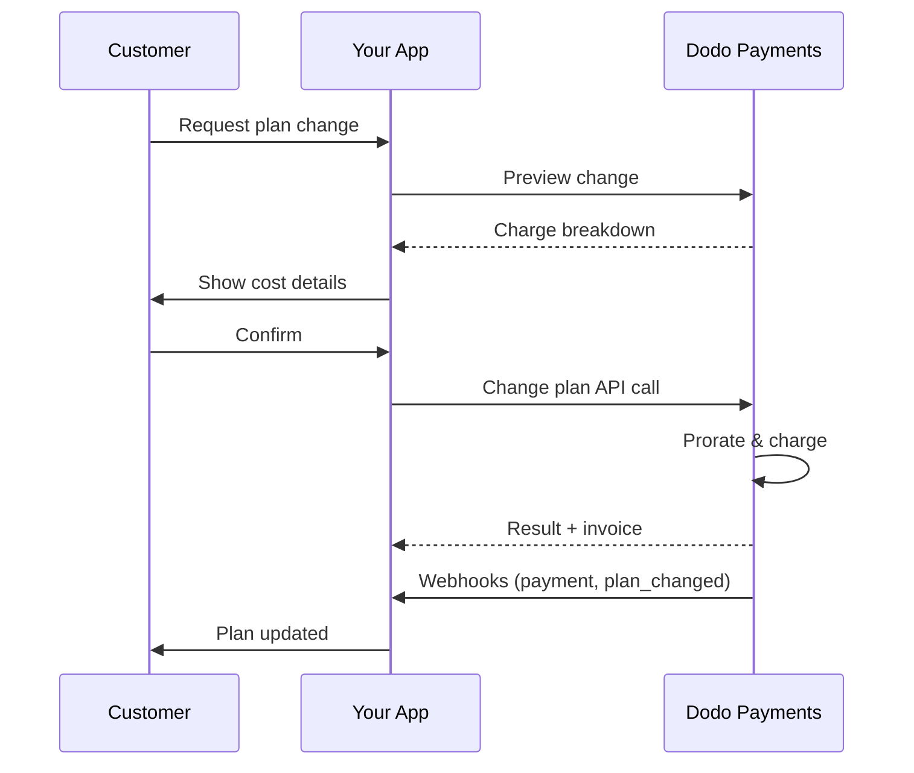
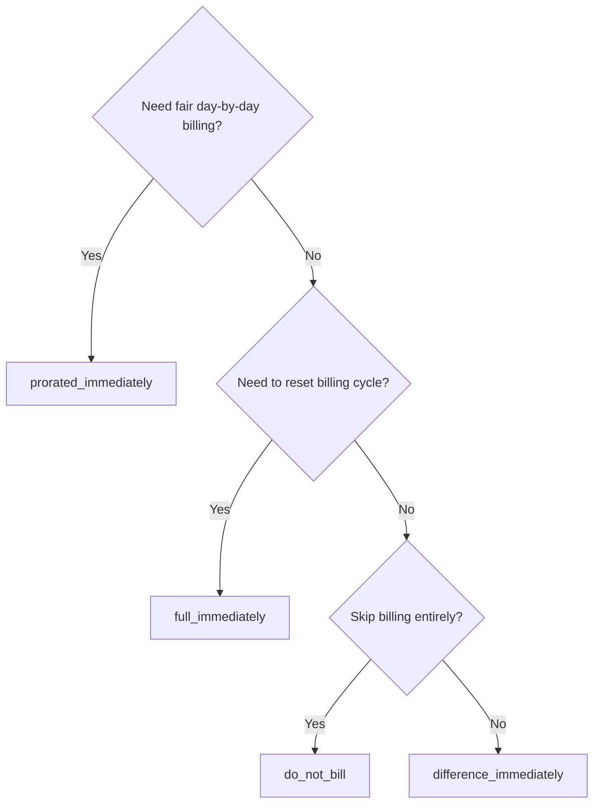
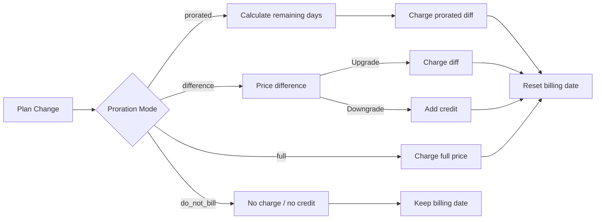

<CardGroup cols={3}>
<Card title="Change Plan API" icon="code" href="/api-reference/subscriptions/change-plan">
  Full API docs for updating subscriptions.
</Card>
<Card title="Plan Change Preview" icon="eye" href="/api-reference/subscriptions/preview-change-plan">
  See charge amounts before changing plans.
</Card>
<Card title="Integration Guide" icon="book" href="/developer-resources/subscription-integration-guide">
  Step-by-step subscription setup.
</Card>
</CardGroup>

## What is a subscription upgrade or downgrade?

Changing plans lets you move a customer between subscription tiers or quantities. Use it to:
- Align pricing with usage or features
- Move from monthly to annual (or vice versa)
- Adjust quantity for seat-based products

<Info>
Plan changes can trigger an immediate charge depending on the proration mode you choose.
</Info>

## When to use plan changes

- Upgrade when a customer needs more features, usage, or seats
- Downgrade when usage decreases
- Migrate users to a new product or price without cancelling their subscription

## Plan Change Flow



## Prerequisites

Before implementing subscription plan changes, ensure you have:

- A Dodo Payments merchant account with active subscription products
- API credentials (API key and webhook secret key) from the dashboard
- An existing active subscription to modify
- Webhook endpoint configured to handle subscription events

<Info>
For detailed setup instructions, see our [Integration Guide](/developer-resources/integration-guide#dashboard-setup).
</Info>

## Step-by-Step Implementation Guide

Follow this comprehensive guide to implement subscription plan changes in your application:

<Steps>
<Step title="Understand Plan Change Requirements">
Before implementing, determine:
- Which subscription products can be changed to which others
- What proration mode fits your business model
- How to handle failed plan changes gracefully
- Which webhook events to track for state management

<Tip>
Test plan changes thoroughly in test mode before implementing in production.
</Tip>
</Step>

<Step title="Choose Your Proration Strategy">
Select the billing approach that aligns with your business needs:

<Tabs>
<Tab title="prorated_immediately">
Best for: SaaS applications wanting to charge fairly for unused time
- Calculates exact prorated amount based on remaining cycle time
- Charges a prorated amount based on unused time remaining in the cycle
- Provides transparent billing to customers
</Tab>

<Tab title="difference_immediately">
Best for: Clear upgrade/downgrade scenarios
- Upgrade: Charge immediate difference (e.g., $30→$80 = charge $50)
- Downgrade: Credit remaining value for future renewals
- Simplifies billing logic and customer communication
</Tab>

<Tab title="full_immediately">
Best for: When you want to reset the billing cycle
- Charges full amount of new plan immediately
- Ignores remaining time from old plan
- Useful for annual to monthly transitions
</Tab>

<Tab title="do_not_bill">
Best for: Free migrations, courtesy switches, or absorbing cost differences
- No charges or credits calculated
- Customer moves to the new plan immediately without any billing adjustment
- Billing cycle remains unchanged
</Tab>
</Tabs>
</Step>

<Step title="Implement the Change Plan API">
Use the Change Plan API to modify subscription details:

<ParamField path="subscription_id" type="string" required>
The ID of the active subscription to modify.
</ParamField>

<ParamField path="product_id" type="string" required>
The new product ID to change the subscription to.
</ParamField>

<ParamField path="quantity" type="integer" required>
Number of units for the new plan (for seat-based products).
</ParamField>

<ParamField path="proration_billing_mode" type="string" required>
How to handle immediate billing: `prorated_immediately`, `full_immediately`, `difference_immediately`, or `do_not_bill`.
</ParamField>

<ParamField path="addons" type="array">
Optional addons for the new plan. Leaving this empty removes any existing addons.
</ParamField>

<ParamField path="on_payment_failure" type="string">
Controls behavior when the plan change payment fails:
- `prevent_change`: Keep subscription on current plan until payment succeeds
- `apply_change` (default): Apply plan change immediately regardless of payment outcome

If not specified, uses the business-level default setting.
</ParamField>

<ParamField path="collect_via_payment_link" type="boolean">
Subscription के saved payment method से charge करने के बजाय, payment link के माध्यम से plan-change राशि collect करें। Customer hosted checkout page पर भुगतान करता है।

इसके लिए business की `allow_plan_change_via_payment_link` capability (**Settings → Subscriptions → Collect Plan Change Payments by Payment Link**), `effective_at: immediately` और `on_payment_failure: prevent_change` आवश्यक हैं। [Collecting Payment via a Checkout Link](#collecting-payment-via-a-checkout-link) देखें।

Preview route द्वारा इसे अनदेखा किया जाता है।
</ParamField>

<ParamField path="discount_codes" type="array">
नए plan पर लागू करने के लिए वैकल्पिक **stacked** discount codes (अधिकतम 20, array order में लागू)। व्यवहार इस बात पर निर्भर करता है कि आप क्या pass करते हैं:

- **प्रदान नहीं किया गया / `null`** — `preserve_on_plan_change=true` वाले existing discounts को नए product पर लागू होने पर सुरक्षित रखा जाता है।
- **`[]` (empty array)** — subscription से सभी existing discounts हटा देता है।
- **`["CODE_A", "CODE_B", ...]`** — किसी भी existing discounts को इस stacked set से replace करता है।
</ParamField>

<ParamField path="discount_code" type="string" deprecated>
**Deprecated** — नए integrations के लिए `discount_codes` को प्राथमिकता दें। यह field backward compatibility के लिए अभी भी काम करता है, लेकिन उसी request में इसे `discount_codes` के साथ combine नहीं किया जा सकता।
</ParamField>

<ParamField path="effective_at" type="string" default="immediately">
Plan change कब लागू करना है:
- `immediately` (default): Plan change तुरंत लागू करें
- `next_billing_date`: Change को अगली billing date के लिए schedule करें। Billing period समाप्त होने तक customer अपना current plan रखता है।

Downgrades के लिए `next_billing_date` का उपयोग करें, ताकि billing period के अंत तक customers को अपने current plan के benefits मिलते रहें।
</ParamField>
</Step>

<Step title="Handle Webhook Events">
Plan change के परिणाम track करने के लिए webhook handling सेट अप करें:

- `subscription.active`: Plan change सफल, subscription updated
- `subscription.plan_changed`: Subscription plan बदला गया (upgrade/downgrade/addon update)
- `subscription.on_hold`: Plan change charge विफल, renewals रोके गए
- `payment.succeeded`: Plan change के लिए immediate charge सफल
- `payment.failed`: Immediate charge विफल

<Warning>
Webhook signatures को हमेशा verify करें और idempotent event processing लागू करें।
</Warning>
</Step>

<Step title="Update Your Application State">
Webhook events के आधार पर अपना application update करें:
- नए plan के आधार पर features grant/revoke करें
- नए plan के विवरण के साथ customer dashboard update करें
- Plan changes के बारे में confirmation emails भेजें
- Audit purposes के लिए billing changes log करें
</Step>

<Step title="Test and Monitor">
अपने implementation का पूरी तरह परीक्षण करें:
- अलग-अलग scenarios के साथ सभी proration modes का परीक्षण करें
- Verify करें कि webhook handling सही ढंग से काम करती है
- Plan change success rates monitor करें
- Failed plan changes के लिए alerts सेट अप करें

<Check>
आपका subscription plan change implementation अब production use के लिए तैयार है।
</Check>
</Step>
</Steps>

## Plan Changes का Preview

Plan change commit करने से पहले, customers को ठीक-ठीक यह दिखाने के लिए Preview API का उपयोग करें कि उनसे कितना charge लिया जाएगा:

<Tabs>
<Tab title="Node.js SDK">

```javascript
const preview = await client.subscriptions.previewChangePlan('sub_123', {
  product_id: 'pdt_pro',
  quantity: 1,
  proration_billing_mode: 'prorated_immediately'
});

// Show customer the charge before confirming
console.log('Immediate charge:', preview.immediate_charge.summary);
console.log('New plan details:', preview.new_plan);
```

</Tab>

<Tab title="Python SDK">

```python
preview = client.subscriptions.preview_change_plan(
    subscription_id="sub_123",
    product_id="pdt_pro",
    quantity=1,
    proration_billing_mode="prorated_immediately"
)

# Show customer the charge before confirming
print("Immediate charge:", preview.immediate_charge.summary)
print("New plan details:", preview.new_plan)
```

</Tab>
</Tabs>

<Tip>
Customers के plan change confirm करने से पहले उन्हें exact charge दिखाने वाले confirmation dialogs बनाने के लिए Preview API का उपयोग करें।
</Tip>

## Change Plan API

Active subscription के product, quantity और proration behavior को modify करने के लिए Change Plan API का उपयोग करें।

### Quick start examples

<Tabs>
  <Tab title="Node.js SDK">

    ```javascript
    import DodoPayments from 'dodopayments';

    const client = new DodoPayments({
      bearerToken: process.env.DODO_PAYMENTS_API_KEY,
      environment: 'test_mode', // defaults to 'live_mode'
    });

    async function changePlan() {
      // change-plan returns 200 with an empty body.
      await client.subscriptions.changePlan('sub_123', {
        product_id: 'pdt_new',
        quantity: 3,
        proration_billing_mode: 'prorated_immediately',
        on_payment_failure: 'prevent_change', // Optional: control behavior on payment failure
      });
      console.log('Plan change accepted; awaiting webhooks');
    }

    changePlan();
    ```

  </Tab>
  <Tab title="Python SDK">

    ```python
    import os
    from dodopayments import DodoPayments

    client = DodoPayments(
        bearer_token=os.environ.get("DODO_PAYMENTS_API_KEY"),
        environment="test_mode",  # defaults to "live_mode"
    )

    # change_plan returns 200 with an empty body.
    client.subscriptions.change_plan(
        subscription_id="sub_123",
        product_id="pdt_new",
        quantity=3,
        proration_billing_mode="prorated_immediately",
        on_payment_failure="prevent_change",  # Optional: control behavior on payment failure
    )
    print("Plan change accepted; awaiting webhooks")
    ```

  </Tab>
  <Tab title="Go SDK">

    ```go
    package main

    import (
      "context"
      "fmt"
      "github.com/dodopayments/dodopayments-go"
      "github.com/dodopayments/dodopayments-go/option"
    )

    func main() {
      client := dodopayments.NewClient(option.WithBearerToken("YOUR_TOKEN"))
      // ChangePlan returns no response body; a nil error means the change succeeded.
      err := client.Subscriptions.ChangePlan(context.TODO(), "sub_123", dodopayments.SubscriptionChangePlanParams{
        UpdateSubscriptionPlanReq: dodopayments.UpdateSubscriptionPlanReqParam{
          ProductID:            dodopayments.F("pdt_new"),
          Quantity:             dodopayments.F(int64(3)),
          ProrationBillingMode: dodopayments.F(dodopayments.UpdateSubscriptionPlanReqProrationBillingModeProratedImmediately),
          OnPaymentFailure:     dodopayments.F(dodopayments.UpdateSubscriptionPlanReqOnPaymentFailurePreventChange), // Optional
        },
      })
      if err != nil { panic(err) }
      fmt.Println("Plan change applied")
    }
    ```

  </Tab>
  <Tab title="HTTP">

    ```bash
    curl -X POST "$DODO_API_BASE/subscriptions/sub_123/change-plan" \
      -H "Authorization: Bearer $DODO_PAYMENTS_API_KEY" \
      -H "Content-Type: application/json" \
      -d '{
        "product_id": "pdt_new",
        "quantity": 3,
        "proration_billing_mode": "prorated_immediately",
        "on_payment_failure": "prevent_change"
      }'
    ```

  </Tab>
</Tabs>

सफल plan change तुरंत `200 OK` लौटाता है — इससे पहले कि कोई charge वास्तव में settle हुआ हो। Body (`ChangePlanResponse`) में क्या शामिल है, यह इस बात पर निर्भर करता है कि change कैसे collect किया गया था:

| Case | `payment_id` / `payment_link` / `client_secret` / `expires_on` |
|------|------------------------------------------------------------|
| Scheduled change (`effective_at: next_billing_date`) | सभी `null` — अभी कुछ charge नहीं किया गया |
| `proration_billing_mode: do_not_bill` | सभी `null` — charge करने के लिए कुछ नहीं |
| Ordinary immediate charge (saved payment method) | सभी `null` |
| `collect_via_payment_link: true` (link issued) | सभी **populated** — customer के लिए checkout handles |

<Note>
हर case में यह response payment result नहीं है — केवल यह बताता है कि request स्वयं स्वीकार की गई है। इससे यह पता नहीं चलता कि immediate charge वास्तव में सफल हुआ या नहीं।

**Ordinary immediate charge** के लिए यह outcome call के तुरंत बाद off-session resolve हो जाता है।

**`collect_via_payment_link` request** के लिए यह बाद में और asynchronously resolve होता है — response आपको केवल checkout link देता है, subscription अपने current plan पर रहती है, और outcome के बारे में तब तक कुछ पता नहीं चलता जब तक customer उस link पर payment पूरा नहीं करता।

किसी भी स्थिति में, इस response से outcome का अनुमान न लगाएँ। इसकी पुष्टि webhook (<code>payment.succeeded</code>, <code>payment.failed</code>, <code>subscription.plan_changed</code>) के माध्यम से करें या <code>GET /subscriptions/&#123;subscription_id&#125;</code> से subscription को दोबारा पढ़ें — payment-link case के लिए विशेष रूप से [What Happens While the Link Is Unpaid](#what-happens-while-the-link-is-unpaid) देखें।
</Note>

<Warning>
यदि immediate charge विफल होता है, तो payment सफल होने तक subscription `subscription.on_hold` पर जा सकती है।
</Warning>

## Checkout Link के माध्यम से Payment Collect करना

Default रूप से, immediate plan change subscription के saved payment method से सीधे charge करता है। Customer को इसके बजाय hosted checkout page पर भेजने के लिए `collect_via_payment_link: true` सेट करें — यह तब उपयोगी है जब ऐसा कोई saved payment method न हो जिसे आप off-session charge कर सकें, या जब आप customer से नई price को सक्रिय रूप से confirm करवाना चाहते हों।

<Info>
यही **Settings → Subscriptions** में मौजूद **Collect Plan Change Payments by Payment Link** toggle को power करता है। यह built-in [Customer Portal](/features/customer-portal#collecting-plan-change-payments-by-payment-link) के plan-change flow को saved card के बजाय checkout के माध्यम से route करता है।
</Info>

### Requirements

`collect_via_payment_link: true` केवल तब सफल होता है जब निम्न **सभी** शर्तें पूरी हों — अन्यथा request `422` के साथ विफल होती है:

- Business में `allow_plan_change_via_payment_link` capability enabled हो (**Settings → Subscriptions → Collect Plan Change Payments by Payment Link**)।
- `effective_at`, `immediately` हो (default)। Scheduled change (`next_billing_date`) को checkout page की आवश्यकता कभी नहीं होती, क्योंकि charge उसके लागू होने तक नहीं किया जाता।
- **Effective** `on_payment_failure`, `prevent_change` पर resolve हो। इसे explicitly भेजना आवश्यक नहीं है — यदि आपका business-level default (नीचे **Business & Collection Defaults** देखें) पहले से `prevent_change` है, तो field को छोड़ना भी पर्याप्त है। Explicit `apply_change` या `apply_change` का resolved default, `422` के साथ विफल होता है।

<Info>
`collect_via_payment_link` केवल upgrades तक सीमित नहीं है — यह downgrades सहित किसी भी ऐसे immediate change पर लागू होता है जिससे charge बनता है, बशर्ते ऊपर दी गई requirements पूरी हों।
</Info>

यदि change का परिणाम **zero या credit** हो — `proration_billing_mode: do_not_bill` या कोई अन्य mode जो इस cycle में शून्य net करे — तो checkout page पर रखने के लिए कुछ नहीं है। कोई payment link जारी नहीं किया जाता, `payment_link` और अन्य fields `null` के रूप में लौटते हैं, और change तुरंत लागू हो जाता है, ठीक वैसे ही जैसे `collect_via_payment_link` के बिना होता। यह `422` नहीं है; flag केवल तब प्रभावी होता है जब collect करने के लिए positive amount हो। यदि आप स्पष्ट upgrades के बजाय सामान्य रूप से plan changes पर `collect_via_payment_link` सेट करते हैं, तो पहले [Preview Plan Change](/api-reference/subscriptions/preview-change-plan) call करें और केवल तभी link request करें जब preview की गई राशि collect करने योग्य हो।

<Tabs>
<Tab title="Node.js SDK">

```javascript
const response = await client.subscriptions.changePlan('sub_123', {
  product_id: 'pdt_pro',
  quantity: 1,
  proration_billing_mode: 'prorated_immediately',
  effective_at: 'immediately',
  on_payment_failure: 'prevent_change',
  collect_via_payment_link: true,
});

// Hand response.payment_link to your frontend and send the customer there
console.log(response.payment_link);
```

</Tab>
<Tab title="Python SDK">

```python
response = client.subscriptions.change_plan(
    subscription_id="sub_123",
    product_id="pdt_pro",
    quantity=1,
    proration_billing_mode="prorated_immediately",
    effective_at="immediately",
    on_payment_failure="prevent_change",
    collect_via_payment_link=True,
)

# Hand response.payment_link to your frontend and send the customer there
print(response.payment_link)
```

</Tab>
<Tab title="HTTP">

```bash
curl -X POST "$DODO_API_BASE/subscriptions/sub_123/change-plan" \
  -H "Authorization: Bearer $DODO_PAYMENTS_API_KEY" \
  -H "Content-Type: application/json" \
  -d '{
    "product_id": "pdt_pro",
    "quantity": 1,
    "proration_billing_mode": "prorated_immediately",
    "effective_at": "immediately",
    "on_payment_failure": "prevent_change",
    "collect_via_payment_link": true
  }'
```

</Tab>
</Tabs>

सफल request checkout handles लौटाती है:

```json
{
  "payment_id": "<payment_id>",
  "payment_link": "https://checkout.dodopayments.com/...",
  "client_secret": "<client_secret>",
  "expires_on": "<expires_on>"
}
```

### Link Unpaid रहने पर क्या होता है

- Subscription अपने **current** plan पर रहती है — `product_id`, `recurring_pre_tax_amount` और `next_billing_date` तब तक अपरिवर्तित रहते हैं जब तक link का भुगतान नहीं हो जाता।
- Link pending रहने के दौरान उसी subscription पर किया गया अगला `change-plan` request `409 PendingPlanChangeExists` के साथ reject हो जाता है। आवश्यकता होने पर *scheduled* change को `DELETE /subscriptions/{subscription_id}/change-plan/scheduled` से cancel करें, लेकिन वह endpoint pending payment-link change को cancel नहीं करता — केवल successful payment या expiry ऐसा करता है।
- Decline के बाद customer उसी checkout session पर card retry कर सकता है; नया `change-plan` call retry का तरीका नहीं है।
- यदि link का कभी भुगतान नहीं होता, तो `expires_on` के बाद वह काम करना बंद कर देता है — subscription थोड़े समय बाद नया plan-change request स्वीकार करने के लिए स्वतः उपलब्ध हो जाती है।
- यदि कोई *scheduled* change (`next_billing_date`) पहले से मौजूद था और आप उसे `cancel_scheduled_change_plan: true` से replace करते हैं, तो link unpaid रहने तक original schedule बना रहता है और link का भुगतान होने पर ही cancel होता है — उसी transaction में जिसमें नया plan लागू होता है।

<Warning>
एक बार immediate payment-link change जारी हो जाने पर, उस subscription पर किया गया हर अगला plan-change request — side-effect-free preview सहित — link resolve होने तक blocked रहता है। ऐसा link जारी न करें जिसे आप customer से तुरंत pay करवाने का इरादा नहीं रखते।
</Warning>

## Addons Manage करना

Subscription plans बदलते समय आप addons को भी modify कर सकते हैं:

```javascript
// Add addons to the new plan
await client.subscriptions.changePlan('sub_123', {
  product_id: 'pdt_new',
  quantity: 1,
  proration_billing_mode: 'difference_immediately',
  addons: [
    { addon_id: 'addon_123', quantity: 2 }
  ]
});

// Remove all existing addons
await client.subscriptions.changePlan('sub_123', {
  product_id: 'pdt_new',
  quantity: 1,
  proration_billing_mode: 'difference_immediately',
  addons: [] // Empty array removes all existing addons
});
```

<Info>
Addons proration calculation में शामिल किए जाते हैं और selected proration mode के अनुसार charge किए जाएंगे।
</Info>

## Discount Codes लागू करना

Subscription plans बदलते समय आप एक या अधिक **stacked discount codes** लागू कर सकते हैं (अधिकतम 20, array order में लागू)। यह upgrades या migrations पर promotional pricing देने के लिए उपयोगी है।

<Tabs>
<Tab title="Node.js SDK">

```javascript
// Apply stacked discount codes during plan change
await client.subscriptions.changePlan('sub_123', {
  product_id: 'pdt_pro',
  quantity: 1,
  proration_billing_mode: 'prorated_immediately',
  discount_codes: ['UPGRADE20']
});
```

</Tab>
<Tab title="Python SDK">

```python
# Apply stacked discount codes during plan change
client.subscriptions.change_plan(
    subscription_id="sub_123",
    product_id="pdt_pro",
    quantity=1,
    proration_billing_mode="prorated_immediately",
    discount_codes=["UPGRADE20"]
)
```

</Tab>
<Tab title="HTTP">

```bash
curl -X POST "$DODO_API_BASE/subscriptions/sub_123/change-plan" \
  -H "Authorization: Bearer $DODO_PAYMENTS_API_KEY" \
  -H "Content-Type: application/json" \
  -d '{
    "product_id": "pdt_pro",
    "quantity": 1,
    "proration_billing_mode": "prorated_immediately",
    "discount_codes": ["UPGRADE20"]
  }'
```

</Tab>
</Tabs>

### Plan change पर discount behavior

| `discount_codes` value | Behavior |
|------------------------|----------|
| Not provided / `null` | `preserve_on_plan_change=true` वाले existing discounts को नए product पर लागू होने पर automatically preserve किया जाता है। |
| `[]` (empty array) | Subscription से **सभी** existing discounts हटा दिए जाते हैं। |
| `["CODE_A", "CODE_B", ...]` | किसी भी existing discounts को इस stacked set से replace करता है, जिसे validate करके array order में लागू किया जाता है। |

<Info>
इस endpoint का singular `discount_code` field **deprecated** है, लेकिन backward compatibility के लिए अभी भी काम करता है — existing integrations को तुरंत बदलने की आवश्यकता नहीं है। इसे उसी request में `discount_codes` के साथ combine नहीं किया जा सकता। सुविधा के अनुसार array form पर migrate करें।
</Info>

<Tip>
Plan change confirm करने से पहले customers को ठीक-ठीक यह दिखाने के लिए [Preview Plan Change API](/api-reference/subscriptions/preview-change-plan) को `discount_codes` के साथ उपयोग करें कि वे कितनी बचत करेंगे।
</Tip>

## Proration modes

Plans बदलते समय customer को bill करने का तरीका चुनें:

#### `prorated_immediately`
- Current cycle में partial difference का charge करता है
- Trial में होने पर तुरंत charge करता है और अभी नए plan पर switch करता है
- Downgrade: future renewals पर लागू होने वाला prorated credit बना सकता है

#### `full_immediately`
- नए plan की पूरी राशि तुरंत charge करता है
- पुराने plan का बचा हुआ समय अनदेखा करता है

<Info>
<code>difference_immediately</code> का उपयोग करके downgrades से बनाए गए credits subscription-scoped होते हैं और <a href="/features/credit-based-billing">Credit-Based Billing</a> entitlements से अलग होते हैं। वे उसी subscription के future renewals पर automatically लागू होते हैं और subscriptions के बीच transfer नहीं किए जा सकते।
</Info>

#### `difference_immediately`
- Upgrade: पुराने और नए plans के बीच price difference तुरंत charge करें
- Downgrade: बची हुई value को subscription में internal credit के रूप में जोड़ें और renewals पर automatically लागू करें

#### `do_not_bill`
- कोई charges या credits calculate नहीं किए जाते
- Customer बिना किसी billing adjustment के तुरंत नए plan पर switch करता है
- Billing cycle अपरिवर्तित रहता है
- Courtesy migrations, free plan switches या cost differences absorb करने के लिए सर्वोत्तम

| Feature | `prorated_immediately` | `difference_immediately` | `full_immediately` | `do_not_bill` |
|---------|----------------------|------------------------|-------------------|--------------|
| **Upgrade charge** | शेष दिनों का prorated difference | Plans के बीच full price difference | नए plan की पूरी price | कोई charge नहीं |
| **Downgrade credit** | शेष दिनों का prorated credit | Full price difference as credit | कोई credit नहीं | कोई credit नहीं |
| **Billing cycle** | आज पर reset | आज पर reset | आज पर reset | अपरिवर्तित |
| **Trial behavior** | Trial समाप्त, तुरंत charge | Trial समाप्त, तुरंत charge | Trial समाप्त, full amount charge | Trial समाप्त, कोई charge नहीं |
| **Best for** | Fair time-based billing | Simple upgrade/downgrade math | Billing cycles reset करना | Free migrations या courtesy switches |
| **Complexity** | Medium (day calculation) | Low (simple subtraction) | Low (full charge) | None |



### Example scenarios

इन canonical numbers का लगातार उपयोग करें:
- Current plan: **Basic**, **$30/month**
- Upgrade target: **Pro**, **$80/month**
- Downgrade target (Pro से): **Starter**, **$20/month**
- Billing cycle: **30 days**, **January 1** से शुरू
- Plan change **January 16** को होता है (15 दिन शेष, 15 दिन उपयोग किए गए)

<AccordionGroup>
  <Accordion title="Upgrade: Basic ($30) → Pro ($80) with prorated_immediately">

    ```
    Step 1: Calculate unused credit from current plan
      Unused days = 15 out of 30 days
      Credit = $30 × (15/30) = $15.00

    Step 2: Calculate prorated cost of new plan
      Remaining days = 15 out of 30 days
      New plan cost = $80 × (15/30) = $40.00

    Step 3: Calculate immediate charge
      Charge = New plan cost − Credit
      Charge = $40.00 − $15.00 = $25.00

    → Customer pays $25.00 now
    → Billing cycle resets to today (January 16)
    → Next renewal (Feb 15): $80.00/month
    ```

    ```javascript
    await client.subscriptions.changePlan('sub_123', {
      product_id: 'pdt_pro',
      quantity: 1,
      proration_billing_mode: 'prorated_immediately'
    })
    ```

  </Accordion>

  <Accordion title="Downgrade: Pro ($80) → Starter ($20) with prorated_immediately">

    ```
    Step 1: Calculate unused credit from current plan
      Unused days = 15 out of 30 days
      Credit = $80 × (15/30) = $40.00

    Step 2: Calculate prorated cost of new plan
      Remaining days = 15 out of 30 days
      New plan cost = $20 × (15/30) = $10.00

    Step 3: Calculate credit balance
      Credit = $40.00 − $10.00 = $30.00

    → No charge — $30.00 credit added to subscription
    → Billing cycle resets to today (January 16)
    → Credit auto-applies to future renewals
    → Next renewal (Feb 15): $20.00 − $20.00 (from credit) = $0.00 ($10.00 credit remaining)
    → Following renewal (Mar 15): $20.00 − $10.00 remaining credit = $10.00
    ```

    ```javascript
    await client.subscriptions.changePlan('sub_123', {
      product_id: 'pdt_starter',
      quantity: 1,
      proration_billing_mode: 'prorated_immediately'
    })
    ```

  </Accordion>

  <Accordion title="Upgrade: Basic ($30) → Pro ($80) with difference_immediately">

    ```
    Immediate charge = New plan price − Old plan price
                     = $80 − $30
                     = $50.00

    → Customer pays $50.00 now (regardless of cycle position)
    → Billing cycle resets to today (January 16)
    → Next renewal (Feb 15): $80.00/month
    ```

    ```javascript
    await client.subscriptions.changePlan('sub_123', {
      product_id: 'pdt_pro',
      quantity: 1,
      proration_billing_mode: 'difference_immediately'
    })
    ```

  </Accordion>

  <Accordion title="Downgrade: Pro ($80) → Starter ($20) with difference_immediately">

    ```
    Credit = Old plan price − New plan price
           = $80 − $20
           = $60.00

    → No charge — $60.00 credit added to subscription
    → Credit auto-applies to future renewals
    → Next renewal: $20.00 − $20.00 (from credit) = $0.00
    → Following renewal: $20.00 − $20.00 (from credit) = $0.00
    → Third renewal: $20.00 − $20.00 (from remaining credit) = $0.00
    ```

    ```javascript
    await client.subscriptions.changePlan('sub_123', {
      product_id: 'pdt_starter',
      quantity: 1,
      proration_billing_mode: 'difference_immediately'
    })
    ```

  </Accordion>

  <Accordion title="Upgrade: Basic ($30) → Pro ($80) with full_immediately">

    ```
    Immediate charge = Full new plan price = $80.00

    → Customer pays $80.00 now
    → No credit for unused time on old plan
    → Billing cycle resets to today (January 16)
    → Next renewal: February 16 at $80.00/month
    ```

    ```javascript
    await client.subscriptions.changePlan('sub_123', {
      product_id: 'pdt_pro',
      quantity: 1,
      proration_billing_mode: 'full_immediately'
    })
    ```

  </Accordion>

  <Accordion title="Mid-cycle upgrade with add-ons using prorated_immediately">

    ```
    Current: Basic plan ($30/month), no add-ons
    New: Pro plan ($80/month) + Extra Seats add-on ($10/seat × 3 seats = $30/month)
    Change on day 16 of 30 (15 days remaining)

    Step 1: Credit from current plan
      Credit = $30 × (15/30) = $15.00

    Step 2: Prorated cost of new plan + add-ons
      New plan = $80 × (15/30) = $40.00
      Add-ons = $30 × (15/30) = $15.00
      Total new = $55.00

    Step 3: Immediate charge
      Charge = $55.00 − $15.00 = $40.00

    → Customer pays $40.00 now
    → Next renewal: $80.00 + $30.00 = $110.00/month
    ```

    ```javascript
    await client.subscriptions.changePlan('sub_123', {
      product_id: 'pdt_pro',
      quantity: 1,
      proration_billing_mode: 'prorated_immediately',
      addons: [
        { addon_id: 'addon_seats', quantity: 3 }
      ]
    })
    ```

  </Accordion>
</AccordionGroup>

### प्रत्येक mode billing को कैसे process करता है



<Tip>
Fair-time accounting के लिए `prorated_immediately` चुनें; billing restart करने के लिए `full_immediately` चुनें; simple upgrades और downgrades पर automatic credit के लिए `difference_immediately` उपयोग करें; या बिना किसी billing adjustment के plans switch करने के लिए `do_not_bill` उपयोग करें।
</Tip>

## Payment Failures को Handle करना

`on_payment_failure` parameter का उपयोग करके नियंत्रित करें कि plan change payment विफल होने पर क्या होता है।

### Payment Failure Modes

<Tabs>
<Tab title="prevent_change (Recommended for critical upgrades)">
**Behavior**: Payment सफल होने तक subscription को उसके current plan पर रखें।

- Plan change को "pending" के रूप में mark किया जाता है
- Customer को अपने current plan का access मिलता रहता है
- Successful payment के बाद ही subscription `active` state में जाती है
- Upgraded features देने से पहले payment सुनिश्चित करने के लिए उपयोगी

```javascript
await client.subscriptions.changePlan('sub_123', {
  product_id: 'pdt_pro',
  quantity: 1,
  proration_billing_mode: 'prorated_immediately',
  on_payment_failure: 'prevent_change'
});
```

</Tab>

<Tab title="apply_change (Default)">
**Behavior**: Payment outcome की परवाह किए बिना plan change तुरंत लागू करें।

- Payment विफल होने पर भी plan change लागू किया जाता है
- Customer को नए plan का तुरंत access मिलता है
- Payment विफल होने पर subscription `on_hold` पर जा सकती है
- Non-critical upgrades या trusted customers के लिए उपयोगी

```javascript
await client.subscriptions.changePlan('sub_123', {
  product_id: 'pdt_pro',
  quantity: 1,
  proration_billing_mode: 'prorated_immediately',
  on_payment_failure: 'apply_change' // This is the default
});
```

</Tab>
</Tabs>

<Info>
यदि निर्दिष्ट नहीं किया गया है, तो `on_payment_failure` parameter dashboard में configured business-level default setting का उपयोग करता है।
</Info>

### प्रत्येक Mode का उपयोग कब करें

| Scenario | Recommended Mode | Reason |
|----------|------------------|--------|
| Premium features पर upgrade | `prevent_change` | Access देने से पहले payment सुनिश्चित करें |
| Quantity increase (अधिक seats) | `prevent_change` | Payment के बिना usage रोकें |
| Plans downgrade करना | `apply_change` | Customer अपना खर्च कम कर रहा है |
| Trusted enterprise customers | `apply_change` | Non-payment का जोखिम कम |
| Trial से paid conversion | `prevent_change` | Critical payment moment |

## Business और Collection Defaults

हर plan change पर proration parameters pass करने के बजाय, business level पर **default upgrade & downgrade behavior** एक बार set कर सकते हैं। ये defaults सभी customer-portal plan changes पर लागू होते हैं और **per product collection override** किए जा सकते हैं।

Upgrades और downgrades के लिए अलग-अलग defaults होते हैं:

| Setting | Field (upgrade / downgrade) | Default (upgrade) | Default (downgrade) |
|---------|-----------------------------|-------------------|---------------------|
| नया plan कब शुरू होता है | `effective_at_on_upgrade` / `effective_at_on_downgrade` | `immediately` | `next_billing_date` |
| Customer से charge कैसे लिया जाता है | `proration_billing_mode_on_upgrade` / `proration_billing_mode_on_downgrade` | `difference_immediately` | `difference_immediately` |
| Customer का payment विफल होने पर | `on_payment_failure` | `apply_change` | `apply_change` |

Business defaults को **Settings → Subscriptions** में और collection overrides को प्रत्येक product collection पर configure करें। प्रत्येक collection field independent है — इसे unset छोड़ने पर यह **business default से inherit** करता है, या केवल उस collection के लिए override करने हेतु कोई value set करें।

### Resolution order

किसी भी plan change के लिए प्रत्येक setting इस order में resolve होती है:

```
per-request value (Change Plan API) → collection field (if set) → business field → system default
```

<Info>
[Change Plan API](/api-reference/subscriptions/change-plan) को explicitly pass की गई value हमेशा प्राथमिकता पाती है। Business और collection defaults तभी प्रभावी होते हैं जब कोई explicit value supply न की गई हो — customer portal से शुरू किए गए सभी plan changes में यही स्थिति होती है।
</Info>

<Tip>
एक सामान्य setup यह है: upgrades को `immediately` + `difference_immediately` रखें, ताकि customers difference का payment करें और तुरंत access पाएं; तथा downgrades को `next_billing_date` पर रखें, ताकि cycle समाप्त होने तक customers अपना current plan बनाए रखें।
</Tip>

## Webhooks Handle करना

Plan changes और payments की पुष्टि करने के लिए webhooks के माध्यम से subscription state track करें।

### Handle करने योग्य Event types
- `subscription.active`: subscription activated
- `subscription.plan_changed`: subscription plan changed (upgrade/downgrade/addon changes)
- `subscription.on_hold`: charge failed, renewals stopped
- `subscription.renewed`: renewal succeeded
- `payment.succeeded`: plan change या renewal का payment succeeded
- `payment.failed`: payment failed

<Info>
हम business logic को subscription events से drive करने और confirmation तथा reconciliation के लिए payment events का उपयोग करने की सलाह देते हैं।
</Info>

### Signatures verify करें और intents handle करें

<Tabs>
  <Tab title="Next.js Route Handler">

    ```javascript
    import { NextRequest, NextResponse } from 'next/server';
    
    export async function POST(req) {
      const webhookId = req.headers.get('webhook-id');
      const webhookSignature = req.headers.get('webhook-signature');
      const webhookTimestamp = req.headers.get('webhook-timestamp');
      const secret = process.env.DODO_WEBHOOK_SECRET;
    
      const payload = await req.text();
      // verifySignature is a placeholder – in production, use a Standard Webhooks library
      const { valid, event } = await verifySignature(
        payload,
        { id: webhookId, signature: webhookSignature, timestamp: webhookTimestamp },
        secret
      );
      if (!valid) return NextResponse.json({ error: 'Invalid signature' }, { status: 400 });
    
      switch (event.type) {
        case 'subscription.active':
          // mark subscription active in your DB
          break;
        case 'subscription.plan_changed':
          // refresh entitlements and reflect the new plan in your UI
          break;
        case 'subscription.on_hold':
          // notify user to update payment method
          break;
        case 'subscription.renewed':
          // extend access window
          break;
        case 'payment.succeeded':
          // reconcile payment for plan change
          break;
        case 'payment.failed':
          // log and alert
          break;
        default:
          // ignore unknown events
          break;
      }
    
      return NextResponse.json({ received: true });
    }
    ```

  </Tab>
  <Tab title="Express.js">

    ```javascript
    import express from 'express';
    
    const app = express();
    app.post('/webhooks/dodo', express.raw({ type: 'application/json' }), async (req, res) => {
      const webhookId = req.header('webhook-id');
      const webhookSignature = req.header('webhook-signature');
      const webhookTimestamp = req.header('webhook-timestamp');
      const secret = process.env.DODO_WEBHOOK_SECRET;
      const payload = req.body.toString('utf8');
    
      const { valid, event } = await verifySignature(
        payload,
        { id: webhookId, signature: webhookSignature, timestamp: webhookTimestamp },
        secret
      );
      if (!valid) return res.status(400).send('Invalid signature');
    
      // handle events like above
      res.json({ received: true });
    });
    
    app.listen(3000);
    ```

  </Tab>
</Tabs>

<Note>
विस्तृत payload schemas के लिए <a href="/developer-resources/webhooks/intents/subscription">Subscription webhook payloads</a> और <a href="/developer-resources/webhooks/intents/payment">Payment webhook payloads</a> देखें।
</Note>

## Best Practices

Reliable subscription plan changes के लिए इन recommendations का पालन करें:

### Plan Change Strategy
- **Thoroughly test करें**: Production से पहले test mode में plan changes का हमेशा परीक्षण करें
- **Proration सावधानी से चुनें**: अपने business model के अनुरूप proration mode चुनें
- **Failures को gracefully handle करें**: उचित error handling और retry logic लागू करें
- **Success rates monitor करें**: Plan change success/failure rates track करें और issues की जांच करें

### Webhook Implementation
- **Signatures verify करें**: Authenticity सुनिश्चित करने के लिए webhook signatures को हमेशा validate करें
- **Idempotency लागू करें**: Duplicate webhook events को gracefully handle करें
- **Asynchronously process करें**: Heavy operations से webhook responses को block न करें
- **सब कुछ log करें**: Debugging और audit purposes के लिए detailed logs रखें

### User Experience
- **स्पष्ट रूप से communicate करें**: Customers को billing changes और timing के बारे में बताएं
- **Confirmations प्रदान करें**: सफल plan changes के लिए email confirmations भेजें
- **Edge cases handle करें**: Trial periods, prorations और failed payments पर विचार करें
- **UI तुरंत update करें**: अपने application interface में plan changes दिखाएं

## Common Issues और Solutions

Subscription plan changes के दौरान आने वाली सामान्य समस्याओं का समाधान करें:

<AccordionGroup>
<Accordion title="Charge created but subscription not updated">
**Symptoms**: API call सफल होती है, लेकिन subscription पुराने plan पर बनी रहती है

**Common causes**:
- Webhook processing विफल या delayed था
- Webhooks प्राप्त होने के बाद application state update नहीं हुआ
- State update के दौरान database transaction issues

**Solutions**:
- Retry logic के साथ robust webhook handling लागू करें
- State updates के लिए idempotent operations का उपयोग करें
- Missed webhook events detect और alert करने के लिए monitoring जोड़ें
- Verify करें कि webhook endpoint accessible है और सही ढंग से respond कर रहा है
</Accordion>

<Accordion title="Credits not applied after downgrade">
**Symptoms**: Customer downgrade करता है, लेकिन credit balance दिखाई नहीं देता

**Common causes**:
- Proration mode की अपेक्षाएं: `difference_immediately` के साथ downgrades full plan price difference को credit करते हैं, जबकि `prorated_immediately` cycle में बचे समय के आधार पर prorated credit बनाता है
- Credits subscription-specific होते हैं और subscriptions के बीच transfer नहीं होते
- Customer dashboard में credit balance दिखाई नहीं देता

**Solutions**:
- Automatic credits चाहने पर downgrades के लिए `difference_immediately` का उपयोग करें
- Customers को समझाएं कि credits उसी subscription के future renewals पर लागू होते हैं
- Credit balances दिखाने के लिए customer portal लागू करें
- Applied credits देखने के लिए next invoice preview check करें
</Accordion>

<Accordion title="Webhook signature verification fails">
**Symptoms**: Invalid signature के कारण webhook events reject हो जाते हैं

**Common causes**:
- Incorrect webhook secret key
- Signature verification से पहले raw request body modify की गई
- गलत signature verification algorithm

**Solutions**:
- Verify करें कि dashboard से सही `DODO_WEBHOOK_SECRET` उपयोग कर रहे हैं
- किसी भी JSON parsing middleware से पहले raw request body पढ़ें
- अपने platform के लिए standard webhook verification library का उपयोग करें
- Development environment में webhook signature verification का परीक्षण करें
</Accordion>

<Accordion title="Plan change fails with 422 error">
**Symptoms**: API 422 Unprocessable Entity error लौटाती है

**Common causes**:
- Invalid subscription ID या product ID
- Subscription active state में नहीं है
- Required parameters missing हैं
- Product plan changes के लिए उपलब्ध नहीं है

**Solutions**:
- Verify करें कि subscription मौजूद और active है
- Check करें कि product ID valid और available है
- सुनिश्चित करें कि सभी required parameters दिए गए हैं
- Parameter requirements के लिए API documentation देखें
</Accordion>

<Accordion title="Immediate charge fails during plan change">
**Symptoms**: Plan change शुरू किया गया, लेकिन immediate charge विफल हो गया

**Common causes**:
- Customer के payment method में insufficient funds
- Payment method expired या invalid है
- Bank ने transaction decline कर दिया
- Fraud detection ने charge block कर दिया

**Solutions**:
- `payment.failed` webhook events को उचित ढंग से handle करें
- Customer को payment method update करने के लिए notify करें
- Temporary failures के लिए retry logic लागू करें
- Failed immediate charges के साथ plan changes allow करने पर विचार करें
</Accordion>

<Accordion title="Subscription on hold after plan change">
**Symptoms**: Plan change charge विफल होता है और subscription `on_hold` state में चली जाती है

**What happens**:
जब plan change charge विफल होता है, तो subscription automatically `on_hold` state में चली जाती है। Payment method update होने तक subscription automatically renew नहीं होगी।

**Solution**: Subscription को reactivate करने के लिए payment method update करें

Failed plan change के बाद subscription को `on_hold` state से reactivate करने के लिए:

1. **Payment method update करें**: Update Payment Method API का उपयोग करें
2. **Automatic charge creation**: API remaining dues के लिए automatically charge बनाती है
3. **Invoice generation**: Charge के लिए invoice generate की जाती है
4. **Payment processing**: नए payment method का उपयोग करके payment process किया जाता है
5. **Reactivation**: Successful payment के बाद subscription `active` state में reactivate हो जाती है

<CodeGroup>

```javascript Node.js
// Reactivate subscription from on_hold after failed plan change
async function reactivateAfterFailedPlanChange(subscriptionId) {
  // Update payment method - automatically creates charge for remaining dues
  const response = await client.subscriptions.updatePaymentMethod(subscriptionId, {
    payment_method: { type: 'new', return_url: 'https://example.com/return' }
  });
  
  if (response.payment_id) {
    console.log('Charge created for remaining dues:', response.payment_id);
    console.log('Payment link:', response.payment_link);
    
    // Redirect customer to payment_link to complete payment
    // Monitor webhooks for:
    // 1. payment.succeeded - charge succeeded
    // 2. subscription.active - subscription reactivated
  }
  
  return response;
}

// Or use existing payment method if available
async function reactivateWithExistingPaymentMethod(subscriptionId, paymentMethodId) {
  const response = await client.subscriptions.updatePaymentMethod(subscriptionId, {
    payment_method: { type: 'existing', payment_method_id: paymentMethodId }
  });
  
  // Monitor webhooks for payment.succeeded and subscription.active
  return response;
}
```

```python Python
# Reactivate subscription from on_hold after failed plan change
def reactivate_after_failed_plan_change(subscription_id):
    # Update payment method - automatically creates charge for remaining dues
    response = client.subscriptions.update_payment_method(
        subscription_id=subscription_id,
        payment_method={"type": "new", "return_url": "https://example.com/return"},
    )
    
    if response.payment_id:
        print("Charge created for remaining dues:", response.payment_id)
        print("Payment link:", response.payment_link)
        
        # Redirect customer to payment_link to complete payment
        # Monitor webhooks for:
        # 1. payment.succeeded - charge succeeded
        # 2. subscription.active - subscription reactivated
    
    return response

# Or use existing payment method if available
def reactivate_with_existing_payment_method(subscription_id, payment_method_id):
    response = client.subscriptions.update_payment_method(
        subscription_id=subscription_id,
        payment_method={"type": "existing", "payment_method_id": payment_method_id},
    )
    
    # Monitor webhooks for payment.succeeded and subscription.active
    return response
```

</CodeGroup>

**Monitor करने योग्य Webhook events**:
- `subscription.on_hold`: Subscription hold पर रखी गई (plan change charge विफल होने पर प्राप्त)
- `payment.succeeded`: Remaining dues का payment सफल (payment method update करने के बाद)
- `subscription.active`: Successful payment के बाद subscription reactivated

**Best practices**:
- Plan change charge विफल होने पर customers को तुरंत notify करें
- Payment method update करने का स्पष्ट तरीका बताएं
- Reactivation status track करने के लिए webhook events monitor करें
- Temporary payment failures के लिए automatic retry logic लागू करने पर विचार करें

<Card title="Update Payment Method API Reference" icon="code" href="/api-reference/subscriptions/update-payment-method">
Payment methods update करने और subscriptions reactivate करने के लिए complete API documentation देखें।
</Card>
</Accordion>
</AccordionGroup>

## अपने Implementation का परीक्षण

अपने subscription plan change implementation का पूरी तरह परीक्षण करने के लिए इन steps का पालन करें:

<Steps>
<Step title="Set up test environment">
- Test API keys और test products का उपयोग करें
- अलग-अलग plan types वाली test subscriptions बनाएं
- Test webhook endpoint configure करें
- Monitoring और logging सेट अप करें
</Step>

<Step title="Test different proration modes">
- विभिन्न billing cycle positions के साथ `prorated_immediately` का परीक्षण करें
- Upgrades और downgrades के लिए `difference_immediately` का परीक्षण करें
- Billing cycles reset करने के लिए `full_immediately` का परीक्षण करें
- No-charge/no-credit plan switches के लिए `do_not_bill` का परीक्षण करें
- Verify करें कि credit calculations सही हैं
</Step>

<Step title="Test webhook handling">
- Verify करें कि सभी relevant webhook events प्राप्त हो रहे हैं
- Webhook signature verification का परीक्षण करें
- Duplicate webhook events को gracefully handle करें
- Webhook processing failure scenarios का परीक्षण करें
</Step>

<Step title="Test error scenarios">
- Invalid subscription IDs के साथ परीक्षण करें
- Expired payment methods के साथ परीक्षण करें
- Network failures और timeouts का परीक्षण करें
- Insufficient funds के साथ परीक्षण करें
</Step>

<Step title="Monitor in production">
- Failed plan changes के लिए alerts सेट अप करें
- Webhook processing times monitor करें
- Plan change success rates track करें
- Plan change issues के लिए customer support tickets review करें
</Step>
</Steps>

## Error Handling

अपने implementation में common API errors को gracefully handle करें:

### HTTP Status Codes

<AccordionGroup>
<Accordion title="200 OK">
Plan change request successfully process हुई। Successful `collect_via_payment_link` request को छोड़कर response body empty होती है; ऐसी request checkout handles लौटाती है — [Collecting Payment via a Checkout Link](#collecting-payment-via-a-checkout-link) देखें। यदि `on_payment_failure=prevent_change` है, तो payment सफल होने तक plan change pending रहती है।
</Accordion>

<Accordion title="400 Bad Request">
Invalid request parameters। Check करें कि सभी required fields दिए गए हैं और सही format में हैं।
</Accordion>

<Accordion title="401 Unauthorized">
API key invalid या missing है। Verify करें कि आपका `DODO_PAYMENTS_API_KEY` सही है और उसके पास उचित permissions हैं।
</Accordion>

<Accordion title="404 Not Found">
Subscription ID नहीं मिली या आपके account से संबंधित नहीं है।
</Accordion>

<Accordion title="409 Conflict">
इस subscription के लिए pending plan change पहले से मौजूद है (`PendingPlanChangeExists`)। *Scheduled* change के लिए नया change submit करने से पहले इसे `DELETE /subscriptions/{subscription_id}/change-plan/scheduled` से cancel करें। Pending *payment-link* change के लिए कोई cancel endpoint नहीं है — customer के payment करने या link expire होने के बाद subscription नया plan-change request स्वीकार करती है।
</Accordion>

<Accordion title="422 Unprocessable Entity">
Subscription inactive या on-demand है, या request `collect_via_payment_link` के लिए eligible नहीं है — business में capability enabled नहीं है, `effective_at` `immediately` नहीं है, या `on_payment_failure` `prevent_change` नहीं है। [Requirements](#requirements) देखें।
</Accordion>

<Accordion title="500 Internal Server Error">
Server error हुआ। थोड़ी देर बाद request retry करें।
</Accordion>
</AccordionGroup>

### Error Response Format

```json
{
  "error": {
    "code": "subscription_not_found",
    "message": "The subscription with ID 'sub_123' was not found",
    "details": {
      "subscription_id": "sub_123"
    }
  }
}
```

## Next steps

- <a href="/api-reference/subscriptions/change-plan">Change Plan API</a> review करें
- <a href="/features/credit-based-billing">Credit-Based Billing</a> explore करें
- `subscription.on_hold` के लिए alerts लागू करें
- हमारी <a href="/developer-resources/webhooks">Webhook Integration Guide</a> देखें
