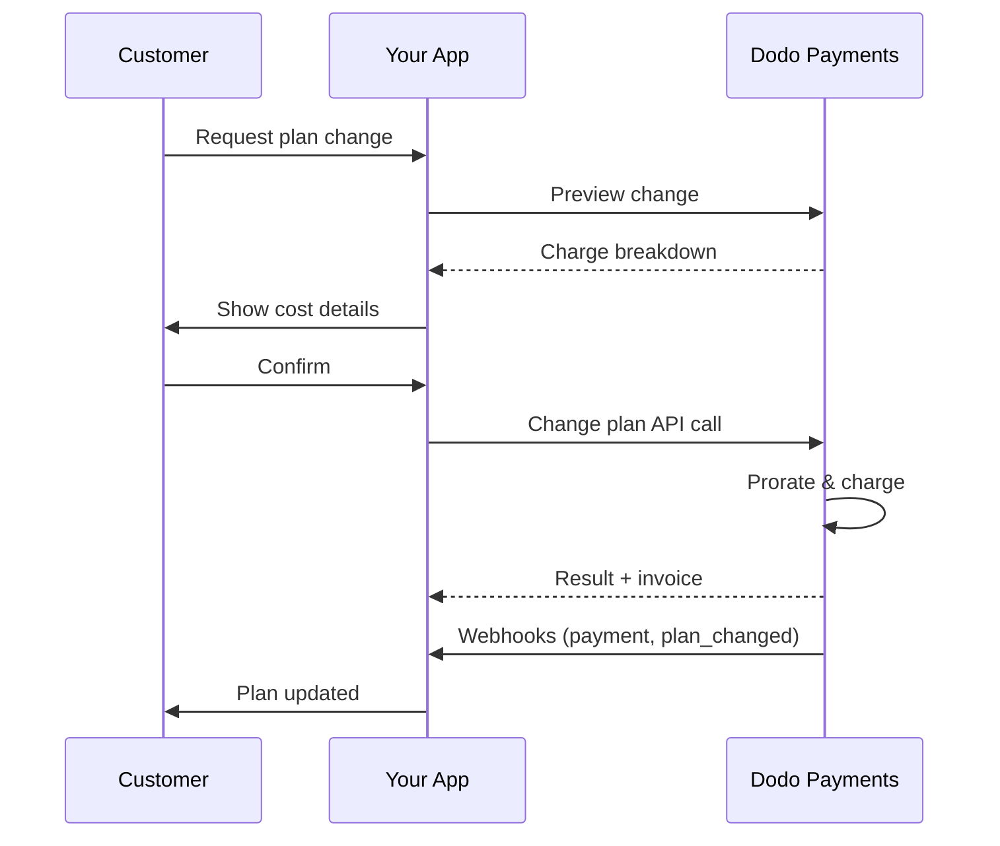
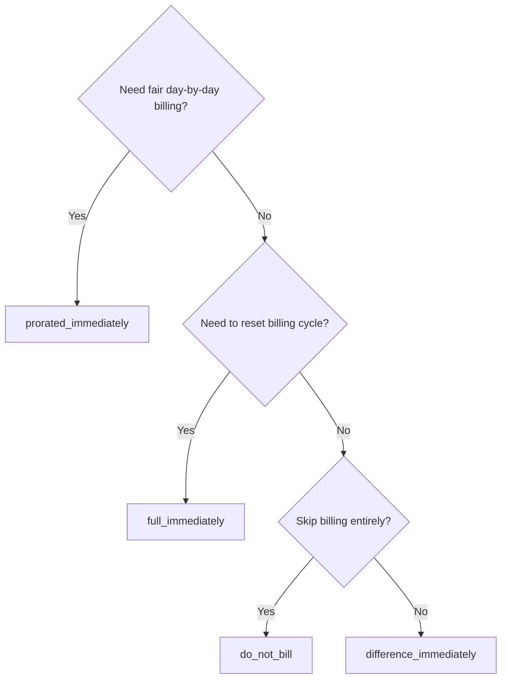
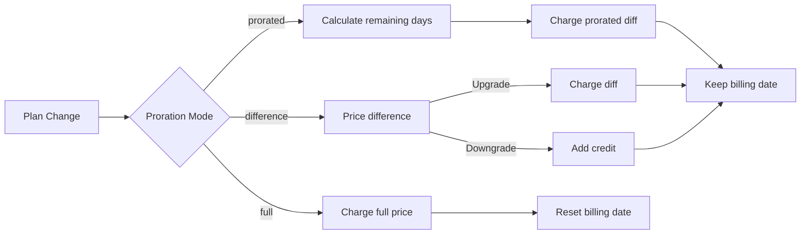

<CardGroup cols={3}>
<Card title="Change Plan API" icon="code" href="/api-reference/subscriptions/change-plan">
  Full API docs for updating subscriptions.
</Card>
<Card title="Plan Change Preview" icon="eye" href="/api-reference/subscriptions/preview-change-plan">
  See charge amounts before changing plans.
</Card>
<Card title="Integration Guide" icon="book" href="/developer-resources/subscription-integration-guide">
  Step-by-step subscription setup.
</Card>
</CardGroup>

## What is a subscription upgrade or downgrade?

Changing plans lets you move a customer between subscription tiers or quantities. Use it to:
- Align pricing with usage or features
- Move from monthly to annual (or vice versa)
- Adjust quantity for seat-based products

<Info>
Plan changes can trigger an immediate charge depending on the proration mode you choose.
</Info>

## When to use plan changes

- Upgrade when a customer needs more features, usage, or seats
- Downgrade when usage decreases
- Migrate users to a new product or price without cancelling their subscription

## Plan Change Flow



## Prerequisites

Before implementing subscription plan changes, ensure you have:

- A Dodo Payments merchant account with active subscription products
- API credentials (API key and webhook secret key) from the dashboard
- An existing active subscription to modify
- Webhook endpoint configured to handle subscription events

<Info>
For detailed setup instructions, see our [Integration Guide](/developer-resources/integration-guide#dashboard-setup).
</Info>

## Step-by-Step Implementation Guide

Follow this comprehensive guide to implement subscription plan changes in your application:

<Steps>
<Step title="Understand Plan Change Requirements">
Before implementing, determine:
- Which subscription products can be changed to which others
- What proration mode fits your business model
- How to handle failed plan changes gracefully
- Which webhook events to track for state management

<Tip>
Test plan changes thoroughly in test mode before implementing in production.
</Tip>
</Step>

<Step title="Choose Your Proration Strategy">
Select the billing approach that aligns with your business needs:

<Tabs>
<Tab title="prorated_immediately">
Best for: SaaS applications wanting to charge fairly for unused time
- Calculates exact prorated amount based on remaining cycle time
- Charges a prorated amount based on unused time remaining in the cycle
- Provides transparent billing to customers
</Tab>

<Tab title="difference_immediately">
Best for: Clear upgrade/downgrade scenarios
- Upgrade: Charge immediate difference (e.g., $30→$80 = charge $50)
- Downgrade: Credit remaining value for future renewals
- Simplifies billing logic and customer communication
</Tab>

<Tab title="full_immediately">
सर्वोत्तम के लिए: जब आप बिलिंग चक्र रीसेट करना चाहते हैं
- नए प्लान की पूरी राशि तुरंत चार्ज की जाती है
- पुराने प्लान का शेष समय नजरअंदाज किया जाता है
- वार्षिक से मासिक ट्रांज़िशन के लिए उपयोगी
</Tab>

{/* LOCKED_PATTERN_7fa7f81fc66b83c441dd56aff76d586c */}
सर्वोत्तम के लिए: मुफ़्त प्रवास, शिष्टाचार स्विच, या लागत अंतर को अवशोषित करना
- कोई चार्ज या क्रेडिट की गणना नहीं की जाती है
- ग्राहक तुरंत नए प्लान पर चला जाता है बिना किसी बिलिंग समायोजन के
- बिलिंग चक्र अपरिवर्तित रहता है
</Tab>
</Tabs>
</Step>

<Step title="Implement the Change Plan API">
सब्सक्रिप्शन विवरण संशोधित करने के लिए Change Plan API का उपयोग करें:

<ParamField path="subscription_id" type="string" required>
संशोधित करने के लिए सक्रिय सदस्यता का ID.
</ParamField>

<ParamField path="product_id" type="string" required>
नई उत्पाद ID जिससे सदस्यता में परिवर्तन करना है।
</ParamField>

<ParamField path="quantity" type="integer" default="1">
नए प्लान के लिए इकाइयों की संख्या (सीट-आधारित उत्पादों के लिए)।
</ParamField>

<ParamField path="proration_billing_mode" type="string" required>
तुरंत बिलिंग कैसे संभालें: `prorated_immediately`, `full_immediately`, `difference_immediately` या `do_not_bill`.
</ParamField>

<ParamField path="addons" type="array">
नए प्लान के लिए विकल्पीय ऐडऑन। इसे खाली छोड़ने का अर्थ है मौजूदा ऐडऑन को हटा देना।
</ParamField>

<ParamField path="on_payment_failure" type="string">
योजना परिवर्तन भुगतान विफल होने पर व्यवहार नियंत्रित करता है:
- `prevent_change`: भुगतान सफल होने तक वर्तमान योजना पर सदस्यता रखें
- `apply_change` (डिफ़ॉल्ट): भुगतान परिणाम की परवाह किए बिना योजना परिवर्तन को तुरंत लागू करें

यदि निर्दिष्ट नहीं किया गया है, तो व्यापार-स्तरीय डिफ़ॉल्ट सेटिंग का उपयोग करता है।
</ParamField>

<ParamField path="discount_code" type="string">
नए प्लान पर लागू करने के लिए विकल्पीय डिस्काउंट कोड। यदि प्रदान किया गया है, तो योजना परिवर्तन पर छूट की वैधता और उसे लागू करता है। यदि प्रदान नहीं किया गया है और सदस्यता में पहले से ही `preserve_on_plan_change=true` के साथ मौजूदा छूट है, तो मौजूदा छूट संरक्षित रहेगी (यदि नए उत्पाद पर लागू हो)।
</ParamField>
</Step>

<Step title="Handle Webhook Events">
योजना परिवर्तन परिणामों को ट्रैक करने के लिए वेबहुक हैंडलिंग सेट करें:

- `subscription.active`: योजना परिवर्तन सफल, सदस्यता अपडेट की गई
- `subscription.plan_changed`: सदस्यता योजना में बदलाव किया गया (अपग्रेड/डाउनग्रेड/ऐडऑन अपडेट)
- `subscription.on_hold`: योजना परिवर्तन चार्ज विफल हुआ, सदस्यता रुका हुआ
- `payment.succeeded`: योजना परिवर्तन के लिए तुरंत चार्ज सफल
- `payment.failed`: तुरंत चार्ज विफल हुआ

<Warning>
हमेशा वेबहुक हस्ताक्षर सत्यापित करें और इडेम्पोटेंट इवेंट प्रोसेसिंग लागू करें।
</Warning>
</Step>

<Step title="Update Your Application State">
वेबहुक इवेंट्स के आधार पर, अपने एप्लिकेशन को अपडेट करें:
- नई योजना के आधार पर सुविधाएँ दें/रद्द करें
- ग्राहक डैशबोर्ड को नई योजना विवरण के साथ अपडेट करें
- योजना परिवर्तनों के बारे में पुष्टिकरण ईमेल भेजें
- ऑडिट उद्देश्यों के लिए बिलिंग परिवर्तन लॉग करें
</Step>

<Step title="Test and Monitor">
अपनी कार्यान्वयन को पूरी तरह से परीक्षण करें:
- विभिन्न परिदृश्यों के साथ सभी प्रोराटा मोड का परीक्षण करें
- सत्यापित करें वेबहुक हैंडलिंग सही से काम करती है
- योजना परिवर्तन सफलता दर की निगरानी करें
- असफल योजना परिवर्तनों के लिए अलर्ट सेट करें

<Check>
आपके सदस्यता योजना परिवर्तन कार्यान्वयन अब उत्पादन उपयोग के लिए तैयार हैं।
</Check>
</Step>
</Steps>

## योजना परिवर्तन का पूर्वावलोकन करें

एक योजना परिवर्तन करने से पहले, पूर्वावलोकन API का उपयोग करें ताकि ग्राहक ठीक से देख सकें कि उनसे कितना शुल्क लिया जाएगा:

<Tabs>
<Tab title="Node.js SDK">

```javascript
const preview = await client.subscriptions.previewChangePlan('sub_123', {
  product_id: 'prod_pro',
  quantity: 1,
  proration_billing_mode: 'prorated_immediately'
});

// Show customer the charge before confirming
console.log('Immediate charge:', preview.immediate_charge.summary);
console.log('New plan details:', preview.new_plan);
```

</Tab>

<Tab title="Python SDK">

```python
preview = client.subscriptions.preview_change_plan(
    subscription_id="sub_123",
    product_id="prod_pro",
    quantity=1,
    proration_billing_mode="prorated_immediately"
)

# Show customer the charge before confirming
print("Immediate charge:", preview.immediate_charge.summary)
print("New plan details:", preview.new_plan)
```

</Tab>
</Tabs>

<Tip>
पूर्वावलोकन API का उपयोग करें, पुष्टि संवादों को बनाने के लिए जो ग्राहकों को दिखाते हैं कि वे कितना भुगतान करेंगे, इससे पहले कि वे योजना परिवर्तन की पुष्टि करें।
</Tip>

## योजना API बदलें

एक सक्रिय सदस्यता के लिए उत्पाद, मात्रा, और प्रोराटा व्यवहार को संशोधित करने के लिए योजना API बदलें का उपयोग करें।

### त्वरित प्रारंभ उदाहरण

<Tabs>
  <Tab title="Node.js SDK">

    ```javascript
    import DodoPayments from 'dodopayments';

    const client = new DodoPayments({
      bearerToken: process.env.DODO_PAYMENTS_API_KEY,
      environment: 'test_mode', // defaults to 'live_mode'
    });

    async function changePlan() {
      const result = await client.subscriptions.changePlan('sub_123', {
        product_id: 'prod_new',
        quantity: 3,
        proration_billing_mode: 'prorated_immediately',
        on_payment_failure: 'prevent_change', // Optional: control behavior on payment failure
      });
      console.log(result.status, result.invoice_id, result.payment_id);
    }

    changePlan();
    ```

  </Tab>
  <Tab title="Python SDK">

    ```python
    import os
    from dodopayments import DodoPayments

    client = DodoPayments(
        bearer_token=os.environ.get("DODO_PAYMENTS_API_KEY"),
        environment="test_mode",  # defaults to "live_mode"
    )

    result = client.subscriptions.change_plan(
        subscription_id="sub_123",
        product_id="prod_new",
        quantity=3,
        proration_billing_mode="prorated_immediately",
        on_payment_failure="prevent_change",  # Optional: control behavior on payment failure
    )
    print(result.status, result.get("invoice_id"), result.get("payment_id"))
    ```

  </Tab>
  <Tab title="Go SDK">

    ```go
    package main

    import (
      "context"
      "fmt"
      "github.com/dodopayments/dodopayments-go"
      "github.com/dodopayments/dodopayments-go/option"
    )

    func main() {
      client := dodopayments.NewClient(option.WithBearerToken("YOUR_TOKEN"))
      res, err := client.Subscriptions.ChangePlan(context.TODO(), dodopayments.SubscriptionChangePlanParams{
        SubscriptionID: dodopayments.F("sub_123"),
        ProductID:             dodopayments.F("prod_new"),
        Quantity:              dodopayments.F(int64(3)),
        ProrationBillingMode:  dodopayments.F(dodopayments.SubscriptionChangePlanParamsProrationBillingModeProratedImmediately),
        OnPaymentFailure:      dodopayments.F(dodopayments.OnPaymentFailurePreventChange), // Optional
      })
      if err != nil { panic(err) }
      fmt.Println(res.Status, res.InvoiceID, res.PaymentID)
    }
    ```

  </Tab>
  <Tab title="HTTP">

    ```bash
    curl -X POST "$DODO_API_BASE/subscriptions/sub_123/change-plan" \
      -H "Authorization: Bearer $DODO_PAYMENTS_API_KEY" \
      -H "Content-Type: application/json" \
      -d '{
        "product_id": "prod_new",
        "quantity": 3,
        "proration_billing_mode": "prorated_immediately",
        "on_payment_failure": "prevent_change"
      }'
    ```

  </Tab>
</Tabs>

```json Success
{
  "status": "processing",
  "subscription_id": "sub_123",
  "invoice_id": "inv_789",
  "payment_id": "pay_456",
  "proration_billing_mode": "prorated_immediately"
}
```

<Note>
<code>invoice_id</code> और <code>payment_id</code> जैसे फ़ील्ड केवल तभी रिटर्न होते हैं जब तुरंत चार्ज और/या चालान बनता है प्लान परिवर्तन के दौरान। परिणामों की पुष्टि के लिए हमेशा वेबहुक इवेंट्स (जैसे, <code>payment.succeeded</code>, <code>subscription.plan_changed</code>) पर भरोसा करें।
</Note>

<Warning>
यदि तुरंत चार्ज विफल होता है, तो सदस्यता `subscription.on_hold` पर जा सकती है जब तक भुगतान सफल न हो जाए।
</Warning>

## ऐडऑन प्रबंधित करना

जब सदस्यता योजनाओं को बदलते हैं, तो आप ऐडऑन भी बदल सकते हैं:

```javascript
// Add addons to the new plan
await client.subscriptions.changePlan('sub_123', {
  product_id: 'prod_new',
  quantity: 1,
  proration_billing_mode: 'difference_immediately',
  addons: [
    { addon_id: 'addon_123', quantity: 2 }
  ]
});

// Remove all existing addons
await client.subscriptions.changePlan('sub_123', {
  product_id: 'prod_new',
  quantity: 1,
  proration_billing_mode: 'difference_immediately',
  addons: [] // Empty array removes all existing addons
});
```

<Info>
ऐडऑन प्रोराटा गणना में शामिल होते हैं और चयनित प्रोराटा मोड के अनुसार चार्ज किए जाएंगे।
</Info>

## छूट कोड लागू करना

आप सदस्यता योजनाओं को बदलते समय एक छूट कोड लागू कर सकते हैं। यह उन्नयन या प्रवास पर प्रमोशनल मूल्य निर्धारण की पेशकश करने के लिए उपयोगी है।

<Tabs>
<Tab title="Node.js SDK">

```javascript
// Apply a discount code during plan change
await client.subscriptions.changePlan('sub_123', {
  product_id: 'prod_pro',
  quantity: 1,
  proration_billing_mode: 'prorated_immediately',
  discount_code: 'UPGRADE20'
});
```

</Tab>
<Tab title="Python SDK">

```python
# Apply a discount code during plan change
client.subscriptions.change_plan(
    subscription_id="sub_123",
    product_id="prod_pro",
    quantity=1,
    proration_billing_mode="prorated_immediately",
    discount_code="UPGRADE20"
)
```

</Tab>
<Tab title="HTTP">

```bash
curl -X POST "$DODO_API_BASE/subscriptions/sub_123/change-plan" \
  -H "Authorization: Bearer $DODO_PAYMENTS_API_KEY" \
  -H "Content-Type: application/json" \
  -d '{
    "product_id": "prod_pro",
    "quantity": 1,
    "proration_billing_mode": "prorated_immediately",
    "discount_code": "UPGRADE20"
  }'
```

</Tab>
</Tabs>

### योजना परिवर्तन पर छूट व्यवहार

| परिदृश्य | व्यवहार |
|----------|----------|
| `discount_code` प्रदान किया गया | नए प्लान पर छूट की वैधता और इसे लागू करता है। |
| कोई कोड प्रदान नहीं किया गया, मौजूदा छूट के साथ `preserve_on_plan_change=true` | मौजूदा छूट अपने आप संरक्षित होती है यदि यह नए उत्पाद पर लागू हो। |
| कोई कोड प्रदान नहीं किया गया, कोई संरक्षित छूट नहीं | नए प्लान पर कोई छूट लागू नहीं होती है। |

<Tip>
[पूर्वावलोकन योजना परिवर्तन API](/api-reference/subscriptions/preview-change-plan) का उपयोग करें एक `discount_code` के साथ, ग्राहकों को ठीक से दिखाएँ कि वे कितना बचाएंगे इससे पहले कि वे योजना परिवर्तन की पुष्टि करें।
</Tip>

## प्रोराटा मोड

ग्राहक को बिल कैसे दिये जाए जब योजनाएँ बदलें:

#### `prorated_immediately`
- वर्तमान चक्र में आंशिक अंतर के लिए चार्ज करता है
- यदि परीक्षण में है, तुरंत चार्ज करता है और नई योजना पर अभी स्विच करता है
- डाउनग्रेड: भविष्य के नवीनीकरण पर लागू किया जा सकता है एक प्रोरटा क्रेडिट उत्पन्न कर सकता है

#### `full_immediately`
- तुरंत नए प्लान की पूरी राशि चार्ज करता है
- पुराने प्लान से शेष समय को नजरअंदाज करता है

<Info>
<code>difference_immediately</code> का उपयोग करके डाउनग्रेड द्वारा बनाए गए क्रेडिट सब्सक्रिप्शन-स्कोप्ड होते हैं और <a href="/features/credit-based-billing">क्रेडिट-आधारित बिलिंग</a> में शामिल अधिकारों से भिन्न होते हैं। वे अपने आप उसी सदस्यता के भविष्य के नवीनीकरण पर लागू होते हैं और सदस्यताओं के बीच हस्तांतरणीय नहीं होते।
</Info>

#### `difference_immediately`
- उन्नयन: तत्काल पुराने और नए योजनाओं के बीच मूल्य अंतर चार्ज करता है
- डाउनग्रेड: बचे हुए मूल्य को सब्सक्रिप्शन में आंतरिक क्रेडिट के रूप में जोड़ता है और नवीनीकरण पर स्वचालित रूप से लागू करता है

#### `do_not_bill`
- कोई चार्ज या क्रेडिट की गणना नहीं की जाती है
- ग्राहक तुरंत नए प्लान पर चला जाता है बिना किसी बिलिंग समायोजन के
- बिलिंग चक्र अपरिवर्तित रहता है
- अनुग्रह प्रवास, मुफ्त योजना स्विच, या लागत अंतर अवशोषित करना के लिए सर्वोत्तम

| सुविधा | `prorated_immediately` | `difference_immediately` | `full_immediately` | `do_not_bill` |
|---------|----------------------|------------------------|-------------------|--------------|
| **उन्नयन शुल्क** | शेष दिनों का प्रोरटा अंतर | योजनाओं के बीच पूर्ण मूल्य अंतर | नया प्लान पूर्ण मूल्य | कोई शुल्क नहीं |
| **डाउनग्रेड क्रेडिट** | शेष दिनों के लिए प्रोरटा क्रेडिट | क्रेडिट के रूप में पूर्ण मूल्य अंतर | कोई क्रेडिट नहीं | कोई क्रेडिट नहीं |
| **बिलिंग चक्र** | अपरिवर्तित | अपरिवर्तित | आज से रीसेट | अपरिवर्तित |
| **परीक्षण व्यवहार** | परीक्षण समाप्त होता है, तुरंत शुल्क लागू होता है | परीक्षण समाप्त होता है, तुरंत शुल्क लागू होता है | परीक्षण समाप्त होता है, पूर्ण राशि चार्ज करता है | परीक्षण समाप्त होता है, कोई शुल्क नहीं |
| **के लिए सर्वोत्तम** | निष्पक्ष समय-आधारित बिलिंग | सरल अपग्रेड/डाउनग्रेड गणित | बिलिंग चक्र रीसेट करना | मुफ्त प्रवास या शिष्टाचार स्विच |
| **जटिलता** | मध्यम (दिन की गणना) | कम (सरल घटाव) | कम (पूरा चार्ज) | कोई नहीं |



### उदाहरण परिदृश्य

इन सरल नंबरों का लगातार उपयोग करें:
- वर्तमान योजना: **बेसिक** **$30/माह** पर
- उन्नयन लक्ष्य: **प्रो** **$80/माह** पर
- डाउनग्रेड लक्ष्य (प्रो से): **स्टार्टर** **$20/माह** पर
- बिलिंग चक्र: **30 दिन**, **जनवरी 1** को शुरू हुआ
- योजना परिवर्तन **जनवरी 16** को होता है (15 दिन बाकी, 15 दिन उपयोग किए)

<AccordionGroup>
  <Accordion title="Upgrade: Basic ($30) → Pro ($80) with prorated_immediately">

    ```
    Step 1: Calculate unused credit from current plan
      Unused days = 15 out of 30 days
      Credit = $30 × (15/30) = $15.00

    Step 2: Calculate prorated cost of new plan
      Remaining days = 15 out of 30 days
      New plan cost = $80 × (15/30) = $40.00

    Step 3: Calculate immediate charge
      Charge = New plan cost − Credit
      Charge = $40.00 − $15.00 = $25.00

    → Customer pays $25.00 now
    → Next renewal (Feb 1): $80.00/month
    ```

    ```javascript
    await client.subscriptions.changePlan('sub_123', {
      product_id: 'prod_pro',
      quantity: 1,
      proration_billing_mode: 'prorated_immediately'
    })
    ```

  </Accordion>

  <Accordion title="Downgrade: Pro ($80) → Starter ($20) with prorated_immediately">

    ```
    Step 1: Calculate unused credit from current plan
      Unused days = 15 out of 30 days
      Credit = $80 × (15/30) = $40.00

    Step 2: Calculate prorated cost of new plan
      Remaining days = 15 out of 30 days
      New plan cost = $20 × (15/30) = $10.00

    Step 3: Calculate credit balance
      Credit = $40.00 − $10.00 = $30.00

    → No charge — $30.00 credit added to subscription
    → Credit auto-applies to future renewals
    → Next renewal (Feb 1): $20.00 − $30.00 credit = $0.00
    → Following renewal (Mar 1): $20.00 − $10.00 remaining credit = $10.00
    ```

    ```javascript
    await client.subscriptions.changePlan('sub_123', {
      product_id: 'prod_starter',
      quantity: 1,
      proration_billing_mode: 'prorated_immediately'
    })
    ```

  </Accordion>

  <Accordion title="Upgrade: Basic ($30) → Pro ($80) with difference_immediately">

    ```
    Immediate charge = New plan price − Old plan price
                     = $80 − $30
                     = $50.00

    → Customer pays $50.00 now (regardless of cycle position)
    → Next renewal (Feb 1): $80.00/month
    ```

    ```javascript
    await client.subscriptions.changePlan('sub_123', {
      product_id: 'prod_pro',
      quantity: 1,
      proration_billing_mode: 'difference_immediately'
    })
    ```

  </Accordion>

  <Accordion title="Downgrade: Pro ($80) → Starter ($20) with difference_immediately">

    ```
    Credit = Old plan price − New plan price
           = $80 − $20
           = $60.00

    → No charge — $60.00 credit added to subscription
    → Credit auto-applies to future renewals
    → Next renewal: $20.00 − $20.00 (from credit) = $0.00
    → Following renewal: $20.00 − $20.00 (from credit) = $0.00
    → Third renewal: $20.00 − $20.00 (from remaining credit) = $0.00
    ```

    ```javascript
    await client.subscriptions.changePlan('sub_123', {
      product_id: 'prod_starter',
      quantity: 1,
      proration_billing_mode: 'difference_immediately'
    })
    ```

  </Accordion>

  <Accordion title="Upgrade: Basic ($30) → Pro ($80) with full_immediately">

    ```
    Immediate charge = Full new plan price = $80.00

    → Customer pays $80.00 now
    → No credit for unused time on old plan
    → Billing cycle resets to today (January 16)
    → Next renewal: February 16 at $80.00/month
    ```

    ```javascript
    await client.subscriptions.changePlan('sub_123', {
      product_id: 'prod_pro',
      quantity: 1,
      proration_billing_mode: 'full_immediately'
    })
    ```

  </Accordion>

  <Accordion title="Mid-cycle upgrade with add-ons using prorated_immediately">

    ```
    Current: Basic plan ($30/month), no add-ons
    New: Pro plan ($80/month) + Extra Seats add-on ($10/seat × 3 seats = $30/month)
    Change on day 16 of 30 (15 days remaining)

    Step 1: Credit from current plan
      Credit = $30 × (15/30) = $15.00

    Step 2: Prorated cost of new plan + add-ons
      New plan = $80 × (15/30) = $40.00
      Add-ons = $30 × (15/30) = $15.00
      Total new = $55.00

    Step 3: Immediate charge
      Charge = $55.00 − $15.00 = $40.00

    → Customer pays $40.00 now
    → Next renewal: $80.00 + $30.00 = $110.00/month
    ```

    ```javascript
    await client.subscriptions.changePlan('sub_123', {
      product_id: 'prod_pro',
      quantity: 1,
      proration_billing_mode: 'prorated_immediately',
      addons: [
        { addon_id: 'addon_seats', quantity: 3 }
      ]
    })
    ```

  </Accordion>
</AccordionGroup>

### प्रत्येक मोड कैसे बिलिंग को प्रोसेस करता है



<Tip>
निष्पक्ष-समय लेखांकन के लिए `prorated_immediately` चुनें; बिलिंग को फिर से शुरू करने के लिए `full_immediately` चुनें; सरल अपग्रेड्स और डाउनग्रेड्स पर स्वचालित क्रेडिट के लिए `difference_immediately` का उपयोग करें; या किसी भी बिलिंग समायोजन के बिना योजनाओं को स्विच करने के लिए `do_not_bill` का उपयोग करें।
</Tip>

## भुगतान विफलताएं कैसे संभालें

`on_payment_failure` पैरामीटर का उपयोग करके, योजना परिवर्तन भुगतान विफलताओं की स्थिति में क्या करना होगा नियंत्रण करें।

### भुगतान विफलता मोड

<Tabs>
<Tab title="prevent_change (Recommended for critical upgrades)">
**व्यवहार**: जब तक भुगतान सफल न हो जाए सदस्यता को वर्तमान योजना पर रखें।

- योजना परिवर्तन को "लंबित" के रूप में चिह्नित किया गया है
- ग्राहक अपने वर्तमान योजना तक पहुंच बनाए रखता है
- सफल भुगतान के बाद ही सदस्यता `active` स्थिति में जाती है
- उन्नत सुविधाओं को अनुमत करने से पहले भुगतान सुनिश्चित करने के लिए उपयोगी

```javascript
await client.subscriptions.changePlan('sub_123', {
  product_id: 'prod_pro',
  quantity: 1,
  proration_billing_mode: 'prorated_immediately',
  on_payment_failure: 'prevent_change'
});
```

</Tab>

<Tab title="apply_change (Default)">
**व्यवहार**: भुगतान परिणाम की परवाह किए बिना योजना परिवर्तन तुरंत लागू करें।

- योजना परिवर्तन भुगतान विफल होने पर भी लागू होता है
- ग्राहक को नई योजना तक तुरंत पहुंच मिलती है
- भुगतान विफल होने पर सदस्यता `on_hold` पर जा सकती है
- गैर-महत्वपूर्ण उन्नयन के लिए अच्छा है या जब आप ग्राहक पर भरोसा करते हैं

```javascript
await client.subscriptions.changePlan('sub_123', {
  product_id: 'prod_pro',
  quantity: 1,
  proration_billing_mode: 'prorated_immediately',
  on_payment_failure: 'apply_change' // This is the default
});
```

</Tab>
</Tabs>

<Info>
यदि निर्दिष्ट नहीं किया गया है, तो `on_payment_failure` पैरामीटर आपके डैशबोर्ड में कॉन्फ़िगर किए गए व्यवसाय-स्तरीय डिफ़ॉल्ट सेटिंग का उपयोग करता है।
</Info>

### प्रत्येक मोड का उपयोग कब करें

| परिदृश्य | अनुशंसित मोड | कारण |
|----------|------------------|--------|
| प्रीमियम सुविधाओं में अपग्रेडिंग | `prevent_change` | पहुंच देने से पहले भुगतान सुनिश्चित करना |
| मात्रा वृद्धि (अधिक सीटें) | `prevent_change` | भुगतान के बिना उपयोग को रोकना |
| योजनाएं डाउनग्रेड करना | `apply_change` | ग्राहक व्यय घटा रहा है |
| भरोसेमंद एंटरप्राइज़ ग्राहक | `apply_change` | गैर-भुगतान का जोखिम कम है |
| परीक्षण से भुगतान में परिवर्तन | `prevent_change` | महत्वपूर्ण भुगतान क्षण |

## वेबहुक कैसे संभालें

योजना परिवर्तन और भुगतानों की पुष्टि करने के लिए वेबहुक के माध्यम से सदस्यता स्थिति का पालन करें।

### संभालने के लिए इवेंट प्रकार
- `subscription.active`: सदस्यता सक्रिय
- `subscription.plan_changed`: सदस्यता योजना बदल गई (अपग्रेड/डाउनग्रेड/ऐडऑन परिवर्तन)
- `subscription.on_hold`: चार्ज विफल हुआ, सदस्यता रुका हुआ
- `subscription.renewed`: नवीनीकरण सफल हुआ
- `payment.succeeded`: योजना परिवर्तन या नवीनीकरण के लिए भुगतान सफल
- `payment.failed`: भुगतान विफल

<Info>
हम सदस्यता इवेंट्स से व्यावसायिक तर्क को चलाने की सिफारिश करते हैं और पुष्टि और समन्वय के लिए भुगतान इवेंट्स का उपयोग करते हैं।
</Info>

### हस्ताक्षरों की पुष्टि करें और इंटेंट्स हैंडल करें

<Tabs>
  <Tab title="Next.js Route Handler">

    ```javascript
    import { NextRequest, NextResponse } from 'next/server';
    
    export async function POST(req) {
      const webhookId = req.headers.get('webhook-id');
      const webhookSignature = req.headers.get('webhook-signature');
      const webhookTimestamp = req.headers.get('webhook-timestamp');
      const secret = process.env.DODO_WEBHOOK_SECRET;
    
      const payload = await req.text();
      // verifySignature is a placeholder – in production, use a Standard Webhooks library
      const { valid, event } = await verifySignature(
        payload,
        { id: webhookId, signature: webhookSignature, timestamp: webhookTimestamp },
        secret
      );
      if (!valid) return NextResponse.json({ error: 'Invalid signature' }, { status: 400 });
    
      switch (event.type) {
        case 'subscription.active':
          // mark subscription active in your DB
          break;
        case 'subscription.plan_changed':
          // refresh entitlements and reflect the new plan in your UI
          break;
        case 'subscription.on_hold':
          // notify user to update payment method
          break;
        case 'subscription.renewed':
          // extend access window
          break;
        case 'payment.succeeded':
          // reconcile payment for plan change
          break;
        case 'payment.failed':
          // log and alert
          break;
        default:
          // ignore unknown events
          break;
      }
    
      return NextResponse.json({ received: true });
    }
    ```

  </Tab>
  <Tab title="Express.js">

    ```javascript
    import express from 'express';
    
    const app = express();
    app.post('/webhooks/dodo', express.raw({ type: 'application/json' }), async (req, res) => {
      const webhookId = req.header('webhook-id');
      const webhookSignature = req.header('webhook-signature');
      const webhookTimestamp = req.header('webhook-timestamp');
      const secret = process.env.DODO_WEBHOOK_SECRET;
      const payload = req.body.toString('utf8');
    
      const { valid, event } = await verifySignature(
        payload,
        { id: webhookId, signature: webhookSignature, timestamp: webhookTimestamp },
        secret
      );
      if (!valid) return res.status(400).send('Invalid signature');
    
      // handle events like above
      res.json({ received: true });
    });
    
    app.listen(3000);
    ```

  </Tab>
</Tabs>

<Note>
विस्तृत payload schemas के लिए देखें <a href="/developer-resources/webhooks/intents/subscription">सदस्यता वेबहुक payloads</a> और <a href="/developer-resources/webhooks/intents/payment">भुगतान वेबहुक payloads</a>।
</Note>

## सर्वोत्तम प्रथाएं

विश्वसनीय सदस्यता योजना परिवर्तनों के लिए इन सिफारिशों का पालन करें:

### योजना परिवर्तन रणनीति
- **पूरी तरह से परीक्षण करें**: उत्पादन से पहले हमेशा टेस्ट मोड में योजना परिवर्तनों का परीक्षण करें
- **प्रोराटा का सावधानीपूर्वक चयन करें**: अपने व्यापार मॉडल के साथ संरेखित करने वाले प्रोराटा मोड का चयन करें
- **विफलताओं को ग्रेसफुली हैंडल करें**: उचित त्रुटि हैंडलिंग और पुन: प्रयास तर्क लागू करें
- **सफलता दर की निगरानी करें**: योजना परिवर्तन सफलता/विफलता दर को ट्रैक करें और मुद्दों की जांच करें

### वेबहुक कार्यान्वयन
- **हस्ताक्षरों को सत्यापित करें**: वेबहुक हस्ताक्षरों की प्रामाणिकता सुनिश्चित करने के लिए हमेशा जाँच करें
- **इडेम्पोटेंसी लागू करें**: डुप्लिकेट वेबहुक इवेंट्स को ग्रेसफुली संभालें
- **अ

सिंक्रोनस रूप से प्रक्रिया करें**: भारी ऑपरेशनों के साथ वेबहुक प्रतिक्रियाओं को अवरोधित न करें
- **सब कुछ लॉग करें**: डीबगिंग और ऑडिट उद्देश्यों के लिए विस्तृत लॉग बनाए रखें

### उपयोगकर्ता अनुभव
- **स्पष्ट रूप से संवाद करें**: ग्राहकों को बिलिंग परिवर्तनों और समय के बारे में सूचित करें
- **पुष्टिकरण प्रदान करें**: सफल योजना परिवर्तनों के लिए ईमेल पुष्टिकरण भेजें
- **एज मामलों को संभालें**: परीक्षण अवधि, प्रोराटा, और विफल भुगतान को ध्यान में रखें
- **UI तुरंत अपडेट करें**: अपने अनुप्रयोग इंटरफ़ेस में योजना परिवर्तनों को दर्शाएं

## सामान्य समस्याएं और समाधान

सदस्यता योजना परिवर्तनों के दौरान आमतौर पर मिलने वाले समस्याओं का समाधान करें:

<AccordionGroup>
<Accordion title="Charge created but subscription not updated">
**लक्षण**: API कॉल सफल होता है, लेकिन सदस्यता पुरानी योजना पर बनी रहती है

**सामान्य कारण**:
- वेबहुक प्रोसेसिंग विफल या विलंबित हो गई
- वेबहुक प्राप्त करने के बाद अनुप्रयोग स्थिति को अपडेट नहीं किया गया
- स्थिति अपडेट के दौरान डेटाबेस लेन-देन समस्याएं

**समाधान**:
- रिट्री तर्क के साथ मजबूत वेबहुक हैंडलिंग लागू करें
- स्थिति अपडेट के लिए इडेम्पोटेंट ऑपरेशनों का उपयोग करें
- स्किप वेबहुक इवेंट्स पर निगरानी जोड़े और चेतावनी प्राप्त करें
- वेबहुक एंडपॉइंट की पहुँच की जांच करें और सुनिश्चित करें कि यह सही से प्रतिक्रिया दे रहा है
</Accordion>

<Accordion title="Credits not applied after downgrade">
**लक्षण**: ग्राहक डाउनग्रेड करता है, लेकिन क्रेडिट बैलेंस नहीं देखता

**सामान्य कारण**:
- प्रोराटा मोड अपेक्षाएँ: डाउनग्रेड्स पूर्ण योजना मूल्य अंतर को `difference_immediately` के साथ क्रेडिट करते हैं, जबकि `prorated_immediately` चक्र में शेष समय के आधार पर एक प्रोरटा क्रेडिट बनाता है
- क्रेडिट्स सब्सक्रिप्शन-विशिष्ट होते हैं और सब्सक्रिप्शनों के बीच स्थानांतरित नहीं होते
- ग्राहक डैशबोर्ड में क्रेडिट बैलेंस दिखाई नहीं देता

**समाधान**:
- जब आप स्वचालित क्रेडिट चाहते हैं, तो डाउनग्रेड्स के लिए `difference_immediately` का उपयोग करें
- ग्राहकों को समझाएं कि क्रेडिट्स उसी सब्सक्रिप्शन के भविष्य के नवीनीकरण पर लागू होते हैं
- क्रेडिट बैलेंस प्रदर्शित करने के लिए ग्राहक पोर्टल लागू करें
- अगला चालान पूर्वावलोकन जांचें कि कितने क्रेडिट लागू हुए
</Accordion>

<Accordion title="Webhook signature verification fails">
**लक्षण**: वेबहुक इवेंट्स को अमान्य हस्ताक्षर के कारण अस्वीकार कर दिया गया

**सामान्य कारण**:
- गलत वेबहुक गुप्त कुंजी
- हस्ताक्षर सत्यापन से पहले कच्चा अनुरोध निकाय संशोधित किया गया
- गलत हस्ताक्षर सत्यापन एल्गोरिथ्म

**समाधान**:
- सुनिश्चित करें कि आप सही `DODO_WEBHOOK_SECRET` का उपयोग कर रहे हैं जो डैशबोर्ड में उपलब्ध है
- किसी भी JSON पार्सिंग मिडलवेयर से पहले कच्चा अनुरोध निकाय पढ़ें
- अपने प्लेटफॉर्म के लिए मानक वेबहुक सत्यापन लाइब्रेरी का उपयोग करें
- विकास पर्यावरण में वेबहुक हस्ताक्षर सत्यापन का परीक्षण करें
</Accordion>

<Accordion title="Plan change fails with 422 error">
**लक्षण**: API 422 Unprocessable Entity त्रुटि लौटाता है

**सामान्य कारण**:
- अमान्य सदस्यता ID या उत्पाद ID
- सदस्यता सक्रिय स्थिति में नहीं है
- आवश्यक पैरामीटर गायब हैं
- उत्पाद योजना परिवर्तनों के लिए उपलब्ध नहीं है

**समाधान**:
- सुनिश्चित करें कि सदस्यता मौजूद है और सक्रिय है
- जाँच करें कि उत्पाद ID मान्य है और उपलब्ध है
- यह सुनिश्चित करें कि सभी आवश्यक पैरामीटर प्रदान किए गए हैं
- पैरामीटर आवश्यकताओं के लिए API दस्तावेज़ की समीक्षा करें
</Accordion>

<Accordion title="Immediate charge fails during plan change">
**लक्षण**: योजना परिवर्तन शुरू होता है लेकिन तुरंत चार्ज विफल होता है

**सामान्य कारण**:
- ग्राहक के भुगतान विधि पर अपर्याप्त धन
- भुगतान विधि की समय सीमा समाप्त हो गई है या अमान्य है
- बैंक ने लेन-देन को अस्वीकार कर दिया
- धोखाधड़ी का पता लगाने से चार्ज ब्लॉक हुआ

**समाधान**:
- उचित रूप से `payment.failed` वेबहुक इवेंट्स को हैंडल करें
- ग्राहक को भुगतान विधि अपडेट करने के लिए सूचित करें
- अस्थायी विफलताओं के लिए पुन: प्रयास तर्क लागू करें
- असफल तुरंत चार्ज के साथ योजना परिवर्तनों की अनुमति देने पर विचार करें
</Accordion>

<Accordion title="Subscription on hold after plan change">
**लक्षण**: योजना परिवर्तन चार्ज विफल होता है और सदस्यता `on_hold` स्थिति में जाती है

**क्या होता है**:
जब योजना परिवर्तन चार्ज विफल होता है, तो सदस्यता स्वचालित रूप से `on_hold` स्थिति में जाती है। सदस्यता स्वचालित रूप से नवीनीकरण नहीं करेगी जब तक भुगतान विधि अपडेट नहीं की जाती।

**समाधान**: सदस्यता को पुनः सक्रिय करने के लिए भुगतान विधि अपडेट करें

एक विफल योजना परिवर्तन के बाद `on_hold` स्थिति से सदस्यता को पुनः सक्रिय करने के लिए:

1. **भुगतान विधि अपडेट करें** Update Payment Method API का उपयोग करके
2. **स्वचालित चार्ज निर्माण**: एपीआई शेष देयताओं के लिए स्वचालित रूप से चार्ज बनाता है
3. **चालान निर्माण**: चार्ज के लिए एक चालान तैयार किया जाता है
4. **भुगतान प्रोसेसिंग**: नई भुगतान विधि का उपयोग करके भुगतान प्र

ोसेस किया जाता है
5. **पुनर्सक्रियण**: सफल भुगतान पर, सदस्यता `active` स्थिति में पुन: सक्रिय हो जाती है

<CodeGroup>

```javascript Node.js
// Reactivate subscription from on_hold after failed plan change
async function reactivateAfterFailedPlanChange(subscriptionId) {
  // Update payment method - automatically creates charge for remaining dues
  const response = await client.subscriptions.updatePaymentMethod(subscriptionId, {
    type: 'new',
    return_url: 'https://example.com/return'
  });
  
  if (response.payment_id) {
    console.log('Charge created for remaining dues:', response.payment_id);
    console.log('Payment link:', response.payment_link);
    
    // Redirect customer to payment_link to complete payment
    // Monitor webhooks for:
    // 1. payment.succeeded - charge succeeded
    // 2. subscription.active - subscription reactivated
  }
  
  return response;
}

// Or use existing payment method if available
async function reactivateWithExistingPaymentMethod(subscriptionId, paymentMethodId) {
  const response = await client.subscriptions.updatePaymentMethod(subscriptionId, {
    type: 'existing',
    payment_method_id: paymentMethodId
  });
  
  // Monitor webhooks for payment.succeeded and subscription.active
  return response;
}
```

```python Python
# Reactivate subscription from on_hold after failed plan change
def reactivate_after_failed_plan_change(subscription_id):
    # Update payment method - automatically creates charge for remaining dues
    response = client.subscriptions.update_payment_method(
        subscription_id=subscription_id,
        type="new",
        return_url="https://example.com/return"
    )
    
    if response.payment_id:
        print("Charge created for remaining dues:", response.payment_id)
        print("Payment link:", response.payment_link)
        
        # Redirect customer to payment_link to complete payment
        # Monitor webhooks for:
        # 1. payment.succeeded - charge succeeded
        # 2. subscription.active - subscription reactivated
    
    return response

# Or use existing payment method if available
def reactivate_with_existing_payment_method(subscription_id, payment_method_id):
    response = client.subscriptions.update_payment_method(
        subscription_id=subscription_id,
        type="existing",
        payment_method_id=payment_method_id
    )
    
    # Monitor webhooks for payment.succeeded and subscription.active
    return response
```

</CodeGroup>

**वेबहुक इवेंट्स की निगरानी करें**:
- `subscription.on_hold`: सदस्यता होल्ड पर रखी गई (जब योजना परिवर्तन चार्ज विफल हो जाता है)
- `payment.succeeded`: शेष देयताओं के लिए भुगतान सफल (भुगतान विधि को अपडेट करने के बाद)
- `subscription.active`: सफल भुगतान के बाद सदस्यता पुनः सक्रिय

**सर्वोत्तम प्रथाएं**:
- जब योजना परिवर्तन चार्ज विफल हो जाता है, तो ग्राहकों को तुरंत सूचित करें
- उन्हें भुगतान विधि को अपडेट करने के लिए स्पष्ट निर्देश प्रदान करें
- पुनर्सक्रियण स्थिति को ट्रैक करने के लिए वेबहुक इवेंट्स की निगरानी करें
- अस्थाई भुगतान विफलताओं के लिए स्वचालित पुन: प्रयास तर्क लागू करने पर विचार करें

<Card title="Update Payment Method API Reference" icon="code" href="/api-reference/subscriptions/update-payment-method">
भुगतान विधियों को अपडेट करने और सदस्यताओं को पुनः सक्रिय करने के लिए पूरी API प्रलेखन देखें।
</Card>
</Accordion>
</AccordionGroup>

## अपनी कार्यान्वयन का परीक्षण करें

अपनी सदस्यता योजना परिवर्तन कार्यान्वयन का पूरी तरह से परीक्षण करने के लिए इन चरणों का पालन करें:

<Steps>
<Step title="Set up test environment">
- परीक्षण API कुंजी और परीक्षण उत्पादों का उपयोग करें
- विभिन्न योजना प्रकारों के साथ परीक्षण सदस्यताओं का निर्माण करें
- परीक्षण वेबहुक एंडपॉइंट कॉन्फ़िगर करें
- मॉनिटरिंग और लॉगिंग सेटअप करें
</Step>

<Step title="Test different proration modes">
- विभिन्न बिलिंग चक्र स्थानों के साथ `prorated_immediately` का परीक्षण करें
- उन्नयन और डाउनग्रेड्स के लिए `difference_immediately` का परीक्षण करें
- बिलिंग चक्र को रीसेट करने के लिए `full_immediately` का परीक्षण करें
- बिना चोरी/बिना क्रेडिट योजना स्विच के लिए `do_not_bill` का परीक्षण करें
- क्रेडिट गणना सही हैं यह सत्यापित करें
</Step>

<Step title="Test webhook handling">
- सभी संबंधित वेबहुक इवेंट्स प्राप्त होने की पुष्टि करें
- वेबहुक हस्ताक्षर सत्यापन का परीक्षण करें
- डुप्लिकेट वेबहुक इवेंट्स को ग्रेसफुली हैंडल करें
- वेबहुक प्रोसेसिंग विफलता परिदृश्यों का परीक्षण करें
</Step>

<Step title="Test error scenarios">
- अमान्य सदस्यता ID के साथ परीक्षण करें
- समाप्त भुगतान विधियों के साथ परीक्षण करें
- नेटवर्क विफलताओं और टाइमआउट्स के साथ परीक्षण करें
- अपर्याप्त धन के साथ परीक्षण करें
</Step>

<Step title="Monitor in production">
- असफल योजना परिवर्तनों के लिए अलर्ट सेट करें
- वेबहुक प्रोसेसिंग समय की निगरानी करें
- योजना परिवर्तन सफलता दर को ट्रैक करें
- ग्राहक समर्थन टिकट्स की समीक्षा करें योजना परिवर्तन समस्याओं के लिए
</Step>
</Steps>

## त्रुटि हैंडलिंग

अपने कार्यान्वयन में सामान्य API त्रुटियों को ग्रेसफुली हैंडल करें:

### HTTP स्थिति कोड

<AccordionGroup>
<Accordion title="200 OK">
योजना परिवर्तन अनुरोध सफलतापूर्वक संसाधित। सदस्यता अपडेट की जा रही है और भुगतान प्रोसेसिंग शुरू हो चुकी है।
{/* LOCKED_PATTERN_aae63d8bf6da4ac6fb501e13691e4d */}

<Accordion title="400 Bad Request">
अमान्य अनुरोध पैरामीटर। सुनिश्चित करें कि सभी आवश्यक फ़ील

्ड्स प्रदान किए गए हैं और सही तरीके से स्वरूपित हैं।
{/* LOCKED_PATTERN_aae63d8bf6da4ac6fb501e13691e4d */}

<Accordion title="401 Unauthorized">
अमान्य या गायब API कुंजी। सुनिश्चित करें कि आपका `DODO_PAYMENTS_API_KEY` सही है और सही अनुमतियाँ हैं।
{/* LOCKED_PATTERN_aae63d8bf6da4ac6fb501e13691e4d */}

<Accordion title="404 Not Found">
सदस्यता ID नहीं मिली या आपकी खाता से संबंधित नहीं है।
{/* LOCKED_PATTERN_aae63d8bf6da4ac6fb501e13691e4d */}

<Accordion title="422 Unprocessable Entity">
सदस्यता को बदला नहीं जा सकता (जैसे, पहले से ही रद्द की गई, उत्पाद उपलब्ध नहीं है, आदि)।
{/* LOCKED_PATTERN_aae63d8bf6da4ac6fb501e13691e4d */}

<Accordion title="500 Internal Server Error">
सर्वर त्रुटि हुई। थोड़े समय के बाद अनुरोध को पुनः प्रयास करें।
{/* LOCKED_PATTERN_aae63d8bf6da4ac6fb501e13691e4d */}
</AccordionGroup>

### त्रुटि प्रतिक्रिया प्रारूप

```json
{
  "error": {
    "code": "subscription_not_found",
    "message": "The subscription with ID 'sub_123' was not found",
    "details": {
      "subscription_id": "sub_123"
    }
  }
}
```

## अगले चरण

- <a href="/api-reference/subscriptions/change-plan">योजना API बदलें</a> की समीक्षा करें
- <a href="/features/credit-based-billing">क्रेडिट-आधारित बिलिंग</a> का पता लगाएं
- `subscription.on_hold` के लिए अलर्ट्स लागू करें
- हमारे <a href="/developer-resources/webhooks">वेबहुक एकीकरण गाइड</a> को देखें
