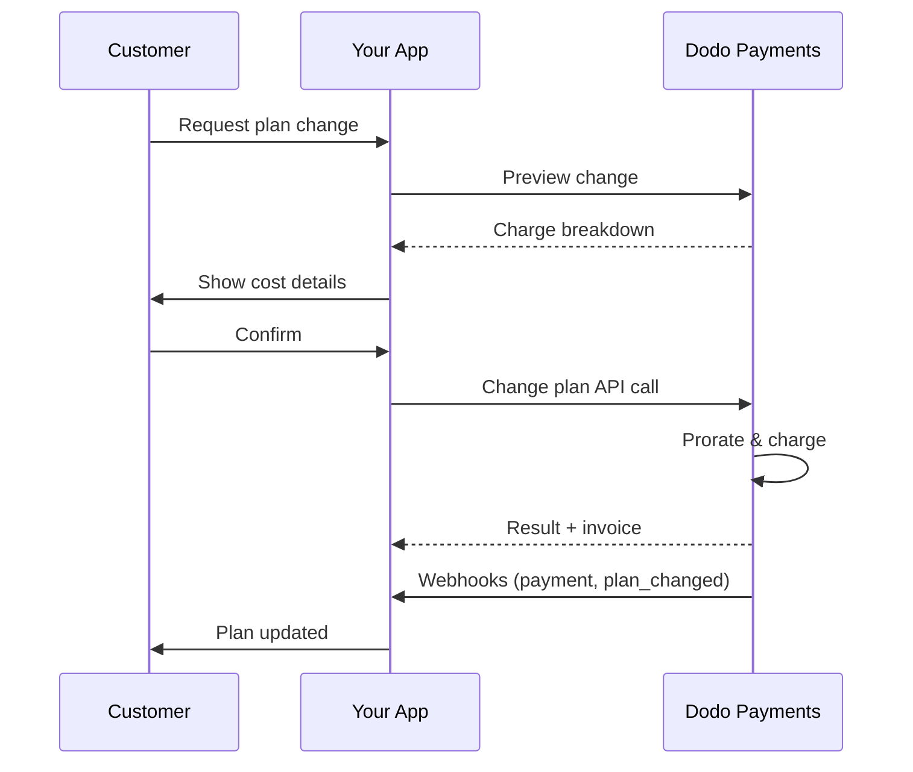
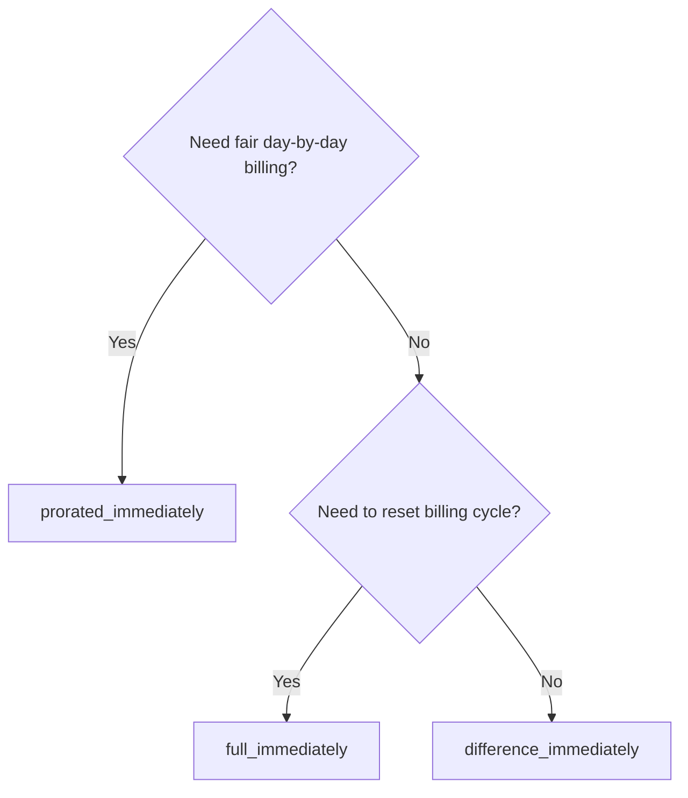
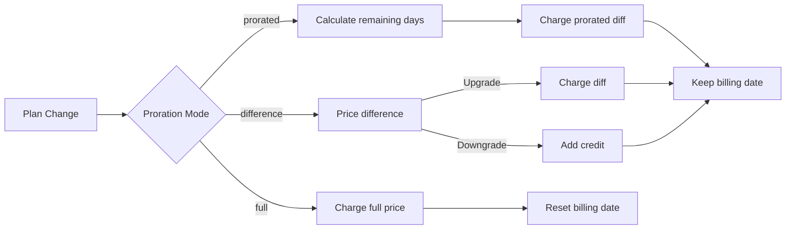

<CardGroup cols={3}>
<Card title="Change Plan API" icon="code" href="/api-reference/subscriptions/change-plan">
  सदस्यता को अपडेट करने के लिए पूर्ण API दस्तावेज़।
</Card>
<Card title="Plan Change Preview" icon="eye" href="/api-reference/subscriptions/preview-change-plan">
  योजनाओं को बदलने से पहले चार्ज राशि देखें।
</Card>
<Card title="Integration Guide" icon="book" href="/developer-resources/subscription-integration-guide">
  चरण-दर-चरण सदस्यता सेटअप।
</Card>
</CardGroup>

## सदस्यता उन्नयन या डाउनग्रेड क्या है?

योजनाएँ बदलने से आपको ग्राहकों को सदस्यता स्तरों या मात्रा के बीच ले जाने की अनुमति मिलती है। इसका उपयोग करें:
- उपयोग या सुविधाओं के साथ मूल्य समायोजित करने के लिए
- मासिक से वार्षिक (या इसके विपरीत) में स्थानांतरित करने के लिए
- सीट-आधारित उत्पादों के लिए मात्रा समायोजित करने के लिए

<Info>
योजना परिवर्तन तत्काल शुल्क को ट्रिगर कर सकते हैं, इस पर निर्भर करते हुए कि आपने कौन सा प्रोरशन मोड चुना है।
</Info>

## योजना परिवर्तनों का उपयोग कब करें

- जब ग्राहक को अधिक सुविधाओं, उपयोग या सीटों की आवश्यकता हो, तो उन्नयन करें
- जब उपयोग कम हो, तो डाउनग्रेड करें
- बिना उनकी सदस्यता रद्द किए नए उत्पाद या मूल्य में ग्राहक को स्थानांतरित करना

## योजना परिवर्तन प्रवाह



## पूर्वापेक्षाएँ

सदस्यता योजना परिवर्तनों को लागू करने से पहले, सुनिश्चित करें कि आपके पास है:

- सक्रिय सदस्यता उत्पादों के साथ एक डोडो पेमेंट्स व्यापारी खाता
- डैशबोर्ड से API क्रेडेंशियल (API कुंजी और वेबहुक गुप्त कुंजी)
- संशोधित करने के लिए एक मौजूदा सक्रिय सदस्यता
- सदस्यता घटनाओं को संभालने के लिए वेबहुक एंडपॉइंट कॉन्फ़िगर किया गया है

<Info>
विस्तृत सेटअप निर्देशों के लिए, हमारे [एकीकरण गाइड](/developer-resources/integration-guide#dashboard-setup) को देखें।
</Info>

## चरण-दर-चरण कार्यान्वयन गाइड

अपने एप्लिकेशन में सदस्यता योजना परिवर्तनों को लागू करने के लिए इस व्यापक गाइड का पालन करें:

<Steps>
<Step title="योजना परिवर्तन आवश्यकताओं को समझें">
लागू करने से पहले, निर्धारित करें:
- कौन सी सदस्यता उत्पादों को किन अन्य उत्पादों में बदला जा सकता है
- आपके व्यवसाय मॉडल के लिए कौन सा प्रोरशन मोड उपयुक्त है
- विफल योजना परिवर्तनों को सुचारू रूप से कैसे संभालें
- स्थिति प्रबंधन के लिए कौन से वेबहुक घटनाओं को ट्रैक करें

<Tip>
उत्पादन में लागू करने से पहले परीक्षण मोड में योजना परिवर्तनों का पूरी तरह से परीक्षण करें।
</Tip>
</Step>

<Step title="अपना प्रोरशन रणनीति चुनें">
उस बिलिंग दृष्टिकोण का चयन करें जो आपके व्यवसाय की आवश्यकताओं के साथ मेल खाता है:

<Tabs>
<Tab title="prorated_immediately">
सर्वश्रेष्ठ के लिए: SaaS अनुप्रयोग जो अप्रयुक्त समय के लिए उचित रूप से चार्ज करना चाहते हैं
- शेष चक्र समय के आधार पर सटीक प्रोरटेड राशि की गणना करता है
- चक्र में शेष अप्रयुक्त समय के आधार पर प्रोरटेड राशि चार्ज करता है
- ग्राहकों को पारदर्शी बिलिंग प्रदान करता है
</Tab>

<Tab title="difference_immediately">
सर्वश्रेष्ठ के लिए: स्पष्ट अपग्रेड/डाउनग्रेड परिदृश्य
- अपग्रेड: तत्काल अंतर चार्ज करें (जैसे, $30→$80 = $50 चार्ज करें)
- डाउनग्रेड: भविष्य के नवीनीकरण के लिए शेष मूल्य का क्रेडिट
- बिलिंग लॉजिक और ग्राहक संचार को सरल बनाता है
</Tab>

<Tab title="full_immediately">
सर्वश्रेष्ठ के लिए: जब आप बिलिंग चक्र को रीसेट करना चाहते हैं
- नए योजना की पूर्ण राशि तुरंत चार्ज करता है
- पुराने योजना से शेष समय की अनदेखी करता है
- वार्षिक से मासिक संक्रमण के लिए उपयोगी
</Tab>
</Tabs>
</Step>

<Step title="परिवर्तन योजना API लागू करें">
सदस्यता विवरण को संशोधित करने के लिए परिवर्तन योजना API का उपयोग करें:

<ParamField path="subscription_id" type="string" required>
संशोधित करने के लिए सक्रिय सदस्यता की ID।
</ParamField>

<ParamField path="product_id" type="string" required>
सदस्यता को बदलने के लिए नया उत्पाद ID।
</ParamField>

<ParamField path="quantity" type="integer" default="1">
नए योजना के लिए इकाइयों की संख्या (सीट-आधारित उत्पादों के लिए)।
</ParamField>

<ParamField path="proration_billing_mode" type="string" required>
तुरंत बिलिंग को कैसे संभालें: `prorated_immediately`, `full_immediately`, या `difference_immediately`।
</ParamField>

<ParamField path="addons" type="array">
नए योजना के लिए वैकल्पिक ऐड-ऑन। इसे खाली छोड़ने से कोई भी मौजूदा ऐड-ऑन हटा दिया जाएगा।
</ParamField>

<ParamField path="on_payment_failure" type="string">
जब योजना परिवर्तन भुगतान विफल रहता है, तो व्यवहार को नियंत्रित करता है:
- `prevent_change`: भुगतान सफल होने तक सदस्यता को वर्तमान योजना पर बनाए रखें
- `apply_change` (डिफॉल्ट): भुगतान के परिणाम के बावजूद तुरंत योजना परिवर्तन लागू करें

यदि निर्दिष्ट नहीं किया गया है, तो यह व्यापार-स्तरीय डिफ़ॉल्ट सेटिंग का उपयोग करता है।
</ParamField>
</Step>

<Step title="Webhook Events को संभालें">
योजना परिवर्तन परिणामों को ट्रैक करने के लिए वेब हुक हैंडलिंग सेट करें:

- `subscription.active`: योजना परिवर्तन सफल, सदस्यता अपडेट कर दी गई
- `subscription.plan_changed`: सदस्यता योजना में परिवर्तन किया गया (उन्नयन/डाउनग्रेड/ऐड-ऑन अपडेट)
- `subscription.on_hold`: योजना परिवर्तन शुल्क विफल, सदस्यता रुकी
- `payment.succeeded`: योजना परिवर्तन के लिए तत्काल शुल्क सफल हुआ
- `payment.failed`: तत्काल शुल्क विफल

<Warning>
हमेशा वेब हुक हस्ताक्षरों की पुष्टि करें और पुनरावृत्ति घटना प्रसंस्करण को लागू करें।
</Warning>
</Step>

<Step title="अपने एप्लिकेशन की स्थिति अपडेट करें">
वेब हुक घटनाओं के आधार पर, अपने एप्लिकेशन को अपडेट करें:
- नई योजना के आधार पर सुविधाएँ प्रदान/हटाएँ
- नए योजना विवरण के साथ ग्राहक डैशबोर्ड अपडेट करें
- योजना परिवर्तनों के बारे में पुष्टि ईमेल भेजें
- ऑडिट उद्देश्यों के लिए बिलिंग परिवर्तनों को लॉग करें
</Step>

<Step title="परीक्षण और निगरानी">
अपने कार्यान्वयन का पूरी तरह से परीक्षण करें:
- विभिन्न परिदृश्यों के साथ सभी प्रोरशन मोड का परीक्षण करें
- सुनिश्चित करें कि वेब हुक हैंडलिंग सही ढंग से काम कर रहा है
- योजना परिवर्तन सफलता दर पर निगरानी रखें
- विफल योजना परिवर्तनों के लिए अलर्ट सेट करें
</Step>
</Steps>

योजना परिवर्तन की पुष्टि करने से पहले, ग्राहकों को दिखाने के लिए पूर्वावलोकन API का उपयोग करें कि उन्हें सटीक रूप से क्या चार्ज किया जाएगा:

## योजना परिवर्तनों का पूर्वावलोकन

योजना परिवर्तन करने से पहले, ग्राहकों को दिखाने के लिए पूर्वावलोकन API का उपयोग करें कि उन्हें वास्तव में कितना चार्ज किया जाएगा:

<Tabs>
<Tab title="Node.js SDK">

```javascript
const preview = await client.subscriptions.previewChangePlan('sub_123', {
  product_id: 'prod_pro',
  quantity: 1,
  proration_billing_mode: 'prorated_immediately'
});

// Show customer the charge before confirming
console.log('Immediate charge:', preview.immediate_charge.summary);
console.log('New plan details:', preview.new_plan);
```

</Tab>

<Tab title="Python SDK">

```python
preview = client.subscriptions.preview_change_plan(
    subscription_id="sub_123",
    product_id="prod_pro",
    quantity=1,
    proration_billing_mode="prorated_immediately"
)

# Show customer the charge before confirming
print("Immediate charge:", preview.immediate_charge.summary)
print("New plan details:", preview.new_plan)
```

</Tab>
</Tabs>

<Tip>
ग्राहकों को योजना परिवर्तन की पुष्टि करने से पहले जिस सटीक राशि का चार्ज किया जाएगा, उसे दिखाने के लिए पूर्वावलोकन API का उपयोग करें।
</Tip>

## परिवर्तन योजना API

सक्रिय सदस्यता के लिए उत्पाद, मात्रा, और प्रोरशन व्यवहार को संशोधित करने के लिए परिवर्तन योजना API का उपयोग करें।

### त्वरित प्रारंभ उदाहरण

<Tabs>
  <Tab title="Node.js SDK">

    ```javascript
    import DodoPayments from 'dodopayments';

    const client = new DodoPayments({
      bearerToken: process.env.DODO_PAYMENTS_API_KEY,
      environment: 'test_mode', // defaults to 'live_mode'
    });

    async function changePlan() {
      const result = await client.subscriptions.changePlan('sub_123', {
        product_id: 'prod_new',
        quantity: 3,
        proration_billing_mode: 'prorated_immediately',
        on_payment_failure: 'prevent_change', // Optional: control behavior on payment failure
      });
      console.log(result.status, result.invoice_id, result.payment_id);
    }

    changePlan();
    ```

  </Tab>
  <Tab title="Python SDK">

    ```python
    import os
    from dodopayments import DodoPayments

    client = DodoPayments(
        bearer_token=os.environ.get("DODO_PAYMENTS_API_KEY"),
        environment="test_mode",  # defaults to "live_mode"
    )

    result = client.subscriptions.change_plan(
        subscription_id="sub_123",
        product_id="prod_new",
        quantity=3,
        proration_billing_mode="prorated_immediately",
        on_payment_failure="prevent_change",  # Optional: control behavior on payment failure
    )
    print(result.status, result.get("invoice_id"), result.get("payment_id"))
    ```

  </Tab>
  <Tab title="Go SDK">

    ```go
    package main

    import (
      "context"
      "fmt"
      "github.com/dodopayments/dodopayments-go"
      "github.com/dodopayments/dodopayments-go/option"
    )

    func main() {
      client := dodopayments.NewClient(option.WithBearerToken("YOUR_TOKEN"))
      res, err := client.Subscriptions.ChangePlan(context.TODO(), dodopayments.SubscriptionChangePlanParams{
        SubscriptionID: dodopayments.F("sub_123"),
        ProductID:             dodopayments.F("prod_new"),
        Quantity:              dodopayments.F(int64(3)),
        ProrationBillingMode:  dodopayments.F(dodopayments.SubscriptionChangePlanParamsProrationBillingModeProratedImmediately),
        OnPaymentFailure:      dodopayments.F(dodopayments.OnPaymentFailurePreventChange), // Optional
      })
      if err != nil { panic(err) }
      fmt.Println(res.Status, res.InvoiceID, res.PaymentID)
    }
    ```

  </Tab>
  <Tab title="HTTP">

    ```bash
    curl -X POST "$DODO_API_BASE/subscriptions/sub_123/change-plan" \
      -H "Authorization: Bearer $DODO_PAYMENTS_API_KEY" \
      -H "Content-Type: application/json" \
      -d '{
        "product_id": "prod_new",
        "quantity": 3,
        "proration_billing_mode": "prorated_immediately",
        "on_payment_failure": "prevent_change"
      }'
    ```

  </Tab>
</Tabs>

```json Success
{
  "status": "processing",
  "subscription_id": "sub_123",
  "invoice_id": "inv_789",
  "payment_id": "pay_456",
  "proration_billing_mode": "prorated_immediately"
}
```

<Note>
क्षेत्र जैसे <code>invoice_id</code> और <code>payment_id</code> केवल तभी लौटाए जाते हैं जब योजना परिवर्तन के दौरान तत्काल शुल्क और/or चालान उत्पन्न होता है। हमेशा परिणामों की पुष्टि के लिए वेब हुक घटनाओं पर भरोसा करें (जैसे, <code>payment.succeeded</code>, <code>subscription.plan_changed</code>). 
</Note>

<Warning>
यदि तत्काल शुल्क विफल हो जाता है, तो सदस्यता `subscription.on_hold` की स्थिति में चला सकती है जब तक भुगतान सफल नहीं हो जाता।
</Warning>

## ऐड-ऑन प्रबंधन

जब सदस्यता योजनाओं को बदला जाता है, तो आप ऐड-ऑन को भी संशोधित कर सकते हैं:

```javascript
// Add addons to the new plan
await client.subscriptions.changePlan('sub_123', {
  product_id: 'prod_new',
  quantity: 1,
  proration_billing_mode: 'difference_immediately',
  addons: [
    { addon_id: 'addon_123', quantity: 2 }
  ]
});

// Remove all existing addons
await client.subscriptions.changePlan('sub_123', {
  product_id: 'prod_new',
  quantity: 1,
  proration_billing_mode: 'difference_immediately',
  addons: [] // Empty array removes all existing addons
});
```

<Info>
ऐड-ऑन प्रोरशन गणना में शामिल होते हैं और चुने गए प्रोरशन मोड के अनुसार चार्ज किए जाएंगे।
</Info>

## प्रोरशन मोड

योजनाओं को बदलने पर ग्राहक को कैसे बिल किया जाए, यह चुनें:

#### `prorated_immediately`
- वर्तमान चक्र में आंशिक अंतर के लिए चार्ज करता है
- यदि परीक्षण में है, तो तुरंत चार्ज किया जाता है और अभी नई योजना पर स्विच किया जाता है
- डाउनग्रेड: भविष्य के नवीकरणों के लिए क्रेडिट उत्पन्न कर सकता है

#### `full_immediately`
- नई योजना की पूर्ण राशि तुरंत चार्ज करता है
- पुरानी योजना के शेष समय की अनदेखी करता है

<Info>
<code>difference_immediately</code> का उपयोग करके बनाए गए क्रेडिट सदस्यता-स्कोप वाले होते हैं और <a href="/features/customer-credit">ग्राहक क्रेडिट</a> से भिन्न होते हैं। वे उसी सदस्यता के भविष्य के नवीकरणों पर स्वचालित रूप से लागू होते हैं और सदस्यताओं के बीच स्थानांतरित नहीं होते।
</Info>

#### `difference_immediately`
- उन्नयन: पुरानी और नई योजनाओं के बीच मूल्य अंतर को तुरंत चार्ज करें
- डाउनग्रेड: शेष मूल्य को सदस्यता में आंतरिक क्रेडिट के रूप में जोड़ें और नवीकरण पर स्वचालित रूप से लागू करें

| फ़ीचर | `prorated_immediately` | `difference_immediately` | `full_immediately` |
|---------|----------------------|------------------------|-------------------|
| **उन्नयन शुल्क** | शेष दिनों के लिए प्रोरटेड अंतर | योजनाओं के बीच पूर्ण मूल्य अंतर | पूर्ण नई योजना मूल्य |
| **डाउनग्रेड क्रेडिट** | शेष दिनों के लिए प्रोरटेड क्रेडिट | क्रेडिट के रूप में पूर्ण मूल्य अंतर | कोई क्रेडिट नहीं |
| **बिलिंग चक्र** | अपरिवर्तित | अपरिवर्तित | आज की तारीख को रीसेट करता है |
| **परीक्षण व्यवहार** | परीक्षण समाप्त करता है, तुरंत चार्ज करता है | परीक्षण समाप्त करता है, तुरंत चार्ज करता है | परीक्षण समाप्त करता है, पूर्ण राशि चार्ज करता है |
| **सर्वश्रेष्ठ के लिए** | उचित समय-आधारित बिलिंग | सरल उन्नयन/डाउनग्रेड गणित | बिलिंग चक्रों को रीसेट करना |
| **जटिलता** | मध्यम (दिन की गणना) | कम (सरल घटाव) | कम (पूर्ण चार्ज) |



### उदाहरण परिदृश्य

इन कैनोनिकल नंबरों का लगातार उपयोग करें:
- वर्तमान योजना: **बेसिक** **$30/माह**
- उन्नयन लक्ष्य: **प्रो** **$80/माह**
- डाउनग्रेड लक्ष्य (प्रो से): **स्टार्टर** **$20/माह**
- बिलिंग चक्र: **30 दिन**, शुरू किया गया **1 जनवरी**
- योजना परिवर्तन **16 जनवरी** को होता है (15 दिन शेष, 15 दिन उपयोग किया गया)

<AccordionGroup>
  <Accordion title="उन्नयन: बेसिक ($30) → प्रो ($80) प्रोरटेड_immediately के साथ">

    ```
    Step 1: Calculate unused credit from current plan
      Unused days = 15 out of 30 days
      Credit = $30 × (15/30) = $15.00

    Step 2: Calculate prorated cost of new plan
      Remaining days = 15 out of 30 days
      New plan cost = $80 × (15/30) = $40.00

    Step 3: Calculate immediate charge
      Charge = New plan cost − Credit
      Charge = $40.00 − $15.00 = $25.00

    → Customer pays $25.00 now
    → Next renewal (Feb 1): $80.00/month
    ```

    ```javascript
    await client.subscriptions.changePlan('sub_123', {
      product_id: 'prod_pro',
      quantity: 1,
      proration_billing_mode: 'prorated_immediately'
    })
    ```

  </Accordion>

  <Accordion title="डाउनग्रेड: प्रो ($80) → स्टार्टर ($20) प्रोरटेड_immediately के साथ">

    ```
    Step 1: Calculate unused credit from current plan
      Unused days = 15 out of 30 days
      Credit = $80 × (15/30) = $40.00

    Step 2: Calculate prorated cost of new plan
      Remaining days = 15 out of 30 days
      New plan cost = $20 × (15/30) = $10.00

    Step 3: Calculate credit balance
      Credit = $40.00 − $10.00 = $30.00

    → No charge — $30.00 credit added to subscription
    → Credit auto-applies to future renewals
    → Next renewal (Feb 1): $20.00 − $30.00 credit = $0.00
    → Following renewal (Mar 1): $20.00 − $10.00 remaining credit = $10.00
    ```

    ```javascript
    await client.subscriptions.changePlan('sub_123', {
      product_id: 'prod_starter',
      quantity: 1,
      proration_billing_mode: 'prorated_immediately'
    })
    ```

  </Accordion>

  <Accordion title="उन्नयन: बेसिक ($30) → प्रो ($80) difference_immediately के साथ">

    ```
    Immediate charge = New plan price − Old plan price
                     = $80 − $30
                     = $50.00

    → Customer pays $50.00 now (regardless of cycle position)
    → Next renewal (Feb 1): $80.00/month
    ```

    ```javascript
    await client.subscriptions.changePlan('sub_123', {
      product_id: 'prod_pro',
      quantity: 1,
      proration_billing_mode: 'difference_immediately'
    })
    ```

  </Accordion>

  <Accordion title="डाउनग्रेड: प्रो ($80) → स्टार्टर ($20) difference_immediately के साथ">

    ```
    Credit = Old plan price − New plan price
           = $80 − $20
           = $60.00

    → No charge — $60.00 credit added to subscription
    → Credit auto-applies to future renewals
    → Next renewal: $20.00 − $20.00 (from credit) = $0.00
    → Following renewal: $20.00 − $20.00 (from credit) = $0.00
    → Third renewal: $20.00 − $20.00 (from remaining credit) = $0.00
    ```

    ```javascript
    await client.subscriptions.changePlan('sub_123', {
      product_id: 'prod_starter',
      quantity: 1,
      proration_billing_mode: 'difference_immediately'
    })
    ```

  </Accordion>

  <Accordion title="उन्नयन: बेसिक ($30) → प्रो ($80) full_immediately के साथ">

    ```
    Immediate charge = Full new plan price = $80.00

    → Customer pays $80.00 now
    → No credit for unused time on old plan
    → Billing cycle resets to today (January 16)
    → Next renewal: February 16 at $80.00/month
    ```

    ```javascript
    await client.subscriptions.changePlan('sub_123', {
      product_id: 'prod_pro',
      quantity: 1,
      proration_billing_mode: 'full_immediately'
    })
    ```

  </Accordion>

  <Accordion title="बीच में उन्नयन को ऐड-ऑन के साथ प्रोरटेड_immediately के साथ">

    ```
    Current: Basic plan ($30/month), no add-ons
    New: Pro plan ($80/month) + Extra Seats add-on ($10/seat × 3 seats = $30/month)
    Change on day 16 of 30 (15 days remaining)

    Step 1: Credit from current plan
      Credit = $30 × (15/30) = $15.00

    Step 2: Prorated cost of new plan + add-ons
      New plan = $80 × (15/30) = $40.00
      Add-ons = $30 × (15/30) = $15.00
      Total new = $55.00

    Step 3: Immediate charge
      Charge = $55.00 − $15.00 = $40.00

    → Customer pays $40.00 now
    → Next renewal: $80.00 + $30.00 = $110.00/month
    ```

    ```javascript
    await client.subscriptions.changePlan('sub_123', {
      product_id: 'prod_pro',
      quantity: 1,
      proration_billing_mode: 'prorated_immediately',
      addons: [
        { addon_id: 'addon_seats', quantity: 3 }
      ]
    })
    ```

  </Accordion>
</AccordionGroup>

### प्रत्येक मोड बिलिंग को कैसे प्रोसेस करता है



<Tip>
उचित समय लेखांकन के लिए `prorated_immediately` का चयन करें; रसीद के लिए `full_immediately` का चयन करें; सरल उन्नयन और डाउनग्रेड पर स्वचालित क्रेडिट के लिए `difference_immediately` का उपयोग करें।
</Tip>

## भुगतान विफलताओं को संभालना

एक योजना परिवर्तन भुगतान विफल होने पर क्या होता है, इसे `on_payment_failure` पैरामीटर का उपयोग करके नियंत्रित करें।

### भुगतान विफलता मोड

<Tabs>
<Tab title="prevent_change (महत्वपूर्ण उन्नयन के लिए अनुशंसित)">
**व्यवहार**: भुगतान सफल होने तक सदस्यता को अपनी वर्तमान योजना पर बनाए रखें।

- योजना परिवर्तन को "लंबित" के रूप में मार्क करें
- ग्राहक को उनकी वर्तमान योजना तक पहुंच प्राप्त होती है
- सदस्यता केवल सफल भुगतान के बाद `active` स्थिति में जाने का होता है
- जब आप सुनिश्चित करना चाहते हैं कि भुगतान देने से पहले उन्नत सुविधाएँ देना ठीक है


```javascript
await client.subscriptions.changePlan('sub_123', {
  product_id: 'prod_pro',
  quantity: 1,
  proration_billing_mode: 'prorated_immediately',
  on_payment_failure: 'prevent_change'
});
```

</Tab>

<Tab title="apply_change (डिफ़ॉल्ट)">
**व्यवहार**: भुगतान के परिणाम के बावजूद योजना परिवर्तन को तुरंत लागू करें।

- योजना परिवर्तन लागू किया जाता है भले ही भुगतान विफल हो
- ग्राहक को नई योजना तक तुरंत पहुंच प्राप्त होती है
- यदि भुगतान विफल होता है, तो सदस्यता `on_hold` में जा सकती है
- गैर-आवश्यक उन्नयन के लिए या जब आपको ग्राहक पर भरोसा हो तो यह अच्छा है


```javascript
await client.subscriptions.changePlan('sub_123', {
  product_id: 'prod_pro',
  quantity: 1,
  proration_billing_mode: 'prorated_immediately',
  on_payment_failure: 'apply_change' // This is the default
});
```

</Tab>
</Tabs>

<Info>
यदि निर्दिष्ट नहीं किया गया है, तो `on_payment_failure` पैरामीटर डैशबोर्ड में आपके व्यवसाय-स्तरीय डिफ़ॉल्ट सेटिंग का उपयोग करता है।
</Info>

### प्रत्येक मोड का उपयोग कब करें

| परिदृश्य | अनुशंसित मोड | कारण |
|----------|------------------|--------|
| प्रीमियम सुविधाओं के लिए उन्नयन करना | `prevent_change` | पहुँच देने से पहले भुगतान सुनिश्चित करें |
| मात्रा में वृद्धि (अधिक सीटें) | `prevent_change` | भुगतान के बिना उपयोग को रोकें |
| योजनाओं को डाउनग्रेड करना | `apply_change` | ग्राहक खर्च कम कर रहा है |
| विश्वास किए गए एंटरप्राइज ग्राहक | `apply_change` | गैर-पेमेन्ट का कम जोखिम |
| परीक्षण से भुगतान रूपांतरण | `prevent_change` | महत्वपूर्ण भुगतान क्षण |

## वेब हुक को संभालना

योजना परिवर्तनों और भुगतानों की पुष्टि के लिए वेब हुक के माध्यम से सदस्यता स्थिति को ट्रैक करें।

### हैंडल करने के लिए ईवेंट प्रकार
- `subscription.active`: सदस्यता सक्रिय
- `subscription.plan_changed`: सदस्यता योजना बदली (उन्नयन/डाउनग्रेड/ऐड-ऑन बदलाव)
- `subscription.on_hold`: शुल्क विफल, सदस्यता रुकी
- `subscription.renewed`: नवीनीकरण सफल
- `payment.succeeded`: योजना परिवर्तन या नवीनीकरण के लिए भुगतान सफल हुआ
- `payment.failed`: भुगतान विफल

<Info>
हम सदस्यता घटनाओं से व्यावसायिक लॉजिक ड्राइव करने और पुष्टि और समन्वय के लिए भुगतान घटनाओं का उपयोग करने की सिफारिश करते हैं।
</Info>

### हस्ताक्षरों को सत्यापित करें और इरादों को संभालें

<Tabs>
  <Tab title="Next.js Route Handler">

    ```javascript
    import { NextRequest, NextResponse } from 'next/server';
    
    export async function POST(req) {
      const webhookId = req.headers.get('webhook-id');
      const webhookSignature = req.headers.get('webhook-signature');
      const webhookTimestamp = req.headers.get('webhook-timestamp');
      const secret = process.env.DODO_WEBHOOK_SECRET;
    
      const payload = await req.text();
      // verifySignature is a placeholder – in production, use a Standard Webhooks library
      const { valid, event } = await verifySignature(
        payload,
        { id: webhookId, signature: webhookSignature, timestamp: webhookTimestamp },
        secret
      );
      if (!valid) return NextResponse.json({ error: 'Invalid signature' }, { status: 400 });
    
      switch (event.type) {
        case 'subscription.active':
          // mark subscription active in your DB
          break;
        case 'subscription.plan_changed':
          // refresh entitlements and reflect the new plan in your UI
          break;
        case 'subscription.on_hold':
          // notify user to update payment method
          break;
        case 'subscription.renewed':
          // extend access window
          break;
        case 'payment.succeeded':
          // reconcile payment for plan change
          break;
        case 'payment.failed':
          // log and alert
          break;
        default:
          // ignore unknown events
          break;
      }
    
      return NextResponse.json({ received: true });
    }
    ```

  </Tab>
  <Tab title="Express.js">

    ```javascript
    import express from 'express';
    
    const app = express();
    app.post('/webhooks/dodo', express.raw({ type: 'application/json' }), async (req, res) => {
      const webhookId = req.header('webhook-id');
      const webhookSignature = req.header('webhook-signature');
      const webhookTimestamp = req.header('webhook-timestamp');
      const secret = process.env.DODO_WEBHOOK_SECRET;
      const payload = req.body.toString('utf8');
    
      const { valid, event } = await verifySignature(
        payload,
        { id: webhookId, signature: webhookSignature, timestamp: webhookTimestamp },
        secret
      );
      if (!valid) return res.status(400).send('Invalid signature');
    
      // handle events like above
      res.json({ received: true });
    });
    
    app.listen(3000);
    ```

  </Tab>
</Tabs>

<Note>
विस्तृत पेलोड स्कीमाओं के लिए, <a href="/developer-resources/webhooks/intents/subscription">सदस्यता वेब हुक पेलोड</a> और <a href="/developer-resources/webhooks/intents/payment">भुगतान वेब हुक पेलोड</a> देखें।
</Note>

## सर्वोत्तम प्रथाएँ

सदस्यता योजना परिवर्तनों के लिए विश्वसनीयता सुनिश्चित करने के लिए इन अनुशंसाओं का पालन करें:

### योजना परिवर्तन रणनीति
- **पूर्ण परीक्षण करें**: उत्पादन से पहले हमेशा परीक्षण मोड में योजना परिवर्तनों का परीक्षण करें
- **प्रोरशन को सावधानी से चुनें**: अपने व्यवसाय मॉडल के साथ मेल खाने वाला प्रोरशन मोड चुनें
- **विफलताओं का ठीक से निपटारा करें**: उचित त्रुटि हैंडलिंग और पुनः प्रयास लॉजिक लागू करें
- **सफलता दर की निगरानी करें**: योजना परिवर्तन सफलता/विफलता दर को ट्रैक करें और मुद्दों की जांच करें

### वेब हुक कार्यान्वयन
- **हस्ताक्षरों को सत्यापित करें**: हमेशा प्रमाणीकरण सुनिश्चित करने के लिए वेब हुक हस्ताक्षरों की पुष्टि करें
- **आइडेम्पोटेंसी लागू करें**: डुप्लिकेट वेब हुक घटनाओं को ठीक से संभालें
- **असिंक्रोनस प्रोसेस करें**: भारी संचालन के साथ वेब हुक प्रतिक्रियाओं को अवरुद्ध न करें
- **सब कुछ लॉग करें**: डिबगिंग और ऑडिट उद्देश्यों के लिए विस्तृत लॉग बनाए रखें

### उपयोगकर्ता अनुभव
- **स्पष्ट संवाद करें**: ग्राहकों को बिलिंग परिवर्तन और समय के बारे में सूचित करें
- **पुष्टि प्रदान करें**: सफल योजना परिवर्तनों के लिए ईमेल पुष्टि भेजें
- **किनारे के मामलों को संभालें**: परीक्षण काल, प्रोरशन्स, और विफल भुगतानों पर विचार करें
- **UI को तुरंत अपडेट करें**: अपने एप्लिकेशन इंटरफेस में योजना परिवर्तनों को दर्शाएं

## सामान्य समस्याएँ और समाधान

सदस्यता योजना परिवर्तनों के दौरान आए सामान्य समस्याओं को हल करें:

<AccordionGroup>
<Accordion title="चार्ज बनाया गया लेकिन सदस्यता अपडेट नहीं हुई">
**लक्षण**: API कॉल सफल होती है लेकिन सदस्यता पुरानी योजना पर रहती है

**सामान्य कारण**:
- वेब हुक प्रसंस्करण विफल हुआ या देर से हुआ
- वेब हुक प्राप्त करने के बाद एप्लिकेशन स्थिति को अपडेट नहीं किया गया
- स्थिति अपडेट के दौरान डेटाबेस लेनदेन की समस्याएँ

**समाधान**:
- पुनः प्रयास लॉजिक के साथ मजबूत वेब हुक हैंडलिंग लागू करें
- स्थिति अपडेट के लिए आइडेम्पोटेंट ऑपरेशन्स का उपयोग करें
- छूटे हुए वेब हुक घटनाओं का पता लगाने और अलर्ट करने के लिए निगरानी जोड़ें
- वेब हुक अंत बिंदु पहुँच योग्य और सही तरीके से प्रतिक्रिया देने की पुष्टि करें
</Accordion>

<Accordion title="डाउनग्रेड के बाद क्रेडिट लागू नहीं हुए">
**लक्षण**: ग्राहक डाउनग्रेड करता है लेकिन क्रेडिट बैलेंस नहीं देखता


**सामान्य कारण**:
- प्रोरशन मोड की अपेक्षाएँ: डाउनग्रेड्स `difference_immediately` के साथ पूर्ण योजना मूल्य अंतर को क्रेडिट करते हैं, जबकि `prorated_immediately` शर्त पर शेष समय के आधार पर प्रोरटेड क्रेडिट बनाते हैं
- क्रेडिट सदस्यता-विशिष्ट होते हैं और सदस्यताओं के बीच स्थानांतरित नहीं होते
- ग्राहक डैशबोर्ड में क्रेडिट बैलेंस दिखाई नहीं देता

**समाधान**:
- जब आप स्वचालित क्रेडिट चाहते हैं, तो डाउनग्रेड के लिए `difference_immediately` का उपयोग करें
- ग्राहकों को समझाएं कि क्रेडिट उसी सदस्यता के भविष्य के नवीकरण पर लागू होते हैं
- क्रेडिट बैलेंस दिखाने के लिए ग्राहक पोर्टल लागू करें
- लागू किए गए क्रेडिट देखने के लिए अगले चालान पूर्वावलोकन की जांच करें
</Accordion>

<Accordion title="Webhook हस्ताक्षर सत्यापन विफल">
**लक्षण**: अमान्य हस्ताक्षर के कारण वेब हुक घटनाएँ अस्वीकृत की गईं

**सामान्य कारण**:
- गलत वेब हुक गुप्त कुंजी
- हस्ताक्षर सत्यापन से पहले कच्चे अनुरोध को संशोधित किया गया
- गलत हस्ताक्षर सत्यापन एल्गोरिदम

**समाधान**:
- पुष्टि करें कि आप डैशबोर्ड से सही `DODO_WEBHOOK_SECRET` का उपयोग कर रहे हैं
- किसी भी JSON पार्सिंग मिडलवेयर से पहले कच्चे अनुरोध पर पढ़ें
- अपने प्लेटफ़ॉर्म के लिए मानक वेब हुक सत्यापन पुस्तकालय का उपयोग करें
- विकासात्मक वातावरण में वेब हुक हस्ताक्षर सत्यापन का परीक्षण करें
</Accordion>

<Accordion title="योजना परिवर्तन 422 त्रुटि के साथ विफल">
**लक्षण**: API 422 Unprocessable Entity त्रुटि लौटाता है


**सामान्य कारण**:
- अविधि सदस्यता ID या उत्पाद ID
- सदस्यता सक्रिय स्थिति में नहीं है
- आवश्यक पैरामीटर गायब हैं
- योजना परिवर्तनों के लिए उत्पाद उपलब्ध नहीं है

**समाधान**:
- पुष्टि करें कि सदस्यता मौजूद है और सक्रिय है
- जांचें कि उत्पाद ID मान्य और उपलब्ध है
- सुनिश्चित करें कि सभी आवश्यक पैरामीटर प्रदान किए गए हैं
- पैरामीटर आवश्यकताओं के लिए API दस्तावेज़ की समीक्षा करें
</Accordion>

<Accordion title="योजना परिवर्तन के दौरान तत्काल शुल्क विफल">
**लक्षण**: योजना परिवर्तन शुरू किया गया लेकिन तत्काल शुल्क विफल रहा

**सामान्य कारण**:
- ग्राहक के भुगतान विधि पर पर्याप्त धन नहीं है
- भुगतान विधि की समाप्ति या अमान्य
- बैंक ने लेनदेन को अस्वीकार कर दिया
- धोखाधड़ी पहचान ने शुल्क को अवरुद्ध कर दिया

**समाधान**:
- `payment.failed` वेब हुक घटनाओं को उचित ढंग से संभालें
- ग्राहक को भुगतान विधि अपडेट करने के लिए सूचित करें
- अस्थायी विफलताओं के लिए पुनः प्रयास लॉजिक लागू करें
- विचार करें कि विफल तत्काल शुल्क के साथ योजना परिवर्तनों की अनुमति दें
</Accordion>

<Accordion title="योजना परिवर्तन के बाद सदस्यता होल्ड पर">
**लक्षण**: योजना परिवर्तन शुल्क विफल होता है और सदस्यता `on_hold` स्थिति में स्थानांतरित हो जाती है


**क्या होता है**:
जब योजना परिवर्तन शुल्क विफल होता है, तो सदस्यता स्वचालित रूप से `on_hold` स्थिति में रखी जाती है। सदस्यता तब तक स्वचालित रूप से नवीनीकरण नहीं होगी जब तक भुगतान विधि को अपडेट नहीं किया जाता।

**समाधान**: सदस्यता को फिर से सक्रिय करने के लिए भुगतान विधि को अपडेट करें

एक योजना परिवर्तन के बाद `on_hold` स्थिति से सदस्यता को फिर से सक्रिय करने के लिए:

1. **भुगतान विधि को अपडेट करें** Update Payment Method API का उपयोग करके
2. **स्वचालित शुल्क निर्माण**: API स्वचालित रूप से बकाया के लिए शुल्क बनाता है
3. **चालान निर्माण**: चार्ज के लिए चालान उत्पन्न किया जाता है
4. **भुगतान प्रोसेसिंग**: नए भुगतान विधि का उपयोग करके भुगतान प्रोसेस किया जाता है
5. **पुन: सक्रियता**: सफल भुगतान के बाद सदस्यता `active` स्थिति में पुनः सक्रिय होती है

<CodeGroup>

```javascript Node.js
// Reactivate subscription from on_hold after failed plan change
async function reactivateAfterFailedPlanChange(subscriptionId) {
  // Update payment method - automatically creates charge for remaining dues
  const response = await client.subscriptions.updatePaymentMethod(subscriptionId, {
    type: 'new',
    return_url: 'https://example.com/return'
  });
  
  if (response.payment_id) {
    console.log('Charge created for remaining dues:', response.payment_id);
    console.log('Payment link:', response.payment_link);
    
    // Redirect customer to payment_link to complete payment
    // Monitor webhooks for:
    // 1. payment.succeeded - charge succeeded
    // 2. subscription.active - subscription reactivated
  }
  
  return response;
}

// Or use existing payment method if available
async function reactivateWithExistingPaymentMethod(subscriptionId, paymentMethodId) {
  const response = await client.subscriptions.updatePaymentMethod(subscriptionId, {
    type: 'existing',
    payment_method_id: paymentMethodId
  });
  
  // Monitor webhooks for payment.succeeded and subscription.active
  return response;
}
```

```python Python
# Reactivate subscription from on_hold after failed plan change
def reactivate_after_failed_plan_change(subscription_id):
    # Update payment method - automatically creates charge for remaining dues
    response = client.subscriptions.update_payment_method(
        subscription_id=subscription_id,
        type="new",
        return_url="https://example.com/return"
    )
    
    if response.payment_id:
        print("Charge created for remaining dues:", response.payment_id)
        print("Payment link:", response.payment_link)
        
        # Redirect customer to payment_link to complete payment
        # Monitor webhooks for:
        # 1. payment.succeeded - charge succeeded
        # 2. subscription.active - subscription reactivated
    
    return response

# Or use existing payment method if available
def reactivate_with_existing_payment_method(subscription_id, payment_method_id):
    response = client.subscriptions.update_payment_method(
        subscription_id=subscription_id,
        type="existing",
        payment_method_id=payment_method_id
    )
    
    # Monitor webhooks for payment.succeeded and subscription.active
    return response
```

</CodeGroup>

**निगरानी के लिए वेब हुक घटनाएँ**:
- `subscription.on_hold`: सदस्यता होल्ड पर रखी गई (जब योजना परिवर्तन शुल्क विफल होता है)
- `payment.succeeded`: बची हुई बकाया के लिए भुगतान सफल (भुगतान विधि को अपडेट करने के बाद)
- `subscription.active`: सफल भुगतान के बाद सदस्यता फिर से सक्रिय की गई

**सर्वश्रेष्ठ प्रथाएँ**:
- उन्हें तत्काल सूचित करें जब योजना परिवर्तन शुल्क विफल हो जाए
- उनके भुगतान विधि को अपडेट करने के लिए स्पष्ट निर्देश प्रदान करें
- फिर से सक्रियता स्थिति को ट्रैक करने के लिए वेब हुक घटनाओं की निगरानी करें
- अस्थायी भुगतान विफलताओं के लिए स्वचालित पुनः प्रयास लॉजिक लागू करने पर विचार करें
</Accordion>
</AccordionGroup>

<Card title="Update Payment Method API Reference" icon="code" href="/api-reference/subscriptions/update-payment-method">
View the complete API documentation for updating payment methods and reactivating subscriptions.
</Card>
</Accordion>
</AccordionGroup>

## अपने कार्यान्वयन का परीक्षण करें

आपके सदस्यता योजना परिवर्तन के कार्यान्वयन का पूरी तरह से परीक्षण करने के लिए इन चरणों का पालन करें:

<Steps>
<Step title="परीक्षण वातावरण सेट करें">
- परीक्षण API कुंजियाँ और परीक्षण उत्पादों का उपयोग करें
- विभिन्न योजना प्रकारों के साथ परीक्षण सदस्यताएँ बनाएं
- परीक्षण वेब हुक अंत बिंदु को कॉन्फ़िगर करें
- निगरानी और लॉगिंग स्थापित करें
</Step>

<Step title="विभिन्न प्रोरशन मोड का परीक्षण करें">
- विभिन्न बिलिंग चक्र स्थानों के साथ `prorated_immediately` का परीक्षण करें
- उन्नयन और डाउनग्रेड के लिए `difference_immediately` का परीक्षण करें
- बिलिंग चक्रों को रीसेट करने के लिए `full_immediately` का परीक्षण करें
- सुनिश्चित करें कि क्रेडिट गणनाएँ सही हैं
</Step>

<Step title="वेब हुक हैंडलिंग का परीक्षण करें">
- सभी प्रासंगिक वेब हुक घटनाओं के प्राप्त होने की पुष्टि करें
- वेब हुक हस्ताक्षर सत्यापन का परीक्षण करें
- डुप्लिकेट वेब हुक घटनाओं को ठीक से संभालें
- वेब हुक प्रसंस्करण विफलता परिदृश्यों का परीक्षण करें
</Step>

<Step title="त्रुटि परिदृश्यों का परीक्षण करें">
- अविधि सदस्यता ID के साथ परीक्षण करें
- समाप्त भुगतान विधियों के साथ परीक्षण करें
- नेटवर्क विफलताओं और टाइमआउट के साथ परीक्षण करें
- अपर्याप्त धन के साथ परीक्षण करें
</Step>

<Step title="उत्पादन में निगरानी करें">
- विफल योजना परिवर्तनों के लिए अलर्ट सेट करें
- वेब हुक प्रसंस्करण समय पर निगरानी रखें
- योजना परिवर्तन सफलता दर को ट्रैक करें
- योजना परिवर्तन मुद्दों के लिए ग्राहक सहायता टिकट की समीक्षा करें
</Step>
</Steps>

## त्रुटि हैंडलिंग

अपने कार्यान्वयन में सामान्य API त्रुटियों को ठीक से संभालें:

### HTTP स्थिति कोड

<AccordionGroup>
<Accordion title="200 OK">
योजना परिवर्तन अनुरोध को सफलतापूर्वक संसाधित किया गया। सदस्यता को अपडेट किया जा रहा है और भुगतान प्रसंस्करण शुरू हो गया है।
</Accordion>

<Accordion title="400 Bad Request">
अमान्य अनुरोध पैरामीटर। सभी आवश्यक फ़ील्ड दिए गए और सही ढंग से प्रारूपित हैं कि यह जांचें।
</Accordion>

<Accordion title="401 Unauthorized">
अमान्य या गायब API कुंजी। कृपया पुष्टि करें कि आपकी `DODO_PAYMENTS_API_KEY` सही है और उचित अनुमतियाँ हैं।
</Accordion>

<Accordion title="404 Not Found">
सदस्यता ID नहीं मिली या आपके खाते से संबंधित नहीं है।
</Accordion>

<Accordion title="422 Unprocessable Entity">
सदस्यता नहीं बदली जा सकती (उदाहरण: पहले से रद्द, उत्पाद उपलब्ध नहीं है, आदि)।
</Accordion>

<Accordion title="500 Internal Server Error">
सर्वर में समस्या हुई। थोड़ी देर बाद पुनः प्रयास करें।
</Accordion>
</AccordionGroup>

### त्रुटि प्रतिक्रिया प्रारूप

```json
{
  "error": {
    "code": "subscription_not_found",
    "message": "The subscription with ID 'sub_123' was not found",
    "details": {
      "subscription_id": "sub_123"
    }
  }
}
```

## अगले चरण

- <a href="/api-reference/subscriptions/change-plan">योजना परिवर्तन API</a> की समीक्षा करें
- <a href="/features/customer-credit">ग्राहक क्रेडिट</a> का अन्वेषण करें
- `subscription.on_hold` के लिए अलर्ट लागू करें
- हमारे <a href="/developer-resources/webhooks">वेब हुक एकीकरण गाइड</a> को देखें
