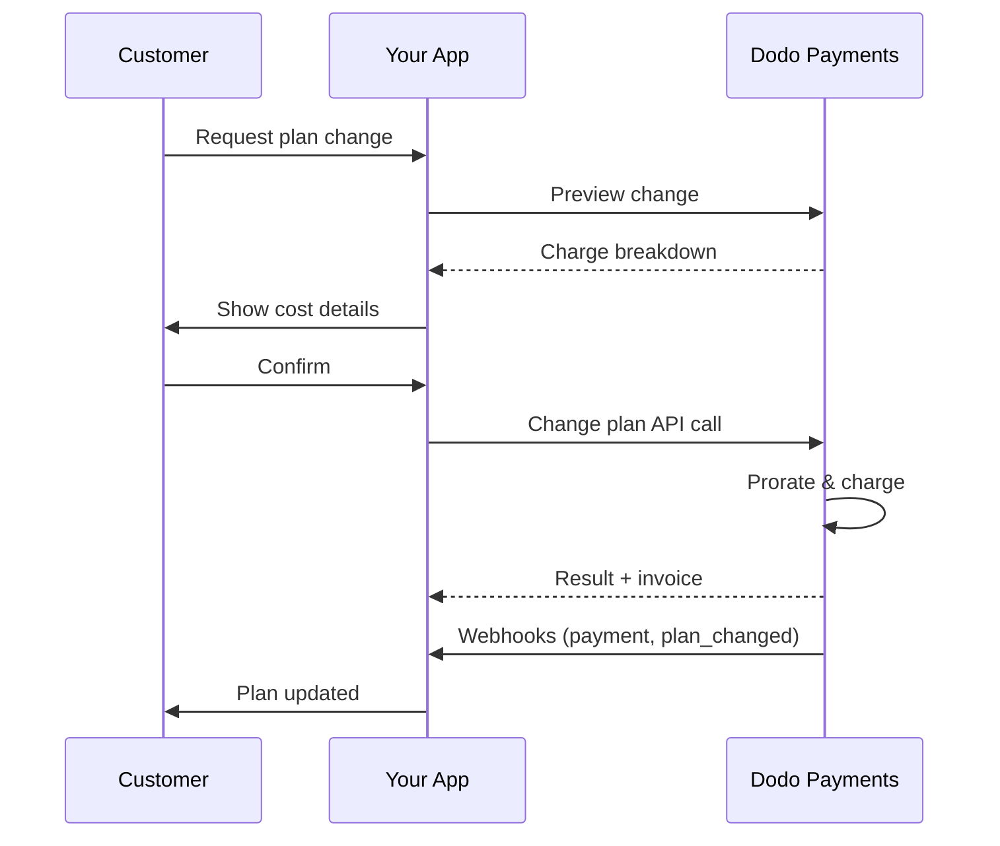
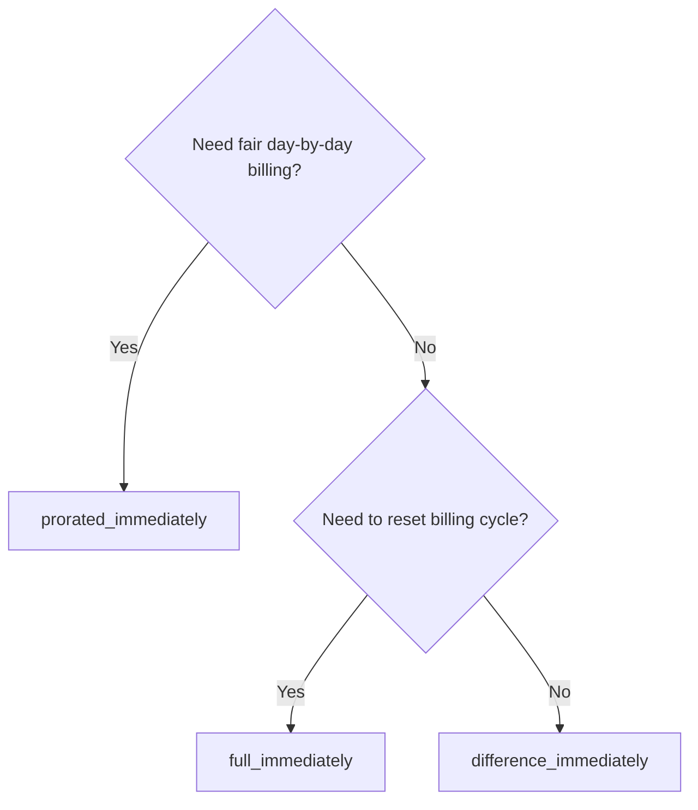
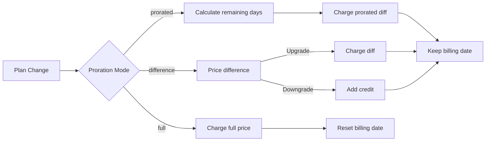

<CardGroup cols={3}>
<Card title="Change Plan API" icon="code" href="/api-reference/subscriptions/change-plan">
  Full API docs for updating subscriptions.
</Card>
<Card title="Plan Change Preview" icon="eye" href="/api-reference/subscriptions/preview-change-plan">
  See charge amounts before changing plans.
</Card>
<Card title="Integration Guide" icon="book" href="/developer-resources/subscription-integration-guide">
  Step-by-step subscription setup.
</Card>
</CardGroup>

## What is a subscription upgrade or downgrade?

Changing plans lets you move a customer between subscription tiers or quantities. Use it to:
- Align pricing with usage or features
- Move from monthly to annual (or vice versa)
- Adjust quantity for seat-based products

<Info>
Plan changes can trigger an immediate charge depending on the proration mode you choose.
</Info>

## When to use plan changes

- Upgrade when a customer needs more features, usage, or seats
- Downgrade when usage decreases
- Migrate users to a new product or price without cancelling their subscription

## Plan Change Flow



## Prerequisites

Before implementing subscription plan changes, ensure you have:

- A Dodo Payments merchant account with active subscription products
- API credentials (API key and webhook secret key) from the dashboard
- An existing active subscription to modify
- Webhook endpoint configured to handle subscription events

<Info>
For detailed setup instructions, see our [Integration Guide](/developer-resources/integration-guide#dashboard-setup).
</Info>

## Step-by-Step Implementation Guide

Follow this comprehensive guide to implement subscription plan changes in your application:

<Steps>
<Step title="Understand Plan Change Requirements">
Before implementing, determine:
- Which subscription products can be changed to which others
- What proration mode fits your business model
- How to handle failed plan changes gracefully
- Which webhook events to track for state management

<Tip>
Test plan changes thoroughly in test mode before implementing in production.
</Tip>
</Step>

<Step title="Choose Your Proration Strategy">
Select the billing approach that aligns with your business needs:

<Tabs>
<Tab title="prorated_immediately">
Best for: SaaS applications wanting to charge fairly for unused time
- Calculates exact prorated amount based on remaining cycle time
- Charges a prorated amount based on unused time remaining in the cycle
- Provides transparent billing to customers
</Tab>

<Tab title="difference_immediately">
Best for: Clear upgrade/downgrade scenarios
- Upgrade: Charge immediate difference (e.g., $30→$80 = charge $50)
- Downgrade: Credit remaining value for future renewals
- Simplifies billing logic and customer communication
</Tab>

<Tab title="full_immediately">
Best for: When you want to reset the billing cycle
- Charges full amount of new plan immediately
- Ignores remaining time from old plan
- Useful for annual to monthly transitions
</Tab>
</Tabs>
</Step>

<Step title="Implement the Change Plan API">
Use the Change Plan API to modify subscription details:

<ParamField path="subscription_id" type="string" required>
The ID of the active subscription to modify.
</ParamField>

<ParamField path="product_id" type="string" required>
The new product ID to change the subscription to.
</ParamField>

<ParamField path="quantity" type="integer" default="1">
Number of units for the new plan (for seat-based products).
</ParamField>

<ParamField path="proration_billing_mode" type="string" required>
How to handle immediate billing: `prorated_immediately`, `full_immediately`, or `difference_immediately`.
</ParamField>

<ParamField path="addons" type="array">
Optional addons for the new plan. Leaving this empty removes any existing addons.
</ParamField>

<ParamField path="on_payment_failure" type="string">
Controls behavior when the plan change payment fails:
- `prevent_change`: Keep subscription on current plan until payment succeeds
- `apply_change` (default): Apply plan change immediately regardless of payment outcome

यदि निर्दिष्ट नहीं है, तो व्यापार-स्तर की डिफ़ॉल्ट सेटिंग का उपयोग करता है।
</ParamField>

<ParamField path="discount_code" type="string">
नए प्लान पर लागू करने के लिए वैकल्पिक छूट कोड। यदि दिया गया है, तो यह प्लान परिवर्तन के लिए छूट को जांचता और लागू करता है। यदि नहीं दिया गया और सब्सक्रिप्शन के पास `preserve_on_plan_change=true` के साथ मौजूदा छूट है, तो मौजूदा छूट संरक्षित रहेगी (यदि नए उत्पाद पर लागू हो)।
</ParamField>
</Step>

<Step title="Handle Webhook Events">
प्लान परिवर्तन के परिणाम को ट्रैक करने के लिए webhook संचालन सेट करें:

- `subscription.active`: प्लान परिवर्तन सफल, सब्सक्रिप्शन अपडेटेड
- `subscription.plan_changed`: सब्सक्रिप्शन प्लान बदला (अपग्रेड/डाउनग्रेड/एडऑन अपडेट)
- `subscription.on_hold`: प्लान परिवर्तन चार्ज विफल, सब्सक्रिप्शन रुका
- `payment.succeeded`: प्लान परिवर्तन के लिए तत्काल चार्ज सफल
- `payment.failed`: तत्काल चार्ज विफल

<Warning>
हमेशा webhook हस्ताक्षरों की पुष्टि करें और idempotent इवेंट प्रोसेसिंग लागू करें।
</Warning>
</Step>

<Step title="Update Your Application State">
वेबहुक इवेंट्स के आधार पर, अपने एप्लिकेशन को अपडेट करें:
- नए प्लान के आधार पर फीचर्स को अनुमति/रद्द करें
- ग्राहक डैशबोर्ड को नए प्लान विवरण के साथ अपडेट करें
- प्लान परिवर्तनों के बारे में पुष्टि ईमेल भेजें
- ऑडिट उद्देश्यों के लिए बिलिंग परिवर्तन को लॉग करें
</Step>

<Step title="Test and Monitor">
अपनी कार्यांवन का व्यापक परीक्षण करें:
- विभिन्न परिदृश्यों के साथ सभी प्ररेशन मोड का परीक्षण करें
- सुनिश्चित करें कि वेबहुक संचालन सही ढंग से काम करता है
- प्लान परिवर्तन की सफलता दर की निगरानी करें
- असफल प्लान परिवर्तनों के लिए अलर्ट सेट करें

<Check>
आपका सब्सक्रिप्शन प्लान परिवर्तन कार्यान्वयन अब उत्पादन उपयोग के लिए तैयार है।
</Check>
</Step>
</Steps>

## प्लान परिवर्तनों का पूर्वावलोकन करें

प्लान परिवर्तन प्रतिबद्ध करने से पहले, ग्राहकों को दिखाने के लिए पूर्वावलोकन API का उपयोग करें कि उन्हें बिल्कुल क्या चार्ज किया जाएगा:

<Tabs>
<Tab title="Node.js SDK">

```javascript
const preview = await client.subscriptions.previewChangePlan('sub_123', {
  product_id: 'prod_pro',
  quantity: 1,
  proration_billing_mode: 'prorated_immediately'
});

// Show customer the charge before confirming
console.log('Immediate charge:', preview.immediate_charge.summary);
console.log('New plan details:', preview.new_plan);
```

</Tab>

<Tab title="Python SDK">

```python
preview = client.subscriptions.preview_change_plan(
    subscription_id="sub_123",
    product_id="prod_pro",
    quantity=1,
    proration_billing_mode="prorated_immediately"
)

# Show customer the charge before confirming
print("Immediate charge:", preview.immediate_charge.summary)
print("New plan details:", preview.new_plan)
```

</Tab>
</Tabs>

<Tip>
पूर्वावलोकन API का उपयोग ग्राहकों को पुष्टि संवाद बनाने के लिए करें, जो उनके प्लान परिवर्तन की पुष्टि करने से पहले उन्हें चार्ज की जाने वाली सटीक राशि दिखाएं।
</Tip>

## योजना बदलें API

सक्रिय सब्सक्रिप्शन के लिए उत्पाद, मात्रा और प्ररेशन व्यवहार को संशोधित करने के लिए योजना बदलें API का उपयोग करें।

### त्वरित प्रारंभ उदाहरण

<Tabs>
  <Tab title="Node.js SDK">

    ```javascript
    import DodoPayments from 'dodopayments';

    const client = new DodoPayments({
      bearerToken: process.env.DODO_PAYMENTS_API_KEY,
      environment: 'test_mode', // defaults to 'live_mode'
    });

    async function changePlan() {
      const result = await client.subscriptions.changePlan('sub_123', {
        product_id: 'prod_new',
        quantity: 3,
        proration_billing_mode: 'prorated_immediately',
        on_payment_failure: 'prevent_change', // Optional: control behavior on payment failure
      });
      console.log(result.status, result.invoice_id, result.payment_id);
    }

    changePlan();
    ```

  </Tab>
  <Tab title="Python SDK">

    ```python
    import os
    from dodopayments import DodoPayments

    client = DodoPayments(
        bearer_token=os.environ.get("DODO_PAYMENTS_API_KEY"),
        environment="test_mode",  # defaults to "live_mode"
    )

    result = client.subscriptions.change_plan(
        subscription_id="sub_123",
        product_id="prod_new",
        quantity=3,
        proration_billing_mode="prorated_immediately",
        on_payment_failure="prevent_change",  # Optional: control behavior on payment failure
    )
    print(result.status, result.get("invoice_id"), result.get("payment_id"))
    ```

  </Tab>
  <Tab title="Go SDK">

    ```go
    package main

    import (
      "context"
      "fmt"
      "github.com/dodopayments/dodopayments-go"
      "github.com/dodopayments/dodopayments-go/option"
    )

    func main() {
      client := dodopayments.NewClient(option.WithBearerToken("YOUR_TOKEN"))
      res, err := client.Subscriptions.ChangePlan(context.TODO(), dodopayments.SubscriptionChangePlanParams{
        SubscriptionID: dodopayments.F("sub_123"),
        ProductID:             dodopayments.F("prod_new"),
        Quantity:              dodopayments.F(int64(3)),
        ProrationBillingMode:  dodopayments.F(dodopayments.SubscriptionChangePlanParamsProrationBillingModeProratedImmediately),
        OnPaymentFailure:      dodopayments.F(dodopayments.OnPaymentFailurePreventChange), // Optional
      })
      if err != nil { panic(err) }
      fmt.Println(res.Status, res.InvoiceID, res.PaymentID)
    }
    ```

  </Tab>
  <Tab title="HTTP">

    ```bash
    curl -X POST "$DODO_API_BASE/subscriptions/sub_123/change-plan" \
      -H "Authorization: Bearer $DODO_PAYMENTS_API_KEY" \
      -H "Content-Type: application/json" \
      -d '{
        "product_id": "prod_new",
        "quantity": 3,
        "proration_billing_mode": "prorated_immediately",
        "on_payment_failure": "prevent_change"
      }'
    ```

  </Tab>
</Tabs>

```json Success
{
  "status": "processing",
  "subscription_id": "sub_123",
  "invoice_id": "inv_789",
  "payment_id": "pay_456",
  "proration_billing_mode": "prorated_immediately"
}
```

<Note>
<code>invoice_id</code> और <code>payment_id</code> जैसे फ़ील्ड केवल तब लौटाए जाते हैं जब योजना परिवर्तन के दौरान एक तत्काल शुल्क और/या चालान बनाया जाता है। परिणामों की पुष्टि करने के लिए हमेशा वेबहुक इवेंट्स (उदाहरण के लिए, <code>payment.succeeded</code>, <code>subscription.plan_changed</code>) पर भरोसा करें।
</Note>

<Warning>
यदि तत्काल शुल्क विफल होता है, तो सब्सक्रिप्शन `subscription.on_hold` में तब तक जा सकता है जब तक कि भुगतान सफल न हो जाए।
</Warning>

## एडऑन्स प्रबंधित करना

जब सब्सक्रिप्शन योजनाएं बदलते हैं, तो आप एडऑन्स को भी संशोधित कर सकते हैं:

```javascript
// Add addons to the new plan
await client.subscriptions.changePlan('sub_123', {
  product_id: 'prod_new',
  quantity: 1,
  proration_billing_mode: 'difference_immediately',
  addons: [
    { addon_id: 'addon_123', quantity: 2 }
  ]
});

// Remove all existing addons
await client.subscriptions.changePlan('sub_123', {
  product_id: 'prod_new',
  quantity: 1,
  proration_billing_mode: 'difference_immediately',
  addons: [] // Empty array removes all existing addons
});
```

<Info>
एडऑन्स को प्ररेशन कैलकुलेशन में शामिल किया गया है और उन्हें चुने गए प्ररेशन मोड के अनुसार चार्ज किया जाएगा।
</Info>

## डिस्काउंट कोड लागू करना

जब सब्सक्रिप्शन योजनाओं को बदल रहे हों तो आप एक डिस्काउंट कोड लागू कर सकते हैं। यह अपग्रेड या माइग्रेशन पर प्रोमोशनल मूल्य निर्धारण की पेशकश करने के लिए उपयोगी है।

<Tabs>
<Tab title="Node.js SDK">

```javascript
// Apply a discount code during plan change
await client.subscriptions.changePlan('sub_123', {
  product_id: 'prod_pro',
  quantity: 1,
  proration_billing_mode: 'prorated_immediately',
  discount_code: 'UPGRADE20'
});
```

</Tab>
<Tab title="Python SDK">

```python
# Apply a discount code during plan change
client.subscriptions.change_plan(
    subscription_id="sub_123",
    product_id="prod_pro",
    quantity=1,
    proration_billing_mode="prorated_immediately",
    discount_code="UPGRADE20"
)
```

</Tab>
<Tab title="HTTP">

```bash
curl -X POST "$DODO_API_BASE/subscriptions/sub_123/change-plan" \
  -H "Authorization: Bearer $DODO_PAYMENTS_API_KEY" \
  -H "Content-Type: application/json" \
  -d '{
    "product_id": "prod_pro",
    "quantity": 1,
    "proration_billing_mode": "prorated_immediately",
    "discount_code": "UPGRADE20"
  }'
```

</Tab>
</Tabs>

### योजना परिवर्तन पर छूट का व्यवहार

| परिदृश्य | व्यवहार |
|----------|----------|
| `discount_code` प्रदान किया गया | छूट को वैध और नए प्लान पर लागू करता है। |
| कोई कोड प्रदान नहीं किया गया, `preserve_on_plan_change=true` के साथ मौजूदा छूट | मौजूदा छूट स्वतः नए उत्पाद पर लागू हो जाती है। |
| कोई कोड प्रदान नहीं किया गया, कोई संरक्षित छूट नहीं | नए प्लान पर कोई छूट लागू नहीं। |

<Tip>
ग्राहकों को दिखाने के लिए [Preview Plan Change API](/api-reference/subscriptions/preview-change-plan) का उपयोग करें कि वे योजना परिवर्तन की पुष्टि करने से पहले कितना बचाएंगे।
</Tip>

## प्ररेशन मोड्स

योजनाएं बदलते समय ग्राहक को कैसे बिल करें, चुनें:

#### `prorated_immediately`
- वर्तमान चक्र में आंशिक अंतर के लिए शुल्क
- यदि परीक्षण में हैं, तो तुरंत चार्ज होता है और अब नई योजना पर स्विच होता है
- डाउनग्रेड: भविष्य के नवीकरणों पर लागू किया जाने वाला प्ररेटेड क्रेडिट उत्पन्न कर सकता है

#### `full_immediately`
- नई योजना की पूर्ण राशि तुरंत शुल्क
- पुरानी योजना से शेष समय को नजरअंदाज करता है

<Info>
<code>difference_immediately</code> का उपयोग करके डाउनग्रेड द्वारा बनाए गए क्रेडिट सब्सक्रिप्शन-स्कोप्ड हैं और <a href="/features/credit-based-billing">Credit-Based Billing</a> अधिकारों से विशिष्ट हैं। वे स्वचालित रूप से उसी सब्सक्रिप्शन के भविष्य के नवीकरणों पर लागू होते हैं और सब्सक्रिप्शनों के बीच हस्तांतरणीय नहीं होते हैं।
</Info>

#### `difference_immediately`
- अपग्रेड: पुरानी और नई योजनाओं के बीच कीमत के अंतर को तुरंत चार्ज करें
- डाउनग्रेड: शेष मूल्य को सब्सक्रिप्शन के लिए आंतरिक क्रेडिट के रूप में जोड़ें और नवीकरणों पर स्वचालित लागू करें

| सुविधा | `prorated_immediately` | `difference_immediately` | `full_immediately` |
|---------|----------------------|------------------------|-------------------|
| **अपग्रेड शुल्क** | शेष दिनों के प्ररेटेड अंतर | योजनाओं के बीच पूर्ण मूल्य अंतर | नई योजना की पूर्ण मूल्य |
| **डाउनग्रेड क्रेडिट** | शेष दिनों के प्ररेटेड क्रेडिट | क्रेडिट के रूप में पूर्ण मूल्य अंतर | कोई क्रेडिट नहीं |
| **बिलिंग चक्र** | अपरिवर्तित | अपरिवर्तित | आज से रीसेट |
| **परीक्षण व्यवहार** | परीक्षण समाप्त करता है, तुरंत चार्ज करता है | परीक्षण समाप्त करता है, तुरंत चार्ज करता है | परीक्षण समाप्त करता है, पूर्ण राशि चार्ज करता है |
| **सर्वोत्तम के लिए** | उचित समय-आधारित बिलिंग | सरल अपग्रेड/डाउनग्रेड गणना | बिलिंग साइकल को रीसेट करना |
| **जटिलता** | मध्यम (दिन की गणना) | निम्न (सरल घटाव) | निम्न (पूर्ण चार्ज) |



### उदाहरण परिदृश्य

इन कैननिकल संख्याओं का लगातार उपयोग करें:
- वर्तमान योजना: **बेसिक** @ **$30/माह**
- अपग्रेड लक्ष्य: **प्रो** @ **$80/माह**
- डाउनग्रेड लक्ष्य (प्रो से): **स्टार्टर** @ **$20/माह**
- बिलिंग चक्र: **30 दिन**, प्रारंभ **जनवरी 1**
- योजना परिवर्तन **जनवरी 16** पर होता है (15 दिन शेष, 15 दिन उपयोग किए गए)

<AccordionGroup>
  <Accordion title="Upgrade: Basic ($30) → Pro ($80) with prorated_immediately">

    ```
    Step 1: Calculate unused credit from current plan
      Unused days = 15 out of 30 days
      Credit = $30 × (15/30) = $15.00

    Step 2: Calculate prorated cost of new plan
      Remaining days = 15 out of 30 days
      New plan cost = $80 × (15/30) = $40.00

    Step 3: Calculate immediate charge
      Charge = New plan cost − Credit
      Charge = $40.00 − $15.00 = $25.00

    → Customer pays $25.00 now
    → Next renewal (Feb 1): $80.00/month
    ```

    ```javascript
    await client.subscriptions.changePlan('sub_123', {
      product_id: 'prod_pro',
      quantity: 1,
      proration_billing_mode: 'prorated_immediately'
    })
    ```

  </Accordion>

  <Accordion title="Downgrade: Pro ($80) → Starter ($20) with prorated_immediately">

    ```
    Step 1: Calculate unused credit from current plan
      Unused days = 15 out of 30 days
      Credit = $80 × (15/30) = $40.00

    Step 2: Calculate prorated cost of new plan
      Remaining days = 15 out of 30 days
      New plan cost = $20 × (15/30) = $10.00

    Step 3: Calculate credit balance
      Credit = $40.00 − $10.00 = $30.00

    → No charge — $30.00 credit added to subscription
    → Credit auto-applies to future renewals
    → Next renewal (Feb 1): $20.00 − $30.00 credit = $0.00
    → Following renewal (Mar 1): $20.00 − $10.00 remaining credit = $10.00
    ```

    ```javascript
    await client.subscriptions.changePlan('sub_123', {
      product_id: 'prod_starter',
      quantity: 1,
      proration_billing_mode: 'prorated_immediately'
    })
    ```

  </Accordion>

  <Accordion title="Upgrade: Basic ($30) → Pro ($80) with difference_immediately">

    ```
    Immediate charge = New plan price − Old plan price
                     = $80 − $30
                     = $50.00

    → Customer pays $50.00 now (regardless of cycle position)
    → Next renewal (Feb 1): $80.00/month
    ```

    ```javascript
    await client.subscriptions.changePlan('sub_123', {
      product_id: 'prod_pro',
      quantity: 1,
      proration_billing_mode: 'difference_immediately'
    })
    ```

  </Accordion>

  <Accordion title="Downgrade: Pro ($80) → Starter ($20) with difference_immediately">

    ```
    Credit = Old plan price − New plan price
           = $80 − $20
           = $60.00

    → No charge — $60.00 credit added to subscription
    → Credit auto-applies to future renewals
    → Next renewal: $20.00 − $20.00 (from credit) = $0.00
    → Following renewal: $20.00 − $20.00 (from credit) = $0.00
    → Third renewal: $20.00 − $20.00 (from remaining credit) = $0.00
    ```

    ```javascript
    await client.subscriptions.changePlan('sub_123', {
      product_id: 'prod_starter',
      quantity: 1,
      proration_billing_mode: 'difference_immediately'
    })
    ```

  </Accordion>

  <Accordion title="Upgrade: Basic ($30) → Pro ($80) with full_immediately">

    ```
    Immediate charge = Full new plan price = $80.00

    → Customer pays $80.00 now
    → No credit for unused time on old plan
    → Billing cycle resets to today (January 16)
    → Next renewal: February 16 at $80.00/month
    ```

    ```javascript
    await client.subscriptions.changePlan('sub_123', {
      product_id: 'prod_pro',
      quantity: 1,
      proration_billing_mode: 'full_immediately'
    })
    ```

  </Accordion>

  <Accordion title="Mid-cycle upgrade with add-ons using prorated_immediately">

    ```
    Current: Basic plan ($30/month), no add-ons
    New: Pro plan ($80/month) + Extra Seats add-on ($10/seat × 3 seats = $30/month)
    Change on day 16 of 30 (15 days remaining)

    Step 1: Credit from current plan
      Credit = $30 × (15/30) = $15.00

    Step 2: Prorated cost of new plan + add-ons
      New plan = $80 × (15/30) = $40.00
      Add-ons = $30 × (15/30) = $15.00
      Total new = $55.00

    Step 3: Immediate charge
      Charge = $55.00 − $15.00 = $40.00

    → Customer pays $40.00 now
    → Next renewal: $80.00 + $30.00 = $110.00/month
    ```

    ```javascript
    await client.subscriptions.changePlan('sub_123', {
      product_id: 'prod_pro',
      quantity: 1,
      proration_billing_mode: 'prorated_immediately',
      addons: [
        { addon_id: 'addon_seats', quantity: 3 }
      ]
    })
    ```

  </Accordion>
</AccordionGroup>

### प्रत्येक मोड बिलिंग को कैसे प्रोसेस करता है



<Tip>
इलाइंड_CODE_PLACEHOLDER_9398402b11293bed_END उचित-समय लेखांकन का चयन करें; बिलिंग को पुनः आरंभ करने के लिए `full_immediately` चुनें; सरल अपग्रेड और डाउनग्रेड पर स्वत: क्रेडिट के लिए `difference_immediately` का उपयोग करें।
</Tip>

## भुगतान विफलताओं को संभालना

`on_payment_failure` पैरामीटर का उपयोग करके प्लान परिवर्तन भुगतान विफल होने पर क्या होता है, इसे नियंत्रित करें।

### भुगतान विफलता मोड्स

<Tabs>
<Tab title="prevent_change (Recommended for critical upgrades)">
**व्यवहार**: सब्सक्रिप्शन को उसके वर्तमान प्लान पर भुगतान सफल होने तक रखें।

- प्लान परिवर्त्तन को "लंबित" चिह्नित किया गया है
- ग्राहक अपनी वर्तमान योजना तक पहुँच बनाए रखता है
- सफल भुगतान के बाद ही सब्सक्रिप्शन `active` स्थिति में चला जाता है
- जब आप उन्नत सुविधाओं को देने से पहले भुगतान सुनिश्चित करना चाहते हैं तब उपयोगी

```javascript
await client.subscriptions.changePlan('sub_123', {
  product_id: 'prod_pro',
  quantity: 1,
  proration_billing_mode: 'prorated_immediately',
  on_payment_failure: 'prevent_change'
});
```

</Tab>

<Tab title="apply_change (Default)">
**व्यवहार**: भुगतान परिणाम की परवाह किए बिना योजना परिवर्तन को तुरंत लागू करें।

- यदि भुगतान विफल हो जाता है तो भी योजना परिवर्तन लागू होता है
- ग्राहक को नई योजना तक तत्काल पहुंच प्राप्त होती है
- यदि भुगतान विफल हो जाता है तो सब्सक्रिप्शन `on_hold` में जा सकता है
- गैर-महत्वपूर्ण अपग्रेड या जब आप ग्राहक पर भरोसा करते हैं तो अच्छा होता है

```javascript
await client.subscriptions.changePlan('sub_123', {
  product_id: 'prod_pro',
  quantity: 1,
  proration_billing_mode: 'prorated_immediately',
  on_payment_failure: 'apply_change' // This is the default
});
```

</Tab>
</Tabs>

<Info>
यदि निर्दिष्ट नहीं है, तो `on_payment_failure` पैरामीटर डैशबोर्ड में कॉन्फ़िगर की गई आपके व्यावसायिक-स्तर की डिफ़ॉल्ट सेटिंग का उपयोग करता है।
</Info>

### प्रत्येक मोड के उपयोग की स्थिति

| परिदृश्य | अनुशंसित मोड | कारण |
|----------|------------------|--------|
| प्रीमियम फीचर्स तक अपग्रेड करना | `prevent_change` | पहुंच देने से पहले भुगतान सुनिश्चित करें |
| मात्रा वृद्धि (अधिक सीटें) | `prevent_change` | बिना भुगतान के उपयोग को रोकें |
| योजनाओं को डाउनग्रेड करना | `apply_change` | ग्राहक खर्च को कम कर रहा है |
| भरोसेमंद एंटरप्राइज ग्राहक | `apply_change` | गैर-भुगतान का कम जोखिम |
| परीक्षण से भुगतान में रूपांतरण | `prevent_change` | महत्वपूर्ण भुगतान क्षण |

## वेबहुक को संभालना

प्लान परिवर्तनों और भुगतानों की पुष्टि करने के लिए वेबहुक के माध्यम से सब्सक्रिप्शन स्थिति को ट्रैक करें।

### संभालने के लिए इवेंट प्रकार
- `subscription.active`: सब्सक्रिप्शन सक्रिय
- `subscription.plan_changed`: सब्सक्रिप्शन प्लान बदल दिया गया (अपग्रेड/डाउनग्रेड/एडऑन परिवर्तन)
- `subscription.on_hold`: चार्ज विफल, सब्सक्रिप्शन रुका
- `subscription.renewed`: नवीकरण सफल
- `payment.succeeded`: प्लान परिवर्तन या नवीकरण के लिए भुगतान सफल
- `payment.failed`: भुगतान विफल

<Info>
हम सदस्यता इवेंट्स से व्यापार लॉजिक चलाने और पुष्टि और सुलह के लिए भुगतान इवेंट्स का उपयोग करने की सलाह देते हैं।
</Info>

### हस्ताक्षरों को सत्यापित करें और इरादों को संभालें

<Tabs>
  <Tab title="Next.js Route Handler">

    ```javascript
    import { NextRequest, NextResponse } from 'next/server';
    
    export async function POST(req) {
      const webhookId = req.headers.get('webhook-id');
      const webhookSignature = req.headers.get('webhook-signature');
      const webhookTimestamp = req.headers.get('webhook-timestamp');
      const secret = process.env.DODO_WEBHOOK_SECRET;
    
      const payload = await req.text();
      // verifySignature is a placeholder – in production, use a Standard Webhooks library
      const { valid, event } = await verifySignature(
        payload,
        { id: webhookId, signature: webhookSignature, timestamp: webhookTimestamp },
        secret
      );
      if (!valid) return NextResponse.json({ error: 'Invalid signature' }, { status: 400 });
    
      switch (event.type) {
        case 'subscription.active':
          // mark subscription active in your DB
          break;
        case 'subscription.plan_changed':
          // refresh entitlements and reflect the new plan in your UI
          break;
        case 'subscription.on_hold':
          // notify user to update payment method
          break;
        case 'subscription.renewed':
          // extend access window
          break;
        case 'payment.succeeded':
          // reconcile payment for plan change
          break;
        case 'payment.failed':
          // log and alert
          break;
        default:
          // ignore unknown events
          break;
      }
    
      return NextResponse.json({ received: true });
    }
    ```

  </Tab>
  <Tab title="Express.js">

    ```javascript
    import express from 'express';
    
    const app = express();
    app.post('/webhooks/dodo', express.raw({ type: 'application/json' }), async (req, res) => {
      const webhookId = req.header('webhook-id');
      const webhookSignature = req.header('webhook-signature');
      const webhookTimestamp = req.header('webhook-timestamp');
      const secret = process.env.DODO_WEBHOOK_SECRET;
      const payload = req.body.toString('utf8');
    
      const { valid, event } = await verifySignature(
        payload,
        { id: webhookId, signature: webhookSignature, timestamp: webhookTimestamp },
        secret
      );
      if (!valid) return res.status(400).send('Invalid signature');
    
      // handle events like above
      res.json({ received: true });
    });
    
    app.listen(3000);
    ```

  </Tab>
</Tabs>

<Note>
विस्तृत पेलोड स्कीमा के लिए, <a href="/developer-resources/webhooks/intents/subscription">सदस्यता वेबहुक पेलोड</a> और <a href="/developer-resources/webhooks/intents/payment">भुगतान वेबहुक पेलोड</a> देखें।
</Note>

## सर्वोत्तम अभ्यास

विश्वसनीय सब्सक्रिप्शन प्लान परिवर्तनों के लिए इनकी सिफारिशों का पालन करें:

### प्लान परिवर्तन रणनीति
- **व्यापक परीक्षण करें**: हमेशा उत्पादन से पहले परीक्षण मोड में प्लान परिवर्तनों का परीक्षण करें
- **प्ररेशन को सावधानी से चुनें**: अपने व्यवसाय मॉडल के साथ संरेखित होने वाले प्ररेशन मोड का चयन करें
- **विफलताओं को सहजता से संभालें**: उचित त्रुटि हैंडलिंग और रीट्राई लॉजिक लागू करें
- **सफलता दर की निगरानी करें**: प्लान परिवर्तन की सफलता/विफलता दर पर नज़र रखें और समस्याओं की जांच करें

### वेबहुक कार्यान्वयन
- **हस्ताक्षरों को सत्यापित करें**: हमेशा प्रमाणीकरण सुनिश्चित करने के लिए वेबहुक हस्ताक्षरों को मान्य करें
- **Idempotency लागू करें**: डुप्लिकेट वेबहुक इवेंट्स को सहजता से संभालें
- **असिंक्रोनस रूप से प्रोसेस करें**: भारी संचालन के साथ वेबहुक प्रतिक्रियाओं को अवरुद्ध न करें
- **सब कुछ लॉग करें**: डिबगिंग और ऑडिट उद्देश्यों के लिए विस्तृत लॉग बनाए रखें

### उपयोगकर्ता अनुभव
- **स्पष्ट रूप से संवाद करें**: ग्राहकों को बिलिंग में बदलाव और समय के बारे में सूचित करें
- **पुष्टिकरण प्रदान करें**: सफल प्लान परिवर्तनों के लिए ईमेल पुष्टिकरण भेजें
- **किनारे के मामलों को संभालें**: परीक्षण अवधि, प्ररेशन और असफल भुगतान पर विचार करें
- **यूआई को तुरंत अपडेट करें**: अपने एप्लिकेशन इंटरफ़ेस में प्लान परिवर्तनों को प्रतिबिंबित करें

## सामान्य समस्याएं और समाधान

सब्सक्रिप्शन प्लान परिवर्तनों के दौरान मिलने वाली सामान्य समस्याओं का समाधान करें:

<AccordionGroup>
<Accordion title="Charge created but subscription not updated">
**लक्षण**: API कॉल सफल होता है लेकिन सब्सक्रिप्शन पुरानी योजना पर ही रहता है

**सामान्य कारण**:
- वेबहुक प्रोसेसिंग विफल रही या देरी हो गई
- वेबहुक प्राप्त करने के बाद एप्लिकेशन स्थिति अपडेट नहीं हुई
- स्थिति अपडेट के दौरान डेटाबेस लेनदेन समस्याएं

**समाधान**:
- रीट्राई लॉजिक के साथ मजबूत वेबहुक हैंडलिंग लागू करें
- स्थिति अपडेट के लिए idempotent ऑपरेशन्स का उपयोग करें
- चूक गए वेबहुक इवेंट्स का पता लगाने और अलर्ट के लिए मॉनिटरिंग जोड़ें
- सुनिश्चित करें कि वेबहुक एंडपॉइंट ऐक्सेसीबल और ठीक से प्रतिक्रिया कर रहा है
</Accordion>

<Accordion title="Credits not applied after downgrade">
**लक्षण**: ग्राहक डाउनग्रेड करता है लेकिन क्रेडिट बैलेंस नहीं देखता है

**सामान्य कारण**:
- प्ररेशन मोड अपेक्षाएं: डाउनग्रेड्स क्रेडिट `difference_immediately` के साथ पूर्ण योजना मूल्य अंतर को बनाते हैं, जबकि `prorated_immediately` चक्र में शेष समय के आधार पर एक प्ररेटेड क्रेडिट बनाता है
- क्रेडिट सब्सक्रिप्शन-विशिष्ट होते हैं और सब्सक्रिप्शनों के बीच हस्तांतरणीय नहीं होते
- ग्राहक डैशबोर्ड में क्रेडिट बैलेंस दिखाई नहीं देता

**समाधान**:
- डाउनग्रेड्स के लिए `difference_immediately` का उपयोग करें जब आप स्वत: क्रेडिट चाहते हैं
- ग्राहकों को समझाएं कि क्रेडिट्स एक ही सब्सक्रिप्शन के भविष्य के नवीकरणों पर लागू होते हैं
- क्रेडिट बैलेंस दिखाने के लिए ग्राहक पोर्टल को लागू करें
- लागू क्रेडिट को देखने के लिए अगले इनवॉइस पूर्वावलोकन की जांच करें
</Accordion>

<Accordion title="Webhook signature verification fails">
**लक्षण**: वेबहुक इवेंट्स को गलत हस्ताक्षर के कारण खारिज कर दिया गया

**सामान्य कारण**:
- गलत वेबहुक गुप्त कुंजी
- हस्ताक्षर सत्यापन के पहले मूल अनुरोध बॉडी को संशोधित किया गया
- गलत हस्ताक्षर सत्यापन एल्गोरिथ्म

**समाधान**:
- डैशबोर्ड से सही `DODO_WEBHOOK_SECRET` का उपयोग कर रहे हैं, इसे सत्यापित करें
- किसी भी JSON पार्सिंग मिडलवेयर से पहले मूल अनुरोध बॉडी पढ़ें
- अपने प्लेटफ़ॉर्म के लिए मानक वेबहुक सत्यापन पुस्तकालय का उपयोग करें
- विकास वातावरण में वेबहुक हस्ताक्षर सत्यापन का परीक्षण करें
</Accordion>

<Accordion title="Plan change fails with 422 error">
**लक्षण**: API 422 Unprocessable Entity त्रुटि लौटाता है

**सामान्य कारण**:
- अमान्य सब्सक्रिप्शन आईडी या उत्पाद आईडी
- सब्सक्रिप्शन सक्रिय स्थिति में नहीं है
- आवश्यक पैरामीटर गायब
- योजना परिवर्तनों के लिए उत्पाद उपलब्ध नहीं

**समाधान**:
- सुनिश्चित करें कि सब्सक्रिप्शन मौजूद है और सक्रिय है
- जांचें कि उत्पाद आईडी मान्य और उपलब्ध है
- सुनिश्चित करें कि सभी आवश्यक पैरामीटर प्रदान किए गए हैं
- पैरामीटर आवश्यकताओं के लिए API दस्तावेज़ की समीक्षा करें
</Accordion>

<Accordion title="Immediate charge fails during plan change">
**लक्षण**: प्लान परिवर्तन शुरू किया गया लेकिन तत्काल चार्ज विफल

**सामान्य कारण**:
- ग्राहक के भुगतान विधि पर अपर्याप्त धन
- भुगतान विधि समाप्त या अमान्य
- बैंक ने लेनदेन को अस्वीकार कर दिया
- धोखाधड़ी की जाँच ने चार्ज को ब्लॉक कर दिया

**समाधान**:
- `payment.failed` वेबहुक इवेंट्स को उपयुक्त रूप से संभालें
- ग्राहक को भुगतान विधि अपडेट करने के लिए सूचित करें
- अस्थायी विफलताओं के लिए पुनः प्रयास लॉजिक लागू करें
- विफल तत्काल चार्ज के साथ योजना परिवर्तन की अनुमति देने पर विचार करें
</Accordion>

<Accordion title="Subscription on hold after plan change">
**लक्षण**: प्लान परिवर्तन चार्ज विफल होता है और सब्सक्रिप्शन `on_hold` स्थिति में जाता है

**क्या होता है**:
जब प्लान परिवर्तन चार्ज विफल होता है, तो सब्सक्रिप्शन स्वत: `on_hold` स्थिति में रखा जाता है। भुगतान विधि अपडेट होने तक सब्सक्रिप्शन स्वत: नहीं नवीनीकृत होगा।

**समाधान**: सब्सक्रिप्शन को पुनः सक्रिय करने के लिए भुगतान विधि अपडेट करें

विफल प्लान परिवर्तन के बाद `on_hold` स्थिति से सब्सक्रिप्शन को पुनः सक्रिय करने के लिए:

1. **अपडेट पेमेंट मेथड API** का उपयोग करके भुगतान विधि को अपडेट करें
2. **स्वचालित चार्ज निर्माण**: API स्वत: सुरक्षित शेष राशि के लिए एक चार्ज बनाता है
3. **चालान निर्माण**: चार्ज के लिए एक चालान उत्पन्न किया जाता है
4. **भुगतान प्रसंस्करण**: नई भुगतान विधि का उपयोग करके भुगतान प्रसंस्कृत किया जाता है
5. **पुनः सक्रियण**: सफल भुगतान पर, सब्सक्रिप्शन `active` स्थिति में पुनः सक्रिय होता है

<CodeGroup>

```javascript Node.js
// Reactivate subscription from on_hold after failed plan change
async function reactivateAfterFailedPlanChange(subscriptionId) {
  // Update payment method - automatically creates charge for remaining dues
  const response = await client.subscriptions.updatePaymentMethod(subscriptionId, {
    type: 'new',
    return_url: 'https://example.com/return'
  });
  
  if (response.payment_id) {
    console.log('Charge created for remaining dues:', response.payment_id);
    console.log('Payment link:', response.payment_link);
    
    // Redirect customer to payment_link to complete payment
    // Monitor webhooks for:
    // 1. payment.succeeded - charge succeeded
    // 2. subscription.active - subscription reactivated
  }
  
  return response;
}

// Or use existing payment method if available
async function reactivateWithExistingPaymentMethod(subscriptionId, paymentMethodId) {
  const response = await client.subscriptions.updatePaymentMethod(subscriptionId, {
    type: 'existing',
    payment_method_id: paymentMethodId
  });
  
  // Monitor webhooks for payment.succeeded and subscription.active
  return response;
}
```

```python Python
# Reactivate subscription from on_hold after failed plan change
def reactivate_after_failed_plan_change(subscription_id):
    # Update payment method - automatically creates charge for remaining dues
    response = client.subscriptions.update_payment_method(
        subscription_id=subscription_id,
        type="new",
        return_url="https://example.com/return"
    )
    
    if response.payment_id:
        print("Charge created for remaining dues:", response.payment_id)
        print("Payment link:", response.payment_link)
        
        # Redirect customer to payment_link to complete payment
        # Monitor webhooks for:
        # 1. payment.succeeded - charge succeeded
        # 2. subscription.active - subscription reactivated
    
    return response

# Or use existing payment method if available
def reactivate_with_existing_payment_method(subscription_id, payment_method_id):
    response = client.subscriptions.update_payment_method(
        subscription_id=subscription_id,
        type="existing",
        payment_method_id=payment_method_id
    )
    
    # Monitor webhooks for payment.succeeded and subscription.active
    return response
```

</CodeGroup>

**वेबहुक इवेंट्स की निगरानी करें**:
- `subscription.on_hold`: प्लान परिवर्तन चार्ज विफल होने पर सब्सक्रिप्शन होल्ड पर रखा गया
- `payment.succeeded`: शेष राशि के लिए भुगतान सफल (भुगतान विधि अपडेट करने के बाद)
- `subscription.active`: सफल भुगतान के बाद सब्सक्रिप्शन पुनः सक्रिय

**सर्वोत्तम अभ्यास**:
- जब प्लान परिवर्तन चार्ज विफल होता है तो ग्राहकों को तुरंत सूचित करें
- उनकी भुगतान विधि को अपडेट करने के लिए स्पष्ट निर्देश प्रदान करें
- पुनः सक्रियण स्थिति को ट्रैक करने के लिए वेबहुक इवेंट्स की निगरानी करें
- अस्थायी भुगतान विफलताओं के लिए स्वचालितRetry लॉजिक लागू करने पर विचार करें

<Card title="Update Payment Method API Reference" icon="code" href="/api-reference/subscriptions/update-payment-method">
भुगतान विधियों को अद्यतन करने और सब्सक्रिप्शनों को पुनः सक्रिय करने के लिए पूर्ण API दस्तावेज़ देखें।
</Card>
</Accordion>
</AccordionGroup>

## अपने कार्यान्वयन का परीक्षण करना

अपने सब्सक्रिप्शन प्लान परिवर्तन कार्यान्वयन का व्यापक परीक्षण करने के लिए इन चरणों का पालन करें:

<Steps>
<Step title="Set up test environment">
- परीक्षण API कुंजी और परीक्षण उत्पादों का उपयोग करें
- विभिन्न योजना प्रकारों के साथ परीक्षण सब्सक्रिप्शन बनाएं
- परीक्षण वेबहुक एंडपॉइंट कॉन्फ़िगर करें
- मॉनिटरिंग और लॉगिंग सेट करें
</Step>

<Step title="Test different proration modes">
- विभिन्न बिलिंग चक्र स्थितियों के साथ `prorated_immediately` का परीक्षण करें
- अपग्रेड और डाउनग्रेड के लिए `difference_immediately` का परीक्षण करें
- `full_immediately` का परीक्षण करने के लिए बिलिंग चक्रों को रीसेट करें
- क्रेडिट गणनाएं सही हैं, इसका सत्यापन करें
</Step>

<Step title="Test webhook handling">
- सभी संबंधित वेबहुक इवेंट्स प्राप्त हो रहे हैं, इसका सत्यापित करें
- वेबहुक हस्ताक्षर सत्यापन का परीक्षण करें
- डुप्लिकेट वेबहुक इवेंट्स को सहजता से संभालें
- वेबहुक प्रोसेसिंग विफलता परिदृश्यों का परीक्षण करें
</Step>

<Step title="Test error scenarios">
- अमान्य सब्सक्रिप्शन आईडी के साथ परीक्षण करें
- समाप्त हो चुकी भुगतान विधियों के साथ परीक्षण करें
- नेटवर्क विफलताओं और टाइमआउट्स का परीक्षण करें
- अपर्याप्त धन के साथ परीक्षण करें
</Step>

<Step title="Monitor in production">
- असफल प्लान परिवर्तनों के लिए अलर्ट सेट करें
- वेबहुक प्रोसेसिंग समय की निगरानी करें
- प्लान परिवर्तन सफलता दर को ट्रैक करें
- प्लान परिवर्तन मुद्दों के लिए ग्राहक सहायता टिकटों की समीक्षा करें
</Step>
</Steps>

## त्रुटि हैंडलिंग

अपने कार्यान्वयन में सामान्य API त्रुटियों को सहजता से हैंडल करें:

### HTTP स्टेटस कोड

<AccordionGroup>
<Accordion title="200 OK">
योजना परिवर्तन अनुरोध सफलतापूर्वक प्रोसेस किया गया। सब्सक्रिप्शन अपडेट हो रहा है और भुगतान प्रोसेसिंग शुरू हो गई है।
</Accordion>

<Accordion title="400 Bad Request">
अमान्य अनुरोध पैरामीटर। सुनिश्चित करें कि सभी आवश्यक फ़ील्ड प्रदान की गई हैं और सही ढंग से स्वरूपित हैं।
</Accordion>

<Accordion title="401 Unauthorized">
अमान्य या अनुपलब्ध API कुंजी। सुनिश्चित करें कि आपका `DODO_PAYMENTS_API_KEY` सही है और उसके पास उचित अनुमतियां हैं।
</Accordion>

<Accordion title="404 Not Found">
सब्सक्रिप्शन आईडी नहीं मिली या आपके खाते से संबंधित नहीं है।
</Accordion>

<Accordion title="422 Unprocessable Entity">
सब्सक्रिप्शन को बदला नहीं जा सकता (उदाहरण के लिए, पहले ही रद्द कर दिया गया, उत्पाद उपलब्ध नहीं, आदि)।
</Accordion>

<Accordion title="500 Internal Server Error">
सर्वर त्रुटि हुई। थोड़ी देर के बाद अनुरोध को पुनः प्रयास करें।
</Accordion>
</AccordionGroup>

### त्रुटि प्रतिक्रिया स्वरूप

```json
{
  "error": {
    "code": "subscription_not_found",
    "message": "The subscription with ID 'sub_123' was not found",
    "details": {
      "subscription_id": "sub_123"
    }
  }
}
```

## अगले कदम

- <a href="/api-reference/subscriptions/change-plan">योजना बदलें API</a> की समीक्षा करें
- <a href="/features/credit-based-billing">क्रेडिट-आधारित बिलिंग</a> का अन्वेषण करें
- `subscription.on_hold` के लिए चेतावनी लागू करें
- हमारे <a href="/developer-resources/webhooks">वेबहुक इंटीग्रेशन गाइड</a> देखें
