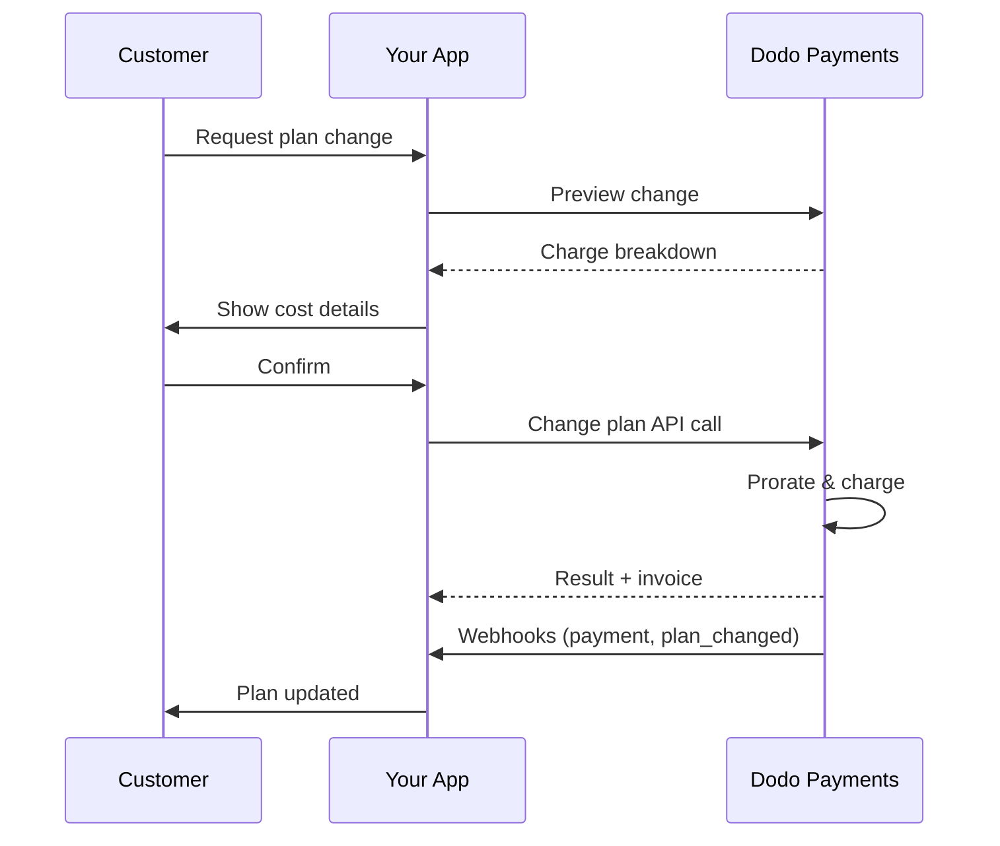
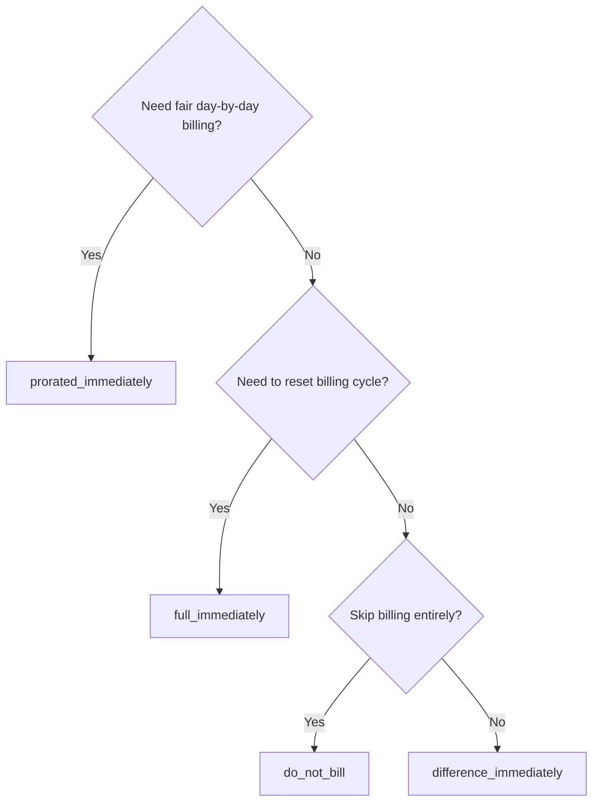
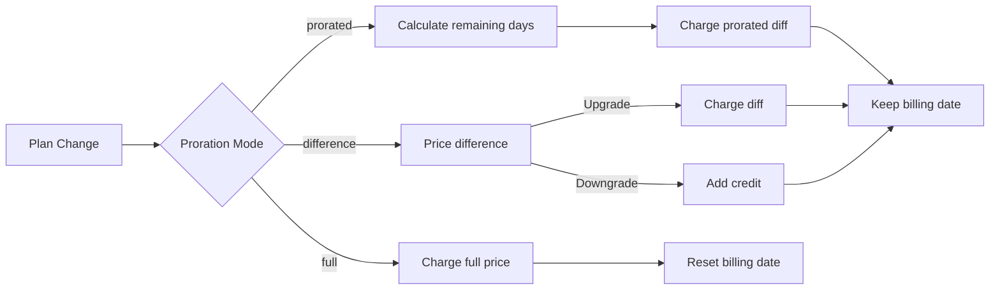

<CardGroup cols={3}>
<Card title="Change Plan API" icon="code" href="/api-reference/subscriptions/change-plan">
  Full API docs for updating subscriptions.
</Card>
<Card title="Plan Change Preview" icon="eye" href="/api-reference/subscriptions/preview-change-plan">
  See charge amounts before changing plans.
</Card>
<Card title="Integration Guide" icon="book" href="/developer-resources/subscription-integration-guide">
  Step-by-step subscription setup.
</Card>
</CardGroup>

## What is a subscription upgrade or downgrade?

Changing plans lets you move a customer between subscription tiers or quantities. Use it to:
- Align pricing with usage or features
- Move from monthly to annual (or vice versa)
- Adjust quantity for seat-based products

<Info>
Plan changes can trigger an immediate charge depending on the proration mode you choose.
</Info>

## When to use plan changes

- Upgrade when a customer needs more features, usage, or seats
- Downgrade when usage decreases
- Migrate users to a new product or price without cancelling their subscription

## Plan Change Flow



## Prerequisites

Before implementing subscription plan changes, ensure you have:

- A Dodo Payments merchant account with active subscription products
- API credentials (API key and webhook secret key) from the dashboard
- An existing active subscription to modify
- Webhook endpoint configured to handle subscription events

<Info>
For detailed setup instructions, see our [Integration Guide](/developer-resources/integration-guide#dashboard-setup).
</Info>

## Step-by-Step Implementation Guide

Follow this comprehensive guide to implement subscription plan changes in your application:

<Steps>
<Step title="Understand Plan Change Requirements">
Before implementing, determine:
- Which subscription products can be changed to which others
- What proration mode fits your business model
- How to handle failed plan changes gracefully
- Which webhook events to track for state management

<Tip>
Test plan changes thoroughly in test mode before implementing in production.
</Tip>
</Step>

<Step title="Choose Your Proration Strategy">
Select the billing approach that aligns with your business needs:

<Tabs>
<Tab title="prorated_immediately">
Best for: SaaS applications wanting to charge fairly for unused time
- Calculates exact prorated amount based on remaining cycle time
- Charges a prorated amount based on unused time remaining in the cycle
- Provides transparent billing to customers
</Tab>

<Tab title="difference_immediately">
Best for: Clear upgrade/downgrade scenarios
- Upgrade: Charge immediate difference (e.g., $30→$80 = charge $50)
- Downgrade: Credit remaining value for future renewals
- Simplifies billing logic and customer communication
</Tab>

<Tab title="full_immediately">
Best for: When you want to reset the billing cycle
- Charges full amount of new plan immediately
- Ignores remaining time from old plan
- Useful for annual to monthly transitions
</Tab>

<Tab title="do_not_bill">
Best for: Free migrations, courtesy switches, or absorbing cost differences
- No charges or credits calculated
- Customer moves to the new plan immediately without any billing adjustment
- Billing cycle remains unchanged
</Tab>
</Tabs>
</Step>

<Step title="Implement the Change Plan API">
Use the Change Plan API to modify subscription details:

<ParamField path="subscription_id" type="string" required>
The ID of the active subscription to modify.
</ParamField>

<ParamField path="product_id" type="string" required>
The new product ID to change the subscription to.
</ParamField>

<ParamField path="quantity" type="integer" default="1">
Number of units for the new plan (for seat-based products).
</ParamField>

<ParamField path="proration_billing_mode" type="string" required>
How to handle immediate billing: `prorated_immediately`, `full_immediately`, `difference_immediately`, or `do_not_bill`.
</ParamField>

<ParamField path="addons" type="array">
Optional addons for the new plan. Leaving this empty removes any existing addons.
</ParamField>

<ParamField path="on_payment_failure" type="string">
Controls behavior when the plan change payment fails:
- `prevent_change`: Keep subscription on current plan until payment succeeds
- `apply_change` (default): Apply plan change immediately regardless of payment outcome

If not specified, uses the business-level default setting.
</ParamField>

{/* LOCKED_PATTERN_65fb0fc653d7167e78bd6355ae9c8abf */}
वैकल्पिक **स्टैक्ड** छूट कोड नए प्लान पर लागू करने के लिए (अधिकतम 20, ऐरे क्रम में लागू)। व्यवहार इस पर निर्भर करता है कि आप क्या पास करते हैं:

- **Not provided / `null`** — मौजूदा छूटें `preserve_on_plan_change=true` के साथ सुरक्षित रहती हैं यदि नए उत्पाद पर लागू होती हैं।
- **`[]` (खाली ऐरे)** — सदस्यता से सभी मौजूदा छूटें हटा देता है।
- **`["CODE_A", "CODE_B", ...]`** — किसी भी मौजूदा छूट को इस स्टैक्ड सेट के साथ बदल देता है।
</ParamField>

{/* LOCKED_PATTERN_e9c85b81977c21eeb78ec9d8a7bb6912 */}
**अप्रचलित** — नई इंटीग्रेशन के लिए `discount_codes` को प्राथमिकता दें। यह फ़ील्ड बैकवर्ड संगतता के लिए अभी भी काम करता है, लेकिन इसे उसी अनुरोध में `discount_codes` के साथ संयोजित नहीं किया जा सकता।
</ParamField>

{/* LOCKED_PATTERN_0d738664f87342fd479b900ee4eff497 */}
प्लान परिवर्तन कब लागू करें:
- `immediately` (डिफ़ॉल्ट): प्लान परिवर्तन तुरंत लागू करें
- `next_billing_date`: अगले बिलिंग दिनांक के लिए परिवर्तन शेड्यूल करें। ग्राहक अपना वर्तमान प्लान बिलिंग अवधि समाप्त होने तक बनाए रखता है।

डाउनग्रेड के लिए `next_billing_date` का उपयोग करें ताकि ग्राहक अपनी वर्तमान प्लान लाभों को बिलिंग अवधि के अंत तक रख सकें।
</ParamField>
</Step>

<Step title="Handle Webhook Events">
प्लान परिवर्तन के परिणामों को ट्रैक करने के लिए वेबहूक हैंडलिंग सेट करें:

- `subscription.active`: प्लान परिवर्तन सफल, सदस्यता अपडेट हुई
- `subscription.plan_changed`: सदस्यता प्लान बदला (अपग्रेड/डाउनग्रेड/एडऑन अपडेट)
- `subscription.on_hold`: प्लान परिवर्तन चार्ज विफल, सदस्यता रुकी
- `payment.succeeded`: प्लान परिवर्तन के लिए तत्काल चार्ज सफल
- `payment.failed`: तत्काल चार्ज विफल

<Warning>
हमेशा वेबहूक संकेतों को सत्यापित करें और आइडंपोटेंट इवेंट प्रोसेसिंग लागू करें।
</Warning>
</Step>

<Step title="Update Your Application State">
वेबहूक घटनाओं के आधार पर अपना अनुप्रयोग अपडेट करें:
- नए प्लान के आधार पर सुविधाएं प्रदान/रद्द करें
- नए प्लान विवरण के साथ ग्राहक डैशबोर्ड अपडेट करें
- प्लान परिवर्तनों के बारे में पुष्टिकरण ईमेल भेजें
- ऑडिट उद्देश्यों के लिए बिलिंग परिवर्तन लॉग करें
</Step>

<Step title="Test and Monitor">
अपनी कार्यान्वयन को अच्छी तरह से जांचें:
- विभिन्न परिदृश्यों के साथ सभी प्ररोशन मोड का परीक्षण करें
- वेबहूक हैंडलिंग सही ढंग से काम करता है यह सुनिश्चित करें
- प्लान परिवर्तन सफलता दर की निगरानी करें
- असफल प्लान परिवर्तनों के लिए अलर्ट सेट करें

<Check>
आपकी सदस्यता प्लान परिवर्तन कार्यान्वयन अब प्रोडक्शन उपयोग के लिए तैयार है।
</Check>
</Step>
</Steps>

## प्लान परिवर्तन पूर्वावलोकन

प्लान परिवर्तन के लिए प्रतिबद्ध होने से पहले, ग्राहकों को सही ढंग से दिखाने के लिए प्रीव्यू API का उपयोग करें कि उनसे कितना शुल्क लिया जाएगा:

<Tabs>
<Tab title="Node.js SDK">

```javascript
const preview = await client.subscriptions.previewChangePlan('sub_123', {
  product_id: 'prod_pro',
  quantity: 1,
  proration_billing_mode: 'prorated_immediately'
});

// Show customer the charge before confirming
console.log('Immediate charge:', preview.immediate_charge.summary);
console.log('New plan details:', preview.new_plan);
```

</Tab>

<Tab title="Python SDK">

```python
preview = client.subscriptions.preview_change_plan(
    subscription_id="sub_123",
    product_id="prod_pro",
    quantity=1,
    proration_billing_mode="prorated_immediately"
)

# Show customer the charge before confirming
print("Immediate charge:", preview.immediate_charge.summary)
print("New plan details:", preview.new_plan)
```

</Tab>
</Tabs>

<Tip>
पूर्वावलोकन API का उपयोग करें ताकि पुष्टिकरण डायलॉग बनाए जा सकें जो ग्राहकों को यह दिखाए कि प्लान परिवर्तन की पुष्टि से पहले उनसे कितनी राशि ली जाएगी।
</Tip>

## प्लान चेंज API

एक सक्रिय सदस्यता के लिए उत्पाद, मात्रा और प्ररोशन व्यवहार को संशोधित करने के लिए प्लान चेंज API का उपयोग करें।

### त्वरित प्रारंभ उदाहरण

<Tabs>
  <Tab title="Node.js SDK">

    ```javascript
    import DodoPayments from 'dodopayments';

    const client = new DodoPayments({
      bearerToken: process.env.DODO_PAYMENTS_API_KEY,
      environment: 'test_mode', // defaults to 'live_mode'
    });

    async function changePlan() {
      const result = await client.subscriptions.changePlan('sub_123', {
        product_id: 'prod_new',
        quantity: 3,
        proration_billing_mode: 'prorated_immediately',
        on_payment_failure: 'prevent_change', // Optional: control behavior on payment failure
      });
      console.log(result.status, result.invoice_id, result.payment_id);
    }

    changePlan();
    ```

  </Tab>
  <Tab title="Python SDK">

    ```python
    import os
    from dodopayments import DodoPayments

    client = DodoPayments(
        bearer_token=os.environ.get("DODO_PAYMENTS_API_KEY"),
        environment="test_mode",  # defaults to "live_mode"
    )

    result = client.subscriptions.change_plan(
        subscription_id="sub_123",
        product_id="prod_new",
        quantity=3,
        proration_billing_mode="prorated_immediately",
        on_payment_failure="prevent_change",  # Optional: control behavior on payment failure
    )
    print(result.status, result.get("invoice_id"), result.get("payment_id"))
    ```

  </Tab>
  <Tab title="Go SDK">

    ```go
    package main

    import (
      "context"
      "fmt"
      "github.com/dodopayments/dodopayments-go"
      "github.com/dodopayments/dodopayments-go/option"
    )

    func main() {
      client := dodopayments.NewClient(option.WithBearerToken("YOUR_TOKEN"))
      res, err := client.Subscriptions.ChangePlan(context.TODO(), dodopayments.SubscriptionChangePlanParams{
        SubscriptionID: dodopayments.F("sub_123"),
        ProductID:             dodopayments.F("prod_new"),
        Quantity:              dodopayments.F(int64(3)),
        ProrationBillingMode:  dodopayments.F(dodopayments.SubscriptionChangePlanParamsProrationBillingModeProratedImmediately),
        OnPaymentFailure:      dodopayments.F(dodopayments.OnPaymentFailurePreventChange), // Optional
      })
      if err != nil { panic(err) }
      fmt.Println(res.Status, res.InvoiceID, res.PaymentID)
    }
    ```

  </Tab>
  <Tab title="HTTP">

    ```bash
    curl -X POST "$DODO_API_BASE/subscriptions/sub_123/change-plan" \
      -H "Authorization: Bearer $DODO_PAYMENTS_API_KEY" \
      -H "Content-Type: application/json" \
      -d '{
        "product_id": "prod_new",
        "quantity": 3,
        "proration_billing_mode": "prorated_immediately",
        "on_payment_failure": "prevent_change"
      }'
    ```

  </Tab>
</Tabs>

```json Success
{
  "status": "processing",
  "subscription_id": "sub_123",
  "invoice_id": "inv_789",
  "payment_id": "pay_456",
  "proration_billing_mode": "prorated_immediately"
}
```

<Note>
<code>invoice_id</code> और <code>payment_id</code> जैसी फ़ील्ड्स केवल तभी रिटर्न की जाती हैं जब प्लान परिवर्तन के दौरान तत्काल चार्ज और/या इनवॉइस बनाई जाती है। परिणामों की पुष्टि के लिए हमेशा वेबहूक घटनाओं पर भरोसा करें (उदा., <code>payment.succeeded</code>, <code>subscription.plan_changed</code>)।
</Note>

<Warning>
यदि तत्काल चार्ज विफल होता है, तो सदस्यता `subscription.on_hold` में जा सकती है जब तक कि भुगतान सफल नहीं हो जाता।
</Warning>

## एडऑन्स का प्रबंधन

जब आप सदस्यता प्लानों को बदलते हैं, तो आप एडऑन्स को भी संशोधित कर सकते हैं:

```javascript
// Add addons to the new plan
await client.subscriptions.changePlan('sub_123', {
  product_id: 'prod_new',
  quantity: 1,
  proration_billing_mode: 'difference_immediately',
  addons: [
    { addon_id: 'addon_123', quantity: 2 }
  ]
});

// Remove all existing addons
await client.subscriptions.changePlan('sub_123', {
  product_id: 'prod_new',
  quantity: 1,
  proration_billing_mode: 'difference_immediately',
  addons: [] // Empty array removes all existing addons
});
```

<Info>
प्ररोशन गणना में एडऑन्स शामिल होते हैं और चुने गए प्ररोशन मोड के अनुसार चार्ज किया जाएगा।
</Info>

## छूट कोड लागू करना

सदस्यता प्लानों में परिवर्तन करते समय आप एक या अधिक **स्टैक्ड छूट कोड** लागू कर सकते हैं (अधिकतम 20, ऐरे क्रम में लागू)। यह अपग्रेड या माइग्रेशन पर प्रोमोशनल मूल्य पेश करने के लिए उपयोगी है।

<Tabs>
<Tab title="Node.js SDK">

```javascript
// Apply stacked discount codes during plan change
await client.subscriptions.changePlan('sub_123', {
  product_id: 'prod_pro',
  quantity: 1,
  proration_billing_mode: 'prorated_immediately',
  discount_codes: ['UPGRADE20']
});
```

</Tab>
<Tab title="Python SDK">

```python
# Apply stacked discount codes during plan change
client.subscriptions.change_plan(
    subscription_id="sub_123",
    product_id="prod_pro",
    quantity=1,
    proration_billing_mode="prorated_immediately",
    discount_codes=["UPGRADE20"]
)
```

</Tab>
<Tab title="HTTP">

```bash
curl -X POST "$DODO_API_BASE/subscriptions/sub_123/change-plan" \
  -H "Authorization: Bearer $DODO_PAYMENTS_API_KEY" \
  -H "Content-Type: application/json" \
  -d '{
    "product_id": "prod_pro",
    "quantity": 1,
    "proration_billing_mode": "prorated_immediately",
    "discount_codes": ["UPGRADE20"]
  }'
```

</Tab>
</Tabs>

### प्लान परिवर्तन पर छूट व्यवहार

| `discount_codes` मान | व्यवहार |
|------------------------|----------|
| Not provided / `null` | मौजूदा छूटें `preserve_on_plan_change=true` के साथ स्वतः सुरक्षित रहती हैं यदि नए उत्पाद पर लागू होती हैं। |
| `[]` (खाली ऐरे) | **सभी** मौजूदा छूटें सदस्यता से हटा दी जाती हैं। |
| `["CODE_A", "CODE_B", ...]` | इस स्टैक्ड सेट के साथ किसी भी मौजूदा छूट को बदल देता है, अनुक्रम में मान्य और लागू। |

<Info>
इस एंडपॉइंट पर एकल `discount_code` फ़ील्ड **अप्रचलित** है लेकिन अभी भी बैकवर्ड संगतता के लिए काम करता है — मौजूदा इंटीग्रेशन को तुरंत बदलने की आवश्यकता नहीं है। इसे उसी अनुरोध में `discount_codes` के साथ संयोजित नहीं किया जा सकता। जब सुविधाजनक हो तब ऐरे रूप में माइग्रेट करें।
</Info>

<Tip>
ग्राहकों को यह दिखाने के लिए [पूर्वावलोकन प्लान चेंज API](/api-reference/subscriptions/preview-change-plan) का उपयोग करें कि वे प्लान परिवर्तन की पुष्टि से पहले कितना बचाएंगे।
</Tip>

## प्ररोशन मोड्स

जब प्लान बदलते हैं तो ग्राहक से कैसे बिल करें, यह चुनें:

#### `prorated_immediately`
- वर्तमान चक्र में आंशिक अंतर के लिए चार्ज करता है
- यदि परीक्षण में है, तो तुरंत चार्ज करता है और अब नए प्लान पर स्विच करता है
- डाउनग्रेड: भविष्य के नवीनीकरणों पर लागू होने के लिए एक प्ररोक्षित क्रेडिट उत्पन्न कर सकता है

#### `full_immediately`
- नए प्लान की पूरी राशि को तुरंत चार्ज करता है
- पुराने प्लान के शेष समय की उपेक्षा करता है

<Info>
<code>difference_immediately</code> का उपयोग करके डाउनग्रेड्स द्वारा बनाए गए क्रेडिट सदस्यता-स्कोप्ड होते हैं और <a href="/features/credit-based-billing">क्रेडिट-आधारित बिलिंग</a> अधिकारों से भिन्न होते हैं। वे स्वतः उसी सदस्यता के भविष्य के नवीनीकरणों पर लागू होते हैं और सदस्यताओं के बीच हस्तांतरणीय नहीं होते।
</Info>

#### `difference_immediately`
- अपग्रेड: पुराने और नए प्लान के बीच मूल्य अंतर को तुरंत चार्ज करें
- डाउनग्रेड: शेष मूल्य को सदस्यता के लिए आंतरिक क्रेडिट के रूप में जोड़ें और नवीनीकरणों पर ऑटो-लागू करें

#### `do_not_bill`
- कोई चार्ज या क्रेडिट की गणना नहीं की जाती
- ग्राहक बिना किसी बिलिंग समायोजन के तुरंत नए प्लान पर स्विच करता है
- बिलिंग चक्र अपरिवर्तित रहता है
- शिष्टाचार माइग्रेशन, मुफ्त प्लान स्विच, या लागत अंतर को अवशोषित करने के लिए सबसे अच्छा

| फ़ीचर | `prorated_immediately` | `difference_immediately` | `full_immediately` | `do_not_bill` |
|---------|----------------------|------------------------|-------------------|--------------|
| **अपग्रेड चार्ज** | शेष दिनों के लिए प्रायोजित अंतर | प्लानों के बीच पूरी मूल्य दूरी | नए प्लान की पूरी कीमत | कोई चार्ज नहीं |
| **डाउनग्रेड क्रेडिट** | शेष दिनों के लिए प्रायोजित क्रेडिट | पूर्ण मूल्य दूरी को क्रेडिट के रूप में जोड़ें | कोई क्रेडिट नहीं | कोई क्रेडिट नहीं |
| **बिलिंग चक्र** | अपरिवर्तित | अपरिवर्तित | आज तक रीसेट | अपरिवर्तित |
| **परीक्षण व्यवहार** | ट्रायल समाप्त होता है, तुरंत चार्ज करता है | ट्रायल समाप्त होता है, तुरंत चार्ज करता है | ट्रायल समाप्त होता है, पूरी राशि चार्ज करता है | ट्रायल समाप्त होता है, कोई चार्ज नहीं |
| **के लिए सबसे अच्छा** | उचित समय-आधारित बिलिंग | सरल अपग्रेड/डाउनग्रेड गणित | बिलिंग चक्रों को रीसेट करना | मुफ्त माइग्रेशन्स या शिष्टाचार स्विच |
| **जटिलता** | मध्यम (दिन गणना) | कम (सरल घटाव) | कम (पूर्ण चार्ज) | कोई नहीं |



### उदाहरण परिदृश्य

इन आदर्श संख्याओं का निरंतर उपयोग करें:
- वर्तमान प्लान: **बेसिक** $30/माह
- अपग्रेड लक्ष्य: **प्रो** $80/माह
- डाउनग्रेड लक्ष्य (प्रो से): **स्टार्टर** $20/माह
- बिलिंग चक्र: **30 दिन** जनवरी **1** को शुरू हुआ
- प्लान परिवर्तन **जनवरी 16** को होता है (15 दिन बचे हुए, 15 दिन उपयोग किए गए)

<AccordionGroup>
  <Accordion title="Upgrade: Basic ($30) → Pro ($80) with prorated_immediately">

    ```
    Step 1: Calculate unused credit from current plan
      Unused days = 15 out of 30 days
      Credit = $30 × (15/30) = $15.00

    Step 2: Calculate prorated cost of new plan
      Remaining days = 15 out of 30 days
      New plan cost = $80 × (15/30) = $40.00

    Step 3: Calculate immediate charge
      Charge = New plan cost − Credit
      Charge = $40.00 − $15.00 = $25.00

    → Customer pays $25.00 now
    → Next renewal (Feb 1): $80.00/month
    ```

    ```javascript
    await client.subscriptions.changePlan('sub_123', {
      product_id: 'prod_pro',
      quantity: 1,
      proration_billing_mode: 'prorated_immediately'
    })
    ```

  </Accordion>

  <Accordion title="Downgrade: Pro ($80) → Starter ($20) with prorated_immediately">

    ```
    Step 1: Calculate unused credit from current plan
      Unused days = 15 out of 30 days
      Credit = $80 × (15/30) = $40.00

    Step 2: Calculate prorated cost of new plan
      Remaining days = 15 out of 30 days
      New plan cost = $20 × (15/30) = $10.00

    Step 3: Calculate credit balance
      Credit = $40.00 − $10.00 = $30.00

    → No charge — $30.00 credit added to subscription
    → Credit auto-applies to future renewals
    → Next renewal (Feb 1): $20.00 − $30.00 credit = $0.00
    → Following renewal (Mar 1): $20.00 − $10.00 remaining credit = $10.00
    ```

    ```javascript
    await client.subscriptions.changePlan('sub_123', {
      product_id: 'prod_starter',
      quantity: 1,
      proration_billing_mode: 'prorated_immediately'
    })
    ```

  </Accordion>

  <Accordion title="Upgrade: Basic ($30) → Pro ($80) with difference_immediately">

    ```
    Immediate charge = New plan price − Old plan price
                     = $80 − $30
                     = $50.00

    → Customer pays $50.00 now (regardless of cycle position)
    → Next renewal (Feb 1): $80.00/month
    ```

    ```javascript
    await client.subscriptions.changePlan('sub_123', {
      product_id: 'prod_pro',
      quantity: 1,
      proration_billing_mode: 'difference_immediately'
    })
    ```

  </Accordion>

  <Accordion title="Downgrade: Pro ($80) → Starter ($20) with difference_immediately">

    ```
    Credit = Old plan price − New plan price
           = $80 − $20
           = $60.00

    → No charge — $60.00 credit added to subscription
    → Credit auto-applies to future renewals
    → Next renewal: $20.00 − $20.00 (from credit) = $0.00
    → Following renewal: $20.00 − $20.00 (from credit) = $0.00
    → Third renewal: $20.00 − $20.00 (from remaining credit) = $0.00
    ```

    ```javascript
    await client.subscriptions.changePlan('sub_123', {
      product_id: 'prod_starter',
      quantity: 1,
      proration_billing_mode: 'difference_immediately'
    })
    ```

  </Accordion>

  <Accordion title="Upgrade: Basic ($30) → Pro ($80) with full_immediately">

    ```
    Immediate charge = Full new plan price = $80.00

    → Customer pays $80.00 now
    → No credit for unused time on old plan
    → Billing cycle resets to today (January 16)
    → Next renewal: February 16 at $80.00/month
    ```

    ```javascript
    await client.subscriptions.changePlan('sub_123', {
      product_id: 'prod_pro',
      quantity: 1,
      proration_billing_mode: 'full_immediately'
    })
    ```

  </Accordion>

  <Accordion title="Mid-cycle upgrade with add-ons using prorated_immediately">

    ```
    Current: Basic plan ($30/month), no add-ons
    New: Pro plan ($80/month) + Extra Seats add-on ($10/seat × 3 seats = $30/month)
    Change on day 16 of 30 (15 days remaining)

    Step 1: Credit from current plan
      Credit = $30 × (15/30) = $15.00

    Step 2: Prorated cost of new plan + add-ons
      New plan = $80 × (15/30) = $40.00
      Add-ons = $30 × (15/30) = $15.00
      Total new = $55.00

    Step 3: Immediate charge
      Charge = $55.00 − $15.00 = $40.00

    → Customer pays $40.00 now
    → Next renewal: $80.00 + $30.00 = $110.00/month
    ```

    ```javascript
    await client.subscriptions.changePlan('sub_123', {
      product_id: 'prod_pro',
      quantity: 1,
      proration_billing_mode: 'prorated_immediately',
      addons: [
        { addon_id: 'addon_seats', quantity: 3 }
      ]
    })
    ```

  </Accordion>
</AccordionGroup>

### प्रत्येक मोड कैसे बिलिंग प्रोसेस करता है



<Tip>
उचित-समय पर लेखांकन के लिए `prorated_immediately` चुनें; बिलिंग पुनः आरंभ करने के लिए `full_immediately` चुनें; साधारण अपग्रेड्स के लिए `difference_immediately` और डाउनग्रेड्स पर स्वचालित क्रेडिट का चयन करें; या किसी भी बिलिंग समायोजन के बिना प्लान बदलने के लिए `do_not_bill` का उपयोग करें।
</Tip>

## भुगतान विफलताओं को संभालना

जब प्लान परिवर्तन भुगतान विफल होता है तो क्या होता है इसे नियंत्रित करने के लिए `on_payment_failure` पैरामीटर का उपयोग करें।

### भुगतान विफलता मोड

<Tabs>
<Tab title="prevent_change (Recommended for critical upgrades)">
**व्यवहार**: जब तक भुगतान सफल नहीं होता तब तक सदस्यता वर्तमान प्लान पर बनी रहती है।

- प्लान परिवर्तन को "लंबित" के रूप में चिह्नित किया जाता है
- ग्राहक अपनी वर्तमान योजना तक पहुंच बनाए रखता है
- सदस्यता सफल भुगतान के बाद ही `active` स्थिति में जाती है
- तब उपयोगी जब आप उन्नत सुविधाओं को प्रदान करने से पहले भुगतान सुनिश्चित करना चाहते हैं

```javascript
await client.subscriptions.changePlan('sub_123', {
  product_id: 'prod_pro',
  quantity: 1,
  proration_billing_mode: 'prorated_immediately',
  on_payment_failure: 'prevent_change'
});
```

</Tab>

<Tab title="apply_change (Default)">
**व्यवहार**: भुगतान परिणाम की परवाह किए बिना प्लान परिवर्तन तुरंत लागू होता है।

- भुगतान विफल होने पर भी प्लान परिवर्तन लागू होता है
- ग्राहक तुरंत नए प्लान तक पहुंच प्राप्त करता है
- भुगतान विफल होने पर सदस्यता `on_hold` में जा सकती है
- गैर-महत्वपूर्ण अपग्रेड्स के लिए अच्छा या जब आप ग्राहक पर विश्वास करते हैं

```javascript
await client.subscriptions.changePlan('sub_123', {
  product_id: 'prod_pro',
  quantity: 1,
  proration_billing_mode: 'prorated_immediately',
  on_payment_failure: 'apply_change' // This is the default
});
```

</Tab>
</Tabs>

<Info>
यदि निर्दिष्ट नहीं है, तो `on_payment_failure` पैरामीटर आपके डैशबोर्ड में कॉन्फ़िगर किए गए व्यवसाय-स्तरीय डिफ़ॉल्ट सेटिंग का उपयोग करता है।
</Info>

### कब प्रत्येक मोड का उपयोग करना चाहिए

| परिदृश्य | अनुशंसित मोड | कारण |
|----------|------------------|--------|
| प्रीमियम सुविधाओं के लिए अपग्रेड | `prevent_change` | पहुंच प्रदान करने से पहले भुगतान सुनिश्चित करें |
| मात्रा में वृद्धि (अधिक सीटें) | `prevent_change` | भुगतान के बिना उपयोग को रोकें |
| योजनाएं डाउनग्रेड करना | `apply_change` | ग्राहक खर्च को कम कर रहा है |
| विश्वसनीय एंटरप्राइज़ ग्राहक | `apply_change` | गैर-भुगतान का जोखिम कम है |
| परीक्षण से भुगतान परिवर्तन | `prevent_change` | महत्वपूर्ण भुगतान क्षण |

## वेबहूक हैंडलिंग

प्लान परिवर्तन और भुगतान की पुष्टि करने के लिए वेबहूक के माध्यम से सदस्यता स्थिति ट्रैक करें।

### इवेंट प्रकार जिन्हें संभालना है
- `subscription.active`: सदस्यता सक्रिय की गई
- `subscription.plan_changed`: सदस्यता प्लान बदला गया (अपग्रेड/डाउनग्रेड/एडऑन परिवर्तन)
- `subscription.on_hold`: चार्ज विफल, सदस्यता रुकी
- `subscription.renewed`: नवीनीकरण सफल
- `payment.succeeded`: प्लान परिवर्तन या नवीनीकरण के लिए भुगतान सफल
- `payment.failed`: भुगतान विफल

<Info>
हम अनुशंसा करते हैं कि सदस्यता घटनाओं से व्यावसायिक तर्क चलाएं और पुष्टिकरण और पुनः मेल मिलाप के लिए भुगतान घटनाओं का उपयोग करें।
</Info>

### संकेतों को सत्यापित करें और इरादों को संभालें

<Tabs>
  <Tab title="Next.js Route Handler">

    ```javascript
    import { NextRequest, NextResponse } from 'next/server';
    
    export async function POST(req) {
      const webhookId = req.headers.get('webhook-id');
      const webhookSignature = req.headers.get('webhook-signature');
      const webhookTimestamp = req.headers.get('webhook-timestamp');
      const secret = process.env.DODO_WEBHOOK_SECRET;
    
      const payload = await req.text();
      // verifySignature is a placeholder – in production, use a Standard Webhooks library
      const { valid, event } = await verifySignature(
        payload,
        { id: webhookId, signature: webhookSignature, timestamp: webhookTimestamp },
        secret
      );
      if (!valid) return NextResponse.json({ error: 'Invalid signature' }, { status: 400 });
    
      switch (event.type) {
        case 'subscription.active':
          // mark subscription active in your DB
          break;
        case 'subscription.plan_changed':
          // refresh entitlements and reflect the new plan in your UI
          break;
        case 'subscription.on_hold':
          // notify user to update payment method
          break;
        case 'subscription.renewed':
          // extend access window
          break;
        case 'payment.succeeded':
          // reconcile payment for plan change
          break;
        case 'payment.failed':
          // log and alert
          break;
        default:
          // ignore unknown events
          break;
      }
    
      return NextResponse.json({ received: true });
    }
    ```

  </Tab>
  <Tab title="Express.js">

    ```javascript
    import express from 'express';
    
    const app = express();
    app.post('/webhooks/dodo', express.raw({ type: 'application/json' }), async (req, res) => {
      const webhookId = req.header('webhook-id');
      const webhookSignature = req.header('webhook-signature');
      const webhookTimestamp = req.header('webhook-timestamp');
      const secret = process.env.DODO_WEBHOOK_SECRET;
      const payload = req.body.toString('utf8');
    
      const { valid, event } = await verifySignature(
        payload,
        { id: webhookId, signature: webhookSignature, timestamp: webhookTimestamp },
        secret
      );
      if (!valid) return res.status(400).send('Invalid signature');
    
      // handle events like above
      res.json({ received: true });
    });
    
    app.listen(3000);
    ```

  </Tab>
</Tabs>

<Note>
विस्तृत पेलोड स्कीमाओं के लिए, देखें <a href="/developer-resources/webhooks/intents/subscription">सदस्यता वेबहूक पेलोड</a> और <a href="/developer-resources/webhooks/intents/payment">भुगतान वेबहूक पेलोड</a>।
</Note>

## सर्वोत्तम अभ्यास

विश्वसनीय सदस्यता प्लान परिवर्तनों के लिए इन अनुशंसाओं का पालन करें:

### प्लान परिवर्तन रणनीति
- **पूरी तरह से परीक्षण करें**: हमेशा उत्पादन से पहले परीक्षण मोड में प्लान परिवर्तनों का परीक्षण करें
- **प्ररोशन को सावधानी से चुनें**: उस प्ररोशन मोड को चुनें जो आपके व्यवसाय मॉडल के साथ मेल खाता है
- **त्रुटियों को अनुग्रहपूर्वक संभालें**: उचित त्रुटि प्रबंधन और पुनः प्रयास करने का तर्क लागू करें
- **सफलता दर की निगरानी करें**: प्लान परिवर्तन सफलता/विफलता दर को ट्रैक करें और समस्याओं की जांच करें

### वेबहूक कार्यान्वयन
- **संकेतों को सत्यापित करें**: प्रमाणीकरण सुनिश्चित करने के लिए हमेशा वेबहूक संकेतों को सत्यापित करें
- **आइडंपोटेंसी लागू करें**: डुप्लिकेट वेबहूक घटनाओं को अनुग्रहपूर्वक संभालें
- **असिंक्रोनस रूप से प्रक्रिया करें**: भारी परिचालन के साथ वेबहूक प्रतिक्रिया को अवरोधित न करें
- **सब कुछ लॉग करें**: डीबगिंग और ऑडिट उद्देश्यों के लिए विस्तृत लॉग्स रखें

### उपयोगकर्ता अनुभव
- **स्पष्ट रूप से संवाद करें**: ग्राहकों को बिलिंग परिवर्तनों और समय की जानकारी दें
- **पुष्टीकरण प्रदान करें**: सफल प्लान परिवर्तनों के लिए ईमेल पुष्टिकरण भेजें
- **एज केस को संभालें**: परीक्षण अवधि, प्ररोशन, और विफल भुगतान को ध्यान में रखें
- **UI को तुरंत अपडेट करें**: अपनी एप्लिकेशन इंटरफ़ेस में प्लान परिवर्तन को प्रतिबिंबित करें

## सामान्य समस्याएं और समाधान

सदस्यता प्लान परिवर्तनों के दौरान आने वाली सामान्य समस्याओं का समाधान करें:

<AccordionGroup>
<Accordion title="Charge created but subscription not updated">
**लक्षण**: एपीआई कॉल सफल होती है लेकिन सदस्यता पुराने प्लान पर बनी रहती है

**आम कारण**:
- वेबहूक प्रोसेसिंग विफल हो गई या विलंबित हुई
- वेबहूक प्राप्त करने के बाद अनुप्रयोग की स्थिति अपडेट नहीं हुई
- स्थिति अपडेट के दौरान डेटाबेस लेनदेन की समस्याएं

**समाधान**:
- पुनः प्रयास लॉजिक वाले मजबूत वेबहूक हैंडलिंग को लागू करें
- स्थिति अपडेट के लिए आइडंपोटेंट कार्यों का उपयोग करें
- मिस्ड वेबहूक घटनाओं का पता लगाने और अलर्ट जोड़ने के लिए निगरानी करें
- सत्यापित करें कि वेबहूक एंडपॉइंट पहुंच योग्य है और सही से जवाब दे रहा है
</Accordion>

<Accordion title="Credits not applied after downgrade">
**लक्षण**: ग्राहक डाउनग्रेड करता है लेकिन क्रेडिट बैलेंस नहीं देखता

**आम कारण**:
- प्ररोशन मोड अपेक्षाएँ: डाउनग्रेड्स पूरा प्लान मूल्य अंतर को `difference_immediately` के साथ क्रेडिट करता है, जबकि `prorated_immediately` चक्र में शेष समय के आधार पर प्ररोक्षित क्रेडिट बनाता है
- क्रेडिट्स सदस्यता विशेष हैं और सदस्यताओं के बीच स्थानांतरित नहीं होते
- ग्राहक डैशबोर्ड में क्रेडिट बैलेंस नहीं दिखाई देता

**समाधान**:
- डाउनग्रेड्स के लिए `difference_immediately` का उपयोग करें जब आप ऑटोमैटिक क्रेडिट चाहते हैं
- ग्राहकों को समझाएं कि क्रेडिट्स उसी सदस्यता के भविष्य के नवीनीकरणों पर लागू होते हैं
- क्रेडिट बैलेंस दिखाने के लिए ग्राहक पोर्टल को लागू करें
- लागू क्रेडिट्स को देखने के लिए अगला इनवॉइस पूर्वावलोकन करें
</Accordion>

<Accordion title="Webhook signature verification fails">
**लक्षण**: वेबहूक घटनाएं अमान्य हस्ताक्षर के कारण अस्वीकृत हो गईं

**आम कारण**:
- गलत वेबहूक गुप्त कुंजी
- हस्ताक्षर सत्यापन से पहले कच्चे अनुरोध बॉडी को संशोधित किया गया
- गलत हस्ताक्षर सत्यापन एल्गोरिदम

**समाधान**:
- सुनिश्चित करें कि आप डैशबोर्ड से सही `DODO_WEBHOOK_SECRET` का उपयोग कर रहे हैं
- किसी भी JSON पार्सिंग मिडलवेयर से पहले कच्चे अनुरोध बॉडी को पढ़ें
- अपने प्लेटफ़ॉर्म के लिए मानक वेबहूक सत्यापन पुस्तकालय का उपयोग करें
- विकास वातावरण में वेबहूक हस्ताक्षर सत्यापन का परीक्षण करें
</Accordion>

<Accordion title="Plan change fails with 422 error">
**लक्षण**: एपीआई 422 अप्रामाणिक इकाई त्रुटि वापस करता है

**आम कारण**:
- अमान्य सदस्यता आईडी या उत्पाद आईडी
- सदस्यता सक्रिय स्थिति में नहीं है
- आवश्यक पैरामीटर गायब हैं
- प्लान परिवर्तनों के लिए उत्पाद उपलब्ध नहीं है

**समाधान**:
- सत्यापित करें कि सदस्यता मौजूद है और सक्रिय है
- जांचें कि उत्पाद आईडी मान्य और उपलब्ध है
- सुनिश्चित करें कि सभी आवश्यक पैरामीटर प्रदान किए गए हैं
- पैरामीटर आवश्यकताओं के लिए एपीआई दस्तावेज़ की समीक्षा करें
</Accordion>

<Accordion title="Immediate charge fails during plan change">
**लक्षण**: प्लान परिवर्तन आरंभ किया गया लेकिन तत्काल चार्ज विफल

**आम कारण**:
- ग्राहक के भुगतान विधि पर अपर्याप्त धन
- भुगतान विधि समाप्त या अमान्य
- बैंक ने लेन-देन को अस्वीकार कर दिया
- धोखाधड़ी का पता लगाना चार्ज को अवरुद्ध करता है

**समाधान**:
- `payment.failed` वेबहूक घटनाओं को ठीक से संभालें
- ग्राहक को भुगतान विधि को अपडेट करने के लिए सूचित करें
- अस्थायी विफलताओं के लिए पुनः प्रयास लॉजिक लागू करें
- असफल तत्काल शुल्क के साथ प्लान परिवर्तन की अनुमति देने पर विचार करें
</Accordion>

<Accordion title="Subscription on hold after plan change">
**लक्षण**: प्लान परिवर्तन चार्ज विफल होता है और सदस्यता `on_hold` स्थिति में जाती है

**क्या होता है**:
जब प्लान परिवर्तन चार्ज विफल होता है, तो सदस्यता स्वतः `on_hold` स्थिति में डाल दी जाती है। सदस्यता तब तक स्वतः नवीनीकरण नहीं करेगी जब तक कि भुगतान विधि को अपडेट नहीं किया जाता।

**समाधान**: सदस्यता को पुनः सक्रिय करने के लिए भुगतान विधि को अपडेट करें

एक असफल प्लान परिवर्तन के बाद `on_hold` स्थिति से सदस्यता को पुनः सक्रिय करने के लिए:

1. **अपडेट भुगतान विधि** अपडेट भुगतान विधि एपीआई का उपयोग करके
2. **स्वतः चार्ज निर्माण**: एपीआई बकाया राशि के लिए स्वतः चार्ज बनाता है
3. **इनवॉइस जेनरेशन**: चार्ज के लिए एक इनवॉइस जेनरेट की जाती है
4. **भुगतान प्रोसेसिंग**: नई भुगतान विधि का उपयोग करके भुगतान की प्रक्रिया की जाती है
5. **पुनः सक्रियता**: सफल भुगतान पर, सदस्यता `active` स्थिति में पुनः सक्रिय होती है

<CodeGroup>

```javascript Node.js
// Reactivate subscription from on_hold after failed plan change
async function reactivateAfterFailedPlanChange(subscriptionId) {
  // Update payment method - automatically creates charge for remaining dues
  const response = await client.subscriptions.updatePaymentMethod(subscriptionId, {
    type: 'new',
    return_url: 'https://example.com/return'
  });
  
  if (response.payment_id) {
    console.log('Charge created for remaining dues:', response.payment_id);
    console.log('Payment link:', response.payment_link);
    
    // Redirect customer to payment_link to complete payment
    // Monitor webhooks for:
    // 1. payment.succeeded - charge succeeded
    // 2. subscription.active - subscription reactivated
  }
  
  return response;
}

// Or use existing payment method if available
async function reactivateWithExistingPaymentMethod(subscriptionId, paymentMethodId) {
  const response = await client.subscriptions.updatePaymentMethod(subscriptionId, {
    type: 'existing',
    payment_method_id: paymentMethodId
  });
  
  // Monitor webhooks for payment.succeeded and subscription.active
  return response;
}
```

```python Python
# Reactivate subscription from on_hold after failed plan change
def reactivate_after_failed_plan_change(subscription_id):
    # Update payment method - automatically creates charge for remaining dues
    response = client.subscriptions.update_payment_method(
        subscription_id=subscription_id,
        type="new",
        return_url="https://example.com/return"
    )
    
    if response.payment_id:
        print("Charge created for remaining dues:", response.payment_id)
        print("Payment link:", response.payment_link)
        
        # Redirect customer to payment_link to complete payment
        # Monitor webhooks for:
        # 1. payment.succeeded - charge succeeded
        # 2. subscription.active - subscription reactivated
    
    return response

# Or use existing payment method if available
def reactivate_with_existing_payment_method(subscription_id, payment_method_id):
    response = client.subscriptions.update_payment_method(
        subscription_id=subscription_id,
        type="existing",
        payment_method_id=payment_method_id
    )
    
    # Monitor webhooks for payment.succeeded and subscription.active
    return response
```

</CodeGroup>

**वेबहूक घटनाएं जिन्हें मॉनिटर करना चाहिए**:
- `subscription.on_hold`: सदस्यता होल्ड में रखी गई (जब प्लान परिवर्तन चार्ज विफल प्राप्त होता है)
- `payment.succeeded`: बकाया राशि के लिए भुगतान सफल (भुगतान विधि अपडेट के बाद)
- `subscription.active`: सफल भुगतान के बाद सदस्यता पुनः सक्रिय की गई

**सर्वोत्तम अभ्यास**:
- जब प्लान परिवर्तन चार्ज विफल होता है तो ग्राहकों को तुरंत सूचित करें
- अपनी भुगतान विधि को अपडेट करने के तरीके के स्पष्ट निर्देश प्रदान करें
- पुनः सक्रियता स्थिति को ट्रैक करने के लिए वेबहूक घटनाओं की निगरानी करें
- अस्थायी भुगतान विफलताओं के लिए स्वतः प्रयास लॉजिक को लागू करने पर विचार करें

<Card title="Update Payment Method API Reference" icon="code" href="/api-reference/subscriptions/update-payment-method">
भुगतान विधियां अपडेट करने और सदस्यता पुनः सक्रिय करने के लिए संपूर्ण एपीआई दस्तावेज़ देखें।
</Card>
</Accordion>
</AccordionGroup>

## अपने कार्यान्वयन को परीक्षण करें

अपनी सदस्यता प्लान परिवर्तन कार्यान्वयन का पूरी तरह से परीक्षण करने के लिए इन चरणों का पालन करें:

<Steps>
<Step title="Set up test environment">
- परीक्षण API कुंजी और परीक्षण उत्पादों का उपयोग करें
- विभिन्न प्लान प्रकारों के साथ परीक्षण सदस्यताएं बनाएं
- परीक्षण वेबहूक एंडपॉइंट को कॉन्फ़िगर करें
- निगरानी और लॉगिंग सेट करें
</Step>

<Step title="Test different proration modes">
- विभिन्न बिलिंग चक्र पदों के साथ `prorated_immediately` का परीक्षण करें
- अपग्रेड और डाउनग्रेड के लिए `difference_immediately` का परीक्षण करें
- बिलिंग चक्रों को रीसेट करने के लिए `full_immediately` का परीक्षण करें
- कोई चार्ज/कोई क्रेडिट प्लान स्विच के लिए `do_not_bill` का परीक्षण करें
- क्रेडिट गणनाओं को सही से सत्यापित करें
</Step>

<Step title="Test webhook handling">
- सुनिश्चित करें कि सभी प्रासंगिक वेबहूक घटनाएं प्राप्त हुई हैं
- वेबहूक हस्ताक्षर सत्यापन का परीक्षण करें
- डुप्लिकेट वेबहूक घटनाओं को अनुग्रहपूर्वक संभालें
- वेबहूक प्रोसेसिंग विफलता परिदृश्यों का परीक्षण करें
</Step>

<Step title="Test error scenarios">
- अमान्य सदस्यता आईडी के साथ परीक्षण करें
- समाप्त भुगतान विधियों के साथ परीक्षण करें
- नेटवर्क विफलताओं और टाइमआउट के साथ परीक्षण करें
- अपर्याप्त धन के साथ परीक्षण करें
</Step>

<Step title="Monitor in production">
- असफल प्लान परिवर्तनों के लिए अलर्ट सेट करें
- वेबहूक प्रोसेसिंग समय की निगरानी करें
- प्लान परिवर्तन सफलता दर को ट्रैक करें
- प्लान परिवर्तन समस्याओं के लिए ग्राहक समर्थन टिकट की समीक्षा करें
</Step>
</Steps>

## त्रुटि हैंडलिंग

अपने कार्यान्वयन में सामान्य एपीआई त्रुटियों को अनुग्रहपूर्वक संभालें:

### HTTP स्थिति कोड

<AccordionGroup>
<Accordion title="200 OK">
प्लान परिवर्तन अनुरोध सफलतापूर्वक संसाधित किया गया। सदस्यता अपडेट हो रही है और भुगतान प्रक्रिया शुरू हो गई है।
</Accordion>

<Accordion title="400 Bad Request">
अमान्य अनुरोध पैरामीटर। सुनिश्चित करें कि सभी आवश्यक फ़ील्ड प्रदान किए गए हैं और सही ढंग से स्वरूपित हैं।
</Accordion>

<Accordion title="401 Unauthorized">
अमान्य या गायब एपीआई कुंजी। सुनिश्चित करें कि आपका `DODO_PAYMENTS_API_KEY` सही है और उसके पास उचित अनुमतियां हैं।
</Accordion>

<Accordion title="404 Not Found">
सदस्यता आईडी नहीं मिली या आपके खाते से संबंधित नहीं है।
</Accordion>

<Accordion title="422 Unprocessable Entity">
सदस्यता बदली नहीं जा सकती (उदाहरण के लिए, पहले ही रद्द कर दी गई, उत्पाद उपलब्ध नहीं है, आदि)।
</Accordion>

<Accordion title="500 Internal Server Error">
सर्वर त्रुटि हुई। थोड़ी देर के बाद अनुरोध को दोबारा करें।
</Accordion>
</AccordionGroup>

### त्रुटि प्रतिक्रिया प्रारूप

```json
{
  "error": {
    "code": "subscription_not_found",
    "message": "The subscription with ID 'sub_123' was not found",
    "details": {
      "subscription_id": "sub_123"
    }
  }
}
```

## अगले कदम

- <a href="/api-reference/subscriptions/change-plan">प्लान चेंज API</a> की समीक्षा करें
- <a href="/features/credit-based-billing">क्रेडिट-आधारित बिलिंग</a> का अन्वेषण करें
- `subscription.on_hold` के लिए अलर्ट लागू करें
- हमारे <a href="/developer-resources/webhooks">वेबहूक इंटीग्रेशन गाइड</a> देखें
