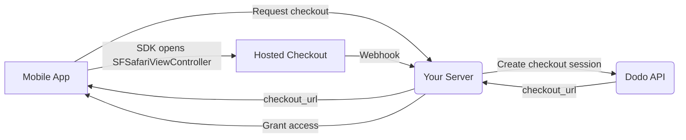

## परिचय

Dodo Payments डेवलपर्स को iOS ऐप्स में डिजिटल सामान और सेवाओं को बेचने के लिए सशक्त बनाता है, जो कर अनुपालन, मुद्रा रूपांतरण, और भुगतान जैसे जटिल पहलुओं को संभालता है। यह व्यापक गाइड आपके iOS ऐप में Dodo Payments को एकीकृत करने के तरीके का विवरण देती है, विशेष रूप से SaaS उपकरणों, सामग्री सब्सक्रिप्शन, और डिजिटल उपयोगिताओं के लिए।

## अवलोकन

Dodo Payments आपके **Merchant of Record (MoR)** के रूप में कार्य करता है, आपके डिजिटल व्यवसाय के महत्वपूर्ण पहलुओं का प्रबंधन करता है:

<Tabs>
<Tab title="What We Handle">
- कर संग्रहण और भुगतान (वैट, जीएसटी, और अन्य क्षेत्रीय कर)
- नीतियों और स्थानीय भुगतान विधियों के अनुसार वैश्विक भुगतान
- मुद्रा रूपांतरण और विदेशी विनिमय
- चार्जबैक और धोखाधड़ी रोकथाम
- अंतिम ग्राहक के बिलिंग और रसीदें
- क्षेत्रीय नियमों के साथ अनुपालन
</Tab>

<Tab title="What You Get">
- वेब और मोबाइल प्लेटफ़ॉर्म के लिए एकीकृत एपीआई
- इन-ऐप चेकआउट का समर्थन (UPI, कार्ड, वॉलेट, BNPL)
- वैश्विक भुगतान समर्थन (Payoneer, Wise, स्थानीय बैंक ट्रांसफर)
- एनालिटिक्स और रिपोर्टिंग डैशबोर्ड
- सुरक्षित भुगतान प्रक्रिया
</Tab>
</Tabs>

## उपयोग के मामले

<CardGroup cols={2}>
<Card title="Subscriptions" icon="repeat">
- प्रीमियम सामग्री या फीचर एक्सेस
- लचीले विकल्पों के साथ आवर्ती बिलिंग, मुफ्त परीक्षण, प्रोरैशन, या अपग्रेड और डाउंग्रेड
</Card>

<Card title="Courses and Learning" icon="graduation-cap">
- कोर्स-प्रति-पे एक्सेस
- बंडल्ड सामग्री पैकेज
- जीवन भर या नवीनीकरण योग्य लाइसेंस
- प्रगति ट्रैकिंग एकीकरण
</Card>

<Card title="Digital Downloads" icon="download">
- एकमुश्त खरीदारी (PDFs, music, tools)
- डिजिटल संपत्ति वितरण
- लाइसेंस कुंजी प्रबंधन
</Card>

<Card title="SaaS Tools" icon="screwdriver-wrench">
- Software-as-a-Service सदस्यताएँ
- उपयोग-आधारित बिलिंग
- टीम और एंटरप्राइज़ प्लान
</Card>
</CardGroup>

## एकीकरण प्रवाह

आपका app Dodo के hosted checkout को
[iOS checkout SDK](/developer-resources/sdks/ios) के साथ खोलता है, जो इसे
`SFSafariViewController` में प्रस्तुत करता है और typed result लौटाता है।

<Warning>
checkout को `WebView` में embed करने के बजाय SDK का उपयोग करें। Apple Pay केवल
एक वास्तविक browser surface में उपलब्ध है, इसलिए `WebView` आपके wallet
conversions को चुपचाप कम कर देता है — और `WebView` के अंदर payment flows App
Store review rejections का एक सामान्य कारण हैं।
</Warning>

### Integration Steps

<Steps>
<Step title="Mobile App to Your Server">
आपका app अपने backend से checkout URL मांगता है, जिसे
signed-in user के session token से authenticate किया जाता है।
</Step>

<Step title="Your Server to Dodo API">
आपका backend अपनी API key के साथ एक [checkout session](/developer-resources/checkout-session)
बनाता है और `checkout_url` को app में लौटाता है।

<Warning>
checkout sessions अपने server पर बनाएं, app में कभी नहीं। किसी app binary के
अंदर भेजी गई API key को bundle से extract किया जा सकता है।
</Warning>
</Step>

<Step title="Mobile App Opens Checkout">
`checkout_url` को `DodoCheckout.start(...)` में पास करें। SDK इसे
`SFSafariViewController` में प्रस्तुत करता है और customer के checkout
पूरा करने या dismiss करने पर typed result के साथ resolve होता है।
</Step>

<Step title="Dodo Payments to Your Server">
payment सफल होने या subscription activate होने पर Dodo Payments आपके webhook endpoint को call करता है।
</Step>

<Step title="Your Server Grants Access">
पाए गए result से नहीं, बल्कि उस webhook से purchased content को unlock करें। SDK result
एक UI hint है, payment का proof नहीं।
</Step>
</Steps>

<CardGroup cols={2}>
<Card title="iOS Checkout SDK" icon="apple" href="/developer-resources/sdks/ios">
  Swift के लिए install steps और पूरा `start(...)` contract।
</Card>
<Card title="Mobile Integration Guide" icon="mobile" href="/developer-resources/mobile-integration">
  end-to-end flow, साथ ही Android, React Native और Flutter के लिए यही contract।
</Card>
</CardGroup>

## Regional Availability

Dodo Payments केवल उन्हीं App Store regions में alternative in-app purchase flows enable करता है जहाँ Apple बाहरी payments की स्पष्ट अनुमति देता है, या जहाँ कोई regulator अथवा court order ऐसा अनिवार्य करता है।

### Supported Regions

<AccordionGroup>
<Accordion title="United States">
वर्तमान court orders और Apple की updated guidelines द्वारा अनुमत सीमा तक supported।

- विशिष्ट court-mandated provisions के अंतर्गत उपलब्ध
- Apple द्वारा legal requirements के compliance के अधीन
- Apple की implementation guidelines का पालन करना आवश्यक है
</Accordion>

<Accordion title="European Union (EU) App Store">
Apple के EU Alternative Terms और External Purchase Entitlement के माध्यम से supported।

- Apple के EU Alternative Terms के माध्यम से enabled
- External Purchase Entitlement approval आवश्यक है
- EU Digital Markets Act requirements का compliance करना आवश्यक है
</Accordion>

<Accordion title="South Korea">
केवल Korea-only binaries के लिए StoreKit External Purchase Entitlement के माध्यम से supported।

- StoreKit External Purchase Entitlement के माध्यम से उपलब्ध
- Korea-specific app binary आवश्यक है
- Korean telecommunications law का compliance करना आवश्यक है
</Accordion>
</AccordionGroup>

<Warning>
किसी भी storefront के लिए Dodo Payments enable करने से पहले Apple के region-specific entitlements और App Store Connect requirements की हमेशा समीक्षा करें और उनका compliance करें। Unsupported regions में alternative payment flows का उपयोग करने पर app rejection या removal हो सकता है।
</Warning>

<Note>
कुछ business models के लिए — जैसे services या content की कुछ categories — Apple को in-app purchase (IAP) के उपयोग की आवश्यकता बिल्कुल नहीं हो सकती है। Dodo Payments इन models को भी support करता है। यह निर्धारित करने के लिए कि आपके use case में IAP mandatory है या नहीं, अपने app का classification और Apple की latest guidelines हमेशा verify करें।
</Note>

### Learn More

global policies, legal precedents और App Store fees को bypass करने के strategic approaches के विस्तृत विश्लेषण के लिए हमारी comprehensive guide देखें:

<Card title="Bypassing App Store & Play Store Fees: A Strategic and Legal Playbook" icon="shield-check" href="/features/bypassing-app-store-fees">
जानें कि up-to-date regional guidance और compliance tips के साथ alternative payment flows को कानूनी रूप से कहाँ और कैसे implement किया जा सकता है।
</Card>