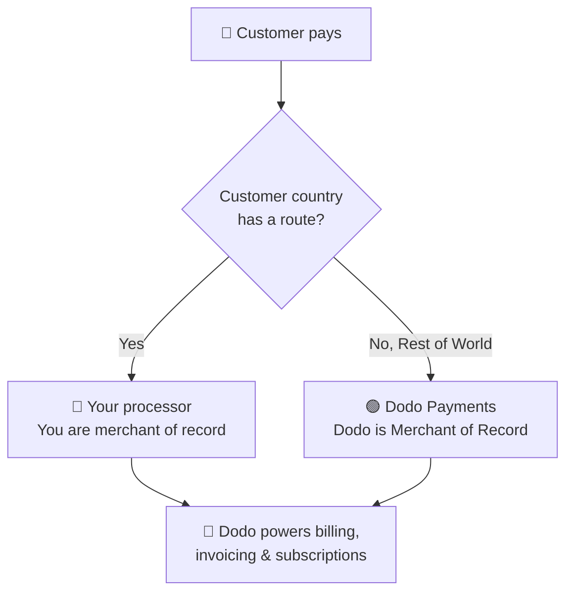

**अपना Processor लाएँ (BYOP)** आपको अपना payment processor — वर्तमान में **Stripe** या **Adyen**, और जल्द ही अन्य processors के support के साथ — connect करने देता है। साथ ही, transaction के ऊपर मौजूद हर चीज़ के लिए आप Dodo Payments का उपयोग जारी रख सकते हैं: products, subscriptions, license keys और entitlement engine, invoicing, customer portal और analytics।

आप प्रत्येक customer country के आधार पर तय करते हैं कि payment **आपके processor** द्वारा process किया जाए (उस route के लिए आप merchant of record बने रहते हैं) या Dodo Payments द्वारा आपके full-service Merchant of Record के रूप में। जिन देशों के लिए आप स्पष्ट रूप से route निर्धारित नहीं करते, वे अपने-आप Dodo पर चले जाते हैं।

<CardGroup cols={2}>
<Card title="Route by geography" icon="globe">
विशिष्ट देशों से आने वाले payments को अपने processor पर भेजें और बाकी सभी को Dodo पर भेजें।
</Card>

<Card title="Keep your processor accounts" icon="plug">
अपने मौजूदा Stripe या Adyen accounts और relationships का उपयोग जारी रखें।
</Card>

<Card title="Stay the merchant of record" icon="building">
अपने routes पर आप legal seller बने रहते हैं और tax, disputes तथा payouts को नियंत्रित करते हैं।
</Card>

<Card title="One billing layer" icon="layer-group">
Dodo दोनों routes पर products, subscriptions, invoices और analytics संचालित करता है।
</Card>
</CardGroup>

## BYOP बनाम Dodo as Merchant of Record

BYOP enable करने पर आप चुनते हैं कि प्रत्येक payment कैसे handle किया जाए। दोनों models साथ-साथ चल सकते हैं और customer country के आधार पर route किए जा सकते हैं।

| Feature | Dodo as Merchant of Record | अपना Processor लाएँ |
|---------|----------------------------|--------------------------|
| Legal seller of record | Dodo Payments | आपकी company |
| Tax (VAT, GST & sales tax) | आपके लिए calculate, collect और remit किया जाता है | आप register, collect और file करते हैं |
| Chargebacks & fraud | Liability और protection का प्रबंधन Dodo द्वारा | आप अपने processor के tools से manage करते हैं |
| PCI compliance | Dodo द्वारा managed | आप manage करते हैं |
| Payment methods | 30+ global और local, multi-currency | केवल cards (credit/debit) |
| Payouts | Aggregated global payouts | सीधे आपके processor से |
| Setup | सरल, कुछ मिनटों में live हो जाएँ | Moderate, keys और routing जोड़ें |
| Best for | Globally selling, hands-off compliance | मौजूदा processor और regional control |

<Tip>
एक सामान्य setup **hybrid** होता है: जिस देश में आपकी पहले से registered entity और processor है (उदाहरण के लिए, आपका home market), उस देश को अपने processor पर route करें और बाकी दुनिया को Dodo द्वारा Merchant of Record के रूप में handle करने दें।
</Tip>

## Supported processors

आज आप **Stripe** या **Adyen** connect कर सकते हैं। अन्य processors के लिए support जल्द आने वाला है।

<CardGroup cols={2}>
<Card title="Stripe" icon="stripe" />
<Card title="Adyen" icon="/images/logos/adyen.svg" />
</CardGroup>

<Note>
अपने processor के माध्यम से route किए गए payments में वर्तमान में केवल **credit और debit cards** का support है। हम जल्द ही और payment methods जोड़ रहे हैं।
</Note>

<Warning>
**Stripe** और **Adyen** दोनों के लिए आपके account पर **raw card API access** enable होना आवश्यक है, ताकि Dodo आपके processor के ऊपर billing संचालित कर सके। प्रत्येक processor request पर यह access देता है — connect करने से पहले processor के support से contact करके इसकी व्यवस्था करें। विवरण के लिए [Stripe](/features/byop/stripe) और [Adyen](/features/byop/adyen) guides देखें।
</Warning>

<Info>
Connections **per environment** configure किए जाते हैं। **test mode** (Sandbox) में connect किया गया processor **live mode** (Production) वाले processor से अलग होता है; यदि आप live होने से पहले test करना चाहते हैं तो दोनों को set up करें। Setup wizard आपके dashboard के global test/live toggle का अनुसरण करता है।
</Info>

## BYOP set up करें

Dashboard में **Settings → BYOP** खोलें और setup wizard शुरू करने के लिए *Bring Your Own Processor* card पर **Configure** चुनें।

<Frame>

</Frame>

<Steps>
<Step title="Choose a payment processor">
जिस processor को connect करना है, **Stripe** या **Adyen**, उसे चुनें और आगे बढ़ें।

<Frame>

</Frame>
</Step>

<Step title="Connect your account">
Connection को **Provider Name** दें (यह तब उपयोगी है जब आपके पास एक ही processor के कई accounts हों, जैसे *Stripe US* और *Stripe UK*), फिर अपने processor की **Secret Key** दर्ज करें (Stripe के लिए, आपकी `sk_...` key)।

**Adyen** के लिए अपना **Merchant Account** identifier भी दर्ज करें।

<Frame>

</Frame>

Save करने पर connection बनता है और उसके लिए unique **Webhook Endpoint** generate होता है। अपने processor के dashboard में उस URL को webhook destination के रूप में जोड़ें, फिर पूरा करने के लिए **Webhook Signing Secret** को वापस Dodo में paste करें:

- **Stripe**: जोड़े गए webhook endpoint से signing secret paste करें।
- **Adyen**: *Customer Area → Webhooks* से **HMAC key** paste करें।

<Note>
आपकी secret key सुरक्षित रूप से store की जाती है और save करने के बाद इसे देखा या बदला नहीं जा सकता। आप अपने processor में केवल Dodo-generated webhook URL configure करते हैं; underlying infrastructure के साथ आपका कभी direct interaction नहीं होता।
</Note>

<Tip>
Save करने के बाद **Verify connection** का उपयोग करके अपने processor पर test call चलाएँ और live होने से पहले पुष्टि करें कि keys और webhook secret valid हैं।
</Tip>
</Step>

<Step title="Configure payment routing">
Customer countries को किसी processor से map करने वाले **routing rules** जोड़ें। प्रत्येक country को ठीक एक processor पर route किया जा सकता है।

- **Your processor** उन देशों से आने वाले payments handle करता है जिन्हें आप उसे assign करते हैं।
- **Dodo Payments** **Rest of the World** (हर वह country जिसे आप स्पष्ट रूप से route नहीं करते) को Merchant of Record के रूप में handle करता है।

<Frame>

</Frame>

एक या अधिक countries को किसी processor पर assign करने के लिए **Add Route** का उपयोग करें।

<Frame>

</Frame>

<Info>
**Routing guidelines**
- "Rest of World" में ऊपर सूचीबद्ध न किए गए सभी countries शामिल हैं।
- Dodo Payments MoR routes compliance और tax को अपने-आप handle करते हैं।
- आवश्यकता होने पर आपके अपने processor routes के लिए अलग tax configuration आवश्यक है।
</Info>
</Step>

<Step title="Configure invoice information">
आपके अपने processor के माध्यम से route किए गए payments के लिए invoice पर **आप** seller होते हैं। उन invoices पर दिखाई देने वाले business details दर्ज करें:

- **Registered Business Name** (required)
- **Tax ID** (EIN, SSN आदि; optional, US EINs के लिए format validation उपलब्ध)
- **Statement Descriptor** (required): customers को उनके bank statement पर दिखाई देने वाला विवरण (5 से 22 characters)
- **Registered Business Address** (required): अपना address search और autofill करने के लिए typing शुरू करें
- **Privacy Policy** और **Terms of Service** links (required)

एक live **Invoice Header Preview** दिखाता है कि details कैसे दिखाई देंगी। ये details **केवल** आपके अपने processor के माध्यम से handle किए गए routes के invoices पर लागू होती हैं; Dodo-routed payments में अभी भी Dodo के Merchant of Record details का उपयोग होता है।

<Frame>

</Frame>
</Step>

<Step title="Review and finish">
अपने processor connection, routing rules और invoice details की समीक्षा करें। पुष्टि करें कि routing और billing details सही हैं, फिर **Finish setup** चुनें।

<Frame>

</Frame>
</Step>
</Steps>

Configure होने के बाद BYOP card पर **Edit Configuration** दिखाई देता है, और आप **Edit routing rules** के साथ किसी भी समय वापस केवल MoR पर जा सकते हैं।

<Frame>

</Frame>

## Routing कैसे काम करता है

Routing का निर्धारण payment के समय **customer's country** से होता है। यही logic one-time payments, checkout sessions और subscription sign-ups पर भी लागू होता है। Renewals उसी processor का उपयोग करते हैं जिस पर subscription बनाई गई थी (देखें [Subscriptions](#subscriptions))।

**आपके processor** द्वारा handle किए गए route पर:

- Payment आपके processor account पर billing currency में process होता है।
- Dodo द्वारा **कोई tax calculate या collect नहीं किया जाता**; उस route के tax की जिम्मेदारी आपकी रहती है।
- Invoices आपके द्वारा configure किए गए **business details और statement descriptor** का उपयोग करते हैं और इनमें Merchant of Record references नहीं होते।
- Payouts आपके processor से **सीधे आपको** settle होते हैं; Dodo के wallet से कुछ भी होकर नहीं गुजरता।

**Dodo** (Rest of World) द्वारा handle किए गए route पर, Dodo आपके full-service Merchant of Record के रूप में ठीक उसी तरह काम करता है और tax, compliance, disputes, fraud तथा aggregated payouts handle करता है।

## Subscriptions

Subscriptions उसी processor पर रहती हैं जिस पर वे बनाई गई थीं। Renewal के समय, Dodo उसी payment processor से charge करता है जिसका उपयोग subscription खरीदने के लिए किया गया था और उसमें stored payment mandate का पुनः उपयोग करता है। Routing rules का प्रत्येक renewal पर दोबारा मूल्यांकन नहीं किया जाता।

## यह देखना कि payment किस processor ने handle किया

BYOP configure होने के बाद, **Payments** और **Disputes** tables प्रत्येक row के साथ processor icon (Stripe, Adyen या Dodo) दिखाती हैं। Payment और dispute detail pages में **Payment Processor** field भी शामिल होता है, जिससे आप हमेशा जान सकते हैं कि किसी transaction को किस route ने handle किया।

## Refunds, disputes और payouts

<Tabs>
<Tab title="Refunds">
आप सामान्य रूप से Dodo dashboard से refunds शुरू करते हैं। अपने processor के माध्यम से route किए गए payments के लिए refund उसी processor पर execute होता है; Dodo-routed payments के लिए refund Dodo process करता है।
</Tab>

<Tab title="Disputes">
Dodo dashboard केवल **Dodo-processed** payments के disputes दिखाता है।

> यहाँ केवल Dodo-processed disputes दिखाए जाते हैं। आपके अपने processor (जैसे Stripe) के disputes उस processor के dashboard में manage किए जाते हैं।

Evidence upload, accept और challenge actions केवल Dodo-processed disputes के लिए उपलब्ध हैं। आपके processor के disputes उसके अपने tools से handle किए जाते हैं।
</Tab>

<Tab title="Payouts">
अपने processor के routes के लिए आपका processor आपको **सीधे** भुगतान करता है; ये payouts Dodo में दिखाई नहीं देते।

> यहाँ केवल Dodo payouts दिखाई देते हैं। आपके अपने processor पर payouts उसी processor में होते हैं।

Dodo payouts (Rest-of-World MoR volume के लिए) standard [payout structure](/features/payouts/payout-structure) का अनुसरण करते हैं।
</Tab>
</Tabs>

## Analytics

Revenue, tax और subscription analytics में **दोनों** routes शामिल होते हैं, जिससे आपको अपनी billing की पूरी तस्वीर दिखाई देती है। Disputes और payouts widgets केवल **Dodo-processed** activity दिखाते हैं और एक banner बताता है कि आपके अपने processor की activity उसके dashboard में उपलब्ध है।

## Billing fee

Dodo आपके अपने processor के माध्यम से route किए गए payments पर एक छोटा **BYOP billing fee** लागू करता है, क्योंकि उन transactions पर भी Dodo आपके products, subscriptions, invoicing और analytics को संचालित करता है। यह आपके balance ledger में `byop_fee` line के रूप में दिखाई देता है। Default rate **0.5%** है; exact rate आपके account के लिए BYOP enable करने की प्रक्रिया के दौरान confirm की जाती है। विवरण के लिए [Reach out](mailto:founders@dodopayments.com) करें।

## Frequently asked questions

<AccordionGroup>
<Accordion title="Which processors can I connect?">
Stripe और Adyen आज supported हैं और जल्द ही अन्य processors के लिए भी support आएगा। दोनों के लिए आपके account पर **raw card API access** enable होना आवश्यक है, जिसकी व्यवस्था processor के support से contact करके की जाती है। विवरण के लिए [Stripe](/features/byop/stripe) और [Adyen](/features/byop/adyen) guides देखें।
</Accordion>

<Accordion title="Can I route only some countries to my processor?">
हाँ। विशिष्ट countries को अपने processor पर assign करें और बाकी को **Rest of the World** के रूप में छोड़ दें, जिसे Dodo Merchant of Record के रूप में handle करता है। प्रत्येक country ठीक एक processor पर route होती है।
</Accordion>

<Accordion title="Who is the merchant of record on BYOP routes?">
हाँ। अपने processor द्वारा handle किए गए routes पर आप legal seller बने रहते हैं और उन transactions के tax, chargebacks, PCI compliance तथा payouts के लिए जिम्मेदार होते हैं।
</Accordion>

<Accordion title="Does Dodo calculate tax on my processor's routes?">
नहीं। अपने processor के माध्यम से handle किए गए routes पर tax calculate या collect नहीं किया जाता; उन transactions के tax का प्रबंधन आप करते हैं। Dodo-routed (MoR) payments पर tax का प्रबंधन Dodo करता रहता है।
</Accordion>

<Accordion title="What happens to active subscriptions if I disable a processor?">
उस processor पर होने वाले renewals fail हो जाएंगे और dashboard में failed payments के रूप में दिखाई देंगे। Renewals restore करने के लिए processor को फिर से enable करें।
</Accordion>
</AccordionGroup>

## शुरू करें

<Card title="What is Merchant of Record?" icon="building-columns" href="/features/mor-introduction">
समझें कि Dodo का full-service MoR model कैसे काम करता है।
</Card>
