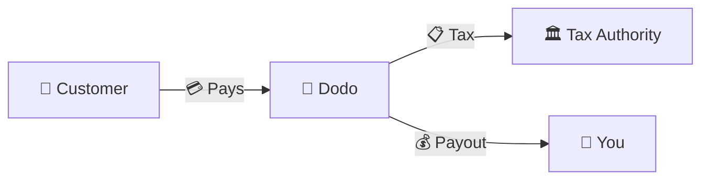
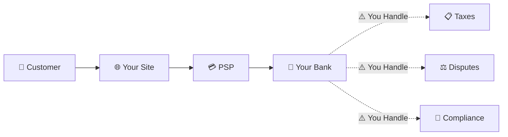
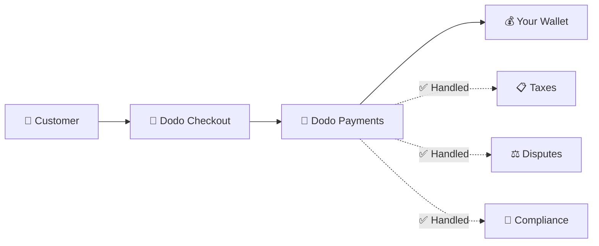
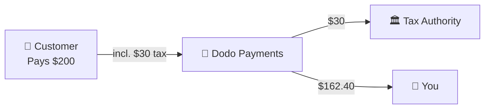

Dodo Payments एक **Merchant of Record (MoR)** के रूप में कार्य करता है — हम आपके digital products के कानूनी seller बन जाते हैं और payments, taxes, fraud तथा compliance की ज़िम्मेदारी संभालते हैं, ताकि आप पूरी तरह अपना product बनाने पर ध्यान केंद्रित कर सकें।

<CardGroup cols={3}>
<Card title="220+ Regions" icon="globe">
Tax compliance अपने-आप संभाली जाती है
</Card>

<Card title="30+ Payment Methods" icon="credit-card">
Cards, wallets और local methods
</Card>

<Card title="Zero Tax Filing" icon="file-invoice">
सभी remittance हम संभालते हैं
</Card>
</CardGroup>

## Merchant of Record क्या है?

एक **Merchant of Record** वह कानूनी entity है जिसका नाम आपके customer के credit card statement पर दिखाई देता है और जो transaction की ज़िम्मेदारी लेती है। जब आप Dodo Payments को अपने MoR के रूप में उपयोग करते हैं:

- **हम कानूनी seller हैं** — Dodo bank statements और receipts पर दिखाई देता है
- **आप product creator हैं** — आप अपना product बनाते हैं, उसकी कीमत तय करते हैं और उसे deliver करते हैं
- **हम back office संभालते हैं** — Taxes, disputes, compliance और billing support
- **आपको net payouts मिलते हैं** — Revenue सीधे आपके account में जमा होता है

<Note>
Merchant of Record को एक global finance team को hire करने जैसा समझें, जो हर country में invoicing, taxes और billing संभालती है — और आपको कोई अतिरिक्त प्रयास नहीं करना पड़ता।
</Note>

## Merchant of Record का उपयोग क्यों करें?

Digital products को globally बेचने का अर्थ है Europe में VAT, Australia में GST, US में Sales Tax और अनगिनत अन्य requirements को संभालना। हर jurisdiction के rules, rates, thresholds और filing deadlines अलग-अलग होते हैं।

| आपकी ज़िम्मेदारी | MoR के बिना | Dodo के MoR के रूप में |
|---------------------|:-----------:|:----------------:|
| VAT/GST Registration | ❌ आप | ✅ Dodo |
| Tax Calculation | ❌ आप | ✅ Dodo |
| Tax Filing & Remittance | ❌ आप | ✅ Dodo |
| Chargeback Liability | ❌ आप | ✅ Dodo |
| PCI Compliance | ❌ आप | ✅ Dodo |
| Multi-Currency Support | ❌ जटिल | ✅ Built-in |
| Local Payment Methods | ❌ हर method को integrate करें | ✅ 30+ शामिल |

<Tip>
**उदाहरण**: किसी French customer को €50/month का subscription बेच रहे हैं?

**MoR के बिना**: French VAT के लिए register करें, €60 (20% VAT) charge करें, quarterly French returns file करें और audits को French भाषा में संभालें।

**Dodo के साथ**: हम €60 collect करते हैं, France को €10 VAT remit करते हैं और आपको fees घटाकर €50 का भुगतान करते हैं। आप code लिखते हैं।
</Tip>

## PSP बनाम MoR: मुख्य अंतर

**Payment Service Provider** (जैसे Stripe) और **Merchant of Record** के बीच का अंतर समझना आवश्यक है।

### Payment Service Provider (PSP)

PSP transactions process करता है, लेकिन आपको legal seller के रूप में बनाए रखता है:

<Warning>
PSP के साथ, हर उस jurisdiction में जहाँ आपके customers हैं, tax registration, collection, filing और remittance की ज़िम्मेदारी **आपकी** होती है।
</Warning>

### Merchant of Record (Dodo)

MoR legal seller बन जाता है और end-to-end compliance संभालता है:

<Check>
Dodo को MoR के रूप में उपयोग करने पर हम taxes, disputes और compliance संभालते हैं। आपको बिना किसी paperwork के net payouts मिलते हैं।
</Check>

### आमने-सामने तुलना

| पहलू | PSP (Stripe आदि) | MoR (Dodo) |
|--------|:------------------:|:----------:|
| Legal Seller | आपकी Company | Dodo |
| Customer Statement पर | आपका Name | Dodo |
| Tax Registration | ❌ आप | ✅ Dodo |
| Tax Calculation | ❌ आप | ✅ Dodo |
| Tax Remittance | ❌ आप | ✅ Dodo |
| Chargeback Risk | ❌ आप | ✅ Dodo |
| PCI Compliance | ❌ आप | ✅ Dodo |
| Global के लिए Setup | जटिल | आसान |

<Info>
**महत्वपूर्ण**: PSPs और MoRs दोनों payment processing संभालते हैं। मुख्य अंतर यह है कि tax compliance और transaction liability के लिए **कानूनी रूप से ज़िम्मेदार कौन** है।
</Info>

## Tax Compliance कैसे काम करती है

Dodo पूरे tax lifecycle को अपने-आप संभालता है:

<Steps>
<Step title="Customer Location">
हम customer के country का पता लगाते हैं और यह निर्धारित करते हैं कि कौन-से tax rules लागू होते हैं — VAT, GST, Sales Tax या अन्य local requirements।
</Step>

<Step title="Rate Calculation">
Product type, customer location और B2B/B2C status के आधार पर सही tax rate calculate की जाती है। Valid VAT numbers वाले EU business customers पर reverse charge लागू किया जाता है।
</Step>

<Step title="Collection at Checkout">
Checkout पर tax स्पष्ट रूप से दिखाई जाती है और collect की जाती है। Customers को ठीक-ठीक पता होता है कि वे कितना भुगतान कर रहे हैं।
</Step>

<Step title="Filing & Remittance">
हम returns file करते हैं और schedule के अनुसार collected taxes को संबंधित authorities को pay करते हैं। आपको कभी कोई tax form नहीं देखना पड़ता।
</Step>
</Steps>

## Revenue Flow

यहाँ बताया गया है कि customer से आपके account तक पैसा कैसे पहुँचता है:

### Payout Breakdown का उदाहरण

| Line Item | Amount |
|-----------|-------:|
| Customer Payment | $200.00 |
| Sales Tax (15% VAT) | −$30.00 |
| Dodo Platform Fee (4%) | −$8.00 |
| Payment Processing | −$0.60 |
| **Your Payout** | **$162.40** |

## MoR बनाम PSP में से कब चुनें

<Tabs>
<Tab title="Choose Dodo (MoR)">
**Dodo Payments आपके लिए आदर्श है यदि आप:**

- Digital products, SaaS या subscriptions बेचते हैं
- कई countries में customers हैं
- Tax registration की परेशानियों से बचना चाहते हैं
- अनुमानित, outsourced compliance पसंद करते हैं
- Maximum control की तुलना में market में तेज़ी से पहुँचना महत्वपूर्ण मानते हैं
- Disputes और fraud manage नहीं करना चाहते
</Tab>

<Tab title="Consider a PSP">
**PSP आपके लिए उपयुक्त हो सकता है यदि आप:**

- मुख्य रूप से एक country में operate करते हैं
- In-house finance और compliance teams रखते हैं
- Checkout UX पर पूर्ण control चाहते हैं
- बहुत कम margins के साथ काम करते हैं
- Physical goods बेचते हैं (MoRs का focus digital products पर होता है)
</Tab>
</Tabs>

<Note>
कई businesses PSP से शुरुआत करते हैं और international scale बढ़ने पर MoR पर switch करते हैं। इस transition को seamless बनाने के लिए Dodo migration support देता है।
</Note>

## अक्सर पूछे जाने वाले प्रश्न

<AccordionGroup>
<Accordion title="What appears on my customer's credit card statement?">
Dodo Payments merchant के रूप में दिखाई देता है। जहाँ character limits अनुमति देती हैं, वहाँ हम आपके product/brand reference को शामिल करते हैं और customers को आपके product की जानकारी वाली detailed receipts मिलती हैं।
</Accordion>

<Accordion title="Do I still own the customer relationship?">
हाँ। Pricing, branding, product delivery और direct communication पर आपका control रहता है। Dodo billing mechanics संभालता है, लेकिन customers जानते हैं कि वे आपसे खरीदारी कर रहे हैं। Checkout, emails और invoices में आपका brand प्रमुखता से दिखाई देता है।
</Accordion>

<Accordion title="How does B2B VAT reverse charge work?">
EU में B2B sales के लिए customers checkout पर अपना VAT number दर्ज कर सकते हैं। हम इसे validate करते हैं और reverse charge अपने-आप लागू करते हैं — tax collect करने के बजाय buyer के VAT return में transfer हो जाता है।
</Accordion>

<Accordion title="Can I use my own payment processor?">
हाँ। [Bring Your Own Processor (BYOP)](/features/byop) के साथ आप अपना Stripe या Adyen account कनेक्ट कर सकते हैं और चयनित देशों से होने वाले payments को इसके माध्यम से route कर सकते हैं, जबकि Dodo Payments products, subscriptions, invoicing और analytics को संचालित करता रहता है। जिन देशों को आप स्पष्ट रूप से route नहीं करते, वहाँ payments Dodo Payments के माध्यम से आपके पूर्ण-सेवा Merchant of Record के रूप में जारी रहते हैं। इसी कारण हम उन routes पर tax और fraud liability की ज़िम्मेदारी ले सकते हैं।
</Accordion>

<Accordion title="How do refunds work?">
अपने dashboard से refunds initiate करें। हम refund को customer की original payment method और currency में process करते हैं। Tax amounts अपने-आप adjust और reconcile हो जाते हैं।
</Accordion>

<Accordion title="What about my income tax?">
Dodo customer transactions पर **sales taxes** (VAT, GST, Sales Tax) संभालता है। आपको मिलने वाले payouts पर अपने business के income tax, corporate tax और tax obligations की ज़िम्मेदारी आपकी ही रहती है।
</Accordion>

<Accordion title="Which countries can I sell to?">
हम 220+ countries और regions से payments स्वीकार करते हैं और लगातार विस्तार कर रहे हैं। पूरी list देखें:

<Card title="Supported Regions" icon="globe" href="/miscellaneous/list-of-countries-we-accept-payments-from">
वे सभी 220+ countries और regions देखें जहाँ हम payments स्वीकार करते हैं।
</Card>
</Accordion>
</AccordionGroup>

## शुरुआत करें

<CardGroup cols={2}>
<Card title="Create Account" icon="rocket" href="https://app.dodopayments.com/signup">
निःशुल्क sign up करें और कुछ ही मिनटों में global payments स्वीकार करें।
</Card>

<Card title="MoR vs PG Deep Dive" icon="scale-balanced" href="/features/mor-vs-pg">
Examples और use cases के साथ detailed comparison।
</Card>

<Card title="Acceptance Policy" icon="building-shield" href="/miscellaneous/merchant-acceptance">
जानें कि हम किन businesses को support करते हैं।
</Card>

<Card title="Talk to Us" icon="envelope" href="mailto:founders@dodopayments.com">
हमारी team से personalized guidance प्राप्त करें।
</Card>
</CardGroup>
