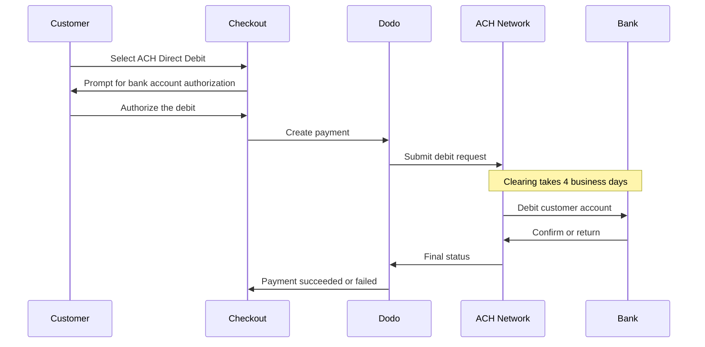

ACH Direct Debit से United States के ग्राहक कार्ड का उपयोग करने के बजाय सीधे अपने बैंक अकाउंट से भुगतान कर सकते हैं। यह Automated Clearing House नेटवर्क पर चलता है और one-time payments के लिए USD checkouts पर उपलब्ध है।

## ACH Direct Debit क्यों ऑफ़र करें?

<CardGroup cols={3}>
<Card title="Lower Processing Cost" icon="piggy-bank">
बैंक डेबिट को प्रोसेस करने की लागत आमतौर पर कार्ड भुगतान से कम होती है, खासकर अधिक मूल्य वाले ऑर्डर्स पर।
</Card>

<Card title="No Card Required" icon="building-columns">
उन US ग्राहकों तक पहुँचें जो बैंक अकाउंट से भुगतान करना पसंद करते हैं या बड़ी खरीदारी के लिए कार्ड का उपयोग नहीं करना चाहते।
</Card>

<Card title="Higher Value Orders" icon="chart-line">
ऑर्डर का मूल्य बढ़ने के साथ कार्ड की तुलना में लागत का लाभ बढ़ता है, जिससे ACH बड़ी one-time purchases के लिए उपयुक्त है।
</Card>
</CardGroup>

## अवलोकन

| विवरण | मान |
| :----- | :---- |
| **Billing Currency** | USD |
| **Supported Countries** | United States |
| **Subscriptions** | नहीं |
| **Min Amount** | $0.50 |
| **Settlement** | 4 business days |

<Warning>
ACH Direct Debit instant नहीं है। किसी भुगतान की पुष्टि में **4 business days** लगते हैं, इसलिए authorization को settlement न मानें — भुगतान के succeeded state में पहुँचने के बाद ही fulfillment करें।
</Warning>

## यह कैसे काम करता है



## ग्राहक अनुभव

1. ग्राहक checkout पर ACH Direct Debit चुनता है
2. ग्राहक अपने US bank account के विरुद्ध debit को authorize करता है
3. भुगतान ACH network को सबमिट किया जाता है और processing state में चला जाता है
4. अगले business days के दौरान clearing पूरी होती है
5. भुगतान succeeded state में चला जाता है या बैंक द्वारा लौटाए जाने पर विफल हो जाता है

<Info>
क्योंकि clearing asynchronous है, अंतिम परिणाम जानने के लिए checkout redirect के बजाय [webhooks](/developer-resources/webhooks) पर निर्भर रहें। सफल redirect का अर्थ केवल यह है कि ग्राहक ने debit authorize किया है।

Debit सबमिट होने के बाद भुगतान `payment.processing` emit करता है, फिर clearing पूरी होने पर `payment.succeeded` या `payment.failed` emit करता है। केवल `payment.succeeded` पर fulfillment करना सुरक्षित है।
</Info>

## उपलब्धता

ACH Direct Debit checkout पर तभी दिखाई देता है जब निम्न सभी शर्तें पूरी हों:

- **Billing currency** `USD` हो
- **Billing country** `US` हो
- लेन-देन **one-time payment** हो

<Note>
ACH Direct Debit subscriptions के लिए उपलब्ध नहीं है। इसकी कई दिनों की clearing window इसे recurring billing cycles के लिए अनुपयुक्त बनाती है। Recurring payments के लिए cards या subscriptions को सपोर्ट करने वाली किसी अन्य method का उपयोग करें — [Payment Methods overview](/features/payment-methods) देखें।
</Note>

## कॉन्फ़िगरेशन

```javascript
const session = await client.checkoutSessions.create({
  product_cart: [{ product_id: 'pdt_123', quantity: 1 }],
  allowed_payment_method_types: ['ach', 'credit', 'debit'],
  billing_currency: 'USD',
  billing_address: {
    country: 'US',
    zipcode: '94102'
  },
  return_url: 'https://example.com/success'
});
```

<Note>
ACH Direct Debit के लिए **USD** billing currency और **US** billing address आवश्यक है। यदि आप अपनी कीमतें किसी अन्य currency में बताते हैं, तो [Adaptive Currency](/features/adaptive-currency) सक्षम करें, ताकि US ग्राहकों से USD में शुल्क लिया जाए और ACH उपलब्ध हो सके।
</Note>

## API Method Type

| Type | Method | Country |
| :--- | :----- | :------ |
| `ach` | ACH Direct Debit | United States |

## Refunds और Disputes

ACH payments के refunds और disputes में हर अन्य payment method जैसी ही APIs और dashboard flows का उपयोग होता है — implement करने के लिए कोई ACH-specific handling नहीं है।

<Warning>
क्योंकि ACH payments के सफल दिखाई देने के बाद भी ग्राहक का बैंक उन्हें लौटा सकता है, इसलिए original payment के succeeded state में पहुँचने तक refunds जारी न करें।
</Warning>

## परीक्षण

<Steps>
<Step title="Enable test mode">
अपने Dodo Payments test API keys का उपयोग करें।
</Step>

<Step title="Set currency and billing address">
Billing currency को `USD` और billing address country को `US` पर सेट करें।
</Step>

<Step title="Include `ach` in allowed methods">
`ach` को `allowed_payment_method_types` में पास करें, या सभी eligible methods दिखाने के लिए field को पूरी तरह छोड़ दें।
</Step>

<Step title="Enter the test bank details">
नीचे दिए गए test routing और account number pairs में से किसी एक को दर्ज करें, फिर पुष्टि करें कि आपका webhook handler अंतिम payment status प्राप्त करता है।
</Step>
</Steps>

### Test Bank Accounts

ग्राहक checkout पर अपना account और routing number सीधे दर्ज करते हैं। Test mode में, किसी विशिष्ट परिणाम को बाध्य करने के लिए नीचे दिए गए account numbers में से किसी एक के साथ routing number `110000000` का उपयोग करें।

| Account Number | Routing Number | Behavior |
| :------------- | :------------- | :------- |
| `000123456789` | `110000000` | भुगतान सफल होता है। |
| `000222222227` | `110000000` | अपर्याप्त funds के कारण भुगतान विफल होता है। |
| `000111111113` | `110000000` | अकाउंट बंद होने के कारण भुगतान विफल होता है। |
| `000111111116` | `110000000` | कोई अकाउंट न मिलने के कारण भुगतान विफल होता है। |
| `000333333335` | `110000000` | अकाउंट पर debits authorized न होने के कारण भुगतान विफल होता है। |
| `000444444440` | `110000000` | अमान्य currency के कारण भुगतान विफल होता है। |
| `000555555559` | `110000000` | भुगतान सफल होता है, फिर dispute ट्रिगर करता है। |
| `000000000009` | `110000000` | भुगतान अनिश्चित समय तक processing में रहता है, जो pending-state UI का परीक्षण करने के लिए उपयोगी है। |

<Note>
अधिकांश test payments live clearing window की तुलना में बहुत जल्दी final status तक पहुँचते हैं, इसलिए integration सत्यापित करने के लिए आपको कई दिनों तक प्रतीक्षा करने की आवश्यकता नहीं है। अपवाद `000000000009` है, जिसे processing में बने रहने के लिए डिज़ाइन किया गया है।
</Note>

## सर्वोत्तम प्रथाएँ

<AccordionGroup>
<Accordion title="Don't fulfill on authorization">
ACH authorization payment नहीं है। Access देने या shipping करने से पहले payment के succeeded state में पहुँचने की प्रतीक्षा करें — ग्राहक का बैंक debit को अभी भी लौटा सकता है।
</Accordion>

<Accordion title="Set customer expectations at checkout">
ग्राहकों को बताएं कि bank payments तुरंत clear नहीं होते। इससे किसी order के अभी भी pending होने के बारे में आने वाले support tickets कम होते हैं।
</Accordion>

<Accordion title="Provide card fallbacks">
`ach` के साथ हमेशा `credit` और `debit` शामिल करें, ताकि आपके product के instant access की आवश्यकता वाले ग्राहक तेज़ method चुन सकें।
</Accordion>

<Accordion title="Use ACH for high-value one-time purchases">
ऑर्डर का मूल्य बढ़ने के साथ ACH का लागत लाभ बढ़ता है, इसलिए यह छोटी खरीदारी के बजाय बड़ी one-time purchases पर सबसे उपयोगी है।
</Accordion>
</AccordionGroup>

## समस्या निवारण

<AccordionGroup>
<Accordion title="ACH not appearing at checkout">
**जाँचें:**
1. Billing currency को `USD` पर सेट किया गया है?
2. Customer billing country `US` है?
3. `ach` को `allowed_payment_method_types` में शामिल किया गया है?
4. क्या यह one-time payment है? ACH subscriptions पर ऑफ़र नहीं किया जाता।

**समाधान:** सभी eligible methods देखने के लिए `allowed_payment_method_types` को अस्थायी रूप से हटाएं, फिर अपनी API request में billing currency और address country सत्यापित करें।
</Accordion>

<Accordion title="ACH not appearing on a subscription checkout">
**कारण:** ACH Direct Debit केवल one-time payments के लिए ऑफ़र किया जाता है।

**समाधान:** Recurring billing के लिए cards या किसी अन्य subscription-capable method का उपयोग करें।
</Accordion>

<Accordion title="Payment stuck in processing">
**कारण:** यह अपेक्षित है। ACH payments पूरी clearing window के दौरान processing state में रहते हैं, जो card payments से बहुत अधिक लंबी होती है।

**समाधान:** अंतिम webhook की प्रतीक्षा करें। Payment को retry न करें — retry करने से ग्राहक के अकाउंट से दो बार debit हो सकता है।
</Accordion>

<Accordion title="Payment failed after initially succeeding at checkout">
**कारण:** ग्राहक के बैंक ने debit लौटा दिया — आमतौर पर अपर्याप्त funds या बंद अकाउंट के कारण।

**समाधान:** Payment को failed मानें और ग्राहक से किसी अन्य payment method के साथ retry करने को कहें। इससे बचने के लिए fulfillment को हमेशा succeeded state पर निर्भर करें।
</Accordion>
</AccordionGroup>

## संबंधित पेज

<CardGroup cols={2}>
<Card title="Payment Methods Overview" icon="credit-card" href="/features/payment-methods">
सभी supported payment methods देखें।
</Card>

<Card title="Adaptive Currency" icon="globe" href="/features/adaptive-currency">
Currency support और automatic conversion।
</Card>

<Card title="Checkout Guide" icon="book" href="/developer-resources/checkout-session">
Complete checkout implementation guide।
</Card>

<Card title="Webhooks" icon="webhook" href="/developer-resources/webhooks">
Delayed payment confirmations को asynchronously handle करें।
</Card>
</CardGroup>
