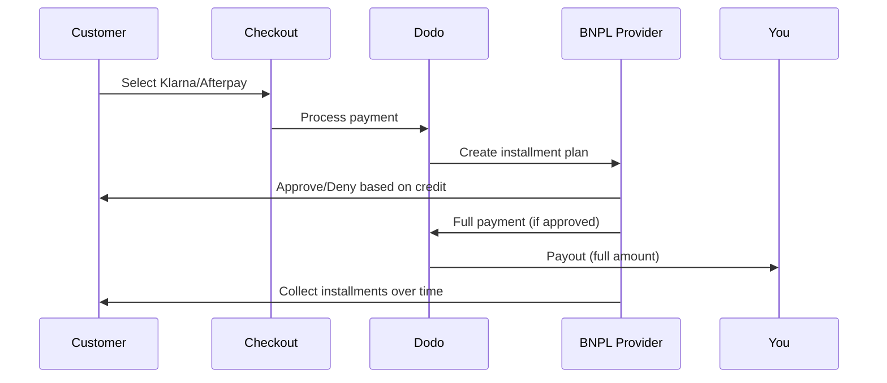

Buy Now Pay Later (BNPL) ग्राहकों को खरीदारी को ब्याज-मुक्त किस्तों में विभाजित करने देता है, योग्य लेनदेन के लिए औसत ऑर्डर मूल्य में 20-50% और रूपांतरण दरों में 10-30% तक वृद्धि करता है।

## BNPL क्यों प्रस्तावित करें?

<CardGroup cols={3}>
<Card title="Higher AOV" icon="chart-line">
ग्राहक अधिक खर्च करते हैं जब वे भुगतान को समय के साथ फैलाने में सक्षम होते हैं। औसत ऑर्डर मूल्य 20-50% तक बढ़ता है।
</Card>

<Card title="Better Conversion" icon="percent">
चेकआउट पर भुगतान गति कम करना। उच्च-मूल्य वस्तुओं के लिए रूपांतरण दरें 10-30% तक सुधरती हैं।
</Card>

<Card title="Zero Risk" icon="shield-check">
BNPL प्रदाता क्रेडिट जोखिम और वसूली का प्रबंधन करते हैं। आपको पूरा भुगतान अग्रिम में प्राप्त होता है।
</Card>
</CardGroup>

## समर्थित प्रदाता

### Klarna

| विशेषता | विवरण |
| :------ | :------ |
| **उपलब्धता** | US + 19 यूरोपीय देश |
| **मुद्राएँ** | USD, EUR, GBP, DKK, NOK, SEK, CZK, RON, PLN, CHF |
| **न्यूनतम** | $50.01 (या समकक्ष) |
| **सदस्यताएँ** | हाँ |

**Supported Countries:** Austria, Belgium, Czech Republic, Denmark, Finland, France, Germany, Greece, Ireland, Italy, Netherlands, Norway, Poland, Portugal, Romania, Spain, Sweden, Switzerland, United Kingdom, United States

**Payment Options:**
- **Pay in 4** — Split into 4 interest-free payments
- **Pay in 30 days** — Full payment due in 30 days
- **Financing** — Longer-term installment plans

### Afterpay (Clearpay)

| Feature | Details |
| :------ | :------ |
| **Availability** | US, UK |
| **Currencies** | USD, GBP |
| **Minimum** | $50.01 (or equivalent) |
| **Subscriptions** | No |

**Payment Options:**
- **Pay in 4** — 4 interest-free payments every 2 weeks

<Note>
In the UK, Afterpay operates as "Clearpay" but uses the same API type (`afterpay_clearpay`).
</Note>

### Billie

| Feature | Details |
| :------ | :------ |
| **Availability** | Global |
| **Currencies** | GBP |
| **Minimum** | None |
| **Subscriptions** | No |

**About Billie:**
Billie एक B2B Buy Now Pay Later समाधान है जो व्यवसायों को अपने ग्राहकों को लचीले भुगतान शर्तें प्रदान करने में सक्षम बनाता है। यह व्यापार से व्यापार लेनदेन के लिए डिज़ाइन किया गया है जहाँ खरीदारों को चालान-आधारित भुगतान विकल्पों की आवश्यकता होती है।

**Payment Options:**
- **Invoice Payment** — सहमत भुगतान शर्तों के भीतर भुगतान करें
- **Flexible Terms** — व्यवसाय-हितैषी भुगतान अनुसूचियाँ

### Sunbit

| सुविधा | विवरण |
| :------ | :------ |
| **उपलब्धता** | US |
| **मुद्राएँ** | USD |
| **न्यूनतम** | $60.00 |
| **अधिकतम** | $19,999.00 |
| **सदस्यता** | नहीं |

**भुगतान विकल्प:**
- **किश्त वित्तपोषण** — खरीद को प्रबंधनीय मासिक भुगतान में विभाजित करें

## विन्यास

### API विधि प्रकार

| प्रकार | प्रदाता |
| :--- | :------- |
| `klarna` | Klarna |
| `afterpay_clearpay` | Afterpay / Clearpay |
| `billie` | Billie (B2B) |
| `sunbit` | Sunbit |

### उदाहरण

```javascript
const session = await client.checkoutSessions.create({
  product_cart: [{ product_id: 'prod_123', quantity: 1 }],
  allowed_payment_method_types: [
    'klarna',
    'afterpay_clearpay',
    'credit',
    'debit'
  ],
  customer: {
    email: 'customer@example.com',
    name: 'Jane Smith'
  },
  billing_address: {
    country: 'US',
    zipcode: '10001'
  },
  return_url: 'https://example.com/success'
});
```

<Warning>
हमेशा `credit` और `debit` को फ़ॉलबैक के रूप में शामिल करें। सभी ग्राहक BNPL के लिए योग्य नहीं होते हैं, और प्रदाता की न्यूनतम राशि से कम लेन-देन योग्य नहीं होंगे।
</Warning>

## लेन-देन राशि सीमाएँ

प्रत्येक BNPL प्रदाता की अपनी न्यूनतम (और कभी-कभी अधिकतम) लेन-देन राशि होती है:

| प्रदाता | न्यूनतम | अधिकतम |
| :------- | :------ | :------ |
| Klarna | $50.01 | — |
| Afterpay | $50.01 | — |
| Sunbit | $60.00 | $19,999.00 |

इन सीमाओं से बाहर के लेन-देन:
- चेकआउट पर BNPL विकल्प दिखाई नहीं देंगे
- कोई त्रुटि पैदा नहीं होती — विकल्प केवल नहीं दिखते
- कार्ड भुगतान उपलब्ध रहते हैं

यह अपेक्षित व्यवहार है। `allowed_payment_method_types` में कोई BNPL विधि शामिल न करें यदि आपके उत्पाद की कीमत उस प्रदाता के समर्थित रेंज में आने की संभावना नहीं है।

## किस्तें कैसे काम करती हैं



**मुख्य बिंदु:**
- आपको BNPL प्रदाता से **सम्पूर्ण भुगतान अग्रिम रूप से** मिलता है
- BNPL प्रदाता **क्रेडिट जोखिम और संग्रहण** संभालता है
- ग्राहक सीधे प्रदाता को **4 किस्तों** में भुगतान करता है (आमतौर पर)
- किस्त विफलताओं से **कोई चार्जबैक** नहीं होता — यह प्रदाता का जोखिम है

## परीक्षण

### Klarna परीक्षण डेटा

परीक्षण मोड में इन विवरणों का उपयोग करें:

| फ़ील्ड | स्वीकृत | अस्वीकृत |
| :---- | :------- | :----- |
| **जन्म तिथि** | 07-10-1970 | 07-10-1970 |
| **प्रथम नाम** | टेस्ट | टेस्ट |
| **अंतिम नाम** | Person-us | Person-us |
| **ईमेल** | customer@email.us | customer+denied@email.us |
| **सड़क** | Amsterdam Ave | Amsterdam Ave |
| **घर नंबर** | 509 | 509 |
| **शहर** | न्यूयॉर्क | न्यूयॉर्क |
| **राज्य** | न्यूयॉर्क | न्यूयॉर्क |
| **पोस्टल कोड** | 10024-3941 | 10024-3941 |
| **फोन** | +13106683312 | +13106354386 |

<Note>
Klarna को विकल्प के रूप में प्रकट होने के लिए लेन-देन कम से कम $50 होना चाहिए।
</Note>

### Afterpay परीक्षण

<Steps>
<Step title="Select Afterpay">
चेकआउट में Afterpay चुनें और पे पर क्लिक करें।
</Step>

<Step title="Successful payment">
किसी भी मान्य ईमेल और शिपिंग पते का उपयोग करें।
</Step>

<Step title="Failed authentication">
विफलता का परीक्षण करने के लिए: पुनर्निर्देशन पृष्ठ पर Afterpay मोडल को बंद करें। भुगतान की स्थिति `requires_payment_method` में बदल जाती है।
</Step>
</Steps>

### Sunbit परीक्षण

<Steps>
<Step title="Set billing country and currency">
सुनिश्चित करें कि चेकआउट सत्र में `billing_address.country` को `US` और `billing_currency` को `USD` के रूप में सेट किया गया है।
</Step>

<Step title="Use a qualifying amount">
लेन-देन की राशि **$60.00 और $19,999.00** के बीच सेट करें। इस सीमा के बाहर Sunbit नहीं दिखाई देगा।
</Step>

<Step title="Select Sunbit">
चेकआउट पर Sunbit चुनें और Sunbit मोडल में वित्तपोषण आवेदन प्रक्रिया को पूरा करें।
</Step>

<Step title="Test failure">
अस्वीकृत आवेदन का अनुकरण करने के लिए, प्रक्रिया को पूरा करने से पहले Sunbit मोडल को बंद करें। भुगतान `requires_payment_method` में बदल जाता है।
</Step>
</Steps>

<Note>
Sunbit केवल US ग्राहकों के लिए उपलब्ध है जो USD में $60.00 और $19,999.00 के बीच लेन-देन कर रहे हैं।
</Note>

## सर्वोत्तम प्रथाएँ

<AccordionGroup>
<Accordion title="Target high-ticket items">
BNPL $100-$1000 के उत्पादों के लिए सर्वश्रेष्ठ काम करता है। "समय के साथ भुगतान करें" प्रस्ताव इस श्रेणी में सबसे अधिक आकर्षक है।
</Accordion>

<Accordion title="Show installment amounts">
"$25 की 4 किस्तें" "$100 with Klarna" की तुलना में अधिक आकर्षक है। जहां संभव हो, प्रति-किस्त राशि दिखाएं।
</Accordion>

<Accordion title="Don't force BNPL for low-value products">
$50 से कम में, BNPL वैसे भी प्रकट नहीं होगा। $100 से कम में, अधिकांश ग्राहक कार्ड पसंद करते हैं। उच्च-टिकट आइटम्स पर BNPL प्रमोशन पर ध्यान दें।
</Accordion>

<Accordion title="Collect billing address">
BNPL प्रदाता क्रेडिट जाँच के लिए बिलिंग जानकारी की मांग करते हैं। सुनिश्चित करें कि आपका चेकआउट पूरा पता विवरण एकत्र करता है।
</Accordion>

<Accordion title="Set clear expectations">
ग्राहकों को समझना चाहिए कि वे Klarna/Afterpay के साथ एक क्रेडिट समझौता कर रहे हैं, आपके साथ नहीं।
</Accordion>
</AccordionGroup>

## सीमाएँ

### कोई सदस्यता नहीं
BNPL भुगतान विधियों को **आवर्ती भुगतान का समर्थन नहीं करते हैं**। सदस्यता उत्पादों के लिए, कार्ड या अन्य आवर्ती-संगत विधियाँ उपयोग करें।

### क्रेडिट-आधारित स्वीकृति
BNPL प्रदाता त्वरित क्रेडिट जांच करते हैं। सभी ग्राहक स्वीकृत नहीं होंगे। स्वीकृति दरें इस पर निर्भर करती हैं:
- प्रदाता के साथ ग्राहक की क्रेडिट इतिहास
- लेन-देन राशि
- ग्राहक का स्थान

### मुद्रा और देश मैपिंग

प्रत्येक मुद्रा अपने संबंधित क्षेत्र तक ही सीमित है:

| मुद्रा | समर्थित देश |
| :------- | :------------------ |
| **USD** | केवल यूनाइटेड स्टेट्स |
| **EUR** | सभी समर्थित यूरोपीय देश (ऑस्ट्रिया, बेल्जियम, चेक गणराज्य, डेनमार्क, फिनलैंड, फ्रांस, जर्मनी, ग्रीस, आयरलैंड, इटली, नीदरलैंड्स, नॉर्वे, पोलैंड, पुर्तगाल, रोमानिया, स्पेन, स्वीडन, स्विट्जरलैंड) |
| **GBP** | यूनाइटेड किंगडम और सभी समर्थित यूरोपीय देश |

अन्य Klarna समर्थित मुद्राएं (DKK, NOK, SEK, CZK, RON, PLN, CHF) अपने-अपने देशों में कार्य करती हैं।

<Info>
उदाहरण के लिए, एक USD लेन-देन केवल US ग्राहकों को BNPL विकल्प दिखाएगा। एक EUR लेन-देन सभी समर्थित यूरोपीय देशों में BNPL विकल्प दिखाएगा। एक GBP लेन-देन UK और सभी समर्थित यूरोपीय देशों के ग्राहकों को BNPL विकल्प दिखाएगा।
</Info>

| प्रदाता | समर्थित मुद्राएँ |
| :------- | :------------------- |
| Klarna | USD, EUR, GBP, DKK, NOK, SEK, CZK, RON, PLN, CHF |
| Afterpay | USD (US), GBP (UK) |
| Sunbit | USD (US) |

## समस्या निवारण

<AccordionGroup>
<Accordion title="BNPL not appearing at checkout">
**जांचें:**
1. प्रदाता की समर्थित रेंज के भीतर लेन-देन राशि है? (Klarna/Afterpay: न्यूनतम $50.01; Sunbit: $60.00–$19,999.00)
2. ग्राहक का स्थान समर्थित देश में है?
3. मुद्रा BNPL प्रदाता द्वारा समर्थित है?
4. `allowed_payment_method_types` में BNPL विधि शामिल है?

**समाधान:** सबसे सामान्यतः, लेन-देन न्यूनतम से नीचे या अधिकतम से ऊपर है। प्रदाता की समर्थित रेंज के भीतर रहने के लिए राशि की जाँच करें।
</Accordion>

<Accordion title="Customer denied by BNPL provider">
**कारण:**
- प्रदाता के साथ अपर्याप्त क्रेडिट हिस्ट्री
- बहुत सारी सक्रिय किस्त योजनाएँ
- पहचान सत्यापन में विफलता

**समाधान:** कुछ ग्राहकों के लिए यह अपेक्षित है। सुनिश्चित करें कि कार्ड फ़ॉलबैक उपलब्ध हैं। विशिष्ट अस्वीकार कारणों को उजागर न करें।
</Accordion>

<Accordion title="Payment stuck in pending">
**कारण:** ग्राहक ने BNPL प्रदाता के साथ प्रमाणीकरण प्रक्रिया पूरी नहीं की।

**समाधान:** भुगतान समय समाप्त हो जाएगा और असफल हो जाएगा। ग्राहक पुनः प्रयास कर सकते हैं या अन्य विधि का उपयोग कर सकते हैं।
</Accordion>
</AccordionGroup>

## संबंधित पृष्ठ

<CardGroup cols={2}>
<Card title="Payment Methods Overview" icon="credit-card" href="/features/payment-methods">
सभी समर्थित भुगतान विधियाँ देखें।
</Card>

<Card title="Checkout Guide" icon="book" href="/developer-resources/checkout-session">
पूरा चेकआउट कार्यान्वयन गाइड।
</Card>

<Card title="Testing Process" icon="flask" href="/miscellaneous/testing-process">
भुगतान विधियों के लिए सभी परीक्षण डेटा।
</Card>

<Card title="Adaptive Currency" icon="globe" href="/features/adaptive-currency">
मुद्रा समर्थन और रूपांतरण।
</Card>
</CardGroup>