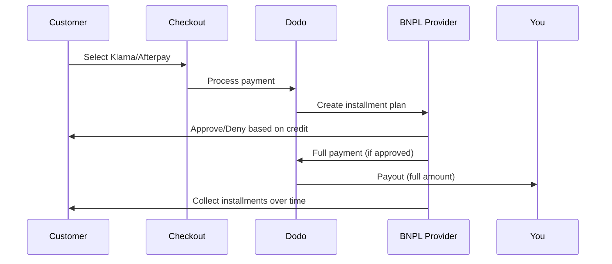

अब खरीदें बाद में भुगतान करें (BNPL) ग्राहकों को खरीदारी को ब्याज-मुक्त किस्तों में बांटने की अनुमति देता है, जिससे औसत ऑर्डर मूल्य 20-50% और पात्र लेनदेन के लिए रूपांतरण दर 10-30% बढ़ जाती है।

## BNPL की पेशकश क्यों करें?

<CardGroup cols={3}>
<Card title="उच्च AOV" icon="chart-line">
ग्राहक अधिक खर्च करते हैं जब वे समय के साथ भुगतान फैला सकते हैं। औसत ऑर्डर मूल्य 20-50% बढ़ता है।
</Card>

<Card title="बेहतर रूपांतरण" icon="percent">
चेकआउट पर भुगतान में रुकावट को खत्म करना। उच्च मूल्य वस्तुओं के लिए रूपांतरण दर 10-30% बढ़ जाती है।
</Card>

<Card title="शून्य जोखिम" icon="shield-check">
BNPL प्रदाता क्रेडिट जोखिम और संग्रह को संभालते हैं। आप अग्रिम भुगतान प्राप्त करते हैं।
</Card>
</CardGroup>

## समर्थित प्रदाता

### Klarna

| विशेषता | विवरण |
| :------ | :------ |
| **उपलब्धता** | अमेरिका + 19 यूरोपीय देश |
| **मुद्राएँ** | USD, EUR, GBP, DKK, NOK, SEK, CZK, RON, PLN, CHF |
| **न्यूनतम** | $50.01 (या समकक्ष) |
| **सदस्यताएँ** | नहीं |

**समर्थित देश:** ऑस्ट्रिया, बेल्जियम, चेक गणराज्य, डेनमार्क, फिनलैंड, फ्रांस, जर्मनी, ग्रीस, आयरलैंड, इटली, नीदरलैंड, नॉर्वे, पोलैंड, पुर्तगाल, रोमानिया, स्पेन, स्वीडन, स्विट्ज़रलैंड, यूनाइटेड किंगडम, यूनाइटेड स्टेट्स

**भुगतान विकल्प:**
- **4 में भुगतान करें** — 4 ब्याज-मुक्त किस्तों में बाँटें
- **30 दिनों में भुगतान करें** — 30 दिनों में पूर्ण भुगतान दिया जाना है
- **फाइनेंसिंग** — लंबी अवधि की किस्त योजनाएँ

### Afterpay (Clearpay)

| विशेषता | विवरण |
| :------ | :------ |
| **उपलब्धता** | अमेरिका, यूनाइटेड किंगडम |
| **मुद्राएँ** | USD, GBP |
| **न्यूनतम** | $50.01 (या समकक्ष) |
| **सदस्यताएँ** | नहीं |

**भुगतान विकल्प:**
- **4 में भुगतान करें** — हर 2 सप्ताह में 4 ब्याज-मुक्त किस्तें

<Note>
यूके में, Afterpay "Clearpay" के रूप में संचालित होता है लेकिन यह वही API टाइप का उपयोग करता है (`afterpay_clearpay`)।
</Note>

### Billie

| विशेषता | विवरण |
| :------ | :------ |
| **उपलब्धता** | वैश्विक |
| **मुद्राएँ** | GBP |
| **न्यूनतम** | कोई नहीं |
| **सदस्यताएँ** | नहीं |

**Billie के बारे में:**
Billie एक B2B अब खरीदें बाद में भुगतान करें समाधान है जो व्यवसायों को अपने ग्राहकों को लचीले भुगतान शर्तें पेश करने में सक्षम बनाता है। यह व्यावसायिक लेनदेन के लिए डिज़ाइन किया गया है जहां खरीदारों को चालान आधारित भुगतान विकल्पों की आवश्यकता होती है।

**भुगतान विकल्प:**
- **चालान भुगतान** — सहमत भुगतान शर्तों के भीतर भुगतान करें
- **लचीले शर्तें** — व्यवसाय के अनुकूल भुगतान शेड्यूल

## कॉन्फ़िगरेशन

### API मेथड प्रकार

| प्रकार | प्रदाता |
| :--- | :------- |
| `klarna` | Klarna |
| `afterpay_clearpay` | Afterpay / Clearpay |
| `billie` | Billie (B2B) |

### उदाहरण

```javascript
const session = await client.checkoutSessions.create({
  product_cart: [{ product_id: 'prod_123', quantity: 1 }],
  allowed_payment_method_types: [
    'klarna',
    'afterpay_clearpay',
    'credit',
    'debit'
  ],
  customer: {
    email: 'customer@example.com',
    name: 'Jane Smith'
  },
  billing_address: {
    country: 'US',
    zipcode: '10001'
  },
  return_url: 'https://example.com/success'
});
```

<Warning>
संभवतः हमेशा `credit` और `debit` को बैकअप के रूप में शामिल करें। सभी ग्राहक BNPL के लिए पात्र नहीं हैं, और $50.01 से कम लेनदेन योग्य नहीं होंगे।
</Warning>

## न्यूनतम लेनदेन राशि

**Klarna और Afterpay दोनों के लिए न्यूनतम राशि $50.01 USD** (या समर्थित मुद्राओं में समकक्ष) होनी चाहिए।

इस थ्रेशोल्ड से कम लेनदेन:
- BNPL विकल्प चेकआउट पर नहीं दिखाई देंगे
- कोई त्रुटि उत्पन्न नहीं होती — विकल्प बस नहीं दिखेंगे
- कार्ड भुगतान उपलब्ध रहते हैं

यह अपेक्षित व्यवहार है। $50 से कम उत्पादों के लिए BNPL को `allowed_payment_method_types` में शामिल न करें।

## किस्तें कैसे कार्य करती हैं



**मुख्य बिंदु:**
- आप BNPL प्रदाता से **पूर्ण भुगतान अग्रिम** प्राप्त करते हैं
- BNPL प्रदाता **क्रेडिट जोखिम और संग्रह** संभालते हैं
- ग्राहक सीधे प्रदाता को **4 किस्तों** में भुगतान करता है (आम तौर पर)
- किस्त असफलताओं से **कोई चार्जबैक** नहीं — यह प्रदाता का जोखिम है

## परीक्षण

### Klarna परीक्षण डेटा

इन विवरणों का परीक्षण मोड में उपयोग करें:

| फ़ील्ड | अनुमोदित | अस्वीकार किया |
| :---- | :------- | :----- |
| **जन्म तिथि** | 07-10-1970 | 07-10-1970 |
| **पहला नाम** | टेस्ट | टेस्ट |
| **अंतिम नाम** | व्यक्ति-us | व्यक्ति-us |
| **ईमेल** | customer@email.us | customer+denied@email.us |
| **सड़क** | Amsterdam Ave | Amsterdam Ave |
| **घर संख्या** | 509 | 509 |
| **शहर** | न्यूयॉर्क | न्यूयॉर्क |
| **राज्य** | न्यूयॉर्क | न्यूयॉर्क |
| **डाक कोड** | 10024-3941 | 10024-3941 |
| **फोन** | +13106683312 | +13106354386 |

<Note>
लेनदेन कम से कम $50 होना चाहिए ताकि Klarna विकल्प के रूप में दिखाई दे।
</Note>

### Afterpay परीक्षण

<Steps>
<Step title="Afterpay चुनें">
चेकआउट में Afterpay चुनें और भुगतान पर क्लिक करें।
</Step>

<Step title="सफल भुगतान">
कोई भी मान्य ईमेल और शिपिंग पता उपयोग करें।
</Step>

<Step title="असफल प्रमाणीकरण">
असफलता का परीक्षण करने के लिए: रीडायरेक्ट पृष्ठ पर Afterpay मोडाल बंद करें। भुगतान की स्थिति `requires_payment_method` पर परिवर्तित हो जाती है।
</Step>
</Steps>

## सर्वोत्तम प्रथाएँ

<AccordionGroup>
<Accordion title="उच्च मूल्य वाली वस्तुओं को लक्ष्य बनाएँ">
BNPL $100-$1000 के उत्पादों के लिए सबसे अच्छा काम करता है। "समय के साथ भुगतान करें" का मूल्य प्रस्ताव इस रेंज में सबसे आकर्षक है।
</Accordion>

<Accordion title="किस्तों की राशि दिखाएँ">
"4 किस्तें $25 की" "$100 Klarna के साथ" की तुलना में अधिक आकर्षक है। जब संभव हो, प्रति-किस्त राशि दिखाएँ।
</Accordion>

<Accordion title="कम मूल्य वाले उत्पादों के लिए BNPL को मजबूर न करें">
$50 से कम, BNPL वैसे भी नहीं दिखेगा। $100 से कम, अधिकांश ग्राहक कार्ड को पसंद करते हैं। BNPL प्रचार को उच्च मूल्य वाली वस्तुओं पर केंद्रित करें।
</Accordion>

<Accordion title="बिलिंग पता एकत्र करें">
BNPL प्रदाताओं को क्रेडिट जांच के लिए बिलिंग जानकारी की आवश्यकता होती है। सुनिश्चित करें कि आपका चेकआउट पूरा पता विवरण एकत्र करता है।
</Accordion>

<Accordion title="स्पष्ट उम्मीदें निर्धारित करें">
ग्राहकों को समझाना चाहिए कि वे Klarna/Afterpay के साथ एक क्रेडिट अनुबंध में प्रवेश कर रहे हैं, न कि आपके साथ।
</Accordion>
</AccordionGroup>

## सीमाएँ

### कोई सदस्यताएँ नहीं
BNPL भुगतान विधियाँ **दौरान भुगतान का समर्थन नहीं करतीं**। सदस्यता उत्पादों के लिए, कार्ड या अन्य आवर्ती-संगत विधियों का उपयोग करें।

### क्रेडिट-आधारित स्वीकृति
BNPL प्रदाता तात्कालिक क्रेडिट जांच करते हैं। सभी ग्राहकों को अनुमोदित नहीं किया जाएगा। स्वीकृति दरें निम्नलिखित पर निर्भर करती हैं:
- प्रदाता के साथ ग्राहक का क्रेडिट इतिहास
- लेनदेन की राशि
- ग्राहक का स्थान

### मुद्रा और देश मैपिंग

हर मुद्रा अपने संबंधित क्षेत्र तक सीमित होती है:

| मुद्रा | समर्थित देश |
| :------- | :------------------ |
| **USD** | केवल संयुक्त राज्य अमेरिका |
| **EUR** | सभी समर्थित यूरोपीय देश (ऑस्ट्रिया, बेल्जियम, चेक गणराज्य, डेनमार्क, फिनलैंड, फ्रांस, जर्मनी, ग्रीस, आयरलैंड, इटली, नीदरलैंड, नॉर्वे, पोलैंड, पुर्तगाल, रोमानिया, स्पेन, स्वीडन, स्विट्ज़रलैंड) |
| **GBP** | यूनाइटेड किंगडम और सभी समर्थित यूरोपीय देश |

अन्य Klarna-समर्थित मुद्राएँ (DKK, NOK, SEK, CZK, RON, PLN, CHF) अपने संबंधित देशों में काम करती हैं।

<Info>
उदाहरण के लिए, एक USD लेनदेन केवल अमेरिकी ग्राहकों के लिए BNPL विकल्प दिखाएगा। एक EUR लेनदेन सभी समर्थित यूरोपीय देशों में BNPL विकल्प दिखाएगा। एक GBP लेनदेन यूनाइटेड किंगडम के ग्राहकों और सभी समर्थित यूरोपीय देशों में BNPL विकल्प दिखाएगा।
</Info>

| प्रदाता | समर्थित मुद्राएँ |
| :------- | :------------------- |
| Klarna | USD, EUR, GBP, DKK, NOK, SEK, CZK, RON, PLN, CHF |
| Afterpay | USD (US), GBP (UK) |

## समस्या समाधान

<AccordionGroup>
<Accordion title="चेकआउट पर BNPL नहीं दिख रहा">
**चेक करें:**
1. लेनदेन की राशि कम से कम $50.01 है?
2. ग्राहक का स्थान समर्थित देश में है?
3. BNPL प्रदाता के द्वारा समर्थित मुद्रा है?
4. BNPL विधि `allowed_payment_method_types` में शामिल है?

**समाधान:** सबसे सामान्यतः, लेनदेन न्यूनतम से नीचे है। सत्यापित करें कि राशि $50.01 के थ्रेशोल्ड को पूरा करती है।
</Accordion>

<Accordion title="BNPL प्रदाता द्वारा ग्राहक को अस्वीकार किया गया">
**कारण:**
- प्रदाता के साथ अपर्याप्त क्रेडिट इतिहास
- बहुत अधिक सक्रिय किस्त योजनाएँ
- पहचान प्रमाणीकरण में विफलता

**समाधान:** कुछ ग्राहकों के लिए यह अपेक्षित है। सुनिश्चित करें कि कार्ड के बैकअप उपलब्ध हैं। विशिष्ट अस्वीकृति कारणों को न दिखाएँ।
</Accordion>

<Accordion title="भुगतान लम्बित है">
**कारण:** ग्राहक ने BNPL प्रदाता के साथ प्रमाणीकरण प्रवाह पूरा नहीं किया।

**समाधान:** भुगतान समय समाप्त हो जाएगा और विफल हो जाएगा। ग्राहक पुनः प्रयास कर सकता है या अन्य विधि का उपयोग कर सकता है।
</Accordion>
</AccordionGroup>

## संबंधित पृष्ठ

<CardGroup cols={2}>
<Card title="भुगतान विधियों का अवलोकन" icon="credit-card" href="/features/payment-methods">
सभी समर्थित भुगतान विधियाँ देखें।
</Card>

<Card title="चेकआउट गाइड" icon="book" href="/developer-resources/checkout-session">
पूर्ण चेकआउट कार्यान्वयन गाइड।
</Card>

<Card title="परीक्षण प्रक्रिया" icon="flask" href="/miscellaneous/testing-process">
भुगतान विधियों के लिए सभी परीक्षण डेटा।
</Card>

<Card title="अनुकूलन मुद्रा" icon="globe" href="/features/adaptive-currency">
मुद्रा समर्थन और परिवर्तन।
</Card>
</CardGroup>