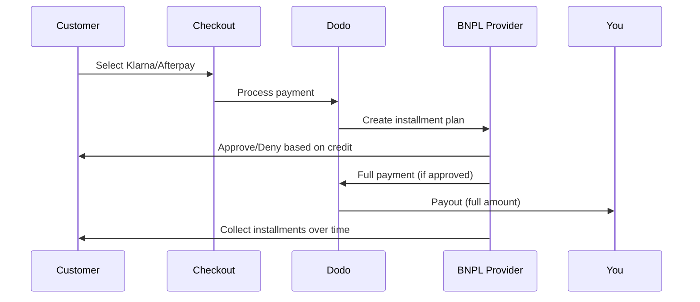

Buy Now Pay Later (BNPL) ग्राहकों को खरीदारी को ब्याज-मुक्त किस्तों में विभाजित करने देता है, योग्य लेनदेन के लिए औसत ऑर्डर मूल्य में 20-50% और रूपांतरण दरों में 10-30% तक वृद्धि करता है।

## BNPL क्यों प्रस्तावित करें?

<CardGroup cols={3}>
<Card title="Higher AOV" icon="chart-line">
ग्राहक अधिक खर्च करते हैं जब वे भुगतान को समय के साथ फैलाने में सक्षम होते हैं। औसत ऑर्डर मूल्य 20-50% तक बढ़ता है।
</Card>

<Card title="Better Conversion" icon="percent">
चेकआउट पर भुगतान गति कम करना। उच्च-मूल्य वस्तुओं के लिए रूपांतरण दरें 10-30% तक सुधरती हैं।
</Card>

<Card title="Zero Risk" icon="shield-check">
BNPL प्रदाता क्रेडिट जोखिम और वसूली का प्रबंधन करते हैं। आपको पूरा भुगतान अग्रिम में प्राप्त होता है।
</Card>
</CardGroup>

## समर्थित प्रदाता

### Klarna

| विशेषता | विवरण |
| :------ | :------ |
| **उपलब्धता** | US + 19 यूरोपीय देश |
| **मुद्राएँ** | USD, EUR, GBP, DKK, NOK, SEK, CZK, RON, PLN, CHF |
| **न्यूनतम** | $50.01 (या समकक्ष) |
| **सदस्यताएँ** | हाँ |

**Supported Countries:** Austria, Belgium, Czech Republic, Denmark, Finland, France, Germany, Greece, Ireland, Italy, Netherlands, Norway, Poland, Portugal, Romania, Spain, Sweden, Switzerland, United Kingdom, United States

**Payment Options:**
- **Pay in 4** — Split into 4 interest-free payments
- **Pay in 30 days** — Full payment due in 30 days
- **Financing** — Longer-term installment plans

### Afterpay (Clearpay)

| Feature | Details |
| :------ | :------ |
| **Availability** | US, UK |
| **Currencies** | USD, GBP |
| **Minimum** | $50.01 (or equivalent) |
| **Subscriptions** | No |

**Payment Options:**
- **Pay in 4** — 4 interest-free payments every 2 weeks

<Note>
In the UK, Afterpay operates as "Clearpay" but uses the same API type (`afterpay_clearpay`).
</Note>

### Billie

| Feature | Details |
| :------ | :------ |
| **Availability** | Global |
| **Currencies** | GBP |
| **Minimum** | None |
| **Subscriptions** | No |

**About Billie:**
Billie एक B2B Buy Now Pay Later समाधान है जो व्यवसायों को अपने ग्राहकों को लचीले भुगतान शर्तें प्रदान करने में सक्षम बनाता है। यह व्यापार से व्यापार लेनदेन के लिए डिज़ाइन किया गया है जहाँ खरीदारों को चालान-आधारित भुगतान विकल्पों की आवश्यकता होती है।

**Payment Options:**
- **Invoice Payment** — सहमत भुगतान शर्तों के भीतर भुगतान करें
- **Flexible Terms** — व्यवसाय-हितैषी भुगतान अनुसूचियाँ

## Configuration

### API Method Types

| Type | Provider |
| :--- | :------- |
| `klarna` | Klarna |
| `afterpay_clearpay` | Afterpay / Clearpay |
| `billie` | Billie (B2B) |

### Example

```javascript
const session = await client.checkoutSessions.create({
  product_cart: [{ product_id: 'pdt_123', quantity: 1 }],
  allowed_payment_method_types: [
    'klarna',
    'afterpay_clearpay',
    'credit',
    'debit'
  ],
  customer: {
    email: 'customer@example.com',
    name: 'Jane Smith'
  },
  billing_address: {
    country: 'US',
    zipcode: '10001'
  },
  return_url: 'https://example.com/success'
});
```

<Warning>
हमेशा fallback के रूप में `credit` और `debit` शामिल करें। सभी customers BNPL के लिए eligible नहीं होते, और provider के minimum से कम राशि वाले transactions qualify नहीं करेंगे।
</Warning>

## Transaction Amount Limits

प्रत्येक BNPL provider की अपनी minimum (और कभी-कभी maximum) transaction amount होती है:

| Provider | Minimum | Maximum |
| :------- | :------ | :------ |
| Klarna | $50.01 | — |
| Afterpay | $50.01 | — |

इन thresholds से बाहर के transactions:
- Checkout पर BNPL options दिखाई नहीं देंगे
- कोई error नहीं आएगा — options केवल दिखाई नहीं देंगे
- Card payments उपलब्ध रहेंगे

यह अपेक्षित behavior है। यदि आपके product की price का उस provider की supported range में आने की संभावना कम है, तो `allowed_payment_method_types` में BNPL method शामिल न करें।

## Installments कैसे काम करते हैं



**मुख्य बिंदु:**
- आपको BNPL provider से **पूरी payment upfront** मिलती है
- BNPL provider **credit risk और collections** संभालता है
- Customer आमतौर पर **4 installments** में सीधे provider को payment करता है
- Installment failures से **कोई chargebacks नहीं** — यह provider का risk है

## Testing

### Klarna Test Data

Test mode में इन details का उपयोग करें:

| Field | Approved | Denied |
| :---- | :------- | :----- |
| **Date of Birth** | 07-10-1970 | 07-10-1970 |
| **First Name** | Test | Test |
| **Last Name** | Person-us | Person-us |
| **Email** | customer@email.us | customer+denied@email.us |
| **Street** | Amsterdam Ave | Amsterdam Ave |
| **House Number** | 509 | 509 |
| **City** | New York | New York |
| **State** | New York | New York |
| **Postal Code** | 10024-3941 | 10024-3941 |
| **Phone** | +13106683312 | +13106354386 |

<Note>
Klarna को option के रूप में दिखाने के लिए transaction कम से कम $50 का होना चाहिए।
</Note>

### Afterpay Testing

<Steps>
<Step title="Select Afterpay">
Checkout में Afterpay चुनें और Pay पर click करें।
</Step>

<Step title="Successful payment">
कोई भी valid email और shipping address उपयोग करें।
</Step>

<Step title="Failed authentication">
Failure test करने के लिए: redirect page पर Afterpay modal बंद करें। Payment status बदलकर `requires_payment_method` हो जाएगा।
</Step>
</Steps>

## Best Practices

<AccordionGroup>
<Accordion title="Target high-ticket items">
BNPL $100-$1000 वाले products के लिए सबसे अच्छा काम करता है। इस range में "pay over time" का value proposition सबसे अधिक प्रभावी होता है।
</Accordion>

<Accordion title="Show installment amounts">
"4 payments of $25", "$100 with Klarna" की तुलना में अधिक प्रभावी है। जहाँ संभव हो, per-payment amount दिखाएँ।
</Accordion>

<Accordion title="Don't force BNPL for low-value products">
$50 से कम पर BNPL वैसे भी दिखाई नहीं देगा। $100 से कम पर अधिकांश customers cards पसंद करते हैं। BNPL promotion को अधिक कीमत वाले items पर केंद्रित करें।
</Accordion>

<Accordion title="Collect billing address">
BNPL providers को credit checks के लिए billing information चाहिए। सुनिश्चित करें कि आपका checkout पूरा address details collect करता है।
</Accordion>

<Accordion title="Set clear expectations">
Customers को समझना चाहिए कि वे आपके साथ नहीं, बल्कि Klarna/Afterpay के साथ credit agreement में प्रवेश कर रहे हैं।
</Accordion>
</AccordionGroup>

## Limitations

### No Subscriptions
BNPL payment methods **recurring payments को support नहीं करते**। Subscription products के लिए cards या अन्य recurring-compatible methods का उपयोग करें।

### Credit-Based Approval
BNPL providers instant credit checks करते हैं। सभी customers approve नहीं होंगे। Approval rates इन बातों के आधार पर अलग-अलग होती हैं:
- Provider के साथ customer की credit history
- Transaction amount
- Customer location

### Currency & Country Mapping

प्रत्येक currency अपने corresponding region तक सीमित होती है:

| Currency | Supported Countries |
| :------- | :------------------ |
| **USD** | केवल United States |
| **EUR** | सभी supported European countries (Austria, Belgium, Czech Republic, Denmark, Finland, France, Germany, Greece, Ireland, Italy, Netherlands, Norway, Poland, Portugal, Romania, Spain, Sweden, Switzerland) |
| **GBP** | United Kingdom और सभी supported European countries |

अन्य Klarna-supported currencies (DKK, NOK, SEK, CZK, RON, PLN, CHF) अपने respective countries में काम करती हैं।

<Info>
उदाहरण के लिए, USD transaction केवल US में customers को BNPL options दिखाएगा। EUR transaction सभी supported European countries में BNPL options दिखाएगा। GBP transaction UK और सभी supported European countries में customers को BNPL options दिखाएगा।
</Info>

| Provider | Supported Currencies |
| :------- | :------------------- |
| Klarna | USD, EUR, GBP, DKK, NOK, SEK, CZK, RON, PLN, CHF |
| Afterpay | USD (US), GBP (UK) |

## Troubleshooting

<AccordionGroup>
<Accordion title="BNPL not appearing at checkout">
**जाँचें:**
1. क्या transaction amount provider की supported range में है? (Klarna/Afterpay: min $50.01)
2. क्या customer location supported country में है?
3. क्या currency BNPL provider द्वारा supported है?
4. क्या BNPL method `allowed_payment_method_types` में शामिल है?

**समाधान:** आमतौर पर transaction minimum से कम या maximum से अधिक होता है। Verify करें कि amount provider की supported range में आता है।
</Accordion>

<Accordion title="Customer denied by BNPL provider">
**कारण:**
- Provider के साथ insufficient credit history
- बहुत-सी active installment plans
- Failed identity verification

**समाधान:** कुछ customers के लिए यह अपेक्षित है। सुनिश्चित करें कि card fallbacks उपलब्ध हों। Denial के specific reasons उजागर न करें।
</Accordion>

<Accordion title="Payment stuck in pending">
**कारण:** Customer ने BNPL provider के साथ authentication flow पूरा नहीं किया।

**समाधान:** Payment timeout होकर fail हो जाएगी। Customer फिर से प्रयास कर सकता है या कोई अलग method उपयोग कर सकता है।
</Accordion>
</AccordionGroup>

## Related Pages

<CardGroup cols={2}>
<Card title="Payment Methods Overview" icon="credit-card" href="/features/payment-methods">
सभी supported payment methods देखें।
</Card>

<Card title="Checkout Guide" icon="book" href="/developer-resources/checkout-session">
Checkout implementation guide पूरा करें।
</Card>

<Card title="Testing Process" icon="flask" href="/miscellaneous/testing-process">
Payment methods के लिए सभी test data।
</Card>

<Card title="Adaptive Currency" icon="globe" href="/features/adaptive-currency">
Currency support और conversion।
</Card>
</CardGroup>