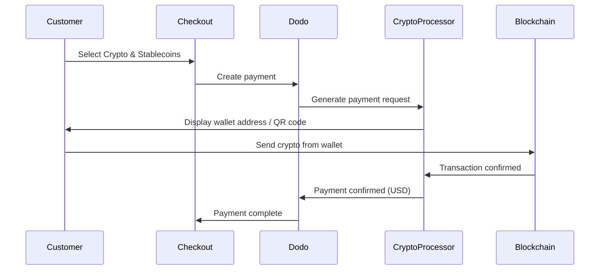

क्रिप्टो और स्टेबलकॉइन्स भुगतान ग्राहकों को दुनिया के किसी भी कोने से (भारत को छोड़कर) क्रिप्टोकरेंसी और स्टेबलकॉइन्स का उपयोग करने की अनुमति देता है। लेन-देन USD में बिल किए जाते हैं, जिससे आपको फिएट मुद्रा प्राप्त होती है जबकि ग्राहक अपनी पसंदीदा क्रिप्टो वॉलेट के साथ भुगतान करते हैं।

## क्रिप्टो और स्टेबलकॉइन्स क्यों पेश करें?

<CardGroup cols={3}>
<Card title="Global Reach" icon="globe">
किसी भी देश से भुगतान स्वीकार करें — ग्राहक के पक्ष में कोई बैंकिंग ढांचा आवश्यक नहीं।
</Card>

<Card title="No Chargebacks" icon="shield-check">
क्रिप्टो लेन-देन अपरिवर्तनीय हैं, जिससे चार्जबैक धोखाधड़ी पूरी तरह समाप्त हो जाती है।
</Card>

<Card title="USD Settlement" icon="dollar-sign">
आपको USD प्राप्त होता है — क्रिप्टो अस्थिरता या वॉलेट्स को प्रबंधित करने की आवश्यकता नहीं।
</Card>
</CardGroup>

## अवलोकन

| विवरण | मूल्य |
| :----- | :---- |
| **बिलिंग मुद्रा** | USD |
| **समर्थित देश** | वैश्विक (IN को छोड़कर) |
| **सब्सक्रिप्शन** | नहीं |
| **न्यूनतम राशि** | $0.50 |
| **सेटलमेंट** | USD |

## यह कैसे काम करता है



## ग्राहक अनुभव

1. ग्राहक चेकआउट पर क्रिप्टो और स्टेबलकॉइन्स का चयन करता है
2. वॉलेट पता और QR कोड के साथ क्रिप्टो में राशि प्रदर्शित होती है
3. ग्राहक अपने क्रिप्टो वॉलेट से सही राशि भेजता है
4. लेन-देन ब्लॉकचेन पर पुष्टि किया जाता है
5. ग्राहक को सफल पृष्ठ पर पुनः निर्देशित किया जाता है

<Info>
क्रिप्टो भुगतान USD में बिल किए जाते हैं। चेकआउट पर प्रदर्शित क्रिप्टो राशि वास्तविक समय की विनिमय दर को दर्शाती है।
</Info>

## समर्थित मुद्राएं और नेटवर्क

| मुद्रा | नेटवर्क |
| :------- | :------- |
| **USDC** | एथेरियम, सोलाना, पॉलीगॉन, बेस |
| **USDP** | एथेरियम, सोलाना |
| **USDG** | एथेरियम |

## कॉन्फ़िगरेशन

```javascript
const session = await client.checkoutSessions.create({
  product_cart: [{ product_id: 'prod_123', quantity: 1 }],
  allowed_payment_method_types: ['crypto', 'credit', 'debit'],
  return_url: 'https://example.com/success'
});
```

## API विधि प्रकार

| प्रकार | विधि | देश |
| :--- | :----- | :------ |
| `crypto` | क्रिप्टो और स्टेबलकॉइन्स | वैश्विक (IN को छोड़कर) |

## परीक्षण

<Steps>
<Step title="Enable test mode">
अपने Dodo Payments टेस्ट API कुंजियों का उपयोग करें।
</Step>

<Step title="Create a test checkout">
योजना भुगतान विधियों में `crypto` के साथ चेकआउट सत्र बनाएं।
</Step>

<Step title="Complete the test flow">
परीक्षण परिवेश में अनुकरणीय क्रिप्टो भुगतान प्रवाह का पालन करें।
</Step>
</Steps>

## सर्वोत्तम अभ्यास

<AccordionGroup>
<Accordion title="Always include card fallbacks">
सभी ग्राहकों के पास क्रिप्टो वॉलेट नहीं होते हैं। हमेशा `credit` और `debit` को बैकअप भुगतान विधियों के रूप में शामिल करें।
</Accordion>

<Accordion title="Set clear expectations on confirmation time">
ब्लॉकचेन पुष्टि में मिनट लग सकते हैं, नेटवर्क के आधार पर। सुनिश्चित करें कि आपका चेकआउट ग्राहकों को यह सूचित करता है।
</Accordion>

<Accordion title="Handle underpayments and overpayments">
क्रिप्टो भुगतान कभी-कभी नेटवर्क शुल्क के कारण सही राशि से थोड़े भिन्न हो सकते हैं। भुगतान स्थिति परिवर्तनों के लिए वेबहुक की निगरानी करें।
</Accordion>
</AccordionGroup>

## समस्या निवारण

<AccordionGroup>
<Accordion title="Crypto not appearing at checkout">
**जॉंच करें:**
1. `crypto` को `allowed_payment_method_types` में शामिल किया गया है?
2. लेन-देन की राशि न्यूनतम ($0.50) है?

**समाधान:** सुनिश्चित करें कि भुगतान विधि प्रकार आपके API अनुरोध में सही ढंग से पास हो रहा है।
</Accordion>

<Accordion title="Payment not confirming">
**कारण:** ब्लॉकचेन की पुष्टि का समय अलग-अलग होता है। कुछ नेटवर्क अन्य की तुलना में अधिक समय लेते हैं।

**समाधान:** वेबहुक पुष्टि की प्रतीक्षा करें। पुष्टि विंडो समाप्त होने तक भुगतान को विफल नहीं मानें।
</Accordion>

<Accordion title="Amount mismatch">
**कारण:** भुगतान शुरू करने और भेजने के बीच क्रिप्टो विनिमय दरों में उतार-चढ़ाव होता है।

**समाधान:** अंतिम पुष्टि की गई राशि के लिए वेबहुक की निगरानी करें। छोटी-छोटी असंगतियों को स्वचालित रूप से संभाला जाता है।
</Accordion>
</AccordionGroup>

## संबंधित पेज

<CardGroup cols={2}>
<Card title="Payment Methods Overview" icon="credit-card" href="/features/payment-methods">
सभी समर्थित भुगतान विधियों को देखें।
</Card>

<Card title="Checkout Guide" icon="book" href="/developer-resources/checkout-session">
पूरा चेकआउट कार्यान्वयन गाइड।
</Card>

<Card title="Webhooks" icon="webhook" href="/developer-resources/webhooks">
भुगतान पुष्टि को असिंक्रोनस रूप से संभालें।
</Card>

<Card title="Testing Process" icon="flask" href="/miscellaneous/testing-process">
सभी भुगतान विधियों के लिए पूर्ण परीक्षण गाइड।
</Card>
</CardGroup>
