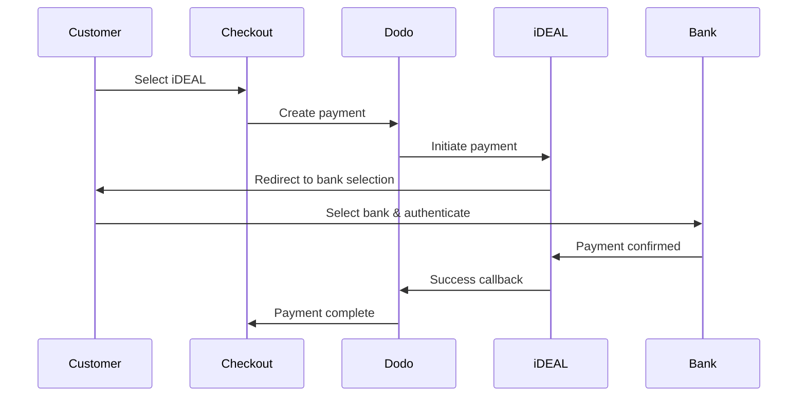
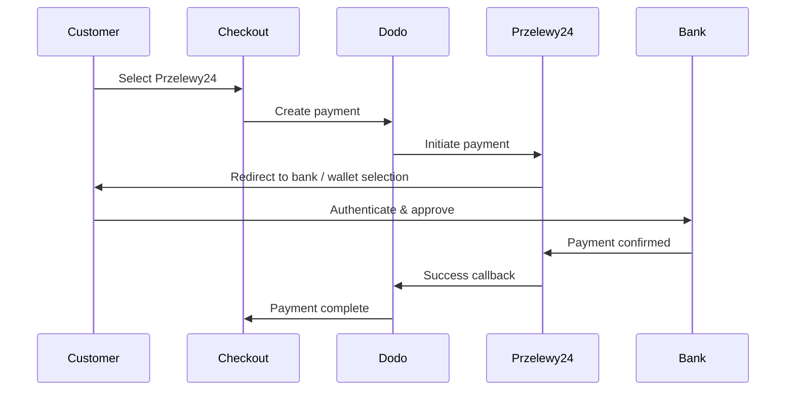
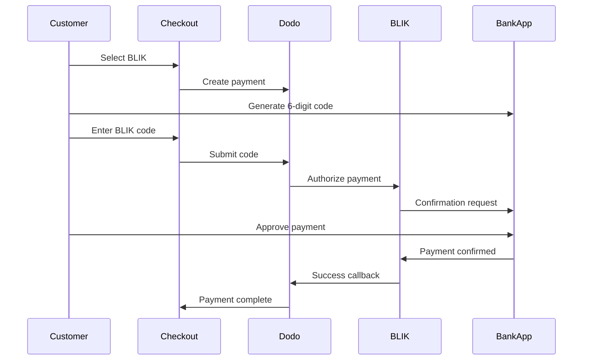

यूरोपीय ग्राहक अपने बैंकिंग सिस्टम के साथ एकीकृत स्थानीय भुगतान विधियों को प्राथमिकता देते हैं। इन विधियों की पेशकश करने से लक्षित बाजारों में रूपांतरण दर 20-40% बढ़ सकती है।

## स्थानीय यूरोपीय भुगतान विधियाँ क्यों?

<CardGroup cols={3}>
<Card title="Higher Conversion" icon="chart-line">
iDEAL डच ऑनलाइन भुगतान का लगभग 60% हिस्सा लेता है। इसे नहीं देने का मतलब है ग्राहकों को खो देना।
</Card>

<Card title="Lower Fraud" icon="shield-check">
बैंक प्रमाणित भुगतान में लगभग शून्य धोखाधड़ी दर होती है और कोई चार्जबैक नहीं होता।
</Card>

<Card title="Real-Time Settlement" icon="bolt">
अधिकांश यूरोपीय विधियाँ तत्काल भुगतान पुष्टि प्रदान करती हैं।
</Card>
</CardGroup>

## समर्थित विधियाँ

| Method | Country | Market Share | Currency | Subscriptions |
| :----- | :------ | :----------- | :------- | :-----------: |
| **iDEAL** | Netherlands | ~60% | EUR | नहीं |
| **Bancontact** | Belgium | ~50% | EUR | नहीं |
| **EPS** | Austria | ~30% | EUR | नहीं |
| **Multibanco** | Portugal | ~40% | EUR | नहीं |
| **Przelewy24 (P24)** | Poland | ~30% | PLN | नहीं |
| **BLIK** | Poland | ~60% | PLN | नहीं |
| **Satispay** | Europe (Italy) | बढ़ती हुई | EUR | जी हाँ |

## iDEAL (नीदरलैंड्स)

iDEAL नीदरलैंड्स में प्रमुख ऑनलाइन भुगतान विधि है, जो सभी प्रमुख डच बैंकों से सीधे जुड़ी है।

### यह कैसे काम करता है



### समर्थित बैंक

सभी प्रमुख डच बैंक समर्थित हैं:
- ABN AMRO
- ASN बैंक
- Bunq
- ING
- Knab
- Rabobank
- RegioBank
- Revolut
- SNS
- Triodos बैंक
- Van Lanschot

### कॉन्फ़िगरेशन

```javascript
const session = await client.checkoutSessions.create({
  product_cart: [{ product_id: 'prod_123', quantity: 1 }],
  allowed_payment_method_types: ['ideal', 'credit', 'debit'],
  billing_currency: 'EUR',
  billing_address: {
    country: 'NL',
    zipcode: '1012JS'
  },
  return_url: 'https://example.com/success'
});
```

## Bancontact (बेल्जियम)

Bancontact बेल्जियम की राष्ट्रीय भुगतान योजना है, जिसका उपयोग लगभग सभी बेल्जियाई बैंकों द्वारा ऑनलाइन भुगतान के लिए किया जाता है।

### विशेषताएँ
- मौजूदा बेल्जीयम डेबिट कार्ड के साथ काम करता है
- मोबाइल ऐप समर्थन (Payconiq द्वारा Bancontact)
- तत्काल भुगतान पुष्टि
- ग्राहकों के लिए कोई अतिरिक्त पंजीकरण की आवश्यकता नहीं

### कॉन्फ़िगरेशन

```javascript
const session = await client.checkoutSessions.create({
  product_cart: [{ product_id: 'prod_123', quantity: 1 }],
  allowed_payment_method_types: ['bancontact_card', 'credit', 'debit'],
  billing_currency: 'EUR',
  billing_address: {
    country: 'BE',
    zipcode: '1000'
  },
  return_url: 'https://example.com/success'
});
```

## EPS (ऑस्ट्रिया)

EPS (इलेक्ट्रॉनिक भुगतान मानक) ऑस्ट्रियाई ग्राहकों के लिए सीधे ऑनलाइन बैंक ट्रांसफर की अनुमति देता है।

### विशेषताएँ
- ऑस्ट्रियाई बैंकों के साथ सीधा एकीकरण
- वास्तविक समय भुगतान पुष्टि
- ऑस्ट्रियाई उपभोक्ताओं के बीच उच्च विश्वास
- कोई चार्जबैक नहीं

### समर्थित बैंक

प्रमुख ऑस्ट्रियाई बैंक जिनमें शामिल हैं:
- Erste बैंक
- बैंक ऑस्ट्रिया
- Raiffeisen
- BAWAG
- Volksbank

### कॉन्फ़िगरेशन

```javascript
const session = await client.checkoutSessions.create({
  product_cart: [{ product_id: 'prod_123', quantity: 1 }],
  allowed_payment_method_types: ['eps', 'credit', 'debit'],
  billing_currency: 'EUR',
  billing_address: {
    country: 'AT',
    zipcode: '1010'
  },
  return_url: 'https://example.com/success'
});
```

## Multibanco (पुर्तगाल)

Multibanco पुर्तगाल का इंटरबैंक नेटवर्क है, जो ऑनलाइन भुगतान और एटीएम-आधारित भुगतान दोनों की पेशकश करता है।

### भुगतान विकल्प

1. **ऑनलाइन बैंकिंग** — इंटरनेट बैंकिंग के माध्यम से सीधे बैंक ट्रांसफर
2. **एटीएम भुगतान** — ग्राहक किसी भी Multibanco एटीएम पर भुगतान करने के लिए एक संदर्भ प्राप्त करता है
3. **मोबाइल बैंकिंग** — बैंक मोबाइल ऐप्स के माध्यम से भुगतान

### एटीएम भुगतान कैसे काम करता है

एटीएम भुगतानों के लिए, ग्राहकों को एक भुगतान संदर्भ प्राप्त होता है:

```
Entity: 12345
Reference: 123 456 789
Amount: €50.00
Expiry: 24 hours
```

ग्राहक इस संदर्भ का उपयोग करते हुए किसी भी पुर्तगाली एटीएम या ऑनलाइन बैंकिंग के माध्यम से भुगतान कर सकते हैं।

### कॉन्फ़िगरेशन

```javascript
const session = await client.checkoutSessions.create({
  product_cart: [{ product_id: 'prod_123', quantity: 1 }],
  allowed_payment_method_types: ['multibanco', 'credit', 'debit'],
  billing_currency: 'EUR',
  billing_address: {
    country: 'PT',
    zipcode: '1000-001'
  },
  return_url: 'https://example.com/success'
});
```

<Note>
Multibanco ATM भुगतान में चेकआउट और वास्तविक भुगतान के बीच देरी हो सकती है। भुगतान पुष्टि के लिए वेबहुक की निगरानी करें।
</Note>

## Przelewy24 (पोलैंड)

Przelewy24 (P24) पोलैंड की प्रमुख ऑनलाइन भुगतान विधि है, जो सभी प्रमुख पोलिश बैंकों के बीच बैंक हस्तांतरण और स्थानीय वॉलेट्स को एकत्रित करती है। अन्य यूरोपीय विधियों के विपरीत, Przelewy24 **PLN** (पोलिश ज़्लॉटी) में निपटान करता है, न कि EUR में।

### कैसे काम करता है



### उपलब्धता

- **बिलिंग मुद्रा:** केवल PLN
- **ट्रांजेक्शन प्रकार:** केवल एकबारगी भुगतान (सदस्यता के लिए उपलब्ध नहीं)
- **कवरेज:** सभी प्रमुख पोलिश बैंक और लोकप्रिय स्थानीय वॉलेट्स

### विन्यास

```javascript
const session = await client.checkoutSessions.create({
  product_cart: [{ product_id: 'prod_123', quantity: 1 }],
  allowed_payment_method_types: ['przelewy24', 'credit', 'debit'],
  billing_currency: 'PLN',
  billing_address: {
    country: 'PL',
    zipcode: '00-001'
  },
  return_url: 'https://example.com/success'
});
```

<Note>
Przelewy24 को **PLN** बिलिंग मुद्रा की आवश्यकता होती है। यदि आप अपनी कीमतें EUR में देते हैं, तो [अनुकूली मुद्रा](/features/adaptive-currency) सक्षम करें ताकि पोलिश ग्राहकों को PLN में बिल किया जा सके और Przelewy24 उपलब्ध हो सकें।
</Note>

## BLIK (Poland)

BLIK पोलैंड की सबसे लोकप्रिय मोबाइल भुगतान विधि है, जो ग्राहकों को उनके बैंकिंग ऐप में उत्पन्न एक बार के 6-अंकीय कोड का उपयोग करके भुगतान करने की अनुमति देती है। Przelewy24 की तरह, BLIK **PLN** (पोलिश ज़्लॉटी) में सेटल होता है, EUR में नहीं।

### यह कैसे काम करता है



### उपलब्धता

- **बिलिंग मुद्रा:** केवल PLN
- **लेन-देन प्रकार:** केवल एक बार के भुगतान (सदस्यता के लिए उपलब्ध नहीं)
- **कवरेज:** सभी प्रमुख पोलिश बैंक जो BLIK का समर्थन करते हैं

### कॉन्फ़िगरेशन

```javascript
const session = await client.checkoutSessions.create({
  product_cart: [{ product_id: 'prod_123', quantity: 1 }],
  allowed_payment_method_types: ['blik', 'credit', 'debit'],
  billing_currency: 'PLN',
  billing_address: {
    country: 'PL',
    zipcode: '00-001'
  },
  return_url: 'https://example.com/success'
});
```

<Note>
BLIK के लिए एक **PLN** बिलिंग मुद्रा की आवश्यकता होती है। यदि आप EUR में अपनी कीमतें उद्धृत करते हैं, तो [Adaptive Currency](/features/adaptive-currency) को सक्षम करें ताकि पोलिश ग्राहक PLN में बिल किए जा सकें और BLIK उपलब्ध हो जाए।
</Note>

## Satispay (Europe)

Satispay एक लोकप्रिय यूरोपीय मोबाइल भुगतान नेटवर्क है, विशेष रूप से इटली में, जो ग्राहकों को उनके Satispay ऐप से सीधे भुगतान करने की अनुमति देता है बिना कार्ड या बैंक विवरण साझा किए। Satispay **EUR** में सेटल होता है।

### विशेषताएँ

- कार्ड नेटवर्क से स्वतंत्र ऐप-आधारित भुगतान
- इटली में मजबूत अपनापन और अन्य यूरोपीय बाजारों में बढ़ती
- एक बार के भुगतान और सब्सक्रिप्शन दोनों का समर्थन करता है

### उपलब्धता

- **बिलिंग मुद्रा:** EUR
- **लेन-देन प्रकार:** एक बार के भुगतान और सब्सक्रिप्शन

### कॉन्फ़िगरेशन

```javascript
const session = await client.checkoutSessions.create({
  product_cart: [{ product_id: 'prod_123', quantity: 1 }],
  allowed_payment_method_types: ['satispay', 'credit', 'debit'],
  billing_currency: 'EUR',
  billing_address: {
    country: 'IT',
    zipcode: '00100'
  },
  return_url: 'https://example.com/success'
});
```

## API Method Types

| Type | Method | Country |
| :--- | :----- | :------ |
| `ideal` | iDEAL | Netherlands |
| `bancontact_card` | Bancontact | Belgium |
| `eps` | EPS | Austria |
| `multibanco` | Multibanco | Portugal |
| `przelewy24` | Przelewy24 (P24) | Poland |
| `blik` | BLIK | Poland |
| `satispay` | Satispay | Europe (Italy) |

## बहु-देशीय यूरोपीय चेकआउट

कई यूरोपीय देशों की सेवा करने वाले व्यवसायों के लिए, सभी क्षेत्रीय विधियों को शामिल करें:

```javascript
const session = await client.checkoutSessions.create({
  product_cart: [{ product_id: 'prod_123', quantity: 1 }],
  allowed_payment_method_types: [
    'ideal',           // Netherlands
    'bancontact_card', // Belgium
    'eps',             // Austria
    'multibanco',      // Portugal
    'przelewy24',      // Poland (requires PLN billing currency)
    'blik',            // Poland (requires PLN billing currency)
    'satispay',        // Europe / Italy
    'credit',          // Fallback
    'debit'            // Fallback
  ],
  billing_currency: 'EUR',
  return_url: 'https://example.com/success'
});
```

Dodo स्वचालित रूप से ग्राहक स्थान के आधार पर केवल प्रासंगिक विधियाँ दिखाता है। एक डच ग्राहक iDEAL देखेगा; एक बेल्जियन ग्राहक Bancontact देखेगा।

## परीक्षण

यूरोपीय भुगतान विधियों को सैंडबॉक्स मोड में परीक्षण किया जा सकता है। परीक्षण प्रवाह बैंक प्रमाणीकरण प्रक्रिया का अनुकरण करता है।

<Steps>
<Step title="Enable test mode">
अपने Dodo Payments परीक्षण API कुंजियों का उपयोग करें।
</Step>

<Step title="Set appropriate billing address">
बिलिंग पते के देश को भुगतान विधि से मेल खाने के लिए सेट करें:
- `NL` के लिए iDEAL
- `BE` के लिए Bancontact
- `AT` के लिए EPS
- `PT` के लिए Multibanco
- `PL` के लिए Przelewy24 और BLIK (PLN बिलिंग मुद्रा के साथ)
- `IT` के लिए Satispay
</Step>

<Step title="Complete the test flow">
टेस्ट वातावरण में अनुकरणीय बैंक प्रमाणीकरण प्रवाह का पालन करें।
</Step>
</Steps>

## सर्वोत्तम अभ्यास

<AccordionGroup>
<Accordion title="Always include regional methods for target markets">
यदि आप डच ग्राहकों को बेचते हैं, तो iDEAL को शामिल करें। ऐसा न करना अमेरिका में वीज़ा ना स्वीकारने जैसा है — आप महत्वपूर्ण बिक्री खो देंगे।
</Accordion>

<Accordion title="Match currency to region">
अधिकांश यूरोपीय भुगतान विधियों के लिए EUR की आवश्यकता होती है — सुनिश्चित करें कि आपकी मूल्य निर्धारण यूरो लेन-देन का समर्थन करता है। एकमात्र अपवाद Przelewy24 है, जिसे केवल **PLN** (पोलिश ज़्लॉटी) बिलिंग पर पेश किया जाता है।
</Accordion>

<Accordion title="Handle redirects gracefully">
सभी यूरोपीय विधियाँ बैंक साइटों पर रीडायरेक्ट करती हैं। सुनिश्चित करें कि आपका रिटर्न URL हैंडलिंग मजबूत है और उन उपयोगकर्ताओं के लिए खाता है जो मध्य-प्रवाह में छोड़ देते हैं।
</Accordion>

<Accordion title="Provide card fallbacks">
सभी यूरोपीय ग्राहकों को इन क्षेत्रीय विधियों तक पहुंच नहीं है (पर्यटक, प्रवासी आदि)। हमेशा `credit` और `debit` को बैकअप के रूप में शामिल करें।
</Accordion>

<Accordion title="Consider Multibanco timing">
Multibanco एटीएम भुगतान पूरा होने में घंटों लग सकते हैं। तुरंत भुगतान पर पूर्ति को अवरुद्ध न करें — असिंक्रिन पुष्टि के लिए वेबहुक का उपयोग करें।
</Accordion>
</AccordionGroup>

## समस्या निवारण

<AccordionGroup>
<Accordion title="European method not appearing">
**जांचें:**
1. ग्राहक बिलिंग देश विधि के देश से मेल खाता है?
2. मुद्रा EUR में सेट है?
3. विधि `allowed_payment_method_types` में शामिल है?

**समाधान:** यूरोपीय विधियाँ सख्ती से क्षेत्रीय हैं। एक ग्राहक जिसका बिलिंग देश `DE` (जर्मनी) है, उसे iDEAL नहीं दिखाई देगा, जो केवल नीदरलैंड्स के लिए है।
</Accordion>

<Accordion title="Bank authentication failed">
**कारण:**
- ग्राहक ने बैंक प्रमाणीकरण के दौरान रद्द कर दिया
- बैंक की प्रमाणीकरण प्रणाली अस्थायी रूप से उपलब्ध नहीं है
- ग्राहक ने गलत प्रमाण पत्र दर्ज किए

**समाधान:** ग्राहक को पुनः प्रयास करना चाहिए। यदि स्थिर, तो एक अलग भुगतान विधि आज़माने का सुझाव दें।
</Accordion>

<Accordion title="Redirect not completing">
**कारण:**
- ग्राहक ने बैंक रीडायरेक्ट के दौरान ब्राउज़र बंद कर दिया
- प्रमाणीकरण के दौरान नेटवर्क समस्याएँ
- रिटर्न URL गलत तरीके से कॉन्फ़िगर किया गया

**समाधान:** पुष्टि करें कि रिटर्न URL सही और सुलभ है। सुनिश्चित करें कि यह सफलता और असफलता दोनों राज्यों को संभालता है।
</Accordion>

<Accordion title="Multibanco payment pending">
**कारण:** ग्राहक को भुगतान संदर्भ प्राप्त हुआ है लेकिन अभी भुगतान नहीं किया है।

**समाधान:** यह एटीएम-आधारित भुगतानों के लिए अपेक्षित है। वेबहुक की पुष्टि की प्रतीक्षा करें। संदर्भ आमतौर पर 24-72 घंटों में समाप्त हो जाता है।
</Accordion>
</AccordionGroup>

## PSD2 अनुपालन

सभी यूरोपीय भुगतान विधियाँ PSD2 (Payment Services Directive 2) नियमों का पालन करती हैं:

- **मजबूत ग्राहक प्रमाणीकरण (SCA)** — बैंक प्रमाणीकरण प्रवाह में निर्मित
- **सुरक्षित संचार** — सभी डेटा सुरक्षित चैनलों के माध्यम से प्रेषित
- **उपभोक्ता संरक्षण** — ईयू उपभोक्ता अधिकारों के पूर्ण अनुपालन के साथ

## संबंधित पृष्ठ

<CardGroup cols={2}>
<Card title="Payment Methods Overview" icon="credit-card" href="/features/payment-methods">
सभी समर्थित भुगतान विधियों को देखें।
</Card>

<Card title="Adaptive Currency" icon="globe" href="/features/adaptive-currency">
मुद्रा समर्थन और स्वचालित रूपांतरण।
</Card>

<Card title="Checkout Guide" icon="book" href="/developer-resources/checkout-session">
पूर्ण चेकआउट कार्यान्वयन गाइड।
</Card>

<Card title="Webhooks" icon="webhook" href="/developer-resources/webhooks">
भुगतान पुष्टि को असिंक्रोनस रूप से संभालें।
</Card>
</CardGroup>