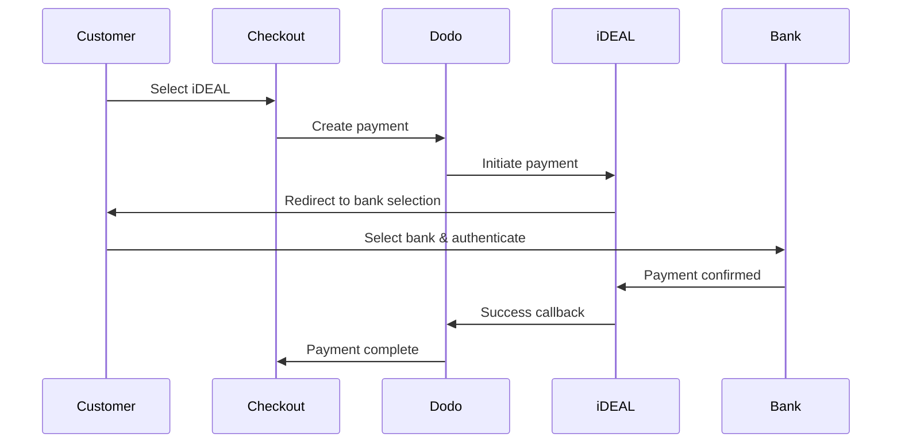
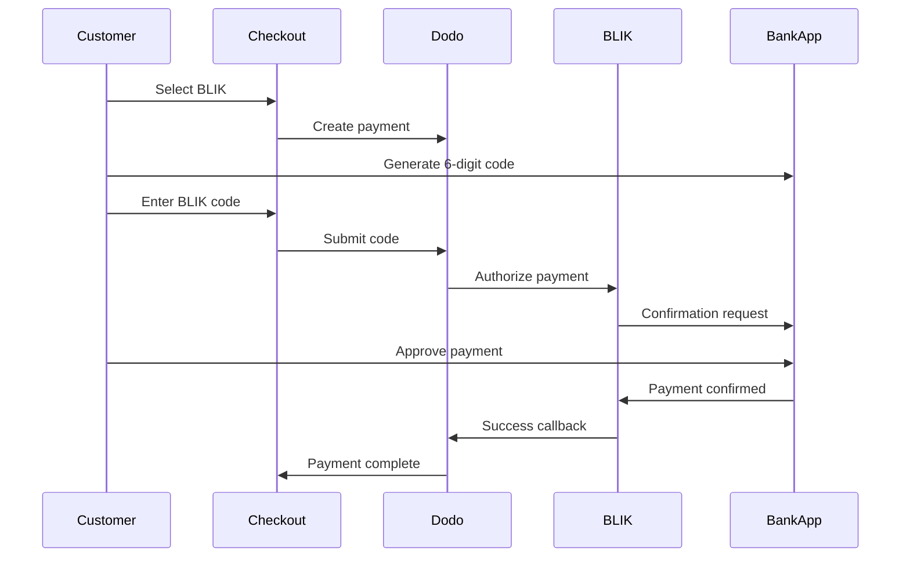
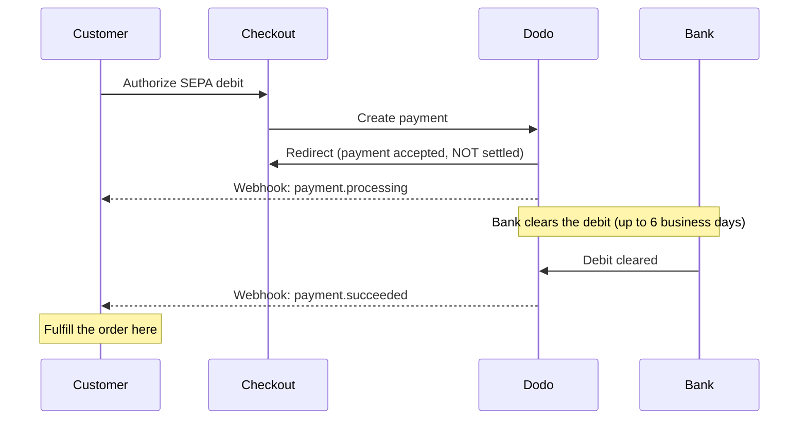

यूरोपीय ग्राहक अपने बैंकिंग सिस्टम के साथ एकीकृत स्थानीय भुगतान विधियों को प्राथमिकता देते हैं। इन विधियों की पेशकश करने से लक्षित बाजारों में रूपांतरण दर 20-40% बढ़ सकती है।

## स्थानीय यूरोपीय भुगतान विधियाँ क्यों?

<CardGroup cols={3}>
<Card title="Higher Conversion" icon="chart-line">
iDEAL डच ऑनलाइन भुगतान का लगभग 60% हिस्सा लेता है। इसे नहीं देने का मतलब है ग्राहकों को खो देना।
</Card>

<Card title="Lower Fraud" icon="shield-check">
बैंक प्रमाणित भुगतान में लगभग शून्य धोखाधड़ी दर होती है और कोई चार्जबैक नहीं होता।
</Card>

<Card title="Real-Time Settlement" icon="bolt">
अधिकांश यूरोपीय विधियाँ तत्काल भुगतान पुष्टि प्रदान करती हैं।
</Card>
</CardGroup>

## समर्थित विधियाँ

| Method | Country | Market Share | Currency | Subscriptions |
| :----- | :------ | :----------- | :------- | :-----------: |
| **iDEAL** | Netherlands | ~60% | EUR | No |
| **Bancontact** | Belgium | ~50% | EUR | No |
| **EPS** | Austria | ~30% | EUR | No |
| **Multibanco** | Portugal | ~40% | EUR | No |
| **BLIK** | Poland | ~60% | PLN | No |
| **SEPA Direct Debit** | Eurozone | Widely used | EUR | No |
| **Satispay** | Europe (Italy) | Growing | EUR | Yes |

## iDEAL (नीदरलैंड्स)

iDEAL नीदरलैंड्स में प्रमुख ऑनलाइन भुगतान विधि है, जो सभी प्रमुख डच बैंकों से सीधे जुड़ी है।

### यह कैसे काम करता है



### समर्थित बैंक

सभी प्रमुख डच बैंक समर्थित हैं:
- ABN AMRO
- ASN बैंक
- Bunq
- ING
- Knab
- Rabobank
- RegioBank
- Revolut
- SNS
- Triodos बैंक
- Van Lanschot

### कॉन्फ़िगरेशन

```javascript
const session = await client.checkoutSessions.create({
  product_cart: [{ product_id: 'pdt_123', quantity: 1 }],
  allowed_payment_method_types: ['ideal', 'credit', 'debit'],
  billing_currency: 'EUR',
  billing_address: {
    country: 'NL',
    zipcode: '1012JS'
  },
  return_url: 'https://example.com/success'
});
```

## Bancontact (बेल्जियम)

Bancontact बेल्जियम की राष्ट्रीय भुगतान योजना है, जिसका उपयोग लगभग सभी बेल्जियाई बैंकों द्वारा ऑनलाइन भुगतान के लिए किया जाता है।

### विशेषताएँ
- मौजूदा बेल्जीयम डेबिट कार्ड के साथ काम करता है
- मोबाइल ऐप समर्थन (Payconiq द्वारा Bancontact)
- तत्काल भुगतान पुष्टि
- ग्राहकों के लिए कोई अतिरिक्त पंजीकरण की आवश्यकता नहीं

### कॉन्फ़िगरेशन

```javascript
const session = await client.checkoutSessions.create({
  product_cart: [{ product_id: 'pdt_123', quantity: 1 }],
  allowed_payment_method_types: ['bancontact_card', 'credit', 'debit'],
  billing_currency: 'EUR',
  billing_address: {
    country: 'BE',
    zipcode: '1000'
  },
  return_url: 'https://example.com/success'
});
```

## EPS (ऑस्ट्रिया)

EPS (इलेक्ट्रॉनिक भुगतान मानक) ऑस्ट्रियाई ग्राहकों के लिए सीधे ऑनलाइन बैंक ट्रांसफर की अनुमति देता है।

### विशेषताएँ
- ऑस्ट्रियाई बैंकों के साथ सीधा एकीकरण
- वास्तविक समय भुगतान पुष्टि
- ऑस्ट्रियाई उपभोक्ताओं के बीच उच्च विश्वास
- कोई चार्जबैक नहीं

### समर्थित बैंक

प्रमुख ऑस्ट्रियाई बैंक जिनमें शामिल हैं:
- Erste बैंक
- बैंक ऑस्ट्रिया
- Raiffeisen
- BAWAG
- Volksbank

### कॉन्फ़िगरेशन

```javascript
const session = await client.checkoutSessions.create({
  product_cart: [{ product_id: 'pdt_123', quantity: 1 }],
  allowed_payment_method_types: ['eps', 'credit', 'debit'],
  billing_currency: 'EUR',
  billing_address: {
    country: 'AT',
    zipcode: '1010'
  },
  return_url: 'https://example.com/success'
});
```

## Multibanco (पुर्तगाल)

Multibanco पुर्तगाल का इंटरबैंक नेटवर्क है, जो ऑनलाइन भुगतान और एटीएम-आधारित भुगतान दोनों की पेशकश करता है।

### भुगतान विकल्प

1. **ऑनलाइन बैंकिंग** — इंटरनेट बैंकिंग के माध्यम से सीधे बैंक ट्रांसफर
2. **एटीएम भुगतान** — ग्राहक किसी भी Multibanco एटीएम पर भुगतान करने के लिए एक संदर्भ प्राप्त करता है
3. **मोबाइल बैंकिंग** — बैंक मोबाइल ऐप्स के माध्यम से भुगतान

### एटीएम भुगतान कैसे काम करता है

एटीएम भुगतानों के लिए, ग्राहकों को एक भुगतान संदर्भ प्राप्त होता है:

```
Entity: 12345
Reference: 123 456 789
Amount: €50.00
Expiry: 24 hours
```

ग्राहक इस संदर्भ का उपयोग करते हुए किसी भी पुर्तगाली एटीएम या ऑनलाइन बैंकिंग के माध्यम से भुगतान कर सकते हैं।

### कॉन्फ़िगरेशन

```javascript
const session = await client.checkoutSessions.create({
  product_cart: [{ product_id: 'pdt_123', quantity: 1 }],
  allowed_payment_method_types: ['multibanco', 'credit', 'debit'],
  billing_currency: 'EUR',
  billing_address: {
    country: 'PT',
    zipcode: '1000-001'
  },
  return_url: 'https://example.com/success'
});
```

<Note>
Multibanco ATM भुगतान में चेकआउट और वास्तविक भुगतान के बीच देरी हो सकती है। भुगतान पुष्टि के लिए वेबहुक की निगरानी करें।
</Note>

## BLIK (Poland)

BLIK पोलैंड की सबसे लोकप्रिय mobile payment method है, जिससे ग्राहक अपने banking app में बनाए गए एक बार इस्तेमाल होने वाले 6-अंकीय code से भुगतान कर सकते हैं। BLIK का settlement **PLN** (Polish Złoty) में होता है, EUR में नहीं।

### कैसे काम करता है



### उपलब्धता

- **Billing currency:** केवल PLN
- **Transaction type:** केवल one-time payments (subscriptions के लिए उपलब्ध नहीं)
- **Coverage:** BLIK का समर्थन करने वाले सभी प्रमुख Polish banks

### विन्यास

```javascript
const session = await client.checkoutSessions.create({
  product_cart: [{ product_id: 'pdt_123', quantity: 1 }],
  allowed_payment_method_types: ['blik', 'credit', 'debit'],
  billing_currency: 'PLN',
  billing_address: {
    country: 'PL',
    zipcode: '00-001'
  },
  return_url: 'https://example.com/success'
});
```

<Note>
BLIK के लिए **PLN** billing currency आवश्यक है। यदि आप अपनी prices EUR में quote करते हैं, तो [Adaptive Currency](/features/adaptive-currency) enable करें, ताकि Polish customers से PLN में billing हो और BLIK उपलब्ध हो जाए।
</Note>

## SEPA Direct Debit (Eurozone)

SEPA Direct Debit से Eurozone के ग्राहक card का उपयोग करने के बजाय सीधे अपने bank account से भुगतान कर सकते हैं। यह one-time payments के लिए EUR checkouts पर उपलब्ध है।

<Warning>
**SEPA Direct Debit तुरंत नहीं होता — किसी payment की पुष्टि में 6 business days तक लग सकते हैं।** इस पेज की अन्य सभी methods से अलग, checkout पर debit को authorize करने का अर्थ यह **नहीं** है कि पैसा clear हो गया है। checkout redirect या `payment.processing` पर order कभी fulfill न करें; `payment.succeeded` webhook की प्रतीक्षा करें।
</Warning>

### यह कैसे काम करता है

Customer checkout के दौरान debit को authorize करता है, जिसके बाद Dodo Payments उसके bank account से funds collect करता है। Bank debit को asynchronously clear करता है, इसलिए payment terminal outcome तक पहुँचने से पहले `processing` state से गुजरता है:



### Payment Timeline

| Stage | कब | Payment status | इसका अर्थ |
| :---- | :--- | :------------- | :------------ |
| **Authorization** | checkout पर | `processing` | Customer ने debit approve किया और वापस redirect किया गया। पैसा अभी **transfer नहीं हुआ है** — fulfill न करें। |
| **Confirmation** | इसके **6 business days** बाद तक | `succeeded` | Bank ने debit clear कर दिया। अब order fulfill करें। |
| **Failure** | इसके **6 business days** बाद तक | `failed` | Debit collect नहीं किया जा सका (जैसे, अपर्याप्त funds)। Fulfill न करें; customer को सूचित करें। |

Customer के आपकी site छोड़ने के कई दिनों बाद confirmation आती है, इसलिए access देने का कार्य checkout redirect को नहीं, बल्कि आपके webhook handler को करना चाहिए। नीचे [Confirmation Delay को संभालना](#handling-the-confirmation-delay) देखें।

### उपलब्धता

- **Billing currency:** EUR
- **Transaction type:** केवल one-time payments (subscriptions के लिए उपलब्ध नहीं)

### Configuration

```javascript
const session = await client.checkoutSessions.create({
  product_cart: [{ product_id: 'pdt_123', quantity: 1 }],
  allowed_payment_method_types: ['sepa', 'credit', 'debit'],
  billing_currency: 'EUR',
  billing_address: {
    country: 'DE',
    zipcode: '10115'
  },
  return_url: 'https://example.com/success'
});
```

### SEPA Test IBANs

Test mode में किसी विशेष outcome को बाध्य करने के लिए checkout पर नीचे दिए गए IBANs में से एक दर्ज करें।

| Test IBAN | व्यवहार |
| :-------- | :------- |
| `DE89370400440532013000` | Payment सफल होता है। |
| `DE08370400440532013003` | कम से कम तीन मिनट की देरी के बाद payment सफल होता है। |
| `DE62370400440532013001` | Payment विफल होता है। |
| `DE78370400440532013004` | कम से कम तीन मिनट की देरी के बाद payment विफल होता है। |
| `DE35370400440532013002` | Payment सफल होता है, फिर तुरंत dispute किया जाता है। |
| `DE65370400440002222227` | अपर्याप्त funds के कारण payment विफल होता है। |
| `DE18370400440000066666` | Bank account अनुपयोगी है, इसलिए payment method बनाई नहीं जा सकती। |

Country-specific behavior को test करने के लिए, किसी अन्य Eurozone country का equivalent success IBAN इस्तेमाल करें:

| Country | Success IBAN |
| :------ | :----------- |
| ऑस्ट्रिया | `AT611904300234573201` |
| बेल्जियम | `BE62510007547061` |
| एस्टोनिया | `EE382200221020145685` |
| फ़िनलैंड | `FI2112345600000785` |
| फ़्रांस | `FR1420041010050500013M02606` |
| आयरलैंड | `IE29AIBK93115212345678` |
| लक्ज़मबर्ग | `LU280019400644750000` |

<Note>
Delayed test IBANs यह पुष्टि करने के लिए उपयोगी हैं कि access checkout redirect के बजाय आपके webhook handler से दिया जाता है, क्योंकि SEPA payments customer के checkout छोड़ने के काफी समय बाद confirm होते हैं।
</Note>

### Confirmation Delay को संभालना

क्योंकि SEPA checkout के 6 business days बाद तक settle हो सकता है, इसलिए payment clear हुआ या नहीं यह जानने के लिए browser redirect पर निर्भर नहीं रह सकते। इसके बजाय, fulfillment को webhook events से संचालित करें। `payload.type` को on करें और प्रत्येक stage को संभालें:

| Event Type | यह कब fire होता है | क्या करें |
| :--------- | :------------ | :--------- |
| `payment.processing` | Customer ने checkout पर debit authorize किया और वापस redirect किया गया। | **Fulfill न करें।** Order को pending mark करें और, वैकल्पिक रूप से, customer को बताएं कि उनका payment process हो रहा है। |
| `payment.succeeded` | Bank ने debit clear कर दिया (6 business days बाद तक)। | Order fulfill करें — access दें, product provision करें और receipt भेजें। |
| `payment.failed` | Debit collect नहीं किया जा सका। | Customer को सूचित करें और retry करने के लिए कहें; fulfill न करें। |

```javascript Handling SEPA payment events expandable
app.post('/webhooks/dodo', async (req, res) => {
  const event = req.body;

  switch (event.type) {
    case 'payment.processing': {
      // SEPA debit authorized but NOT settled — this can last up to 6 business days.
      // Record the order as pending; do not grant access yet.
      await markOrderPending(event.data.payment_id);
      break;
    }
    case 'payment.succeeded': {
      // The debit cleared — safe to fulfill now.
      await fulfillOrder(event.data.payment_id);
      break;
    }
    case 'payment.failed': {
      // The debit could not be collected (e.g. insufficient funds).
      await markOrderFailed(event.data.payment_id);
      // Notify the customer and prompt a retry.
      break;
    }
  }

  res.json({ received: true });
});
```

<Tip>
हमेशा **webhook से प्राप्त `payment.succeeded` पर fulfill करें**, checkout redirect या `payment.processing` पर कभी नहीं। Redirect उसी क्षण fire होता है जब customer debit authorize करता है — यानी money के वास्तव में clear होने से कई दिन पहले। Processing से पहले webhook signature verify करें; setup के लिए [Webhooks guide](/developer-resources/webhooks) और पूरी event list के लिए [Webhook Event Guide](/developer-resources/webhooks/intents/webhook-events-guide) देखें।
</Tip>

<Warning>
checkout पर customer की अपेक्षाएं स्पष्ट करें। क्योंकि access debit clear होने के बाद ही दिया जाता है, SEPA customers को बताएं कि उनका order process हो रहा है और payment confirm होने पर उन्हें सूचित किया जाएगा — अन्यथा वे card payment की तरह instant access की अपेक्षा कर सकते हैं।
</Warning>

## Satispay (Europe)

Satispay एक लोकप्रिय European mobile payment network है, विशेष रूप से Italy में। यह customers को card या bank details साझा किए बिना सीधे अपने Satispay app से payment करने देता है। Satispay **EUR** में settle होता है।

### Features

- Card networks से स्वतंत्र app-based payments
- पूरे Italy में व्यापक adoption और अन्य European markets में बढ़ता उपयोग
- One-time payments और subscriptions दोनों को support करता है

### उपलब्धता

- **Billing currency:** EUR
- **Transaction type:** One-time payments और subscriptions

### Configuration

```javascript
const session = await client.checkoutSessions.create({
  product_cart: [{ product_id: 'pdt_123', quantity: 1 }],
  allowed_payment_method_types: ['satispay', 'credit', 'debit'],
  billing_currency: 'EUR',
  billing_address: {
    country: 'IT',
    zipcode: '00100'
  },
  return_url: 'https://example.com/success'
});
```

## API Method Types

| Type | Method | Country |
| :--- | :----- | :------ |
| `ideal` | iDEAL | Netherlands |
| `bancontact_card` | Bancontact | Belgium |
| `eps` | EPS | Austria |
| `multibanco` | Multibanco | Portugal |
| `blik` | BLIK | Poland |
| `sepa` | SEPA Direct Debit | Eurozone |
| `satispay` | Satispay | Europe (Italy) |

## Multi-Country European Checkout

कई European countries में सेवा देने वाले businesses के लिए, सभी regional methods शामिल करें:

```javascript
const session = await client.checkoutSessions.create({
  product_cart: [{ product_id: 'pdt_123', quantity: 1 }],
  allowed_payment_method_types: [
    'ideal',           // Netherlands
    'bancontact_card', // Belgium
    'eps',             // Austria
    'multibanco',      // Portugal
    'blik',            // Poland (requires PLN billing currency)
    'sepa',            // Eurozone (one-time payments only)
    'satispay',        // Europe / Italy
    'credit',          // Fallback
    'debit'            // Fallback
  ],
  billing_currency: 'EUR',
  return_url: 'https://example.com/success'
});
```

Dodo customer की location के आधार पर केवल relevant methods दिखाता है। Dutch customer को iDEAL और Belgian customer को Bancontact दिखाई देगा।

## Testing

European payment methods को Test Mode में test किया जा सकता है। Test flow bank authentication process का simulation करता है।

<Note>
SEPA Direct Debit को अलग तरीके से test किया जाता है — simulated bank flow के बजाय, आप सीधे test IBAN दर्ज करते हैं। [SEPA Test IBANs](#sepa-test-ibans) देखें।
</Note>

<Steps>
<Step title="Enable test mode">
अपने Dodo Payments test API keys का इस्तेमाल करें।
</Step>

<Step title="Set appropriate billing address">
Billing address country को payment method से match करने के लिए set करें:
- `NL` iDEAL के लिए
- `BE` Bancontact के लिए
- `AT` EPS के लिए
- `PT` Multibanco के लिए
- `PL` BLIK के लिए (PLN billing currency के साथ)
- `IT` Satispay के लिए
</Step>

<Step title="Complete the test flow">
Test environment में simulated bank authentication flow का पालन करें।
</Step>
</Steps>

## Best Practices

<AccordionGroup>
<Accordion title="Always include regional methods for target markets">
यदि आप Dutch customers को sell करते हैं, तो iDEAL शामिल करें। ऐसा न करना US में Visa स्वीकार न करने जैसा है — आपकी काफी sales कम हो जाएंगी।
</Accordion>

<Accordion title="Match currency to region">
अधिकांश European payment methods के लिए EUR आवश्यक है — सुनिश्चित करें कि आपकी pricing Euro transactions को support करती है। एकमात्र अपवाद BLIK है, जो केवल **PLN** (Polish Złoty) billing पर उपलब्ध है।
</Accordion>

<Accordion title="Handle redirects gracefully">
सभी European methods में bank sites पर redirects शामिल होते हैं। सुनिश्चित करें कि आपका return URL handling robust हो और बीच में flow छोड़ने वाले users को संभालता हो।
</Accordion>

<Accordion title="Provide card fallbacks">
सभी European customers के पास इन regional methods का access नहीं होता (tourists, expats आदि)। हमेशा `credit` और `debit` को fallback के रूप में शामिल करें।
</Accordion>

<Accordion title="Consider Multibanco timing">
Multibanco ATM payments को पूरा होने में कई घंटे लग सकते हैं। Immediate payment के आधार पर fulfillment को block न करें — async confirmation के लिए webhooks का इस्तेमाल करें।
</Accordion>

<Accordion title="Account for the SEPA 6-day delay">
SEPA Direct Debit की पुष्टि में **6 business days** तक लग सकते हैं। Checkout redirect या `payment.processing` पर कभी fulfill न करें — access केवल `payment.succeeded` webhook से दें और checkout पर अपेक्षाएं स्पष्ट करें ताकि customers जानें कि उनका order pending है। [Confirmation Delay को संभालना](#handling-the-confirmation-delay) देखें।
</Accordion>
</AccordionGroup>

## Troubleshooting

<AccordionGroup>
<Accordion title="European method not appearing">
**जाँचें:**
1. क्या Customer का billing country method के country से match करता है?
2. क्या Currency EUR पर set है?
3. क्या Method को `allowed_payment_method_types` में शामिल किया गया है?

**समाधान:** European methods strictly regional हैं। Billing country `DE` (Germany) वाला customer iDEAL नहीं देखेगा, क्योंकि यह केवल Netherlands के लिए है।
</Accordion>

<Accordion title="Bank authentication failed">
**कारण:**
- Customer ने bank authentication के दौरान cancel किया
- Bank का authentication system अस्थायी रूप से unavailable है
- Customer ने गलत credentials दर्ज किए

**समाधान:** Customer को retry करना चाहिए। समस्या बनी रहने पर, कोई अलग payment method आज़माने का सुझाव दें।
</Accordion>

<Accordion title="Redirect not completing">
**कारण:**
- Customer ने bank redirect के दौरान browser बंद कर दिया
- Authentication के दौरान network issues
- Return URL गलत configure किया गया है

**समाधान:** Verify करें कि return URL सही और accessible है। सुनिश्चित करें कि यह success और failure दोनों states को संभालता है।
</Accordion>

<Accordion title="Multibanco payment pending">
**कारण:** Customer को payment reference मिल गया है, लेकिन उसने अभी तक payment नहीं किया है।

**समाधान:** ATM-based payments के लिए यह expected है। Webhook confirmation की प्रतीक्षा करें। Reference आम तौर पर 24-72 घंटे में expire हो जाता है।
</Accordion>

<Accordion title="SEPA payment stuck in processing">
**कारण:** SEPA Direct Debit customer के bank के माध्यम से asynchronously clear होता है।

**समाधान:** यह expected है। Debit clear होने से पहले `payment.processing` state **6 business days** तक चल सकती है। Terminal `payment.succeeded` (fulfill) या `payment.failed` (fulfill न करें) webhook की प्रतीक्षा करें — checkout redirect को confirmation न मानें। [Confirmation Delay को संभालना](#handling-the-confirmation-delay) देखें।
</Accordion>
</AccordionGroup>

## PSD2 Compliance

सभी European payment methods PSD2 (Payment Services Directive 2) regulations का अनुपालन करते हैं:

- **Strong Customer Authentication (SCA)** — Bank authentication flow में built-in
- **Secure Communication** — सभी data secure channels के माध्यम से transmit किया जाता है
- **Consumer Protection** — EU consumer rights का पूर्ण अनुपालन

## Related Pages

<CardGroup cols={2}>
<Card title="Payment Methods Overview" icon="credit-card" href="/features/payment-methods">
सभी supported payment methods देखें।
</Card>

<Card title="Adaptive Currency" icon="globe" href="/features/adaptive-currency">
Currency support और automatic conversion।
</Card>

<Card title="Checkout Guide" icon="book" href="/developer-resources/checkout-session">
Complete checkout implementation guide।
</Card>

<Card title="Webhooks" icon="webhook" href="/developer-resources/webhooks">
Payment confirmations को asynchronously संभालें।
</Card>
</CardGroup>