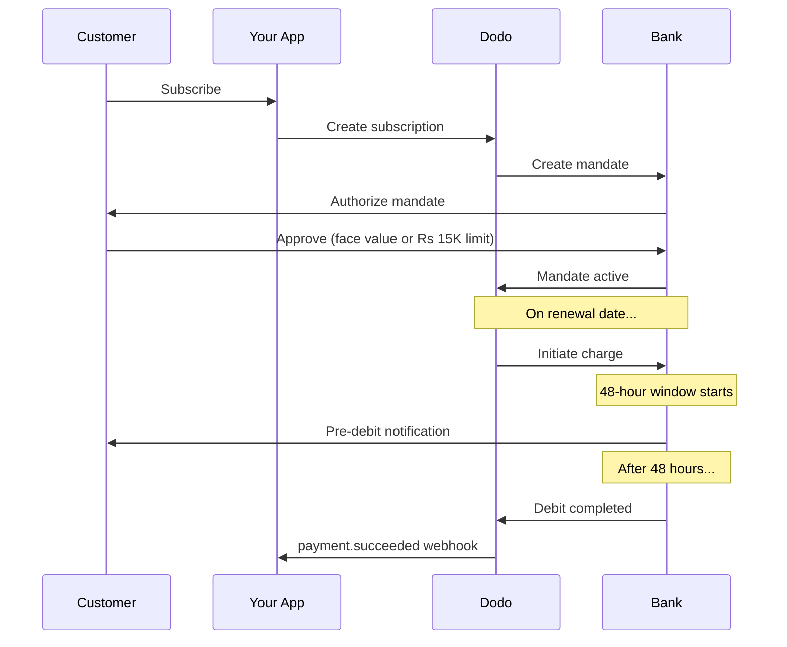

भारत की भुगतान अवसंरचना में UPI (60%+ डिजिटल लेनदेन) और Rupay कार्ड का प्रमुख स्थान है। Dodo Payments दोनों का पूर्ण RBI अनुपालन के साथ समर्थन करता है।

## भारत भुगतान विधियों का महत्व

<CardGroup cols={3}>
<Card title="UPI का वर्चस्व" icon="mobile">
UPI महीने में 10B+ लेनदेन संचालित करता है। कई भारतीय ग्राहकों के पास अंतर्राष्ट्रीय कार्ड नहीं हैं।
</Card>

<Card title="कम लेनदेन लागत" icon="indian-rupee-sign">
UPI में लगभग शून्य लेनदेन शुल्क है। उच्च मात्रा, कम वैल्यू लेनदेन के लिए उत्कृष्ट।
</Card>

<Card title="सब्सक्रिप्शन समर्थन" icon="repeat">
अन्य भुगतान विधियों की तुलना में, UPI और Rupay RBI आदेशों के माध्यम से आवर्ती भुगतानों का समर्थन करते हैं।
</Card>
</CardGroup>

## समर्थित विधियाँ

| विधि | प्रकार | सदस्यताएँ | न्यूनतम राशि |
| :----- | :--- | :-----------: | :--------- |
| **UPI कलेक्ट** | QR कोड / VPA | हाँ* | ₹1 |
| **Rupay क्रेडिट** | कार्ड | हाँ* | ₹1 |
| **Rupay डेबिट** | कार्ड | हाँ* | ₹1 |

*सदस्यताओं के लिए RBI-अनुपालन आदेश आवश्यक हैं जिनमें विशेष प्रोसेसिंग नियम होते हैं।

## कॉन्फ़िगरेशन

### API विधि प्रकार

| प्रकार | विवरण |
| :--- | :---------- |
| `upi_collect` | QR कोड या VPA प्रविष्टि के माध्यम से UPI |
| `credit` | Rupay सहित क्रेडिट कार्ड |
| `debit` | Rupay सहित डेबिट कार्ड |

### उदाहरण: भारत-केंद्रित चेकआउट

```javascript
const session = await client.checkoutSessions.create({
  product_cart: [{ product_id: 'prod_123', quantity: 1 }],
  allowed_payment_method_types: [
    'upi_collect',
    'credit',
    'debit'
  ],
  billing_currency: 'INR',
  customer: {
    email: 'customer@example.in',
    name: 'Priya Sharma',
    phone_number: '+919876543210'
  },
  billing_address: {
    country: 'IN',
    zipcode: '560001'
  },
  return_url: 'https://example.com/success'
});
```

### UPI के लिए आवश्यकताएँ

चेकआउट पर UPI दिखने के लिए:
1. **बिलिंग देश** भारत (`IN`) होना चाहिए
2. **मुद्रा** INR होनी चाहिए
3. गैर-भारतीय व्यापारियों के लिए: **एडैप्टिव मुद्रा** सक्षम होनी चाहिए

<Warning>
यदि आप एक गैर-भारतीय व्यापारी हैं और एडैप्टिव मुद्रा सक्षम नहीं है, तो UPI आपके ग्राहकों के लिए उपलब्ध नहीं होगा।
</Warning>

## RBI आदेशों के साथ सदस्यताएँ

भारतीय भुगतान विधि सदस्यताएँ RBI (भारतीय रिज़र्व बैंक) विनियमों के तहत विशेष आवश्यकताओं के साथ संचालित होती हैं।

### RBI आदेश कैसे कार्य करते हैं



### आदेश प्रकार

| सदस्यता राशि | आदेश प्रकार | सीमा |
| :------------------ | :----------- | :---- |
| **₹ 15,000 से कम** | मांग पर आदेश | ₹ 15,000 |
| **₹ 15,000 या अधिक** | निश्चित राशि आदेश | सटीक सदस्यता राशि |

**योजना परिवर्तनों के लिए महत्वपूर्ण:** यदि एक अपग्रेड से चार्ज मौजूदा आदेश सीमा से अधिक हो जाता है, तो चार्ज विफल हो जाएगा और ग्राहक को फिर से अधिकृत करना होगा।

### 48-घंटे की प्रोसेसिंग देरी

यह अंतर्राष्ट्रीय कार्ड भुगतानों से सबसे महत्वपूर्ण अंतर है:

<Steps>
<Step title="चार्ज आरंभ (दिन 0)">
नियोजित नवीनीकरण तिथि पर, Dodo बैंक के साथ चार्ज आरंभ करता है।
</Step>

<Step title="पूर्व-डेबिट अधिसूचना">
ग्राहक को उनके बैंक से आगामी डेबिट के बारे में अधिसूचना प्राप्त होती है।
</Step>

<Step title="48-घंटे की विंडो">
ग्राहक इस अवधि के दौरान अपने बैंकिंग ऐप के माध्यम से आदेश को रद्द कर सकता है।
</Step>

<Step title="डेबिट पूरा (~48-51 घंटे)">
48 घंटे (बैंक प्रोसेसिंग के लिए अधिकतम 3 अतिरिक्त घंटे) के बाद, धन की डेबिट की जाती है।
</Step>

<Step title="वेबहुक भेजा गया">
`payment.succeeded` वेबहुक वास्तव में डेबिट के बाद भेजा जाता है, आरंभ पर नहीं।
</Step>
</Steps>

<Warning>
**चार्ज आरंभ पर लाभ मत दें।** `payment.succeeded` वेबहुक का इंतजार करें, जो नियोजित चार्ज तिथि के ~48-51 घंटे बाद आता है।
</Warning>

### 48-घंटे की विंडो को संभालना

```javascript
// DON'T do this:
async function handleSubscriptionRenewal(subscription) {
  // ❌ Bad: Granting access immediately when charge is initiated
  grantPremiumAccess(subscription.customer_id);
}

// DO this:
async function handlePaymentWebhook(event) {
  if (event.type === 'payment.succeeded') {
    // ✅ Good: Only grant access after payment is confirmed
    grantPremiumAccess(event.data.customer_id);
  }
  
  if (event.type === 'payment.failed') {
    // Handle failed payment (mandate cancelled, insufficient funds)
    revokePremiumAccess(event.data.customer_id);
  }
}
```

### भारतीय सदस्यताओं के लिए वेबहुक इवेंट्स

| इवेंट | कब | क्रिया |
| :---- | :--- | :----- |
| `subscription.created` | आदेश अधिकृत | सदस्यता प्रारंभ रिकॉर्ड करें |
| `payment.succeeded` | ~48 घंटे बाद चार्ज तिथि | पहुँच प्रदान/जारी रखें |
| `payment.failed` | डेबिट विफल | ग्राहक को सूचित करें, पहुँच रोकें |
| `subscription.on_hold` | भुगतान विफल | भुगतान विधि अपडेट के लिए प्रेरित करें |
| `subscription.active` | भुगतान के बाद फिर से सक्रिय किया गया | पहुँच पुनर्स्थापित करें |

## परीक्षण

### UPI परीक्षण आईडी

| स्थिति | UPI ID |
| :----- | :----- |
| सफलता | `success@upi` |
| विफलता | `failure@upi` |

### भारतीय कार्ड टेस्ट नंबर

| ब्रांड | दृश्य | कार्ड नंबर | समाप्ति | CVV |
| :---- | :------- | :---------- | :----- | :-- |
| वीज़ा | सफलता | `4576238912771450` | 06/32 | 123 |
| वीज़ा | अस्वीकृत | `4706131211212123` | 06/32 | 123 |
| मास्टरकार्ड | सफलता | `5409162669381034` | 06/32 | 123 |
| मास्टरकार्ड | अस्वीकृत | `5105105105105100` | 06/32 | 123 |

## सर्वोत्तम प्रथाएँ

<AccordionGroup>
<Accordion title="48-घंटे की देरी की योजना बनाएं">
अपने आवेदन का निर्माण करें ताकि चार्ज आरंभ और वास्तविक भुगतान के बीच के अंतर को संभाला जा सके। विचार करें:
- सदस्यता पहुँच के लिए ग्रेस अवधि
- प्रोसेसिंग समय के बारे में ग्राहकों को स्पष्ट संचार
- वेबहुक-चालित पूर्ति, न कि तिथि-चालित
</Accordion>

<Accordion title="आदेश रद्द करने को संभालें">
ग्राहक किसी भी समय अपने बैंक ऐप के माध्यम से आदेश रद्द कर सकते हैं। `subscription.on_hold` वेबहुक की निगरानी करें और ग्राहकों को फिर से सदस्यता लेने या भुगतान विधि अपडेट करने के लिए प्रेरित करें।
</Accordion>

<Accordion title="उचित आदेश राशि निर्धारित करें">
परिवर्ती मूल्य निर्धारण (जैसे कि उपयोग-आधारित) के लिए सोचें कि क्या ₹ 15,000 का मांग पर आदेश पर्याप्त है। यदि चार्ज इस राशि से अधिक हो सकते हैं, तो ग्राहकों को फिर से अधिकृत करने की आवश्यकता होगी।
</Accordion>

<Accordion title="UPI को प्रमुखता से पेश करें">
भारतीय ग्राहकों के लिए, UPI प्राथमिक भुगतान विकल्प होना चाहिए। कई उपयोगकर्ता परिचितता और कम friction के कारण इसे कार्ड पर प्राथमिकता देते हैं।
</Accordion>
</AccordionGroup>

## ट्रबलशूटिंग

<AccordionGroup>
<Accordion title="चेकआउट पर UPI दिखाई नहीं दे रहा है">
**जांचें:**
1. क्या बिलिंग देश `IN` पर सेट है?
2. क्या मुद्रा `INR` पर सेट है?
3. यदि गैर-भारतीय व्यापारी: क्या एडैप्टिव मुद्रा सक्षम है?
4. क्या `upi_collect` को `allowed_payment_method_types` में शामिल किया गया है?

**समाधान:** सत्यापित करें कि बिलिंग पता में `country: "IN"` और `billing_currency: "INR"` शामिल हैं।
</Accordion>

<Accordion title="अपग्रेड के बाद सदस्यता चार्ज विफल">
**कारण:** नया चार्ज राशि मौजूदा आदेश सीमा (₹ 15,000 की सीमा) से अधिक है।
</Accordion>

**समाधान:** ग्राहक को भुगतान विधि को अपडेट करना होगा ताकि सही सीमा के साथ एक नया आदेश स्थापित किया जा सके।
</Accordion>

<Accordion title="सदस्यता होल्ड पर है लेकिन ग्राहक का दावा है कि उन्होंने रद्द नहीं किया">
**कारण:** ग्राहक ने 48-घंटे की विंडो के दौरान आदेश रद्द किया हो सकता है, या उनके बैंक ने डेबिट को अस्वीकृत कर दिया।
</Accordion>

**समाधान:** ग्राहक को आदेश को फिर से अधिकृत करने या अपनी भुगतान विधि को अपडेट करने की आवश्यकता होगी।
</Accordion>

<Accordion title="भुगतान कटौती 48 घंटों से अधिक देरी हो रही है">
**कारण:** बैंक API में देरी 2-3 अतिरिक्त घंटों तक प्रोसेसिंग को बढ़ा सकती है।
</Accordion>

**समाधान:** यह अपेक्षित है। अपने सिस्टम को ~51 घंटे की कुल परिवर्तनीय देरी को संभालने के लिए बनाएं।
</Accordion>

<Accordion title="आदेश रद्द किया गया लेकिन सदस्यता अभी भी सक्रिय है">
**कारण:** RBI विनियमों में एक एज केस — प्रोसेसिंग विंडो के दौरान आदेश रद्द करने से सदस्यता तुरंत रद्द नहीं होती।
</Accordion>

**समाधान:** अगला चार्ज विफल होगा और सदस्यता `on_hold` में जा रही है। `payment.failed` के लिए वेबहुक की निगरानी करें।
</Accordion>
</AccordionGroup>

## संबंधित पृष्ठ

<CardGroup cols={2}>
<Card title="भुगतान विधियों का अवलोकन" icon="credit-card" href="/features/payment-methods">
सभी समर्थित भुगतान विधियों को देखें।
</Card>

<Card title="सदस्यताएँ" icon="repeat" href="/features/subscription">
पूर्ण सदस्यता दस्तावेज़ीकरण जिसमें RBI आदेश शामिल हैं।
</Card>

<Card title="वेबहुक" icon="webhook" href="/developer-resources/webhooks">
भुगतान घटनाओं के लिए वेबहुक हैंडलिंग।
</Card>

<Card title="परीक्षण प्रक्रिया" icon="flask" href="/miscellaneous/testing-process">
सभी परीक्षण डेटा जिसमें UPI आईडी और भारतीय कार्ड शामिल हैं।
</Card>
</CardGroup>