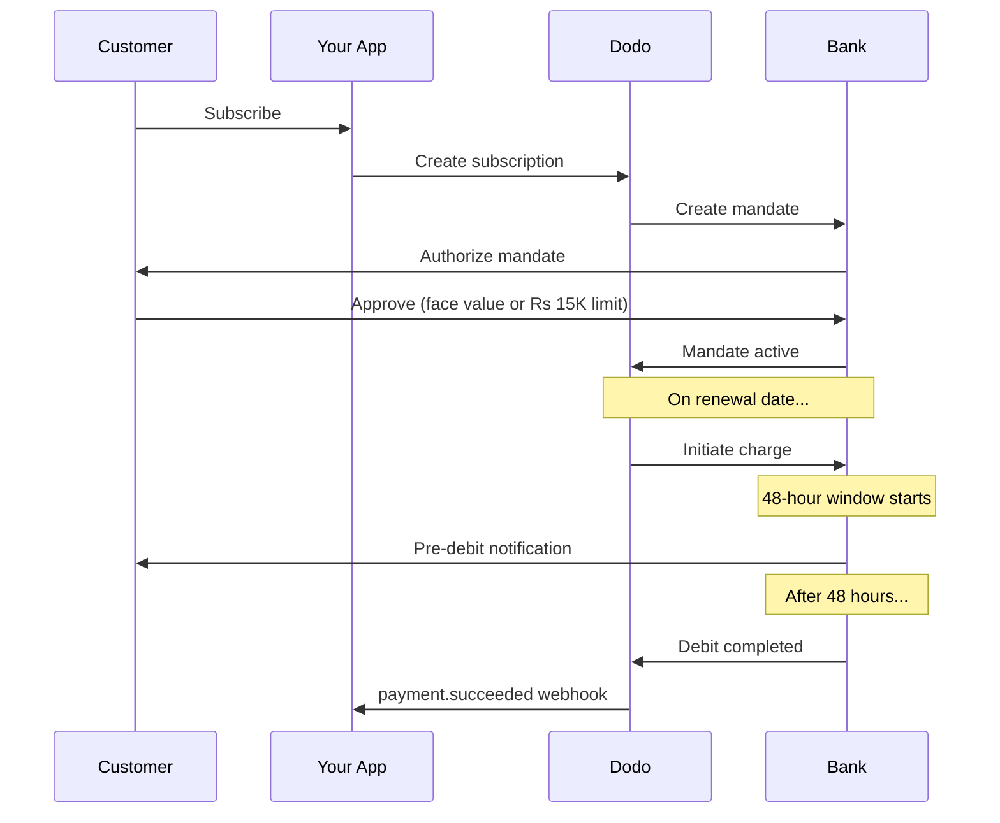

भारत में UPI (डिजिटल लेनदेन का 60%+ हिस्सेदारी) और भारतीय-निर्गमित कार्ड (Visa, Mastercard, Rupay, आदि) के प्रभुत्व वाला एक विशेष भुगतान अवसंरचना है। Dodo Payments सभी के लिए पूर्ण RBI अनुपालन के साथ सब्सक्रिप्शन जनादेशों का समर्थन करता है।

## भारत भुगतान विधियाँ क्यों महत्वपूर्ण हैं

<CardGroup cols={3}>
<Card title="UPI Dominance" icon="mobile">
UPI हर माह 10B+ लेनदेन संसाधित करता है। कई भारतीय ग्राहकों के पास अंतरराष्ट्रीय कार्ड नहीं होते।
</Card>

<Card title="Low Transaction Costs" icon="indian-rupee-sign">
UPI की लेनदेन शुल्क लगभग शून्य है। उच्च मात्रा, कम मूल्य के लेनदेन के लिए उत्तम।
</Card>

<Card title="Subscription Support" icon="repeat">
अधिकांश वैकल्पिक भुगतान विधियों के विपरीत, UPI और सभी भारतीय-निर्गमित कार्ड (Visa, Mastercard, Rupay, आदि) RBI जनादेशों के माध्यम से आवर्ती भुगतान का समर्थन करते हैं।
</Card>
</CardGroup>

## समर्थित विधियाँ

| विधि | प्रकार | सब्सक्रिप्शन | न्यूनतम राशि |
| :----- | :--- | :-----------: | :--------- |
| **UPI Collect** | QR कोड / VPA | हाँ* | ₹1 |
| **Rupay Credit** | कार्ड | हाँ* | ₹1 |
| **Rupay Debit** | कार्ड | हाँ* | ₹1 |

*सब्सक्रिप्शन्स विशेष प्रोसेसिंग नियमों के साथ RBI-अनुपालक जनादेशों की आवश्यकता होती है। 48 घंटे की प्रोसेसिंग देरी सभी भारतीय-निर्गमित कार्डों और UPI पर लागू होती है।

## विन्यास

### API विधि प्रकार

| प्रकार | विवरण |
| :--- | :---------- |
| `upi_collect` | QR कोड या VPA प्रविष्टि के माध्यम से UPI |
| `credit` | रुपे सहित क्रेडिट कार्ड |
| `debit` | रुपे सहित डेबिट कार्ड |

### उदाहरण: भारत-केंद्रित चेकआउट

```javascript
const session = await client.checkoutSessions.create({
  product_cart: [{ product_id: 'prod_123', quantity: 1 }],
  allowed_payment_method_types: [
    'upi_collect',
    'credit',
    'debit'
  ],
  billing_currency: 'INR',
  customer: {
    email: 'customer@example.in',
    name: 'Priya Sharma',
    phone_number: '+919876543210'
  },
  billing_address: {
    country: 'IN',
    zipcode: '560001'
  },
  return_url: 'https://example.com/success'
});
```

### UPI के लिए आवश्यकताएँ

चेकआउट पर UPI दिखाने के लिए:
1. **बिलिंग देश** भारत होना चाहिए (`IN`)
2. **मुद्रा** INR होनी चाहिए
3. गैर-भारतीय व्यापारियों के लिए: **Adaptive Currency** सक्षम होना चाहिए

<Warning>
यदि आप गैर-भारतीय व्यापारी हैं और Adaptive Currency सक्षम नहीं है, तो आपके ग्राहकों के लिए UPI उपलब्ध नहीं होगा।
</Warning>

## RBI मण्डेट के साथ सब्सक्रिप्शन

भारतीय भुगतान विधि सब्सक्रिप्शन RBI (भारतीय रिज़र्व बैंक) नियमों के अधीन एक विशिष्ट आवश्यकताओं के साथ संचालित होते हैं।

### RBI मण्डेट कैसे काम करते हैं



### मण्डेट प्रकार

| सब्स्क्रिप्शन राशि | अधिदेश प्रकार | सीमा |
| :------------------ | :----------- | :---- |
| **अधिदेश फर्श के नीचे** | मांग पर अधिदेश | अधिदेश फर्श (डिफ़ॉल्ट ₹15,000) |
| **अधिदेश फर्श पर या उससे ऊपर** | निश्चित राशि अधिदेश | सही सब्स्क्रिप्शन राशि |

ग्राहक के बैंक के साथ पंजीकृत राशि `max(mandate_floor, billing_amount)` है। इसलिए, फर्श प्रभावी रूप से ग्राहक के सामने **अधिकतम प्राधिकरण** है, जब भी बिलिंग फर्श से कम होती है।

**योजना बदलाव के लिए महत्वपूर्ण:** यदि अपग्रेड मौजूदा अधिदेश सीमा से अधिक शुल्क का परिणाम देता है, तो शुल्क विफल हो जाएगा और ग्राहक को पुनः प्राधिकृत करना होगा।

### विन्यास योग्य अधिदेश फर्श

INR ई-अधिदेशों के लिए अधिदेश फर्श `mandate_min_amount_inr_paise` फ़ील्ड के माध्यम से विन्यास योग्य है (**INR पैसे** में — 1 INR = 100 पैसे)। आप सिस्टम डिफ़ॉल्ट ₹15,000 को तीन स्तरों पर ओवरराइड कर सकते हैं:

| स्तर | कहाँ सेट करें | दायरा |
|-------|--------------|-------|
| **प्रति अनुरोध** | चेकआउट सेशन या subscription पर `mandate_min_amount_inr_paise` | एक लेन-देन |
| **Merchant** | व्यवसाय सेटिंग्स | आपकी सभी INR subscriptions |
| **सिस्टम** | — | ₹15,000 डिफ़ॉल्ट |

संकल्प प्राथमिकता: प्रति-प्रार्थना ओवरराइड → व्यापारी सेटिंग → सिस्टम डिफ़ॉल्ट।

```typescript
// Per-checkout override
const session = await client.checkoutSessions.create({
  product_cart: [{ product_id: 'prod_inr_monthly', quantity: 1 }],
  mandate_min_amount_inr_paise: 2_000_000, // ₹20,000 ceiling
  return_url: 'https://yoursite.com/return'
});

// Per-subscription override
const subscription = await client.subscriptions.create({
  product_id: 'pdt_inr_monthly',
  quantity: 1,
  customer: { email: 'customer@example.in' },
  billing: { country: 'IN', /* ... */ },
  mandate_min_amount_inr_paise: 2_000_000
});
```

| फ़ील्ड | प्रकार | सत्यापन | लागू होता है |
|-------|------|------------|------------|
| `mandate_min_amount_inr_paise` | `integer` (INR पैसे) | `>= 1` | भारतीय-कार्ड INR सब्स्क्रिप्शन गैर-एयरवैलेक्स कनेक्टर्स पर |

<Info>
उच्च फर्श सेट करने से आप बाद में बड़े एकल शुल्क का समर्थन कर सकते हैं (उदाहरण के लिए, योजना उन्नयन या उपयोग-आधारित अधिकता) बिना ग्राहकों को पुनः प्राधिकृत किए। निम्न फर्श सेट करने से ग्राहक का प्राधिकरण वास्तविक बिलिंग राशि के करीब ले आता है लेकिन भविष्य के परिवर्तनीय शुल्क के लिए हेडरूम सीमित करता है।
</Info>

<Warning>
यह सेटिंग केवल INR सब्स्क्रिप्शन पर भारतीय-निर्गत कार्ड (Visa, Mastercard, RuPay) के लिए पंजीकृत ई-अधिदेशों को प्रभावित करती है। UPI सब्स्क्रिप्शन अपने स्वयं के AutoPay प्रवाह का पालन करते हैं और अप्रभावित हैं।
</Warning>

### 48-घंटे की प्रसंस्करण देरी

यह अंतरराष्ट्रीय कार्ड भुगतान से सबसे महत्वपूर्ण अंतर है:

<Steps>
<Step title="Charge Initiated (Day 0)">
निर्धारित नवीकरण तिथि पर, डोडो बैंक के साथ चार्ज शुरू करता है।
</Step>

<Step title="Pre-Debit Notification">
ग्राहक अपने बैंक से आगामी डेबिट के बारे में अधिसूचना प्राप्त करता है।
</Step>

<Step title="48-Hour Window">
इस अवधि के दौरान ग्राहक अपने बैंकिंग ऐप के माध्यम से अधिदेश को रद्द कर सकता है।
</Step>

<Step title="Debit Completed (~48-51 hours)">
48 घंटे बाद (प्लस बैंक प्रसंस्करण के लिए 3 अतिरिक्त घंटे तक), धन डेबिट कर लिए जाते हैं।
</Step>

<Step title="Webhook Sent">
`payment.succeeded` वेबहुक वास्तविक डेबिट के बाद भेजा जाता है, शुरुआत में नहीं।
</Step>
</Steps>

<Warning>
**लाभ को चार्ज आरंभ पर न दें।** `payment.succeeded` वेबहुक की प्रतीक्षा करें, जो निर्धारित चार्ज तिथि के लगभग 48-51 घंटे बाद आता है।
</Warning>

### 48-घंटे की विंडो का संचालन

```javascript
// DON'T do this:
async function handleSubscriptionRenewal(subscription) {
  // ❌ Bad: Granting access immediately when charge is initiated
  grantPremiumAccess(subscription.customer_id);
}

// DO this:
async function handlePaymentWebhook(event) {
  if (event.type === 'payment.succeeded') {
    // ✅ Good: Only grant access after payment is confirmed
    grantPremiumAccess(event.data.customer_id);
  }
  
  if (event.type === 'payment.failed') {
    // Handle failed payment (mandate cancelled, insufficient funds)
    revokePremiumAccess(event.data.customer_id);
  }
}
```

### भारतीय सब्स्क्रिप्शन के लिए वेबहुक इवेंट्स

| घटना | कब | कार्य |
| :---- | :--- | :----- |
| `subscription.active` | अधिदेश अधिकृत | सब्स्क्रिप्शन शुरुआत रिकॉर्ड करें |
| `payment.succeeded` | ~48h चार्ज तिथि के बाद | एक्सेस प्रदान/जारी रखें |
| `payment.failed` | डेबिट विफल | ग्राहक को सूचित करें, एक्सेस रोकें |
| `subscription.on_hold` | भुगतान विफल | भुगतान विधि अपडेट के लिए संकेत दें |
| `subscription.active` | भुगतान के बाद पुनः सक्रिय | एक्सेस बहाल करें |

## परीक्षण

### UPI टेस्ट IDs

| स्थिति | UPI ID |
| :----- | :----- |
| सफलता | `success@upi` |
| विफलता | `failure@upi` |

### भारतीय कार्ड टेस्ट नंबर

| ब्रांड | परिदृश्य | कार्ड नंबर | समाप्ति | CVV |
| :---- | :------- | :---------- | :----- | :-- |
| Visa | सफलता | `4576238912771450` | 06/32 | 123 |
| Visa | अस्वीकृत | `4706131211212123` | 06/32 | 123 |
| Mastercard | सफलता | `5409162669381034` | 06/32 | 123 |
| Mastercard | अस्वीकृत | `5105105105105100` | 06/32 | 123 |

## सर्वोत्तम प्रथाएं

<AccordionGroup>
<Accordion title="Plan for the 48-hour delay">
अपने एप्लिकेशन को चार्ज आरंभ और वास्तविक भुगतान के बीच के अंतराल को संभालने के लिए बनाएं। ध्यान रखें:
- सब्स्क्रिप्शन एक्सेस के लिए ग्रेस अवधि
- प्रोसेसिंग समय के बारे में ग्राहकों के साथ स्पष्ट संवाद
- वेबहुक द्वारा संचालित पूर्ति, तिथि द्वारा नहीं
</Accordion>

<Accordion title="Handle mandate cancellations">
ग्राहक किसी भी समय अपने बैंक ऐप्स के माध्यम से अधिदेश रद्द कर सकते हैं। `subscription.on_hold` वेबहुक की निगरानी करें और ग्राहकों को पुनः सदस्यता या भुगतान विधि अपडेट के लिए प्रेरित करें।
</Accordion>

<Accordion title="Set appropriate mandate amounts">
परिवर्तनीय मूल्य निर्धारण (जैसे, उपयोग आधारित) के लिए विचार करें कि क्या ₹15,000 मांग पर अधिदेश पर्याप्त है। यदि शुल्क इससे अधिक हो सकता है, तो ग्राहकों को पुनः प्राधिकृत करना होगा।
</Accordion>

<Accordion title="Offer UPI prominently">
भारतीय ग्राहकों के लिए, UPI प्राथमिक भुगतान विकल्प होना चाहिए। कई उपयोगकर्ता इसे परिचित और कम घर्षण के कारण कार्डों पर पसंद करते हैं।
</Accordion>
</AccordionGroup>

## समस्या निवारण

<AccordionGroup>
<Accordion title="UPI not appearing at checkout">
**जांच करें:**
1. बिलिंग देश `IN` के लिए सेट है?
2. मुद्रा `INR` के लिए सेट है?
3. यदि गैर-भारतीय व्यापारी: अनुकूली मुद्रा सक्षम है?
4. `upi_collect` को `allowed_payment_method_types` में शामिल किया गया है?

**समाधान:** सत्यापित करें कि बिलिंग पते में `country: "IN"` और `billing_currency: "INR"` शामिल है।
</Accordion>

<Accordion title="Subscription charge failed after upgrade">
**कारण:** नया चार्ज राशि मौजूदा अधिदेश सीमा (₹15,000 थ्रेशोल्ड) से अधिक है।

**समाधान:** ग्राहक को सही सीमा के साथ नया अधिदेश स्थापित करने के लिए भुगतान विधि अपडेट करनी होगी।
</Accordion>

<Accordion title="Subscription on hold but customer claims they didn't cancel">
**कारण:** ग्राहक ने 48-घंटे की विंडो के दौरान अधिदेश रद्द कर दिया हो सकता है, या उनके बैंक ने डेबिट अस्वीकृत कर दिया।

**समाधान:** ग्राहक को अधिदेश पुनः प्राधिकृत करना होगा या अपनी भुगतान विधि अपडेट करनी होगी।
</Accordion>

<Accordion title="Payment deduction delayed beyond 48 hours">
**कारण:** बैंक API देरी के कारण प्रसंस्करण 2-3 अतिरिक्त घंटे तक बढ़ सकती है।

**समाधान:** यह अपेक्षित है। अपने सिस्टम को ~51 घंटे तक परिवर्तनीय देरी को संभालने के लिए तैयार करें।
</Accordion>

<Accordion title="Mandate cancelled but subscription still active">
**कारण:** RBI विनियमों में किनारे के मामले — प्रसंस्करण विंडो के दौरान अधिदेश रद्दीकरण को तुरंत सब्स्क्रिप्शन रद्द नहीं करता है।

**समाधान:** अगला शुल्क विफल होगा और सब्स्क्रिप्शन `on_hold` पर चलेगा। `payment.failed` के लिए वेबहुक की निगरानी करें।
</Accordion>
</AccordionGroup>

## संबंधित पृष्ठ

<CardGroup cols={2}>
<Card title="Payment Methods Overview" icon="credit-card" href="/features/payment-methods">
सभी समर्थित भुगतान विधियों को देखें।
</Card>

<Card title="Subscriptions" icon="repeat" href="/features/subscription">
RBI अधिदेशों सहित पूरी सब्स्क्रिप्शन दस्तावेज़ीकरण।
</Card>

<Card title="Webhooks" icon="webhook" href="/developer-resources/webhooks">
भुगतान घटनाओं के लिए वेबहुक प्रबंधन।
</Card>

<Card title="Testing Process" icon="flask" href="/miscellaneous/testing-process">
सभी परीक्षण डेटा, UPI IDs और भारतीय कार्ड सहित।
</Card>
</CardGroup>