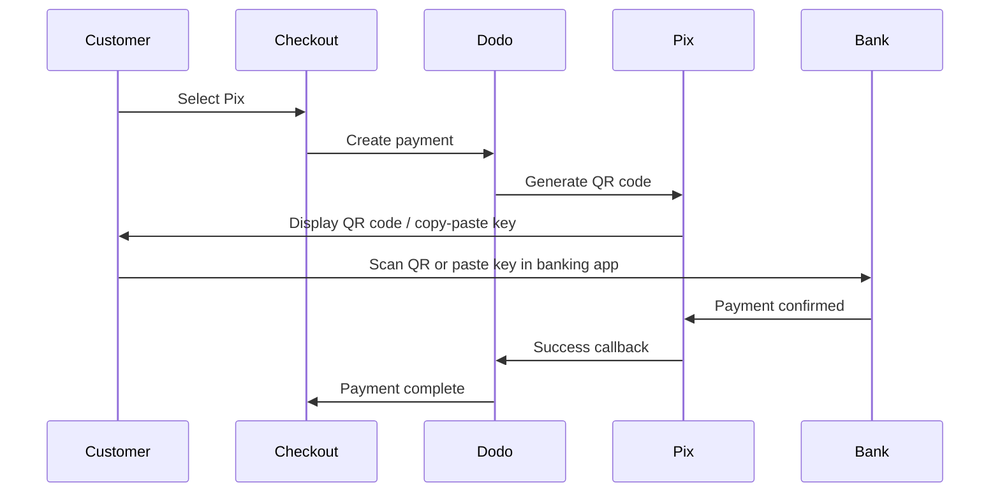

Pix is Brazil's instant payment system created by the Central Bank of Brazil (Banco Central do Brasil). It enables real-time transfers 24/7, including weekends and holidays, and has become the most popular payment method in Brazil.

## Why Offer Pix?

<CardGroup cols={3}>
<Card title="Dominant in Brazil" icon="chart-line">
Pix is the most-used payment method in Brazil, surpassing credit cards and boleto.
</Card>

<Card title="Instant Settlement" icon="bolt">
Payments confirm in seconds, 24/7/365 — no waiting for bank processing windows.
</Card>

<Card title="Low Friction" icon="mobile">
Customers pay via QR code or copy-paste key — no card numbers or bank details needed.
</Card>
</CardGroup>

## Overview

| Detail | Value |
| :----- | :---- |
| **Billing Currency** | BRL |
| **Supported Countries** | Brazil |
| **Subscriptions** | No |
| **Min Amount** | $0.50 |
| **Settlement** | Instant |

## How It Works



## Customer Experience

1. Customer selects Pix at checkout
2. A QR code and copy-paste key are displayed
3. Customer opens their banking app and scans the QR code or pastes the key
4. Payment confirms instantly
5. Customer is redirected to the success page

<Info>
Pix QR codes typically expire after a set period. If the customer doesn't complete payment in time, they need to restart the checkout.
</Info>

## Configuration

```javascript
const session = await client.checkoutSessions.create({
  product_cart: [{ product_id: 'pdt_123', quantity: 1 }],
  allowed_payment_method_types: ['pix', 'credit', 'debit'],
  billing_currency: 'BRL',
  return_url: 'https://example.com/success'
});
```

## API Method Type

| Type | Method | Country |
| :--- | :----- | :------ |
| `pix` | Pix | Brazil |

## Testing

<Steps>
<Step title="Enable test mode">
Use your Dodo Payments test API keys.
</Step>

<Step title="Set billing currency to BRL">
Ensure the billing currency is set to `BRL` in your checkout request.
</Step>

<Step title="Enter test CPF and scan the QR code">
When prompted for a Pix CPF, enter `1234567890`. A test QR code will be generated — scan it with your normal phone camera (no Pix app needed). You'll be redirected to a test page where you can simulate the transaction as a success or failure.
</Step>
</Steps>

## Best Practices

<AccordionGroup>
<Accordion title="Set billing currency to BRL">
Pix only works with BRL. Ensure your pricing supports Brazilian Real transactions for the Brazilian market.
</Accordion>

<Accordion title="Provide card fallbacks">
Not all Brazilian customers may prefer Pix. Always include `credit` and `debit` as fallback options.
</Accordion>

<Accordion title="Handle QR code expiration">
Pix QR codes expire after a set period. Ensure your checkout handles expiration gracefully and allows customers to regenerate the code.
</Accordion>
</AccordionGroup>

## Troubleshooting

<AccordionGroup>
<Accordion title="Pix not appearing at checkout">
**Check:**
1. Billing currency set to `BRL`?
2. `pix` included in `allowed_payment_method_types`?
3. Customer billing country is Brazil?

**Solution:** Pix is only available for BRL transactions. Verify currency and billing address in your API request.
</Accordion>

<Accordion title="QR code expired">
**Cause:** Customer didn't complete payment within the expiration window.

**Solution:** Customer needs to restart the checkout to generate a new QR code.
</Accordion>

<Accordion title="Payment pending">
**Cause:** Pix payments confirm instantly in most cases, but occasional bank-side delays can occur.

**Solution:** Monitor webhooks for payment confirmation. If payment doesn't confirm within a few minutes, treat it as failed.
</Accordion>
</AccordionGroup>

## Related Pages

<CardGroup cols={2}>
<Card title="Payment Methods Overview" icon="credit-card" href="/features/payment-methods">
See all supported payment methods.
</Card>

<Card title="Adaptive Currency" icon="globe" href="/features/adaptive-currency">
Currency support and automatic conversion.
</Card>

<Card title="Checkout Guide" icon="book" href="/developer-resources/checkout-session">
Complete checkout implementation guide.
</Card>

<Card title="Webhooks" icon="webhook" href="/developer-resources/webhooks">
Handle payment confirmations asynchronously.
</Card>
</CardGroup>
