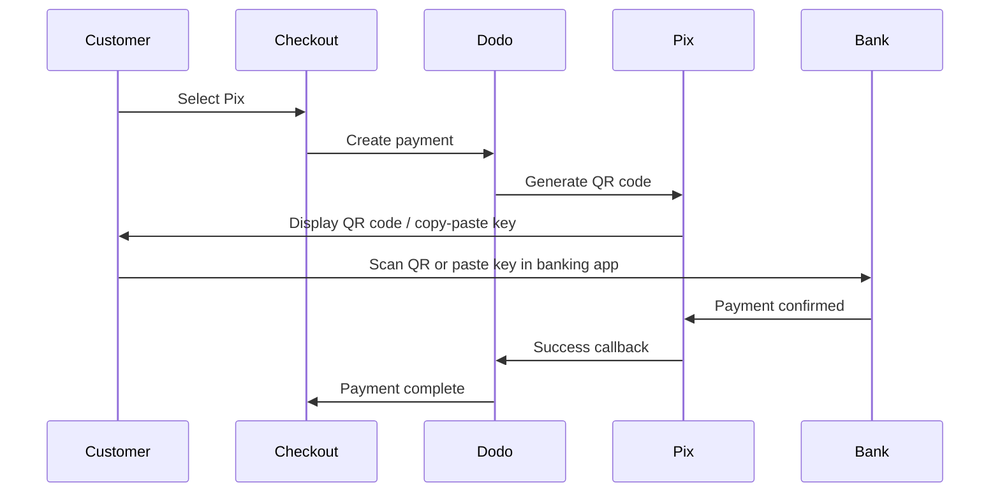

Pix ब्राज़ील का त्वरित भुगतान प्रणाली है जिसे ब्राज़ील के केंद्रीय बैंक (Banco Central do Brasil) द्वारा बनाया गया है। यह 24/7 वास्तविक समय में स्थानांतरण को सक्षम बनाता है, जिसमें सप्ताहांत और छुट्टियाँ भी शामिल हैं, और यह ब्राज़ील में सबसे लोकप्रिय भुगतान विधि बन गई है।

## Pix क्यों पेश करें?

Pix ब्राज़ील में सबसे अधिक उपयोग की जाने वाली भुगतान विधि है, जो क्रेडिट कार्ड और boleto से आगे बढ़ रही है।

भुगतान सेकंडों में पुष्टि होते हैं, 24/7/365 — बैंक प्रोसेसिंग विंडो का इंतज़ार नहीं करना पड़ता।

ग्राहक क्यूआर कोड या कॉपी-पेस्ट कुंजी के माध्यम से भुगतान करते हैं — कार्ड नंबर या बैंक विवरण की आवश्यकता नहीं होती।

## अवलोकन

| विवरण | मूल्य |
| :----- | :---- |
| **बिलिंग मुद्रा** | BRL |
| **समर्थित देश** | ब्राज़ील |
| **सदस्यता** | नहीं |
| **न्यूनतम राशि** | $0.50 |
| **समायोजन** | त्वरित |

## यह कैसे काम करता है



## ग्राहक अनुभव

1. ग्राहक चेकआउट में Pix का चयन करता है
2. एक क्यूआर कोड और कॉपी-पेस्ट कुंजी प्रदर्शित होते हैं
3. ग्राहक अपनी बैंकिंग ऐप खोलता है और क्यूआर कोड स्कैन करता है या कुंजी को पेस्ट करता है
4. भुगतान तुरंत पुष्टि होता है
5. ग्राहक सफलता पृष्ठ पर पुनर्निर्देशित होता है

Pix QR कोड आमतौर पर एक नियत अवधि के बाद समाप्त हो जाते हैं। यदि ग्राहक समय पर भुगतान पूरा नहीं करता है, तो उन्हें चेकआउट को पुनः आरंभ करना होगा।

## कॉन्फ़िगरेशन

```javascript
const session = await client.checkoutSessions.create({
  product_cart: [{ product_id: 'prod_123', quantity: 1 }],
  allowed_payment_method_types: ['pix', 'credit', 'debit'],
  billing_currency: 'BRL',
  return_url: 'https://example.com/success'
});
```

## API पद्धति प्रकार

| प्रकार | विधि | देश |
| :--- | :----- | :------ |
| `pix` | Pix | ब्राज़ील |

## परीक्षण

अपने Dodo Payments परीक्षण API कुंजियों का उपयोग करें।

सुनिश्चित करें कि आपके चेकआउट अनुरोध में बिलिंग मुद्रा `BRL` पर सेट है।

जब Pix CPF के लिए पूछा जाए, तो `1234567890` दर्ज करें। एक परीक्षण क्यूआर कोड उत्पन्न होगा — इसे अपने सामान्य फोन कैमरे से स्कैन करें (किसी Pix ऐप की आवश्यकता नहीं)। आपको एक Stripe परीक्षण पृष्ठ पर पुनः निर्देशित किया जाएगा जहाँ आप लेन-देन को सफलता या विफलता के रूप में अनुकरण कर सकते हैं।

## सर्वोत्तम प्रथाएँ

Pix केवल BRL के साथ काम करता है। सुनिश्चित करें कि आपकी मूल्य निर्धारण ब्राज़ीलियाई रियल लेनदेन का समर्थन करती है।

सभी ब्राज़ीलियाई ग्राहकों को Pix पसंद नहीं आ सकता है। हमेशा `credit` और `debit` को बैकअप विकल्पों के रूप में शामिल करें।

Pix QR कोड एक निश्चित अवधि के बाद समाप्त हो जाते हैं। सुनिश्चित करें कि आपका चेकआउट समाप्ति को सुचारू रूप से संभाले और ग्राहकों को कोड पुनः उत्पन्न करने की अनुमति दे।

## समस्या निवारण

**जाँच करें:**
1. बिलिंग मुद्रा `BRL` पर सेट है?
2. `pix` को `allowed_payment_method_types` में शामिल किया गया है?
3. ग्राहक का बिलिंग देश ब्राज़ील है?

**समाधान:** Pix केवल BRL लेनदेन के लिए उपलब्ध है। अपनी API अनुरोध में मुद्रा और बिलिंग पते की जाँच करें।

**कारण:** ग्राहक ने समाप्ति विंडो के भीतर भुगतान पूरा नहीं किया।

**समाधान:** ग्राहक को नया क्यूआर कोड उत्पन्न करने के लिए चेकआउट को पुनः आरंभ करना चाहिए।

**कारण:** Pix भुगतान अधिकांश मामलों में तुरंत पुष्टि होते हैं, लेकिन कभी-कभी बैंक-साइड में विलंब हो सकते हैं।

**समाधान:** भुगतान पुष्टि के लिए वेबहुक्स की निगरानी करें। यदि भुगतान कुछ मिनटों के भीतर पुष्टि नहीं करता है, तो इसे विफल मानें।

## संबंधित पृष्ठ

सभी समर्थित भुगतान विधियाँ देखें।

मुद्रा समर्थन और स्वचालित रूपांतरण।

पूर्ण चेकआउट कार्यान्वयन गाइड।

भुगतान पुष्टि को असिंक्रोनस रूप से संभालें।
