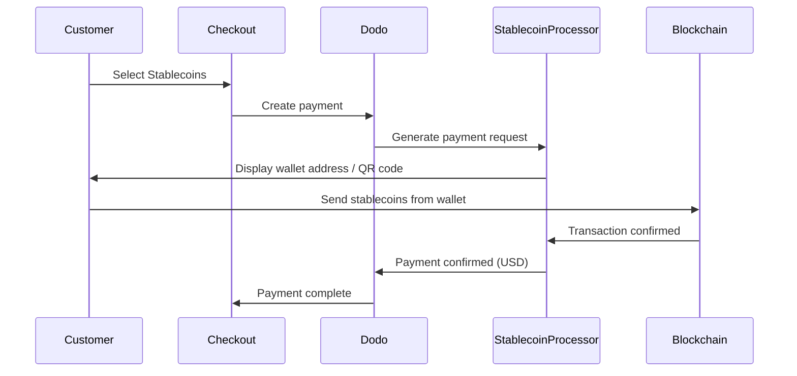

स्थिर मुद्रा भुगतान ग्राहकों को दुनिया के किसी भी कोने से (भारत को छोड़कर) स्थिर मुद्राओं का उपयोग करके भुगतान करने की अनुमति देते हैं। लेन-देन USD में बिल किए जाते हैं, जिससे आपको फिएट मुद्रा मिलती है जबकि ग्राहक अपनी पसंदीदा स्थिर मुद्रा वॉलेट से भुगतान करते हैं।

## स्थिर मुद्रा क्यों प्रदान करें?

<CardGroup cols={3}>
<Card title="Global Reach" icon="globe">
किसी भी देश से भुगतान स्वीकार करें — ग्राहक की ओर से बैंकिंग इंफ्रास्ट्रक्चर की आवश्यकता नहीं।
</Card>

<Card title="No Chargebacks" icon="shield-check">
स्थिर मुद्रा लेन-देन अपरिवर्तनीय होते हैं, जिससे चार्जबैक धोखाधड़ी पूरी तरह से समाप्त हो जाती है।
</Card>

<Card title="USD Settlement" icon="dollar-sign">
आपको USD प्राप्त होता है — अस्थिरता या वॉलेट्स को प्रबंधित करने की आवश्यकता नहीं।
</Card>
</CardGroup>

## अवलोकन

| विवरण | मूल्य |
| :----- | :---- |
| **बिलिंग मुद्रा** | USD |
| **समर्थित देश** | ग्लोबल (IN को छोड़कर) |
| **सदस्यताएँ** | नहीं |
| **न्यूनतम राशि** | $0.50 |
| **समाधान** | USD |

## यह कैसे कार्य करता है



## ग्राहक अनुभव

1. ग्राहक चेकआउट पर स्थिर मुद्रा का चयन करता है
2. एक वॉलेट पता और QR कोड स्थिर मुद्रा में राशि के साथ प्रदर्शित होते हैं
3. ग्राहक अपनी स्थिर मुद्रा वॉलेट से सटीक राशि भेजता है
4. लेन-देन ब्लॉकचेन पर पुष्टि होती है
5. ग्राहक को सफलता पृष्ठ पर पुनः निर्देशित किया जाता है

<Info>
स्थिर मुद्रा भुगतान USD में बिल किए जाते हैं। चेकआउट पर प्रदर्शित स्थिर मुद्रा राशि का भुगतान के समय वास्तविक विनिमय दर को दर्शाता है।
</Info>

## समर्थित मुद्राएँ और नेटवर्क

| मुद्रा | नेटवर्क |
| :------- | :------- |
| **USDC** | Ethereum, Solana, Polygon, Base |
| **USDP** | Ethereum, Solana |
| **USDG** | Ethereum |

## कॉन्फ़िगरेशन

```javascript
const session = await client.checkoutSessions.create({
  product_cart: [{ product_id: 'pdt_123', quantity: 1 }],
  allowed_payment_method_types: ['crypto_currency', 'credit', 'debit'],
  return_url: 'https://example.com/success'
});
```

## API विधि प्रकार

| प्रकार | विधि | देश |
| :--- | :----- | :------ |
| `crypto_currency` | स्थिर मुद्रा | वैश्विक (भारत को छोड़कर) |

## परीक्षण

<Steps>
<Step title="Enable test mode">
अपने Dodo Payments परीक्षण API कुंजियाँ उपयोग करें।
</Step>

<Step title="Create a test checkout">
`crypto_currency` को अनुमत भुगतान विधियों में उपयोग करते हुए एक चेकआउट सत्र बनाएं।
</Step>

<Step title="Complete the test flow">
परीक्षण परिवेश में अनुकरणीय स्थिर मुद्रा भुगतान प्रवाह का पालन करें।
</Step>
</Steps>

## सर्वोत्तम प्रथाएँ

<AccordionGroup>
<Accordion title="Always include card fallbacks">
सभी ग्राहकों के पास स्थिर मुद्रा वॉलेट नहीं होते हैं। हमेशा `credit` और `debit` को फॉलबैक भुगतान विधियों के रूप में शामिल करें।
</Accordion>

<Accordion title="Set clear expectations on confirmation time">
ब्लॉकचेन पुष्टि में नेटवर्क के आधार पर मिनट लग सकते हैं। सुनिश्चित करें कि आपका चेकआउट इसे ग्राहकों को संप्रेषित करता है।
</Accordion>

<Accordion title="Handle underpayments and overpayments">
स्थिर मुद्रा भुगतान में कुछ बार नेटवर्क शुल्क के कारण सटीक राशि में थोड़ा अंतर हो सकता है। भुगतान स्थिति अपडेट के लिए वेबहुक्स की निगरानी करें।
</Accordion>
</AccordionGroup>

## समस्या निवारण

<AccordionGroup>
<Accordion title="Stablecoins not appearing at checkout">
**जांचें:**
1. क्या `crypto_currency`, `allowed_payment_method_types` में शामिल है?
2. लेन-देन राशि न्यूनतम ($0.50) को पूरा करती है?

**समाधान:** सुनिश्चित करें कि भुगतान विधि प्रकार आपके API अनुरोध में सही तरीके से पास किया गया है।
</Accordion>

<Accordion title="Payment not confirming">
**कारण:** ब्लॉकचेन पुष्टि समय विविध हो सकता है। कुछ नेटवर्क अन्य की तुलना में अधिक समय लेते हैं।

**समाधान:** वेबहुक पुष्टिकरण की प्रतीक्षा करें। पुष्टिकरण विंडो के बीतने तक भुगतान को विफल न मानें।
</Accordion>

<Accordion title="Amount mismatch">
**कारण:** नेटवर्क शुल्क के कारण प्राप्त राशि में अनुरोधित राशि से थोड़ा अंतर हो सकता है।

**समाधान:** अंतिम पुष्टि की गई राशि के लिए वेबहुक्स की निगरानी करें। छोटे अंतर स्वचालित रूप से संभाले जाते हैं।
</Accordion>
</AccordionGroup>

## संबंधित पृष्ठ

<CardGroup cols={2}>
<Card title="Payment Methods Overview" icon="credit-card" href="/features/payment-methods">
सभी समर्थित भुगतान विधियाँ देखें।
</Card>

<Card title="Checkout Guide" icon="book" href="/developer-resources/checkout-session">
पूरा चेकआउट कार्यान्वयन गाइड।
</Card>

<Card title="Webhooks" icon="webhook" href="/developer-resources/webhooks">
भुगतान पुष्टिकरण को गैर-सिंक्रोनस रूप से प्रबंधित करें।
</Card>

<Card title="Testing Process" icon="flask" href="/miscellaneous/testing-process">
सभी भुगतान विधियों के लिए पूरा परीक्षण गाइड।
</Card>
</CardGroup>
