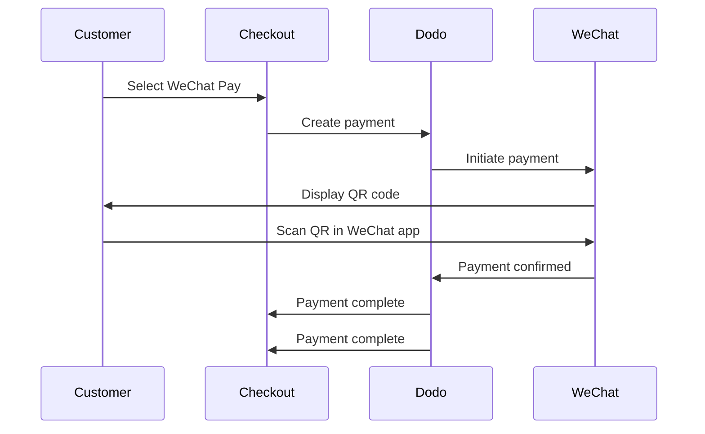

WeChat Pay चीन के दो प्रमुख मोबाइल भुगतान प्लेटफार्मों में से एक है, जिसे एक अरब से अधिक लोग उपयोग करते हैं। यह WeChat ऐप के भीतर QR कोड के माध्यम से भुगतान सक्षम करता है, जिससे यह चीनी उपभोक्ताओं को लक्षित करने वाले व्यवसायों के लिए आवश्यक है।

## WeChat Pay क्यों प्रदान करें?

<CardGroup cols={3}>
<Card title="1B+ Users" icon="users">
WeChat Pay का उपयोग एक अरब से अधिक लोग करते हैं, जो इसे दुनिया के सबसे बड़े भुगतान प्लेटफार्मों में से एक बनाता है।
</Card>

<Card title="Mobile-First" icon="mobile">
भुगतान पूरी तरह से WeChat ऐप के भीतर होते हैं — यह चीनी ग्राहकों के लिए तेज़, परिचित, और सुगम होते हैं।
</Card>

<Card title="Dual Currency" icon="money-bill-transfer">
USD और CNY दोनों में भुगतान स्वीकार करें, जिससे सीमा-पार और घरेलू लेनदेन के लिए लचीलापन प्राप्त होता है।
</Card>
</CardGroup>

## अवलोकन

| विवरण | मूल्य |
| :----- | :---- |
| **बिलिंग मुद्रा** | USD, CNY |
| **सदस्यताएँ** | नहीं |
| **न्यूनतम राशि** | $0.50 / ¥1.00 |
| **निपटान** | USD |

## यह कैसे काम करता है



## ग्राहक अनुभव

1. ग्राहक चेकआउट पर WeChat Pay का चयन करता है
2. चेकआउट पृष्ठ पर एक QR कोड प्रदर्शित होता है
3. ग्राहक अपने फोन पर WeChat खोलता है और QR कोड को स्कैन करता है
4. ग्राहक WeChat ऐप में भुगतान की पुष्टि करता है
5. भुगतान तुरंत पुष्टि हो जाता है और ग्राहक को सफलता पृष्ठ पर पुनः निर्देशित किया जाता है

<Info>
ग्राहक USD या CNY में भुगतान करते हैं, और आपको USD में निपटान मिलता है।
</Info>

## कॉन्फ़िगरेशन

```javascript
const session = await client.checkoutSessions.create({
  product_cart: [{ product_id: 'prod_123', quantity: 1 }],
  allowed_payment_method_types: ['we_chat_pay', 'credit', 'debit'],
  return_url: 'https://example.com/success'
});
```

## API विधि प्रकार

| प्रकार | विधि | मुद्राएँ |
| :--- | :----- | :--------- |
| `we_chat_pay` | WeChat Pay | USD, CNY |

## परीक्षण

<Steps>
<Step title="Enable test mode">
अपने Dodo Payments परीक्षण API कुंजियों का उपयोग करें।
</Step>

<Step title="Create a test checkout">
अनुमत भुगतान विधियों में `we_chat_pay` के साथ एक चेकआउट सत्र बनाएं।
</Step>

<Step title="Scan the QR code">
एक परीक्षण QR कोड उत्पन्न होगा — इसे अपने सामान्य फोन कैमरे के साथ स्कैन करें (कोई WeChat ऐप आवश्यकता नहीं)। आपको एक परीक्षण पृष्ठ पर पुनः निर्देशित किया जाएगा जहाँ आप लेनदेन को सफलता या विफलता के रूप में अनुकरण कर सकते हैं।
</Step>
</Steps>

## सर्वोत्तम अभ्यास

<AccordionGroup>
<Accordion title="Target Chinese customers">
WeChat Pay मुख्य रूप से चीनी उपभोक्ताओं द्वारा उपयोग किया जाता है। इसे तब शामिल करें जब आपके ग्राहक आधार में चीनी खरीदार शामिल हों या आप चीनी बाजार को लक्षित कर रहे हों।
</Accordion>

<Accordion title="Always include card fallbacks">
सभी ग्राहकों के पास WeChat नहीं होता है। हमेशा `credit` और `debit` को पुनः सुरक्षित भुगतान विधियों के रूप में शामिल करें।
</Accordion>

<Accordion title="Optimize for mobile">
कई WeChat Pay उपयोगकर्ता मोबाइल पर ब्राउज़ करते हैं। सुनिश्चित करें कि आपका चेकआउट पृष्ठ प्रतिक्रिया देता है — QR कोड स्कैनिंग सबसे अच्छा काम करती है जब चेकआउट डेस्कटॉप या टैबलेट पर प्रदर्शित होता है जबकि ग्राहक अपने फोन के साथ स्कैन करते हैं।
</Accordion>

<Accordion title="Consider both currencies">
WeChat Pay USD और CNY दोनों का समर्थन करता है। उस बिलिंग मुद्रा का चयन करें जो आपके लक्ष्य बाजार के लिए सबसे उपयुक्त हो — सीमा-पार के लिए USD, और घरेलू चीनी लेनदेन के लिए CNY।
</Accordion>
</AccordionGroup>

## समस्या निवारण

<AccordionGroup>
<Accordion title="WeChat Pay not appearing at checkout">
**जाँच करें:**
1. `we_chat_pay` क्या `allowed_payment_method_types` में शामिल है?
2. बिलिंग मुद्रा USD या CNY पर सेट है?
3. लेन-देन की राशि न्यूनतम मानदंडों को पूरा करती है?

**समाधान:** सुनिश्चित करें कि भुगतान विधि प्रकार और मुद्रा आपके API अनुरोध में सही से पास की गई है।
</Accordion>

<Accordion title="QR code not scanning">
**कारण:** QR कोड की समाप्ति हो गई हो सकती है, या ग्राहक का WeChat संस्करण पुराना हो सकता है।

**समाधान:** नया QR कोड उत्पन्न करने के लिए चेकआउट पृष्ठ को ताज़ा करें। सुनिश्चित करें कि ग्राहक वर्तमान WeChat संस्करण का उपयोग कर रहा है।
</Accordion>

<Accordion title="Payment not confirming">
**कारण:** WeChat Pay आमतौर पर तुरंत पुष्टि करता है, लेकिन नेटवर्क विलंब हो सकते हैं।

**समाधान:** भुगतान पुष्टि के लिए वेबहूक की निगरानी करें। यदि भुगतान कुछ मिनटों में पुष्टि नहीं करता है, तो ग्राहक को पुनः प्रयास करने की आवश्यकता हो सकती है।
</Accordion>
</AccordionGroup>

## संबंधित पृष्ठ

<CardGroup cols={2}>
<Card title="Payment Methods Overview" icon="credit-card" href="/features/payment-methods">
सभी समर्थित भुगतान विधियाँ देखें।
</Card>

<Card title="Checkout Guide" icon="book" href="/developer-resources/checkout-session">
पूर्ण चेकआउट कार्यान्वयन मार्गदर्शिका।
</Card>

<Card title="Webhooks" icon="webhook" href="/developer-resources/webhooks">
भुगतान पुष्टियों को असिंक्रोनसली संभालें।
</Card>

<Card title="Testing Process" icon="flask" href="/miscellaneous/testing-process">
सभी भुगतान विधियों के लिए पूर्ण परीक्षण मार्गदर्शिका।
</Card>
</CardGroup>
