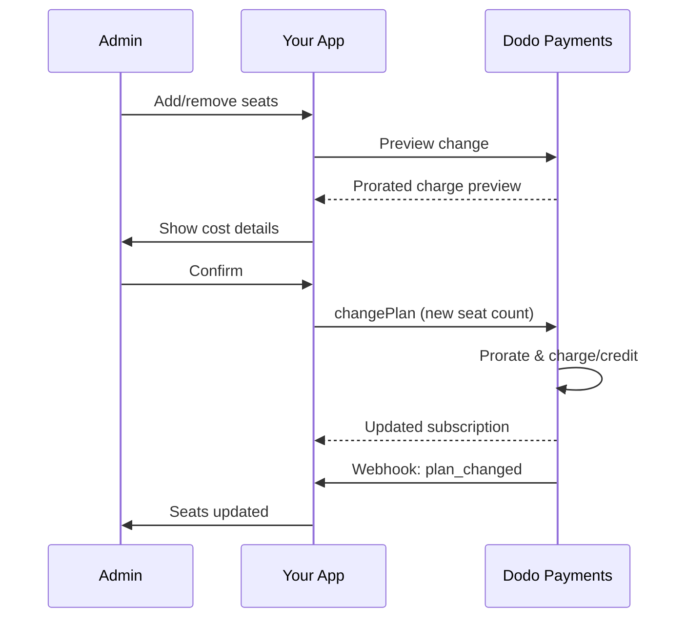

<Info>
सीट-आधारित बिलिंग आपको ग्राहकों से उनके आवश्यक उपयोगकर्ताओं, टीम के सदस्यों, या लाइसेंस की संख्या के आधार पर शुल्क लेने देती है। यह टीम सहयोग उपकरणों, एंटरप्राइज सॉफ़्टवेयर, और B2B SaaS उत्पादों के लिए मानक मूल्य निर्धारण मॉडल है।
</Info>

<CardGroup cols={2}>
<Card title="Implementation Tutorial" icon="code" href="/developer-resources/seat-based-pricing">
  कोड उदाहरणों के साथ चरण-दर-चरण मार्गदर्शिका।
</Card>

<Card title="Add-ons Documentation" icon="puzzle" href="/features/addons">
  सीट-आधारित बिलिंग को संचालित करने वाली ऐड-ऑन प्रणाली के बारे में जानें।
</Card>

<Card title="Subscription Management" icon="repeat" href="/features/subscription">
  सीट-आधारित सदस्यताओं और योजना परिवर्तनों का प्रबंधन करें।
</Card>

<Card title="Webhooks" icon="bell" href="/developer-resources/webhooks/intents/subscription">
  सदस्यता वेबहुक के साथ सीट परिवर्तनों को ट्रैक करें।
</Card>
</CardGroup>

---

## सीट-आधारित बिलिंग क्या है?

सीट-आधारित बिलिंग (जिसे प्रति-उपयोगकर्ता या प्रति-सीट मूल्य निर्धारण भी कहा जाता है) ग्राहकों से उन उपयोगकर्ताओं की संख्या के आधार पर शुल्क लेती है जो आपके उत्पाद का उपयोग करते हैं। एक स्थिर शुल्क के बजाय, मूल्य टीम के आकार के साथ बढ़ता है।

### सामान्य उपयोग के मामले

| उद्योग | उदाहरण | मूल्य निर्धारण मॉडल |
|----------|---------|---------------|
| टीम सहयोग | Slack, Notion, Asana | प्रति सक्रिय उपयोगकर्ता/महीना |
| डेवलपर उपकरण | GitHub, GitLab, Jira | प्रति सीट/महीना |
| CRM सॉफ़्टवेयर | Salesforce, HubSpot | प्रति उपयोगकर्ता लाइसेंस |
| डिज़ाइन उपकरण | Figma, Canva | प्रति संपादक सीट |
| सुरक्षा सॉफ़्टवेयर | 1Password, Okta | प्रति उपयोगकर्ता/महीना |
| वीडियो कॉन्फ्रेंसिंग | Zoom, Teams | प्रति होस्ट लाइसेंस |

### सीट-आधारित मूल्य निर्धारण के लाभ

**आपके व्यवसाय के लिए:**
- जैसे-जैसे ग्राहक बढ़ते हैं, राजस्व स्वाभाविक रूप से बढ़ता है
- पूर्वानुमानित मूल्य निर्धारण जिसे ग्राहक बजट कर सकते हैं
- व्यक्तिगत से टीम से उद्यम तक स्पष्ट अपग्रेड पथ
- जैसे-जैसे टीमें बढ़ती हैं, उच्च जीवनकाल मूल्य

**आपके ग्राहकों के लिए:**
- केवल वही भुगतान करें जो वे उपयोग करते हैं
- लागत को समझना और पूर्वानुमान करना आसान है
- आवश्यकतानुसार उपयोगकर्ताओं को जोड़ने/हटाने की लचीलापन
- उचित मूल्य निर्धारण जो टीम के आकार से मेल खाता है

---

## Dodo Payments में सीट-आधारित बिलिंग कैसे काम करती है

Dodo Payments सीट-आधारित बिलिंग को **ऐड-ऑन** प्रणाली का उपयोग करके लागू करता है। यह कैसे काम करता है:

### आर्किटेक्चर अवलोकन

एक Team Pro सदस्यता की कीमत $99/महीना होती है और इसमें 5 सीटें शामिल हैं। यदि आपके पास 5 से अधिक उपयोगकर्ता हैं, तो प्रत्येक अतिरिक्त सीट के लिए आप $15/महीना अतिरिक्त भुगतान करते हैं। 

उदाहरण के लिए, यदि आपकी टीम को 15 सीटों की आवश्यकता है:
- बेस प्लान: $99/माह (5 सीटें शामिल)
- ऐड-ऑन: 10 अतिरिक्त सीटें × $15/माह = $150/माह
- कुल मासिक लागत: $99 + $150 = 15 सीटों के लिए $249

### प्रमुख घटक

| घटक | उद्देश्य | उदाहरण |
|-----------|---------|---------|
| बेस उत्पाद | शामिल सीटों के साथ मुख्य सदस्यता | "टीम योजना - $99/महीना (5 सीटें शामिल)" |
| सीट ऐड-ऑन | अतिरिक्त उपयोगकर्ताओं के लिए प्रति-सीट शुल्क | "अतिरिक्त सीट - $15/महीना प्रत्येक" |
| मात्रा | खरीदी गई अतिरिक्त सीटों की संख्या | 10 अतिरिक्त सीटें |

---

## मूल्य निर्धारण रणनीतियाँ

अपनी व्यवसाय के लिए उपयुक्त सीट-आधारित मूल्य निर्धारण रणनीति चुनें:

### रणनीति 1: बेस + प्रति-सीट ऐड-ऑन

बेस योजना में एक निश्चित संख्या में सीटें शामिल करें, अतिरिक्त सीटों के लिए शुल्क लें।

**उदाहरण:**

```
Starter Plan: $49/month
├── Includes: 3 seats
├── Extra seats: $10/month each
└── 8 total seats = $49 + (5 × $10) = $99/month
```

**सर्वश्रेष्ठ के लिए:** उत्पाद जहां छोटे टीमें बेस ऑफ़र के साथ कार्य कर सकती हैं।

### रणनीति 2: शुद्ध प्रति-सीट मूल्य निर्धारण

बिना किसी बेस शुल्क के प्रति सीट एक स्थिर दर चार्ज करें।

**उदाहरण:**

```
Per User: $12/month
├── 5 users = $60/month
├── 20 users = $240/month
└── 100 users = $1,200/month
```

**कार्यान्वयन:** बेस योजना की कीमत $0 पर सेट करें, केवल सीट ऐड-ऑन का उपयोग करें।

**सर्वश्रेष्ठ के लिए:** सरल, पारदर्शी मूल्य निर्धारण; उपयोग-आधारित मॉडल।

### रणनीति 3: स्तरित सीट मूल्य निर्धारण

विभिन्न प्रति-सीट दरों के साथ विभिन्न बेस योजनाएँ।

**उदाहरण:**

```
Starter: $0/month base + $15/seat
├── Lower features, higher per-seat cost

Professional: $99/month base + $10/seat
├── More features, lower per-seat cost

Enterprise: $499/month base + $7/seat
└── All features, volume discount on seats
```

**कार्यान्वयन:** विभिन्न ऐड-ऑन कीमतों के साथ प्रत्येक स्तर के लिए अलग उत्पाद बनाएं।

**सर्वश्रेष्ठ के लिए:** उच्च स्तरों पर अपग्रेड को प्रोत्साहित करना; उद्यम बिक्री।

### रणनीति 4: सीट बंडल

सीटों को व्यक्तिगत रूप से बेचने के बजाय पैक में बेचें।

**उदाहरण:**

```
5-Seat Pack: $50/month ($10/seat)
10-Seat Pack: $80/month ($8/seat)
25-Seat Pack: $175/month ($7/seat)
```

**कार्यान्वयन:** विभिन्न पैक आकारों के लिए कई ऐड-ऑन बनाएं।

**सर्वश्रेष्ठ के लिए:** खरीद निर्णयों को सरल बनाना; बड़े प्रतिबद्धताओं को प्रोत्साहित करना।

---

## सीट-आधारित बिलिंग सेट करना

### चरण 1: अपनी मूल्य निर्धारण योजना बनाएं

कार्यान्वयन से पहले, अपनी मूल्य निर्धारण संरचना को परिभाषित करें:

<Steps>
<Step title="Define Base Plan">
निर्णय लें कि बेस सदस्यता में क्या शामिल है:
- बेस कीमत (शुद्ध प्रति-सीट के लिए $0 हो सकता है)
- शामिल सीटों की संख्या
- इस स्तर पर उपलब्ध सुविधाएँ
</Step>

<Step title="Set Seat Pricing">
प्रति-सीट ऐड-ऑन लागत निर्धारित करें:
- अतिरिक्त सीट की कीमत
- कोई वॉल्यूम छूट (कई ऐड-ऑन के माध्यम से)
- अधिकतम सीटें (यदि लागू हो)
</Step>

<Step title="Consider Billing Frequency">
सीट मूल्य निर्धारण को अपनी बिलिंग चक्र के साथ संरेखित करें:
- मासिक सदस्यताएँ → मासिक सीट शुल्क
- वार्षिक सदस्यताएँ → वार्षिक सीट शुल्क (अक्सर छूट के साथ)
</Step>
</Steps>

### चरण 2: सीट ऐड-ऑन बनाएं

अपने Dodo Payments डैशबोर्ड में:

1. **उत्पाद** → **ऐड-ऑन** पर जाएं
2. **ऐड-ऑन बनाएं** पर क्लिक करें
3. ऐड-ऑन को कॉन्फ़िगर करें:

| फ़ील्ड | मान | नोट्स |
|-------|-------|-------|
| नाम | "अतिरिक्त सीट" या "टीम सदस्य" | स्पष्ट, उपयोगकर्ता के अनुकूल नाम |
| विवरण | "अपने कार्यक्षेत्र में एक और टीम सदस्य जोड़ें" | समझाएं कि ग्राहकों को क्या मिलता है |
| मूल्य | आपकी प्रति-सीट कीमत | उदाहरण: $10.00 |
| मुद्रा | अपने बेस उत्पाद से मेल खाता है | एक ही मुद्रा होनी चाहिए |
| कर श्रेणी | बेस उत्पाद के समान | सुनिश्चित करता है कि कर प्रबंधन सुसंगत है |

<Tip>
ऐड-ऑन नाम बनाएं जो चालान पर अर्थ रखते हों। "Additional Team Seat" ग्राहकों के लिए "Seat Add-on" की तुलना में बिल की समीक्षा करते समय अधिक स्पष्ट है।
</Tip>

### चरण 3: बेस सदस्यता बनाएं

अपनी सदस्यता उत्पाद बनाएं:

1. **उत्पाद** → **उत्पाद बनाएं** पर जाएं
2. **सदस्यता** चुनें
3. मूल्य निर्धारण और विवरण कॉन्फ़िगर करें
4. **ऐड-ऑन** अनुभाग में, अपनी सीट ऐड-ऑन संलग्न करें

### चरण 4: उत्पाद से ऐड-ऑन संलग्न करें

अपनी सदस्यता से सीट ऐड-ऑन लिंक करें:

1. अपनी सदस्यता उत्पाद को संपादित करें
2. **ऐड-ऑन** अनुभाग पर स्क्रॉल करें
3. **ऐड-ऑन जोड़ें** पर क्लिक करें
4. अपनी सीट ऐड-ऑन चुनें
5. परिवर्तन सहेजें

<Check>
आपका सदस्यता उत्पाद अब सीट-आधारित मूल्य निर्धारण का समर्थन करता है। ग्राहक चेकआउट के दौरान किसी भी मात्रा में अतिरिक्त सीटें खरीद सकते हैं।
</Check>

---

## सीटों का प्रबंधन

### नई सदस्यताओं में सीटें जोड़ना

चेकआउट सत्र बनाते समय, सीट मात्रा निर्दिष्ट करें:

```typescript
const session = await client.checkoutSessions.create({
  product_cart: [{
    product_id: 'pdt_team_plan',
    quantity: 1,
    addons: [{
      addon_id: 'addon_seat',
      quantity: 10  // 10 additional seats
    }]
  }],
  customer: { email: 'admin@company.com' },
  return_url: 'https://yourapp.com/success'
});
```

### मौजूदा सदस्यताओं पर सीट संख्या बदलना

सीटों को समायोजित करने के लिए चेंज प्लान API का उपयोग करें:

```typescript
// Add 5 more seats to existing subscription
await client.subscriptions.changePlan('sub_123', {
  product_id: 'pdt_team_plan',
  quantity: 1,
  proration_billing_mode: 'prorated_immediately',
  addons: [{
    addon_id: 'addon_seat',
    quantity: 15  // New total: 15 additional seats
  }]
});
```

### सीटें हटाना

सीट संख्या कम करने के लिए, कम मात्रा निर्दिष्ट करें:

```typescript
// Reduce from 15 to 8 additional seats
await client.subscriptions.changePlan('sub_123', {
  product_id: 'pdt_team_plan',
  quantity: 1,
  proration_billing_mode: 'difference_immediately',
  addons: [{
    addon_id: 'addon_seat',
    quantity: 8  // Reduced to 8 additional seats
  }]
});
```

### सभी अतिरिक्त सीटें हटाना

सभी ऐड-ऑन हटाने के लिए एक खाली ऐड-ऑन एरे पास करें:

```typescript
// Remove all additional seats, keep only base plan seats
await client.subscriptions.changePlan('sub_123', {
  product_id: 'pdt_team_plan',
  quantity: 1,
  proration_billing_mode: 'difference_immediately',
  addons: []  // Removes all add-ons
});
```

---

## सीट परिवर्तनों के लिए प्रोरशन

जब ग्राहक मध्य चक्र में सीटें जोड़ते या हटाते हैं, तो प्रोरशन यह निर्धारित करता है कि उन्हें कैसे बिल किया जाता है।



### प्रोरशन मोड

| मोड | सीटें जोड़ना | सीटें हटाना | बिलिंग चक्र |
|------|-------------|----------------|---------------|
| `prorated_immediately` | चक्र में शेष दिनों के लिए शुल्क | अप्रयुक्त दिनों के लिए क्रेडिट | आज से पुनः सेट |
| `difference_immediately` | पूर्ण सीट मूल्य के लिए शुल्क | भविष्य के नवीकरण के लिए क्रेडिट लागू | आज से पुनः सेट |
| `full_immediately` | पूर्ण सीट मूल्य के लिए शुल्क | कोई क्रेडिट नहीं | आज से पुनः सेट |
| `do_not_bill` | सीट जोड़ी गई, अभी कोई शुल्क नहीं | सीट हटाई गई, कोई क्रेडिट नहीं | वही रहता है |

<Warning>
`prorated_immediately`, `difference_immediately`, और `full_immediately` सभी **बिलिंग चक्र को परिवर्तन तिथि पर रीसेट कर देते हैं** — अगला नवीकरण उसी दिन के लिए फिर से एंकर होता है जब सीट परिवर्तन लागू होता है। केवल **`do_not_bill`** मूल नवीकरण तिथि को रखता है (नया सीट काउंट अगले नवीकरण में पूर्ण रूप से बिल किया जाता है, परिवर्तन के समय कोई शुल्क नहीं)।
</Warning>

### प्ररेशन उदाहरण

**परिदृश्य: 15-दिवसीय बिलिंग चक्र शेष है, $10/सीट पर 5 सीटें जोड़ना**

<Tabs>
<Tab title="prorated_immediately">

```
Prorated charge = ($10 × 5 seats) × (15 days / 30 days)
                = $50 × 0.5
                = $25 immediate charge
Billing cycle resets to today
```

ग्राहक को अभी प्ररेटेड राशि का भुगतान करना है, और बिलिंग चक्र परिवर्तन तिथि पर फिर से एंकर कर दिया जाता है — अगला नवीकरण (जोड़ी गई सीटों के लिए $50/माह) आज से एक चक्र बाद में चार्ज किया जाता है, न कि मूल नवीकरण तिथि से।
</Tab>

<Tab title="difference_immediately">

```
Immediate charge = $10 × 5 seats = $50
Billing cycle resets to today
```

ग्राहक को सीट का पूर्ण मूल्य अभी भुगतान करना है, चाहे चक्र स्थिति कुछ भी हो, और बिलिंग चक्र परिवर्तन तिथि पर फिर से एंकर कर दिया जाता है।
</Tab>

<Tab title="full_immediately">

```
Immediate charge = Full subscription + add-ons
Billing cycle resets to today
```

ग्राहक पूरा भुगतान करता है, नया बिलिंग चक्र शुरू होता है।
</Tab>

<Tab title="do_not_bill">

```
Immediate charge = $0
Billing cycle unchanged
```

सीटें तुरंत जोड़ी जाती हैं, परिवर्तन के समय कोई शुल्क नहीं। मूल नवीकरण तिथि को संरक्षित किया जाता है, और नया सीट काउंट अगले नवीकरण में पूर्ण रूप से बिल किया जाता है। इसे तब उपयोग करें जब आपको मौजूदा बिलिंग चक्र को बनाए रखने की आवश्यकता हो।
</Tab>
</Tabs>

**परिदृश्य: प्ररेरेटेड_इमीडियेटली के साथ मध्य-चक्र में 3 सीटें हटाना**

```
Current: Team Plan ($99/month) + 10 extra seats × $10/seat = $199/month
Change: Remove 3 seats (10 → 7 extra seats) on day 20 of 30-day cycle
Remaining: 10 days

Credit for removed seats:
  = ($10 × 3 seats) × (10 days / 30 days)
  = $30 × 0.333
  = $10.00 credit

→ $10.00 credit added to subscription
→ Next renewal: $99 + (7 × $10) = $169.00/month
→ Credit auto-applies: $169.00 − $10.00 = $159.00 on next invoice
```

<Tip>
**सीट परिवर्तनों के लिए प्ररेशन मोड का चयन**: नियमित सीट समायोजन के समय निष्पक्ष दिन-आधारित बिलिंग के लिए `prorated_immediately` का उपयोग करें। `difference_immediately` का उपयोग सरल गणित के लिए करें जो पूर्ण सीट मूल्य को चार्ज या क्रेडिट करता है। यदि आपको मौजूदा नवीकरण तिथि को अपरिवर्तित रखना हो, तो `do_not_bill` का उपयोग करें — एकमात्र मोड जो बिलिंग चक्र रीसेट नहीं करता है (नया सीट काउंट अगले नवीकरण में बिल किया जाता है)। अधिक विस्तार से तुलना के लिए [प्ररेशन गाइड](/developer-resources/subscription-upgrade-downgrade#proration-modes) देखें।
</Tip>

### परिवर्तन से पहले पूर्वावलोकन

परिवर्तन करने से पहले हमेशा प्ररेशन का पूर्वावलोकन करें:

```typescript
const preview = await client.subscriptions.previewChangePlan('sub_123', {
  product_id: 'pdt_team_plan',
  quantity: 1,
  proration_billing_mode: 'prorated_immediately',
  addons: [{ addon_id: 'addon_seat', quantity: 20 }]
});

console.log('Immediate charge:', preview.immediate_charge.summary);
// Show customer: "Adding 5 seats will cost $25 today"
```

---

## सीटों को वेबहुक्स के साथ ट्रैक करना

सदस्यता वेबहुक्स को सुनकर सीट परिवर्तनों की निगरानी करें:

### प्रासंगिक घटनाएँ

| घटना | कब ट्रिगर होती है | उपयोग का मामला |
|-------|----------------|----------|
| `subscription.active` | नई सदस्यता सक्रिय हुई | प्रारंभिक सीटें तैयार करें |
| `subscription.plan_changed` | सीटें जोड़ी गई/हटाई गई | अपने ऐप में सीट काउंट अपडेट करें |
| `subscription.renewed` | सदस्यता नवीनीकृत हुई | सुनिश्चित करें कि सीट काउंट अपरिवर्तित है |
| `subscription.cancelled` | सदस्यता रद्द हुई | सभी सीटों को अप्रावधानित करें |

### वेबहुक हैंडलर उदाहरण

```typescript
app.post('/webhooks/dodo', async (req, res) => {
  const event = req.body;

  switch (event.type) {
    case 'subscription.active':
      // New subscription - provision seats
      const seats = calculateTotalSeats(event.data);
      await provisionSeats(event.data.customer_id, seats);
      break;

    case 'subscription.plan_changed':
      // Seats changed - update access
      const newSeats = calculateTotalSeats(event.data);
      await updateSeatCount(event.data.subscription_id, newSeats);
      break;

    case 'subscription.cancelled':
      // Subscription cancelled - deprovision
      await deprovisionAllSeats(event.data.subscription_id);
      break;
  }

  res.json({ received: true });
});

function calculateTotalSeats(subscriptionData) {
  const baseSeats = 5;  // Included in plan
  const addonSeats = subscriptionData.addons?.reduce(
    (total, addon) => total + addon.quantity, 0
  ) || 0;
  return baseSeats + addonSeats;
}
```

---

## सीट सीमाओं को लागू करना

आपका एप्लिकेशन सीट सीमाओं को प्रभावी रूप से लागू करना होगा। डोडो पेमेंट्स बिलिंग को ट्रैक करता है, लेकिन आप एक्सेस को नियंत्रित करते हैं।

### प्रवर्तन रणनीतियाँ

<Tabs>
<Tab title="Hard Limit">
सीट काउंट से आगे उपयोगकर्ताओं को जोड़ने से एकदम रोकें।

```typescript
async function inviteUser(teamId: string, email: string) {
  const team = await getTeam(teamId);
  const subscription = await getSubscription(team.subscriptionId);
  const totalSeats = calculateTotalSeats(subscription);
  const usedSeats = await countTeamMembers(teamId);

  if (usedSeats >= totalSeats) {
    throw new Error('No seats available. Please upgrade your plan.');
  }

  await sendInvitation(teamId, email);
}
```

</Tab>

<Tab title="Soft Limit with Warning">
चेतावनी और ग्रेस पीरियड के साथ सीमाएं बढ़ने की अनुमति दें।

```typescript
async function inviteUser(teamId: string, email: string) {
  const team = await getTeam(teamId);
  const { totalSeats, usedSeats } = await getSeatInfo(team);

  if (usedSeats >= totalSeats) {
    // Allow but flag for billing
    await flagOverage(teamId, usedSeats - totalSeats + 1);
    await notifyAdmin(team.adminEmail, 'You have exceeded your seat limit');
  }

  await sendInvitation(teamId, email);
}
```

</Tab>

<Tab title="Auto-Upgrade">
सीमा के पहुँचने पर स्वतः सीटें जोड़ें।

```typescript
async function inviteUser(teamId: string, email: string) {
  const team = await getTeam(teamId);
  const { totalSeats, usedSeats, subscriptionId } = await getSeatInfo(team);

  if (usedSeats >= totalSeats) {
    // Automatically add a seat
    await client.subscriptions.changePlan(subscriptionId, {
      product_id: team.productId,
      quantity: 1,
      proration_billing_mode: 'prorated_immediately',
      addons: [{ addon_id: 'addon_seat', quantity: totalSeats - baseSeats + 1 }]
    });

    await notifyAdmin(team.adminEmail, 'A new seat was added to your plan');
  }

  await sendInvitation(teamId, email);
}
```

</Tab>
</Tabs>

---

## उन्नत पैटर्न

### भिन्न सीट प्रकार

विभिन्न मूल्य निर्धारण के साथ विभिन्न सीट प्रकारों की पेशकश करें:

```
Full Seats: $20/month - Full access to all features
View-Only Seats: $5/month - Read-only access
Guest Seats: $0/month - Limited external collaborator access
```

**कार्यान्वयन:** प्रत्येक सीट प्रकार के लिए अलग ऐड-ऑन बनाएं।

```typescript
const session = await client.checkoutSessions.create({
  product_cart: [{
    product_id: 'pdt_team_plan',
    quantity: 1,
    addons: [
      { addon_id: 'addon_full_seat', quantity: 10 },
      { addon_id: 'addon_viewer_seat', quantity: 25 },
      { addon_id: 'addon_guest_seat', quantity: 50 }
    ]
  }]
});
```

### वार्षिक सीट छूट

डिस्काउंटेड वार्षिक सीट मूल्य निर्धारण की पेशकश करें:

```
Monthly: $15/seat/month
Annual: $12/seat/month (20% savings)
```

**कार्यान्वयन:** मासिक और वार्षिक योजनाओं के लिए अलग उत्पाद बनाएँ, जिनमें अलग ऐड-ऑन मूल्य हों।

### न्यूनतम सीट आवश्यकताएँ

कुछ योजनाओं के लिए न्यूनतम संख्या में सीटों की आवश्यकता होती है:

```typescript
async function validateSeatCount(planId: string, seatCount: number) {
  const minimums = {
    'pdt_starter': 1,
    'pdt_team': 5,
    'pdt_enterprise': 25
  };

  if (seatCount < minimums[planId]) {
    throw new Error(`${planId} requires at least ${minimums[planId]} seats`);
  }
}
```

---

## सर्वोत्तम प्रथाएँ

### मूल्य निर्धारण की सर्वोत्तम प्रथाएँ

- **स्पष्ट संवाद**: अपनी मूल्य निर्धारण पृष्ठ पर प्रति-सीट मूल्य निर्धारण को प्रमुखता से दिखाएं
- **शामिल सीटें**: घर्षण को कम करने के लिए आधार मूल्य में कुछ सीटों को शामिल करने पर विचार करें
- **वॉल्यूम छूट**: बड़े टीमों के लिए कम प्रति-सीट दरों की पेशकश करें ताकि एंटरप्राइज़ डील जीती जा सके
- **वार्षिक प्रोत्साहन**: वार्षिक योजनाओं पर छूट दें ताकि नकदी प्रवाह और बनाए रखने में सुधार हो सके

### तकनीकी सर्वोत्तम प्रथाएँ

- **कैश सीट गिनती**: सब्सक्रिप्शन सीट गिनती को स्थानीय पर कैश करें ताकि हर अनुरोध पर एपीआई कॉल्स से बचा जा सके
- **नियमित रूप से सिंक करें**: अपने स्थानीय सीट गिनती को डोडो पेमेंट्स के एपीआई के माध्यम से नियमित रूप से सिंक करें
- **असफलताओं को संभालें**: यदि एक सीट परिवर्तन विफल होती है, तो स्पष्ट त्रुटि संदेश और पुनः प्रयास विकल्प दिखाएं
- **ऑडिट ट्रेल**: बिलिंग विवादों और अनुपालन के लिए सभी सीट परिवर्तनों का लॉग रखें

### उपयोगकर्ता अनुभव की सर्वोत्तम प्रथाएँ

- **रीयल-टाइम फीडबैक**: जब सीटों को समायोजित कर रहे हों, तात्कालिक लागत प्रभाव दिखाएं
- **पुष्टिकरण चरण**: बिलिंग में परिवर्तन से पहले पुष्टि की आवश्यकता होती है
- **प्ररेशन पारदर्शिता**: प्ररेशन चार्ज लागू करने से पहले स्पष्ट रूप से समझाएं
- **आसान डाउनग्रेड्स**: सीटों को घटाना मुश्किल न बनाएं (यह भरोसा बनाता है)

---

## समस्या निवारण

<AccordionGroup>
<Accordion title="Seat count mismatch between app and billing">
**लक्षण**: आपका ऐप जो सब्सक्रिप्शन सीट काउंट दिखाता है, वह अलग है।

**कारण**:
- वेबहुक प्राप्त या संसाधित नहीं हुआ
- सीट परिवर्तन के दौरान रेस कंडीशन
- कैश डेटा अपडेट नहीं हुआ

**समाधान**:
1. वेबहुक हैंडलर्स को लागू करें जिसके लिए `subscription.plan_changed`
2. "बिलिंग के साथ सिंक करें" बटन जोड़ें जो वर्तमान सदस्यता को प्राप्त करता है
3. नियमित ताज़ा के लिए कैश TTL सेट करें
</Accordion>

<Accordion title="Proration charges unexpected">
**लक्षण**: ग्राहक मध्य-चक्र चार्ज राशि से भ्रमित है।

**कारण**:
- प्ररेशन मोड को स्पष्ट रूप से संवाद नहीं किया गया
- ग्राहक ने पुष्टि से पहले पूर्वावलोकन नहीं देखा

**समाधान**:
1. परिवर्तन करने से पहले हमेशा `previewChangePlan` का उपयोग करें
2. स्पष्ट ब्रेकडाउन दिखाएं: "X सीट जोड़ना = $Y आज (Z दिनों के लिए प्ररेटेड)"
3. अपने सहायता केंद्र में अपनी प्ररेशन नीति का दस्तावेज़ बनाएं
</Accordion>

<Accordion title="Add-on not appearing in checkout">
**लक्षण**: चेकआउट के दौरान सीट ऐड-ऑन उपलब्ध नहीं है।

**कारण**:
- उत्पाद के साथ ऐड-ऑन संलग्न नहीं है
- ऐड-ऑन को संग्रहीत या हटाया गया है
- उत्पाद और ऐड-ऑन के बीच मुद्रा मेल नहीं खाती

**समाधान**:
1. सुनिश्चित करें कि ऐड-ऑन को उत्पाद सेटिंग्स में संलग्न किया गया है
2. ऐड-ऑन की स्थिति को ऐड-ऑन्स डैशबोर्ड में जांचें
3. सुनिश्चित करें कि मुद्राएँ सटीक मेल खाती हैं
</Accordion>

<Accordion title="Cannot reduce seats below current usage">
**लक्षण**: ग्राहक सीटों को घटाना चाहता है लेकिन उपयोगकर्ता असाइन किए गए हैं।

**समाधान**:
1. दिखाएं कि किन उपयोगकर्ताओं को हटाने की आवश्यकता है इससे पहले कि सीटें घटाई जा सकें
2. एक कार्यप्रवाह लागू करें: उपयोगकर्ताओं को हटाएं → सीटें घटाएं
3. सीट घटाव लागू करने से पहले ग्रेस पीरियड पर विचार करें
</Accordion>
</AccordionGroup>

---

## संबंधित दस्तावेजीकरण

<CardGroup cols={2}>
<Card title="Seat-Based Pricing Tutorial" icon="code" href="/developer-resources/seat-based-pricing">
  कोड के साथ पूर्ण कार्यान्वयन गाइड।
</Card>

<Card title="Add-ons" icon="puzzle" href="/features/addons">
  ऐड-ऑन सिस्टम को गहराई से समझें।
</Card>

<Card title="Plan Changes & Proration" icon="arrows-rotate" href="/developer-resources/subscription-upgrade-downgrade">
  सदस्यता संशोधनों को संभालें।
</Card>

<Card title="Subscription Webhooks" icon="bell" href="/developer-resources/webhooks/intents/subscription">
  सदस्यता घटनाओं को ट्रैक करें।
</Card>
</CardGroup>
