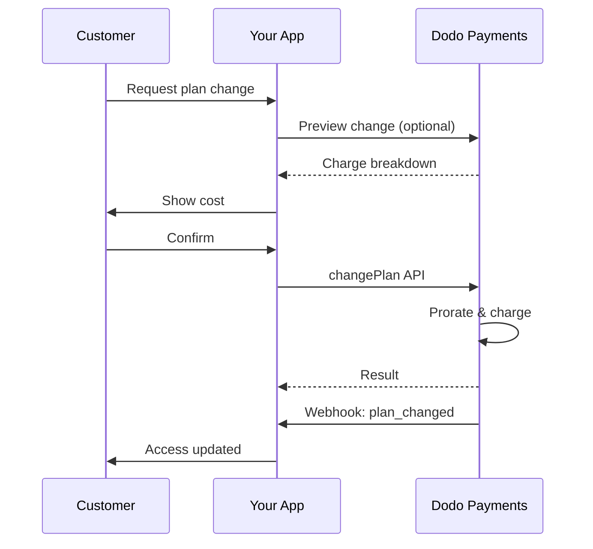
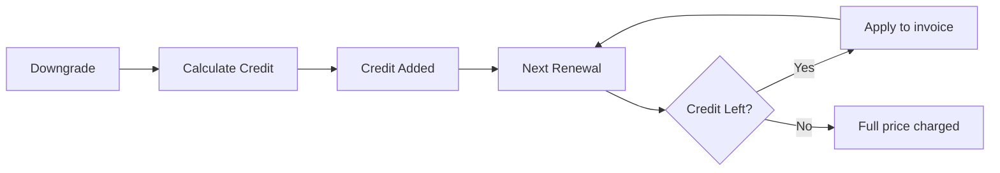
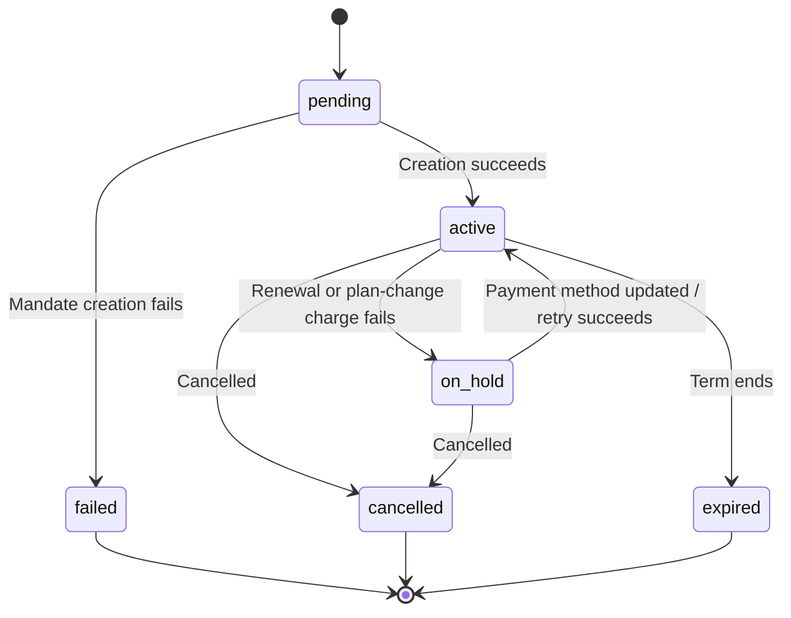

<Info>
सब्सक्रिप्शन आपको automated renewals के साथ निरंतर access बेचने की सुविधा देते हैं। प्रत्येक customer के लिए pricing को अनुकूलित करने हेतु flexible billing cycles, free trials, plan changes और add-ons का उपयोग करें।
</Info>

<CardGroup cols={2}>
<Card title="Upgrade & Downgrade" icon="repeat" href="/developer-resources/subscription-upgrade-downgrade">
Proration और quantity updates के साथ plan changes नियंत्रित करें।
</Card>

<Card title="On‑Demand Subscriptions" icon="bolt" href="/developer-resources/ondemand-subscriptions">
अभी mandate authorize करें और custom amounts के साथ बाद में charge करें।
</Card>

<Card title="Customer Portal" icon="id-card" href="/features/customer-portal">
Customers को plans, billing और cancellations manage करने दें।
</Card>

<Card title="Subscription Webhooks" icon="code" href="/developer-resources/webhooks/intents/subscription">
created, renewed और canceled जैसे lifecycle events पर प्रतिक्रिया दें।
</Card>
</CardGroup>

## सब्सक्रिप्शन क्या हैं?

सब्सक्रिप्शन recurring products होते हैं जिन्हें customers किसी schedule के अनुसार खरीदते हैं। ये इनके लिए आदर्श हैं:

- **SaaS licenses**: Apps, APIs या platform access
- **Memberships**: Communities, programs या clubs
- **Digital content**: Courses, media या premium content
- **Support plans**: SLAs, success packages या maintenance

## मुख्य लाभ

- **Predictable revenue**: Automated renewals के साथ recurring billing
- **Flexible cycles**: Monthly, annual, custom intervals और trials
- **Plan agility**: Upgrades और downgrades के लिए proration
- **Add-ons और seats**: Optional, quantifiable upgrades जोड़ें
- **Seamless checkout**: Hosted checkout और customer portal
- **Developer-first**: Creation, changes और usage tracking के लिए स्पष्ट APIs

## सब्सक्रिप्शन बनाना

अपने Dodo Payments dashboard में subscription products बनाएं, फिर उन्हें checkout या अपने API के माध्यम से बेचें। Products को active subscriptions से अलग रखने पर आप pricing के versions बना सकते हैं, add-ons जोड़ सकते हैं और performance को स्वतंत्र रूप से track कर सकते हैं।

### Subscription product creation

अपने subscription की बिक्री, renewal और billing निर्धारित करने के लिए dashboard में fields configure करें। नीचे दिए गए sections creation form में दिखाई देने वाली चीज़ों से सीधे संबंधित हैं।

#### Product details

- **Product Name** (required): Checkout, customer portal और invoices में दिखाई देने वाला display name।
- **Product Description** (required): Checkout और invoices में दिखाई देने वाला स्पष्ट value statement।
- **Product Image** (required): 3 MB तक PNG/JPG/WebP। Checkout और invoices पर उपयोग किया जाता है।
- **Brand**: Theming और emails के लिए product को किसी specific brand से associate करें।
- **Tax Category** (required): Tax rules निर्धारित करने के लिए category (उदाहरण के लिए, SaaS) चुनें।

<Tip>
प्रत्येक region में सही tax collection सुनिश्चित करने के लिए सबसे सटीक tax category चुनें।
</Tip>

#### Pricing

- **Pricing Type**: <b>Subscription</b> चुनें (यह गाइड)। विकल्प हैं Single Payment और Usage Based Billing।
- **Price** (required): मुद्रा सहित आधार recurring price। कीमत कम से कम **$1** (या आपकी चुनी हुई मुद्रा में उसके बराबर) होनी चाहिए। इससे कम राशि समर्थित नहीं है और subscription काम नहीं करेगा।
- **Discount Applicable (%)**: आधार कीमत पर लागू होने वाली वैकल्पिक प्रतिशत छूट; checkout और invoices में दिखाई देती है।
- **Repeat payment every** (required): renewals का interval, जैसे हर 1 Month। cadence (months या years) और quantity चुनें।
- **Subscription Period** (required): वह कुल अवधि जिसके दौरान subscription active रहता है (जैसे 10 Years)। यह अवधि समाप्त होने के बाद, बढ़ाए जाने तक renewals रुक जाते हैं।
- **Trial Period Days** (required): trial की अवधि दिनों में सेट करें। trials बंद करने के लिए 0 का उपयोग करें। trial समाप्त होने पर पहला charge अपने-आप होता है।
- **Trial Amount**: paid trial के लिए वैकल्पिक upfront charge। free trial के लिए इसे unset छोड़ें। [Paid Trials](#paid-trials) देखें।
- **Select add‑on**: अधिकतम 10 add‑ons जोड़ें, जिन्हें ग्राहक base plan के साथ खरीद सकते हैं।

<Warning>
Active product की pricing बदलने से नई purchases प्रभावित होती हैं। Existing subscriptions आपकी plan-change और proration settings का पालन करती हैं।
</Warning>

<Info>
Add-ons seats या storage जैसे quantifiable extras के लिए आदर्श हैं। Customers द्वारा इन्हें बदलने पर आप allowed quantities और proration behavior नियंत्रित कर सकते हैं।
</Info>

#### Advanced settings

- **Tax Inclusive Pricing**: लागू taxes सहित prices display करें। Final tax calculation customer location के अनुसार अलग हो सकता है।
- **Generate license keys**: Purchase के बाद प्रत्येक customer को एक unique key जारी करें। <a href="/features/license-keys">License Keys</a> guide देखें।
- **Digital Product Delivery**: Purchase के बाद files या content automatically deliver करें। <a href="/features/digital-product-delivery">Digital Product Delivery</a> में अधिक जानें।
- **Metadata**: Internal tagging या client integrations के लिए custom key–value pairs जोड़ें। <a href="/api-reference/metadata">Metadata</a> देखें।

<Tip>
अपने system के identifiers (जैसे, accountId) store करने के लिए metadata का उपयोग करें, ताकि बाद में events और invoices का reconciliation कर सकें।
</Tip>

## Subscription Trials

Trials ग्राहकों को पूरी recurring price चुकाने से पहले subscription का मूल्यांकन करने देते हैं। trial **free** हो सकता है, जिसमें trial समाप्त होने तक कुछ charge नहीं किया जाता, या **paid** हो सकता है, जिसमें शुरुआत में कम राशि charge की जाती है। दोनों मामलों में trial समाप्त होने के बाद पहले renewal से full price लागू होती है।

### Trials configure करना

Product pricing section में **Trial Period Days** set करें (disable करने के लिए `0` का उपयोग करें)। Subscriptions बनाते समय इसे override किया जा सकता है:

```typescript
// Via subscription creation
const subscription = await client.subscriptions.create({
  customer_id: 'cus_123',
  product_id: 'prod_monthly',
  trial_period_days: 14  // Overrides product's trial period
});

// Via checkout session
const session = await client.checkoutSessions.create({
  product_cart: [{ product_id: 'prod_monthly', quantity: 1 }],
  subscription_data: { trial_period_days: 14 }
});
```

<Warning>
`trial_period_days` value 0 से 10,000 दिनों के बीच होना चाहिए।
</Warning>

### Paid Trials

Trials का free होना आवश्यक नहीं है। paid trial window के लिए कम upfront fee charge करने हेतु subscription product की recurring price पर **Trial Amount** सेट करें। इसके बाद पहले renewal पर full recurring price लागू हो जाती है।

<Frame>

</Frame>

Paid trials product की price पर configure किए जाते हैं, subscription या checkout session के आधार पर नहीं:

| Field | Type | Description |
|-------|------|-------------|
| `trial_amount` | integer | trial के लिए आज charge की जाने वाली राशि, price currency की minor units में (उदाहरण के लिए, $5.00 के लिए `500`)। इसके लिए `trial_period_days > 0` आवश्यक है। free trial के लिए इसे omit करें या `null` पर सेट करें। |
| `trial_apply_discounts` | boolean | क्या checkout discount codes trial charge को कम करें। डिफ़ॉल्ट रूप से `false`, इसलिए recurring price पर discount लागू होने पर भी trial amount पूरी charge होती है। |

```typescript
const product = await client.products.create({
  name: 'Pro Plan',
  tax_category: 'saas',
  price: {
    type: 'recurring_price',
    price: 2900,                      // $29.00 per month after the trial
    currency: 'USD',
    payment_frequency_count: 1,
    payment_frequency_interval: 'Month',
    subscription_period_count: 1,
    subscription_period_interval: 'Year',
    trial_period_days: 14,            // A paid trial requires a positive trial period
    trial_amount: 500,                // $5.00 charged today
    trial_apply_discounts: false      // Discounts apply to the recurring price only
  }
});
```

Paid trials checkout से भी गुजरते हैं। trial amount पर tax लगाया जाता है, checkout session calculations और payment link pricing में दिखाया जाता है, और प्रत्येक currency के अनुसार Adaptive Currency markup लागू होता है। [preview endpoint](/developer-resources/checkout-session) `trial_amount` और `trial_period_days` लौटाता है, ताकि subscription बनने से पहले आप आज देय राशि दिखा सकें।

<Info>
Free trials में कोई बदलाव नहीं है। **Trial Amount** को unset छोड़ने पर मौजूदा व्यवहार बना रहता है: पहला charge `0` होता है और trial समाप्त होने पर full price charge की जाती है।
</Info>

### Trial Misuse रोकना

**Prevent Trial Misuse** ग्राहकों को एक ही business के लिए बार-बार trials claim करने से रोकता है। सक्षम होने पर, जिस ग्राहक ने पहले trial redeem किया है, उसे नया trial देने के बजाय अपने-आप **paid, no-trial purchase** में बदल दिया जाता है।

<Frame>

</Frame>

इसे **Settings** के **Subscriptions** tab से सक्षम करें। सक्षम होने के बाद:

- ग्राहकों का मिलान **normalized email** से किया जाता है और plus-aliases हटा दिए जाते हैं, इसलिए `user+trial@example.com` और `user@example.com` को एक ही व्यक्ति माना जाता है।
- Redemptions को **trial activation** पर दर्ज किया जाता है, इसलिए उसी दिन cancel करने वाला ग्राहक भी अपना trial इस्तेमाल कर चुका माना जाता है।
- Existing customers को email के आधार पर उनके historical trials से backfill किया जाता है, इसलिए पुराने trial users तुरंत पहचान लिए जाते हैं।

<Info>
यह setting डिफ़ॉल्ट रूप से **off** है। business-level subscription controls की पूरी सूची के लिए [Subscription Settings](/features/product-collections#subscription-settings) देखें।
</Info>

### Trial Status पहचानना

<Warning>
वर्तमान में trial status पहचानने के लिए कोई direct field नहीं है। निम्न workaround के लिए payments query करना पड़ता है, जो inefficient है। हम अधिक efficient solution पर काम कर रहे हैं।
</Warning>

यह निर्धारित करने के लिए कि कोई **free trial** subscription trial में है या नहीं, subscription के payments की सूची प्राप्त करें। यदि amount 0 वाला ठीक एक payment है, तो subscription trial period में है:

```typescript
const subscription = await client.subscriptions.retrieve('sub_123');
const payments = await client.payments.list({
  subscription_id: subscription.subscription_id
});

// Check if subscription is in trial
const isInTrial = payments.items.length === 1 && 
                  payments.items[0].total_amount === 0;
```

<Warning>
यह zero-amount check केवल free trials के लिए काम करता है। [paid trial](#paid-trials) में पहला payment `0` नहीं, बल्कि trial amount के बराबर होता है। इसके बजाय पहले payment की तुलना subscription के `trial_amount` से करें, या जाँचें कि `next_billing_date` अभी भी trial window के भीतर है या नहीं।
</Warning>

### Trial Period अपडेट करना

`next_billing_date` अपडेट करके trial बढ़ाएँ:

```typescript
await client.subscriptions.update('sub_123', {
  next_billing_date: '2025-02-15T00:00:00Z'  // New trial end date
});
```

<Warning>
आप `next_billing_date` को past time पर सेट नहीं कर सकते। date future में होनी चाहिए।
</Warning>

## Subscription Plan Changes

Plan changes से आप subscriptions को upgrade या downgrade कर सकते हैं, quantities समायोजित कर सकते हैं या अलग products पर migrate कर सकते हैं। आपके द्वारा चुने गए proration mode के आधार पर, बदलाव से तत्काल charge हो सकता है, credit बन सकता है या कोई billing adjustment लागू नहीं हो सकता।

<Tip>
आप Dodo Payments dashboard से सीधे subscription plans बदल सकते हैं और अगली billing date अपडेट कर सकते हैं। इससे customer support requests, promotional upgrades या plan migrations के लिए API calls किए बिना subscriptions समायोजित करने का तेज़ तरीका मिलता है।
</Tip>

<Tip>
**self-service plan changes सक्षम करें:** क्या आप चाहते हैं कि ग्राहक Customer Portal के माध्यम से अपनी subscriptions upgrade या downgrade कर सकें? अपने subscription products को Product Collection में जोड़ें और Subscription Settings में "Allow Subscription Updates" सक्षम करें।
</Tip>



<Card title="Product Collections" icon="layer-group" href="/features/product-collections">
  Customer Portal में seamless upgrade/downgrade paths सक्षम करने के लिए संबंधित products को collections में समूहित करें।
</Card>

### Proration Modes

Plans बदलते समय ग्राहकों से billing कैसे की जाए, चुनें:

<Info>
**चार proration modes की त्वरित तुलना:**

| | `prorated_immediately` | `difference_immediately` | `full_immediately` | `do_not_bill` |
|---|---|---|---|---|
| **Upgrade** | शेष दिनों के लिए prorated charge | पूरी price difference charge | नए plan की पूरी price charge | कोई charge नहीं — तुरंत switch |
| **Downgrade** | शेष दिनों के लिए prorated credit | पूरी price difference credit के रूप में | कोई credit नहीं, पूरी charge | कोई credit नहीं — तुरंत switch |
| **Billing cycle** | आज पर reset | आज पर reset | आज पर reset | वही रहता है |
| **Best for** | समय-आधारित fair billing | सरल tier changes | Billing cycle resets | Free migrations या courtesy switches |
</Info>

#### `prorated_immediately`
वर्तमान billing cycle में बचे समय के आधार पर prorated amount charge करता है। unused time को ध्यान में रखने वाली fair billing के लिए सबसे उपयुक्त।

```typescript
await client.subscriptions.changePlan('sub_123', {
  product_id: 'prod_pro',
  quantity: 1,
  proration_billing_mode: 'prorated_immediately'
});
```

#### `difference_immediately`
price difference को तुरंत charge करता है (upgrade) या future renewals के लिए credit जोड़ता है (downgrade)। सरल upgrade/downgrade scenarios के लिए सबसे उपयुक्त।

```typescript
// Upgrade: charges $50 (difference between $30 and $80)
// Downgrade: credits remaining value, auto-applied to renewals
await client.subscriptions.changePlan('sub_123', {
  product_id: 'prod_pro',
  quantity: 1,
  proration_billing_mode: 'difference_immediately'
});
```

<Info>
`difference_immediately` का उपयोग करके downgrades से मिलने वाले credits subscription-scoped होते हैं और future renewals पर अपने-आप लागू होते हैं। ये <a href="/features/credit-based-billing">Credit-Based Billing</a> entitlements से अलग हैं।
</Info>

जब कोई ग्राहक `difference_immediately` के साथ downgrade करता है, तो unused value subscription-scoped credit बन जाती है, जो future renewals को अपने-आप offset करती है:



#### `full_immediately`
शेष समय की परवाह किए बिना नए plan की पूरी राशि तुरंत charge करता है। Billing cycles reset करने के लिए सबसे उपयुक्त।

```typescript
await client.subscriptions.changePlan('sub_123', {
  product_id: 'prod_monthly',
  quantity: 1,
  proration_billing_mode: 'full_immediately'
});
```

#### `do_not_bill`
बिना किसी billing adjustment के नए plan पर switch करता है। कोई proration charges या credits नहीं — ग्राहक केवल नए plan पर चला जाता है। courtesy migrations, free plan switches या ऐसे scenarios के लिए सबसे उपयुक्त जहाँ आप cost difference वहन करना चाहते हैं।

```typescript
await client.subscriptions.changePlan('sub_123', {
  product_id: 'prod_new_plan',
  quantity: 1,
  proration_billing_mode: 'do_not_bill'
});
```

<AccordionGroup>
<Accordion title="Example: Prorated upgrade calculation">

**Scenario**: Basic ($30/month) पर मौजूद ग्राहक `prorated_immediately` का उपयोग करके 30-day cycle के day 16 पर Pro ($80/month) में upgrade करता है।

```
Unused credit from Basic = $30 × (15 remaining / 30 total) = $15.00
Prorated cost of Pro     = $80 × (15 remaining / 30 total) = $40.00
────────────────────────────────────────────────────────────────────
Immediate charge         = $40.00 − $15.00 = $25.00
```

अगला renewal **February 15** (January 16 + 30 days) को: **$80.00/month**।

<Tip>
अधिक विस्तृत calculation examples और edge cases के लिए हमारी पूरी [Upgrade & Downgrade Guide](/developer-resources/subscription-upgrade-downgrade) देखें।
</Tip>

</Accordion>
<Accordion title="Example: Downgrade credit calculation">

**Scenario**: Pro ($80/month) पर मौजूद ग्राहक `difference_immediately` का उपयोग करके Starter ($20/month) में downgrade करता है।

```
Credit = Old plan − New plan = $80 − $20 = $60.00
```

$60 credit future renewals पर अपने-आप लागू होता है:
- Renewal 1: $20 − $20 (credit) = **$0.00** ($40 credit शेष)
- Renewal 2: $20 − $20 (credit) = **$0.00** ($20 credit शेष)  
- Renewal 3: $20 − $20 (credit) = **$0.00** (credit समाप्त)
- Renewal 4: **$20.00** (पूरी price)

<Info>
Credits कैसे manage किए जाते हैं, इसके बारे में अधिक जानकारी [Upgrade & Downgrade Guide](/developer-resources/subscription-upgrade-downgrade) में प्राप्त करें।
</Info>

</Accordion>
</AccordionGroup>

### Add-ons के साथ Plans बदलना

Plans बदलते समय add-ons संशोधित करें। Add-ons proration calculations में शामिल होते हैं:

```typescript
await client.subscriptions.changePlan('sub_123', {
  product_id: 'prod_pro',
  quantity: 1,
  proration_billing_mode: 'difference_immediately',
  addons: [{ addon_id: 'addon_extra_seats', quantity: 2 }]  // Add add-ons
  // addons: []  // Empty array removes all existing add-ons
});
```

<Info>
Plan changes से तत्काल charges trigger होते हैं। Failed charges subscription को `on_hold` status में ले जा सकते हैं। `subscription.plan_changed` webhook events के माध्यम से changes track करें।
</Info>

### Plan Changes का Preview देखना

Plan change लागू करने से पहले exact charge और resulting subscription का preview देखें:

```typescript
const preview = await client.subscriptions.previewChangePlan('sub_123', {
  product_id: 'prod_pro',
  quantity: 1,
  proration_billing_mode: 'prorated_immediately'
});

// Show customer the charge before confirming
console.log('You will be charged:', preview.immediate_charge.summary);
```

<Card title="Preview Change Plan API" icon="eye" href="/api-reference/subscriptions/preview-change-plan">
  Plan changes लागू करने से पहले उनका preview देखें।
</Card>

## Subscription States

अपने lifetime के दौरान subscription statuses के एक निर्धारित set से गुजरता है। यह table प्रत्येक status, उसके कारण और उससे recover करने के तरीके (या recovery संभव है या नहीं) का reference है।

| Status | What it means | Recoverable? | Recovery path / next step |
|--------|---------------|--------------|---------------------------|
| `pending` | subscription बनाया या process किया जा रहा है | — | `subscription.active` (या `subscription.failed`) की प्रतीक्षा करें |
| `active` | subscription active है और अपने-आप renew होगा | — | किसी action की आवश्यकता नहीं |
| `on_hold` | renewal payment (या plan-change charge) विफल हुआ; subscription paused है | **Yes** | payment method अपडेट करके reactivate करें — [Payment Retries](/features/recovery/payment-retries) और [Dunning](/features/recovery/subscription-dunning) के माध्यम से automatically, या [Update Payment Method API](/api-reference/subscriptions/update-payment-method) के माध्यम से manually |
| `cancelled` | subscription cancel हो चुका है और renew नहीं होगा | केवल re-purchase | ग्राहक को नया subscription शुरू करना होगा; [Dunning](/features/recovery/subscription-dunning) re-purchase के लिए prompt कर सकता है |
| `failed` | subscription **creation** विफल हुआ (initial mandate या payment सफल नहीं हुआ) | **No — terminal** | ग्राहक को working payment method के साथ नया subscription बनाना होगा |
| `expired` | subscription अपनी term के अंत तक पहुँच गया | — | आवश्यकता होने पर ग्राहक को नया subscription शुरू करना होगा |

<Warning>
`on_hold` और `failed` को अक्सर भ्रमित किया जाता है। `on_hold` पहले से active subscription के लिए **recoverable** state है, जिसका renewal विफल हुआ है। `failed` एक **terminal** state है, जो केवल **initial** subscription creation विफल होने पर होती है — इसे reactivate नहीं किया जा सकता।
</Warning>

### State Machine



### On Hold State

Subscription `on_hold` state में तब जाता है जब:

- Renewal payment विफल हो (insufficient funds, expired card आदि)
- Plan change charge विफल हो
- Payment method authorization विफल हो

<Warning>
जब subscription `on_hold` state में होता है, तो वह अपने-आप renew नहीं होगा। Subscription को reactivate करने के लिए आपको payment method अपडेट करना होगा।
</Warning>

### On Hold से Reactivate करना

Subscription को `on_hold` state से reactivate करने के लिए payment method अपडेट करें। यह अपने-आप:

1. शेष dues के लिए charge बनाता है
2. invoice generate करता है
3. नए payment method का उपयोग करके payment process करता है
4. सफल payment पर subscription को `active` state में reactivate करता है

```typescript
// Reactivate subscription from on_hold
const response = await client.subscriptions.updatePaymentMethod('sub_123', {
  payment_method: {
    type: 'new',
    return_url: 'https://example.com/return'
  }
});

// For on_hold subscriptions, a charge is automatically created
if (response.payment_id) {
  console.log('Charge created:', response.payment_id);
  // Redirect customer to response.payment_link to complete payment
  // Monitor webhooks for payment.succeeded and subscription.active
}
```

<Info>
`on_hold` subscription के लिए payment method सफलतापूर्वक अपडेट करने के बाद, आपको `payment.succeeded` और उसके बाद `subscription.active` webhook events प्राप्त होंगे।
</Info>

### Transition के अनुसार Webhook Events

हर transition एक webhook emit करता है, ताकि polling के बिना entitlement logic चलाया जा सके:

| Transition | Event |
|------------|-------|
| Subscription activated | `subscription.active` |
| Renewal succeeds | `subscription.renewed` |
| Renewal fails → paused | `subscription.on_hold` |
| Creation fails | `subscription.failed` |
| Plan upgraded/downgraded | `subscription.plan_changed` |
| Cancelled | `subscription.cancelled` |
| Term ended | `subscription.expired` |
| Any field changes | `subscription.updated` |

<Card title="Subscription Webhook Payloads" icon="webhook" href="/developer-resources/webhooks/intents/subscription">
Subscription lifecycle events के लिए full payload schema देखें।
</Card>

## API Management

<AccordionGroup>
<Accordion title="Create subscriptions">
Products से programmatically subscriptions बनाने के लिए `POST /subscriptions` का उपयोग करें; इसमें optional trials और add‑ons शामिल किए जा सकते हैं।

<Card title="API Reference" icon="code" href="/api-reference/subscriptions/post-subscriptions">
Create subscription API देखें।
</Card>
</Accordion>

<Accordion title="Update subscriptions">
Quantities अपडेट करने, अगली billing date पर cancel करने या metadata संशोधित करने के लिए `PATCH /subscriptions/{id}` का उपयोग करें।

<Card title="API Reference" icon="code" href="/api-reference/subscriptions/patch-subscriptions">
Subscription details अपडेट करना सीखें।
</Card>
</Accordion>

<Accordion title="Change plans (proration)">
Proration controls के साथ active product और quantities बदलें।

<Card title="API Reference" icon="code" href="/api-reference/subscriptions/change-plan">
Plan change options की समीक्षा करें।
</Card>
</Accordion>

<Accordion title="On‑demand charges">
On-demand subscriptions के लिए specific amounts को on demand charge करें।

<Card title="API Reference" icon="code" href="/api-reference/subscriptions/create-charge">
On-demand subscription charge करें।
</Card>
</Accordion>

<Accordion title="List and retrieve">
सभी subscriptions की सूची बनाने के लिए `GET /subscriptions` और किसी एक को retrieve करने के लिए `GET /subscriptions/{id}` का उपयोग करें।

<Card title="API Reference" icon="code" href="/api-reference/subscriptions/get-subscriptions">
Listing और retrieval APIs browse करें।
</Card>
</Accordion>

<Accordion title="Usage history">
Metered या hybrid pricing models के लिए recorded usage प्राप्त करें।

<Card title="API Reference" icon="code" href="/api-reference/subscriptions/get-usage-history">
Usage history API देखें।
</Card>
</Accordion>

<Accordion title="Update payment method">
Subscription के लिए payment method अपडेट करें। Active subscriptions के लिए यह future renewals का payment method अपडेट करता है। `on_hold` state वाली subscriptions के लिए, यह शेष dues का charge बनाकर subscription को reactivate करता है।

नया payment-method link बनाते समय (`New` request type), आप `allowed_payment_method_types` पास करके यह सीमित कर सकते हैं कि उस page पर ग्राहक को कौन-से payment methods दिखाई दें। ग्राहकों को सूची में शामिल न किया गया method कभी नहीं दिखेगा, हालांकि किसी method को शामिल करने से उसका दिखाई देना सुनिश्चित नहीं होता (availability customer location और आपकी business settings जैसे factors पर निर्भर करती है)।

<Card title="API Reference" icon="code" href="/api-reference/subscriptions/update-payment-method">
Payment methods अपडेट करना और subscriptions reactivate करना सीखें।
</Card>
</Accordion>
</AccordionGroup>

## Common Use Cases

- **SaaS and APIs**: seats या usage के लिए add‑ons के साथ tiered access
- **Content and media**: introductory trials के साथ monthly access
- **B2B support plans**: premium support add‑ons के साथ annual contracts
- **Tools and plugins**: license keys और versioned releases

## Integration Examples

### Checkout Sessions (subscriptions)
Checkout sessions बनाते समय अपना subscription product और optional add‑ons शामिल करें:

```typescript
const session = await client.checkoutSessions.create({
  product_cart: [
    {
      product_id: 'prod_subscription',
      quantity: 1
    }
  ]
});
```

### Proration के साथ Plan changes
Subscription को upgrade या downgrade करें और proration behavior नियंत्रित करें:

```typescript
await client.subscriptions.changePlan('sub_123', {
  product_id: 'prod_new',
  quantity: 1,
  proration_billing_mode: 'difference_immediately'
});
```

### अगली billing date पर Cancel
वर्तमान billing period के अंत में प्रभावी होने वाला cancellation schedule करें:

```typescript
await client.subscriptions.update('sub_123', {
  cancel_at_next_billing_date: true
});
```

### Subscription period बढ़ाना
`subscription_period_count` और `subscription_period_interval` को `PATCH /subscriptions/{id}` में पास करके subscription की अवधि बढ़ाएँ। Subscription की expiry नए count और interval के आधार पर फिर से calculate की जाती है — उदाहरण के लिए, ग्राहक को उसके current plan पर अतिरिक्त समय देने के लिए:

```typescript
await client.subscriptions.update('sub_123', {
  subscription_period_count: 5,
  subscription_period_interval: 'Month'
});
```

<Note>
Subscription की period केवल **बढ़ाई** जा सकती है, घटाई नहीं जा सकती।
</Note>

### On‑demand subscriptions
On-demand subscription बनाएँ और आवश्यकता के अनुसार बाद में charge करें:

```typescript
const onDemand = await client.subscriptions.create({
  customer_id: 'cus_123',
  product_id: 'prod_on_demand',
  on_demand: { mandate_only: true }
});

await client.subscriptions.charge(onDemand.subscription_id, {
  product_price: 4900,
  product_currency: 'USD',
  product_description: 'Extra usage for September'
});
```

### Active subscription के लिए payment method अपडेट करना
Active subscription का payment method अपडेट करें:

```typescript
// Update with new payment method
const response = await client.subscriptions.updatePaymentMethod('sub_123', {
  payment_method: {
    type: 'new',
    return_url: 'https://example.com/return'
  }
});

// Or use existing payment method
await client.subscriptions.updatePaymentMethod('sub_123', {
  payment_method: {
    type: 'existing',
    payment_method_id: 'pm_abc123'
  }
});
```

### on_hold से Subscription reactivate करना
Failed payment के कारण on hold हुई subscription को reactivate करें:

```typescript
// Update payment method - automatically creates charge for remaining dues
const response = await client.subscriptions.updatePaymentMethod('sub_123', {
  payment_method: {
    type: 'new',
    return_url: 'https://example.com/return'
  }
});

if (response.payment_id) {
  // Charge created for remaining dues
  // Redirect customer to response.payment_link
  // Monitor webhooks: payment.succeeded → subscription.active
}
```

## RBI-Compliant Mandates वाली Subscriptions

  UPI और Indian card subscriptions RBI (Reserve Bank of India) regulations के अंतर्गत specific mandate requirements के साथ operate करती हैं:

  ### Mandate Limits

  Mandate type और amount आपकी subscription के recurring charge पर निर्भर करते हैं:

  - **Mandate floor (default ₹15,000) से कम charges:** हम floor amount के लिए on-demand mandate बनाते हैं। Subscription amount आपकी subscription frequency के अनुसार periodically charge की जाती है, mandate limit तक।
  - **Mandate floor के बराबर या उससे अधिक charges:** हम exact subscription amount के लिए subscription mandate (या on-demand mandate) बनाते हैं।

  Mandate floor को प्रति merchant या प्रति request `mandate_min_amount_inr_paise` (INR paise) के माध्यम से configure किया जा सकता है। Bank के साथ registered amount `max(mandate_floor, billing_amount)` है — इसलिए जब billing कम होती है, floor effectively customer-facing authorization ceiling बन जाता है।

RBI-compliant mandates और Indian payment methods के लिए configurable mandate floor की विस्तृत जानकारी के लिए <a href="/features/payment-methods/india#configurable-mandate-floor">India Payment Methods</a> page देखें।

  ### Upgrade और Downgrade संबंधी बातें

  **Important:** Subscriptions upgrade या downgrade करते समय mandate limits पर सावधानी से विचार करें:

  - यदि upgrade/downgrade के परिणामस्वरूप charge amount Rs 15,000 से अधिक हो जाता है और मौजूदा on-demand payment limit से आगे निकल जाता है, तो transaction charge विफल हो सकता है।
  - ऐसे मामलों में, सही limit के साथ नया mandate बनाने के लिए ग्राहक को payment method अपडेट करना या subscription फिर से बदलना पड़ सकता है।

  ### High-Value Charges के लिए Authorization

  Rs 15,000 या उससे अधिक के subscription charges के लिए:

  - Bank ग्राहक को transaction authorize करने के लिए prompt करेगा।
  - यदि ग्राहक transaction authorize करने में विफल रहता है, तो transaction विफल होगा और subscription को on hold कर दिया जाएगा।

  ### 48-Hour Processing Delay

  **Processing Timeline:** Indian cards और UPI subscriptions पर recurring charges एक unique processing pattern का पालन करते हैं:

  - Charges आपकी subscription frequency के अनुसार scheduled date पर **initiated** होते हैं।
  - Customer के account से वास्तविक **deduction** payment initiation के **48 hours** बाद ही होती है।
  - Bank API responses के आधार पर यह 48-hour window **2-3 additional hours** तक बढ़ सकती है।

  ### Mandate Cancellation Window

  48-hour processing window के दौरान:

  - Customers अपने banking apps के माध्यम से mandate cancel कर सकते हैं।
  - यदि ग्राहक इस अवधि के दौरान mandate cancel करता है, तो subscription **active** बनी रहेगी (यह Indian card और UPI AutoPay subscriptions से संबंधित specific edge case है)।
  - हालांकि, वास्तविक deduction विफल हो सकती है और ऐसी स्थिति में हम subscription को **on hold** कर देंगे।

  **Edge Case Handling:** यदि आप charge initiation के तुरंत बाद ग्राहकों को benefits, credits या subscription usage प्रदान करते हैं, तो आपको अपने application में इस 48-hour window को उचित रूप से handle करना होगा। इन बातों पर विचार करें:

  - Payment confirmation तक benefit activation में देरी करना
  - Grace periods या temporary access लागू करना
  - Mandate cancellations के लिए subscription status monitor करना
  - अपने application logic में subscription hold states को handle करना

  <Tip>
  Payment status changes track करने और 48-hour window के दौरान mandates cancel होने वाले edge cases handle करने के लिए subscription webhooks monitor करें।
  </Tip>

## Best Practices

- **Clear tiers से शुरुआत करें**: स्पष्ट अंतरों वाले 2–3 plans
- **Pricing communicate करें**: totals, proration और next renewal दिखाएँ
- **Trials का सोच-समझकर उपयोग करें**: केवल समय नहीं, onboarding के माध्यम से convert करें
- **Add‑ons का लाभ उठाएँ**: base plans को सरल रखें और अतिरिक्त सुविधाएँ upsell करें
- **Changes test करें**: test mode में plan changes और proration validate करें

<Info>
Subscriptions recurring revenue के लिए एक flexible foundation हैं। सरल शुरुआत करें, अच्छी तरह test करें और adoption, churn तथा expansion metrics के आधार पर iterate करें।
</Info>