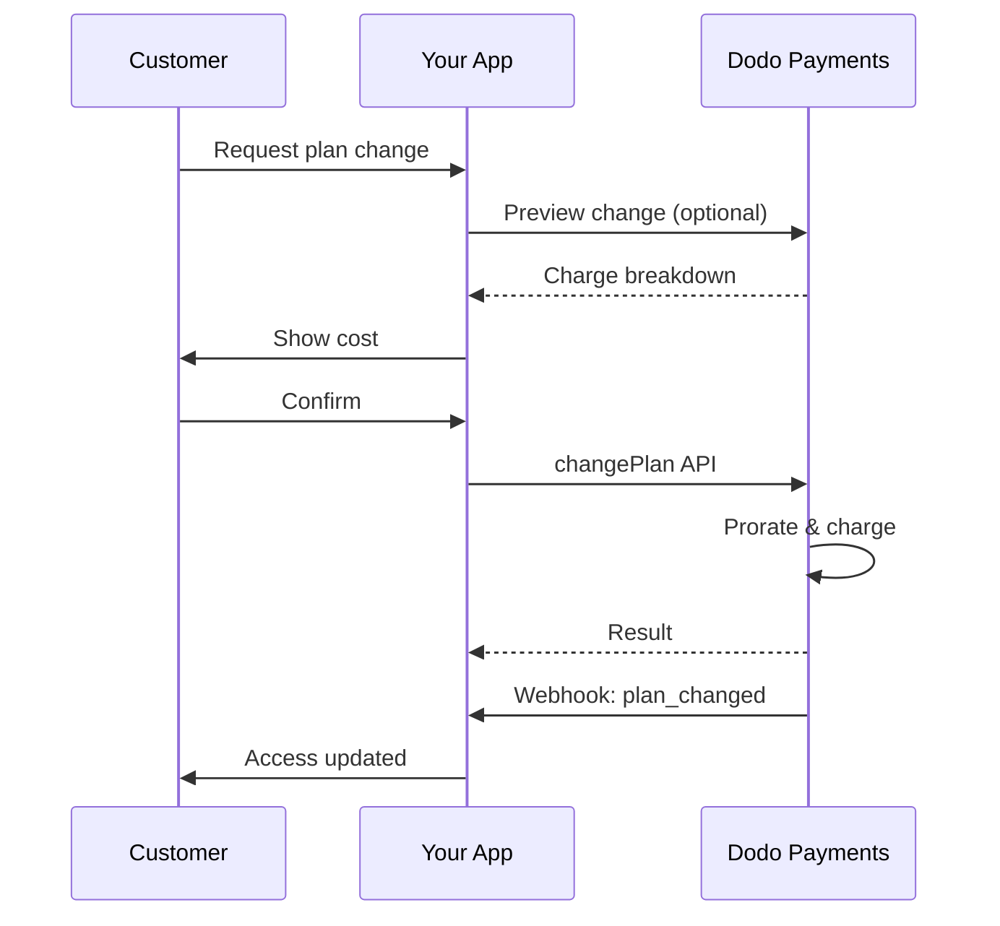
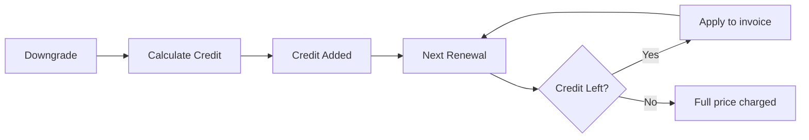
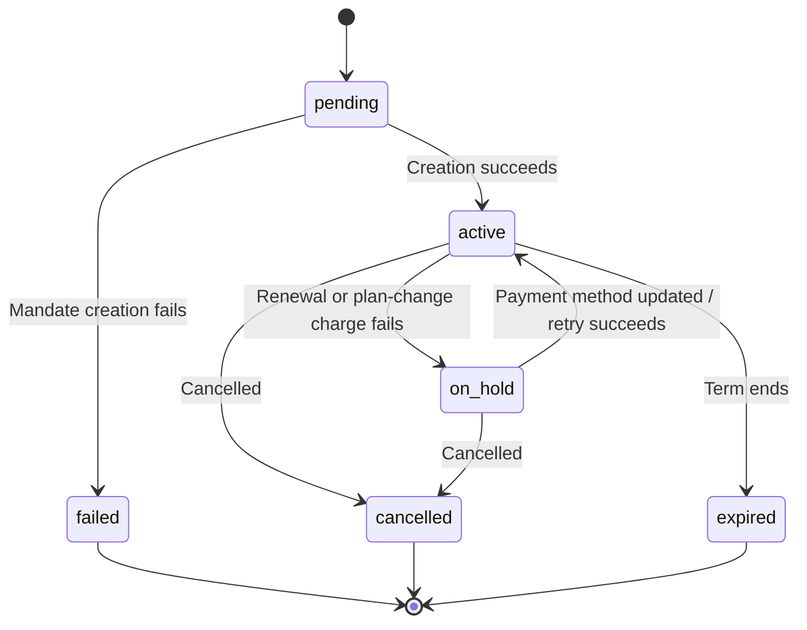

<Info>
सब्सक्रिप्शन आपको automated renewals के साथ निरंतर access बेचने की सुविधा देते हैं। प्रत्येक customer के लिए pricing को अनुकूलित करने हेतु flexible billing cycles, free trials, plan changes और add-ons का उपयोग करें।
</Info>

<CardGroup cols={2}>
<Card title="Upgrade & Downgrade" icon="repeat" href="/developer-resources/subscription-upgrade-downgrade">
Proration और quantity updates के साथ plan changes नियंत्रित करें।
</Card>

<Card title="On‑Demand Subscriptions" icon="bolt" href="/developer-resources/ondemand-subscriptions">
अभी mandate authorize करें और custom amounts के साथ बाद में charge करें।
</Card>

<Card title="Customer Portal" icon="id-card" href="/features/customer-portal">
Customers को plans, billing और cancellations manage करने दें।
</Card>

<Card title="Subscription Webhooks" icon="code" href="/developer-resources/webhooks/intents/subscription">
created, renewed और canceled जैसे lifecycle events पर प्रतिक्रिया दें।
</Card>
</CardGroup>

## सब्सक्रिप्शन क्या हैं?

सब्सक्रिप्शन recurring products होते हैं जिन्हें customers किसी schedule के अनुसार खरीदते हैं। ये इनके लिए आदर्श हैं:

- **SaaS licenses**: Apps, APIs या platform access
- **Memberships**: Communities, programs या clubs
- **Digital content**: Courses, media या premium content
- **Support plans**: SLAs, success packages या maintenance

## मुख्य लाभ

- **Predictable revenue**: Automated renewals के साथ recurring billing
- **Flexible cycles**: Monthly, annual, custom intervals और trials
- **Plan agility**: Upgrades और downgrades के लिए proration
- **Add-ons और seats**: Optional, quantifiable upgrades जोड़ें
- **Seamless checkout**: Hosted checkout और customer portal
- **Developer-first**: Creation, changes और usage tracking के लिए स्पष्ट APIs

## सब्सक्रिप्शन बनाना

अपने Dodo Payments dashboard में subscription products बनाएं, फिर उन्हें checkout या अपने API के माध्यम से बेचें। Products को active subscriptions से अलग रखने पर आप pricing के versions बना सकते हैं, add-ons जोड़ सकते हैं और performance को स्वतंत्र रूप से track कर सकते हैं।

### Subscription product creation

अपने subscription की बिक्री, renewal और billing निर्धारित करने के लिए dashboard में fields configure करें। नीचे दिए गए sections creation form में दिखाई देने वाली चीज़ों से सीधे संबंधित हैं।

#### Product details

- **Product Name** (required): Checkout, customer portal और invoices में दिखाई देने वाला display name।
- **Product Description** (required): Checkout और invoices में दिखाई देने वाला स्पष्ट value statement।
- **Product Image** (required): 3 MB तक PNG/JPG/WebP। Checkout और invoices पर उपयोग किया जाता है।
- **Brand**: Theming और emails के लिए product को किसी specific brand से associate करें।
- **Tax Category** (required): Tax rules निर्धारित करने के लिए category (उदाहरण के लिए, SaaS) चुनें।

<Tip>
प्रत्येक region में सही tax collection सुनिश्चित करने के लिए सबसे सटीक tax category चुनें।
</Tip>

#### Pricing

- **Pricing Type**: <b>Subscription</b> चुनें (यह guide)। Alternatives हैं Single Payment और Usage Based Billing।
- **Price** (required): Currency के साथ base recurring price। Price कम से कम **$1** (या आपकी चुनी हुई currency में उसके equivalent) होना चाहिए। इस minimum से कम amounts supported नहीं हैं और subscription काम नहीं करेगा।
- **Discount Applicable (%)**: Base price पर लागू होने वाला optional percentage discount; checkout और invoices में दिखाई देता है।
- **Repeat payment every** (required): Renewals के लिए interval, जैसे हर 1 Month। Cadence (months या years) और quantity चुनें।
- **Subscription Period** (required): वह total term जिसके दौरान subscription active रहता है (जैसे, 10 Years)। यह अवधि समाप्त होने के बाद, extend न किए जाने पर renewals रुक जाते हैं।
- **Trial Period Days** (required): Trial की अवधि दिनों में निर्धारित करें। Trials disable करने के लिए 0 का उपयोग करें। Trial समाप्त होने पर पहला charge automatically होता है।
- **Select add‑on**: Customers द्वारा base plan के साथ खरीदे जा सकने वाले अधिकतम 10 add-ons जोड़ें।

<Warning>
Active product की pricing बदलने से नई purchases प्रभावित होती हैं। Existing subscriptions आपकी plan-change और proration settings का पालन करती हैं।
</Warning>

<Info>
Add-ons seats या storage जैसे quantifiable extras के लिए आदर्श हैं। Customers द्वारा इन्हें बदलने पर आप allowed quantities और proration behavior नियंत्रित कर सकते हैं।
</Info>

#### Advanced settings

- **Tax Inclusive Pricing**: लागू taxes सहित prices display करें। Final tax calculation customer location के अनुसार अलग हो सकता है।
- **Generate license keys**: Purchase के बाद प्रत्येक customer को एक unique key जारी करें। <a href="/features/license-keys">License Keys</a> guide देखें।
- **Digital Product Delivery**: Purchase के बाद files या content automatically deliver करें। <a href="/features/digital-product-delivery">Digital Product Delivery</a> में अधिक जानें।
- **Metadata**: Internal tagging या client integrations के लिए custom key–value pairs जोड़ें। <a href="/api-reference/metadata">Metadata</a> देखें।

<Tip>
अपने system के identifiers (जैसे, accountId) store करने के लिए metadata का उपयोग करें, ताकि बाद में events और invoices का reconciliation कर सकें।
</Tip>

## Subscription Trials

Trials customers को immediate payment के बिना subscriptions access करने देते हैं। Trial समाप्त होने पर पहला charge automatically होता है।

### Trials configure करना

Product pricing section में **Trial Period Days** set करें (disable करने के लिए `0` का उपयोग करें)। Subscriptions बनाते समय इसे override किया जा सकता है:

```typescript
// Via subscription creation
const subscription = await client.subscriptions.create({
  customer_id: 'cus_123',
  product_id: 'prod_monthly',
  trial_period_days: 14  // Overrides product's trial period
});

// Via checkout session
const session = await client.checkoutSessions.create({
  product_cart: [{ product_id: 'prod_monthly', quantity: 1 }],
  subscription_data: { trial_period_days: 14 }
});
```

<Warning>
`trial_period_days` value 0 से 10,000 दिनों के बीच होना चाहिए।
</Warning>

### Trial status पहचानना

<Warning>
वर्तमान में trial status detect करने के लिए कोई direct field नहीं है। निम्न workaround में payments query करनी पड़ती है, जो inefficient है। हम अधिक efficient solution पर काम कर रहे हैं।
</Warning>

यह निर्धारित करने के लिए कि कोई subscription trial में है या नहीं, उस subscription के payments की list retrieve करें। यदि amount 0 वाला ठीक एक payment है, तो subscription trial period में है:

```typescript
const subscription = await client.subscriptions.retrieve('sub_123');
const payments = await client.payments.list({
  subscription_id: subscription.subscription_id
});

// Check if subscription is in trial
const isInTrial = payments.items.length === 1 && 
                  payments.items[0].total_amount === 0;
```

### Trial Period update करना

`next_billing_date` को update करके trial extend करें:

```typescript
await client.subscriptions.update('sub_123', {
  next_billing_date: '2025-02-15T00:00:00Z'  // New trial end date
});
```

<Warning>
आप `next_billing_date` को past time पर set नहीं कर सकते। Date future में होनी चाहिए।
</Warning>

## Subscription Plan Changes

Plan changes आपको subscriptions upgrade या downgrade करने, quantities adjust करने या different products पर migrate करने देते हैं। आपके चुने हुए proration mode के आधार पर, change से immediate charge लग सकता है, credit बन सकता है या कोई billing adjustment लागू नहीं हो सकता।

<Tip>
आप Dodo Payments dashboard से सीधे subscription plans बदल सकते हैं और अगली billing date update कर सकते हैं। इससे customer support requests, promotional upgrades या plan migrations के लिए API calls किए बिना subscriptions adjust करने का तेज़ तरीका मिलता है।
</Tip>

<Tip>
**Self-service plan changes enable करें:** क्या आप चाहते हैं कि customers अपने subscriptions को Customer Portal के माध्यम से स्वयं upgrade या downgrade करें? अपने subscription products को Product Collection में जोड़ें और Subscription Settings में "Allow Subscription Updates" enable करें।
</Tip>



<Card title="Product Collections" icon="layer-group" href="/features/product-collections">
  Customer Portal में seamless upgrade/downgrade paths enable करने के लिए related products को collections में group करें।
</Card>

### Proration Modes

Plans बदलते समय customers को कैसे bill किया जाए, यह चुनें:

<Info>
**चारों proration modes की त्वरित तुलना:**

| | `prorated_immediately` | `difference_immediately` | `full_immediately` | `do_not_bill` |
|---|---|---|---|---|
| **Upgrade** | शेष दिनों के लिए prorated charge | पूरा price difference charge | नए plan की पूरी price charge | कोई charge नहीं — तुरंत switch |
| **Downgrade** | शेष दिनों के लिए prorated credit | पूरा price difference credit के रूप में | कोई credit नहीं, पूरा charge | कोई credit नहीं — तुरंत switch |
| **Billing cycle** | आज पर reset | आज पर reset | आज पर reset | वही रहता है |
| **Best for** | Fair time-based billing | Simple tier changes | Billing cycle resets | Free migrations या courtesy switches |
</Info>

#### `prorated_immediately`
Current billing cycle में बचे समय के आधार पर prorated amount charge करता है। Unused time को ध्यान में रखने वाली fair billing के लिए सबसे अच्छा।

```typescript
await client.subscriptions.changePlan('sub_123', {
  product_id: 'prod_pro',
  quantity: 1,
  proration_billing_mode: 'prorated_immediately'
});
```

#### `difference_immediately`
Price difference तुरंत charge करता है (upgrade) या future renewals के लिए credit जोड़ता है (downgrade)। Simple upgrade/downgrade scenarios के लिए सबसे अच्छा।

```typescript
// Upgrade: charges $50 (difference between $30 and $80)
// Downgrade: credits remaining value, auto-applied to renewals
await client.subscriptions.changePlan('sub_123', {
  product_id: 'prod_pro',
  quantity: 1,
  proration_billing_mode: 'difference_immediately'
});
```

<Info>
`difference_immediately` का उपयोग करने वाले downgrades के credits subscription-scoped होते हैं और future renewals पर automatically apply होते हैं। ये <a href="/features/credit-based-billing">Credit-Based Billing</a> entitlements से अलग हैं।
</Info>

जब कोई customer `difference_immediately` के साथ downgrade करता है, तो unused value subscription-scoped credit बन जाती है, जो future renewals को automatically offset करती है:



#### `full_immediately`
Remaining time को ignore करते हुए नए plan की पूरी amount तुरंत charge करता है। Billing cycles reset करने के लिए सबसे अच्छा।

```typescript
await client.subscriptions.changePlan('sub_123', {
  product_id: 'prod_monthly',
  quantity: 1,
  proration_billing_mode: 'full_immediately'
});
```

#### `do_not_bill`
किसी billing adjustment के बिना नए plan पर switch करता है। कोई proration charges या credits नहीं — customer बस नए plan पर चला जाता है। Courtesy migrations, free plan switches या ऐसे scenarios के लिए सबसे अच्छा, जहाँ आप cost difference स्वयं वहन करना चाहते हैं।

```typescript
await client.subscriptions.changePlan('sub_123', {
  product_id: 'prod_new_plan',
  quantity: 1,
  proration_billing_mode: 'do_not_bill'
});
```

<AccordionGroup>
<Accordion title="Example: Prorated upgrade calculation">

**Scenario**: Basic ($30/month) पर मौजूद customer, `prorated_immediately` का उपयोग करके 30-day cycle के day 16 पर Pro ($80/month) में upgrade करता है।

```
Unused credit from Basic = $30 × (15 remaining / 30 total) = $15.00
Prorated cost of Pro     = $80 × (15 remaining / 30 total) = $40.00
────────────────────────────────────────────────────────────────────
Immediate charge         = $40.00 − $15.00 = $25.00
```

अगला renewal **February 15** (January 16 + 30 days) पर: **$80.00/month**।

<Tip>
अधिक विस्तृत calculation examples और edge cases के लिए हमारी पूरी [Upgrade & Downgrade Guide](/developer-resources/subscription-upgrade-downgrade) देखें।
</Tip>

</Accordion>
<Accordion title="Example: Downgrade credit calculation">

**Scenario**: Pro ($80/month) पर मौजूद customer, `difference_immediately` का उपयोग करके Starter ($20/month) में downgrade करता है।

```
Credit = Old plan − New plan = $80 − $20 = $60.00
```

$60 credit future renewals पर automatically apply होता है:
- Renewal 1: $20 − $20 (credit) = **$0.00** ($40 credit remaining)
- Renewal 2: $20 − $20 (credit) = **$0.00** ($20 credit remaining)  
- Renewal 3: $20 − $20 (credit) = **$0.00** (credit समाप्त)
- Renewal 4: **$20.00** (full price)

<Info>
Credits manage करने के तरीके के बारे में [Upgrade & Downgrade Guide](/developer-resources/subscription-upgrade-downgrade) में अधिक जानें।
</Info>

</Accordion>
</AccordionGroup>

### Add-ons के साथ Plans बदलना

Plans बदलते समय add-ons modify करें। Add-ons proration calculations में शामिल होते हैं:

```typescript
await client.subscriptions.changePlan('sub_123', {
  product_id: 'prod_pro',
  quantity: 1,
  proration_billing_mode: 'difference_immediately',
  addons: [{ addon_id: 'addon_extra_seats', quantity: 2 }]  // Add add-ons
  // addons: []  // Empty array removes all existing add-ons
});
```

<Info>
Plan changes से immediate charges लगते हैं। Failed charges subscription को `on_hold` status में ले जा सकते हैं। `subscription.plan_changed` webhook events के माध्यम से changes track करें।
</Info>

### Plan Changes का Preview देखना

Plan change commit करने से पहले exact charge और resulting subscription का preview देखें:

```typescript
const preview = await client.subscriptions.previewChangePlan('sub_123', {
  product_id: 'prod_pro',
  quantity: 1,
  proration_billing_mode: 'prorated_immediately'
});

// Show customer the charge before confirming
console.log('You will be charged:', preview.immediate_charge.summary);
```

<Card title="Preview Change Plan API" icon="eye" href="/api-reference/subscriptions/preview-change-plan">
  Plan changes commit करने से पहले उनका preview देखें।
</Card>

## Subscription States

Subscription अपने lifetime के दौरान statuses के एक निर्धारित set से गुजरता है। यह table प्रत्येक status, उसके कारण और उसे recover करने के तरीके (या recovery संभव है या नहीं) के लिए reference है।

| Status | इसका अर्थ | Recoverable? | Recovery path / अगला step |
|--------|---------------|--------------|---------------------------|
| `pending` | Subscription बनाया या process किया जा रहा है | — | `subscription.active` (या `subscription.failed`) का wait करें |
| `active` | Subscription active है और automatically renew होगा | — | कोई action आवश्यक नहीं |
| `on_hold` | Renewal payment (या plan-change charge) fail हुआ; subscription paused है | **Yes** | Reactivate करने के लिए payment method update करें — [Payment Retries](/features/recovery/payment-retries) और [Dunning](/features/recovery/subscription-dunning) के माध्यम से automatically, या [Update Payment Method API](/api-reference/subscriptions/update-payment-method) के माध्यम से manually |
| `cancelled` | Subscription cancel हो चुका है और renew नहीं होगा | केवल re-purchase | Customer को नया subscription शुरू करना होगा; [Dunning](/features/recovery/subscription-dunning) re-purchase के लिए prompt कर सकता है |
| `failed` | Subscription **creation** fail हुआ (initial mandate या payment सफल नहीं हुआ) | **No — terminal** | Customer को working payment method के साथ नया subscription बनाना होगा |
| `expired` | Subscription अपनी term के अंत तक पहुँच गया | — | यदि आवश्यक हो तो customer को नया subscription शुरू करना होगा |

<Warning>
`on_hold` और `failed` को अक्सर भ्रमित किया जाता है। `on_hold` पहले से active subscription की renewal fail होने पर आने वाली **recoverable** state है। `failed` **terminal** state है, जो केवल **initial** subscription creation fail होने पर आती है — इसे reactivate नहीं किया जा सकता।
</Warning>

### State Machine



### On Hold State

Subscription `on_hold` state में तब जाता है जब:

- Renewal payment fail हो (insufficient funds, expired card आदि)
- Plan change charge fail हो
- Payment method authorization fail हो

<Warning>
जब subscription `on_hold` state में होता है, तो वह automatically renew नहीं होगा। Subscription reactivate करने के लिए आपको payment method update करना होगा।
</Warning>

### On Hold से Reactivate करना

Subscription को `on_hold` state से reactivate करने के लिए payment method update करें। यह automatically:

1. Remaining dues के लिए charge बनाता है
2. Invoice generate करता है
3. New payment method का उपयोग करके payment process करता है
4. Successful payment के बाद subscription को `active` state में reactivate करता है

```typescript
// Reactivate subscription from on_hold
const response = await client.subscriptions.updatePaymentMethod('sub_123', {
  payment_method: {
    type: 'new',
    return_url: 'https://example.com/return'
  }
});

// For on_hold subscriptions, a charge is automatically created
if (response.payment_id) {
  console.log('Charge created:', response.payment_id);
  // Redirect customer to response.payment_link to complete payment
  // Monitor webhooks for payment.succeeded and subscription.active
}
```

<Info>
`on_hold` subscription के लिए payment method सफलतापूर्वक update करने के बाद, आपको `payment.succeeded` और उसके बाद `subscription.active` webhook events प्राप्त होंगे।
</Info>

### Transition के अनुसार Webhook Events

प्रत्येक transition एक webhook emit करता है, ताकि polling के बिना entitlement logic चला सकें:

| Transition | Event |
|------------|-------|
| Subscription activated | `subscription.active` |
| Renewal succeeds | `subscription.renewed` |
| Renewal fails → paused | `subscription.on_hold` |
| Creation fails | `subscription.failed` |
| Plan upgraded/downgraded | `subscription.plan_changed` |
| Cancelled | `subscription.cancelled` |
| Term ended | `subscription.expired` |
| Any field changes | `subscription.updated` |

<Card title="Subscription Webhook Payloads" icon="webhook" href="/developer-resources/webhooks/intents/subscription">
Subscription lifecycle events के लिए full payload schema देखें।
</Card>

## API Management

<AccordionGroup>
<Accordion title="Create subscriptions">
Optional trials और add-ons के साथ products से programmatically subscriptions बनाने के लिए `POST /subscriptions` का उपयोग करें।

<Card title="API Reference" icon="code" href="/api-reference/subscriptions/post-subscriptions">
Create subscription API देखें।
</Card>
</Accordion>

<Accordion title="Update subscriptions">
Quantities update करने, अगली billing date पर cancel करने या metadata modify करने के लिए `PATCH /subscriptions/{id}` का उपयोग करें।

<Card title="API Reference" icon="code" href="/api-reference/subscriptions/patch-subscriptions">
Subscription details update करना सीखें।
</Card>
</Accordion>

<Accordion title="Change plans (proration)">
Proration controls के साथ active product और quantities बदलें।

<Card title="API Reference" icon="code" href="/api-reference/subscriptions/change-plan">
Plan change options की समीक्षा करें।
</Card>
</Accordion>

<Accordion title="On‑demand charges">
On-demand subscriptions के लिए specific amounts को on demand charge करें।

<Card title="API Reference" icon="code" href="/api-reference/subscriptions/create-charge">
On-demand subscription charge करें।
</Card>
</Accordion>

<Accordion title="List and retrieve">
सभी subscriptions list करने के लिए `GET /subscriptions` और किसी एक को retrieve करने के लिए `GET /subscriptions/{id}` का उपयोग करें।

<Card title="API Reference" icon="code" href="/api-reference/subscriptions/get-subscriptions">
Listing और retrieval APIs browse करें।
</Card>
</Accordion>

<Accordion title="Usage history">
Metered या hybrid pricing models के लिए recorded usage fetch करें।

<Card title="API Reference" icon="code" href="/api-reference/subscriptions/get-usage-history">
Usage history API देखें।
</Card>
</Accordion>

<Accordion title="Update payment method">
Subscription के लिए payment method update करें। Active subscriptions के लिए यह future renewals का payment method update करता है। `on_hold` state वाली subscriptions के लिए, यह remaining dues का charge बनाकर subscription को reactivate करता है।

नया payment-method link generate करते समय (`New` request type), आप `allowed_payment_method_types` pass करके उस page पर customer को दिखाई देने वाले payment methods सीमित कर सकते हैं। Customers को list में शामिल न किया गया कोई method कभी दिखाई नहीं देगा, हालांकि किसी method को शामिल करने से यह guarantee नहीं होती कि वह दिखाई देगा (availability अभी भी customer location और आपकी business settings जैसे factors पर निर्भर करती है)।

<Card title="API Reference" icon="code" href="/api-reference/subscriptions/update-payment-method">
Payment methods update करने और subscriptions reactivate करने का तरीका जानें।
</Card>
</Accordion>
</AccordionGroup>

## सामान्य Use Cases

- **SaaS और APIs**: Seats या usage के लिए add-ons के साथ tiered access
- **Content और media**: Introductory trials के साथ monthly access
- **B2B support plans**: Premium support add-ons वाले annual contracts
- **Tools और plugins**: License keys और versioned releases

## Integration Examples

### Checkout Sessions (subscriptions)
Checkout sessions बनाते समय अपना subscription product और optional add-ons शामिल करें:

```typescript
const session = await client.checkoutSessions.create({
  product_cart: [
    {
      product_id: 'prod_subscription',
      quantity: 1
    }
  ]
});
```

### Proration के साथ Plan changes
Subscription को upgrade या downgrade करें और proration behavior नियंत्रित करें:

```typescript
await client.subscriptions.changePlan('sub_123', {
  product_id: 'prod_new',
  quantity: 1,
  proration_billing_mode: 'difference_immediately'
});
```

### अगली billing date पर Cancel करना
ऐसा cancellation schedule करें जो current billing period के अंत में प्रभावी हो:

```typescript
await client.subscriptions.update('sub_123', {
  cancel_at_next_billing_date: true
});
```

### Subscription period extend करना
`subscription_period_count` और `subscription_period_interval` को `PATCH /subscriptions/{id}` में pass करके subscription के चलने की अवधि बढ़ाएं। नए count और interval से subscription की expiry फिर से calculate होती है — उदाहरण के लिए, customer को उसके current plan पर अतिरिक्त समय देने के लिए:

```typescript
await client.subscriptions.update('sub_123', {
  subscription_period_count: 5,
  subscription_period_interval: 'Month'
});
```

<Note>
Subscription की period केवल **बढ़ाई** जा सकती है, कभी कम नहीं की जा सकती।
</Note>

### On-demand subscriptions
On-demand subscription बनाएं और आवश्यकता के अनुसार बाद में charge करें:

```typescript
const onDemand = await client.subscriptions.create({
  customer_id: 'cus_123',
  product_id: 'prod_on_demand',
  on_demand: { mandate_only: true }
});

await client.subscriptions.charge(onDemand.id, {
  product_price: 4900,
  product_currency: 'USD',
  product_description: 'Extra usage for September'
});
```

### Active subscription के लिए Payment method update करना
Active subscription का payment method update करें:

```typescript
// Update with new payment method
const response = await client.subscriptions.updatePaymentMethod('sub_123', {
  payment_method: {
    type: 'new',
    return_url: 'https://example.com/return'
  }
});

// Or use existing payment method
await client.subscriptions.updatePaymentMethod('sub_123', {
  payment_method: {
    type: 'existing',
    payment_method_id: 'pm_abc123'
  }
});
```

### on_hold से Subscription reactivate करना
Failed payment के कारण on hold हुई subscription को reactivate करें:

```typescript
// Update payment method - automatically creates charge for remaining dues
const response = await client.subscriptions.updatePaymentMethod('sub_123', {
  payment_method: {
    type: 'new',
    return_url: 'https://example.com/return'
  }
});

if (response.payment_id) {
  // Charge created for remaining dues
  // Redirect customer to response.payment_link
  // Monitor webhooks: payment.succeeded → subscription.active
}
```

## RBI-Compliant Mandates के साथ Subscriptions

  UPI और Indian card subscriptions RBI (Reserve Bank of India) regulations के अंतर्गत specific mandate requirements के साथ operate करती हैं:

  ### Mandate Limits

  Mandate type और amount आपकी subscription के recurring charge पर निर्भर करते हैं:

  - **Mandate floor से कम charges (default ₹15,000):** हम floor amount के लिए on-demand mandate बनाते हैं। Subscription amount आपकी subscription frequency के अनुसार periodically charge होता है, mandate limit तक।
  - **Mandate floor के बराबर या उससे अधिक charges:** हम exact subscription amount के लिए subscription mandate (या on-demand mandate) बनाते हैं।

  Mandate floor को प्रति merchant या प्रति request `mandate_min_amount_inr_paise` (INR paise) के माध्यम से configure किया जा सकता है। Bank में registered amount `max(mandate_floor, billing_amount)` है — इसलिए billing कम होने पर floor effectively customer-facing authorization ceiling बन जाता है।

RBI-compliant mandates और Indian payment methods के लिए configurable mandate floor की विस्तृत जानकारी हेतु <a href="/features/payment-methods/india#configurable-mandate-floor">India Payment Methods</a> page देखें।

  ### Upgrade और Downgrade Considerations

  **महत्वपूर्ण:** Subscriptions upgrade या downgrade करते समय mandate limits पर सावधानी से विचार करें:

  - यदि upgrade/downgrade से ऐसा charge amount बनता है जो Rs 15,000 से अधिक है और existing on-demand payment limit से भी अधिक है, तो transaction charge fail हो सकता है।
  - ऐसे मामलों में customer को अपना payment method update करना या subscription को फिर से बदलना पड़ सकता है, ताकि सही limit वाला नया mandate बनाया जा सके।

  ### High-Value Charges के लिए Authorization

  Rs 15,000 या उससे अधिक के subscription charges के लिए:

  - Customer के bank द्वारा transaction authorize करने के लिए prompt किया जाएगा।
  - यदि customer transaction authorize नहीं करता है, तो transaction fail हो जाएगा और subscription on hold कर दी जाएगी।

  ### 48-Hour Processing Delay

  **Processing Timeline:** Indian cards और UPI subscriptions पर recurring charges एक unique processing pattern का पालन करते हैं:

  - Charges आपकी subscription frequency के अनुसार scheduled date पर **initiated** होते हैं।
  - Customer के account से actual **deduction** payment initiation के **48 hours** बाद ही होती है।
  - Bank API responses के आधार पर यह 48-hour window **2-3 additional hours** तक बढ़ सकती है।

  ### Mandate Cancellation Window

  48-hour processing window के दौरान:

  - Customers अपने banking apps के माध्यम से mandate cancel कर सकते हैं।
  - यदि customer इस अवधि में mandate cancel करता है, तो subscription **active** रहेगी (यह Indian card और UPI AutoPay subscriptions से संबंधित एक edge case है)।
  - हालांकि, actual deduction fail हो सकती है और उस स्थिति में हम subscription को **on hold** कर देंगे।

  **Edge Case Handling:** यदि charge initiation के तुरंत बाद आप customers को benefits, credits या subscription usage देते हैं, तो आपको अपने application में इस 48-hour window को उचित रूप से handle करना होगा। इन बातों पर विचार करें:

  - Payment confirmation तक benefit activation delay करना
  - Grace periods या temporary access लागू करना
  - Mandate cancellations के लिए subscription status monitor करना
  - अपने application logic में subscription hold states handle करना

  <Tip>
  Payment status changes track करने और 48-hour window के दौरान mandates cancel होने वाले edge cases handle करने के लिए subscription webhooks monitor करें।
  </Tip>

## Best Practices

- **Clear tiers से शुरुआत करें**: स्पष्ट differences वाले 2–3 plans
- **Pricing communicate करें**: Totals, proration और next renewal दिखाएं
- **Trials का सोच-समझकर उपयोग करें**: केवल समय के आधार पर नहीं, onboarding के साथ convert करें
- **Add-ons का लाभ उठाएं**: Base plans सरल रखें और extras upsell करें
- **Changes test करें**: Test mode में plan changes और proration validate करें

<Info>
Subscriptions recurring revenue के लिए एक flexible foundation हैं। सरल शुरुआत करें, अच्छी तरह test करें और adoption, churn तथा expansion metrics के आधार पर iterate करें।
</Info>