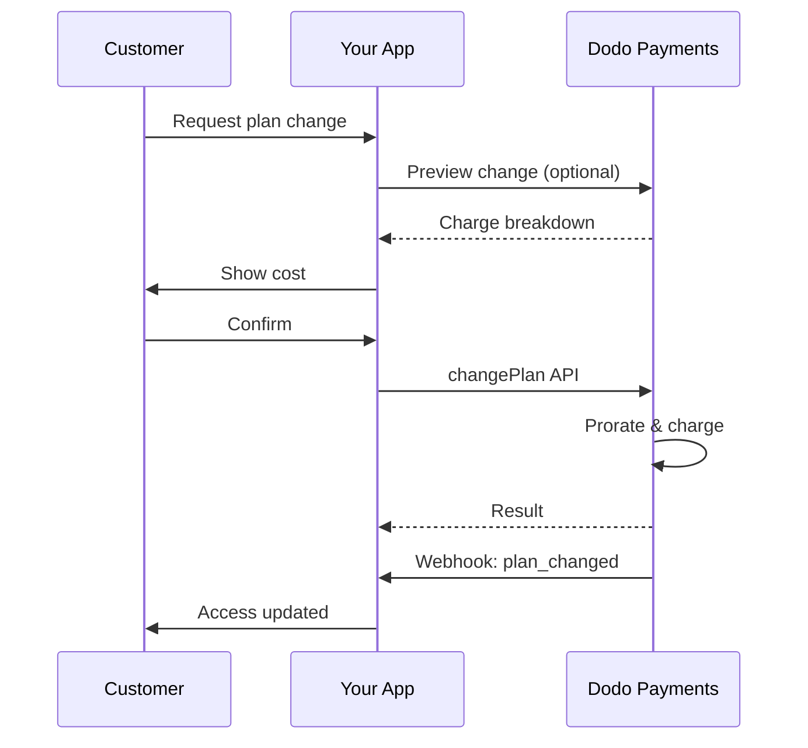
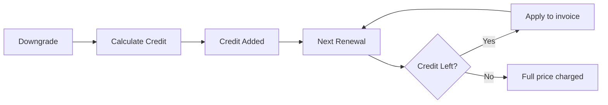

<Info>
सदस्यताएँ आपको स्वचालित नवीनीकरण के साथ निरंतर पहुंच बेचने देती हैं। प्रत्येक ग्राहक के लिए मूल्य निर्धारण को अनुकूलित करने के लिए लचीले बिलिंग चक्र, मुफ्त परीक्षण, योजना परिवर्तन और ऐड-ऑन का उपयोग करें।
</Info>

<CardGroup cols={2}>
<Card title="अपग्रेड और डाउनग्रेड" icon="repeat" href="/developer-resources/subscription-upgrade-downgrade">
प्रोरशन और मात्रा अपडेट के साथ योजना परिवर्तनों को नियंत्रित करें।
</Card>

<Card title="डिमांड पर सदस्यताएँ" icon="bolt" href="/developer-resources/ondemand-subscriptions">
अब एक जनादेश अधिकृत करें और बाद में कस्टम राशि के साथ शुल्क लें।
</Card>

<Card title="ग्राहक पोर्टल" icon="id-card" href="/features/customer-portal">
ग्राहकों को योजनाओं, बिलिंग और रद्दीकरण को प्रबंधित करने दें।
</Card>

<Card title="सदस्यता वेबहुक" icon="code" href="/developer-resources/webhooks/intents/subscription">
निर्मित, नवीनीकरण, और रद्द किए गए जैसे जीवन चक्र घटनाओं पर प्रतिक्रिया करें।
</Card>
</CardGroup>

## सदस्यताएँ क्या हैं?

सदस्यताएँ आवर्ती उत्पाद हैं जिन्हें ग्राहक एक कार्यक्रम पर खरीदते हैं। ये निम्नलिखित के लिए आदर्श हैं:

- **SaaS लाइसेंस**: ऐप्स, APIs, या प्लेटफ़ॉर्म पहुंच
- **सदस्यताएँ**: समुदाय, कार्यक्रम, या क्लब
- **डिजिटल सामग्री**: पाठ्यक्रम, मीडिया, या प्रीमियम सामग्री
- **समर्थन योजनाएँ**: SLA, सफलता पैकेज, या रखरखाव

## प्रमुख लाभ

- **पूर्वानुमानित राजस्व**: स्वचालित नवीनीकरण के साथ आवर्ती बिलिंग
- **लचीले चक्र**: मासिक, वार्षिक, कस्टम अंतराल, और परीक्षण
- **योजना चपलता**: अपग्रेड और डाउनग्रेड के लिए प्रोरशन
- **ऐड-ऑन और सीटें**: वैकल्पिक, मात्रात्मक अपग्रेड संलग्न करें
- **सहज चेकआउट**: होस्टेड चेकआउट और ग्राहक पोर्टल
- **डेवलपर-प्रथम**: निर्माण, परिवर्तन, और उपयोग ट्रैकिंग के लिए स्पष्ट APIs

## सदस्यताएँ बनाना

अपने डोडो पेमेंट्स डैशबोर्ड में सदस्यता उत्पाद बनाएं, फिर उन्हें चेकआउट या अपने API के माध्यम से बेचें। सक्रिय सदस्यताओं से उत्पादों को अलग करना आपको मूल्य निर्धारण को संस्करणित करने, ऐड-ऑन संलग्न करने, और प्रदर्शन को स्वतंत्र रूप से ट्रैक करने की अनुमति देता है।

### सदस्यता उत्पाद निर्माण

डैशबोर्ड में फ़ील्ड कॉन्फ़िगर करें ताकि यह परिभाषित किया जा सके कि आपकी सदस्यता कैसे बेची जाती है, नवीनीकरण होती है, और बिल की जाती है। नीचे के अनुभाग सीधे निर्माण फ़ॉर्म में जो आप देखते हैं, से मेल खाते हैं।

#### उत्पाद विवरण

- **उत्पाद नाम** (आवश्यक): चेकआउट, ग्राहक पोर्टल, और चालानों में प्रदर्शित नाम।
- **उत्पाद विवरण** (आवश्यक): एक स्पष्ट मूल्य वक्तव्य जो चेकआउट और चालानों में दिखाई देता है।
- **उत्पाद छवि** (आवश्यक): PNG/JPG/WebP 3 MB तक। चेकआउट और चालानों पर उपयोग किया जाता है।
- **ब्रांड**: थीमिंग और ईमेल के लिए उत्पाद को एक विशिष्ट ब्रांड से जोड़ें।
- **कर श्रेणी** (आवश्यक): कर नियम निर्धारित करने के लिए श्रेणी चुनें (उदाहरण के लिए, SaaS)।

<Tip>
सुनिश्चित करें कि सही कर संग्रह के लिए सबसे सटीक कर श्रेणी का चयन करें।
</Tip>

#### मूल्य निर्धारण

- **मूल्य निर्धारण प्रकार**: <b>सदस्यता</b> चुनें (यह गाइड)। विकल्प हैं एकल भुगतान और उपयोग आधारित बिलिंग।
- **मूल्य** (आवश्यक): मुद्रा के साथ आधार आवर्ती मूल्य।
- **छूट लागू (%)**: आधार मूल्य पर लागू वैकल्पिक प्रतिशत छूट; चेकआउट और चालानों में दर्शाई गई।
- **हर** (आवश्यक): नवीनीकरण के लिए अंतराल, जैसे, हर 1 महीना। ताल (महीने या वर्ष) और मात्रा चुनें।
- **सदस्यता अवधि** (आवश्यक): कुल अवधि जिसके लिए सदस्यता सक्रिय रहती है (जैसे, 10 वर्ष)। इस अवधि के समाप्त होने के बाद, नवीनीकरण रुक जाते हैं जब तक कि इसे बढ़ाया न जाए।
- **परीक्षण अवधि दिन** (आवश्यक): दिनों में परीक्षण की लंबाई सेट करें। परीक्षणों को अक्षम करने के लिए 0 का उपयोग करें। पहली चार्ज स्वचालित रूप से तब होती है जब परीक्षण समाप्त होता है।
- **ऐड-ऑन चुनें**: 10 तक के ऐड-ऑन संलग्न करें जिन्हें ग्राहक आधार योजना के साथ खरीद सकते हैं।

<Warning>
एक सक्रिय उत्पाद पर मूल्य परिवर्तन नए खरीद पर प्रभाव डालता है। मौजूदा सदस्यताएँ आपकी योजना-परिवर्तन और प्रोरशन सेटिंग्स का पालन करती हैं।
</Warning>

<Info>
ऐड-ऑन ऐसे मात्रात्मक अतिरिक्त के लिए आदर्श हैं जैसे सीटें या भंडारण। आप ग्राहकों द्वारा उन्हें बदलने पर अनुमत मात्राओं और प्रोरशन व्यवहार को नियंत्रित कर सकते हैं।
</Info>

#### उन्नत सेटिंग्स

- **कर समावेशी मूल्य निर्धारण**: लागू करों सहित मूल्य प्रदर्शित करें। अंतिम कर गणना अभी भी ग्राहक के स्थान के अनुसार भिन्न होती है।
- **लाइसेंस कुंजी उत्पन्न करें**: प्रत्येक ग्राहक को खरीद के बाद एक अद्वितीय कुंजी जारी करें। <a href="/features/license-keys">लाइसेंस कुंजी</a> गाइड देखें।
- **डिजिटल उत्पाद वितरण**: खरीद के बाद फ़ाइलें या सामग्री स्वचालित रूप से वितरित करें। <a href="/features/digital-product-delivery">डिजिटल उत्पाद वितरण</a> में और जानें।
- **मेटाडेटा**: आंतरिक टैगिंग या क्लाइंट एकीकरण के लिए कस्टम कुंजी-मूल्य जोड़े। <a href="/api-reference/metadata">मेटाडेटा</a> देखें।

<Tip>
अपने सिस्टम से पहचानकर्ताओं (जैसे, accountId) को स्टोर करने के लिए मेटाडेटा का उपयोग करें ताकि आप बाद में घटनाओं और चालानों का मिलान कर सकें।
</Tip>

## सदस्यता परीक्षण

परीक्षण ग्राहकों को बिना तत्काल भुगतान के सदस्यताओं तक पहुंच प्रदान करते हैं। पहली चार्ज स्वचालित रूप से तब होती है जब परीक्षण समाप्त होता है।

### परीक्षण कॉन्फ़िगर करना

**प्रोडक्ट प्राइसिंग** सेक्शन में **Trial Period Days** सेट करें (निष्क्रिय करने के लिए `0` का उपयोग करें)। आप इसे सदस्यता बनाते समय अधिलेखित कर सकते हैं:

```typescript
// Via subscription creation
const subscription = await client.subscriptions.create({
  customer_id: 'cus_123',
  product_id: 'prod_monthly',
  trial_period_days: 14  // Overrides product's trial period
});

// Via checkout session
const session = await client.checkoutSessions.create({
  product_cart: [{ product_id: 'prod_monthly', quantity: 1 }],
  subscription_data: { trial_period_days: 14 }
});
```

<Warning>
`trial_period_days` मान 0 से 10,000 दिनों के बीच होना चाहिए।
</Warning>

### परीक्षण स्थिति का पता लगाना

<Warning>
वर्तमान में, परीक्षण स्थिति का पता लगाने के लिए कोई सीधा फ़ील्ड नहीं है। निम्नलिखित एक वर्कअराउंड है जिसे भुगतान को क्वेरी करने की आवश्यकता है, जो अप्रभावी है। हम एक अधिक प्रभावी समाधान पर काम कर रहे हैं।
</Warning>

यह निर्धारित करने के लिए कि क्या सदस्यता परीक्षण में है, सदस्यता के लिए भुगतान की सूची प्राप्त करें। यदि एक ही भुगतान है जिसकी राशि 0 है, तो सदस्यता परीक्षण अवधि में है:

```typescript
const subscription = await client.subscriptions.retrieve('sub_123');
const payments = await client.payments.list({
  subscription_id: subscription.subscription_id
});

// Check if subscription is in trial
const isInTrial = payments.items.length === 1 && 
                  payments.items[0].total_amount === 0;
```

### परीक्षण अवधि को अपडेट करना

`next_billing_date` को अपडेट करके ट्रायल का विस्तार करें:

```typescript
await client.subscriptions.update('sub_123', {
  next_billing_date: '2025-02-15T00:00:00Z'  // New trial end date
});
```

<Warning>
आप `next_billing_date` को अतीत के समय पर सेट नहीं कर सकते। तारीख भविष्य में होनी चाहिए।
</Warning>

## सदस्यता योजना परिवर्तन

योजना परिवर्तन आपको सदस्यताओं को अपग्रेड या डाउनग्रेड करने, मात्राएँ समायोजित करने, या विभिन्न उत्पादों में माइग्रेट करने की अनुमति देते हैं। प्रत्येक परिवर्तन आपके द्वारा चुने गए प्रोरशन मोड के आधार पर तत्काल शुल्क को ट्रिगर करता है।

<Tip>
आप Dodo Payments डैशबोर्ड से सीधे सब्सक्रिप्शन योजनाओं को बदल सकते हैं और अगली बिलिंग तिथि को अपडेट कर सकते हैं। यह ग्राहक सहायता अनुरोधों, प्रचारात्मक अपग्रेड, या योजना माइग्रेशन के लिए सब्सक्रिप्शन को समायोजित करने का एक त्वरित तरीका प्रदान करता है, बिना API कॉल किए।
</Tip>

<Tip>
**स्व-सेवा प्लान परिवर्तन सक्षम करें:** क्या आप ग्राहकों को अपने सदस्यता को ग्राहक पोर्टल के माध्यम से अपग्रेड या डाउनग्रेड करने के लिए चाहते हैं? अपने सदस्यता उत्पादों को एक प्रोडक्ट कलेक्शन में जोड़ें और अपने सदस्यता सेटिंग्स में "सदस्यता अपडेट की अनुमति दें" सक्षम करें।
</Tip>



<Card title="प्रोडक्ट कलेक्शंस" icon="layer-group" href="/features/product-collections">
  संबंधित उत्पादों को कलेक्शन में समूहित करें ताकि ग्राहक पोर्टल में बिना किसी रुकावट के अपग्रेड/डाउनग्रेड किया जा सके।
</Card>

### प्रॉरेशन मोड्स

जब योजनाएँ बदलते समय ग्राहकों का बिल कैसे किया जाए, इसका चयन करें:

<Info>
**तीन प्रॉरेशन मोड्स की त्वरित तुलना:**

| | `prorated_immediately` | `difference_immediately` | `full_immediately` |
|---|---|---|---|
| **अपग्रेड** | शेष दिनों के लिए प्रॉरेटेड चार्ज | पूर्ण मूल्य अंतर चार्ज किया जाएगा | पूर्ण नए योजना का मूल्य चार्ज किया जाएगा |
| **डाउनग्रेड** | शेष दिनों के लिए प्रॉरेटेड क्रेडिट | पूर्ण मूल्य अंतर के रूप में क्रेडिट | कोई क्रेडिट नहीं, पूर्ण चार्ज |
| **बिलिंग चक्र** | वही रहता है | वही रहता है | आज की तारीख पर रिसेट होता है |
| **सर्वश्रेष्ठ के लिए** | निष्पक्ष समय-आधारित बिलिंग | सरल स्तर परिवर्तन | बिलिंग चक्र रिसेट होता है |
</Info>

#### `prorated_immediately`
वर्तमान बिलिंग चक्र में शेष समय के आधार पर चार्ज की गई प्रॉरेटेड राशि। निष्पक्ष बिलिंग के लिए सबसे अच्छा जो उपयोग न किए गए समय को ध्यान में रखता है।

```typescript
await client.subscriptions.changePlan('sub_123', {
  product_id: 'prod_pro',
  quantity: 1,
  proration_billing_mode: 'prorated_immediately'
});
```

#### `difference_immediately`
तुरंत मूल्य अंतर चार्ज करता है (अपग्रेड) या भविष्य के नवीनीकरण के लिए क्रेडिट जोड़ता है (डाउनग्रेड)। सरल अपग्रेड/डाउनग्रेड परिदृश्यों के लिए सबसे अच्छा।

```typescript
// Upgrade: charges $50 (difference between $30 and $80)
// Downgrade: credits remaining value, auto-applied to renewals
await client.subscriptions.changePlan('sub_123', {
  product_id: 'prod_pro',
  quantity: 1,
  proration_billing_mode: 'difference_immediately'
});
```

<Info>
`difference_immediately` का उपयोग करके डाउनग्रेड से प्राप्त क्रेडिट सदस्यता-परिधि में होते हैं और भविष्य के नवीनीकरण पर स्वत: लागू होते हैं। ये <a href="/features/customer-credit">ग्राहक क्रेडिट</a> से भिन्न होते हैं।
</Info>

जब एक ग्राहक `difference_immediately` के साथ डाउनग्रेड करता है, तो अपर्याप्त मूल्य एक सदस्यता-परिधि क्रेडिट बन जाता है जो भविष्य के नवीनीकरण को स्वचालित रूप से ऑफ़सेट करता है:



#### `full_immediately`
पूर्ण नए योजना का मूल्य तुरंत चार्ज करता है, शेष समय की अनदेखी करता है। बिलिंग चक्र को रिसेट करने के लिए सबसे अच्छा।

```typescript
await client.subscriptions.changePlan('sub_123', {
  product_id: 'prod_monthly',
  quantity: 1,
  proration_billing_mode: 'full_immediately'
});
```

<AccordionGroup>
<Accordion title="उदाहरण: प्रॉरेटेड अपग्रेड गणना">

**परिदृश्य:** ग्राहक बेसिक ($30/महीना) से प्रो ($80/महीना) पर 30-दिन की चक्र के 16वें दिन `prorated_immediately` का उपयोग करके अपग्रेड करता है।

```
Unused credit from Basic = $30 × (15 remaining / 30 total) = $15.00
Prorated cost of Pro     = $80 × (15 remaining / 30 total) = $40.00
────────────────────────────────────────────────────────────────────
Immediate charge         = $40.00 − $15.00 = $25.00
```

मूल बिलिंग तिथि पर अगले नवीनीकरण: **$80.00/महीना**।

<Tip>
अधिक विस्तृत गणना उदाहरणों और छोर स्थितियों के लिए हमारी पूर्ण [अपग्रेड और डाउनग्रेड गाइड](/developer-resources/subscription-upgrade-downgrade) देखें।
</Tip>

</Accordion>
<Accordion title="उदाहरण: डाउनग्रेड क्रेडिट गणना">

**परिदृश्य:** ग्राहक प्रो ($80/महीना) से स्टार्ट ($20/महीना) को `difference_immediately` का उपयोग करके डाउनग्रेड करता है।

```
Credit = Old plan − New plan = $80 − $20 = $60.00
```

इस $60 क्रेडिट का स्वचालित रूप से भविष्य के नवीनीकरण पर लागू होगा:
- नवीनीकरण 1: $20 − $20 (क्रेडिट) = **$0.00** ($40 क्रेडिट शेष)
- नवीनीकरण 2: $20 − $20 (क्रेडिट) = **$0.00** ($20 क्रेडिट शेष)  
- नवीनीकरण 3: $20 − $20 (क्रेडिट) = **$0.00** (क्रेडिट समाप्त)
- नवीनीकरण 4: **$20.00** (पूर्ण मूल्य)

<Info>
जानें कि क्रेडिट को [अपग्रेड और डाउनग्रेड गाइड](/developer-resources/subscription-upgrade-downgrade) में कैसे प्रबंधित किया जाता है।
</Info>

</Accordion>
</AccordionGroup>

### ऐड-ऑन के साथ योजनाएँ बदलना

योजनाएँ बदलते समय ऐड-ऑन को संशोधित करें। ऐड-ऑन प्रॉरेशन गणनाओं में शामिल होते हैं:

```typescript
await client.subscriptions.changePlan('sub_123', {
  product_id: 'prod_pro',
  quantity: 1,
  proration_billing_mode: 'difference_immediately',
  addons: [{ addon_id: 'addon_extra_seats', quantity: 2 }]  // Add add-ons
  // addons: []  // Empty array removes all existing add-ons
});
```

<Info>
योजना परिवर्तन तात्कालिक शुल्क को प्रकट करते हैं। असफल शुल्क सदस्यता को `on_hold` स्थिति में ले जा सकते हैं। `subscription.plan_changed` वेबहुक घटनाओं के माध्यम से परिवर्तनों पर नज़र रखें।
</Info>

### योजना परिवर्तनों का पूर्वावलोकन

योजना परिवर्तन को प्रतिबद्ध करने से पहले, सटीक शुल्क और परिणामी सदस्यता को पूर्वावलोकन करें:

```typescript
const preview = await client.subscriptions.previewChangePlan('sub_123', {
  product_id: 'prod_pro',
  quantity: 1,
  proration_billing_mode: 'prorated_immediately'
});

// Show customer the charge before confirming
console.log('You will be charged:', preview.immediate_charge.summary);
```

<Card title="प्लान चेंज प्रीव्यू API" icon="eye" href="/api-reference/subscriptions/preview-change-plan">
  योजनाओं के परिवर्तन से पहले प्रीव्यू करें।
</Card>

## सदस्यता राज्यों

सदस्यता उनके जीवनकाल में विभिन्न राज्यों में हो सकती हैं:

- **`active`**: सदस्यता सक्रिय है और स्वचालित रूप से नवीनीकरण होगा
- **`on_hold`**: सदस्यता असफल भुगतान के कारण निलंबित है। फिर से सक्रिय करने के लिए भुगतान विधि अपडेट आवश्यक है
- **`cancelled`**: सदस्यता रद्द कर दी गई है और नवीनीकरण नहीं होगा
- **`expired`**: सदस्यता अपनी समाप्ति तिथि पर पहुँच गई है
- **`pending`**: सदस्यता बनाई जा रही है या प्रोसेस की जा रही है

### होल्ड स्थिति

एक सदस्यता `on_hold` स्थिति में प्रवेश करती है जब:

- एक नवीनीकरण भुगतान विफल होता है (पर्याप्त धन नहीं होने, समाप्त कार्ड, आदि)
- योजना परिवर्तन शुल्क विफल होता है
- भुगतान विधि प्राधिकरण विफल होती है

<Warning>
जब एक सदस्यता `on_hold` स्थिति में है, तो यह स्वचालित रूप से नवीनीकरण नहीं होगा। आपको सदस्यता को पुनः सक्रिय करने के लिए भुगतान विधि को अपडेट करना होगा।
</Warning>

### ऑन होल्ड से पुनः सक्रिय करना

`on_hold` स्थिति से सदस्यता को पुन: सक्रिय करने के लिए, भुगतान विधि को अपडेट करें। यह स्वत: रूप से:

1. बकाया के लिए एक शुल्क बनाता है
2. एक चालान बनाता है
3. नए भुगतान विधि का उपयोग करके भुगतान प्रोसेस करता है
4. सफल भुगतान के बाद `active` स्थिति में सदस्यता को पुनः सक्रिय करता है

```typescript
// Reactivate subscription from on_hold
const response = await client.subscriptions.updatePaymentMethod('sub_123', {
  type: 'new',
  return_url: 'https://example.com/return'
});

// For on_hold subscriptions, a charge is automatically created
if (response.payment_id) {
  console.log('Charge created:', response.payment_id);
  // Redirect customer to response.payment_link to complete payment
  // Monitor webhooks for payment.succeeded and subscription.active
}
```

<Info>
`on_hold` सदस्यता के लिए भुगतान विधि को सफलतापूर्वक अपडेट करने के बाद, आपको `payment.succeeded` द्वारा और फिर `subscription.active` वेबहुक घटनाएँ प्राप्त होंगी।
</Info>

## API प्रबंधन

<AccordionGroup>
<Accordion title="सदस्यताएँ बनाएं">
`POST /subscriptions` का उपयोग करके उत्पादों से प्रोग्रामेटिक रूप से सदस्यताएँ बनाएं, वैकल्पिक परीक्षणों और ऐड-ऑन के साथ।

<Card title="API संदर्भ" icon="code" href="/api-reference/subscriptions/post-subscriptions">
सदस्यता बनाने के लिए API देखें।
</Card>
</Accordion>

<Accordion title="सदस्यताएँ अपडेट करें">
को quantitiयोगताओं को अपडेट करने, अगली बिलिंग तारीख पर रद्द करने, या मेटाडेटा को संशोधित करने के लिए `PATCH /subscriptions/{id}` का उपयोग करें।

<Card title="API संदर्भ" icon="code" href="/api-reference/subscriptions/patch-subscriptions">
सदस्यता विवरण को अपडेट करने के लिए जानें।
</Card>
</Accordion>

<Accordion title="योजनाएँ बदलें (प्रॉरेशन)">
प्रॉरेशन नियंत्रण के साथ सक्रिय उत्पाद और मात्राएँ बदलें।

<Card title="API संदर्भ" icon="code" href="/api-reference/subscriptions/change-plan">
योजना परिवर्तन विकल्प की समीक्षा करें।
</Card>
</Accordion>

<Accordion title="ऑन-डिमांड चार्जेस">
ऑन-डिमांड सदस्यताओं के लिए, मांग पर विशेष राशि चार्ज करें।

<Card title="API संदर्भ" icon="code" href="/api-reference/subscriptions/create-charge">
एक ऑन-डिमांड सदस्यता चार्ज करें।
</Card>
</Accordion>

<Accordion title="सूची और पुनः प्राप्त करें">
सभी सदस्यताओं की सूची के लिए `GET /subscriptions` का उपयोग करें और एक को पुनः प्राप्त करने के लिए `GET /subscriptions/{id}` का उपयोग करें।

<Card title="API संदर्भ" icon="code" href="/api-reference/subscriptions/get-subscriptions">
सूची और पुनः प्राप्त करने वाले API का ब्राउज़र करें।
</Card>
</Accordion>

<Accordion title="उपयोग इतिहास">
मीटर या हाइब्रिड मूल्य निर्धारण मॉडलों के लिए रिकॉर्डेड उपयोग को फ़ेच करें।

<Card title="API संदर्भ" icon="code" href="/api-reference/subscriptions/get-usage-history">
उपयोग इतिहास API देखें।
</Card>
</Accordion>

<Accordion title="भुगतान विधि अपडेट करें">
एक सदस्यता के लिए भुगतान विधि को अपडेट करें। सक्रिय सदस्यताओं के लिए, यह भविष्य के नवीनीकरण के लिए भुगतान विधि को अपडेट करता है। `on_hold` स्थिति में सदस्यताओं के लिए, यह बकाया के शेष के लिए चार्ज बनाकर सदस्यता को पुनः सक्रिय करता है।

<Card title="API संदर्भ" icon="code" href="/api-reference/subscriptions/update-payment-method">
भुगतान विधियों को अपडेट करने और सदस्यताओं को पुनः सक्रिय करने के लिए जानें।
</Card>
</Accordion>
</AccordionGroup>

## सामान्य उपयोग के मामले

- **SaaS और APIs**: सीटों या उपयोग के लिए स्तरित पहुंच के साथ
- **सामग्री और मीडिया**: परिचयात्मक परीक्षणों के साथ मासिक पहुंच
- **B2B समर्थन योजनाएँ**: प्रीमियम समर्थन ऐड-ऑन के साथ वार्षिक अनुबंध
- **उपकरण और प्लगइन**: लाइसेंस की चाबियाँ और संस्करण जारी

## एकीकरण उदाहरण

### चेकआउट सत्र (सदस्यताएँ)
चेकआउट सत्र बनाते समय, अपने सदस्यता उत्पाद और वैकल्पिक ऐड-ऑन शामिल करें:

```typescript
const session = await client.checkoutSessions.create({
  product_cart: [
    {
      product_id: 'prod_subscription',
      quantity: 1
    }
  ]
});
```

### प्रॉरेशन के साथ योजना परिवर्तन
एक सदस्यता को अपग्रेड या डाउनग्रेड करें और प्रॉरेशन व्यवहार को नियंत्रित करें:

```typescript
await client.subscriptions.changePlan('sub_123', {
  product_id: 'prod_new',
  quantity: 1,
  proration_billing_mode: 'difference_immediately'
});
```

### अगली बिलिंग तिथि पर रद्द करें
एक रद्दीकरण निर्धारित करें जो वर्तमान बिलिंग अवधि के अंत में प्रभावी होता है:

```typescript
await client.subscriptions.update('sub_123', {
  cancel_at_next_billing_date: true
});
```

### ऑन-डिमांड सदस्यताएँ
एक ऑन-डिमांड सदस्यता बनाएँ और आवश्यकता के अनुसार चार्ज करें:

```typescript
const onDemand = await client.subscriptions.create({
  customer_id: 'cus_123',
  product_id: 'prod_on_demand',
  on_demand: true
});

await client.subscriptions.createCharge(onDemand.id, {
  amount: 4900,
  currency: 'USD',
  description: 'Extra usage for September'
});
```

### सक्रिय सदस्यता के लिए भुगतान विधि अपडेट करें
एक सक्रिय सदस्यता के लिए भुगतान विधि को अपडेट करें:

```typescript
// Update with new payment method
const response = await client.subscriptions.updatePaymentMethod('sub_123', {
  type: 'new',
  return_url: 'https://example.com/return'
});

// Or use existing payment method
await client.subscriptions.updatePaymentMethod('sub_123', {
  type: 'existing',
  payment_method_id: 'pm_abc123'
});
```

### ऑन होल्ड से सदस्यता पुनः सक्रिय करें
एक सदस्यता को पुनः सक्रिय करें जो असफल भुगतान के कारण होल्ड पर गई है:

```typescript
// Update payment method - automatically creates charge for remaining dues
const response = await client.subscriptions.updatePaymentMethod('sub_123', {
  type: 'new',
  return_url: 'https://example.com/return'
});

if (response.payment_id) {
  // Charge created for remaining dues
  // Redirect customer to response.payment_link
  // Monitor webhooks: payment.succeeded → subscription.active
}
```

## RBI-अनुरूप जनादेश के साथ सदस्यताएँ

  UPI और भारतीय कार्ड सदस्यताएँ RBI (भारतीय रिजर्व बैंक) नियमों के अंतर्गत विशेष जनादेश आवश्यकताओं के साथ काम करती हैं:

  ### जनादेश सीमाएँ

  जनादेश प्रकार और मात्रा आपकी सदस्यता के आवर्ती शुल्क पर निर्भर करते हैं:

  - **रू 15,000 से कम चार्ज:** हम रु 15,000 INR का ऑन-डिमांड जनादेश बनाते हैं। सदस्यता राशि आपकी सदस्यता की आवृत्ति के अनुसार समय-समय पर चार्ज की जाती है, जनादेश सीमा तक।
  - **चार्ज रु 15,000 या उससे अधिक:** हम ठीक सदस्यता राशि के लिए एक सदस्यता जनादेश (या ऑन-डिमांड जनादेश) बनाते हैं।

भारतीय भुगतान विधियों के लिए RBI-अनुरूप जनादेशों के बारे में विस्तृत जानकारी के लिए, कृपया <a href="/features/payment-methods/india">भारत भुगतान विधियाँ</a> पृष्ठ देखें।

  ### अपग्रेड और डाउनग्रेड पर ध्यान देने योग्य बातें

  **महत्वपूर्ण:** जब सदस्यताओं को अपग्रेड या डाउनग्रेड किया जाता है, तो जनादेश सीमाओं पर ध्यान से विचार करें:

  - यदि अपग्रेड/डाउनग्रेड एक चार्ज राशि का परिणाम देता है जो रु 15,000 से अधिक है और मौजूदा ऑन-डिमांड भुगतान सीमा से ऊपर है, तो लेनदेन शुल्क विफल हो सकता है।
  - ऐसे मामलों में, ग्राहक को अपने भुगतान विधि को अपडेट करने या सही सीमा के साथ नए जनादेश की स्थापना के लिए सदस्यता को फिर से बदलने की आवश्यकता हो सकती है।

  ### उच्च-मूल्य चार्ज के लिए प्राधिकरण

  रु 15,000 या उससे अधिक के सदस्यता शुल्क के लिए:

  - ग्राहक को अपने बैंक द्वारा लेनदेन को अधिकृत करने के लिए प्रेरित किया जाएगा।
  - यदि ग्राहक लेनदेन को अधिकृत करने में विफल रहता है, तो लेनदेन विफल होगा और सदस्यता होल्ड पर डाल दी जाएगी।

  ### 48-घंटे की प्रोसेसिंग देरी

  **प्रोसेसिंग टाइमलाइन:** भारतीय कार्डों और UPI सदस्यताओं पर आवर्ती शुल्क एक अद्वितीय प्रोसेसिंग पैटर्न का अनुसरण करते हैं:

  - शुल्क **नियोजित** तारीख पर आपकी सदस्यता की आवृत्ति के अनुसार आरंभ होता है।
  - ग्राहक के खाते से वास्तविक **कटौती** केवल भुगतान शुरू होने के **48 घंटे** बाद होती है।
  - यह 48-घंटे की खिड़की बैंक API प्रतिक्रियाओं के आधार पर अतिरिक्त **2-3 घंटे** तक बढ़ सकती है।

  ### जनादेश रद्द करने की खिड़की

  48-घंटे की प्रोसेसिंग खिड़की के दौरान:

  - ग्राहक अपने बैंकिंग ऐप के माध्यम से जनादेश को रद्द कर सकते हैं।
  - यदि ग्राहक इस अवधि के दौरान जनादेश रद्द करता है, तो सदस्यता **सक्रिय** रहेगी (यह भारतीय कार्ड और UPI ऑटोपे सदस्यताओं के लिए विशिष्ट एक किनारा मामला है)।
  - हालांकि, वास्तविक कटौती विफल हो सकती है, और इस स्थिति में, हम सदस्यता को **होल्ड** पर डाल देंगे।

  **किनारा मामला प्रबंधन:** यदि आप ग्राहकों को तुरंत चार्ज की शुरूआत पर लाभ, क्रेडिट, या सदस्यता उपयोग प्रदान करते हैं, तो आपको अपने आवेदन में इस 48-घंटे की खिड़की को उचित रूप से संभालना होगा। विचार करें:

  - भुगतान की पुष्टि होने तक लाभ सक्रिय करने में देरी करना
  - अनुग्रह अवधि या अस्थायी पहुंच लागू करना
  - जनादेश रद्दीकरण के लिए सदस्यता स्थिति की निगरानी करना
  - आपके आवेदन तर्क में सदस्यता होल्ड स्थितियों को संभालना

  <Tip>
  भुगतान स्थिति परिवर्तनों को ट्रैक करने के लिए सदस्यता वेबहुक की निगरानी करें और उन किनारा मामलों को संभालें जहां जनादेश 48-घंटे की खिड़की के दौरान रद्द किए गए हैं।
  </Tip>

## सर्वोत्तम प्रथाएँ

- **स्पष्ट स्तरों से शुरू करें**: 2–3 योजनाएँ जिनमें स्पष्ट अंतरों हो
- **मूल्य निर्धारण संप्रेषण करें**: कुल, प्रॉरेशन, और अगली नवीनीकरण दिखाएँ
- **परीक्षणों का बुद्धिमानी से उपयोग करें**: केवल समय के लिए नहीं, सक्रिय रूपांतरण के साथ
- **ऐड-ऑन का लाभ उठाएँ**: आधार योजनाओं को सरल बनाएँ और अतिरिक्त बेचेँ
- **परिवर्तनों का परीक्षण करें**: परीक्षण मोड में योजना परिवर्तनों और प्रॉरेशन को मान्य करें

<Info>
सदस्यताएँ आवर्ती राजस्व के लिए एक लचीला आधार हैं। सरलता से शुरू करें, पूरी तरह से परीक्षण करें, और अपनाने, चक्रीय और विस्तार मेट्रिक्स के आधार पर दोहराएँ।
</Info>