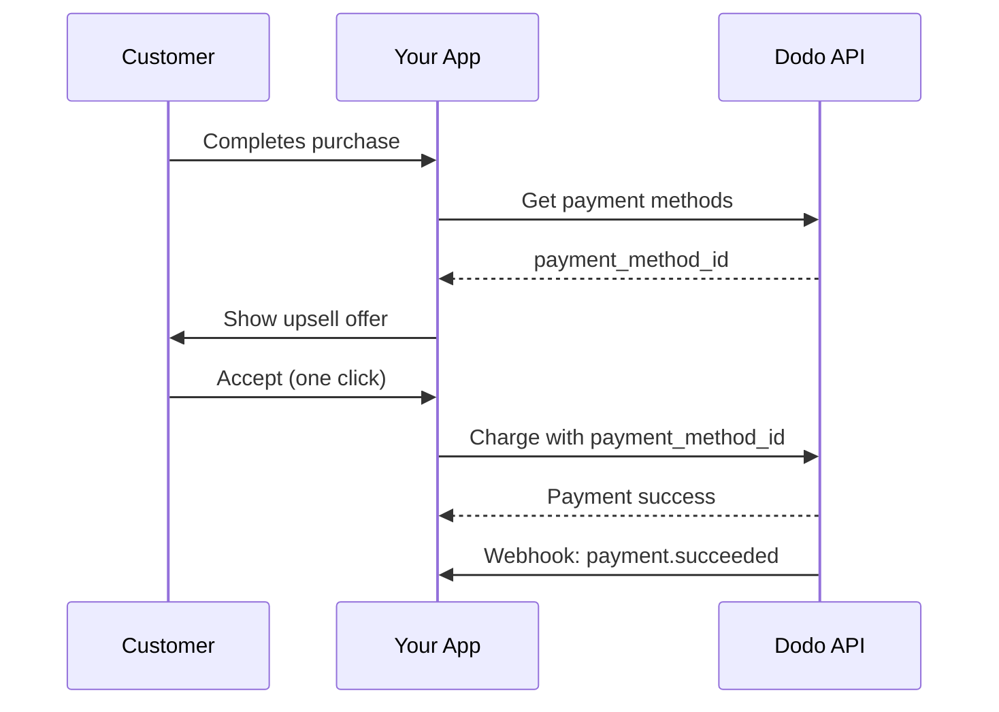
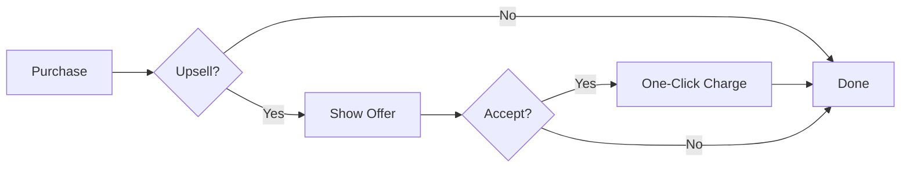
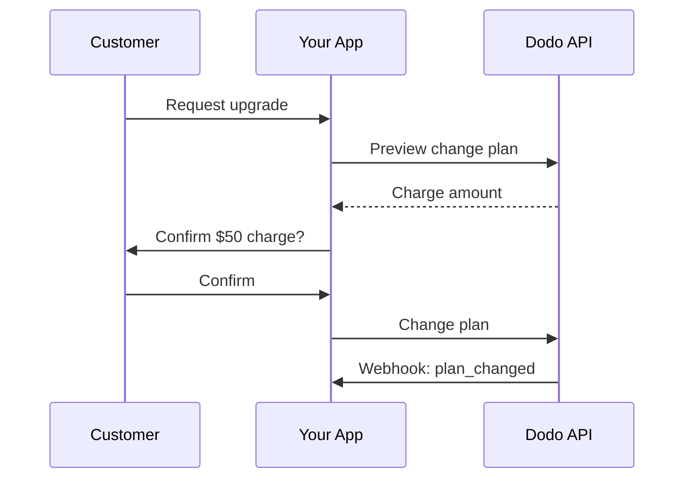
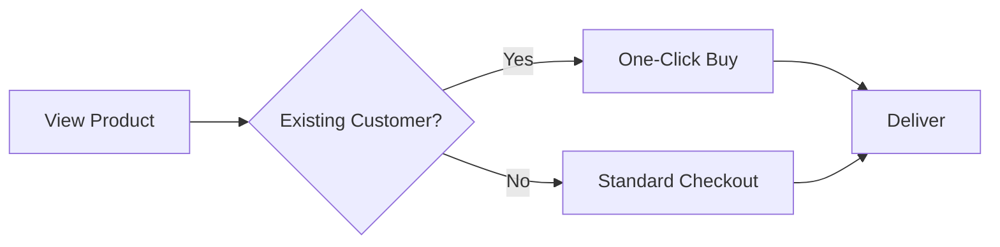

<Info>
अपसेल और डाउनसेल आपको ग्राहकों को उनकी सेव की गई भुगतान विधियों का उपयोग कर अतिरिक्त उत्पादों या योजना परिवर्तनों की पेशकश करने की अनुमति देते हैं। यह वन-क्लिक खरीदारी सक्षम करता है जो भुगतान संग्रह को बायपास करता है, जिससे परिवर्तित होने की दर में अत्यधिक सुधार होता है।
</Info>

<CardGroup cols={3}>
<Card title="पोस्ट-पर्चेज अपसेल" icon="cart-plus">
  चेकआउट के तुरंत बाद सहायक उत्पादों की पेशकश करें वन-क्लिक खरीदारी के साथ।
</Card>

<Card title="सब्सक्रिप्शन अपग्रेड" icon="arrow-up">
  स्वचालित प्रोरशन और तात्कालिक बिलिंग के साथ ग्राहकों को उच्च स्तरों पर ले जाएँ।
</Card>

<Card title="क्रॉस-सेल" icon="grid-2-plus">
  मौजूदा ग्राहकों के लिए संबंधित उत्पाद जोड़ें बिना भुगतान विवरण फिर से दर्ज किए।
</Card>
</CardGroup>

## अवलोकन

अपसेल और डाउनसेल शक्तिशाली राजस्व अनुकूलन रणनीतियाँ हैं:

- **अपसेल**: उच्च मूल्य के उत्पाद या अपग्रेड (जैसे, बेसिक के बजाय प्रो प्लान) की पेशकश करें।
- **डाउनसेल**: जब ग्राहक अस्वीकार करता है या डाउनग्रेड करता है तो कम कीमत का विकल्प प्रदान करें।
- **क्रॉस-सेल**: सहायक उत्पादों का सुझाव दें (जैसे, ऐड-ऑन, संबंधित आइटम)।

डोडो पेमेंट्स इन प्रवाहों को `payment_method_id` पैरामीटर के माध्यम से सक्षम करता है, जो आपको ग्राहक की सेव की गई भुगतान विधि का शुल्क लगाने की अनुमति देता है बिना उन्हें कार्ड विवरण फिर से दर्ज कराने की आवश्यकता के।

### प्रमुख लाभ

| लाभ | प्रभाव |
|---------|--------|
| **वन-क्लिक खरीदारी** | लौटने वाले ग्राहकों के लिए भुगतान फॉर्म को पूरी तरह से छोड़ें |
| **उच्चतर रूपांतरण** | निर्णय लेते समय घर्षण को कम करें |
| **तात्कालिक प्रसंस्करण** | `confirm: true` के साथ तत्काल शुल्क लगाना |
| **निर्बाध UX** | ग्राहक प्रवाह के दौरान आपकी ऐप में बने रहते हैं |

## यह कैसे काम करता है



## आवश्यक पृष्ठभूमि

अपसेल और डाउनसेल लागू करने से पहले, सुनिश्चित करें कि आपके पास हैं:

<Steps>
<Step title="सेव किए गए भुगतान विधि के साथ ग्राहक">
  ग्राहकों को कम से कम एक खरीदारी पूरी करनी होगी। जब ग्राहक चेकआउट पूरा करते हैं, तो भुगतान विधियाँ स्वचालित रूप से सेव हो जाती हैं।
</Step>

<Step title="प्रोडक्ट कॉन्फ़िगर किए गए हैं">
  डोडो पेमेंट्स डैशबोर्ड में अपने अपसेल उत्पाद बनाएं। यह एक बार के भुगतान, सब्सक्रिप्शन या ऐड-ऑन हो सकते हैं।
</Step>

<Step title="Webhook Endpoint">
  `payment.succeeded`, `payment.failed`, और `subscription.plan_changed` घटनाओं को संभालने के लिए वेबहुक सेट करें।
</Step>
</Steps>

## ग्राहक भुगतान विधियाँ प्राप्त करना

अपसेल की पेशकश करने से पहले, ग्राहक की सेव की गई भुगतान विधियों को प्राप्त करें:

<Tabs>
<Tab title="TypeScript">

```typescript
import DodoPayments from 'dodopayments';

const client = new DodoPayments({
  bearerToken: process.env.DODO_PAYMENTS_API_KEY,
  environment: 'live_mode',
});

async function getPaymentMethods(customerId: string) {
  const paymentMethods = await client.customers.listPaymentMethods(customerId);
  
  // Returns array of saved payment methods
  // Each has: payment_method_id, type, card (last4, brand, exp_month, exp_year)
  return paymentMethods;
}

// Example usage
const methods = await getPaymentMethods('cus_123');
console.log('Available payment methods:', methods);

// Use the first available method for upsell
const primaryMethod = methods[0]?.payment_method_id;
```

</Tab>

<Tab title="Python">

```python
import os
from dodopayments import DodoPayments

client = DodoPayments(
    bearer_token=os.environ.get("DODO_PAYMENTS_API_KEY"),
    environment="live_mode",
)

def get_payment_methods(customer_id: str):
    payment_methods = client.customers.list_payment_methods(customer_id)
    
    # Returns list of saved payment methods
    # Each has: payment_method_id, type, card (last4, brand, exp_month, exp_year)
    return payment_methods

# Example usage
methods = get_payment_methods("cus_123")
print("Available payment methods:", methods)

# Use the first available method for upsell
primary_method = methods[0].payment_method_id if methods else None
```

</Tab>

<Tab title="Go">

```go
package main

import (
    "context"
    "fmt"
    "github.com/dodopayments/dodopayments-go"
    "github.com/dodopayments/dodopayments-go/option"
)

func getPaymentMethods(customerID string) ([]dodopayments.PaymentMethod, error) {
    client := dodopayments.NewClient(
        option.WithBearerToken(os.Getenv("DODO_PAYMENTS_API_KEY")),
    )
    
    methods, err := client.Customers.ListPaymentMethods(
        context.TODO(),
        customerID,
    )
    if err != nil {
        return nil, err
    }
    
    return methods, nil
}

func main() {
    methods, err := getPaymentMethods("cus_123")
    if err != nil {
        panic(err)
    }
    
    fmt.Println("Available payment methods:", methods)
    
    // Use the first available method for upsell
    if len(methods) > 0 {
        primaryMethod := methods[0].PaymentMethodID
        fmt.Println("Primary method:", primaryMethod)
    }
}
```

</Tab>
</Tabs>

<Info>
जब ग्राहक चेकआउट पूरा करते हैं, तो भुगतान विधियाँ स्वचालित रूप से सेव हो जाती हैं। आपको उन्हें स्पष्ट रूप से सेव करने की आवश्यकता नहीं है।
</Info>

## पोस्ट-पर्चेज वन-क्लिक अपसेल

एक सफल खरीद के तुरंत बाद अतिरिक्त उत्पादों की पेशकश करें। ग्राहक एक क्लिक के साथ स्वीकार कर सकता है क्योंकि उनकी भुगतान विधि पहले से ही सेव है।



### कार्यान्वयन

<Tabs>
<Tab title="TypeScript">

```typescript
import DodoPayments from 'dodopayments';

const client = new DodoPayments({
  bearerToken: process.env.DODO_PAYMENTS_API_KEY,
  environment: 'live_mode',
});

async function createOneClickUpsell(
  customerId: string,
  paymentMethodId: string,
  upsellProductId: string
) {
  // Create checkout session with saved payment method
  // confirm: true processes the payment immediately
  const session = await client.checkoutSessions.create({
    product_cart: [
      {
        product_id: upsellProductId,
        quantity: 1
      }
    ],
    customer: {
      customer_id: customerId
    },
    payment_method_id: paymentMethodId,
    confirm: true,  // Required when using payment_method_id
    return_url: 'https://yourapp.com/upsell-success',
    feature_flags: {
      redirect_immediately: true  // Skip success page
    },
    metadata: {
      upsell_source: 'post_purchase',
      original_order_id: 'order_123'
    }
  });

  return session;
}

// Example: Offer premium add-on after initial purchase
async function handlePostPurchaseUpsell(customerId: string) {
  // Get customer's payment methods
  const methods = await client.customers.listPaymentMethods(customerId);
  
  if (methods.length === 0) {
    console.log('No saved payment methods available');
    return null;
  }

  // Create the upsell with one-click checkout
  const upsell = await createOneClickUpsell(
    customerId,
    methods[0].payment_method_id,
    'prod_premium_addon'
  );

  console.log('Upsell processed:', upsell.session_id);
  return upsell;
}
```

</Tab>

<Tab title="Python">

```python
import os
from dodopayments import DodoPayments

client = DodoPayments(
    bearer_token=os.environ.get("DODO_PAYMENTS_API_KEY"),
    environment="live_mode",
)

def create_one_click_upsell(
    customer_id: str,
    payment_method_id: str,
    upsell_product_id: str
):
    """Create a one-click upsell using saved payment method."""
    
    # Create checkout session with saved payment method
    # confirm=True processes the payment immediately
    session = client.checkout_sessions.create(
        product_cart=[
            {
                "product_id": upsell_product_id,
                "quantity": 1
            }
        ],
        customer={
            "customer_id": customer_id
        },
        payment_method_id=payment_method_id,
        confirm=True,  # Required when using payment_method_id
        return_url="https://yourapp.com/upsell-success",
        feature_flags={
            "redirect_immediately": True  # Skip success page
        },
        metadata={
            "upsell_source": "post_purchase",
            "original_order_id": "order_123"
        }
    )
    
    return session

def handle_post_purchase_upsell(customer_id: str):
    """Offer premium add-on after initial purchase."""
    
    # Get customer's payment methods
    methods = client.customers.list_payment_methods(customer_id)
    
    if not methods:
        print("No saved payment methods available")
        return None
    
    # Create the upsell with one-click checkout
    upsell = create_one_click_upsell(
        customer_id=customer_id,
        payment_method_id=methods[0].payment_method_id,
        upsell_product_id="prod_premium_addon"
    )
    
    print(f"Upsell processed: {upsell.session_id}")
    return upsell
```

</Tab>

<Tab title="Go">

```go
package main

import (
    "context"
    "fmt"
    "os"
    
    "github.com/dodopayments/dodopayments-go"
    "github.com/dodopayments/dodopayments-go/option"
)

func createOneClickUpsell(
    customerID string,
    paymentMethodID string,
    upsellProductID string,
) (*dodopayments.CheckoutSession, error) {
    client := dodopayments.NewClient(
        option.WithBearerToken(os.Getenv("DODO_PAYMENTS_API_KEY")),
    )
    
    // Create checkout session with saved payment method
    // Confirm: true processes the payment immediately
    session, err := client.CheckoutSessions.Create(context.TODO(), dodopayments.CheckoutSessionCreateParams{
        ProductCart: dodopayments.F([]dodopayments.CheckoutSessionCreateParamsProductCart{
            {
                ProductID: dodopayments.F(upsellProductID),
                Quantity:  dodopayments.F(int64(1)),
            },
        }),
        Customer: dodopayments.F(dodopayments.CheckoutSessionCreateParamsCustomer{
            CustomerID: dodopayments.F(customerID),
        }),
        PaymentMethodID: dodopayments.F(paymentMethodID),
        Confirm:         dodopayments.F(true), // Required when using payment_method_id
        ReturnURL:       dodopayments.F("https://yourapp.com/upsell-success"),
        FeatureFlags: dodopayments.F(dodopayments.CheckoutSessionCreateParamsFeatureFlags{
            RedirectImmediately: dodopayments.F(true), // Skip success page
        }),
        Metadata: dodopayments.F(map[string]string{
            "upsell_source":     "post_purchase",
            "original_order_id": "order_123",
        }),
    })
    
    return session, err
}

func handlePostPurchaseUpsell(customerID string) (*dodopayments.CheckoutSession, error) {
    client := dodopayments.NewClient(
        option.WithBearerToken(os.Getenv("DODO_PAYMENTS_API_KEY")),
    )
    
    // Get customer's payment methods
    methods, err := client.Customers.ListPaymentMethods(context.TODO(), customerID)
    if err != nil {
        return nil, err
    }
    
    if len(methods) == 0 {
        fmt.Println("No saved payment methods available")
        return nil, nil
    }
    
    // Create the upsell with one-click checkout
    upsell, err := createOneClickUpsell(
        customerID,
        methods[0].PaymentMethodID,
        "prod_premium_addon",
    )
    if err != nil {
        return nil, err
    }
    
    fmt.Printf("Upsell processed: %s\n", upsell.SessionID)
    return upsell, nil
}
```

</Tab>
</Tabs>

<Warning>
जब आप `payment_method_id` का उपयोग कर रहे हैं, तो आपको `confirm: true` सेट करना होगा और एक मौजूदा `customer_id` प्रदान करना होगा। भुगतान विधि को उसी ग्राहक से संबंधित होना चाहिए।
</Warning>

## सब्सक्रिप्शन अपग्रेड

ग्राहकों को स्वचालित प्रोरशन हैंडलिंग के साथ उच्च-स्तरीय सब्सक्रिप्शन योजनाओं में ले जाएँ।



### प्रतिबद्ध करने से पहले पूर्वावलोकन

हमेशा योजना परिवर्तनों का पूर्वावलोकन करें ताकि ग्राहकों को स्पष्ट रूप से दिख सके कि उन्हें क्या शुल्क लिया जाएगा:

<Tabs>
<Tab title="TypeScript">

```typescript
async function previewUpgrade(
  subscriptionId: string,
  newProductId: string
) {
  const preview = await client.subscriptions.previewChangePlan(subscriptionId, {
    product_id: newProductId,
    quantity: 1,
    proration_billing_mode: 'difference_immediately'
  });

  return {
    immediateCharge: preview.immediate_charge?.summary,
    newPlan: preview.new_plan,
    effectiveDate: preview.effective_date
  };
}

// Show customer the charge before confirming
const preview = await previewUpgrade('sub_123', 'prod_pro_plan');
console.log(`Upgrade will charge: ${preview.immediateCharge}`);
```

</Tab>

<Tab title="Python">

```python
def preview_upgrade(subscription_id: str, new_product_id: str):
    preview = client.subscriptions.preview_change_plan(
        subscription_id=subscription_id,
        product_id=new_product_id,
        quantity=1,
        proration_billing_mode="difference_immediately"
    )
    
    return {
        "immediate_charge": preview.immediate_charge.summary if preview.immediate_charge else None,
        "new_plan": preview.new_plan,
        "effective_date": preview.effective_date
    }

# Show customer the charge before confirming
preview = preview_upgrade("sub_123", "prod_pro_plan")
print(f"Upgrade will charge: {preview['immediate_charge']}")
```

</Tab>

<Tab title="Go">

```go
func previewUpgrade(subscriptionID string, newProductID string) (map[string]interface{}, error) {
    client := dodopayments.NewClient(
        option.WithBearerToken(os.Getenv("DODO_PAYMENTS_API_KEY")),
    )
    
    preview, err := client.Subscriptions.PreviewChangePlan(
        context.TODO(),
        subscriptionID,
        dodopayments.SubscriptionPreviewChangePlanParams{
            ProductID:             dodopayments.F(newProductID),
            Quantity:              dodopayments.F(int64(1)),
            ProrationBillingMode:  dodopayments.F(dodopayments.ProrationBillingModeDifferenceImmediately),
        },
    )
    if err != nil {
        return nil, err
    }
    
    return map[string]interface{}{
        "immediate_charge": preview.ImmediateCharge.Summary,
        "new_plan":         preview.NewPlan,
        "effective_date":   preview.EffectiveDate,
    }, nil
}
```

</Tab>
</Tabs>

### अपग्रेड को निष्पादित करें

<Tabs>
<Tab title="TypeScript">

```typescript
async function upgradeSubscription(
  subscriptionId: string,
  newProductId: string,
  prorationMode: 'prorated_immediately' | 'difference_immediately' | 'full_immediately' = 'difference_immediately'
) {
  const result = await client.subscriptions.changePlan(subscriptionId, {
    product_id: newProductId,
    quantity: 1,
    proration_billing_mode: prorationMode
  });

  return {
    status: result.status,
    subscriptionId: result.subscription_id,
    paymentId: result.payment_id,
    invoiceId: result.invoice_id
  };
}

// Upgrade from Basic ($30) to Pro ($80)
// With difference_immediately: charges $50 instantly
const upgrade = await upgradeSubscription('sub_123', 'prod_pro_plan');
console.log('Upgrade status:', upgrade.status);
```

</Tab>

<Tab title="Python">

```python
def upgrade_subscription(
    subscription_id: str,
    new_product_id: str,
    proration_mode: str = "difference_immediately"
):
    result = client.subscriptions.change_plan(
        subscription_id=subscription_id,
        product_id=new_product_id,
        quantity=1,
        proration_billing_mode=proration_mode
    )
    
    return {
        "status": result.status,
        "subscription_id": result.subscription_id,
        "payment_id": result.payment_id,
        "invoice_id": result.invoice_id
    }

# Upgrade from Basic ($30) to Pro ($80)
# With difference_immediately: charges $50 instantly
upgrade = upgrade_subscription("sub_123", "prod_pro_plan")
print(f"Upgrade status: {upgrade['status']}")
```

</Tab>

<Tab title="Go">

```go
func upgradeSubscription(
    subscriptionID string,
    newProductID string,
    prorationMode dodopayments.ProrationBillingMode,
) (*dodopayments.SubscriptionChangePlanResponse, error) {
    client := dodopayments.NewClient(
        option.WithBearerToken(os.Getenv("DODO_PAYMENTS_API_KEY")),
    )
    
    result, err := client.Subscriptions.ChangePlan(
        context.TODO(),
        subscriptionID,
        dodopayments.SubscriptionChangePlanParams{
            ProductID:            dodopayments.F(newProductID),
            Quantity:             dodopayments.F(int64(1)),
            ProrationBillingMode: dodopayments.F(prorationMode),
        },
    )
    
    return result, err
}

// Upgrade from Basic ($30) to Pro ($80)
// With DifferenceImmediately: charges $50 instantly
upgrade, err := upgradeSubscription(
    "sub_123",
    "prod_pro_plan",
    dodopayments.ProrationBillingModeDifferenceImmediately,
)
if err != nil {
    panic(err)
}
fmt.Printf("Upgrade status: %s\n", upgrade.Status)
```

</Tab>
</Tabs>

### प्रोरशन मोड

जब अपग्रेड करते समय ग्राहकों को कैसे बिल किया जाता है, इसका चुनाव करें:

| मोड | व्यवहार | सर्वश्रेष्ठ के लिए |
|------|----------|----------|
| `difference_immediately` | तुरंत मूल्य अंतर चार्ज करता है ($30→$80 = $50) | सरल अपग्रेड |
| `prorated_immediately` | बिलिंग चक्र में शेष समय के आधार पर शुल्क लेते हैं | उचित समय-आधारित बिलिंग |
| `full_immediately` | नए योजना की पूर्ण कीमत, शेष समय की अनदेखी करते हुए चार्ज करता है | बिलिंग चक्र रीसेट होता है |

<Tip>
सरल अपग्रेड प्रवाह के लिए `difference_immediately` का उपयोग करें। जब आप वर्तमान योजना पर अव्यवस्था समय को ध्यान में रखना चाहते हैं, तब `prorated_immediately` का उपयोग करें।
</Tip>

## क्रॉस-सेल

मौजूदा ग्राहकों के लिए सहायक उत्पाद जोड़ें बिना उन्हें भुगतान विवरण फिर से दर्ज करने की आवश्यकता।



### कार्यान्वयन

<Tabs>
<Tab title="TypeScript">

```typescript
async function createCrossSell(
  customerId: string,
  paymentMethodId: string,
  productId: string,
  quantity: number = 1
) {
  // Create a one-time payment using saved payment method
  const payment = await client.payments.create({
    product_cart: [
      {
        product_id: productId,
        quantity: quantity
      }
    ],
    customer_id: customerId,
    payment_method_id: paymentMethodId,
    return_url: 'https://yourapp.com/purchase-complete',
    metadata: {
      purchase_type: 'cross_sell',
      source: 'product_recommendation'
    }
  });

  return payment;
}

// Example: Customer bought a course, offer related ebook
async function offerRelatedProduct(customerId: string, relatedProductId: string) {
  const methods = await client.customers.listPaymentMethods(customerId);
  
  if (methods.length === 0) {
    // Fall back to standard checkout
    return client.checkoutSessions.create({
      product_cart: [{ product_id: relatedProductId, quantity: 1 }],
      customer: { customer_id: customerId },
      return_url: 'https://yourapp.com/purchase-complete'
    });
  }

  // One-click purchase
  return createCrossSell(customerId, methods[0].payment_method_id, relatedProductId);
}
```

</Tab>

<Tab title="Python">

```python
def create_cross_sell(
    customer_id: str,
    payment_method_id: str,
    product_id: str,
    quantity: int = 1
):
    """Create a one-time payment using saved payment method."""
    
    payment = client.payments.create(
        product_cart=[
            {
                "product_id": product_id,
                "quantity": quantity
            }
        ],
        customer_id=customer_id,
        payment_method_id=payment_method_id,
        return_url="https://yourapp.com/purchase-complete",
        metadata={
            "purchase_type": "cross_sell",
            "source": "product_recommendation"
        }
    )
    
    return payment

def offer_related_product(customer_id: str, related_product_id: str):
    """Offer related product with one-click purchase if possible."""
    
    methods = client.customers.list_payment_methods(customer_id)
    
    if not methods:
        # Fall back to standard checkout
        return client.checkout_sessions.create(
            product_cart=[{"product_id": related_product_id, "quantity": 1}],
            customer={"customer_id": customer_id},
            return_url="https://yourapp.com/purchase-complete"
        )
    
    # One-click purchase
    return create_cross_sell(customer_id, methods[0].payment_method_id, related_product_id)
```

</Tab>

<Tab title="Go">

```go
func createCrossSell(
    customerID string,
    paymentMethodID string,
    productID string,
    quantity int64,
) (*dodopayments.Payment, error) {
    client := dodopayments.NewClient(
        option.WithBearerToken(os.Getenv("DODO_PAYMENTS_API_KEY")),
    )
    
    payment, err := client.Payments.Create(context.TODO(), dodopayments.PaymentCreateParams{
        ProductCart: dodopayments.F([]dodopayments.PaymentCreateParamsProductCart{
            {
                ProductID: dodopayments.F(productID),
                Quantity:  dodopayments.F(quantity),
            },
        }),
        CustomerID:      dodopayments.F(customerID),
        PaymentMethodID: dodopayments.F(paymentMethodID),
        ReturnURL:       dodopayments.F("https://yourapp.com/purchase-complete"),
        Metadata: dodopayments.F(map[string]string{
            "purchase_type": "cross_sell",
            "source":        "product_recommendation",
        }),
    })
    
    return payment, err
}

func offerRelatedProduct(customerID string, relatedProductID string) (interface{}, error) {
    client := dodopayments.NewClient(
        option.WithBearerToken(os.Getenv("DODO_PAYMENTS_API_KEY")),
    )
    
    methods, err := client.Customers.ListPaymentMethods(context.TODO(), customerID)
    if err != nil {
        return nil, err
    }
    
    if len(methods) == 0 {
        // Fall back to standard checkout
        return client.CheckoutSessions.Create(context.TODO(), dodopayments.CheckoutSessionCreateParams{
            ProductCart: dodopayments.F([]dodopayments.CheckoutSessionCreateParamsProductCart{
                {ProductID: dodopayments.F(relatedProductID), Quantity: dodopayments.F(int64(1))},
            }),
            Customer:  dodopayments.F(dodopayments.CheckoutSessionCreateParamsCustomer{CustomerID: dodopayments.F(customerID)}),
            ReturnURL: dodopayments.F("https://yourapp.com/purchase-complete"),
        })
    }
    
    // One-click purchase
    return createCrossSell(customerID, methods[0].PaymentMethodID, relatedProductID, 1)
}
```

</Tab>
</Tabs>

## सब्सक्रिप्शन डाउनग्रेड

जब ग्राहक एक निम्न-स्तरीय योजना में जाना चाहते हैं, तो स्वचालित क्रेडिट के साथ संक्रमण को खूबसूरती से संभालें।

### डाउनग्रेड कैसे काम करते हैं

1. ग्राहक डाउनग्रेड का अनुरोध करता है (Pro → Basic)
2. प्रणाली वर्तमान योजना पर शेष मूल्य की गणना करती है
3. भविष्य की नवीनीकरण के लिए सब्सक्रिप्शन में क्रेडिट जोड़ दिया जाता है
4. ग्राहक तत्काल नए योजना में.move होता है।

<Tabs>
<Tab title="TypeScript">

```typescript
async function downgradeSubscription(
  subscriptionId: string,
  newProductId: string
) {
  // Preview the downgrade first
  const preview = await client.subscriptions.previewChangePlan(subscriptionId, {
    product_id: newProductId,
    quantity: 1,
    proration_billing_mode: 'difference_immediately'
  });

  console.log('Credit to be applied:', preview.credit_amount);

  // Execute the downgrade
  const result = await client.subscriptions.changePlan(subscriptionId, {
    product_id: newProductId,
    quantity: 1,
    proration_billing_mode: 'difference_immediately'
  });

  // Credits are automatically applied to future renewals
  return result;
}

// Downgrade from Pro ($80) to Basic ($30)
// $50 credit added to subscription, auto-applied on next renewal
const downgrade = await downgradeSubscription('sub_123', 'prod_basic_plan');
```

</Tab>

<Tab title="Python">

```python
def downgrade_subscription(subscription_id: str, new_product_id: str):
    # Preview the downgrade first
    preview = client.subscriptions.preview_change_plan(
        subscription_id=subscription_id,
        product_id=new_product_id,
        quantity=1,
        proration_billing_mode="difference_immediately"
    )
    
    print(f"Credit to be applied: {preview.credit_amount}")
    
    # Execute the downgrade
    result = client.subscriptions.change_plan(
        subscription_id=subscription_id,
        product_id=new_product_id,
        quantity=1,
        proration_billing_mode="difference_immediately"
    )
    
    # Credits are automatically applied to future renewals
    return result

# Downgrade from Pro ($80) to Basic ($30)
# $50 credit added to subscription, auto-applied on next renewal
downgrade = downgrade_subscription("sub_123", "prod_basic_plan")
```

</Tab>

<Tab title="Go">

```go
func downgradeSubscription(subscriptionID string, newProductID string) (*dodopayments.SubscriptionChangePlanResponse, error) {
    client := dodopayments.NewClient(
        option.WithBearerToken(os.Getenv("DODO_PAYMENTS_API_KEY")),
    )
    
    // Preview the downgrade first
    preview, err := client.Subscriptions.PreviewChangePlan(
        context.TODO(),
        subscriptionID,
        dodopayments.SubscriptionPreviewChangePlanParams{
            ProductID:            dodopayments.F(newProductID),
            Quantity:             dodopayments.F(int64(1)),
            ProrationBillingMode: dodopayments.F(dodopayments.ProrationBillingModeDifferenceImmediately),
        },
    )
    if err != nil {
        return nil, err
    }
    
    fmt.Printf("Credit to be applied: %v\n", preview.CreditAmount)
    
    // Execute the downgrade
    result, err := client.Subscriptions.ChangePlan(
        context.TODO(),
        subscriptionID,
        dodopayments.SubscriptionChangePlanParams{
            ProductID:            dodopayments.F(newProductID),
            Quantity:             dodopayments.F(int64(1)),
            ProrationBillingMode: dodopayments.F(dodopayments.ProrationBillingModeDifferenceImmediately),
        },
    )
    
    return result, err
}
```

</Tab>
</Tabs>

<Info>
`difference_immediately` का उपयोग करके डाउनग्रेड से प्राप्त क्रेडिट सब्सक्रिप्शन-स्कोप्ड होते हैं और भविष्य की नवीनीकरण पर स्वचालित रूप से लागू होते हैं। यह [ग्राहक क्रेडिट](/features/customer-credit) से भिन्न होते हैं।
</Info>

## पूर्ण उदाहरण: पोस्ट-पर्चेज अपसेल प्रवाह

यहां एक पूर्ण कार्यान्वयन है जो यह दिखाता है कि सफल खरीद के बाद कैसे अपसेल पेश किया जाए:

<Tabs>
<Tab title="TypeScript">

```typescript
import DodoPayments from 'dodopayments';
import express from 'express';

const client = new DodoPayments({
  bearerToken: process.env.DODO_PAYMENTS_API_KEY,
  environment: 'live_mode',
});

const app = express();

// Store for tracking upsell eligibility (use your database in production)
const eligibleUpsells = new Map<string, { customerId: string; productId: string }>();

// Webhook handler for initial purchase success
app.post('/webhooks/dodo', express.raw({ type: 'application/json' }), async (req, res) => {
  const event = JSON.parse(req.body.toString());
  
  switch (event.type) {
    case 'payment.succeeded':
      // Check if customer is eligible for upsell
      const customerId = event.data.customer_id;
      const productId = event.data.product_id;
      
      // Define upsell rules (e.g., bought Basic, offer Pro)
      const upsellProduct = getUpsellProduct(productId);
      
      if (upsellProduct) {
        eligibleUpsells.set(customerId, {
          customerId,
          productId: upsellProduct
        });
      }
      break;
      
    case 'payment.failed':
      console.log('Payment failed:', event.data.payment_id);
      // Handle failed upsell payment
      break;
  }
  
  res.json({ received: true });
});

// API endpoint to check upsell eligibility
app.get('/api/upsell/:customerId', async (req, res) => {
  const { customerId } = req.params;
  const upsell = eligibleUpsells.get(customerId);
  
  if (!upsell) {
    return res.json({ eligible: false });
  }
  
  // Get payment methods
  const methods = await client.customers.listPaymentMethods(customerId);
  
  if (methods.length === 0) {
    return res.json({ eligible: false, reason: 'no_payment_method' });
  }
  
  // Get product details for display
  const product = await client.products.retrieve(upsell.productId);
  
  res.json({
    eligible: true,
    product: {
      id: product.product_id,
      name: product.name,
      price: product.price,
      currency: product.currency
    },
    paymentMethodId: methods[0].payment_method_id
  });
});

// API endpoint to accept upsell
app.post('/api/upsell/:customerId/accept', async (req, res) => {
  const { customerId } = req.params;
  const upsell = eligibleUpsells.get(customerId);
  
  if (!upsell) {
    return res.status(400).json({ error: 'No upsell available' });
  }
  
  try {
    const methods = await client.customers.listPaymentMethods(customerId);
    
    // Create one-click purchase
    const session = await client.checkoutSessions.create({
      product_cart: [{ product_id: upsell.productId, quantity: 1 }],
      customer: { customer_id: customerId },
      payment_method_id: methods[0].payment_method_id,
      confirm: true,
      return_url: `${process.env.APP_URL}/upsell-success`,
      feature_flags: { redirect_immediately: true },
      metadata: { upsell: 'true', source: 'post_purchase' }
    });
    
    // Clear the upsell offer
    eligibleUpsells.delete(customerId);
    
    res.json({ success: true, sessionId: session.session_id });
  } catch (error) {
    console.error('Upsell failed:', error);
    res.status(500).json({ error: 'Upsell processing failed' });
  }
});

// Helper function to determine upsell product
function getUpsellProduct(purchasedProductId: string): string | null {
  const upsellMap: Record<string, string> = {
    'prod_basic_plan': 'prod_pro_plan',
    'prod_starter_course': 'prod_complete_bundle',
    'prod_single_license': 'prod_team_license'
  };
  
  return upsellMap[purchasedProductId] || null;
}

app.listen(3000);
```

</Tab>

<Tab title="Python">

```python
import os
from flask import Flask, request, jsonify
from dodopayments import DodoPayments

client = DodoPayments(
    bearer_token=os.environ.get("DODO_PAYMENTS_API_KEY"),
    environment="live_mode",
)

app = Flask(__name__)

# Store for tracking upsell eligibility (use your database in production)
eligible_upsells = {}

@app.route('/webhooks/dodo', methods=['POST'])
def webhook_handler():
    event = request.json
    
    if event['type'] == 'payment.succeeded':
        # Check if customer is eligible for upsell
        customer_id = event['data']['customer_id']
        product_id = event['data']['product_id']
        
        # Define upsell rules
        upsell_product = get_upsell_product(product_id)
        
        if upsell_product:
            eligible_upsells[customer_id] = {
                'customer_id': customer_id,
                'product_id': upsell_product
            }
    
    elif event['type'] == 'payment.failed':
        print(f"Payment failed: {event['data']['payment_id']}")
    
    return jsonify({'received': True})

@app.route('/api/upsell/<customer_id>', methods=['GET'])
def check_upsell(customer_id):
    upsell = eligible_upsells.get(customer_id)
    
    if not upsell:
        return jsonify({'eligible': False})
    
    # Get payment methods
    methods = client.customers.list_payment_methods(customer_id)
    
    if not methods:
        return jsonify({'eligible': False, 'reason': 'no_payment_method'})
    
    # Get product details for display
    product = client.products.retrieve(upsell['product_id'])
    
    return jsonify({
        'eligible': True,
        'product': {
            'id': product.product_id,
            'name': product.name,
            'price': product.price,
            'currency': product.currency
        },
        'payment_method_id': methods[0].payment_method_id
    })

@app.route('/api/upsell/<customer_id>/accept', methods=['POST'])
def accept_upsell(customer_id):
    upsell = eligible_upsells.get(customer_id)
    
    if not upsell:
        return jsonify({'error': 'No upsell available'}), 400
    
    try:
        methods = client.customers.list_payment_methods(customer_id)
        
        # Create one-click purchase
        session = client.checkout_sessions.create(
            product_cart=[{'product_id': upsell['product_id'], 'quantity': 1}],
            customer={'customer_id': customer_id},
            payment_method_id=methods[0].payment_method_id,
            confirm=True,
            return_url=f"{os.environ['APP_URL']}/upsell-success",
            feature_flags={'redirect_immediately': True},
            metadata={'upsell': 'true', 'source': 'post_purchase'}
        )
        
        # Clear the upsell offer
        del eligible_upsells[customer_id]
        
        return jsonify({'success': True, 'session_id': session.session_id})
    
    except Exception as error:
        print(f"Upsell failed: {error}")
        return jsonify({'error': 'Upsell processing failed'}), 500

def get_upsell_product(purchased_product_id: str) -> str:
    """Determine upsell product based on purchased product."""
    upsell_map = {
        'prod_basic_plan': 'prod_pro_plan',
        'prod_starter_course': 'prod_complete_bundle',
        'prod_single_license': 'prod_team_license'
    }
    return upsell_map.get(purchased_product_id)

if __name__ == '__main__':
    app.run(port=3000)
```

</Tab>
</Tabs>

## सर्वश्रेष्ठ प्रथाएँ

<AccordionGroup>
<Accordion title="अपसेल को रणनीतिक रूप से समय दें">
अपसेल की पेशकश करने का सबसे अच्छा समय एक सफल खरीद के तुरंत बाद होता है जब ग्राहक खरीदने की मानसिकता में होते हैं। अन्य प्रभावी समय:
- फ़ीचर उपयोग मील के पत्थरों के बाद
- जब योजना सीमाओं के करीब होते हैं
- ऑनबोर्डिंग पूरा होने के दौरान
</Accordion>

<Accordion title="भुगतान विधि पात्रता को मान्य करें">
एक बार-एक-क्लिक चार्ज का प्रयास करने से पहले, भुगतान विधि की जांच करें:
- उत्पाद की मुद्रा के साथ संगत है
- समाप्त नहीं हुआ है
- ग्राहक का है

API इनकी जांच करेगा, लेकिन सक्रिय रूप से जांच करना UX में सुधार करता है।
</Accordion>

<Accordion title="विफलताओं को खूबसूरती से संभालें">
जब एक-क्लिक शुल्क विफल हो:
1. मानक चेकआउट प्रवाह पर वापस जाएँ
2. ग्राहक को स्पष्ट संदेश के साथ सूचित करें
3. भुगतान विधि को अपडेट करने की पेशकश करें
4. विफल शुल्कों का बार-बार प्रयास न करें
</Accordion>

<Accordion title="स्पष्ट मूल्य प्रस्ताव प्रदान करें">
जब ग्राहक मूल्य समझते हैं, तो अपसेल बेहतर परिवर्तित होते हैं:
- दिखाएँ कि वे मौजूदा योजना के मुकाबले क्या प्राप्त कर रहे हैं
- मूल्य के अंतर को उजागर करें, कुल कीमत नहीं
- सामाजिक प्रमाण का उपयोग करें (जैसे, "सबसे लोकप्रिय अपग्रेड")
</Accordion>

<Accordion title="ग्राहक की पसंद का सम्मान करें">
- हमेशा अस्वीकृत करने का एक आसान तरीका प्रदान करें
- अस्वीकृति के बाद समान अपसेल को बार-बार न दिखाएँ
- ऑफ़र को अनुकूलित करने के लिए यह ट्रैक करें और विश्लेषण करें कि कौन से अपसेल परिवर्तित होते हैं
</Accordion>
</AccordionGroup>

## मोनिटर करने के लिए वेबहुक

अपसेल और डाउनग्रेड प्रवाह के लिए इन वेबहुक घटनाओं को ट्रैक करें:

| घटना | ट्रिगर | क्रिया |
|-------|---------|--------|
| `payment.succeeded` | अपसेल/क्रॉस-सेल भुगतान पूरा हुआ | उत्पाद वितरित करें, पहुँच अपडेट करें |
| `payment.failed` | वन-क्लिक शुल्क विफल | त्रुटि दर्शाएँ, पुनः प्रयास या बैकअप का प्रस्ताव करें |
| `subscription.plan_changed` | अपग्रेड/डाउनग्रेड पूरा हुआ | फीचर्स अपडेट करें, पुष्टि भेजें |
| `subscription.active` | योजना परिवर्तन के बाद सब्सक्रिप्शन फिर से सक्रिय किया गया | नए स्तर तक पहुँच प्रदान करें |

<Card title="Webhook इंटीग्रेशन गाइड" icon="webhook" href="/developer-resources/webhooks">
  वेबहुक एंडपॉइंट सेट करने और सत्यापित करने के तरीके के बारे में जानें।
</Card>

## संबंधित संसाधन

<CardGroup cols={2}>
<Card title="सब्सक्रिप्शन अपग्रेड गाइड" icon="arrows-rotate" href="/developer-resources/subscription-upgrade-downgrade">
  योजना परिवर्तनों, प्रोरशन मोड, और विफलताओं को संभालने पर विस्तृत गाइड।
</Card>

<Card title="चेकआउट सत्र" icon="cart-shopping" href="/developer-resources/checkout-session">
  सभी विकल्पों के साथ चेकआउट सत्र बनाने के लिए पूर्ण संदर्भ।
</Card>

<Card title="ग्राहक भुगतान विधि API" icon="credit-card" href="/api-reference/customers/get-customer-payment-methods">
  ग्राहक भुगतान विधियों को सूचीबद्ध करने के लिए API संदर्भ।
</Card>

<Card title="ऐड-ऑन" icon="puzzle-piece" href="/features/addons">
  अतिरिक्त राजस्व के लिए लचीले ऐड-ऑन के साथ सब्सक्रिप्शन को बढ़ाएँ।
</Card>
</CardGroup>

<Card title="Add-ons" icon="puzzle-piece" href="/features/addons">
  Enhance subscriptions with flexible add-ons for additional revenue.
</Card>
</CardGroup>
