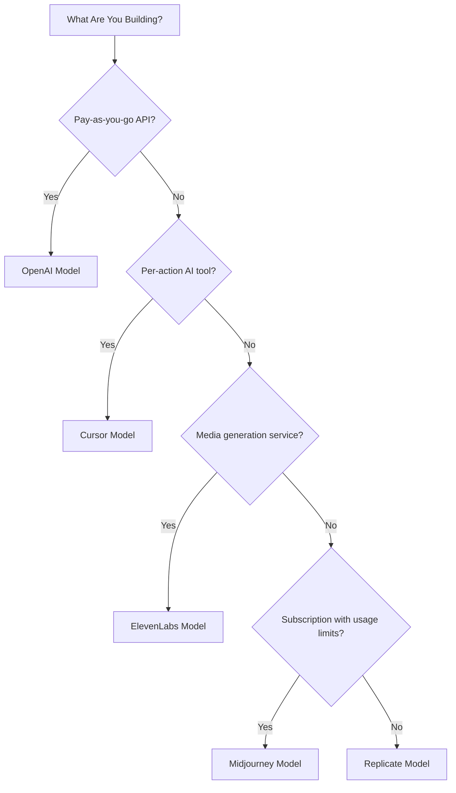

## Lima Model
| Aplikasi | Metrik Utama | Inovasi Unik | Fitur Dodo |
| :--- | :--- | :--- | :--- |
| OpenAI | Token (dinarasikan dalam fiat) | Kredit fiat prabayar dengan saldo yang tidak pernah kedaluwarsa | Penagihan Berbasis Kredit (Kredit Fiat) |
| Cursor | Permintaan Premium | Pengurangan kredit berbobot model (biaya berbeda per model) | Penagihan Berbasis Kredit (Unit Kustom) |
| ElevenLabs | Karakter | Kuota karakter dengan rollover + harga kelebihan bertingkat | Penagihan Berbasis Kredit (Rollover + Kelebihan) |
| Midjourney | Waktu GPU | "Mode Santai" fallback tak terbatas setelah kuota | Langganan + Meteran Penggunaan |
| Replicate | Detik Eksekusi | Pengukuran murni per detik spesifik perangkat keras | Penagihan Berdasarkan Penggunaan Murni |

## Memahami Pola Kredit
| Pola | Contoh | Fitur Dodo | Jenis Unit |
| :--- | :--- | :--- | :--- |
| Kredit fiat prabayar | OpenAI API (pengisian ulang kredit $5, tidak dapat ditarik) | Penagihan Berbasis Kredit (Kredit Fiat) | Unit virtual bernilai dolar |
| Kredit penggunaan virtual | Permintaan Premium Cursor, Karakter ElevenLabs | Penagihan Berbasis Kredit (Unit Kustom) | Unit arbitrer (permintaan, karakter) |
| Pengukuran konsumsi murni | Penagihan per detik Replicate | Penagihan Berdasarkan Penggunaan (Meteran) | Pengukuran langsung (detik, byte) |
| Langganan + kelebihan yang dimeterai | Jam Cepat Midjourney dengan fallback Relax | Langganan + Meteran Penggunaan | Berbasis waktu dengan ambang bebas |

<Info>
Kredit Fiat dalam Penagihan Berbasis Kredit Dodo merepresentasikan nilai dolar yang dinominasikan platform tanpa nilai moneter di luar ekosistem Anda. Pelanggan tidak bisa menariknya sebagai uang tunai.
</Info>

## Model Mana yang Harus Anda Gunakan?

- Membangun platform API bayar sesuai penggunaan: model OpenAI (Kredit Fiat)
- Membangun alat AI dengan harga per tindakan: model Cursor (Unit Kredit Kustom)
- Membangun layanan pembuatan media: model ElevenLabs (Kredit Rollover)
- Membangun layanan langganan dengan batas penggunaan: model Midjourney (Langganan + Meteran Penggunaan)
- Membangun platform infrastruktur/komputasi: model Replicate (Meteran Murni)

<CardGroup cols={2}>
  <Card title="OpenAI" icon="/images/logos/openai.svg" href="/developer-resources/billing-deconstructions/openai">
    Replikasikan model kredit prabayar berbasis token.
  </Card>
  <Card title="Cursor" icon="/images/logos/cursor.svg" href="/developer-resources/billing-deconstructions/cursor">
    Bangun batas penggunaan berbobot model.
  </Card>
  <Card title="ElevenLabs" icon="/images/logos/elevenlabs.svg" href="/developer-resources/billing-deconstructions/elevenlabs">
    Terapkan kuota karakter dengan rollover dan kelebihan.
  </Card>
  <Card title="Midjourney" icon="/images/logos/midjourney.svg" href="/developer-resources/billing-deconstructions/midjourney">
    Gabungkan langganan dengan fallback berbasis penggunaan.
  </Card>
  <Card title="Replicate" icon="/images/logos/replicate.svg" href="/developer-resources/billing-deconstructions/replicate">
    Siapkan pengukuran konsumsi murni per detik.
  </Card>
</CardGroup>

## Fitur Dodo

<CardGroup cols={2}>
  <Card title="Credit-Based Billing" href="/features/credit-based-billing">
    Kelola kredit prabayar dan unit virtual.
  </Card>
  <Card title="Usage-Based Billing" href="/features/usage-based-billing/introduction">
    Meter konsumsi secara real-time.
  </Card>
  <Card title="Subscriptions" href="/features/subscription">
    Tangani penagihan berulang dan manajemen paket.
  </Card>
  <Card title="Hybrid Billing" href="/features/hybrid-billing">
    Gabungkan berbagai model penagihan untuk fleksibilitas maksimum.
  </Card>
</CardGroup>

## Cetak Biru Pengambilan

Setiap dekonstruksi menyertakan integrasi dengan [Ingestion Blueprints](/features/usage-based-billing/ingestion-blueprints) Dodo, SDK pra-bangun yang menangani pelacakan event secara otomatis. Alih-alih menyusun event penggunaan secara manual, gunakan cetak biru untuk mendapatkan pengukuran siap produksi dalam hitungan menit.

<CardGroup cols={3}>
  <Card title="LLM Blueprint" icon="brain-circuit" href="/developer-resources/ingestion-blueprints/llm">
    Pelacakan token otomatis untuk OpenAI, Anthropic, Groq, dan lainnya.
  </Card>
  <Card title="Stream Blueprint" icon="tower-broadcast" href="/developer-resources/ingestion-blueprints/stream">
    Lacak bandwidth streaming audio dan video.
  </Card>
  <Card title="Time Range Blueprint" icon="clock" href="/developer-resources/ingestion-blueprints/time-range">
    Tagih berdasarkan durasi komputasi hingga milidetik.
  </Card>
</CardGroup>
