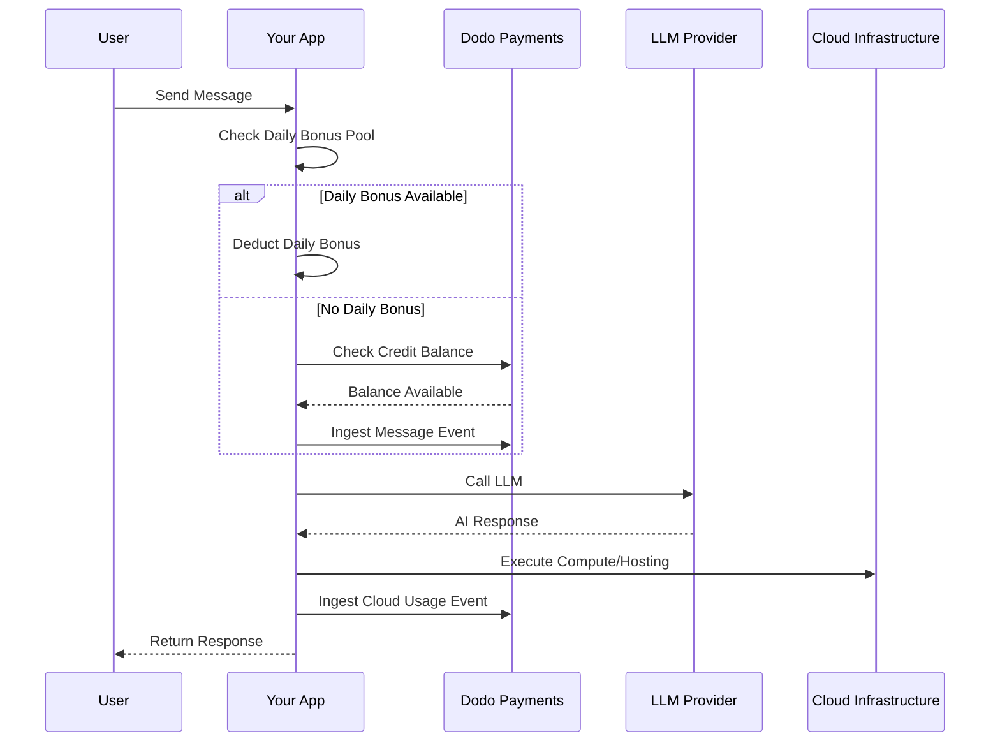

Lovable (lovable.dev) adalah pembangun aplikasi web berbasis AI yang menggunakan model langganan berbasis kredit. Tidak seperti sistem berbasis token, Lovable menyederhanakan pengalaman pengguna dengan mengenakan satu kredit per pesan. Model ini menggabungkan kumpulan kredit bulanan dengan tetesan bonus harian untuk mendorong keterlibatan yang konsisten sambil memungkinkan penggunaan yang meledak.

## Model Penagihan Lovable

Harga Lovable dibangun di sekitar kredit pesan dan penagihan terukur terpisah untuk infrastruktur cloud.

| Plan | Harga | Kredit Bulanan | Bonus Harian | Fitur Utama |
| :--- | :--- | :--- | :--- | :--- |
| Gratis | \$0/bulan | 0 | 5/hari (hingga 30/bulan) | Proyek publik saja |
| Pro | \$25/bulan | 100 | 5/hari (hingga total 150/bulan) | Isi ulang pada permintaan, Cloud + AI berbasis penggunaan, domain kustom |
| Bisnis | \$50/bulan | 100 | 5/hari | SSO, ruang kerja tim, template desain, pusat keamanan |
| Perusahaan | Kustom | Kustom | Kustom | SCIM, dukungan khusus, log audit |

- **Langganan berbasis kredit**: 1 kredit = 1 pesan/prompts ke AI.
- **Kredit dibagi di antara pengguna tak terbatas**: Kumpulan seluruh tim, bukan per-orang.
- **Kredit direset setiap siklus penagihan**: Kredit bulanan diperbarui pada saat perpanjangan.
- **Isi ulang kredit sesuai permintaan**: Pengguna dapat membeli lebih banyak kredit jika habis.
- **Penagihan Cloud + AI berbasis penggunaan terpisah**: Penagihan terukur untuk hosting dan komputasi.
- **Kredit bonus harian direset setiap hari**: Tetesan harian 5 kredit yang harus digunakan atau hilang.

## Apa yang Membuatnya Unik

- **Kesederhanaan berbasis pesan**: 1 kredit = 1 pesan terlepas dari kompleksitasnya. Tidak ada penghitungan token atau pembobotan model.
- **Tetesan harian + kumpulan bulanan hibrida**: 5 kredit bonus harian menciptakan insentif keterlibatan harian, sementara 100 kredit bulanan memungkinkan penggunaan yang meledak.
- **Kumpulan berbagi seluruh tim**: Kredit dibagi di antara pengguna tak terbatas dengan harga tim tetap, bukan per-orang.
- **Penagihan dua lapis**: Kredit untuk interaksi AI + penagihan terukur terpisah untuk infrastruktur cloud.

## Bangun Ini dengan Dodo Payments

Anda dapat mereplikasi model hibrida Lovable menggunakan hak kredit dan meter berbasis penggunaan Dodo Payments.

<Steps>
  <Step title="Create a Custom Unit Credit Entitlement">
    Definisikan sistem kredit pesan di dashboard Dodo Payments Anda. Hak ini menangani kumpulan kredit bulanan.

    - **Tipe Kredit**: Custom Unit
    - **Nama Unit**: "Messages"
    - **Presisi**: 0
    - **Kadaluwarsa Kredit**: 30 hari
    - **Kelebihan**: Dinonaktifkan (batas keras saat kredit mencapai 0)
  </Step>

  <Step title="Create Subscription Products">
    Buat rencana Anda dan lampirkan hak kredit. Untuk rencana Gratis, Anda akan menangani bonus harian melalui logika aplikasi.

    - **Gratis**: \$0/bulan, 0 kredit (bonus harian ditangani oleh logika aplikasi)
    - **Pro**: \$25/bulan, 100 kredit/siklus, lampirkan hak kredit
    - **Bisnis**: \$50/bulan, 100 kredit/siklus, lampirkan hak kredit

    ```typescript
    import DodoPayments from 'dodopayments';

    const client = new DodoPayments({
      bearerToken: process.env.DODO_PAYMENTS_API_KEY,
    });

    const session = await client.checkoutSessions.create({
      product_cart: [
        { product_id: 'prod_lovable_pro', quantity: 1 }
      ],
      customer: { email: 'user@example.com' },
      return_url: 'https://lovable.dev/dashboard'
    });
    ```

  </Step>

  <Step title="Create a Usage Meter for Cloud + AI">
    Lovable menagih terpisah untuk infrastruktur cloud. Buat meteran untuk melacak biaya ini.

    - **Nama Meter**: `cloud.compute_seconds`
    - **Agregasi**: Jumlah pada properti `compute_seconds`

    Lampirkan meteran ini ke produk langganan Anda dengan harga per unit. Saat Anda memasukkan penggunaan, Dodo menghitung biaya berdasarkan tarif Anda.

    ```typescript
    await client.usageEvents.ingest({
      events: [{
        event_id: `compute_${Date.now()}`,
        customer_id: 'cust_123',
        event_name: 'cloud.compute_seconds',
        timestamp: new Date().toISOString(),
        metadata: {
          compute_seconds: 3600,
          project_id: 'proj_abc'
        }
      }]
    });
    ```

  </Step>

  <Step title="Implement Daily Bonus Credits (Application Logic)">
    Tetesan bonus harian ditangani pada tingkat aplikasi. Anda dapat menggunakan cron job untuk memberikan kredit ini atau melacaknya secara terpisah dalam database Anda.

    Untuk melacak penggunaan kredit bonus ini di Dodo tanpa menghabiskan saldo hak utama segera, Anda dapat menggunakan nama acara terpisah atau menangani logika dalam aplikasi Anda untuk memeriksa kumpulan bonus terlebih dahulu.

    ```typescript
    // Example cron job logic (pseudo-code)
    // Every day at midnight UTC:
    // 1. Reset 'daily_bonus_used' to 0 for all users in your DB
    
    // When a user sends a message:
    async function handleMessage(userId: string) {
      const user = await db.users.findUnique({ where: { id: userId } });
      
      if (user.daily_bonus_used < 5) {
        // Use daily bonus
        await db.users.update({
          where: { id: userId },
          data: { daily_bonus_used: { increment: 1 } }
        });
        // Track for analytics but don't deduct from Dodo credits yet
        await client.usageEvents.ingest({
          events: [{
            event_id: `msg_bonus_${Date.now()}`,
            customer_id: userId,
            event_name: 'ai.message.bonus',
            timestamp: new Date().toISOString(),
            metadata: { type: 'daily_bonus' }
          }]
        });
      } else {
        // Deduct from Dodo credit entitlement
        await client.usageEvents.ingest({
          events: [{
            event_id: `msg_${Date.now()}`,
            customer_id: userId,
            event_name: 'ai.message',
            timestamp: new Date().toISOString(),
            metadata: { type: 'subscription_credit' }
          }]
        });
      }
    }
    ```

  </Step>

  <Step title="Send Usage Events for Messages">
    Lacak setiap pesan AI sebagai acara penggunaan. Hubungkan acara `ai.message` ke hak kredit "Messages" Anda di dashboard Dodo.

    ```typescript
    await client.usageEvents.ingest({
      events: [{
        event_id: `msg_${Date.now()}`,
        customer_id: 'cust_123',
        event_name: 'ai.message',
        timestamp: new Date().toISOString(),
        metadata: {
          content_length: 450,
          project_id: 'proj_abc',
          feature_type: 'editor'
        }
      }]
    });
    ```

  </Step>

  <Step title="Handle Webhooks for Low Balance">
    Beritahu pengguna ketika kredit mereka hampir habis sehingga mereka dapat mengisi ulang atau meningkatkan.

    ```typescript
    import DodoPayments from 'dodopayments';
    import express from 'express';

    const app = express();
    app.use(express.raw({ type: 'application/json' }));

    const client = new DodoPayments({
      bearerToken: process.env.DODO_PAYMENTS_API_KEY,
      webhookKey: process.env.DODO_PAYMENTS_WEBHOOK_KEY,
    });

    app.post('/webhooks/dodo', async (req, res) => {
      try {
        const event = client.webhooks.unwrap(req.body.toString(), {
          headers: {
            'webhook-id': req.headers['webhook-id'] as string,
            'webhook-signature': req.headers['webhook-signature'] as string,
            'webhook-timestamp': req.headers['webhook-timestamp'] as string,
          },
        });

        if (event.type === 'credit.balance_low') {
          const { customer_id, available_balance } = event.data;
          await notifyUser(customer_id, `Your balance is low: ${available_balance} messages left.`);
        }

        res.json({ received: true });
      } catch (error) {
        res.status(401).json({ error: 'Invalid signature' });
      }
    });
    ```

  </Step>
</Steps>

## Mempercepat dengan Cetak Biru Ingesti LLM

[Cetak Biru Ingesti LLM](/developer-resources/ingestion-blueprints/llm) menyederhanakan pelacakan dengan membungkus klien AI Anda.

```typescript
import { createLLMTracker } from '@dodopayments/ingestion-blueprints';
import OpenAI from 'openai';

const tracker = createLLMTracker({
  apiKey: process.env.DODO_PAYMENTS_API_KEY,
  environment: 'live_mode',
  eventName: 'ai.message',
});

const trackedClient = tracker.wrap({
  client: new OpenAI(),
  customerId: 'cust_123',
});

// Automatically tracks the message and deducts 1 credit (if configured)
await trackedClient.chat.completions.create({
  model: 'gpt-4o',
  messages: [{ role: 'user', content: 'Build a landing page' }],
});
```

<Tip>
  Lihat [dokumentasi cetak biru lengkap](/developer-resources/ingestion-blueprints/llm) untuk detail lebih lanjut tentang pelacakan otomatis.
</Tip>

## Gambaran Arsitektur



## Fitur Utama Dodo yang Digunakan

Jelajahi fitur-fitur yang membuat implementasi ini mungkin dilakukan.

<CardGroup cols={2}>
  <Card title="Credit-Based Billing" icon="coins" href="/features/credit-based-billing">
    Kelola kredit pesan dan kumpulan tim yang dibagikan.
  </Card>
  <Card title="Subscriptions" icon="calendar" href="/features/subscription">
    Siapkan rencana berulang untuk tingkat Pro dan Bisnis.
  </Card>
  <Card title="Usage-Based Billing" icon="chart-line" href="/features/usage-based-billing/introduction">
    Meter penggunaan infrastruktur cloud secara terpisah dari kredit AI.
  </Card>
  <Card title="Event Ingestion" icon="bolt" href="/features/usage-based-billing/event-ingestion">
    Kirim pesan volume tinggi dan acara komputasi ke Dodo.
  </Card>
  <Card title="Webhooks" icon="webhook" href="/developer-resources/webhooks/intents/credit">
    Otomatiskan pemberitahuan untuk saldo kredit rendah.
  </Card>
  <Card title="LLM Ingestion Blueprint" icon="brain-circuit" href="/developer-resources/ingestion-blueprints/llm">
    Sederhanakan pelacakan penggunaan AI dengan integrasi pre-built.
  </Card>
</CardGroup>
