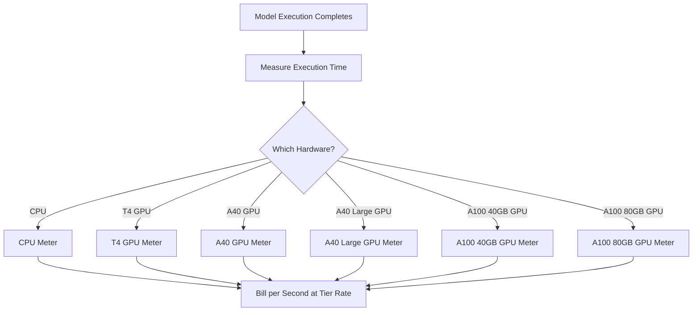

Replicate adalah platform untuk menjalankan model pembelajaran mesin sumber terbuka di cloud. Model penagihan mereka adalah salah satu contoh paling murni dari penetapan harga berbasis penggunaan di industri AI. Tidak ada biaya langganan bulanan dan tidak ada tarif tetap per pengoperasian model. Sebaliknya, mereka mengenakan biaya untuk jumlah waktu komputasi yang tepat yang dikonsumsi, hingga detik, dengan tarif yang bervariasi berdasarkan perangkat keras yang digunakan.

Pendekatan ini bekerja baik untuk beban kerja AI karena waktu eksekusi tidak dapat diprediksi. Seorang pengguna mungkin menjalankan model ringan selama beberapa detik atau model generatif besar selama beberapa menit. Dengan menghubungkan biaya dengan sumber daya komputasi daripada model itu sendiri, Replicate menjaga harga tetap transparan dan dapat diskalakan.

## Bagaimana Replicate Menagih

Harga Replicate tidak bergantung pada model spesifik yang dijalankan. Apakah Anda sedang membuat gambar dengan SDXL atau menjalankan Llama 3, penagihan ditentukan oleh tingkatan perangkat keras dan durasi eksekusi. Ini memungkinkan mereka untuk menghosting ribuan model sumber terbuka tanpa memerlukan rencana harga terpisah untuk masing-masing.

| Perangkat Keras | Harga per Detik | Harga per Jam |
| :--- | :--- | :--- |
| NVIDIA CPU | \$0.000100 | \$0.36 |
| NVIDIA T4 GPU | \$0.000225 | \$0.81 |
| NVIDIA A40 GPU | \$0.000575 | \$2.07 |
| NVIDIA A40 (Besar) GPU | \$0.000725 | \$2.61 |
| NVIDIA A100 (40GB) GPU | \$0.001150 | \$4.14 |
| NVIDIA A100 (80GB) GPU | \$0.001400 | \$5.04 |



1. **Tarif Spesifik Perangkat Keras**: Biaya per detik bervariasi berdasarkan sumber daya komputasi yang diperlukan. Setiap tingkatan perangkat keras memiliki titik harga yang berbeda.
2. **Model Berbasis Penggunaan Murni**: Tidak ada biaya bulanan, tidak ada kelebihan, dan tidak ada batasan. Pengguna ditagih untuk waktu komputasi yang tepat (misalnya, "12,4 detik pada A100") daripada per-generasi.
3. **Kelengkapan Per Detik**: Penyedia cloud tradisional menagih per jam atau menit, mengakibatkan pemborosan pada tugas yang bersifat singkat. Penagihan per detik menghilangkan ketidakefisienan ini untuk eksperimen kecil maupun beban kerja produksi besar.

<Info>
Waktu mulai dingin juga dapat ditagihkan. Permintaan pertama pada model sering kali memerlukan waktu 10-30 detik untuk memuat model ke dalam memori. Waktu pemuatan ini ditagih dengan tarif yang sama seperti waktu eksekusi.
</Info>
## Apa yang Membuatnya Unik

* **Pengukuran spesifik perangkat keras:** Model yang sama memiliki biaya lebih tinggi di perangkat keras yang lebih baik. Pengguna memilih antara kecepatan dan biaya. GPU T4 berguna untuk tugas yang tidak sensitif terhadap waktu, sementara A100 menangani aplikasi real-time.
* **Kelengkapan per detik:** Penagihan dihitung hingga ke detik, sehingga pengguna tidak pernah dikenakan biaya berlebihan untuk tugas singkat.
* **Tidak ada langganan:** Tidak ada komitmen untuk memulai. Dapat ditingkatkan tanpa batas dengan penggunaan, membuatnya ideal untuk startup dan pengembang yang bereksperimen dengan berbagai model.
* **Model-agnostik:** Logika penagihan tetap sama terlepas dari jenis tugas (pembuatan gambar, pemrosesan teks, transkripsi audio, atau sintesis video). Ini memungkinkan platform mendukung ekosistem model yang luas tanpa tabel harga yang rumit.

## Bangun Ini dengan Dodo Payments

Anda dapat meniru model penagihan ini menggunakan fitur penagihan berbasis penggunaan Dodo Payments. Kuncinya adalah menggunakan beberapa meteran untuk melacak tingkatan perangkat keras yang berbeda dan menghubungkannya ke satu produk.

<Steps>
  <Step title="Create Usage Meters (One Per Hardware Class)">
    Buat meteran terpisah untuk setiap tingkatan perangkat keras. Setiap jenis perangkat keras memiliki biaya per detik yang berbeda, sehingga pengukuran independen memungkinkan Dodo memberi harga berbeda untuk setiap tingkatan dan menyediakan penagihan mendetail.

    | Nama Meteran | Nama Acara | Aggregation | Property |
    | :--- | :--- | :--- | :--- |
    | CPU Compute | `compute.cpu` | Sum | `execution_seconds` |
    | GPU T4 Compute | `compute.gpu_t4` | Sum | `execution_seconds` |
    | GPU A40 Compute | `compute.gpu_a40` | Sum | `execution_seconds` |
    | GPU A40 Large Compute | `compute.gpu_a40_large` | Sum | `execution_seconds` |
    | GPU A100 40GB Compute | `compute.gpu_a100_40` | Sum | `execution_seconds` |
    | GPU A100 80GB Compute | `compute.gpu_a100_80` | Sum | `execution_seconds` |

    Agregasi `Sum` pada properti `execution_seconds` menghitung total waktu komputasi per tingkatan perangkat keras selama periode penagihan.
  </Step>

  <Step title="Create a Usage-Based Product">
    Buat produk baru di dasbor Dodo Payments:

    * **Jenis Penetapan Harga:** Penggunaan Berdasarkan Penggunaan
    * **Harga Dasar:** \$0/bulan (tidak ada biaya langganan)
    * **Frekuensi Penagihan:** Bulanan

    Lampirkan semua meteran dengan harga per-unit mereka:

    | Meteran | Harga Per Unit (per detik) |
    | :--- | :--- |
    | compute.cpu | \$0.000100 |
    | compute.gpu_t4 | \$0.000225 |
    | compute.gpu_a40 | \$0.000575 |
    | compute.gpu_a40_large | \$0.000725 |
    | compute.gpu_a100_40 | \$0.001150 |
    | compute.gpu_a100_80 | \$0.001400 |

    Tetapkan **Ambang Batas Gratis** ke 0 untuk semua meteran. Setiap detik eksekusi dapat ditagihkan.
  </Step>

  <Step title="Send Usage Events">
    Kirimkan acara penggunaan ke Dodo setiap kali eksekusi model selesai. Sertakan `event_id` yang unik untuk setiap prediksi untuk memastikan idempotensi.

    ```typescript
    import DodoPayments from 'dodopayments';

    type HardwareTier = 'cpu' | 'gpu_t4' | 'gpu_a40' | 'gpu_a40_large' | 'gpu_a100_40' | 'gpu_a100_80';

    const client = new DodoPayments({
      bearerToken: process.env.DODO_PAYMENTS_API_KEY,
    });

    async function trackModelExecution(
      customerId: string,
      modelId: string,
      hardware: HardwareTier,
      executionSeconds: number,
      predictionId: string
    ) {
      const eventName = `compute.${hardware}`;

      await client.usageEvents.ingest({
        events: [{
          event_id: `pred_${predictionId}`,
          customer_id: customerId,
          event_name: eventName,
          timestamp: new Date().toISOString(),
          metadata: {
            execution_seconds: executionSeconds,
            model_id: modelId,
            hardware: hardware
          }
        }]
      });
    }

    // Example: SDXL image generation on A100
    await trackModelExecution(
      'cus_abc123',
      'stability-ai/sdxl',
      'gpu_a100_80',
      8.3,  // 8.3 seconds of A100 time
      'pred_xyz789'
    );
    ```

  </Step>

  <Step title="Measure Execution Time Precisely">
    Bungkus eksekusi model Anda dengan penanganan penentuan waktu yang tepat menggunakan `performance.now()`. Pembulatan hingga sepersepuluh detik terdekat untuk penagihan.

    ```typescript
    async function runModelWithMetering(
      customerId: string,
      modelId: string,
      hardware: HardwareTier,
      input: Record<string, unknown>
    ) {
      const predictionId = `pred_${Date.now()}`;
      const startTime = performance.now();

      try {
        const result = await executeModel(modelId, input, hardware);
        const executionSeconds = (performance.now() - startTime) / 1000;
        const billedSeconds = Math.round(executionSeconds * 10) / 10;

        await trackModelExecution(
          customerId,
          modelId,
          hardware,
          billedSeconds,
          predictionId
        );

        return result;
      } catch (error) {
        // Still bill for compute time even on failure
        const executionSeconds = (performance.now() - startTime) / 1000;
        if (executionSeconds > 1) {
          await trackModelExecution(
            customerId,
            modelId,
            hardware,
            Math.round(executionSeconds * 10) / 10,
            predictionId
          );
        }
        throw error;
      }
    }
    ```

  </Step>

  <Step title="Create Checkout">
    Ketika pengguna mendaftar, buat sesi checkout untuk produk berbasis penggunaan. Dodo menangani penagihan berulang dan penagihan secara otomatis.

    ```typescript
    const session = await client.checkoutSessions.create({
      product_cart: [
        { product_id: 'pdt_compute_payg', quantity: 1 }
      ],
      customer: { email: 'ml-engineer@company.com' },
      return_url: 'https://yourplatform.com/dashboard'
    });
    ```

  </Step>
</Steps>

## Percepat dengan Blueprint Ingesti Rentang Waktu

[Blueprint Ingesti Rentang Waktu](/developer-resources/ingestion-blueprints/time-range) menyederhanakan pelacakan komputasi per detik. Buat satu instance ingest per tingkatan perangkat keras dan gunakan `trackTimeRange` untuk pengiriman acara yang lebih bersih.

```bash
npm install @dodopayments/ingestion-blueprints
```

```typescript
import { Ingestion, trackTimeRange } from '@dodopayments/ingestion-blueprints';

// Create one ingestion instance per hardware tier
function createHardwareIngestion(hardware: string) {
  return new Ingestion({
    apiKey: process.env.DODO_PAYMENTS_API_KEY,
    environment: 'live_mode',
    eventName: `compute.${hardware}`,
  });
}

const ingestions: Record<string, Ingestion> = {
  cpu: createHardwareIngestion('cpu'),
  gpu_t4: createHardwareIngestion('gpu_t4'),
  gpu_a40: createHardwareIngestion('gpu_a40'),
  gpu_a40_large: createHardwareIngestion('gpu_a40_large'),
  gpu_a100_40: createHardwareIngestion('gpu_a100_40'),
  gpu_a100_80: createHardwareIngestion('gpu_a100_80'),
};

// Track execution after a model run completes
const startTime = performance.now();
const result = await executeModel(modelId, input, hardware);
const durationMs = performance.now() - startTime;

await trackTimeRange(ingestions[hardware], {
  customerId: customerId,
  durationMs: durationMs,
  metadata: {
    model_id: modelId,
    hardware: hardware,
  },
});
```

Blueprint menangani format durasi dan konstruksi acara. Dalam kombinasi dengan instance ingest per perangkat keras, pola ini secara bersih memetakan ke pengukuran multi-tingkat dari Replicate.

<Tip>
Untuk pekerjaan jangka panjang, gabungkan Blueprint Rentang Waktu dengan pelacakan heartbeat berbasis interval. Lihat [dokumentasi blueprint lengkap](/developer-resources/ingestion-blueprints/time-range) untuk pola canggih.
</Tip>

## Estimasi Biaya untuk Pengguna

Karena penagihan berbasis penggunaan dapat tidak dapat diprediksi, berikan pengguna biaya perkiraan sebelum mereka menjalankan model. Ini mengurangi tagihan kejutan dan membangun kepercayaan.

### Contoh Perhitungan Biaya

| Model | Perangkat Keras | Rata-rata Waktu | Biaya Per Run |
| :--- | :--- | :--- | :--- |
| SDXL (gambar) | A100 80GB | ~8 detik | ~\$0.0112 |
| Llama 3 (teks) | A100 40GB | ~3 detik | ~\$0.0035 |
| Whisper (audio) | GPU T4 | ~15 detik | ~\$0.0034 |

### Membangun Kalkulator Biaya

```typescript
function estimateCost(hardware: HardwareTier, estimatedSeconds: number): number {
  const rates: Record<HardwareTier, number> = {
    'cpu': 0.000100,
    'gpu_t4': 0.000225,
    'gpu_a40': 0.000575,
    'gpu_a40_large': 0.000725,
    'gpu_a100_40': 0.001150,
    'gpu_a100_80': 0.001400
  };

  return Number((rates[hardware] * estimatedSeconds).toFixed(4));
}

// Show the user before running: "This will cost approximately $0.0098"
const estimate = estimateCost('gpu_a100_80', 8.5);
```

## Enterprise: Kapasitas Terbatas

Untuk pelanggan perusahaan yang memerlukan ketersediaan terjamin dan tidak ada waktu mulai dingin, Replicate menawarkan "Instansi Pribadi" dengan tarif per jam yang tetap.

Dengan Dodo Payments, modelkan ini sebagai produk berlangganan:

* **Jenis Produk:** Langganan
* **Harga:** Harga bulanan tetap (misalnya, "Instansi A100 Terbatas - \$500/bulan")
* **Siklus Penagihan:** Bulanan

Anda tetap dapat mengirimkan acara penggunaan untuk pemantauan dan analitik, tetapi langganan mencakup biaya. Seiring dengan meningkatnya volume pengguna, beralih dari bayar sesuai penggunaan ke kapasitas terjamin sering kali menjadi lebih efektif biaya.

## Canggih: Pengukuran Heartbeat

Untuk tugas yang memakan waktu beberapa menit atau jam, mengirimkan satu acara di akhir adalah risiko. Jika proses mengalami crash, Anda kehilangan data penggunaan. Pendekatan yang lebih baik adalah mengirimkan acara penggunaan setiap 30-60 detik selama eksekusi.

```typescript
async function runLongTaskWithHeartbeat(
  customerId: string,
  modelId: string,
  hardware: HardwareTier
) {
  const predictionId = `pred_${Date.now()}`;
  let totalSeconds = 0;

  const heartbeatInterval = setInterval(async () => {
    try {
      await trackModelExecution(
        customerId,
        modelId,
        hardware,
        30,
        `${predictionId}_${totalSeconds}`
      );
      totalSeconds += 30;
    } catch (error) {
      console.error('Heartbeat tracking failed:', error, { predictionId, totalSeconds });
    }
  }, 30000);

  try {
    await executeLongTask();
  } finally {
    clearInterval(heartbeatInterval);
  }
}
```

## Fitur Utama Dodo yang Digunakan

<CardGroup cols={2}>
  <Card title="Usage-Based Billing" icon="chart-line" href="/features/usage-based-billing/introduction">
    Mengatur produk yang menagih berdasarkan konsumsi.
  </Card>
  <Card title="Meters" icon="gauge" href="/features/usage-based-billing/meters">
    Mendefinisikan metrik yang ingin Anda lacak dan tagih.
  </Card>
  <Card title="Event Ingestion" icon="bolt" href="/features/usage-based-billing/event-ingestion">
    Mengirimkan data penggunaan ke Dodo secara real-time.
  </Card>
  <Card title="Subscriptions" icon="calendar" href="/features/subscription">
    Mengelola penagihan berulang untuk kapasitas terbatas dan rencana perusahaan.
  </Card>
  <Card title="Time Range Blueprint" icon="clock" href="/developer-resources/ingestion-blueprints/time-range">
    Pelacakan komputasi per detik dengan pembantu durasi.
  </Card>
</CardGroup>
