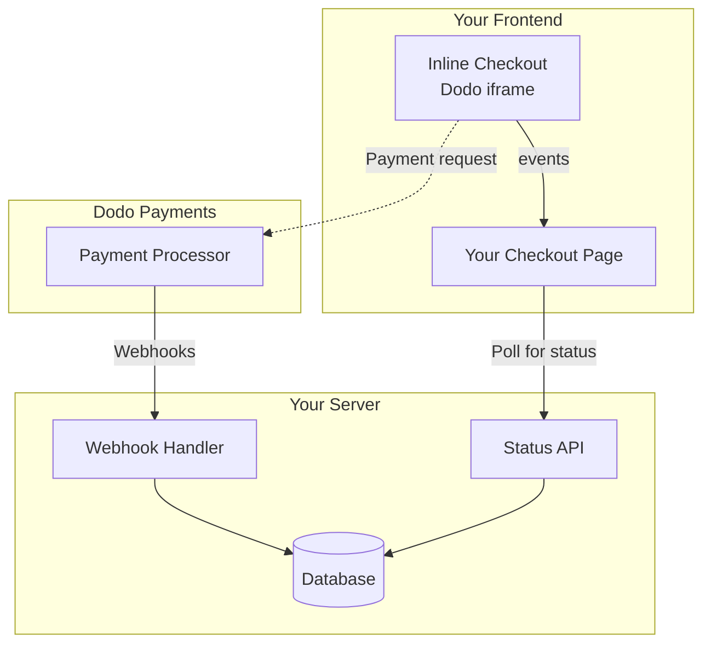

## Ikhtisar

Checkout inline memungkinkan Anda untuk membuat pengalaman checkout yang sepenuhnya terintegrasi yang menyatu dengan situs web atau aplikasi Anda. Berbeda dengan [overlay checkout](/developer-resources/overlay-checkout), yang muncul sebagai modal di atas halaman Anda, checkout inline menyisipkan formulir pembayaran langsung ke dalam tata letak halaman Anda.

Dengan menggunakan checkout inline, Anda dapat:

- Membuat pengalaman checkout yang sepenuhnya terintegrasi dengan aplikasi atau situs web Anda
- Membiarkan Dodo Payments dengan aman menangkap informasi pelanggan dan pembayaran dalam bingkai checkout yang dioptimalkan
- Menampilkan item, total, dan informasi lain dari Dodo Payments di halaman Anda
- Menggunakan metode dan peristiwa SDK untuk membangun pengalaman checkout yang lebih canggih

<Frame>
    
</Frame>

## Cara Kerjanya

Checkout inline bekerja dengan menyisipkan bingkai Dodo Payments yang aman ke dalam situs web atau aplikasi Anda.

Bingkai checkout menangani pengumpulan informasi pelanggan dan menangkap detail pembayaran. Halaman Anda menampilkan daftar item, total, dan opsi untuk mengubah apa yang ada di checkout. SDK memungkinkan halaman Anda dan bingkai checkout berinteraksi satu sama lain.

Dodo Payments secara otomatis membuat langganan ketika checkout selesai, siap untuk Anda provision.

<Note>
Frame checkout inline menangani semua informasi pembayaran sensitif dengan aman, memastikan kepatuhan PCI tanpa perlu sertifikasi tambahan dari pihak Anda.
</Note>

## Apa yang Membuat Checkout Inline yang Baik?

Penting bagi pelanggan untuk mengetahui siapa yang mereka beli, apa yang mereka beli, dan berapa banyak yang mereka bayar.

Untuk membangun checkout inline yang sesuai dan dioptimalkan untuk konversi, implementasi Anda harus mencakup:

<Frame caption="Example inline checkout layout showing required elements">
    
</Frame>

1. **Informasi berulang**: Jika berulang, seberapa sering itu terjadi dan total yang harus dibayar saat pembaruan. Jika percobaan, berapa lama percobaan berlangsung.
2. **Deskripsi item**: Deskripsi tentang apa yang dibeli.
3. **Total transaksi**: Total transaksi, termasuk subtotal, total pajak, dan total keseluruhan. Pastikan untuk menyertakan mata uang juga.
4. **Footer Dodo Payments**: Bingkai checkout inline lengkap, termasuk footer checkout yang memiliki informasi tentang Dodo Payments, syarat penjualan kami, dan kebijakan privasi kami.
5. **Kebijakan pengembalian**: Tautan ke kebijakan pengembalian Anda, jika berbeda dari kebijakan pengembalian standar Dodo Payments.

<Warning>
Selalu tampilkan frame checkout inline secara lengkap, termasuk footer. Menghapus atau menyembunyikan informasi hukum melanggar persyaratan kepatuhan.
</Warning>

## Perjalanan Pelanggan

Alur checkout ditentukan oleh konfigurasi sesi checkout Anda. Tergantung pada bagaimana Anda mengonfigurasi sesi checkout, pelanggan akan mengalami checkout yang mungkin menyajikan semua informasi di satu halaman atau di beberapa langkah.

<Steps>
<Step title="Customer opens checkout">

Anda dapat membuka inline checkout dengan melewatkan item atau transaksi yang sudah ada. Gunakan SDK untuk menampilkan dan memperbarui informasi pada halaman, dan metode SDK untuk memperbarui item berdasarkan interaksi pelanggan.
    

</Step>

<Step title="Customer enters their details">

Checkout inline pertama-tama meminta pelanggan untuk memasukkan alamat email mereka, memilih negara mereka, dan (di mana diperlukan) memasukkan kode pos atau kode pos mereka. Langkah ini mengumpulkan semua informasi yang diperlukan untuk menentukan pajak dan opsi pembayaran yang tersedia.

Anda dapat mengisi detail pelanggan sebelumnya dan menyajikan alamat yang disimpan untuk memperlancar pengalaman.

</Step>

<Step title="Customer selects payment method">

Setelah memasukkan detail mereka, pelanggan disajikan dengan metode pembayaran yang tersedia dan formulir pembayaran. Opsi mungkin termasuk kartu kredit atau debit, PayPal, Apple Pay, Google Pay, dan metode pembayaran lokal lainnya berdasarkan lokasi mereka.

Tampilkan metode pembayaran yang disimpan jika tersedia untuk mempercepat checkout.


</Step>

<Step title="Checkout completed">

Dodo Payments mengarahkan setiap pembayaran ke pengakuisisi terbaik untuk penjualan tersebut untuk mendapatkan peluang terbaik untuk sukses. Pelanggan memasuki alur kerja sukses yang dapat Anda bangun.


</Step>

<Step title="Dodo Payments creates subscription">

Dodo Payments secara otomatis membuat langganan untuk pelanggan, siap untuk Anda provision. Metode pembayaran yang digunakan pelanggan disimpan untuk pembaruan atau perubahan langganan.


</Step>
</Steps>

## Memulai dengan Cepat

Mulai dengan Dodo Payments Inline Checkout hanya dalam beberapa baris kode:

```typescript
import { DodoPayments } from "dodopayments-checkout";

// Initialize the SDK for inline mode
DodoPayments.Initialize({
  mode: "test",
  displayType: "inline",
  onEvent: (event) => {
    console.log("Checkout event:", event);
  },
});

// Open checkout in a specific container
DodoPayments.Checkout.open({
  checkoutUrl: "https://test.dodopayments.com/session/cks_123",
  elementId: "dodo-inline-checkout" // ID of the container element
});
```

<Tip>
Pastikan Anda memiliki elemen kontainer dengan `id` yang sesuai di halaman Anda: `<div id="dodo-inline-checkout"></div>`.
</Tip>

## Panduan Integrasi Langkah-demi-Langkah

<Steps>
<Step title="Install the SDK">

Instal Dodo Payments Checkout SDK:

<CodeGroup>

```bash npm
npm install dodopayments-checkout
```

```bash yarn
yarn add dodopayments-checkout
```

```bash pnpm
pnpm add dodopayments-checkout
```

</CodeGroup>

</Step>

<Step title="Initialize the SDK for Inline Display">

Inisialisasi SDK dan tentukan `displayType: 'inline'`. Anda juga harus mendengarkan event `checkout.breakdown` untuk memperbarui UI Anda dengan perhitungan pajak dan total secara real-time.

```typescript
import { DodoPayments } from "dodopayments-checkout";

DodoPayments.Initialize({
  mode: "test",
  displayType: "inline",
  onEvent: (event) => {
    if (event.event_type === "checkout.breakdown") {
      const breakdown = event.data?.message;
      // Update your UI with breakdown.subTotal, breakdown.tax, breakdown.total, etc.
    }
  },
});
```

</Step>

<Step title="Create a Container Element">

Tambahkan elemen ke HTML Anda di mana bingkai checkout akan disuntikkan:

```html
<div id="dodo-inline-checkout"></div>
```

</Step>

<Step title="Open the Checkout">

Panggil `DodoPayments.Checkout.open()` dengan `checkoutUrl` dan `elementId` dari kontainer Anda:

```typescript
DodoPayments.Checkout.open({
  checkoutUrl: "https://test.dodopayments.com/session/cks_123",
  elementId: "dodo-inline-checkout"
});
```

</Step>

<Step title="Test Your Integration">

1. Mulai server pengembangan Anda:

```bash
npm run dev
```

2. Uji alur checkout:
   - Masukkan email dan detail alamat Anda di bingkai inline.
   - Verifikasi bahwa ringkasan pesanan kustom Anda diperbarui secara real-time.
   - Uji alur pembayaran menggunakan kredensial uji.
   - Konfirmasi pengalihan berfungsi dengan benar.

<Check>
Anda akan melihat event `checkout.breakdown` dicatat di konsol browser Anda jika Anda menambahkan console log pada callback `onEvent`.
</Check>

</Step>

<Step title="Go Live">

Ketika Anda siap untuk produksi:

1. Ubah mode menjadi `'live'`:

```typescript
DodoPayments.Initialize({
  mode: "live",
  displayType: "inline",
  onEvent: (event) => {
    // Handle events
  }
});
```

2. Perbarui URL checkout Anda untuk menggunakan sesi checkout langsung dari backend Anda.
3. Uji alur lengkap di produksi.

</Step>
</Steps>

## Contoh React Lengkap

Contoh ini menunjukkan cara mengimplementasikan ringkasan pesanan kustom bersamaan dengan checkout inline, menjaga keduanya tetap sinkron menggunakan event `checkout.breakdown`.

```tsx
"use client";

import { useEffect, useState } from 'react';
import { DodoPayments, CheckoutBreakdownData } from 'dodopayments-checkout';

export default function CheckoutPage() {
  const [breakdown, setBreakdown] = useState<Partial<CheckoutBreakdownData>>({});

  useEffect(() => {
    // 1. Initialize the SDK
    DodoPayments.Initialize({
      mode: 'test',
      displayType: 'inline',
      onEvent: (event) => {
        // 2. Listen for the 'checkout.breakdown' event
        if (event.event_type === "checkout.breakdown") {
          const message = event.data?.message as CheckoutBreakdownData;
          if (message) setBreakdown(message);
        }
      }
    });

    // 3. Open the checkout in the specified container
    DodoPayments.Checkout.open({
      checkoutUrl: 'https://test.dodopayments.com/session/cks_123',
      elementId: 'dodo-inline-checkout'
    });

    return () => DodoPayments.Checkout.close();
  }, []);

  const format = (amt: number | null | undefined, curr: string | null | undefined) => 
    amt != null && curr ? `${curr} ${(amt/100).toFixed(2)}` : '0.00';

  const currency = breakdown.currency ?? breakdown.finalTotalCurrency ?? '';

  return (
    <div className="flex flex-col md:flex-row min-h-screen">
      {/* Left Side - Checkout Form */}
      <div className="w-full md:w-1/2 flex items-center">
        <div id="dodo-inline-checkout" className='w-full' />
      </div>

      {/* Right Side - Custom Order Summary */}
      <div className="w-full md:w-1/2 p-8 bg-gray-50">
        <h2 className="text-2xl font-bold mb-4">Order Summary</h2>
        <div className="space-y-2">
          {breakdown.subTotal && (
            <div className="flex justify-between">
              <span>Subtotal</span>
              <span>{format(breakdown.subTotal, currency)}</span>
            </div>
          )}
          {breakdown.discount && (
            <div className="flex justify-between">
              <span>Discount</span>
              <span>{format(breakdown.discount, currency)}</span>
            </div>
          )}
          {breakdown.tax != null && (
            <div className="flex justify-between">
              <span>Tax</span>
              <span>{format(breakdown.tax, currency)}</span>
            </div>
          )}
          <hr />
          {(breakdown.finalTotal ?? breakdown.total) && (
            <div className="flex justify-between font-bold text-xl">
              <span>Total</span>
              <span>{format(breakdown.finalTotal ?? breakdown.total, breakdown.finalTotalCurrency ?? currency)}</span>
            </div>
          )}
        </div>
      </div>
    </div>
  );
}

```

## Referensi API

### Konfigurasi

#### Opsi Inisialisasi

```typescript
interface InitializeOptions {
  mode: "test" | "live";
  displayType: "inline"; // Required for inline checkout
  onEvent: (event: CheckoutEvent) => void;
}
```

| Opsi | Tipe | Wajib | Deskripsi |
|--------|------|----------|-------------|
| `mode` | `"test" \| "live"` | Ya | Mode lingkungan. |
| `displayType` | `"inline" \| "overlay"` | Ya | Harus diatur ke `"inline"` untuk menyematkan checkout. |
| `onEvent` | `function` | Ya | Fungsi callback untuk menangani event checkout. |

#### Opsi Checkout

```typescript
export type FontSize = "xs" | "sm" | "md" | "lg" | "xl" | "2xl";
export type FontWeight = "normal" | "medium" | "bold" | "extraBold";

interface CheckoutOptions {
  checkoutUrl: string;
  elementId: string; // Required for inline checkout
  options?: {
    showTimer?: boolean;
    showSecurityBadge?: boolean;
    payButtonText?: string;
    fontSize?: FontSize;
    fontWeight?: FontWeight;
  };
}
```

| Option | Type | Required | Description |
|--------|------|----------|-------------|
| `checkoutUrl` | `string` | Yes | URL sesi checkout. |
| `elementId` | `string` | Yes | `id` dari elemen DOM di mana checkout harus dirender. |
| `options.showTimer` | `boolean` | No | Tampilkan atau sembunyikan timer checkout. Default ke `true`. Saat dinonaktifkan, Anda akan menerima acara `checkout.link_expired` ketika sesi berakhir. |
| `options.showSecurityBadge` | `boolean` | No | Tampilkan atau sembunyikan lencana keamanan. Default ke `true`. |
| `options.payButtonText` | `string` | No | Teks kustom untuk ditampilkan pada tombol bayar. |
| `options.fontSize` | `FontSize` | No | Ukuran font global untuk checkout. |
| `options.fontWeight` | `FontWeight` | No | Berat font global untuk checkout. |

### Metode

#### Buka Checkout

Membuka bingkai checkout di kontainer yang ditentukan.

```typescript
DodoPayments.Checkout.open({
  checkoutUrl: "https://test.dodopayments.com/session/cks_123",
  elementId: "dodo-inline-checkout"
});
```

Anda juga dapat memberikan opsi tambahan untuk menyesuaikan perilaku checkout:

```typescript
DodoPayments.Checkout.open({
  checkoutUrl: "https://test.dodopayments.com/session/cks_123",
  elementId: "dodo-inline-checkout",
  options: {
    showTimer: false,
    showSecurityBadge: false,
    payButtonText: "Pay Now",
  },
});
```

#### Tutup Checkout

Menghapus bingkai checkout secara program dan membersihkan pendengar acara.

```typescript
DodoPayments.Checkout.close();
```

#### Periksa Status

Mengembalikan apakah bingkai checkout saat ini disuntikkan.

```typescript
const isOpen = DodoPayments.Checkout.isOpen();
// Returns: boolean
```

### Acara

SDK menyediakan acara waktu nyata melalui panggilan balik `onEvent`. Untuk inline checkout, `checkout.breakdown` sangat berguna untuk sinkronisasi UI Anda.

| Jenis Acara | Deskripsi |
|------------|-------------|
| `checkout.opened` | Bingkai checkout telah dimuat. |
| `checkout.form_ready` | Formulir checkout siap menerima input pengguna. Berguna untuk menyembunyikan status loading dan menampilkan UI checkout. |
| `checkout.breakdown` | Dipicu ketika harga, pajak, atau diskon diperbarui. |
| `checkout.customer_details_submitted` | Detail pelanggan telah diserahkan. |
| `checkout.pay_button_clicked` | Dipicu saat pelanggan mengklik tombol bayar. Berguna untuk analitik dan pelacakan funnel konversi. |
| `checkout.redirect` | Checkout akan melakukan pengalihan (misalnya, ke halaman bank). |
| `checkout.error` | Terjadi kesalahan selama checkout. |
| `checkout.link_expired` | Dipicu ketika sesi checkout berakhir. Hanya diterima ketika `showTimer` diatur ke `false`. |

#### Data Breakdown Checkout

Acara `checkout.breakdown` menyediakan data berikut:

```typescript
interface CheckoutBreakdownData {
  subTotal?: number;          // Amount in cents
  discount?: number;         // Amount in cents
  tax?: number;              // Amount in cents
  total?: number;            // Amount in cents
  currency?: string;         // e.g., "USD"
  finalTotal?: number;       // Final amount including adjustments
  finalTotalCurrency?: string; // Currency for the final total
}
```

#### Memahami Acara Breakdown

Acara `checkout.breakdown` adalah cara utama untuk menjaga UI aplikasi Anda tetap sinkron dengan status checkout Dodo Payments.

**Kapan dipicu:**
- **Saat inisialisasi**: Segera setelah bingkai checkout dimuat dan siap.
- **Saat perubahan alamat**: Setiap kali pelanggan memilih negara atau memasukkan kode pos yang mengakibatkan perhitungan ulang pajak.

**Detail Field:**

| Field | Deskripsi |
|-------|-------------|
| `subTotal` | Jumlah semua item line dalam sesi sebelum diskon atau pajak diterapkan. |
| `discount` | Nilai total dari semua diskon yang diterapkan. |
| `tax` | Jumlah pajak yang dihitung. Dalam mode `inline`, ini diperbarui secara dinamis saat pengguna berinteraksi dengan field alamat. |
| `total` | Hasil matematis dari `subTotal - discount + tax` dalam mata uang dasar sesi. |
| `currency` | Kode mata uang ISO (misalnya, `"USD"`) untuk subtotal, diskon, dan nilai pajak standar. |
| `finalTotal` | Jumlah sebenarnya yang dibebankan kepada pelanggan. Ini mungkin termasuk penyesuaian tukar tambah atau biaya metode pembayaran lokal tambahan yang bukan bagian dari pemecahan harga dasar. |
| `finalTotalCurrency` | Mata uang di mana pelanggan benar-benar membayar. Ini dapat berbeda dari `currency` jika paritas daya beli atau konversi mata uang lokal aktif. |

**Tips Integrasi Kunci:**

1.  **Pemformatan Mata Uang**: Harga selalu dikembalikan sebagai angka bulat dalam satuan mata uang terkecil (misalnya, sen untuk USD, yen untuk JPY). Untuk menampilkannya, bagi dengan 100 (atau pangkat sepuluh yang sesuai) atau gunakan perpustakaan pemformatan seperti `Intl.NumberFormat`.
2.  **Menangani Status Awal**: Ketika checkout pertama dimuat, `tax` dan `discount` mungkin `0` atau `null` sampai pengguna memberikan informasi penagihan mereka atau menerapkan kode. UI Anda harus menangani status ini dengan baik (misalnya, menunjukkan tanda hubung `—` atau menyembunyikan baris).
3.  **Total Akhir vs Total**: Sementara `total` memberi Anda perhitungan harga standar, `finalTotal` adalah sumber kebenaran untuk transaksi. Jika `finalTotal` tersedia, ini mencerminkan dengan tepat apa yang akan dibebankan ke kartu pelanggan, termasuk penyesuaian dinamis apa pun.
4.  **Feedback Real-time**: Gunakan bidang `tax` untuk menunjukkan kepada pengguna bahwa pajak sedang dihitung secara real-time. Ini memberikan nuansa "hidup" pada halaman checkout Anda dan mengurangi gesekan selama langkah masuk alamat.

## Opsi Implementasi

### Instalasi Paket Manager

Instal melalui npm, yarn, atau pnpm seperti yang dijelaskan dalam [Panduan Integrasi Langkah-demi-Langkah](#step-by-step-integration-guide).

### Implementasi CDN

Untuk integrasi cepat tanpa langkah build, Anda dapat menggunakan CDN kami:

```html
<!DOCTYPE html>
<html lang="en">
<head>
    <meta charset="UTF-8">
    <meta name="viewport" content="width=device-width, initial-scale=1.0">
    <title>Dodo Payments Inline Checkout</title>
    
    <!-- Load DodoPayments -->
    <script src="https://cdn.jsdelivr.net/npm/dodopayments-checkout@latest/dist/index.js"></script>
    <script>
        // Initialize the SDK
        DodoPaymentsCheckout.DodoPayments.Initialize({
            mode: "test",
            displayType: "inline",
            onEvent: (event) => {
                console.log('Checkout event:', event);
            }
        });
    </script>
</head>
<body>
    <div id="dodo-inline-checkout"></div>

    <script>
        // Open the checkout
        DodoPaymentsCheckout.DodoPayments.Checkout.open({
            checkoutUrl: "https://test.dodopayments.com/session/cks_123",
            elementId: "dodo-inline-checkout"
        });
    </script>
</body>
</html>
```

## Perbarui Metode Pembayaran

Inline checkout mendukung **pembaruan metode pembayaran** untuk langganan. Ketika pelanggan perlu memperbarui metode pembayaran mereka -- apakah untuk langganan aktif atau untuk mengaktifkan kembali langganan yang ditangguhkan -- Anda dapat menampilkan alur pembaruan langsung dalam tata letak halaman Anda.

### Cara Kerjanya

1. Panggil [API Pembaruan Metode Pembayaran](/features/subscription#update-payment-method-for-active-subscription) untuk mendapatkan `payment_link`:

```typescript
const response = await client.subscriptions.updatePaymentMethod('sub_123', {
  type: 'new',
  return_url: 'https://example.com/return'
});
```

2. Berikan `payment_link` yang dikembalikan sebagai `checkoutUrl` untuk membuka inline checkout:

```typescript
DodoPayments.Checkout.open({
  checkoutUrl: response.payment_link,
  elementId: "dodo-inline-checkout"
});
```

Frame inline hanya menampilkan formulir pengumpulan metode pembayaran. Pelanggan dapat memasukkan detail kartu baru atau memilih metode pembayaran tersimpan tanpa meninggalkan halaman Anda.

### Untuk Langganan Ditangguhkan

Ketika memperbarui metode pembayaran untuk langganan dalam status `on_hold`, Dodo Payments secara otomatis membuat tagihan untuk tunggakan yang tersisa. Pantau webhooks `payment.succeeded` dan `subscription.active` untuk mengonfirmasi pengaktifan kembali.

```typescript
const response = await client.subscriptions.updatePaymentMethod('sub_123', {
  type: 'new',
  return_url: 'https://example.com/return'
});

if (response.payment_id) {
  // Charge created for remaining dues
  // Open inline checkout for payment collection
  DodoPayments.Checkout.open({
    checkoutUrl: response.payment_link,
    elementId: "dodo-inline-checkout"
  });
}
```

<Tip>
Anda juga dapat menggunakan metode pembayaran tersimpan yang ada daripada mengumpulkan detail baru dengan melewatkan `type: 'existing'` dengan `payment_method_id` ke API Pembaruan Metode Pembayaran.
</Tip>

## Penanganan Error

SDK menyediakan informasi kesalahan yang detail melalui sistem acara. Selalu terapkan penanganan kesalahan yang tepat dalam panggilan balik `onEvent` Anda:

```typescript
DodoPayments.Initialize({
  mode: "test",
  displayType: "inline",
  onEvent: (event: CheckoutEvent) => {
    if (event.event_type === "checkout.error") {
      console.error("Checkout error:", event.data?.message);
      // Handle error appropriately
    }
  }
});
```

<Warning>
Selalu tangani acara `checkout.error` untuk memberikan pengalaman pengguna yang baik ketika masalah terjadi.
</Warning>

## Praktik Terbaik

1. **Desain Responsif**: Pastikan elemen kontainer Anda memiliki lebar dan tinggi yang cukup. Iframe biasanya akan berkembang untuk mengisi kontainernya.
2. **Sinkronisasi**: Gunakan acara `checkout.breakdown` untuk menjaga ringkasan pesanan khusus Anda atau tabel harga tetap sinkron dengan apa yang dilihat pengguna dalam bingkai checkout.
3. **Status Kerangka**: Tampilkan indikator loading dalam kontainer Anda sampai acara `checkout.opened` dipicu.
4. **Pembersihan**: Panggil `DodoPayments.Checkout.close()` ketika komponen Anda dihapus untuk membersihkan iframe dan pendengar acara.

<Info>
Untuk implementasi mode gelap, disarankan untuk menggunakan `#0d0d0d` sebagai warna latar belakang untuk integrasi visual yang optimal dengan bingkai checkout inline.
</Info>

## Validasi Status Pembayaran

<Warning>
Jangan hanya bergantung pada acara checkout inline untuk menentukan keberhasilan atau kegagalan pembayaran. Selalu terapkan validasi sisi server menggunakan webhook dan/atau polling.
</Warning>

### Mengapa Validasi Sisi Server Penting

Meski acara checkout inline memberikan umpan balik waktu nyata, mereka seharusnya **tidak** menjadi satu-satunya sumber kebenaran Anda untuk status pembayaran. Masalah jaringan, kerusakan browser, atau pengguna menutup halaman dapat menyebabkan acara terlewat. Untuk memastikan validasi pembayaran yang andal:

1. **Server Anda harus mendengarkan acara webhook** - Dodo Payments mengirim webhook untuk perubahan status pembayaran
2. **Implementasikan mekanisme polling** - Frontend Anda harus melakukan polling ke server Anda untuk perubahan status
3. **Gabungkan kedua pendekatan** - Gunakan webhook sebagai sumber utama dan polling sebagai cadangan

### Arsitektur yang Direkomendasikan



### Langkah Implementasi

**1. Dengarkan acara checkout** - Saat pengguna mengklik bayar, mulailah mempersiapkan untuk memverifikasi status:

```typescript
onEvent: (event) => {
  if (event.event_type === 'checkout.pay_button_clicked') {
    // Start polling your server for confirmed status
    startPolling();
  }
}
```

**2. Polling server Anda** - Buat endpoint yang memeriksa basis data Anda untuk status pembayaran (diperbarui oleh webhook):

```typescript
// Poll every 2 seconds until status is confirmed
const interval = setInterval(async () => {
  const { status } = await fetch(`/api/payments/${paymentId}/status`).then(r => r.json());
  if (status === 'succeeded' || status === 'failed') {
    clearInterval(interval);
    handlePaymentResult(status);
  }
}, 2000);
```

**3. Tangani webhook di sisi server** - Perbarui basis data Anda ketika Dodo mengirimkan webhook `payment.succeeded` atau `payment.failed`. Lihat [dokumentasi Webhook kami](/developer-resources/webhooks) untuk detailnya.

## Pemecahan Masalah

<AccordionGroup>
<Accordion title="Checkout frame is not appearing">
- Verifikasi bahwa `elementId` sesuai dengan `id` dari `div` yang benar-benar ada di DOM.
- Pastikan `displayType: 'inline'` telah diteruskan ke `Initialize`.
- Periksa apakah `checkoutUrl` valid.
</Accordion>

<Accordion title="Taxes are not updating in my UI">
- Pastikan Anda mendengarkan acara `checkout.breakdown`.
- Pajak hanya dihitung setelah pengguna memasukkan negara dan kode pos yang valid di bingkai checkout.
</Accordion>
</AccordionGroup>

## Mengaktifkan Dompet Digital

Untuk informasi lebih detail tentang menyiapkan Apple Pay, Google Pay, dan dompet digital lainnya, lihat halaman <a href="/features/payment-methods/digital-wallets">Digital Wallets</a>.

### Pengaturan Cepat untuk Apple Pay

<Steps>
<Step title="Download domain association file">
Unduh [file asosiasi domain Apple Pay](http://checkout.dodopayments.com/.well-known/apple-developer-merchantid-domain-association).
</Step>

<Step title="Request activation">
Email **support@dodopayments.com** dengan URL domain produksi Anda dan minta aktivasi Apple Pay.
</Step>

<Step title="Test after confirmation">
Setelah dikonfirmasi, verifikasi bahwa Apple Pay muncul dalam checkout dan uji keseluruhan alurnya.
</Step>
</Steps>

<Warning>
Apple Pay memerlukan verifikasi domain sebelum tampil dalam produksi. Hubungi dukungan sebelum ditayangkan jika Anda berencana menawarkan Apple Pay.
</Warning>

## Dukungan Browser

Dodo Payments Checkout SDK mendukung browser berikut:

- Chrome (terbaru)
- Firefox (terbaru)
- Safari (terbaru)
- Edge (terbaru)
- IE11+

## Inline vs Overlay Checkout

Pilih jenis checkout yang tepat untuk kebutuhan Anda:

| Fitur | Inline Checkout | Overlay Checkout |
|---------|-----------------|------------------|
| Kedalaman integrasi | Benar-benar tertanam di halaman | Modal di atas halaman |
| Kontrol tata letak | Kontrol penuh | Terbatas |
| Branding | Mulus | Terpisah dari halaman |
| Usaha Implementasi | Lebih tinggi | Lebih rendah |
| Terbaik untuk | Halaman checkout kustom, aliran konversi tinggi | Integrasi cepat, halaman yang sudah ada |

<Tip>
Gunakan **inline checkout** ketika Anda menginginkan kontrol maksimum atas pengalaman checkout dan branding yang mulus. Gunakan **overlay checkout** untuk integrasi lebih cepat dengan perubahan minimal pada halaman yang sudah ada.
</Tip>

## Sumber Daya Terkait

<CardGroup cols={2}>
<Card title="Overlay Checkout" icon="layer-group" href="/developer-resources/overlay-checkout">
    Gunakan overlay checkout untuk integrasi berbasis modal yang cepat.
</Card>

<Card title="Checkout Sessions API" icon="code" href="/api-reference/checkout-sessions/create">
    Buat sesi checkout untuk menggerakkan pengalaman checkout Anda.
</Card>

<Card title="Webhooks" icon="webhook" href="/developer-resources/webhooks">
    Tangani acara pembayaran di sisi server dengan webhook.
</Card>

<Card title="Integration Guide" icon="book" href="/developer-resources/integration-guide">
    Panduan lengkap untuk mengintegrasikan Dodo Payments.
</Card>
</CardGroup>

Untuk bantuan lebih lanjut, kunjungi [komunitas Discord](https://discord.gg/bYqAp4ayYh) kami atau hubungi tim dukungan pengembang kami.
