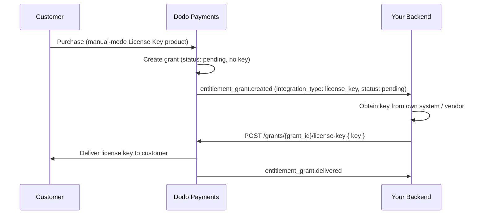

Panduan ini menjelaskan langkah-langkah membangun sistem **pemenuhan kunci lisensi manual** dari awal hingga akhir. Alih-alih Dodo Payments yang membuat kunci otomatis saat pembayaran, setiap pembelian membuat grant `pending` dan menunggu *Anda* memasok nilai kunci dari sistem Anda sendiri, vendor pihak ketiga, atau kumpulan kode yang terbatas.

Pada akhirnya Anda akan memiliki:

- Produk dengan hak Kunci Lisensi yang diatur ke pemenuhan `manual`.
- Sebuah webhook listener yang mendeteksi ketika pelanggan menunggu kunci.
- Panggilan pemenuhan yang mengirim kunci dan memberi tahu pelanggan secara otomatis.

<CardGroup cols={2}>
<Card title="License Keys overview" icon="key" href="/features/license-keys">
Siklus hidup kunci lisensi lengkap dan pengaturan `fulfillment_mode`.
</Card>
<Card title="Fulfill License Key Grant API" icon="code" href="/api-reference/entitlements/fulfill-license-key">
Referensi API untuk endpoint yang Anda panggil untuk mengirim kunci.
</Card>
</CardGroup>

## Cara Kerjanya



Pemenuhan manual hanya mengubah langkah **penerbitan**. Aktivasi, validasi, deaktivasi, kadaluarsa, dan pencabutan berperilaku persis seperti kunci yang dihasilkan secara otomatis setelah dikirimkan.

## Prasyarat

Untuk mengikuti panduan ini Anda memerlukan:

- Akun pedagang Dodo Payments.
- Kunci API Anda (`DODO_PAYMENTS_API_KEY`) dan kunci rahasia webhook dari dashboard. Lihat [panduan pembuatan kunci API](/api-reference/introduction#api-key-generation).
- Sebuah endpoint backend yang dapat menerima webhooks.

<Info>
Gunakan `https://test.dodopayments.com` dan kredensial test-mode saat membangun. Beralih ke `https://live.dodopayments.com` dan kunci live saat Anda masuk ke produksi.
</Info>

## Langkah 1 — Buat Hak Kunci Lisensi dalam Mode Manual

Sebuah **hak** adalah definisi yang dapat digunakan kembali dari apa yang Anda kirim. Buat hak Kunci Lisensi dan atur `fulfillment_mode` ke `manual`.

<Tabs>
<Tab title="Dashboard">
<Steps>
<Step title="Open Entitlements">
Pergi ke **Hak** di dashboard Anda dan klik **+** untuk membuat hak baru.
</Step>
<Step title="Choose License Key">
Pilih **License Key** sebagai integrasi dan berikan **Nama**. Formulirnya menampilkan bidang berikut:

- **Fulfillment Mode** — `Automatic` secara default. Ini adalah pengaturan yang memungkinkan pemenuhan manual; Anda mengubahnya di langkah berikutnya.
- **Panjang Lisensi** — berapa lama setiap kunci yang diterbitkan tetap valid, atau **Tanpa kadaluarsa**.
- **Batas Aktivasi** — maksimum aktivasi per kunci, atau **Tak terbatas**.
- **Pesan Aktivasi** — pesan opsional yang ditampilkan kepada pelanggan ketika mereka mengaktifkan kunci.

<Frame>

</Frame>
</Step>
<Step title="Set Fulfillment Mode to Manual">
Buka dropdown **Fulfillment Mode** dan ubah dari **Automatic** ke **Manual**. Ini adalah pengaturan yang mengarahkan seluruh panduan ini — tanpanya, kunci dibuat dan dikirim secara otomatis dan tidak ada grant yang tertunda dibuat. Dengan **Manual** yang dipilih, setiap pembelian membuat grant `pending` untuk Anda penuhi. Klik **Create Entitlement** untuk menyimpan.
</Step>
</Steps>
</Tab>

<Tab title="API">
Buat hak dengan `integration_config.fulfillment_mode` diatur ke `manual`.
<CodeGroup>

```typescript Node.js theme={null}
import DodoPayments from 'dodopayments';

const client = new DodoPayments({
  bearerToken: process.env.DODO_PAYMENTS_API_KEY,
  environment: 'test_mode', // defaults to 'live_mode'
});

const entitlement = await client.entitlements.create({
  name: 'Pro License (Manual)',
  integration_type: 'license_key',
  integration_config: {
    fulfillment_mode: 'manual',
    activations_limit: 5,
    duration_count: 1,
    duration_interval: 'Year',
  },
});

console.log(entitlement.id); // ent_...
```

```python Python theme={null}
import os
from dodopayments import DodoPayments

client = DodoPayments(
    bearer_token=os.environ.get("DODO_PAYMENTS_API_KEY"),
    environment="test_mode",  # defaults to "live_mode"
)

entitlement = client.entitlements.create(
    name="Pro License (Manual)",
    integration_type="license_key",
    integration_config={
        "fulfillment_mode": "manual",
        "activations_limit": 5,
        "duration_count": 1,
        "duration_interval": "Year",
    },
)

print(entitlement.id)
```

```bash cURL theme={null}
curl -X POST https://test.dodopayments.com/entitlements \
  -H "Authorization: Bearer $DODO_PAYMENTS_API_KEY" \
  -H "Content-Type: application/json" \
  -d '{
    "name": "Pro License (Manual)",
    "integration_type": "license_key",
    "integration_config": {
      "fulfillment_mode": "manual",
      "activations_limit": 5,
      "duration_count": 1,
      "duration_interval": "Year"
    }
  }'
```

</CodeGroup>
</Tab>
</Tabs>

<Note>
`fulfillment_mode` default ke `auto`. Mengabaikannya, atau membiarkan hak yang ada tidak berubah, mempertahankan perilaku otomatis. Hanya hak yang secara eksplisit diatur ke `manual` yang membuat grant yang tertunda.
</Note>

## Langkah 2 — Pasang Hak ke Produk

Buka produk yang ingin Anda jual, perluas **Pengaturan Lanjutan → Hak & Kredit**, dan pilih **Hak Kunci Lisensi yang Anda atur ke Manual** di Langkah 1. Satu produk dapat menyediakan kunci lisensi ini bersama hak lain pada pembelian yang sama.

<Frame caption="Selecting the License Key entitlement in the product entitlements panel.">

</Frame>

<Note>
Fulfillment mode adalah properti dari **hak**, bukan produk. Karena Anda mengaturnya ke **Manual** di Langkah 1, setiap produk yang terpasang pada hak ini menciptakan grant lisensi-kunci `pending` saat pembelian — tidak ada yang perlu dikonfigurasi di sini.
</Note>

<Tip>
Jika Anda belum memiliki produk, buat terlebih dahulu (satu kali atau berlangganan). Lihat [Panduan Integrasi Pembayaran Satu Kali](/developer-resources/integration-guide) untuk menjual produk melalui checkout.
</Tip>

## Langkah 3 — Deteksi Grant yang Tertunda

Ketika pelanggan membeli produk, Dodo Payments membuat grant dalam status `pending` dengan **tidak ada kunci terlampir** dan menembakkan webhook `entitlement_grant.created`. Ini adalah sinyal Anda bahwa pelanggan menunggu kunci.

### Dengarkan untuk webhook

Siapkan endpoint webhook (Pengembang → Webhook di dashboard) dan bertindaklah pada grant lisensi-kunci yang tertunda. Implementasinya mengikuti spesifikasi [Standard Webhooks](https://standardwebhooks.com/).

```typescript theme={null}
import { Webhook } from 'standardwebhooks';

const webhook = new Webhook(process.env.DODO_WEBHOOK_KEY!);

export async function POST(request: Request) {
  const rawBody = await request.text();
  const headers = {
    'webhook-id': request.headers.get('webhook-id') || '',
    'webhook-signature': request.headers.get('webhook-signature') || '',
    'webhook-timestamp': request.headers.get('webhook-timestamp') || '',
  };

  await webhook.verify(rawBody, headers);
  const event = JSON.parse(rawBody);

  // A customer bought a manual-mode license key and is waiting for it.
  if (
    event.type === 'entitlement_grant.created' &&
    event.data.integration_type === 'license_key' &&
    event.data.status === 'pending'
  ) {
    await queueLicenseKeyFulfillment({
      grantId: event.data.id,
      customerId: event.data.customer_id,
    });
  }

  return new Response('ok');
}
```

Payload grant membawa `integration_type: "license_key"`, sehingga Anda dapat mengenali grant lisensi-kunci tanpa pencarian tambahan. Lihat [referensi webhook Grant Hak](/developer-resources/webhooks/intents/entitlement-grant) untuk payload lengkap.

### Atau polling API List Grants

Jika Anda lebih memilih untuk tidak bergantung pada webhooks, daftar grant untuk hak dan filter berdasarkan `integration_type` dan `status`:

Jika Anda lebih suka tidak mengandalkan webhook, daftarkan hibah untuk hak License Key Anda dan saring berdasarkan `status`. Setiap hibah pada hak License Key sudah merupakan hibah license-key, jadi tidak diperlukan saringan `integration_type`:

```typescript Node.js theme={null}
const pending = await client.entitlements.grants.list('ent_license_key_id', {
  integration_type: 'license_key',
  status: 'pending',
});

for (const grant of pending.items) {
  console.log(`Grant ${grant.id} for customer ${grant.customer_id} needs a key`);
}
```

```typescript Node.js theme={null}
const pending = await client.entitlements.grants.list('ent_license_key_id', {
  status: 'Pending',
});

for (const grant of pending.items) {
  console.log(`Grant ${grant.id} for customer ${grant.customer_id} needs a key`);
}
```

```bash cURL theme={null}
curl -G https://test.dodopayments.com/entitlements/ent_license_key_id/grants \
  -H "Authorization: Bearer $DODO_PAYMENTS_API_KEY" \
  --data-urlencode "status=Pending"
```

## Langkah 4 — Kirim Kunci

Dapatkan nilai kunci dari sistem Anda sendiri, lalu kirimkan dengan endpoint [Fulfill License Key Grant](/api-reference/entitlements/fulfill-license-key). Ini memerlukan kunci API rahasia Anda (Izin Editor); ini **bukan** salah satu dari endpoint lisensi publik.

<CodeGroup>

```typescript Node.js theme={null}
async function fulfill(grantId: string, key: string) {
  const res = await fetch(
    `https://test.dodopayments.com/grants/${grantId}/license-key`,
    {
      method: 'POST',
      headers: {
        'Content-Type': 'application/json',
        Authorization: `Bearer ${process.env.DODO_PAYMENTS_API_KEY}`,
      },
      body: JSON.stringify({
        key,
        // Optional — fall back to the entitlement config when omitted
        activations_limit: 5,
        expires_at: '2027-05-01T00:00:00Z',
      }),
    },
  );

  if (!res.ok) {
    // See the status code table below for handling
    throw new Error(`Fulfillment failed: ${res.status}`);
  }

  return res.json(); // updated grant, now status: "delivered"
}
```

```bash cURL theme={null}
curl -X POST https://test.dodopayments.com/grants/grant_8VbC6JDZ/license-key \
  -H "Authorization: Bearer $DODO_PAYMENTS_API_KEY" \
  -H "Content-Type: application/json" \
  -d '{
    "key": "PRO-AAAA-BBBB-CCCC-DDDD",
    "activations_limit": 5,
    "expires_at": "2027-05-01T00:00:00Z"
  }'
```

</CodeGroup>

### Bidang Permintaan

<ParamField body="key" type="string" required>
String kunci lisensi untuk dikirim ke pelanggan. Spasi dikurangi; nilai kosong atau hanya spasi ditolak.
</ParamField>

<ParamField body="activations_limit" type="integer">
Batas aktivasi per kunci. Kembali ke konfigurasi hak jika tidak diisi.
</ParamField>

<ParamField body="expires_at" type="string">
Kadaluarsa per kunci (ISO 8601). Kembali ke durasi konfigurasi hak jika tidak diisi. Untuk grant yang diterbitkan langganan, validitas tetap terkait dengan langganan terlepas apapun.
</ParamField>

Pada keberhasilan, grant berpindah ke `delivered`, pelanggan dikirim kunci secara otomatis (email yang sama yang akan mereka terima di bawah pemenuhan otomatis), dan `entitlement_grant.delivered` menembak.

Pelanggan menerima email dengan kunci lisensi, produk, batas aktivasi, kadaluarsa, dan instruksi aktivasi Anda:

<Frame caption="The license key email the customer receives once you fulfill the grant.">

</Frame>

<Check>
Anda tidak perlu mengirim email kunci sendiri — pengiriman terjadi secara otomatis ketika grant dipenuhi.
</Check>

## Langkah 5 — Tangani Kesalahan dan Pengulangan

Endpoint memvalidasi grant sebelum mengirimkan apapun. Tangani tanggapan berikut:

| Status | Arti | Apa yang harus dilakukan |
|---|---|---|
| `200` | Kunci terkirim, grant sekarang `delivered`. | Selesai. |
| `400` | Bukan grant kunci-lisensi, atau kuncinya kosong/hanya spasi. | Perbaiki permintaan; jangan coba lagi sebagaimana adanya. |
| `404` | Tidak ada grant dengan ID tersebut untuk bisnis Anda. | Verifikasi `grant_id`. |
| `409` | Grant tidak menunggu pemenuhan (sudah terkirim atau sudah memiliki kunci), **atau** nilai kunci sudah ada. | Jika sudah dikirim, perlakukan sebagai keberhasilan. Jika duplikat kunci, berikan kunci yang berbeda. |
| `422` | Body permintaan gagal validasi (mis. `activations_limit < 1`). | Koreksi bidang dan coba lagi. |

<Warning>
Pemenuhan aman untuk diulang pada kesalahan sementara (timeout, `5xx`). Setiap grant hanya dapat dipenuhi sekali, jadi pengulangan setelah panggilan yang berhasil-tapi-belum diakui mengembalikan `409` daripada mengeluarkan kunci kedua atau mengirim email duplikat. Gunakan grant `id` sebagai kunci idempoten Anda.
</Warning>

## Verifikasi Alur

1. Beli produk dalam mode pengujian (lihat [panduan checkout](/developer-resources/integration-guide)).
2. Konfirmasi webhook Anda menerima `entitlement_grant.created` dengan `status: "pending"` dan `integration_type: "license_key"`, atau bahwa grant muncul dalam respons List Grants dengan filter tersebut.
3. Panggil endpoint pemenuhan dengan kunci pengujian.
4. Konfirmasi tanggapan menunjukkan `status: "delivered"` dengan `license_key` yang terisi, pelanggan menerima email kunci, dan `entitlement_grant.delivered` menembak.

<Check>
Setelah dikirim, pelanggan dapat [mengaktifkan dan memvalidasi](/features/license-keys#activation-validation-deactivation) kunci terhadap endpoint lisensi publik persis seperti kunci yang dihasilkan secara otomatis.
</Check>

## Referensi API Terkait

<CardGroup cols={2}>
<Card title="Create Entitlement" icon="plus" href="/api-reference/entitlements/create-entitlement">
Buat hak Kunci Lisensi dengan `fulfillment_mode: manual`.
</Card>
<Card title="List Grants" icon="users" href="/api-reference/entitlements/list-grants">
Filter berdasarkan `integration_type` dan `status` untuk menemukan grant yang pending.
</Card>
<Card title="Fulfill License Key Grant" icon="code" href="/api-reference/entitlements/fulfill-license-key">
Kirim nilai kunci dan transisikan grant ke terkirim.
</Card>
<Card title="Entitlement Grant Webhooks" icon="webhook" href="/developer-resources/webhooks/intents/entitlement-grant">
Acara `entitlement_grant.*` yang menandakan grant yang tertunda dan terkirim.
</Card>
</CardGroup>

<CardGroup cols={2}>
<Card title="Create Entitlement" icon="plus" href="/api-reference/entitlements/create-entitlement">
Create the License Key entitlement with `fulfillment_mode: manual`.
</Card>
<Card title="List Grants" icon="users" href="/api-reference/entitlements/list-grants">
Filter by `integration_type` and `status` to find pending grants.
</Card>
<Card title="Fulfill License Key Grant" icon="code" href="/api-reference/entitlements/fulfill-license-key">
Deliver the key value and transition the grant to delivered.
</Card>
<Card title="Entitlement Grant Webhooks" icon="webhook" href="/developer-resources/webhooks/intents/entitlement-grant">
The `entitlement_grant.*` events that signal pending and delivered grants.
</Card>
</CardGroup>
