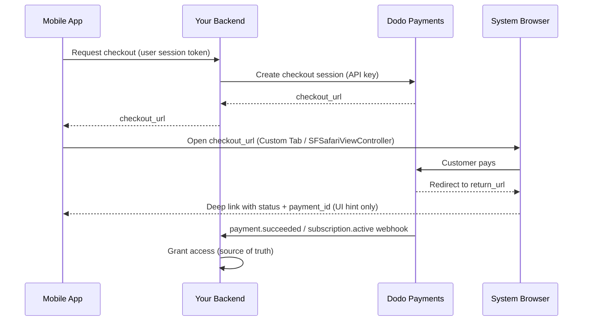

<CardGroup cols={4}>
<Card title="Quick Start" icon="rocket" href="#integration-workflow">
  Jalankan integrasi pembayaran seluler Anda dalam 4 langkah sederhana
</Card>

<Card title="Platform Examples" icon="code" href="#choose-your-sdk">
  Contoh kode lengkap untuk Android, iOS, React Native, dan Flutter
</Card>

<Card title="Checkout Customization" icon="sliders" href="#checkout-page-customization">
  Konfigurasikan tema, pre-fill, dan 14 parameter khusus seluler
</Card>

<Card title="Mobile Recipes" icon="flask" href="#mobile-optimized-recipes">
  Konfigurasi checkout siap salin-tempel untuk 5 skenario seluler umum
</Card>
</CardGroup>

<Info>
Dodo Payments menyediakan SDK checkout resmi untuk **Android, iOS, React Native,
dan Flutter**. Masing-masing membungkus pola yang didokumentasikan di bawah ini (buka URL checkout,
tangkap hasil pengembalian, lalu parsing hasilnya) di balik satu pemanggilan `start(...)`
bertipe tunggal, dengan pemulihan sesi yang ditinggalkan bawaan. Gunakan WebView manual hanya
jika tidak ada yang sesuai dengan stack Anda.
</Info>

## Prasyarat

Sebelum mengintegrasikan Dodo Payments ke aplikasi seluler Anda, pastikan Anda memiliki:

- **Akun Dodo Payments**: Akun merchant aktif dengan akses API
- **Kredensial API**: API key dan webhook secret key dari dashboard Anda
- **Proyek Aplikasi Seluler**: Aplikasi Android, iOS, React Native, atau Flutter
- **Server Backend**: Untuk menangani pembuatan sesi checkout secara aman

## Alur Integrasi

Integrasi seluler mengikuti proses aman 4 langkah, dengan backend menangani pemanggilan API dan aplikasi seluler mengelola pengalaman pengguna.



<Info>
Deep link `status` hanya **petunjuk UI** tentang apa yang harus ditampilkan kepada pengguna. Selalu berikan akses berdasarkan `payment.succeeded` / `subscription.active` **webhook** di backend Anda - jangan pernah hanya berdasarkan hasil dari aplikasi seluler.
</Info>

<Steps>
<Step title="Backend: Create Checkout Session">
<Card title="Checkout Session API Docs" icon="book" href="/developer-resources/checkout-session">
Pelajari cara membuat sesi checkout di backend menggunakan Node.js, Python, dan lainnya. Lihat contoh lengkap dan referensi parameter dalam dokumentasi khusus <strong>Checkout Sessions API</strong>.
</Card>
<Note>
**Keamanan**: Sesi checkout harus dibuat di server backend, bukan di aplikasi seluler. Ini melindungi API key Anda dan memastikan validasi yang tepat.
</Note>

</Step>

<Step title="Mobile: Get Checkout URL">

Aplikasi seluler Anda memanggil backend untuk mendapatkan URL checkout. Autentikasi
permintaan ini dengan token sesi milik pengguna yang sedang login.

<Tabs>
<Tab title="iOS (Swift)">

```swift
func getCheckoutURL(productId: String, customerEmail: String, customerName: String) async throws -> String {
    let url = URL(string: "https://your-backend.com/api/create-checkout-session")!
    var request = URLRequest(url: url)
    request.httpMethod = "POST"
    request.setValue("application/json", forHTTPHeaderField: "Content-Type")
    request.setValue("Bearer \(userSessionToken)", forHTTPHeaderField: "Authorization")
    
    let requestData: [String: Any] = [
        "productId": productId,
        "customerEmail": customerEmail,
        "customerName": customerName
    ]
    request.httpBody = try JSONSerialization.data(withJSONObject: requestData)
    
    let (data, _) = try await URLSession.shared.data(for: request)
    let response = try JSONDecoder().decode(CheckoutResponse.self, from: data)
    return response.checkout_url
}
```

</Tab>
<Tab title="Android (Kotlin)">

```kotlin
suspend fun getCheckoutURL(productId: String, customerEmail: String, customerName: String): String {
    val client = OkHttpClient()
    val requestBody = JSONObject().apply {
        put("productId", productId)
        put("customerEmail", customerEmail)
        put("customerName", customerName)
    }.toString().toRequestBody("application/json".toMediaType())
    
    val request = Request.Builder()
        .url("https://your-backend.com/api/create-checkout-session")
        .header("Authorization", "Bearer $userSessionToken")
        .post(requestBody)
        .build()
    
    val response = client.newCall(request).execute()
    val responseBody = response.body?.string()
    val jsonResponse = JSONObject(responseBody ?: "")
    return jsonResponse.getString("checkout_url")
}
```

</Tab>
<Tab title="React Native (JavaScript)">

```javascript
const getCheckoutURL = async (productId, customerEmail, customerName) => {
  try {
    const response = await fetch('https://your-backend.com/api/create-checkout-session', {
      method: 'POST',
      headers: {
        'Content-Type': 'application/json',
        'Authorization': `Bearer ${userSessionToken}`,
      },
      body: JSON.stringify({
        productId,
        customerEmail,
        customerName
      })
    });
    
    const data = await response.json();
    return data.checkout_url;
  } catch (error) {
    console.error('Failed to get checkout URL:', error);
    throw error;
  }
};
```

</Tab>
<Tab title="Flutter (Dart)">

```dart
import 'dart:convert';
import 'package:http/http.dart' as http;

Future<String> getCheckoutUrl({
  required String productId,
  required String customerEmail,
  required String customerName,
}) async {
  final response = await http.post(
    Uri.parse('https://your-backend.com/api/create-checkout-session'),
    headers: {
      'Content-Type': 'application/json',
      'Authorization': 'Bearer $userSessionToken',
    },
    body: jsonEncode({
      'productId': productId,
      'customerEmail': customerEmail,
      'customerName': customerName,
    }),
  );

  if (response.statusCode != 200) {
    throw Exception('Failed to get checkout URL: ${response.statusCode}');
  }
  return jsonDecode(response.body)['checkout_url'] as String;
}
```

</Tab>
</Tabs>
<Note>
**Keamanan**: Aplikasi seluler hanya berkomunikasi dengan backend Anda, tidak pernah langsung dengan Dodo Payments API.
</Note>
</Step>

<Step title="Mobile: Open Checkout in Browser">
Buka URL checkout di browser dalam aplikasi yang aman untuk memproses pembayaran.
Atau lewati seluruh penyiapan manual dengan SDK checkout resmi untuk
platform Anda.

<Card title="Pick your mobile SDK" icon="box" href="#choose-your-sdk">
  Langkah instalasi dan petunjuk penyiapan untuk Android, iOS, React Native, dan Flutter.
</Card>

</Step>

<Step title="Backend: Handle Payment Completion">
Proses penyelesaian pembayaran melalui webhook dan URL pengalihan untuk mengonfirmasi status pembayaran.
</Step>
</Steps>

## Pilih SDK Anda

Setiap SDK seluler menyediakan kontrak yang sama: satu pemanggilan `start(...)` membuka
checkout ter-host Dodo di permukaan browser native platform dan mengembalikan `CheckoutResult`
bertipe dengan `status` berupa `succeeded`, `failed`, `cancelled`,
`pending`, atau `expired`. Tidak ada yang menyimpan API key atau memanggil Dodo
Payments API, dan keempatnya mendukung pemulihan sesi yang ditinggalkan.

<CardGroup cols={2}>
<Card title="Android" icon="android" href="/developer-resources/sdks/android">
  `com.dodopayments.api:checkout-android` membuka Chrome Custom Tab. Memerlukan `minSdk` 23.
</Card>
<Card title="iOS" icon="apple" href="/developer-resources/sdks/ios">
  `dodopayments-mobile-sdk-ios` membuka `SFSafariViewController`. Memerlukan iOS 16+.
</Card>
<Card title="React Native" icon="react" href="/developer-resources/sdks/react-native">
  `@dodopayments/react-native-checkout`, Turbo Module pada kedua core native. Memerlukan React Native 0.76+.
</Card>
<Card title="Flutter" icon="layer-group" href="/developer-resources/sdks/flutter">
  `dodopayments_checkout`, channel Pigeon pada kedua core native. Memerlukan Flutter 3.44+.
</Card>
</CardGroup>

<Warning>
`status` yang Anda terima adalah petunjuk UI, bukan bukti pembayaran. Konfirmasikan setiap
pembayaran dari backend melalui `payment.succeeded` / `subscription.active`
webhook, atau dengan mengambil pembayaran menggunakan secret key Anda.
</Warning>

### Mendaftarkan URL Scheme Callback

Keempat SDK mengembalikan kontrol ke aplikasi Anda melalui custom URL scheme yang
Anda pilih, misalnya `myapp://checkout/return`. Daftarkan sekali untuk setiap
platform:

<Tabs>
<Tab title="Android">

```kotlin android/app/build.gradle
android {
    defaultConfig {
        manifestPlaceholders["dodoCallbackScheme"] = "myapp"
    }
}
```

Manifest SDK sudah mendeklarasikan redirect activity, jadi tidak ada
XML manifest yang perlu ditambahkan.
</Tab>
<Tab title="iOS">

```xml Info.plist
<key>CFBundleURLTypes</key>
<array>
  <dict>
    <key>CFBundleURLName</key>
    <string>myapp</string>
    <key>CFBundleURLSchemes</key>
    <array>
      <string>myapp</string>
    </array>
  </dict>
</array>
```

Di iOS, Anda juga harus meneruskan URL masuk ke SDK, karena
`SFSafariViewController` tidak dapat menangkap URL pengembaliannya sendiri. Lihat halaman
[iOS](/developer-resources/sdks/ios) atau
[React Native](/developer-resources/sdks/react-native) untuk handler yang tepat.
</Tab>
<Tab title="Expo">
`@dodopayments/react-native-checkout` menyediakan plugin konfigurasi yang mendaftarkan
scheme untuk kedua platform di `prebuild`. Berikan opsi `scheme`:

```json app.json
{
  "expo": {
    "scheme": "myapp",
    "plugins": [
      [
        "@dodopayments/react-native-checkout",
        { "scheme": "myappcheckout" }
      ]
    ]
  }
}
```

`scheme` harus cocok dengan `returnUrl` dan harus berbeda dari `expo.scheme`, yang sudah didaftarkan Expo pada `MainActivity`. Lihat halaman
[React Native SDK](/developer-resources/sdks/react-native) untuk detailnya.

Jika `android/app/build.gradle` dikelola secara manual tanpa blok `defaultConfig { }` standar, tetapkan placeholder secara manual (lihat tab Android).

Hanya berfungsi dengan development builds, bukan Expo Go. Jalankan
`npx expo prebuild --clean` setelah mengedit INLINE_CODE_PLACEHOLDER_85b7553c260c0f8_END.
</Tab>
</Tabs>

<Note>
Lebih memilih membuatnya sendiri? Buka `checkout_url` di browser sistem
platform (Android Custom Tabs / iOS `SFSafariViewController`), lalu cegat
navigasi ke `return_url` dan baca parameter query `status` serta `payment_id`. SDK di atas melakukan semua ini untuk Anda.
</Note>

<Warning>
**Jangan buka checkout di dalam embedded WebView (`WKWebView` / Android
`WebView`).** Ini adalah masalah integrasi seluler yang paling umum: embedded WebView
**menonaktifkan Apple Pay dan Google Pay**, serta dapat mengganggu challenge
3-D Secure dan pengisian otomatis kartu tersimpan - sehingga pelanggan melihat lebih sedikit opsi pembayaran
dan lebih banyak kegagalan. Selalu gunakan SDK, atau buka `checkout_url` di
browser sistem (Custom Tabs / `SFSafariViewController`). Permukaan browser native
itulah yang membuat Apple Pay dan Google Pay tetap berfungsi.
</Warning>

## Kustomisasi Tampilan

Setiap SDK menerima parameter opsional `customization` pada `start(...)` /
`CheckoutParams` yang mengontrol tampilan dan perilaku permukaan browser
native - toolbar, tombol, dan presentasi. Ini terpisah dari tema halaman
checkout itu sendiri, yang Anda konfigurasikan di server melalui
[`customization.theme_config`](/developer-resources/checkout-session) pada
checkout session.

Opsi dikelompokkan berdasarkan platform karena Android Custom Tab dan iOS
`SFSafariViewController` menyediakan kontrol native yang berbeda. Semua field bersifat
opsional; jika `customization` tidak disertakan sama sekali, tampilan default
platform akan digunakan.

<AccordionGroup>
<Accordion title="Android - Custom Tab">

<ParamField body="toolbarColor" type="Color">
Warna latar belakang toolbar.
</ParamField>

<ParamField body="navigationBarColor" type="Color">
Warna navigation bar.
</ParamField>

<ParamField body="navigationBarDividerColor" type="Color">
Warna pemisah di atas navigation bar.
</ParamField>

<ParamField body="closeButtonStyle" type="'default' | 'back'">
`default` menampilkan ikon sistem "X"; `back` menggambar panah kembali.
</ParamField>

<ParamField body="closeButtonPosition" type="'start' | 'end'">
Menentukan sisi toolbar tempat tombol tutup muncul.
</ParamField>

<ParamField body="shareButtonEnabled" type="boolean">
Menampilkan ikon bagikan pada toolbar.
</ParamField>

<ParamField body="showTitleEnabled" type="boolean">
Menampilkan judul halaman di bawah URL pada toolbar.
</ParamField>

<ParamField body="urlBarHidingEnabled" type="boolean">
Memungkinkan toolbar tersembunyi otomatis saat halaman digulir.
</ParamField>

<ParamField body="bookmarksButtonEnabled" type="boolean">
Menampilkan "Bookmark this page" di menu overflow.
</ParamField>

<ParamField body="downloadsButtonEnabled" type="boolean">
Menampilkan "Download page" di menu overflow.
</ParamField>

<ParamField body="colorScheme" type="'system' | 'light' | 'dark'">
Memaksa tampilan terang atau gelap terlepas dari pengaturan sistem perangkat.
</ParamField>

</Accordion>

<Accordion title="iOS - SFSafariViewController">

<ParamField body="dismissButtonStyle" type="'done' | 'close' | 'cancel'">
Label atau ikon untuk tombol tutup.
</ParamField>

<ParamField body="presentationStyle" type="'pageSheet' | 'fullScreen'">
`pageSheet` ditampilkan sebagai kartu dengan swipe-to-dismiss; `fullScreen` menutupi seluruh layar.
</ParamField>

<ParamField body="barCollapsingEnabled" type="boolean">
Memungkinkan toolbar diciutkan saat menggulir. Hanya terlihat ketika `presentationStyle` adalah `fullScreen` - `pageSheet` menjaga bar tetap tertambat terlepas dari pengaturan ini.
</ParamField>

<ParamField body="colorScheme" type="'system' | 'light' | 'dark'">
Memaksa tampilan terang atau gelap terlepas dari pengaturan sistem perangkat.
</ParamField>

</Accordion>
</AccordionGroup>

<Tabs>
<Tab title="React Native">

```typescript
const result = await DodoCheckout.start({
  checkoutUrl,
  returnUrl: 'myapp://checkout/return',
  customization: {
    android: { toolbarColor: '#6366F1', closeButtonStyle: 'back' },
    ios: { presentationStyle: 'fullScreen', colorScheme: 'dark' },
  },
});
```

</Tab>
<Tab title="Flutter">

```dart
final result = await DodoCheckout.instance.start(
  CheckoutParams(
    checkoutUrl: Uri.parse(checkoutUrl),
    returnUrl: Uri.parse('myapp://checkout/return'),
    customization: BrowserCustomization(
      android: AndroidBrowserOptions(
        toolbarColor: Color(0xFF6366F1),
        closeButtonStyle: CloseButtonStyle.back,
      ),
      ios: IosBrowserOptions(
        presentationStyle: PresentationStyle.fullScreen,
        colorScheme: BrowserColorScheme.dark,
      ),
    ),
  ),
);
```

</Tab>
<Tab title="Android (Kotlin)">

```kotlin
val result = DodoCheckout.start(
    activity,
    CheckoutParams(
        checkoutUrl = checkoutUrl,
        returnUrl = "myapp://checkout/return",
        customization = BrowserCustomization(
            toolbarColor = Color.parseColor("#6366F1"),
            closeButtonStyle = BrowserCustomization.CloseButtonStyle.BACK,
        )
    )
) { event -> }
```

</Tab>
<Tab title="iOS (Swift)">

```swift
let result = try await DodoCheckout.start(
    checkoutUrl: checkoutUrl,
    returnUrl: URL(string: "myapp://checkout/return")!,
    customization: BrowserCustomization(
        presentationStyle: .fullScreen,
        colorScheme: .dark
    )
)
```

</Tab>
</Tabs>

## Kustomisasi Halaman Checkout

Bagian [Kustomisasi Tampilan](#appearance-customization) di atas mengontrol permukaan browser native - toolbar, tombol, dan skema warna. *Halaman* checkout itu sendiri - field yang ditampilkan, tema, dan metode pembayaran yang muncul - dikonfigurasi di server saat Anda membuat sesi checkout. Parameter ini memberikan dampak terbesar pada konversi seluler.

Parameter di bawah berada di tiga tempat berbeda dalam permintaan sesi checkout - kolom **Lokasinya** memberi tahu Anda objek tempat setiap parameter berada. Kesalahan ini adalah kekeliruan yang paling umum: parameter yang ditempatkan di objek yang salah akan diabaikan secara diam-diam.

| Parameter | Lokasinya | Manfaat seluler | Default | Atur saat… |
|-----------|---------------|---------------|---------|-----------|
| `show_order_details` | `customization` | Menciutkan ringkasan pesanan agar metode pembayaran muncul di bagian atas layar | `true` | Selalu atur `false` di seluler - memindahkan metode pembayaran ke bagian atas layar secara signifikan mengurangi drop-off |
| `minimal_address` | top-level | Hanya memerlukan kode pos; menyembunyikan field jalan, kota, dan provinsi | `false` | Hampir selalu di seluler - setiap field tambahan mengurangi konversi |
| `theme` | `customization` | Mengontrol tampilan terang atau gelap halaman checkout | Business default | Gunakan `"system"` untuk menyesuaikan preferensi OS perangkat |
| `theme_config` | `customization` | Palet brand lengkap - warna, font, radius border, label tombol bayar | None | Saat checkout harus terasa sebagai bagian dari aplikasi Anda |
| `force_language` | `customization` | Mengganti deteksi locale browser | Auto-detect | Atur dari locale aplikasi, bukan mengandalkan browser |
| `show_on_demand_tag` | `customization` | Menampilkan atau menyembunyikan label "on-demand" pada halaman checkout | `true` | Atur `false` saat menggunakan penagihan on-demand hanya untuk tokenisasi kartu |
| `show_saved_payment_methods` | top-level | Menampilkan kartu tersimpan pelanggan yang kembali untuk pembayaran satu ketukan | `false` | Aktifkan untuk pengguna yang login dan pernah membayar sebelumnya |
| `allow_discount_code` | `feature_flags` | Menampilkan field kode promo | `true` | Atur `false` untuk mempersingkat formulir; pengguna yang pergi mencari kode jarang kembali |
| `allow_currency_selection` | `feature_flags` | Memungkinkan pelanggan mengganti mata uang penagihan | `true` | Atur `false` saat Anda mengunci mata uang dengan `billing_currency` |
| `redirect_immediately` | `feature_flags` | Melewati halaman sukses dan langsung menuju `return_url` | `false` | Aktifkan untuk serah terima yang mulus kembali ke aplikasi |
| `confirm` | top-level | Menyelesaikan pembayaran tanpa langkah konfirmasi tambahan | `false` | Gunakan bersama `payment_method_id` untuk checkout satu klik |
| `short_link` | top-level | Mengembalikan URL checkout yang lebih pendek | `false` | Berguna saat URL harus dimuat dalam notifikasi push atau SMS |
| `payment_method_id` | top-level | Memilih metode pembayaran tersimpan terlebih dahulu | - | Teruskan bersama `confirm: true` untuk checkout satu klik |
| `allowed_payment_method_types` | top-level | Membatasi metode pembayaran yang ditampilkan | Semua diaktifkan | Batasi pada metode yang sesuai dengan jenis produk Anda |

<Warning>
**Selalu teruskan `billing_currency` dan `billing_address.country` secara bersamaan.** Jika salah satunya tidak disertakan, Adaptive Currency dapat mengubah mata uang penagihan secara diam-diam berdasarkan alamat IP pelanggan. Seorang merchant melihat subscription AS berubah menjadi EUR saat pelanggannya bepergian ke Eropa - karena negara penagihan tidak ditetapkan secara eksplisit.
</Warning>

<Tip>
**Peningkatan konversi tunggal terbesar di seluler:** atur `show_order_details: false` dan `minimal_address: true`. Memindahkan metode pembayaran ke bagian atas layar dan mengurangi field formulir adalah dua perubahan yang paling berdampak.
</Tip>

<Frame caption="show_order_details: false moves the contact and payment fields above the fold, instead of behind the order summary.">
  
</Frame>

Atur `minimal_address: true` untuk hanya mengumpulkan kode pos, bukan field jalan, kota, dan provinsi lengkap:

<Frame caption="minimal_address: true reduces the billing address to a single postcode field.">
  
</Frame>

Atur `theme: "system"` agar checkout mengikuti preferensi mode terang atau gelap perangkat:

<Frame caption="With theme: system, the checkout follows the device's light or dark appearance automatically.">
  
</Frame>

<Info>
**Ketersediaan metode pembayaran bervariasi berdasarkan jenis produk.** Apple Pay dan Cash App didukung untuk subscription berulang dengan nilai non-nol. Untuk pembayaran satu kali, semua metode yang diaktifkan tersedia.
</Info>

<Card title="Full checkout session parameter reference" icon="book" href="/developer-resources/checkout-session">
  Lihat setiap parameter, jenis, dan nilai default yang tersedia dalam panduan Checkout Sessions.
</Card>

## Resep yang Dioptimalkan untuk Seluler

Setiap resep di bawah merupakan body permintaan sesi checkout lengkap. Salin yang sesuai dengan skenario Anda, ganti dengan ID produk Anda, lalu teruskan ke endpoint pembuatan sesi di backend.

<AccordionGroup>
<Accordion title="Minimal Mobile Checkout - fastest path to payment">

Gunakan ini saat Anda menginginkan formulir sesingkat mungkin: metode pembayaran di bagian atas, hanya kode pos yang diperlukan untuk alamat, tanpa field diskon, dan tema yang mengikuti perangkat.

<Tabs>
<Tab title="Node.js SDK">

```javascript expandable
import DodoPayments from 'dodopayments';

const client = new DodoPayments({
  bearerToken: process.env.DODO_PAYMENTS_API_KEY,
  environment: 'test_mode',
});

const session = await client.checkoutSessions.create({
  product_cart: [{ product_id: 'pdt_your_product_id', quantity: 1 }],
  customer: { email: 'user@example.com', name: 'Jane Smith' },
  billing_address: { country: 'US' },
  return_url: 'myapp://checkout/success',
  cancel_url: 'myapp://checkout/cancelled',
  billing_currency: 'USD',
  minimal_address: true,
  customization: {
    show_order_details: false,
    theme: 'system',
  },
  feature_flags: {
    allow_discount_code: false,
    allow_currency_selection: false,
  },
});

console.log(session.checkout_url);
```

</Tab>
<Tab title="Python SDK">

```python expandable
import os
import dodopayments

client = dodopayments.DodoPayments(
    bearer_token=os.environ.get("DODO_PAYMENTS_API_KEY"),
    environment="test_mode",
)

session = client.checkout_sessions.create(
    product_cart=[{"product_id": "pdt_your_product_id", "quantity": 1}],
    customer={"email": "user@example.com", "name": "Jane Smith"},
    billing_address={"country": "US"},
    return_url="myapp://checkout/success",
    cancel_url="myapp://checkout/cancelled",
    billing_currency="USD",
    minimal_address=True,
    customization={
        "show_order_details": False,
        "theme": "system",
    },
    feature_flags={
        "allow_discount_code": False,
        "allow_currency_selection": False,
    },
)

print(session.checkout_url)
```

</Tab>
</Tabs>

<Note>
Lihat [Checkout Sessions](/developer-resources/checkout-session) untuk semua parameter yang tersedia dan nilai defaultnya.
</Note>
</Accordion>

<Accordion title="Branded Mobile Checkout - custom colors, fonts, and button label">

Gunakan ini saat halaman checkout harus terasa sebagai bagian dari aplikasi Anda. Atur warna brand, font kustom, dan label tombol bayar yang dilokalkan.

<Frame>
  
</Frame>

<Tabs>
<Tab title="Node.js SDK">

```javascript expandable
const session = await client.checkoutSessions.create({
  product_cart: [{ product_id: 'pdt_your_product_id', quantity: 1 }],
  customer: { email: 'user@example.com', name: 'Jane Smith' },
  billing_address: { country: 'US' },
  billing_currency: 'USD',
  return_url: 'myapp://checkout/success',
  minimal_address: true,
  customization: {
    show_order_details: false,
    theme: 'dark',
    theme_config: {
      dark: {
        button_primary: '#7C3AED',
        button_primary_hover: '#6D28D9',
        button_text_primary: '#FFFFFF',
        bg_primary: '#1A1A2E',
        bg_secondary: '#16213E',
        text_primary: '#E2E8F0',
      },
      pay_button_text: 'Complete Purchase',
      radius: '8px',
    },
  },
});
```

</Tab>
<Tab title="Python SDK">

```python expandable
session = client.checkout_sessions.create(
    product_cart=[{"product_id": "pdt_your_product_id", "quantity": 1}],
    customer={"email": "user@example.com", "name": "Jane Smith"},
    billing_address={"country": "US"},
    billing_currency="USD",
    return_url="myapp://checkout/success",
    minimal_address=True,
    customization={
        "show_order_details": False,
        "theme": "dark",
        "theme_config": {
            "dark": {
                "button_primary": "#7C3AED",
                "button_primary_hover": "#6D28D9",
                "button_text_primary": "#FFFFFF",
                "bg_primary": "#1A1A2E",
                "bg_secondary": "#16213E",
                "text_primary": "#E2E8F0",
            },
            "pay_button_text": "Complete Purchase",
            "radius": "8px",
        },
    },
)
```

</Tab>
</Tabs>

<Note>
`theme_config` menerima objek `dark` dan `light` terpisah agar palet menyesuaikan tampilan perangkat saat ini. Lihat [Checkout Sessions](/developer-resources/checkout-session) untuk referensi lengkap kunci warna.
</Note>
</Accordion>

<Accordion title="One-Click Returning Customer - saved card, instant confirmation">

Gunakan ini untuk pengguna yang login dan pernah membayar sebelumnya. Gabungkan ID pelanggan, metode pembayaran tersimpan mereka, dan `confirm: true` untuk melewati formulir checkout sepenuhnya.

<Tabs>
<Tab title="Node.js SDK">

```javascript expandable
const session = await client.checkoutSessions.create({
  product_cart: [{ product_id: 'pdt_your_product_id', quantity: 1 }],
  customer: { customer_id: 'cus_returning_customer_id' },
  billing_address: { country: 'US' },
  billing_currency: 'USD',
  return_url: 'myapp://checkout/success',
  payment_method_id: 'pm_saved_payment_method_id',
  confirm: true,
  show_saved_payment_methods: true,           // top-level parameter
  feature_flags: { redirect_immediately: true },
});
```

</Tab>
<Tab title="Python SDK">

```python expandable
session = client.checkout_sessions.create(
    product_cart=[{"product_id": "pdt_your_product_id", "quantity": 1}],
    customer={"customer_id": "cus_returning_customer_id"},
    billing_address={"country": "US"},
    billing_currency="USD",
    return_url="myapp://checkout/success",
    payment_method_id="pm_saved_payment_method_id",
    confirm=True,
    show_saved_payment_methods=True,           # top-level parameter
    feature_flags={"redirect_immediately": True},
)
```

</Tab>
</Tabs>

<Note>
`status` dalam pengembalian deep link hanya merupakan petunjuk UI. Konfirmasikan akses dengan mendengarkan webhook `payment.succeeded` di backend Anda.
</Note>
</Accordion>

<Accordion title="Subscription with Free Trial - trial before first charge">

Gunakan ini untuk produk subscription yang menawarkan masa uji coba gratis sebelum siklus penagihan pertama.

<Tabs>
<Tab title="Node.js SDK">

```javascript expandable
const session = await client.checkoutSessions.create({
  product_cart: [{ product_id: 'pdt_your_subscription_product_id', quantity: 1 }],
  customer: { email: 'user@example.com', name: 'Jane Smith' },
  billing_address: { country: 'US' },
  billing_currency: 'USD',
  return_url: 'myapp://subscription/activated',
  cancel_url: 'myapp://subscription/cancelled',
  minimal_address: true,
  customization: {
    show_order_details: false,
    theme: 'system',
  },
  subscription_data: { trial_period_days: 14 },
});
```

</Tab>
<Tab title="Python SDK">

```python expandable
session = client.checkout_sessions.create(
    product_cart=[{"product_id": "pdt_your_subscription_product_id", "quantity": 1}],
    customer={"email": "user@example.com", "name": "Jane Smith"},
    billing_address={"country": "US"},
    billing_currency="USD",
    return_url="myapp://subscription/activated",
    cancel_url="myapp://subscription/cancelled",
    minimal_address=True,
    customization={"show_order_details": False, "theme": "system"},
    subscription_data={"trial_period_days": 14},
)
```

</Tab>
</Tabs>

<Note>
Berikan akses fitur saat backend menerima webhook `subscription.active` - bukan saat SDK seluler mengembalikan hasil. Lihat [Subscription Integration Guide](/developer-resources/subscription-integration-guide) untuk alur webhook lengkap.
</Note>
</Accordion>

<Accordion title="On-Demand Mandate - save a card for future variable charges">

Gunakan ini untuk melakukan tokenisasi kartu pelanggan untuk tagihan di kemudian hari (isi ulang dompet, pay-as-you-go, BNPL) tanpa menampilkan label "subscription". Pelanggan mengotorisasi metode pembayaran mereka sekali; Anda menagih jumlah variabel secara on-demand di kemudian hari.

<Info>
Ini adalah pola yang digunakan aplikasi yang menagih berdasarkan penggunaan - misalnya aplikasi astrologi yang menagih per sesi dari kartu yang telah diotorisasi sebelumnya, bukan berdasarkan jadwal tetap.
</Info>

<Tabs>
<Tab title="Node.js SDK">

```javascript expandable
// Step 1: Authorize the mandate (no charge yet)
const session = await client.checkoutSessions.create({
  product_cart: [{ product_id: 'pdt_your_subscription_product_id', quantity: 1 }],
  customer: { email: 'user@example.com', name: 'Jane Smith' },
  billing_address: { country: 'US' },
  billing_currency: 'USD',
  return_url: 'myapp://mandate/authorized',
  cancel_url: 'myapp://mandate/cancelled',
  minimal_address: true,
  customization: {
    show_order_details: false,
    show_on_demand_tag: false, // hides the "on-demand" / "subscription" label
    theme: 'system',
  },
  subscription_data: {
    on_demand: { mandate_only: true },
  },
});

// Step 2: Later, charge any amount using the subscription ID
// (received via the subscription.active webhook after mandate authorization)
// await client.subscriptions.charge(subscriptionId, {
//   product_price: 2000,         // $20.00 in cents
//   product_currency: 'USD',
//   product_description: 'Session credits',
// });
```

</Tab>
<Tab title="Python SDK">

```python expandable
# Step 1: Authorize the mandate (no charge yet)
session = client.checkout_sessions.create(
    product_cart=[{"product_id": "pdt_your_subscription_product_id", "quantity": 1}],
    customer={"email": "user@example.com", "name": "Jane Smith"},
    billing_address={"country": "US"},
    billing_currency="USD",
    return_url="myapp://mandate/authorized",
    cancel_url="myapp://mandate/cancelled",
    minimal_address=True,
    customization={
        "show_order_details": False,
        "show_on_demand_tag": False,  # hides the "on-demand" / "subscription" label
        "theme": "system",
    },
    subscription_data={"on_demand": {"mandate_only": True}},
)

# Step 2: Later, charge any amount using the subscription ID
# client.subscriptions.charge(subscription_id, {
#     "product_price": 2000,  # $20.00 in cents
#     "product_currency": "USD",
#     "product_description": "Session credits",
# })
```

</Tab>
</Tabs>

<Warning>
Tagihan on-demand memerlukan minimum 1 USD (100 sen). Jumlah di bawah 1 USD akan ditolak dengan `"value out of range"`. Untuk otorisasi dengan jumlah nol, gunakan `mandate_only: true` seperti yang ditunjukkan di atas, lalu tagih setidaknya 1 USD pada pemanggilan berikutnya.
</Warning>

<Note>
Lihat [On-Demand Subscriptions](/developer-resources/ondemand-subscriptions) untuk alur penagihan lengkap, event webhook, dan kebijakan percobaan ulang.
</Note>
</Accordion>
</AccordionGroup>

## Alur Subscription dari Seluler

Subscription dibuat melalui alur sesi checkout yang sama seperti pembayaran satu kali - SDK seluler membuka checkout ter-host, pelanggan berlangganan, dan aplikasi Anda menangani pengembalian deep link. Siklus hidup subscription kemudian dikelola sepenuhnya di backend.

### Subscription Berulang Reguler

Untuk penagihan dengan interval tetap (bulanan, tahunan), buat sesi checkout dengan produk subscription dan deep link `return_url`. Backend Anda menerima `subscription.active` saat subscription dikonfirmasi.

<Info>
**Apple Pay** dan **Cash App** didukung untuk subscription berulang dengan nilai non-nol.
</Info>

Untuk alur webhook backend lengkap, lihat [Subscription Integration Guide](/developer-resources/subscription-integration-guide).

---

### Subscription On-Demand

Subscription on-demand memungkinkan Anda mengotorisasi metode pembayaran pelanggan sekali lalu menagih jumlah variabel di kemudian hari - ideal untuk isi ulang dompet, pay-as-you-go, dan skenario apa pun ketika jumlah tagihan belum diketahui sebelumnya. Lihat resep **On-Demand Mandate** di atas untuk body permintaan lengkap.

Pertimbangan seluler utama:

- Atur `show_on_demand_tag: false` agar halaman checkout tidak menampilkan bahasa "subscription" atau "on-demand". Untuk kasus tokenisasi kartu, pelanggan tidak mengharapkan istilah subscription.
- Setelah mandate diotorisasi, backend Anda menerima `subscription.active`. Simpan `subscription_id` - Anda akan menggunakannya untuk semua tagihan berikutnya.

<Warning>
Tagihan minimum adalah 1 USD (100 sen). Tagihan on-demand di bawah 1 USD akan ditolak dengan `"value out of range"`. Tagih setidaknya 1 USD, atau gunakan `mandate_only: true` untuk mengotorisasi tanpa menagih dan mengumpulkan jumlah pertama yang sebenarnya di kemudian hari.
</Warning>

<Warning>
**Hindari percobaan ulang bertubi-tubi.** Jika tagihan sebelumnya masih diproses, tagihan baru pada subscription yang sama akan gagal dengan `"Cannot create new charge as previous payment is not successful yet"`. Hal ini terutama umum pada metode pembayaran India (UPI, kartu debit/kredit India), karena aturan mandate RBI dapat menahan transaksi dalam status pemrosesan hingga 48 jam. Tambahkan pemeriksaan cooldown dalam logika penagihan sebelum mencoba lagi.
</Warning>

Lihat [On-Demand Subscriptions](/developer-resources/ondemand-subscriptions) untuk endpoint penagihan lengkap, event webhook, dan kebijakan percobaan ulang.

---

### Subscription dengan Free Trial

Teruskan `subscription_data.trial_period_days` dalam sesi checkout untuk menawarkan trial sebelum siklus penagihan pertama. Pelanggan mengotorisasi metode pembayaran mereka saat mendaftar trial; tagihan pertama terjadi otomatis saat trial berakhir. Lihat resep **Subscription with Free Trial** di atas untuk body permintaan lengkap.

---

### Upgrade dan Downgrade

Perubahan paket dilakukan melalui API di backend Anda, bukan melalui sesi checkout baru. Dodo Payments menghitung prorata secara otomatis. Untuk menyediakan opsi layanan mandiri, sematkan atau tautkan ke [Customer Portal](/features/customer-portal).

<CardGroup cols={2}>
<Card title="Subscription Integration Guide" icon="repeat" href="/developer-resources/subscription-integration-guide">
  Penyiapan backend lengkap: alur webhook, penyediaan akses, pembatalan
</Card>
<Card title="On-Demand Subscriptions" icon="bolt" href="/developer-resources/ondemand-subscriptions">
  Otorisasi mandate, tagihan variabel, dan kebijakan percobaan ulang
</Card>
<Card title="Upgrade / Downgrade" icon="arrows-up-down" href="/developer-resources/subscription-upgrade-downgrade">
  Strategi prorata, perubahan paket, dan penyesuaian seat
</Card>
<Card title="Customer Portal" icon="user" href="/features/customer-portal">
  Pengelolaan subscription mandiri untuk pelanggan Anda
</Card>
</CardGroup>

## Mengurangi Drop-Off Checkout

Checkout seluler mengalami abandonment yang lebih tinggi daripada web - layar yang lebih kecil, lebih banyak gangguan, dan formulir yang lebih panjang semuanya berkontribusi. Perbaikan tercepat berasal dari konfigurasi sesi checkout itu sendiri.

### Optimalkan Formulir

| Pengaturan | Nilai yang disarankan | Dampak |
|---------|------------------|--------|
| `show_order_details` | `false` | Menciutkan ringkasan pesanan; metode pembayaran muncul di bagian atas |
| `minimal_address` | `true` | Hanya kode pos yang diperlukan; menghapus jalan, kota, dan provinsi |
| `show_saved_payment_methods` | `true` | Pembayaran satu ketukan untuk pelanggan yang kembali |
| `allow_discount_code` | `false` | Menghapus field kode promo |
| `theme` | `"system"` | Mengikuti preferensi terang atau gelap perangkat |
| `force_language` | Locale aplikasi Anda | Mencegah checkout menggunakan bahasa browser sebagai default |

### Isi Awal Data Pelanggan

Setiap field yang tidak perlu diketik pelanggan adalah alasan untuk tidak membatalkan:

- **Pelanggan baru** - atur `customer.email` dan `customer.name` dari sesi autentikasi Anda.
- **Pelanggan yang kembali** - atur `customer.customer_id` untuk mengisi otomatis semua detail yang tersimpan.
- **Mata uang** - selalu teruskan `billing_currency` dan `billing_address.country` secara bersamaan.

### Alat Pemulihan

<CardGroup cols={2}>
<Card title="Abandoned Cart Recovery" icon="cart-shopping" href="/features/recovery/abandoned-cart-recovery">
  Urutan email otomatis untuk checkout yang belum selesai
</Card>
<Card title="Payment Retries" icon="rotate" href="/features/recovery/payment-retries">
  Logika percobaan ulang cerdas untuk perpanjangan subscription yang gagal
</Card>
<Card title="Subscription Dunning" icon="envelope" href="/features/recovery/subscription-dunning">
  Email re-engagement untuk subscription yang tidak aktif
</Card>
<Card title="Recovery Overview" icon="chart-line" href="/features/recovery/overview">
  Semua alat pemulihan dan dampak gabungan terhadap pendapatan
</Card>
</CardGroup>

<Tip>
**Uji email cart abandonment sebelum mengaktifkannya.** Buat sesi checkout dalam live mode dan masukkan detail kartu yang tidak valid. Pembayaran yang gagal akan memicu alur email pemulihan, sehingga Anda dapat melihat pratinjau persis seperti yang diterima pelanggan.
</Tip>

## Praktik Terbaik

- **Keamanan**: Jangan pernah menyertakan API key dalam aplikasi Anda. Buat sesi checkout di backend dan teruskan hanya `checkout_url` yang dihasilkan ke client.
- **Otoritas**: Perlakukan `CheckoutResult.status` sebagai petunjuk UI. Berikan akses hanya setelah backend mengonfirmasi pembayaran.
- **Pengalaman Pengguna**: Tampilkan status loading saat backend membuat sesi, dan tangani `cancelled` sebagai hasil normal, bukan error.
- **Pengujian**: Gunakan test mode dan kartu pengujian, lalu verifikasi round trip return-URL pada perangkat nyata maupun simulator.
- **Konversi**: Atur `show_order_details: false` dan `minimal_address: true` untuk tingkat penyelesaian checkout seluler terbaik. Memindahkan metode pembayaran ke bagian atas layar dan mengurangi field formulir adalah dua perubahan yang paling berdampak.
- **Mata Uang**: Selalu teruskan `billing_currency` dan `billing_address.country` secara eksplisit - jika salah satunya tidak ada, Adaptive Currency dapat mengubah mata uang penagihan berdasarkan alamat IP pelanggan.
- **Penagihan on-demand**: Atur `show_on_demand_tag: false` saat menggunakan subscription on-demand untuk tokenisasi kartu. Pelanggan dalam alur isi ulang dompet tidak mengharapkan bahasa "subscription".
- **Pemulihan**: Aktifkan pemulihan cart yang ditinggalkan di dashboard Dodo Payments untuk otomatis menghubungi kembali pelanggan yang tidak menyelesaikan checkout.

## Pemecahan Masalah

### Masalah Umum

- **Callback tidak pernah tiba**: Scheme di `returnUrl` harus cocok dengan yang Anda daftarkan. Di Android, itu adalah placeholder manifest `dodoCallbackScheme`; di iOS dan React Native, itu adalah jenis URL `Info.plist`.
- **Checkout kembali ke browser, bukan ke aplikasi Anda (iOS)**: Anda belum meneruskan URL masuk. Panggil `DodoCheckout.handleOpenURL(url)` dari `.onOpenURL`, `scene(_:openURLContexts:)`, atau listener React Native `Linking`.
- **`PLATFORM_ERROR` di Android**: Biasanya disebabkan ketidakcocokan scheme. Hal ini juga dapat terjadi jika `MainActivity` menetapkan `android:taskAffinity=""` (default bawaan `flutter create`), yang dapat membuat beberapa build OEM kehilangan checkout yang sedang berlangsung.
- **`ALREADY_IN_PROGRESS`**: Checkout masih terbuka. Tunggu atau tutup checkout sebelumnya sebelum memulai yang baru.
- **Build gagal karena placeholder tidak teratasi**: Anda menambahkan Android SDK tetapi belum menetapkan `manifestPlaceholders["dodoCallbackScheme"]`.
- **Pembayaran berhasil tetapi akses tidak diberikan**: Ini wajar jika Anda mengandalkan hasil dari perangkat seluler. Berikan akses dari webhook `payment.succeeded` / `subscription.active`.
- **Apple Pay / Google Pay tidak muncul di seluler**: Checkout dimuat di dalam embedded WebView (`WKWebView` / Android `WebView`), yang menonaktifkan wallet dan dapat mengganggu 3-D Secure. Buka menggunakan SDK atau browser sistem (Custom Tabs / `SFSafariViewController`).

## Sumber Daya Tambahan
- [Panduan Integrasi Pembayaran](/developer-resources/integration-guide)
- [Dokumentasi Webhook](/developer-resources/webhooks/intents/webhook-events-guide)
- [Proses Pengujian](/miscellaneous/testing-process)
- [FAQ Teknis](/miscellaneous/faq)
- [Kustomisasi Checkout Session](/developer-resources/checkout-session)
- [On-Demand Subscriptions](/developer-resources/ondemand-subscriptions)
- [Upgrade/Downgrade Subscription](/developer-resources/subscription-upgrade-downgrade)
- [Pemulihan Cart yang Ditinggalkan](/features/recovery/abandoned-cart-recovery)
- [Customer Portal](/features/customer-portal)

<Check>
Untuk pertanyaan atau dukungan, hubungi <a href="mailto:support@dodopayments.com">support@dodopayments.com</a>.
</Check>