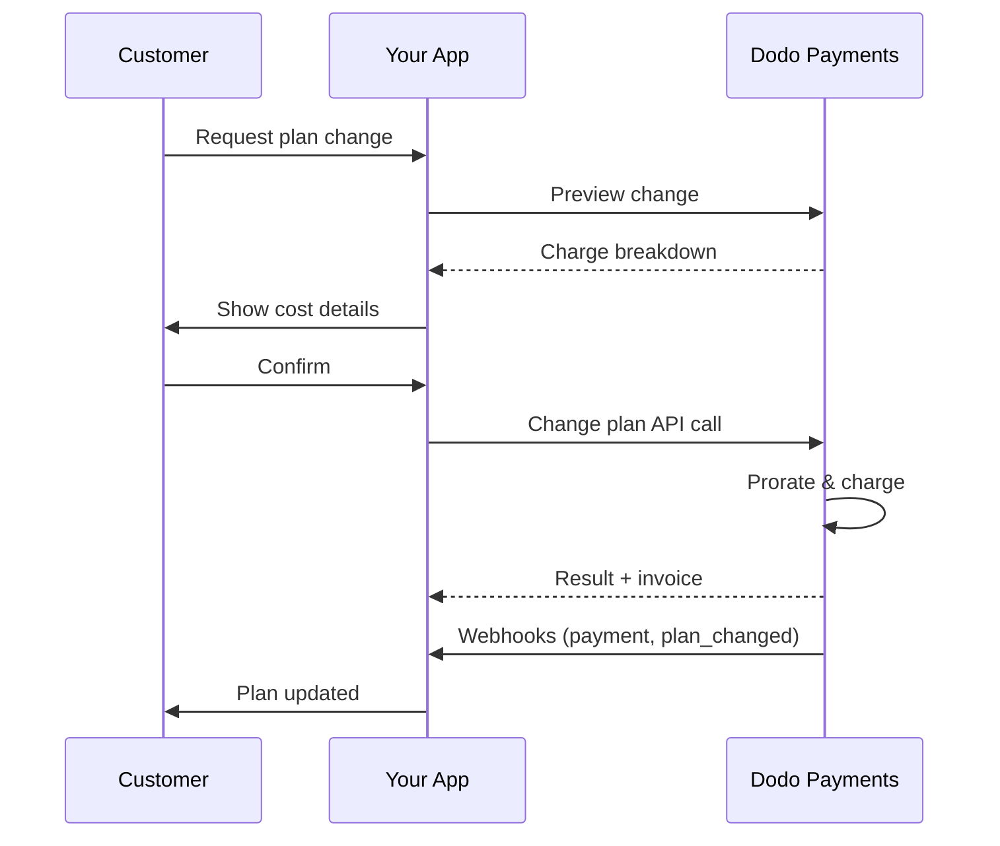
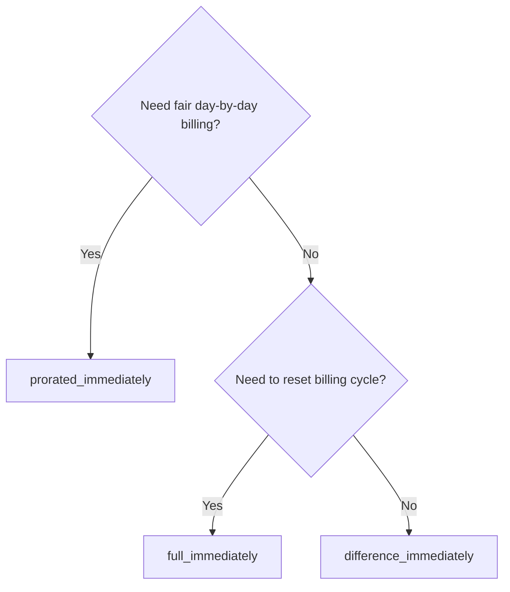
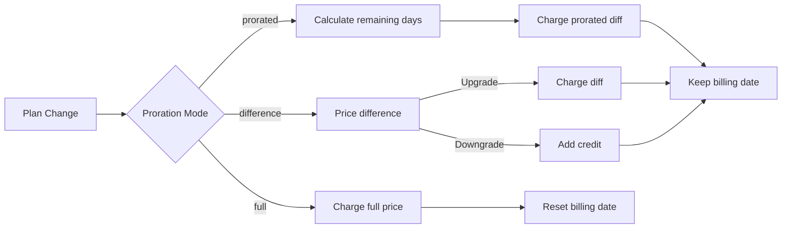

<CardGroup cols={3}>
<Card title="API Ubah Rencana" icon="code" href="/api-reference/subscriptions/change-plan">
  Dokumentasi API lengkap untuk memperbarui langganan.
</Card>
<Card title="Prabawa Ubah Rencana" icon="eye" href="/api-reference/subscriptions/preview-change-plan">
  Lihat jumlah biaya sebelum mengubah rencana.
</Card>
<Card title="Panduan Integrasi" icon="book" href="/developer-resources/subscription-integration-guide">
  Langkah-langkah pengaturan langganan.
</Card>
</CardGroup>

## Apa itu peningkatan atau penurunan langganan?

Mengubah rencana memungkinkan Anda memindahkan pelanggan antara tingkatan atau kuantitas langganan. Gunakan untuk:
- Menyelaraskan harga dengan penggunaan atau fitur
- Beralih dari bulanan ke tahunan (atau sebaliknya)
- Menyesuaikan kuantitas untuk produk berbasis kursi

<Info>
Perubahan rencana dapat memicu biaya segera tergantung pada mode pembagian yang Anda pilih.
</Info>

## Kapan menggunakan perubahan rencana

- Tingkatkan saat pelanggan membutuhkan lebih banyak fitur, penggunaan, atau kursi
- Turunkan saat penggunaan menurun
- Migrasikan pengguna ke produk atau harga baru tanpa membatalkan langganan mereka

## Alur Perubahan Rencana



## Prasyarat

Sebelum menerapkan perubahan rencana langganan, pastikan Anda memiliki:

- Akun pedagang Dodo Payments dengan produk langganan aktif
- Kredensial API (kunci API dan kunci rahasia webhook) dari dasbor
- Langganan aktif yang ada untuk dimodifikasi
- Titik akhir webhook yang dikonfigurasi untuk menangani peristiwa langganan

<Info>
Untuk instruksi pengaturan yang lebih rinci, lihat [Panduan Integrasi](/developer-resources/integration-guide#dashboard-setup).
</Info>

## Panduan Implementasi Langkah-demi-Langkah

Ikuti panduan komprehensif ini untuk menerapkan perubahan rencana langganan di aplikasi Anda:

<Steps>
<Step title="Pahami Persyaratan Perubahan Rencana">
Sebelum menerapkan, tentukan:
- Produk langganan mana yang dapat diubah ke yang lain
- Mode proration mana yang sesuai dengan model bisnis Anda
- Cara menangani perubahan rencana yang gagal dengan baik
- Peristiwa webhook mana yang harus dilacak untuk manajemen status

<Tip>
Uji perubahan rencana secara menyeluruh dalam mode uji sebelum menerapkannya di produksi.
</Tip>
</Step>

<Step title="Pilih Strategi Proration Anda">
Pilih pendekatan penagihan yang sesuai dengan kebutuhan bisnis Anda:

<Tabs>
<Tab title="prorated_immediately">
Terbaik untuk: aplikasi SaaS yang ingin mengenakan biaya secara adil untuk waktu yang tidak terpakai
- Menghitung jumlah prorata yang tepat berdasarkan waktu siklus yang tersisa
- Mengenakan biaya jumlah prorata berdasarkan waktu yang tidak terpakai yang tersisa dalam siklus
- Memberikan penagihan yang transparan kepada pelanggan
</Tab>

<Tab title="difference_immediately">
Terbaik untuk: skenario upgrade/downgrade yang jelas
- Upgrade: Kenakan biaya selisih segera (misalnya, $30→$80 = biaya $50)
- Downgrade: Kredit nilai yang tersisa untuk pembaruan di masa mendatang
- Menyederhanakan logika penagihan dan komunikasi dengan pelanggan
</Tab>

<Tab title="full_immediately">
Terbaik untuk: Ketika Anda ingin mengatur ulang siklus penagihan
- Mengenakan biaya penuh untuk rencana baru segera
- Mengabaikan waktu yang tersisa dari rencana lama
- Berguna untuk transisi tahunan ke bulanan
</Tab>
</Tabs>
</Step>

<Step title="Terapkan API Ubah Rencana">
Gunakan API Ubah Rencana untuk memodifikasi detail langganan:

<ParamField path="subscription_id" type="string" required>
ID langganan aktif yang akan dimodifikasi.
</ParamField>

<ParamField path="product_id" type="string" required>
ID produk baru untuk mengubah langganan.
</ParamField>

<ParamField path="quantity" type="integer" default="1">
Jumlah unit untuk rencana baru (untuk produk berbasis kursi).
</ParamField>

<ParamField path="proration_billing_mode" type="string" required>
Cara menangani penagihan segera: `prorated_immediately`, `full_immediately`, atau `difference_immediately`.
</ParamField>

<ParamField path="addons" type="array">
Addon opsional untuk rencana baru. Mengosongkan ini akan menghapus addon yang ada.
</ParamField>

<ParamField path="on_payment_failure" type="string">
Mengontrol perilaku ketika pembayaran perubahan rencana gagal:
- `prevent_change`: Pertahankan langganan di rencana saat ini hingga pembayaran berhasil
- `apply_change` (default): Terapkan perubahan rencana segera terlepas dari hasil pembayaran

Jika tidak ditentukan, menggunakan pengaturan default tingkat bisnis.

<Step title="Tangani Acara Webhook">
Atur penanganan webhook untuk melacak hasil perubahan rencana:

- `subscription.active`: Perubahan rencana berhasil, langganan diperbarui
- `subscription.plan_changed`: Rencana langganan diubah (upgrade/penurunan/perubahan addon)
- `subscription.on_hold`: Biaya perubahan rencana gagal, langganan tertunda
- `payment.succeeded`: Biaya segera untuk perubahan rencana berhasil
- `payment.failed`: Biaya segera gagal

<Warning>
Selalu verifikasi tanda tangan webhook dan terapkan pemrosesan acara idempotent.
</Warning>
</Step>

<Step title="Perbarui Status Aplikasi Anda">
Berdasarkan acara webhook, perbarui aplikasi Anda:
- Berikan/ambil fitur berdasarkan rencana baru
- Perbarui dasbor pelanggan dengan detail rencana baru
- Kirim email konfirmasi tentang perubahan rencana
- Catat perubahan penagihan untuk tujuan audit
</Step>

<Step title="Uji dan Pantau">
Uji implementasi Anda secara menyeluruh:
- Uji semua mode pembagian dengan berbagai skenario
- Verifikasi penanganan webhook berfungsi dengan benar
- Pantau tingkat keberhasilan perubahan rencana
- Atur peringatan untuk perubahan rencana yang gagal
</Step>

<Check>
Implementasi perubahan rencana langganan Anda sekarang siap untuk digunakan dalam produksi.
</Check>
</Step>
</Steps>

## Prabawa Perubahan Rencana

Sebelum mengkonfirmasi perubahan rencana, gunakan API Prabawa untuk menunjukkan kepada pelanggan tepatnya apa yang akan mereka bayar:

<Tabs>
<Tab title="Node.js SDK">

```javascript
const preview = await client.subscriptions.previewChangePlan('sub_123', {
  product_id: 'prod_pro',
  quantity: 1,
  proration_billing_mode: 'prorated_immediately'
});

// Show customer the charge before confirming
console.log('Immediate charge:', preview.immediate_charge.summary);
console.log('New plan details:', preview.new_plan);
```

</Tab>

<Tab title="Python SDK">

```python
preview = client.subscriptions.preview_change_plan(
    subscription_id="sub_123",
    product_id="prod_pro",
    quantity=1,
    proration_billing_mode="prorated_immediately"
)

# Show customer the charge before confirming
print("Immediate charge:", preview.immediate_charge.summary)
print("New plan details:", preview.new_plan)
```

</Tab>
</Tabs>

<Tip>
Gunakan API prabawa untuk membuat dialog konfirmasi yang menunjukkan kepada pelanggan jumlah tepat yang akan mereka bayar sebelum mereka mengkonfirmasi perubahan rencana.
</Tip>

## API Ubah Rencana

Gunakan API Ubah Rencana untuk mengubah produk, kuantitas, dan perilaku pembagian untuk langganan yang aktif.

### Contoh mulai cepat

<Tabs>
  <Tab title="Node.js SDK">

    ```javascript
    import DodoPayments from 'dodopayments';

    const client = new DodoPayments({
      bearerToken: process.env.DODO_PAYMENTS_API_KEY,
      environment: 'test_mode', // defaults to 'live_mode'
    });

    async function changePlan() {
      const result = await client.subscriptions.changePlan('sub_123', {
        product_id: 'prod_new',
        quantity: 3,
        proration_billing_mode: 'prorated_immediately',
        on_payment_failure: 'prevent_change', // Optional: control behavior on payment failure
      });
      console.log(result.status, result.invoice_id, result.payment_id);
    }

    changePlan();
    ```

  </Tab>
  <Tab title="Python SDK">

    ```python
    import os
    from dodopayments import DodoPayments

    client = DodoPayments(
        bearer_token=os.environ.get("DODO_PAYMENTS_API_KEY"),
        environment="test_mode",  # defaults to "live_mode"
    )

    result = client.subscriptions.change_plan(
        subscription_id="sub_123",
        product_id="prod_new",
        quantity=3,
        proration_billing_mode="prorated_immediately",
        on_payment_failure="prevent_change",  # Optional: control behavior on payment failure
    )
    print(result.status, result.get("invoice_id"), result.get("payment_id"))
    ```

  </Tab>
  <Tab title="Go SDK">

    ```go
    package main

    import (
      "context"
      "fmt"
      "github.com/dodopayments/dodopayments-go"
      "github.com/dodopayments/dodopayments-go/option"
    )

    func main() {
      client := dodopayments.NewClient(option.WithBearerToken("YOUR_TOKEN"))
      res, err := client.Subscriptions.ChangePlan(context.TODO(), dodopayments.SubscriptionChangePlanParams{
        SubscriptionID: dodopayments.F("sub_123"),
        ProductID:             dodopayments.F("prod_new"),
        Quantity:              dodopayments.F(int64(3)),
        ProrationBillingMode:  dodopayments.F(dodopayments.SubscriptionChangePlanParamsProrationBillingModeProratedImmediately),
        OnPaymentFailure:      dodopayments.F(dodopayments.OnPaymentFailurePreventChange), // Optional
      })
      if err != nil { panic(err) }
      fmt.Println(res.Status, res.InvoiceID, res.PaymentID)
    }
    ```

  </Tab>
  <Tab title="HTTP">

    ```bash
    curl -X POST "$DODO_API_BASE/subscriptions/sub_123/change-plan" \
      -H "Authorization: Bearer $DODO_PAYMENTS_API_KEY" \
      -H "Content-Type: application/json" \
      -d '{
        "product_id": "prod_new",
        "quantity": 3,
        "proration_billing_mode": "prorated_immediately",
        "on_payment_failure": "prevent_change"
      }'
    ```

  </Tab>
</Tabs>

```json Success
{
  "status": "processing",
  "subscription_id": "sub_123",
  "invoice_id": "inv_789",
  "payment_id": "pay_456",
  "proration_billing_mode": "prorated_immediately"
}
```

<Note>
Bidang seperti <code>invoice_id</code> dan <code>payment_id</code> hanya akan dikembalikan ketika biaya segera dan/atau faktur dibuat selama perubahan rencana. Selalu bergantung pada acara webhook (misalnya, <code>payment.succeeded</code>, <code>subscription.plan_changed</code>) untuk mengkonfirmasi hasilnya.
</Note>

<Warning>
Jika biaya segera gagal, langganan mungkin berpindah ke `subscription.on_hold` hingga pembayaran berhasil.
</Warning>

## Mengelola Addon

Saat mengubah rencana langganan, Anda juga dapat memodifikasi addon:

```javascript
// Add addons to the new plan
await client.subscriptions.changePlan('sub_123', {
  product_id: 'prod_new',
  quantity: 1,
  proration_billing_mode: 'difference_immediately',
  addons: [
    { addon_id: 'addon_123', quantity: 2 }
  ]
});

// Remove all existing addons
await client.subscriptions.changePlan('sub_123', {
  product_id: 'prod_new',
  quantity: 1,
  proration_billing_mode: 'difference_immediately',
  addons: [] // Empty array removes all existing addons
});
```

<Info>
Addon termasuk dalam perhitungan pembagian dan akan dikenakan biaya sesuai dengan mode pembagian yang dipilih.
</Info>

## Mode Pembagian

Pilih bagaimana menagih pelanggan saat mengubah rencana:

#### `prorated_immediately`
- Mengenakan biaya untuk selisih parsial dalam siklus saat ini
- Jika dalam masa percobaan, mengenakan biaya segera dan beralih ke rencana baru sekarang
- Penurunan: dapat menghasilkan kredit prorata yang diterapkan pada pembaruan mendatang

#### `full_immediately`
- Mengenakan biaya penuh untuk rencana baru segera
- Mengabaikan waktu yang tersisa dari rencana lama

<Info>
Kredit yang dibuat oleh penurunan menggunakan <code>difference_immediately</code> bersifat lingkup langganan dan berbeda dari <a href="/features/customer-credit">Kredit Pelanggan</a>. Mereka secara otomatis diterapkan pada pembaruan mendatang dari langganan yang sama dan tidak dapat dipindahkan antar langganan.
</Info>

#### `difference_immediately`
- Upgrade: mengenakan biaya segera selisih harga antara rencana lama dan baru
- Penurunan: menambahkan nilai yang tersisa sebagai kredit internal ke langganan dan menerapkannya secara otomatis pada pembaruan

| Fitur | `prorated_immediately` | `difference_immediately` | `full_immediately` |
|---------|----------------------|------------------------|-------------------|
| **Biaya Upgrade** | Selisih prorata untuk hari yang tersisa | Selisih harga penuh antara rencana | Harga penuh rencana baru |
| **Kredit Penurunan** | Kredit prorata untuk hari yang tersisa | Selisih harga penuh sebagai kredit | Tidak ada kredit |
| **Siklus Penagihan** | Tidak berubah | Tidak berubah | Direset ke hari ini |
| **Perilaku Percobaan** | Mengakhiri percobaan, mengenakan biaya segera | Mengakhiri percobaan, mengenakan biaya segera | Mengakhiri percobaan, mengenakan biaya penuh |
| **Terbaik untuk** | Penagihan berbasis waktu yang adil | Matematika upgrade/penurunan yang sederhana | Mengatur ulang siklus penagihan |
| **Kompleksitas** | Sedang (perhitungan hari) | Rendah (pengurangan sederhana) | Rendah (biaya penuh) |



### Skenario Contoh

Gunakan angka kanonik ini secara konsisten:
- Rencana saat ini: **Dasar** seharga **$30/bulan**
- Target upgrade: **Pro** seharga **$80/bulan**
- Target penurunan (dari Pro): **Pemula** seharga **$20/bulan**
- Siklus penagihan: **30 hari**, dimulai pada **1 Januari**
- Perubahan rencana terjadi pada **16 Januari** (15 hari tersisa, 15 hari digunakan)

<AccordionGroup>
  <Accordion title="Upgrade: Dasar ($30) → Pro ($80) dengan prorated_immediately">

    ```
    Step 1: Calculate unused credit from current plan
      Unused days = 15 out of 30 days
      Credit = $30 × (15/30) = $15.00

    Step 2: Calculate prorated cost of new plan
      Remaining days = 15 out of 30 days
      New plan cost = $80 × (15/30) = $40.00

    Step 3: Calculate immediate charge
      Charge = New plan cost − Credit
      Charge = $40.00 − $15.00 = $25.00

    → Customer pays $25.00 now
    → Next renewal (Feb 1): $80.00/month
    ```

    ```javascript
    await client.subscriptions.changePlan('sub_123', {
      product_id: 'prod_pro',
      quantity: 1,
      proration_billing_mode: 'prorated_immediately'
    })
    ```

  </Accordion>

  <Accordion title="Penurunan: Pro ($80) → Pemula ($20) dengan prorated_immediately">

    ```
    Step 1: Calculate unused credit from current plan
      Unused days = 15 out of 30 days
      Credit = $80 × (15/30) = $40.00

    Step 2: Calculate prorated cost of new plan
      Remaining days = 15 out of 30 days
      New plan cost = $20 × (15/30) = $10.00

    Step 3: Calculate credit balance
      Credit = $40.00 − $10.00 = $30.00

    → No charge — $30.00 credit added to subscription
    → Credit auto-applies to future renewals
    → Next renewal (Feb 1): $20.00 − $30.00 credit = $0.00
    → Following renewal (Mar 1): $20.00 − $10.00 remaining credit = $10.00
    ```

    ```javascript
    await client.subscriptions.changePlan('sub_123', {
      product_id: 'prod_starter',
      quantity: 1,
      proration_billing_mode: 'prorated_immediately'
    })
    ```

  </Accordion>

  <Accordion title="Upgrade: Dasar ($30) → Pro ($80) dengan difference_immediately">

    ```
    Immediate charge = New plan price − Old plan price
                     = $80 − $30
                     = $50.00

    → Customer pays $50.00 now (regardless of cycle position)
    → Next renewal (Feb 1): $80.00/month
    ```

    ```javascript
    await client.subscriptions.changePlan('sub_123', {
      product_id: 'prod_pro',
      quantity: 1,
      proration_billing_mode: 'difference_immediately'
    })
    ```

  </Accordion>

  <Accordion title="Penurunan: Pro ($80) → Pemula ($20) dengan difference_immediately">

    ```
    Credit = Old plan price − New plan price
           = $80 − $20
           = $60.00

    → No charge — $60.00 credit added to subscription
    → Credit auto-applies to future renewals
    → Next renewal: $20.00 − $20.00 (from credit) = $0.00
    → Following renewal: $20.00 − $20.00 (from credit) = $0.00
    → Third renewal: $20.00 − $20.00 (from remaining credit) = $0.00
    ```

    ```javascript
    await client.subscriptions.changePlan('sub_123', {
      product_id: 'prod_starter',
      quantity: 1,
      proration_billing_mode: 'difference_immediately'
    })
    ```

  </Accordion>

  <Accordion title="Upgrade: Dasar ($30) → Pro ($80) dengan full_immediately">

    ```
    Immediate charge = Full new plan price = $80.00

    → Customer pays $80.00 now
    → No credit for unused time on old plan
    → Billing cycle resets to today (January 16)
    → Next renewal: February 16 at $80.00/month
    ```

    ```javascript
    await client.subscriptions.changePlan('sub_123', {
      product_id: 'prod_pro',
      quantity: 1,
      proration_billing_mode: 'full_immediately'
    })
    ```

  </Accordion>

  <Accordion title="Upgrade mid-siklus dengan addon menggunakan prorated_immediately">

    ```
    Current: Basic plan ($30/month), no add-ons
    New: Pro plan ($80/month) + Extra Seats add-on ($10/seat × 3 seats = $30/month)
    Change on day 16 of 30 (15 days remaining)

    Step 1: Credit from current plan
      Credit = $30 × (15/30) = $15.00

    Step 2: Prorated cost of new plan + add-ons
      New plan = $80 × (15/30) = $40.00
      Add-ons = $30 × (15/30) = $15.00
      Total new = $55.00

    Step 3: Immediate charge
      Charge = $55.00 − $15.00 = $40.00

    → Customer pays $40.00 now
    → Next renewal: $80.00 + $30.00 = $110.00/month
    ```

    ```javascript
    await client.subscriptions.changePlan('sub_123', {
      product_id: 'prod_pro',
      quantity: 1,
      proration_billing_mode: 'prorated_immediately',
      addons: [
        { addon_id: 'addon_seats', quantity: 3 }
      ]
    })
    ```

  </Accordion>
</AccordionGroup>

### Bagaimana setiap mode memproses penagihan



<Tip>
Pilih `prorated_immediately` untuk akuntansi yang adil berdasarkan waktu; pilih `full_immediately` untuk memulai ulang penagihan; gunakan `difference_immediately` untuk upgrade yang sederhana dan kredit otomatis pada penurunan.
</Tip>

## Menangani Kegagalan Pembayaran

Kontrol apa yang terjadi ketika pembayaran perubahan rencana gagal menggunakan parameter `on_payment_failure`.

### Mode Kegagalan Pembayaran

<Tabs>
<Tab title="prevent_change (Direkomendasikan untuk upgrade kritis)">
**Perilaku**: Pertahankan langganan di rencana saat ini hingga pembayaran berhasil.

- Perubahan rencana ditandai sebagai "tertunda"
- Pelanggan mempertahankan akses ke rencana saat ini
- Langganan berpindah ke `active` hanya setelah pembayaran berhasil
- Berguna ketika Anda ingin memastikan pembayaran sebelum memberikan fitur yang ditingkatkan

```javascript
await client.subscriptions.changePlan('sub_123', {
  product_id: 'prod_pro',
  quantity: 1,
  proration_billing_mode: 'prorated_immediately',
  on_payment_failure: 'prevent_change'
});
```

</Tab>

<Tab title="apply_change (Default)">
**Perilaku**: Terapkan perubahan rencana segera terlepas dari hasil pembayaran.

- Perubahan rencana diterapkan meskipun pembayaran gagal
- Pelanggan mendapatkan akses segera ke rencana baru
- Langganan mungkin berpindah ke `on_hold` jika pembayaran gagal
- Baik untuk upgrade yang tidak kritis atau ketika Anda mempercayai pelanggan

```javascript
await client.subscriptions.changePlan('sub_123', {
  product_id: 'prod_pro',
  quantity: 1,
  proration_billing_mode: 'prorated_immediately',
  on_payment_failure: 'apply_change' // This is the default
});
```

</Tab>
</Tabs>

<Info>
Jika tidak ditentukan, parameter `on_payment_failure` menggunakan pengaturan default tingkat bisnis Anda yang dikonfigurasi di dasbor.
</Info>

### Kapan Menggunakan Setiap Mode

| Skenario | Mode Direkomendasikan | Alasan |
|----------|------------------|--------|
| Meningkatkan ke fitur premium | `prevent_change` | Pastikan pembayaran sebelum memberikan akses |
| Meningkatkan kuantitas (lebih banyak kursi) | `prevent_change` | Mencegah penggunaan tanpa pembayaran |
| Menurunkan rencana | `apply_change` | Pelanggan mengurangi pengeluaran |
| Pelanggan perusahaan yang dipercaya | `apply_change` | Risiko non-pembayaran yang lebih rendah |
| Konversi dari percobaan ke dibayar | `prevent_change` | Momen pembayaran yang kritis |

## Menangani webhook

Lacak status langganan melalui webhook untuk mengonfirmasi perubahan rencana dan pembayaran.

### Jenis acara yang perlu ditangani
- `subscription.active`: langganan diaktifkan
- `subscription.plan_changed`: rencana langganan diubah (upgrade/down/ubah addon)
- `subscription.on_hold`: biaya gagal, langganan ditangguhkan
- `subscription.renewed`: pembaruan berhasil
- `payment.succeeded`: pembayaran untuk perubahan rencana atau pembaruan berhasil
- `payment.failed`: pembayaran gagal

<Info>
Kami merekomendasikan mengarahkan logika bisnis dari acara langganan dan menggunakan acara pembayaran untuk konfirmasi dan rekonsiliasi.
</Info>

### Verifikasi tanda tangan dan tangani niatan

<Tabs>
  <Tab title="Handler Rute Next.js">

    ```javascript
    import { NextRequest, NextResponse } from 'next/server';
    
    export async function POST(req) {
      const webhookId = req.headers.get('webhook-id');
      const webhookSignature = req.headers.get('webhook-signature');
      const webhookTimestamp = req.headers.get('webhook-timestamp');
      const secret = process.env.DODO_WEBHOOK_SECRET;
    
      const payload = await req.text();
      // verifySignature is a placeholder – in production, use a Standard Webhooks library
      const { valid, event } = await verifySignature(
        payload,
        { id: webhookId, signature: webhookSignature, timestamp: webhookTimestamp },
        secret
      );
      if (!valid) return NextResponse.json({ error: 'Invalid signature' }, { status: 400 });
    
      switch (event.type) {
        case 'subscription.active':
          // mark subscription active in your DB
          break;
        case 'subscription.plan_changed':
          // refresh entitlements and reflect the new plan in your UI
          break;
        case 'subscription.on_hold':
          // notify user to update payment method
          break;
        case 'subscription.renewed':
          // extend access window
          break;
        case 'payment.succeeded':
          // reconcile payment for plan change
          break;
        case 'payment.failed':
          // log and alert
          break;
        default:
          // ignore unknown events
          break;
      }
    
      return NextResponse.json({ received: true });
    }
    ```

  </Tab>
  <Tab title="Express.js">

    ```javascript
    import express from 'express';
    
    const app = express();
    app.post('/webhooks/dodo', express.raw({ type: 'application/json' }), async (req, res) => {
      const webhookId = req.header('webhook-id');
      const webhookSignature = req.header('webhook-signature');
      const webhookTimestamp = req.header('webhook-timestamp');
      const secret = process.env.DODO_WEBHOOK_SECRET;
      const payload = req.body.toString('utf8');
    
      const { valid, event } = await verifySignature(
        payload,
        { id: webhookId, signature: webhookSignature, timestamp: webhookTimestamp },
        secret
      );
      if (!valid) return res.status(400).send('Invalid signature');
    
      // handle events like above
      res.json({ received: true });
    });
    
    app.listen(3000);
    ```

  </Tab>
</Tabs>

<Note>
Untuk skema payload yang lebih rinci, lihat <a href="/developer-resources/webhooks/intents/subscription">Payload webhook langganan</a> dan <a href="/developer-resources/webhooks/intents/payment">Payload webhook pembayaran</a>.
</Note>

## Praktik Terbaik

Ikuti rekomendasi ini untuk perubahan rencana langganan yang dapat diandalkan:

### Strategi Perubahan Rencana
- **Uji secara menyeluruh**: Selalu uji perubahan rencana dalam mode uji sebelum produksi
- **Pilih pembagian dengan hati-hati**: Pilih mode pembagian yang sesuai dengan model bisnis Anda
- **Tangani kegagalan dengan baik**: Terapkan penanganan kesalahan yang tepat dan logika uji ulang
- **Pantau tingkat keberhasilan**: Lacak tingkat keberhasilan/gagal dari perubahan rencana dan selidiki masalah

### Implementasi Webhook
- **Verifikasi tanda tangan**: Selalu validasi tanda tangan webhook untuk memastikan keaslian
- **Terapkan idempotensi**: Tangani acara webhook duplikat dengan baik
- **Proses secara asinkron**: Jangan blokir respons webhook dengan operasi berat
- **Catat semuanya**: Simpan log rinci untuk tujuan debugging dan audit


### Pengalaman Pengguna
- **Komunikasikan dengan jelas**: Informasikan pelanggan tentang perubahan penagihan dan waktu
- **Berikan konfirmasi**: Kirim email konfirmasi untuk perubahan rencana yang berhasil
- **Tangani kasus tepi**: Pertimbangkan masa percobaan, pembagian, dan pembayaran yang gagal
- **Perbarui UI segera**: Refleksikan perubahan rencana dalam antarmuka aplikasi Anda

## Masalah Umum dan Solusi

Atasi masalah tipikal yang ditemui selama perubahan rencana langganan:

<AccordionGroup>
<Accordion title="Biaya dibuat tetapi langganan tidak diperbarui">
**Gejala**: Panggilan API berhasil tetapi langganan tetap pada rencana lama.

**Penyebab umum**:
- Pemrosesan webhook gagal atau tertunda
- Status aplikasi tidak diperbarui setelah menerima webhook
- Masalah transaksi basis data selama pembaruan status

**Solusi**:
- Terapkan penanganan webhook yang kuat dengan logika uji ulang
- Gunakan operasi idempotent untuk pembaruan status
- Tambahkan pemantauan untuk mendeteksi dan memberi tahu tentang acara webhook yang terlewat
- Verifikasi endpoint webhook dapat diakses dan merespons dengan benar
</Accordion>

<Accordion title="Kredit tidak diterapkan setelah penurunan">
**Gejala**: Pelanggan menurunkan tetapi tidak melihat saldo kredit

**Penyebab umum**:
- Harapan mode pembagian: penurunan memberi kredit selisih harga penuh dengan `difference_immediately`, sedangkan `prorated_immediately` menghasilkan kredit prorata berdasarkan waktu yang tersisa dalam siklus
- Kredit bersifat spesifik langganan dan tidak dipindahkan antar langganan
- Saldo kredit tidak terlihat di dasbor pelanggan

**Solusi**:
- Gunakan `difference_immediately` untuk penurunan saat Anda ingin memberikan kredit otomatis
- Jelaskan kepada pelanggan bahwa kredit berlaku untuk pembaruan di masa mendatang dari langganan yang sama
- Terapkan portal pelanggan untuk menunjukkan saldo kredit
- Periksa prabawa faktur berikutnya untuk melihat kredit yang diterapkan
</Accordion>

<Accordion title="Verifikasi tanda tangan webhook gagal">
**Gejala**: Acara webhook ditolak karena tanda tangan tidak valid

**Penyebab umum**:
- Kunci rahasia webhook tidak benar
- Body permintaan asli dimodifikasi sebelum verifikasi tanda tangan
- Algoritme verifikasi tanda tangan yang salah

**Solusi**:
- Verifikasi Anda menggunakan `DODO_WEBHOOK_SECRET` yang benar dari dasbor
- Baca body permintaan asli sebelum middleware parsing JSON
- Gunakan library verifikasi webhook standar untuk platform Anda
- Uji verifikasi tanda tangan webhook di lingkungan pengembangan
</Accordion>

<Accordion title="Perubahan rencana gagal dengan kesalahan 422">
**Gejala**: API mengembalikan kesalahan 422 Entitas Tidak Dapat Diproses

**Penyebab umum**:
- ID langganan tidak valid atau ID produk
- Langganan tidak dalam status aktif
- Parameter yang diperlukan hilang
- Produk tidak tersedia untuk perubahan rencana

**Solusi**:
- Verifikasi bahwa langganan ada dan aktif
- Periksa apakah ID produk valid dan tersedia
- Pastikan semua parameter yang diperlukan disediakan
- Tinjau dokumentasi API untuk persyaratan parameter
</Accordion>

<Accordion title="Biaya segera gagal selama perubahan rencana">
**Gejala**: Perubahan rencana dimulai tetapi biaya segera gagal

**Penyebab umum**:
- Dana tidak mencukupi pada metode pembayaran pelanggan
- Metode pembayaran kedaluwarsa atau tidak valid
- Bank menolak transaksi
- Deteksi penipuan memblokir biaya

**Solusi**:
- Tangani acara webhook `payment.failed` dengan tepat
- Beri tahu pelanggan untuk memperbarui metode pembayaran
- Terapkan logika uji ulang untuk kegagalan sementara
- Pertimbangkan untuk mengizinkan perubahan rencana dengan biaya segera yang gagal
</Accordion>

<Accordion title="Langganan ditangguhkan setelah perubahan rencana">
**Gejala**: Biaya perubahan rencana gagal dan langganan berpindah ke `on_hold` state

**Apa yang terjadi**:
Ketika biaya perubahan rencana gagal, langganan secara otomatis ditempatkan dalam state `on_hold`. Langganan tidak akan diperbarui secara otomatis hingga metode pembayaran diperbarui.

**Solusi**: Perbarui metode pembayaran untuk mengaktifkan ulang langganan

Untuk mengaktifkan ulang langganan dari state `on_hold` setelah perubahan rencana yang gagal:

1. **Perbarui metode pembayaran** menggunakan API Perbarui Metode Pembayaran
2. **Pembuatan biaya otomatis**: API secara otomatis membuat biaya untuk kewajiban yang tersisa
3. **Pembuatan faktur**: Faktur dibuat untuk biaya
4. **Pemrosesan pembayaran**: Pembayaran diproses menggunakan metode pembayaran baru
5. **Pengaktifan ulang**: Setelah pembayaran berhasil, langganan diaktifkan kembali ke state `active`

<CodeGroup>

```javascript Node.js
// Reactivate subscription from on_hold after failed plan change
async function reactivateAfterFailedPlanChange(subscriptionId) {
  // Update payment method - automatically creates charge for remaining dues
  const response = await client.subscriptions.updatePaymentMethod(subscriptionId, {
    type: 'new',
    return_url: 'https://example.com/return'
  });
  
  if (response.payment_id) {
    console.log('Charge created for remaining dues:', response.payment_id);
    console.log('Payment link:', response.payment_link);
    
    // Redirect customer to payment_link to complete payment
    // Monitor webhooks for:
    // 1. payment.succeeded - charge succeeded
    // 2. subscription.active - subscription reactivated
  }
  
  return response;
}

// Or use existing payment method if available
async function reactivateWithExistingPaymentMethod(subscriptionId, paymentMethodId) {
  const response = await client.subscriptions.updatePaymentMethod(subscriptionId, {
    type: 'existing',
    payment_method_id: paymentMethodId
  });
  
  // Monitor webhooks for payment.succeeded and subscription.active
  return response;
}
```

```python Python
# Reactivate subscription from on_hold after failed plan change
def reactivate_after_failed_plan_change(subscription_id):
    # Update payment method - automatically creates charge for remaining dues
    response = client.subscriptions.update_payment_method(
        subscription_id=subscription_id,
        type="new",
        return_url="https://example.com/return"
    )
    
    if response.payment_id:
        print("Charge created for remaining dues:", response.payment_id)
        print("Payment link:", response.payment_link)
        
        # Redirect customer to payment_link to complete payment
        # Monitor webhooks for:
        # 1. payment.succeeded - charge succeeded
        # 2. subscription.active - subscription reactivated
    
    return response

# Or use existing payment method if available
def reactivate_with_existing_payment_method(subscription_id, payment_method_id):
    response = client.subscriptions.update_payment_method(
        subscription_id=subscription_id,
        type="existing",
        payment_method_id=payment_method_id
    )
    
    # Monitor webhooks for payment.succeeded and subscription.active
    return response
```

</CodeGroup>

**Acara webhook untuk dipantau**:
- `subscription.on_hold`: Langganan ditempatkan pada tahanan (diterima saat biaya perubahan rencana gagal)
- `payment.succeeded`: Pembayaran kewajiban tersisa berhasil (setelah memperbarui metode pembayaran)
- `subscription.active`: Langganan diaktifkan kembali setelah pembayaran berhasil

**Praktik terbaik**:
- Beri tahu pelanggan segera saat biaya perubahan rencana gagal
- Berikan instruksi yang jelas tentang cara memperbarui metode pembayaran mereka
- Pantau acara webhook untuk melacak status pengaktifan kembali
- Pertimbangkan menerapkan logika uji ulang otomatis untuk kegagalan pembayaran sementara

<Card title="Referensi API Perbarui Metode Pembayaran" icon="code" href="/api-reference/subscriptions/update-payment-method">
Lihat dokumentasi API lengkap untuk memperbarui metode pembayaran dan mengaktifkan kembali langganan.
</Card>
</Accordion>
</AccordionGroup>

## Menguji Implementasi Anda

Ikuti langkah-langkah ini untuk menguji implementasi perubahan rencana langganan Anda secara menyeluruh:

<Steps>
<Step title="Atur lingkungan uji">
- Gunakan kunci API pengujian dan produk pengujian
- Buat langganan pengujian dengan berbagai jenis rencana
- Konfigurasi endpoint webhook pengujian
- Atur pemantauan dan pencatatan
</Step>

<Step title="Uji berbagai mode pembagian">
- Uji `prorated_immediately` dengan berbagai posisi siklus penagihan
- Uji `difference_immediately` untuk upgrade dan penurunan
- Uji `full_immediately` untuk memulai ulang siklus penagihan
- Verifikasi perhitungan kredit sudah benar
</Step>

<Step title="Uji penanganan webhook">
- Verifikasi semua acara webhook relevan diterima
- Uji verifikasi tanda tangan webhook
- Tangani acara webhook duplikat dengan baik
- Uji skenario kegagalan pemrosesan webhook
</Step>

<Step title="Uji skenario kesalahan">
- Uji dengan ID langganan yang tidak valid
- Uji dengan metode pembayaran yang kedaluwarsa
- Uji kegagalan jaringan dan waktu habis
- Uji dengan dana tidak mencukupi
</Step>

<Step title="Pantau dalam produksi">
- Atur peringatan untuk perubahan rencana yang gagal
- Pantau waktu pemrosesan webhook
- Lacak tingkat keberhasilan perubahan rencana
- Tinjau tiket dukungan pelanggan untuk masalah perubahan rencana
</Step>
</Steps>

## Penanganan Kesalahan

Tangani kesalahan API umum dengan baik dalam implementasi Anda:

### Kode Status HTTP

<AccordionGroup>
<Accordion title="200 OK">
Permintaan perubahan rencana diproses dengan sukses. Langganan sedang diperbarui dan proses pembayaran telah dimulai.
</Accordion>

<Accordion title="400 Bad Request">
Parameter permintaan tidak valid. Periksa bahwa semua bidang yang diperlukan telah disediakan dan diformat dengan benar.
</Accordion>

<Accordion title="401 Unauthorized">
Kunci API tidak valid atau hilang. Verifikasi `DODO_PAYMENTS_API_KEY` Anda benar dan memiliki izin yang tepat.
</Accordion>

<Accordion title="404 Not Found">
ID langganan tidak ditemukan atau tidak milik akun Anda.
</Accordion>

<Accordion title="422 Unprocessable Entity">
Langganan tidak dapat diubah (misalnya, sudah dibatalkan, produk tidak tersedia, dll.).
</Accordion>

<Accordion title="500 Internal Server Error">
Terjadi kesalahan server. Coba ulang permintaan setelah jeda singkat.
</Accordion>
</AccordionGroup>

### Format Respon Kesalahan

```json
{
  "error": {
    "code": "subscription_not_found",
    "message": "The subscription with ID 'sub_123' was not found",
    "details": {
      "subscription_id": "sub_123"
    }
  }
}
```

## Langkah Selanjutnya

- Tinjau <a href="/api-reference/subscriptions/change-plan">API Ubah Rencana</a>
- Jelajahi <a href="/features/customer-credit">Kredit Pelanggan</a>
- Terapkan peringatan untuk `subscription.on_hold`
- Periksa Panduan <a href="/developer-resources/webhooks">Integrasi Webhook</a>
