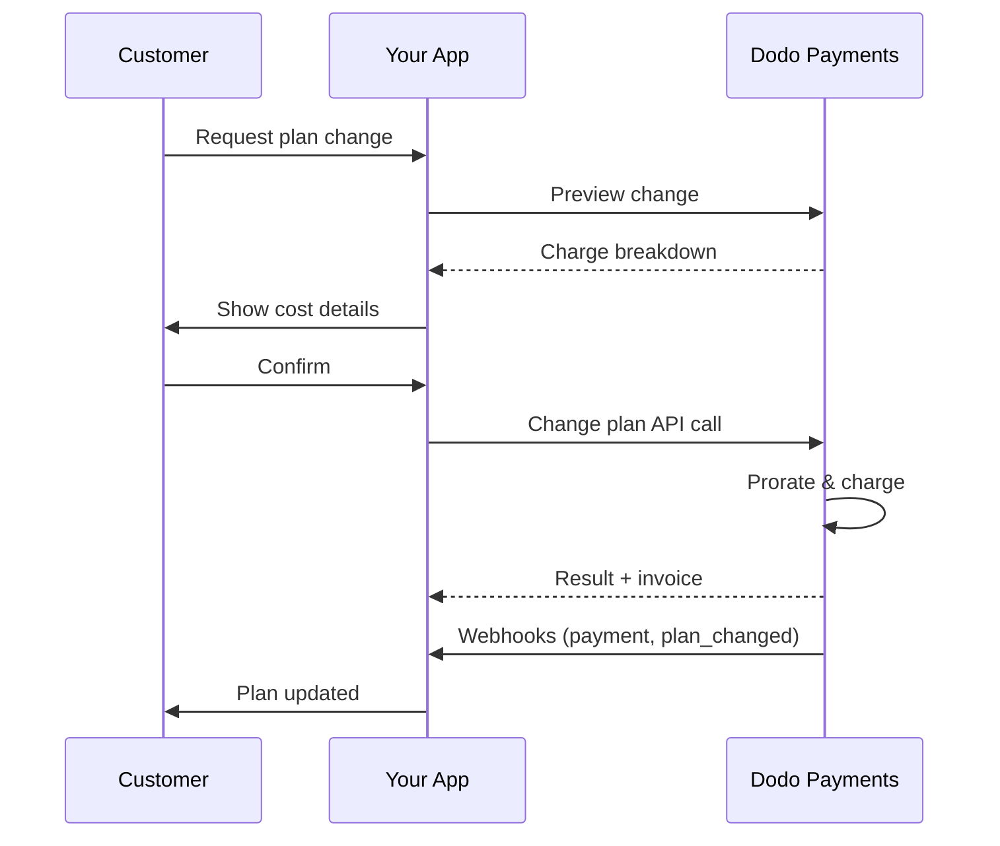
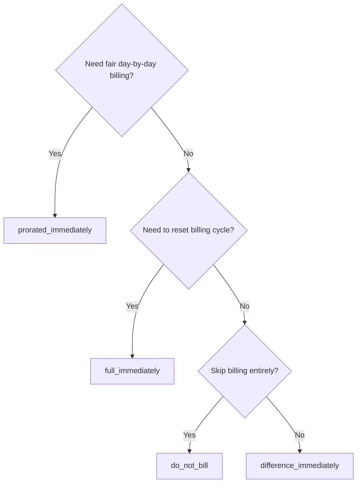
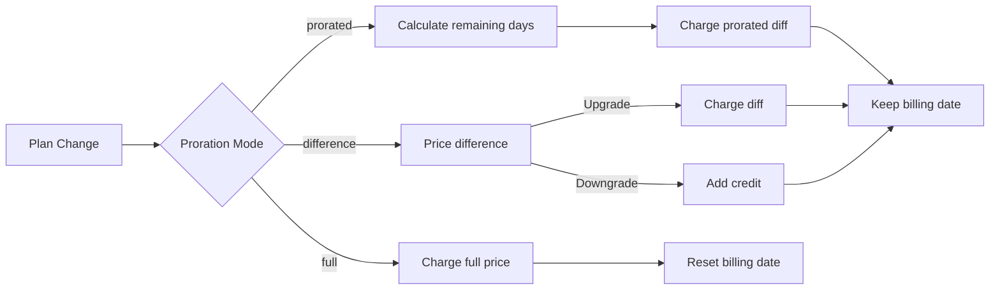

<CardGroup cols={3}>
<Card title="Change Plan API" icon="code" href="/api-reference/subscriptions/change-plan">
  Full API docs for updating subscriptions.
</Card>
<Card title="Plan Change Preview" icon="eye" href="/api-reference/subscriptions/preview-change-plan">
  See charge amounts before changing plans.
</Card>
<Card title="Integration Guide" icon="book" href="/developer-resources/subscription-integration-guide">
  Step-by-step subscription setup.
</Card>
</CardGroup>

## What is a subscription upgrade or downgrade?

Changing plans lets you move a customer between subscription tiers or quantities. Use it to:
- Align pricing with usage or features
- Move from monthly to annual (or vice versa)
- Adjust quantity for seat-based products

<Info>
Plan changes can trigger an immediate charge depending on the proration mode you choose.
</Info>

## When to use plan changes

- Upgrade when a customer needs more features, usage, or seats
- Downgrade when usage decreases
- Migrate users to a new product or price without cancelling their subscription

## Plan Change Flow



## Prerequisites

Before implementing subscription plan changes, ensure you have:

- A Dodo Payments merchant account with active subscription products
- API credentials (API key and webhook secret key) from the dashboard
- An existing active subscription to modify
- Webhook endpoint configured to handle subscription events

<Info>
For detailed setup instructions, see our [Integration Guide](/developer-resources/integration-guide#dashboard-setup).
</Info>

## Step-by-Step Implementation Guide

Follow this comprehensive guide to implement subscription plan changes in your application:

<Steps>
<Step title="Understand Plan Change Requirements">
Before implementing, determine:
- Which subscription products can be changed to which others
- What proration mode fits your business model
- How to handle failed plan changes gracefully
- Which webhook events to track for state management

<Tip>
Test plan changes thoroughly in test mode before implementing in production.
</Tip>
</Step>

<Step title="Choose Your Proration Strategy">
Select the billing approach that aligns with your business needs:

<Tabs>
<Tab title="prorated_immediately">
Best for: SaaS applications wanting to charge fairly for unused time
- Calculates exact prorated amount based on remaining cycle time
- Charges a prorated amount based on unused time remaining in the cycle
- Provides transparent billing to customers
</Tab>

<Tab title="difference_immediately">
Best for: Clear upgrade/downgrade scenarios
- Upgrade: Charge immediate difference (e.g., $30→$80 = charge $50)
- Downgrade: Credit remaining value for future renewals
- Simplifies billing logic and customer communication
</Tab>

/* LOCKED_PATTERN_4e8bc31cac215c51dc616cc2b4d7cae7 */
Terbaik untuk: Ketika Anda ingin mengatur ulang siklus penagihan
- Segera mengenakan biaya penuh untuk paket baru
- Mengabaikan sisa waktu dari paket lama
- Berguna untuk transisi tahunan ke bulanan
/* LOCKED_PATTERN_78e639af1281cd283655f496a1d1405c */

/* LOCKED_PATTERN_7fa7f81fc66b83c441dd56aff76d586c */
Terbaik untuk: Migrasi bebas biaya, pergantian gratis, atau menyerap perbedaan biaya
- Tidak ada penyesuaian biaya atau kredit
- Pelanggan langsung pindah ke paket baru tanpa penyesuaian penagihan
- Siklus penagihan tidak berubah
/* LOCKED_PATTERN_78e639af1281cd283655f496a1d1405c */
/* LOCKED_PATTERN_0c2288c06aada9f019d2bafea4e5f3fb */
/* LOCKED_PATTERN_640d0b31f6faa54914d25c81f5dbf413 */

/* LOCKED_PATTERN_62685552c5becb87cfeddbb400a3e69b */
Gunakan API Ubah Paket untuk memodifikasi detail langganan:

/* LOCKED_PATTERN_7e195998c0478138079a3453fa732ec6 */
ID langganan aktif yang akan diubah.
/* LOCKED_PATTERN_77dc7d49f01ac1386a904a5fe6b66ba5 */

/* LOCKED_PATTERN_53c5caa7464fa50a77c281d817cdcfeb */
ID produk baru untuk mengganti langganan.
/* LOCKED_PATTERN_77dc7d49f01ac1386a904a5fe6b66ba5 */

/* LOCKED_PATTERN_abb039843c728548f231dbeb0fcdd9b3 */
Jumlah unit untuk paket baru (untuk produk berbasis kursi).
/* LOCKED_PATTERN_77dc7d49f01ac1386a904a5fe6b66ba5 */

/* LOCKED_PATTERN_bc19276616f3b9480f5060c3a7182ebe */
Cara menangani penagihan segera: `prorated_immediately`, `full_immediately`, `difference_immediately`, atau `do_not_bill`.
/* LOCKED_PATTERN_77dc7d49f01ac1386a904a5fe6b66ba5 */

/* LOCKED_PATTERN_462f745b62717d1aeb8759a350b718dd */
Addon opsional untuk paket baru. Membiarkan ini kosong akan menghapus add-on yang ada.
/* LOCKED_PATTERN_77dc7d49f01ac1386a904a5fe6b66ba5 */

/* LOCKED_PATTERN_dbe6ce0c854d65ccfe8e10a6cd58e3a8 */
Mengontrol perilaku saat pembayaran perubahan paket gagal:
- `prevent_change`: Tetap pada paket saat ini hingga pembayaran berhasil
- `apply_change` (default): Terapkan perubahan paket segera terlepas dari hasil pembayaran

Jika tidak ditentukan, menggunakan pengaturan default pada tingkat bisnis.
/* LOCKED_PATTERN_77dc7d49f01ac1386a904a5fe6b66ba5 */

/* LOCKED_PATTERN_654ba106ce306d93c6eba72bfc37d363 */
Kode diskon opsional untuk menerapkan ke paket baru. Jika disediakan, akan memvalidasi dan menerapkan diskon ke perubahan paket. Jika tidak disediakan dan langganan memiliki diskon yang ada dengan `preserve_on_plan_change=true`, diskon yang ada akan dipertahankan (jika berlaku untuk produk baru).
/* LOCKED_PATTERN_77dc7d49f01ac1386a904a5fe6b66ba5 */
/* LOCKED_PATTERN_640d0b31f6faa54914d25c81f5dbf413 */

/* LOCKED_PATTERN_5c8c73c93c2f49c93ec60fbfa164dd3a */
Siapkan penanganan webhook untuk melacak hasil perubahan paket:

- `subscription.active`: Perubahan paket berhasil, langganan diperbarui
- `subscription.plan_changed`: Rencana langganan berubah (peningkatan/penurunan/pembaruan addon)
- `subscription.on_hold`: Biaya perubahan paket gagal, langganan diberhentikan sementara
- `payment.succeeded`: Biaya segera untuk perubahan paket berhasil
- `payment.failed`: Biaya segera gagal

/* LOCKED_PATTERN_4907e9f6f7fbd509120d7a87afc829e9 */
Selalu verifikasi tanda tangan webhook dan terapkan pemrosesan peristiwa idempoten.
/* LOCKED_PATTERN_176d815432e7554ac558e8631b2bc397 */
/* LOCKED_PATTERN_640d0b31f6faa54914d25c81f5dbf413 */

/* LOCKED_PATTERN_df7c84793753eaba82a0d637e200faa6 */
Berdasarkan peristiwa webhook, perbarui aplikasi Anda:
- Berikan/tarik fitur berdasarkan paket baru
- Perbarui dasbor pelanggan dengan detail paket baru
- Kirim email konfirmasi tentang perubahan paket
- Catat perubahan penagihan untuk keperluan audit
/* LOCKED_PATTERN_640d0b31f6faa54914d25c81f5dbf413 */

/* LOCKED_PATTERN_bee75f9c04c9720f2dc211cbed62a7c6 */
Uji implementasi Anda secara menyeluruh:
- Uji semua mode proration dengan berbagai skenario
- Verifikasi penanganan webhook berfungsi secara benar
- Pantau tingkat keberhasilan perubahan paket
- Siapkan peringatan untuk perubahan paket yang gagal

/* LOCKED_PATTERN_3c8e9103f1fb437472f20f9142ad5c56 */
Implementasi perubahan paket langganan Anda sekarang siap digunakan dalam produksi.
/* LOCKED_PATTERN_6abc13ae2ca3ecce11977a5f9bd347f4 */
/* LOCKED_PATTERN_640d0b31f6faa54914d25c81f5dbf413 */
/* LOCKED_PATTERN_a01a451f7aba1a80f0af7148df811dfc */

## Pratinjau Perubahan Paket

Sebelum berkomitmen ke perubahan paket, gunakan API Pratinjau untuk menunjukkan kepada pelanggan persis berapa yang akan mereka bayar:

/* LOCKED_PATTERN_a9b6608d5d94f83fccc83919e48cbf54 */
/* LOCKED_PATTERN_573fa7de86a9721b274af7c1d996a8cf */

```javascript
const preview = await client.subscriptions.previewChangePlan('sub_123', {
  product_id: 'prod_pro',
  quantity: 1,
  proration_billing_mode: 'prorated_immediately'
});

// Show customer the charge before confirming
console.log('Immediate charge:', preview.immediate_charge.summary);
console.log('New plan details:', preview.new_plan);
```

/* LOCKED_PATTERN_78e639af1281cd283655f496a1d1405c */

/* LOCKED_PATTERN_ddd4e9e5c4aa7b97d8e7e84baf4f5d90 */

```python
preview = client.subscriptions.preview_change_plan(
    subscription_id="sub_123",
    product_id="prod_pro",
    quantity=1,
    proration_billing_mode="prorated_immediately"
)

# Show customer the charge before confirming
print("Immediate charge:", preview.immediate_charge.summary)
print("New plan details:", preview.new_plan)
```

/* LOCKED_PATTERN_78e639af1281cd283655f496a1d1405c */
/* LOCKED_PATTERN_0c2288c06aada9f019d2bafea4e5f3fb */

/* LOCKED_PATTERN_317ec56569e36d0c9e56c2648890a76e */
Gunakan API pratinjau untuk membuat dialog konfirmasi yang menunjukkan kepada pelanggan jumlah tepat yang akan dikenakan biaya sebelum mereka mengonfirmasi perubahan paket.
/* LOCKED_PATTERN_4dec52ce04aa8849a8a60508baae30ae */

## API Ubah Paket

Gunakan API Ubah Paket untuk memodifikasi produk, jumlah, dan perilaku proration untuk langganan aktif.

### Contoh memulai cepat

/* LOCKED_PATTERN_a9b6608d5d94f83fccc83919e48cbf54 */
  /* LOCKED_PATTERN_573fa7de86a9721b274af7c1d996a8cf */

    ```javascript
    import DodoPayments from 'dodopayments';

    const client = new DodoPayments({
      bearerToken: process.env.DODO_PAYMENTS_API_KEY,
      environment: 'test_mode', // defaults to 'live_mode'
    });

    async function changePlan() {
      const result = await client.subscriptions.changePlan('sub_123', {
        product_id: 'prod_new',
        quantity: 3,
        proration_billing_mode: 'prorated_immediately',
        on_payment_failure: 'prevent_change', // Optional: control behavior on payment failure
      });
      console.log(result.status, result.invoice_id, result.payment_id);
    }

    changePlan();
    ```

  /* LOCKED_PATTERN_78e639af1281cd283655f496a1d1405c */
  /* LOCKED_PATTERN_ddd4e9e5c4aa7b97d8e7e84baf4f5d90 */

    ```python
    import os
    from dodopayments import DodoPayments

    client = DodoPayments(
        bearer_token=os.environ.get("DODO_PAYMENTS_API_KEY"),
        environment="test_mode",  # defaults to "live_mode"
    )

    result = client.subscriptions.change_plan(
        subscription_id="sub_123",
        product_id="prod_new",
        quantity=3,
        proration_billing_mode="prorated_immediately",
        on_payment_failure="prevent_change",  # Optional: control behavior on payment failure
    )
    print(result.status, result.get("invoice_id"), result.get("payment_id"))
    ```

  /* LOCKED_PATTERN_78e639af1281cd283655f496a1d1405c */
  /* LOCKED_PATTERN_99967a329f56c2cf8e8bdc3c71d1dcc5 */

    ```go
    package main

    import (
      "context"
      "fmt"
      "github.com/dodopayments/dodopayments-go"
      "github.com/dodopayments/dodopayments-go/option"
    )

    func main() {
      client := dodopayments.NewClient(option.WithBearerToken("YOUR_TOKEN"))
      res, err := client.Subscriptions.ChangePlan(context.TODO(), dodopayments.SubscriptionChangePlanParams{
        SubscriptionID: dodopayments.F("sub_123"),
        ProductID:             dodopayments.F("prod_new"),
        Quantity:              dodopayments.F(int64(3)),
        ProrationBillingMode:  dodopayments.F(dodopayments.SubscriptionChangePlanParamsProrationBillingModeProratedImmediately),
        OnPaymentFailure:      dodopayments.F(dodopayments.OnPaymentFailurePreventChange), // Optional
      })
      if err != nil { panic(err) }
      fmt.Println(res.Status, res.InvoiceID, res.PaymentID)
    }
    ```

  /* LOCKED_PATTERN_78e639af1281cd283655f496a1d1405c */
  /* LOCKED_PATTERN_1aa43db250212ebafc96f108c76239a8 */

    ```bash
    curl -X POST "$DODO_API_BASE/subscriptions/sub_123/change-plan" \
      -H "Authorization: Bearer $DODO_PAYMENTS_API_KEY" \
      -H "Content-Type: application/json" \
      -d '{
        "product_id": "prod_new",
        "quantity": 3,
        "proration_billing_mode": "prorated_immediately",
        "on_payment_failure": "prevent_change"
      }'
    ```

  /* LOCKED_PATTERN_78e639af1281cd283655f496a1d1405c */
/* LOCKED_PATTERN_0c2288c06aada9f019d2bafea4e5f3fb */

```json Success
{
  "status": "processing",
  "subscription_id": "sub_123",
  "invoice_id": "inv_789",
  "payment_id": "pay_456",
  "proration_billing_mode": "prorated_immediately"
}
```

/* LOCKED_PATTERN_53d873bd6fa65f248f65f62194471195 */
Bidang seperti <code>invoice_id</code> dan <code>payment_id</code> hanya dikembalikan ketika biaya langsung dan/atau faktur dibuat selama perubahan paket. Selalu andalkan peristiwa webhook (misalnya, <code>payment.succeeded</code>, <code>subscription.plan_changed</code>) untuk mengonfirmasi hasil.
/* LOCKED_PATTERN_49aff3a3aee1d0bab41e7eade47939d0 */

/* LOCKED_PATTERN_4907e9f6f7fbd509120d7a87afc829e9 */
Jika biaya segera gagal, langganan dapat pindah ke `subscription.on_hold` sampai pembayaran berhasil.
/* LOCKED_PATTERN_176d815432e7554ac558e8631b2bc397 */

## Mengelola Addon

Saat mengubah rencana langganan, Anda juga dapat memodifikasi addon:

```javascript
// Add addons to the new plan
await client.subscriptions.changePlan('sub_123', {
  product_id: 'prod_new',
  quantity: 1,
  proration_billing_mode: 'difference_immediately',
  addons: [
    { addon_id: 'addon_123', quantity: 2 }
  ]
});

// Remove all existing addons
await client.subscriptions.changePlan('sub_123', {
  product_id: 'prod_new',
  quantity: 1,
  proration_billing_mode: 'difference_immediately',
  addons: [] // Empty array removes all existing addons
});
```

/* LOCKED_PATTERN_6fa96040307d68e9fa44436559d63ee8 */
Addon termasuk dalam perhitungan proration dan akan dikenakan biaya sesuai dengan mode proration yang dipilih.
/* LOCKED_PATTERN_07427f62e4e59df6149fbd24d60de439 */

## Menerapkan Kode Diskon

Anda dapat menerapkan kode diskon saat mengubah rencana langganan. Ini berguna untuk menawarkan harga promosi pada peningkatan atau migrasi.

/* LOCKED_PATTERN_a9b6608d5d94f83fccc83919e48cbf54 */
/* LOCKED_PATTERN_573fa7de86a9721b274af7c1d996a8cf */

```javascript
// Apply a discount code during plan change
await client.subscriptions.changePlan('sub_123', {
  product_id: 'prod_pro',
  quantity: 1,
  proration_billing_mode: 'prorated_immediately',
  discount_code: 'UPGRADE20'
});
```

/* LOCKED_PATTERN_78e639af1281cd283655f496a1d1405c */
/* LOCKED_PATTERN_ddd4e9e5c4aa7b97d8e7e84baf4f5d90 */

```python
# Apply a discount code during plan change
client.subscriptions.change_plan(
    subscription_id="sub_123",
    product_id="prod_pro",
    quantity=1,
    proration_billing_mode="prorated_immediately",
    discount_code="UPGRADE20"
)
```

/* LOCKED_PATTERN_78e639af1281cd283655f496a1d1405c */
/* LOCKED_PATTERN_1aa43db250212ebafc96f108c76239a8 */

```bash
curl -X POST "$DODO_API_BASE/subscriptions/sub_123/change-plan" \
  -H "Authorization: Bearer $DODO_PAYMENTS_API_KEY" \
  -H "Content-Type: application/json" \
  -d '{
    "product_id": "prod_pro",
    "quantity": 1,
    "proration_billing_mode": "prorated_immediately",
    "discount_code": "UPGRADE20"
  }'
```

/* LOCKED_PATTERN_78e639af1281cd283655f496a1d1405c */
/* LOCKED_PATTERN_0c2288c06aada9f019d2bafea4e5f3fb */

### Perilaku Diskon pada Perubahan Paket

| Skenario | Perilaku |
|----------|----------|
| `discount_code` disediakan | Memvalidasi dan menerapkan diskon ke paket baru. |
| Tidak ada kode yang disediakan, diskon yang ada dengan `preserve_on_plan_change=true` | Diskon yang ada secara otomatis dipertahankan jika berlaku untuk produk baru. |
| Tidak ada kode yang disediakan, tidak ada diskon yang dapat dipertahankan | Tidak ada diskon yang diterapkan ke paket baru. |

/* LOCKED_PATTERN_317ec56569e36d0c9e56c2648890a76e */
Gunakan [API Pratinjau Perubahan Paket](/api-reference/subscriptions/preview-change-plan) dengan `discount_code` untuk menunjukkan kepada pelanggan persis berapa banyak yang akan mereka hemat sebelum mengonfirmasi perubahan paket.
/* LOCKED_PATTERN_4dec52ce04aa8849a8a60508baae30ae */

## Mode Proration

Pilih cara menagih pelanggan saat mengubah paket:

#### `prorated_immediately`
- Menagih untuk selisih parsial dalam siklus saat ini
- Jika dalam masa percobaan, segera dikenakan biaya dan berpindah ke paket baru sekarang
- Penurunan: mungkin menghasilkan kredit prorata yang diterapkan pada pembaruan berikutnya

#### `full_immediately`
- Menagih biaya penuh paket baru segera
- Mengabaikan sisa waktu dari paket lama

/* LOCKED_PATTERN_6fa96040307d68e9fa44436559d63ee8 */
Kredit yang dibuat oleh penurunan menggunakan <code>difference_immediately</code> berbasis langganan dan berbeda dari hak <a href="/features/credit-based-billing">Credit-Based Billing</a>. Mereka secara otomatis diterapkan pada pembaruan berikutnya dari langganan yang sama dan tidak dapat dipindahkan antara langganan.
/* LOCKED_PATTERN_07427f62e4e59df6149fbd24d60de439 */

#### `difference_immediately`
- Peningkatan: segera menagih selisih harga antara paket lama dan baru
- Penurunan: tambahkan nilai yang tersisa sebagai kredit internal ke langganan dan terapkan secara otomatis pada pembaruan

#### `do_not_bill`
- Tidak ada biaya atau kredit yang dihitung
- Pelanggan berpindah ke paket baru segera tanpa penyesuaian penagihan
- Siklus penagihan tidak berubah
- Terbaik untuk migrasi gratis, pergantian paket gratis, atau menyerap perbedaan biaya

| Fitur | `prorated_immediately` | `difference_immediately` | `full_immediately` | `do_not_bill` |
|---------|----------------------|------------------------|-------------------|--------------|
| **Biaya Peningkatan** | Selisih prorata untuk sisa hari | Perbedaan harga penuh antara paket | Harga penuh paket baru | Tidak ada biaya |
| **Kredit Penurunan** | Kredit prorata untuk sisa hari | Perbedaan harga penuh sebagai kredit | Tidak ada kredit | Tidak ada kredit |
| **Siklus Penagihan** | Tidak berubah | Tidak berubah | Direset ke hari ini | Tidak berubah |
| **Perilaku Percobaan** | Mengakhiri masa percobaan, segera mengenakan biaya | Mengakhiri masa percobaan, segera mengenakan biaya | Mengakhiri masa percobaan, mengenakan biaya penuh | Mengakhiri masa percobaan, tidak ada biaya |
| **Terbaik untuk** | Penagihan berbasis waktu yang adil | Matematika peningkatan/penurunan sederhana | Mengatur ulang siklus penagihan | Migrasi gratis atau pergantian gratis |
| **Kompleksitas** | Sedang (perhitungan hari) | Rendah (pengurangan sederhana) | Rendah (biaya penuh) | Tidak ada |



### Contoh skenario

Gunakan angka kanonik ini secara konsisten:
- Paket saat ini: **Basic** seharga **$30/bulan**
- Target peningkatan: **Pro** seharga **$80/bulan**
- Target penurunan (dari Pro): **Starter** seharga **$20/bulan**
- Siklus penagihan: **30 hari**, dimulai pada **1 Januari**
- Perubahan paket terjadi pada **16 Januari** (15 hari tersisa, 15 hari digunakan)

/* LOCKED_PATTERN_3a00efd457b01f610250031fcbf16962 */
  /* LOCKED_PATTERN_1a58b4dbcc060de029ff28c82c80a6fe */

    ```
    Step 1: Calculate unused credit from current plan
      Unused days = 15 out of 30 days
      Credit = $30 × (15/30) = $15.00

    Step 2: Calculate prorated cost of new plan
      Remaining days = 15 out of 30 days
      New plan cost = $80 × (15/30) = $40.00

    Step 3: Calculate immediate charge
      Charge = New plan cost − Credit
      Charge = $40.00 − $15.00 = $25.00

    → Customer pays $25.00 now
    → Next renewal (Feb 1): $80.00/month
    ```

    ```javascript
    await client.subscriptions.changePlan('sub_123', {
      product_id: 'prod_pro',
      quantity: 1,
      proration_billing_mode: 'prorated_immediately'
    })
    ```

  /* LOCKED_PATTERN_aae63d8bf6b6da4ac6fb501e13691e4d */

  /* LOCKED_PATTERN_807a82fa1b52ee9a606ce1f9c1d8b613 */

    ```
    Step 1: Calculate unused credit from current plan
      Unused days = 15 out of 30 days
      Credit = $80 × (15/30) = $40.00

    Step 2: Calculate prorated cost of new plan
      Remaining days = 15 out of 30 days
      New plan cost = $20 × (15/30) = $10.00

    Step 3: Calculate credit balance
      Credit = $40.00 − $10.00 = $30.00

    → No charge — $30.00 credit added to subscription
    → Credit auto-applies to future renewals
    → Next renewal (Feb 1): $20.00 − $30.00 credit = $0.00
    → Following renewal (Mar 1): $20.00 − $10.00 remaining credit = $10.00
    ```

    ```javascript
    await client.subscriptions.changePlan('sub_123', {
      product_id: 'prod_starter',
      quantity: 1,
      proration_billing_mode: 'prorated_immediately'
    })
    ```

  /* LOCKED_PATTERN_aae63d8bf6b6da4ac6fb501e13691e4d */

  /* LOCKED_PATTERN_67905dd0e892a1412bd0f1a567dd0a62 */

    ```
    Immediate charge = New plan price − Old plan price
                     = $80 − $30
                     = $50.00

    → Customer pays $50.00 now (regardless of cycle position)
    → Next renewal (Feb 1): $80.00/month
    ```

    ```javascript
    await client.subscriptions.changePlan('sub_123', {
      product_id: 'prod_pro',
      quantity: 1,
      proration_billing_mode: 'difference_immediately'
    })
    ```

  /* LOCKED_PATTERN_aae63d8bf6b6da4ac6fb501e13691e4d */

  /* LOCKED_PATTERN_b17ed67d3062fadb798904adf781b844 */

    ```
    Credit = Old plan price − New plan price
           = $80 − $20
           = $60.00

    → No charge — $60.00 credit added to subscription
    → Credit auto-applies to future renewals
    → Next renewal: $20.00 − $20.00 (from credit) = $0.00
    → Following renewal: $20.00 − $20.00 (from credit) = $0.00
    → Third renewal: $20.00 − $20.00 (from remaining credit) = $0.00
    ```

    ```javascript
    await client.subscriptions.changePlan('sub_123', {
      product_id: 'prod_starter',
      quantity: 1,
      proration_billing_mode: 'difference_immediately'
    })
    ```

  /* LOCKED_PATTERN_aae63d8bf6b6da4ac6fb501e13691e4d */

  /* LOCKED_PATTERN_0cb1a5657302a3970059ca925841dcd5 */

    ```
    Immediate charge = Full new plan price = $80.00

    → Customer pays $80.00 now
    → No credit for unused time on old plan
    → Billing cycle resets to today (January 16)
    → Next renewal: February 16 at $80.00/month
    ```

    ```javascript
    await client.subscriptions.changePlan('sub_123', {
      product_id: 'prod_pro',
      quantity: 1,
      proration_billing_mode: 'full_immediately'
    })
    ```

  /* LOCKED_PATTERN_aae63d8bf6b6da4ac6fb501e13691e4d */

  /* LOCKED_PATTERN_6edab7762bdaeaf6cef5f85bafdb8832 */

    ```
    Current: Basic plan ($30/month), no add-ons
    New: Pro plan ($80/month) + Extra Seats add-on ($10/seat × 3 seats = $30/month)
    Change on day 16 of 30 (15 days remaining)

    Step 1: Credit from current plan
      Credit = $30 × (15/30) = $15.00

    Step 2: Prorated cost of new plan + add-ons
      New plan = $80 × (15/30) = $40.00
      Add-ons = $30 × (15/30) = $15.00
      Total new = $55.00

    Step 3: Immediate charge
      Charge = $55.00 − $15.00 = $40.00

    → Customer pays $40.00 now
    → Next renewal: $80.00 + $30.00 = $110.00/month
    ```

    ```javascript
    await client.subscriptions.changePlan('sub_123', {
      product_id: 'prod_pro',
      quantity: 1,
      proration_billing_mode: 'prorated_immediately',
      addons: [
        { addon_id: 'addon_seats', quantity: 3 }
      ]
    })
    ```

  /* LOCKED_PATTERN_aae63d8bf6b6da4ac6fb501e13691e4d */
/* LOCKED_PATTERN_7a451aee1061c1cf2a4108f13acbafff */

### Bagaimana setiap mode memproses penagihan



/* LOCKED_PATTERN_317ec56569e36d0c9e56c2648890a76e */
Pilih `prorated_immediately` untuk akuntansi waktu yang adil; pilih `full_immediately` untuk menghidupkan kembali penagihan; gunakan `difference_immediately` untuk peningkatan sederhana dan kredit otomatis pada penurunan; atau gunakan `do_not_bill` untuk beralih paket tanpa penyesuaian penagihan.
/* LOCKED_PATTERN_4dec52ce04aa8849a8a60508baae30ae */

## Menangani Kegagalan Pembayaran

Kontrol apa yang terjadi ketika pembayaran perubahan paket gagal dengan menggunakan parameter `on_payment_failure`.

### Mode Kegagalan Pembayaran

/* LOCKED_PATTERN_a9b6608d5d94f83fccc83919e48cbf54 */
/* LOCKED_PATTERN_9a289e347ae0d2762cd8b5bae425d96d */
**Perilaku**: Tetap pada paket saat ini hingga pembayaran berhasil.

- Perubahan paket ditandai sebagai "pending"
- Pelanggan tetap memiliki akses ke rencana mereka saat ini
- Langganan pindah ke `active` hanya setelah pembayaran berhasil
- Berguna saat Anda ingin memastikan pembayaran sebelum memberikan fitur yang ditingkatkan

```javascript
await client.subscriptions.changePlan('sub_123', {
  product_id: 'prod_pro',
  quantity: 1,
  proration_billing_mode: 'prorated_immediately',
  on_payment_failure: 'prevent_change'
});
```

/* LOCKED_PATTERN_78e639af1281cd283655f496a1d1405c */

/* LOCKED_PATTERN_389bf4efb62466ceba65070629169973 */
**Perilaku**: Terapkan perubahan paket segera terlepas dari hasil pembayaran.

- Perubahan paket diterapkan meskipun pembayaran gagal
- Pelanggan mendapatkan akses segera ke paket baru
- Langganan dapat berpindah ke `on_hold` jika pembayaran gagal
- Baik untuk peningkatan non-kritis atau ketika Anda mempercayai pelanggan

```javascript
await client.subscriptions.changePlan('sub_123', {
  product_id: 'prod_pro',
  quantity: 1,
  proration_billing_mode: 'prorated_immediately',
  on_payment_failure: 'apply_change' // This is the default
});
```

/* LOCKED_PATTERN_78e639af1281cd283655f496a1d1405c */
/* LOCKED_PATTERN_0c2288c06aada9f019d2bafea4e5f3fb */

/* LOCKED_PATTERN_6fa96040307d68e9fa44436559d63ee8 */
Jika tidak ditentukan, parameter `on_payment_failure` menggunakan pengaturan default tingkat bisnis yang dikonfigurasi di dasbor Anda.
/* LOCKED_PATTERN_07427f62e4e59df6149fbd24d60de439 */

### Kapan Menggunakan Setiap Mode

| Skenario | Mode yang Direkomendasikan | Alasan |
|----------|------------------|--------|
| Meng-upgrade ke fitur premium | `prevent_change` | Pastikan pembayaran sebelum memberikan akses |
| Meningkatkan kuantitas (lebih banyak kursi) | `prevent_change` | Cegah penggunaan tanpa pembayaran |
| Menurunkan paket | `apply_change` | Pelanggan mengurangi pengeluaran |
| Pelanggan perusahaan yang tepercaya | `apply_change` | Risiko rendah pembayaran tidak dilakukan |
| Konversi dari percobaan ke berbayar | `prevent_change` | Momen pembayaran penting |

## Menangani Webhook

Lacak status langganan melalui webhook untuk mengonfirmasi perubahan paket dan pembayaran.

### Jenis peristiwa yang harus ditangani
- `subscription.active`: langganan diaktifkan
- `subscription.plan_changed`: paket langganan berubah (peningkatan/penurunan/perubahan addon)
- `subscription.on_hold`: biaya gagal, langganan dijeda sementara
- `subscription.renewed`: pembaruan berhasil
- `payment.succeeded`: pembayaran untuk perubahan paket atau pembaruan berhasil
- `payment.failed`: pembayaran gagal

/* LOCKED_PATTERN_6fa96040307d68e9fa44436559d63ee8 */
Kami merekomendasikan mengarahkan logika bisnis dari peristiwa langganan dan menggunakan peristiwa pembayaran untuk konfirmasi dan rekonsiliasi.
/* LOCKED_PATTERN_07427f62e4e59df6149fbd24d60de439 */

### Verifikasi tanda tangan dan menangani niat

/* LOCKED_PATTERN_a9b6608d5d94f83fccc83919e48cbf54 */
  /* LOCKED_PATTERN_ad56e9578b99d8d029bf3ec794be6fc4 */

    ```javascript
    import { NextRequest, NextResponse } from 'next/server';
    
    export async function POST(req) {
      const webhookId = req.headers.get('webhook-id');
      const webhookSignature = req.headers.get('webhook-signature');
      const webhookTimestamp = req.headers.get('webhook-timestamp');
      const secret = process.env.DODO_WEBHOOK_SECRET;
    
      const payload = await req.text();
      // verifySignature is a placeholder – in production, use a Standard Webhooks library
      const { valid, event } = await verifySignature(
        payload,
        { id: webhookId, signature: webhookSignature, timestamp: webhookTimestamp },
        secret
      );
      if (!valid) return NextResponse.json({ error: 'Invalid signature' }, { status: 400 });
    
      switch (event.type) {
        case 'subscription.active':
          // mark subscription active in your DB
          break;
        case 'subscription.plan_changed':
          // refresh entitlements and reflect the new plan in your UI
          break;
        case 'subscription.on_hold':
          // notify user to update payment method
          break;
        case 'subscription.renewed':
          // extend access window
          break;
        case 'payment.succeeded':
          // reconcile payment for plan change
          break;
        case 'payment.failed':
          // log and alert
          break;
        default:
          // ignore unknown events
          break;
      }
    
      return NextResponse.json({ received: true });
    }
    ```

  /* LOCKED_PATTERN_78e639af1281cd283655f496a1d1405c */
  /* LOCKED_PATTERN_8c44628b4b1eb3768b05feb8ffe97db9 */

    ```javascript
    import express from 'express';
    
    const app = express();
    app.post('/webhooks/dodo', express.raw({ type: 'application/json' }), async (req, res) => {
      const webhookId = req.header('webhook-id');
      const webhookSignature = req.header('webhook-signature');
      const webhookTimestamp = req.header('webhook-timestamp');
      const secret = process.env.DODO_WEBHOOK_SECRET;
      const payload = req.body.toString('utf8');
    
      const { valid, event } = await verifySignature(
        payload,
        { id: webhookId, signature: webhookSignature, timestamp: webhookTimestamp },
        secret
      );
      if (!valid) return res.status(400).send('Invalid signature');
    
      // handle events like above
      res.json({ received: true });
    });
    
    app.listen(3000);
    ```

  /* LOCKED_PATTERN_78e639af1281cd283655f496a1d1405c */
/* LOCKED_PATTERN_0c2288c06aada9f019d2bafea4e5f3fb */

/* LOCKED_PATTERN_53d873bd6fa65f248f65f62194471195 */
Untuk mendetailkan skema payload, lihat <a href="/developer-resources/webhooks/intents/subscription">Payload webhook langganan</a> dan <a href="/developer-resources/webhooks/intents/payment">Payload webhook pembayaran</a>.
/* LOCKED_PATTERN_49aff3a3aee1d0bab41e7eade47939d0 */

## Praktik Terbaik

Ikuti rekomendasi ini untuk perubahan paket langganan yang andal:

### Strategi Perubahan Paket
- **Uji secara menyeluruh**: Selalu uji perubahan paket dalam mode uji sebelum produksi
- **Pilih proration dengan hati-hati**: Pilih mode proration yang sesuai dengan model bisnis Anda
- **Tangani kegagalan dengan bijak**: Terapkan penanganan kesalahan yang tepat dan logika percobaan ulang
- **Pantau tingkat keberhasilan**: Lacak tingkat keberhasilan/gagal perubahan paket dan selidiki masalah

### Implementasi Webhook
- **Verifikasi tanda tangan**: Selalu validasi tanda tangan webhook untuk memastikan keaslian
- **Terapkan idempotensi**: Tangani peristiwa webhook duplikat dengan bijak
- **Proses secara asinkron**: Jangan memblokir respons webhook dengan operasi berat
- **Catat semuanya**: Pertahankan catatan detail untuk pembaruan dan tujuan audit

### Pengalaman Pengguna
- **Komunikasikan dengan jelas**: Beri tahu pelanggan tentang perubahan penagihan dan waktunya
- **Berikan konfirmasi**: Kirim email konfirmasi untuk perubahan paket yang berhasil
- **Tangani kasus tepi**: Pertimbangkan periode percobaan, proration, dan pembayaran yang gagal
- **Perbarui UI segera**: Tampilkan perubahan paket di antarmuka aplikasi Anda

## Masalah Umum dan Solusinya

Selesaikan masalah umum yang ditemui selama perubahan paket langganan:

/* LOCKED_PATTERN_3a00efd457b01f610250031fcbf16962 */
/* LOCKED_PATTERN_112861435a085998aa537e347e24f368 */
**Gejala**: Panggilan API berhasil tetapi langganan tetap pada paket lama

**Penyebab umum**:
- Pemrosesan webhook gagal atau tertunda
- Status aplikasi tidak diperbarui setelah menerima webhook
- Masalah transaksi basis data selama pembaruan status

**Solusi**:
- Terapkan penanganan webhook yang kuat dengan logika percobaan ulang
- Gunakan operasi idempoten untuk pembaruan status
- Tambahkan pemantauan untuk mendeteksi dan memberi tahu pada peristiwa webhook yang terlewat
- Verifikasi endpoint webhook dapat diakses dan merespons dengan benar
/* LOCKED_PATTERN_aae63d8bf6b6da4ac6fb501e13691e4d */

/* LOCKED_PATTERN_653656c823b0f191581a523ab18f0f3f */
**Gejala**: Pelanggan menurunkan tetapi tidak melihat saldo kredit

**Penyebab umum**:
- Ekspektasi mode proration: penurunan mengkredit selisih harga penuh dengan `difference_immediately`, sementara `prorated_immediately` membuat kredit prorata berdasarkan sisa waktu dalam siklus
- Kredit spesifik untuk langganan dan tidak beralih antar langganan
- Saldo kredit tidak terlihat di dasbor pelanggan

**Solusi**:
- Gunakan `difference_immediately` untuk penurunan ketika Anda ingin kredit otomatis
- Jelaskan kepada pelanggan bahwa kredit diterapkan pada pembaruan mendatang dari langganan yang sama
- Terapkan portal pelanggan untuk menunjukkan saldo kredit
- Periksa pratinjau faktur berikutnya untuk melihat kredit yang diterapkan
/* LOCKED_PATTERN_aae63d8bf6b6da4ac6fb501e13691e4d */

/* LOCKED_PATTERN_1b0516ec68b4083dc4d6ae9b330f3f1a */
**Gejala**: Peristiwa webhook ditolak karena tanda tangan tidak valid

**Penyebab umum**:
- Kunci rahasia webhook salah
- Body permintaan mentah dimodifikasi sebelum verifikasi tanda tangan
- Algoritme verifikasi tanda tangan yang salah

**Solusi**:
- Verifikasi Anda menggunakan `DODO_WEBHOOK_SECRET` yang benar dari dasbor
- Baca body permintaan mentah sebelum middleware JSON parsing
- Gunakan pustaka verifikasi webhook standar untuk platform Anda
- Uji verifikasi tanda tangan webhook di lingkungan pengembangan
/* LOCKED_PATTERN_aae63d8bf6b6da4ac6fb501e13691e4d */

/* LOCKED_PATTERN_638d7c911003cceda8c7d34ff8a2c381 */
**Gejala**: API mengembalikan kode kesalahan 422 Unprocessable Entity

**Penyebab umum**:
- ID langganan atau ID produk tidak valid
- Langganan tidak dalam status aktif
- Parameter yang diperlukan hilang
- Produk tidak tersedia untuk perubahan paket

**Solusi**:
- Verifikasi langganan ada dan aktif
- Periksa apakah ID produk valid dan tersedia
- Pastikan semua parameter yang diperlukan disediakan
- Tinjau dokumentasi API untuk persyaratan parameter
/* LOCKED_PATTERN_aae63d8bf6b6da4ac6fb501e13691e4d */

/* LOCKED_PATTERN_7917a64bf4b26c933f2e4649e9278a56 */
**Gejala**: Perubahan paket dimulai tetapi biaya segera gagal

**Penyebab umum**:
- Dana tidak mencukupi pada metode pembayaran pelanggan
- Metode pembayaran kedaluwarsa atau tidak valid
- Bank menolak transaksi
- Deteksi penipuan memblokir biaya

**Solusi**:
- Tangani peristiwa webhook `payment.failed` dengan tepat
- Beritahu pelanggan untuk memperbarui metode pembayaran
- Terapkan logika percobaan ulang untuk kegagalan sementara
- Pertimbangkan untuk memungkinkan perubahan paket dengan biaya segera yang gagal
/* LOCKED_PATTERN_aae63d8bf6b6da4ac6fb501e13691e4d */

/* LOCKED_PATTERN_20276630e99e95ac9f5cdd0b347713bb */
**Gejala**: Perubahan biaya paket gagal dan langganan berpindah ke status `on_hold`

**Apa yang terjadi**:
Ketika biaya perubahan paket gagal, langganan secara otomatis ditempatkan dalam status `on_hold`. Langganan tidak akan diperbarui secara otomatis sampai metode pembayaran diperbarui.

**Solusi**: Perbarui metode pembayaran untuk mengaktifkan kembali langganan

Untuk mengaktifkan kembali langganan dari status `on_hold` setelah perubahan paket gagal:

1. **Perbarui metode pembayaran** menggunakan API Perbarui Metode Pembayaran
2. **Pembuatan biaya otomatis**: API secara otomatis membuat biaya untuk hutang yang tersisa
3. **Pembuatan faktur**: Faktur dibuat untuk biaya tersebut
4. **Pemrosesan pembayaran**: Pembayaran diproses menggunakan metode pembayaran baru
5. **Reaktivasi**: Setelah pembayaran berhasil, langganan diaktifkan kembali ke status `active`

/* LOCKED_PATTERN_278c8ff892f265e3e925879c7aa762a2 */

```javascript Node.js
// Reactivate subscription from on_hold after failed plan change
async function reactivateAfterFailedPlanChange(subscriptionId) {
  // Update payment method - automatically creates charge for remaining dues
  const response = await client.subscriptions.updatePaymentMethod(subscriptionId, {
    type: 'new',
    return_url: 'https://example.com/return'
  });
  
  if (response.payment_id) {
    console.log('Charge created for remaining dues:', response.payment_id);
    console.log('Payment link:', response.payment_link);
    
    // Redirect customer to payment_link to complete payment
    // Monitor webhooks for:
    // 1. payment.succeeded - charge succeeded
    // 2. subscription.active - subscription reactivated
  }
  
  return response;
}

// Or use existing payment method if available
async function reactivateWithExistingPaymentMethod(subscriptionId, paymentMethodId) {
  const response = await client.subscriptions.updatePaymentMethod(subscriptionId, {
    type: 'existing',
    payment_method_id: paymentMethodId
  });
  
  // Monitor webhooks for payment.succeeded and subscription.active
  return response;
}
```

```python Python
# Reactivate subscription from on_hold after failed plan change
def reactivate_after_failed_plan_change(subscription_id):
    # Update payment method - automatically creates charge for remaining dues
    response = client.subscriptions.update_payment_method(
        subscription_id=subscription_id,
        type="new",
        return_url="https://example.com/return"
    )
    
    if response.payment_id:
        print("Charge created for remaining dues:", response.payment_id)
        print("Payment link:", response.payment_link)
        
        # Redirect customer to payment_link to complete payment
        # Monitor webhooks for:
        # 1. payment.succeeded - charge succeeded
        # 2. subscription.active - subscription reactivated
    
    return response

# Or use existing payment method if available
def reactivate_with_existing_payment_method(subscription_id, payment_method_id):
    response = client.subscriptions.update_payment_method(
        subscription_id=subscription_id,
        type="existing",
        payment_method_id=payment_method_id
    )
    
    # Monitor webhooks for payment.succeeded and subscription.active
    return response
```

/* LOCKED_PATTERN_2a2518a6b81e50ec206d5e6c9d83c4eb */

**Peristiwa webhook untuk dipantau**:
- `subscription.on_hold`: Langganan dijeda sementara (diterima ketika biaya perubahan paket gagal)
- `payment.succeeded`: Pembayaran untuk hutang yang tersisa berhasil (setelah memperbarui metode pembayaran)
- `subscription.active`: Langganan diaktifkan kembali setelah pembayaran berhasil

**Praktik terbaik**:
- Beritahu pelanggan segera saat biaya perubahan paket gagal
- Berikan instruksi yang jelas tentang cara memperbarui metode pembayaran mereka
- Pemantauan peristiwa webhook untuk melacak status reaktivasi
- Pertimbangkan untuk menerapkan logika percobaan ulang otomatis untuk kegagalan pembayaran sementara
/* LOCKED_PATTERN_aae63d8bf6b6da4ac6fb501e13691e4d */

/* LOCKED_PATTERN_d215ea1d00e95d5e9d5b4b6085f2443f */
Lihat seluruh dokumentasi API untuk memperbarui metode pembayaran dan mengaktifkan kembali langganan.
/* LOCKED_PATTERN_4ceaf3811b39bde3b7bfedbcf0487a0b */
/* LOCKED_PATTERN_aae63d8bf6b6da4ac6fb501e13691e4d */
/* LOCKED_PATTERN_7a451aee1061c1cf2a4108f13acbafff */

## Menguji Implementasi Anda

Ikuti langkah-langkah ini untuk menguji implementasi perubahan paket langganan Anda dengan menyeluruh:

/* LOCKED_PATTERN_bd2642ca094c2e4ce733f0386172be2d */
/* LOCKED_PATTERN_f5ce79c6f425de558f6fdd6cea5793f5 */
- Gunakan kunci API uji dan produk uji
- Buat langganan uji dengan berbagai tipe paket
- Konfigurasikan endpoint webhook uji
- Siapkan pemantauan dan pencatatan
/* LOCKED_PATTERN_640d0b31f6faa54914d25c81f5dbf413 */

/* LOCKED_PATTERN_3705b8701c8873992c57281c42adf8d6 */
- Uji `prorated_immediately` dengan berbagai posisi siklus penagihan
- Uji `difference_immediately` untuk peningkatan dan penurunan
- Uji `full_immediately` untuk mengatur ulang siklus penagihan
- Uji `do_not_bill` untuk pergantian paket tanpa biaya/tanpa kredit
- Verifikasi perhitungan kredit yang tepat
/* LOCKED_PATTERN_640d0b31f6faa54914d25c81f5dbf413 */

/* LOCKED_PATTERN_9fb1eaf73e8951f61d7daf19366cdfdf */
- Verifikasi semua peristiwa webhook terkait diterima
- Uji verifikasi tanda tangan webhook
- Tangani peristiwa webhook duplikat dengan bijak
- Uji skenario kegagalan pemrosesan webhook
/* LOCKED_PATTERN_640d0b31f6faa54914d25c81f5dbf413 */

/* LOCKED_PATTERN_7d448c9309210902a86e740b08deae34 */
- Uji dengan ID langganan tidak valid
- Uji dengan metode pembayaran yang kedaluwarsa
- Uji kegagalan jaringan dan waktu tunggu
- Uji dengan dana yang tidak mencukupi
/* LOCKED_PATTERN_640d0b31f6faa54914d25c81f5dbf413 */

/* LOCKED_PATTERN_099bec4eb7633497929a085e7b0160cd */
- Siapkan peringatan untuk perubahan paket yang gagal
- Pantau waktu pemrosesan webhook
- Lacak tingkat keberhasilan perubahan paket
- Tinjau tiket dukungan pelanggan untuk masalah perubahan paket
/* LOCKED_PATTERN_640d0b31f6faa54914d25c81f5dbf413 */
/* LOCKED_PATTERN_a01a451f7aba1a80f0af7148df811dfc */

## Penanganan Kesalahan

Tangani kesalahan API umum dengan bijak dalam implementasi Anda:

### Kode Status HTTP

/* LOCKED_PATTERN_3a00efd457b01f610250031fcbf16962 */
/* LOCKED_PATTERN_b911cdeec134e8875e4f366204829e54 */
Permintaan perubahan paket berhasil diproses. Langganan sedang diperbarui dan pemrosesan pembayaran telah dimulai.
/* LOCKED_PATTERN_aae63d8bf6b6da4ac6fb501e13691e4d */

/* LOCKED_PATTERN_b4261927e53e8386bc764007aa8b749c */
Parameter permintaan tidak valid. Periksa bahwa semua bidang yang diperlukan disediakan dan diformat dengan benar.
/* LOCKED_PATTERN_aae63d8bf6b6da4ac6fb501e13691e4d */

/* LOCKED_PATTERN_618fe88bddcc0059b0b92c4342a4dcfc */
Kunci API tidak valid atau hilang. Verifikasi `DODO_PAYMENTS_API_KEY` Anda benar dan memiliki izin yang tepat.
/* LOCKED_PATTERN_aae63d8bf6b6da4ac6fb501e13691e4d */

/* LOCKED_PATTERN_a216cd668155b6d068fb6997645bc928 */
ID langganan tidak ditemukan atau tidak milik akun Anda.
/* LOCKED_PATTERN_aae63d8bf6b6da4ac6fb501e13691e4d */

/* LOCKED_PATTERN_4b39a67f899229a62193038dd8cf317b */
Langganan tidak dapat diubah (misalnya, sudah dibatalkan, produk tidak tersedia, dll.).
/* LOCKED_PATTERN_aae63d8bf6b6da4ac6fb501e13691e4d */

/* LOCKED_PATTERN_2f44b0fb471908380c9714e4cf19361a */
Kesalahan server terjadi. Coba ulang permintaan setelah jeda singkat.
/* LOCKED_PATTERN_aae63d8bf6b6da4ac6fb501e13691e4d */
/* LOCKED_PATTERN_7a451aee1061c1cf2a4108f13acbafff */

### Format Tanggapan Kesalahan

```json
{
  "error": {
    "code": "subscription_not_found",
    "message": "The subscription with ID 'sub_123' was not found",
    "details": {
      "subscription_id": "sub_123"
    }
  }
}
```

## Langkah Selanjutnya

- Tinjau <a href="/api-reference/subscriptions/change-plan">API Ubah Paket</a>
- Jelajahi <a href="/features/credit-based-billing">Credit-Based Billing</a>
- Terapkan peringatan untuk `subscription.on_hold`
- Lihat <a href="/developer-resources/webhooks">Panduan Integrasi Webhook</a> kami
