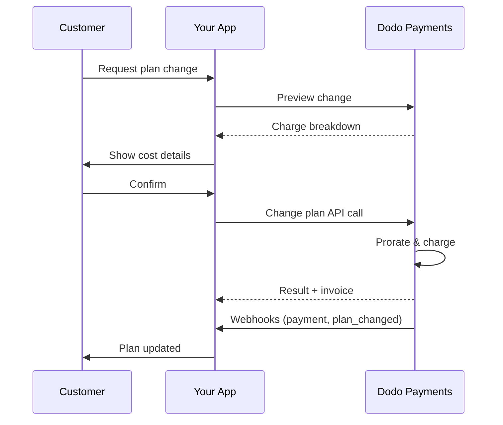
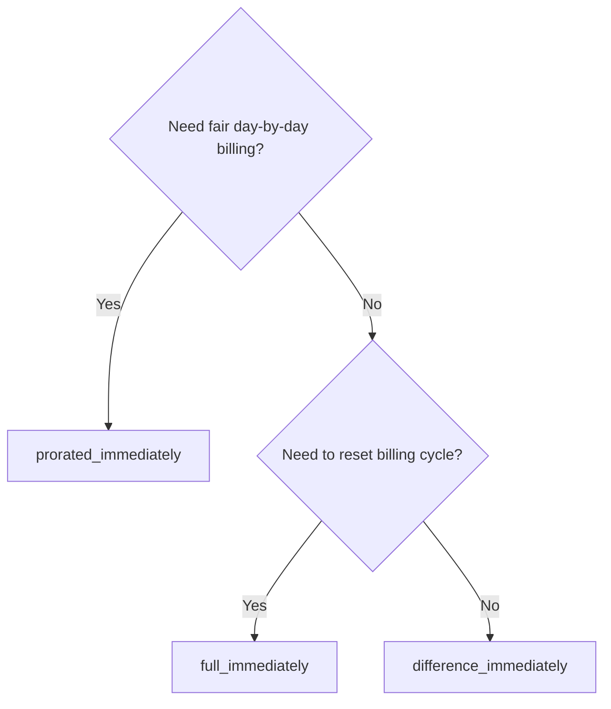
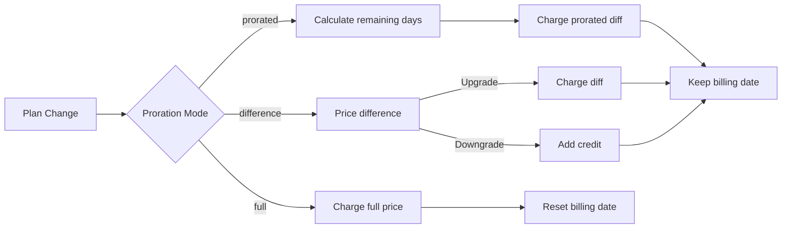

<CardGroup cols={3}>
<Card title="Change Plan API" icon="code" href="/api-reference/subscriptions/change-plan">
  Full API docs for updating subscriptions.
</Card>
<Card title="Plan Change Preview" icon="eye" href="/api-reference/subscriptions/preview-change-plan">
  See charge amounts before changing plans.
</Card>
<Card title="Integration Guide" icon="book" href="/developer-resources/subscription-integration-guide">
  Step-by-step subscription setup.
</Card>
</CardGroup>

## What is a subscription upgrade or downgrade?

Changing plans lets you move a customer between subscription tiers or quantities. Use it to:
- Align pricing with usage or features
- Move from monthly to annual (or vice versa)
- Adjust quantity for seat-based products

<Info>
Plan changes can trigger an immediate charge depending on the proration mode you choose.
</Info>

## When to use plan changes

- Upgrade when a customer needs more features, usage, or seats
- Downgrade when usage decreases
- Migrate users to a new product or price without cancelling their subscription

## Plan Change Flow



## Prerequisites

Before implementing subscription plan changes, ensure you have:

- A Dodo Payments merchant account with active subscription products
- API credentials (API key and webhook secret key) from the dashboard
- An existing active subscription to modify
- Webhook endpoint configured to handle subscription events

<Info>
For detailed setup instructions, see our [Integration Guide](/developer-resources/integration-guide#dashboard-setup).
</Info>

## Step-by-Step Implementation Guide

Follow this comprehensive guide to implement subscription plan changes in your application:

<Steps>
<Step title="Understand Plan Change Requirements">
Before implementing, determine:
- Which subscription products can be changed to which others
- What proration mode fits your business model
- How to handle failed plan changes gracefully
- Which webhook events to track for state management

<Tip>
Test plan changes thoroughly in test mode before implementing in production.
</Tip>
</Step>

<Step title="Choose Your Proration Strategy">
Select the billing approach that aligns with your business needs:

<Tabs>
<Tab title="prorated_immediately">
Best for: SaaS applications wanting to charge fairly for unused time
- Calculates exact prorated amount based on remaining cycle time
- Charges a prorated amount based on unused time remaining in the cycle
- Provides transparent billing to customers
</Tab>

<Tab title="difference_immediately">
Best for: Clear upgrade/downgrade scenarios
- Upgrade: Charge immediate difference (e.g., $30→$80 = charge $50)
- Downgrade: Credit remaining value for future renewals
- Simplifies billing logic and customer communication
</Tab>

<Tab title="full_immediately">
Best for: When you want to reset the billing cycle
- Charges full amount of new plan immediately
- Ignores remaining time from old plan
- Useful for annual to monthly transitions
</Tab>
</Tabs>
</Step>

<Step title="Implement the Change Plan API">
Use the Change Plan API to modify subscription details:

<ParamField path="subscription_id" type="string" required>
The ID of the active subscription to modify.
</ParamField>

<ParamField path="product_id" type="string" required>
The new product ID to change the subscription to.
</ParamField>

<ParamField path="quantity" type="integer" default="1">
Number of units for the new plan (for seat-based products).
</ParamField>

<ParamField path="proration_billing_mode" type="string" required>
How to handle immediate billing: `prorated_immediately`, `full_immediately`, or `difference_immediately`.
</ParamField>

<ParamField path="addons" type="array">
Optional addons for the new plan. Leaving this empty removes any existing addons.
</ParamField>

<ParamField path="on_payment_failure" type="string">
Controls behavior when the plan change payment fails:
- `prevent_change`: Keep subscription on current plan until payment succeeds
- `apply_change` (default): Apply plan change immediately regardless of payment outcome

Jika tidak ditentukan, menggunakan pengaturan default tingkat bisnis.
</ParamField>

{/* LOCKED_PATTERN_654ba106ce306d93c6eba72bfc37d363 */}
Kode diskon opsional untuk diterapkan pada paket baru. Jika disediakan, divalidasi dan diterapkan pada perubahan paket. Jika tidak disediakan dan langganan memiliki diskon yang ada dengan `preserve_on_plan_change=true`, diskon yang ada akan dipertahankan (jika berlaku untuk produk baru).
</ParamField>
</Step>

<Step title="Handle Webhook Events">
Siapkan penanganan webhook untuk melacak hasil perubahan paket:

- `subscription.active`: Perubahan paket berhasil, langganan diperbarui
- `subscription.plan_changed`: Paket langganan berubah (peningkatan/penurunan/pembaruan addon)
- `subscription.on_hold`: Pembebanan perubahan paket gagal, langganan dijeda
- `payment.succeeded`: Pembebanan segera untuk perubahan paket berhasil
- `payment.failed`: Pembebanan segera gagal

<Warning>
Selalu verifikasi tanda tangan webhook dan implementasikan pemrosesan acara idempoten.
</Warning>
</Step>

<Step title="Update Your Application State">
Berdasarkan acara webhook, perbarui aplikasi Anda:
- Berikan/tangguhkan fitur berdasarkan paket baru
- Perbarui dasbor pelanggan dengan rincian paket baru
- Kirim email konfirmasi tentang perubahan paket
- Catat perubahan penagihan untuk tujuan audit
</Step>

<Step title="Test and Monitor">
Uji implementasi Anda secara menyeluruh:
- Uji semua mode prorata dengan berbagai skenario
- Verifikasi penanganan webhook berfungsi dengan benar
- Pantau tingkat keberhasilan perubahan paket
- Atur peringatan untuk perubahan paket yang gagal

<Check>
Implementasi perubahan paket langganan Anda sekarang siap untuk digunakan di produksi.
</Check>
</Step>
</Steps>

## Pratinjau Perubahan Paket

Sebelum berkomitmen pada perubahan paket, gunakan API Pratinjau untuk menunjukkan kepada pelanggan apa yang akan mereka bayar:

<Tabs>
<Tab title="Node.js SDK">

```javascript
const preview = await client.subscriptions.previewChangePlan('sub_123', {
  product_id: 'prod_pro',
  quantity: 1,
  proration_billing_mode: 'prorated_immediately'
});

// Show customer the charge before confirming
console.log('Immediate charge:', preview.immediate_charge.summary);
console.log('New plan details:', preview.new_plan);
```

</Tab>

<Tab title="Python SDK">

```python
preview = client.subscriptions.preview_change_plan(
    subscription_id="sub_123",
    product_id="prod_pro",
    quantity=1,
    proration_billing_mode="prorated_immediately"
)

# Show customer the charge before confirming
print("Immediate charge:", preview.immediate_charge.summary)
print("New plan details:", preview.new_plan)
```

</Tab>
</Tabs>

<Tip>
Gunakan API pratinjau untuk membangun dialog konfirmasi yang menunjukkan kepada pelanggan jumlah tepat yang akan mereka bayar sebelum mereka mengonfirmasi perubahan paket.
</Tip>

## API Perubahan Paket

Gunakan API Perubahan Paket untuk memodifikasi produk, kuantitas, dan perilaku prorata untuk langganan aktif.

### Contoh memulai cepat

<Tabs>
  <Tab title="Node.js SDK">

    ```javascript
    import DodoPayments from 'dodopayments';

    const client = new DodoPayments({
      bearerToken: process.env.DODO_PAYMENTS_API_KEY,
      environment: 'test_mode', // defaults to 'live_mode'
    });

    async function changePlan() {
      const result = await client.subscriptions.changePlan('sub_123', {
        product_id: 'prod_new',
        quantity: 3,
        proration_billing_mode: 'prorated_immediately',
        on_payment_failure: 'prevent_change', // Optional: control behavior on payment failure
      });
      console.log(result.status, result.invoice_id, result.payment_id);
    }

    changePlan();
    ```

  </Tab>
  <Tab title="Python SDK">

    ```python
    import os
    from dodopayments import DodoPayments

    client = DodoPayments(
        bearer_token=os.environ.get("DODO_PAYMENTS_API_KEY"),
        environment="test_mode",  # defaults to "live_mode"
    )

    result = client.subscriptions.change_plan(
        subscription_id="sub_123",
        product_id="prod_new",
        quantity=3,
        proration_billing_mode="prorated_immediately",
        on_payment_failure="prevent_change",  # Optional: control behavior on payment failure
    )
    print(result.status, result.get("invoice_id"), result.get("payment_id"))
    ```

  </Tab>
  <Tab title="Go SDK">

    ```go
    package main

    import (
      "context"
      "fmt"
      "github.com/dodopayments/dodopayments-go"
      "github.com/dodopayments/dodopayments-go/option"
    )

    func main() {
      client := dodopayments.NewClient(option.WithBearerToken("YOUR_TOKEN"))
      res, err := client.Subscriptions.ChangePlan(context.TODO(), dodopayments.SubscriptionChangePlanParams{
        SubscriptionID: dodopayments.F("sub_123"),
        ProductID:             dodopayments.F("prod_new"),
        Quantity:              dodopayments.F(int64(3)),
        ProrationBillingMode:  dodopayments.F(dodopayments.SubscriptionChangePlanParamsProrationBillingModeProratedImmediately),
        OnPaymentFailure:      dodopayments.F(dodopayments.OnPaymentFailurePreventChange), // Optional
      })
      if err != nil { panic(err) }
      fmt.Println(res.Status, res.InvoiceID, res.PaymentID)
    }
    ```

  </Tab>
  <Tab title="HTTP">

    ```bash
    curl -X POST "$DODO_API_BASE/subscriptions/sub_123/change-plan" \
      -H "Authorization: Bearer $DODO_PAYMENTS_API_KEY" \
      -H "Content-Type: application/json" \
      -d '{
        "product_id": "prod_new",
        "quantity": 3,
        "proration_billing_mode": "prorated_immediately",
        "on_payment_failure": "prevent_change"
      }'
    ```

  </Tab>
</Tabs>

```json Success
{
  "status": "processing",
  "subscription_id": "sub_123",
  "invoice_id": "inv_789",
  "payment_id": "pay_456",
  "proration_billing_mode": "prorated_immediately"
}
```

<Note>
Field seperti <code>invoice_id</code> dan <code>payment_id</code> hanya dikembalikan ketika beban dan/atau tagihan segera dibuat selama perubahan paket. Selalu andalkan acara webhook (misalnya, <code>payment.succeeded</code>, <code>subscription.plan_changed</code>) untuk mengonfirmasi hasil.
</Note>

<Warning>
Jika beban segera gagal, langganan dapat beralih ke `subscription.on_hold` hingga pembayaran berhasil.
</Warning>

## Mengelola Addon

Saat mengubah paket langganan, Anda juga dapat memodifikasi addon:

```javascript
// Add addons to the new plan
await client.subscriptions.changePlan('sub_123', {
  product_id: 'prod_new',
  quantity: 1,
  proration_billing_mode: 'difference_immediately',
  addons: [
    { addon_id: 'addon_123', quantity: 2 }
  ]
});

// Remove all existing addons
await client.subscriptions.changePlan('sub_123', {
  product_id: 'prod_new',
  quantity: 1,
  proration_billing_mode: 'difference_immediately',
  addons: [] // Empty array removes all existing addons
});
```

<Info>
Addon termasuk dalam perhitungan prorata dan akan dikenakan biaya sesuai dengan mode prorata yang dipilih.
</Info>

## Menerapkan Kode Diskon

Anda dapat menerapkan kode diskon saat mengubah paket langganan. Ini berguna untuk menawarkan harga promosi pada peningkatan atau migrasi.

<Tabs>
<Tab title="Node.js SDK">

```javascript
// Apply a discount code during plan change
await client.subscriptions.changePlan('sub_123', {
  product_id: 'prod_pro',
  quantity: 1,
  proration_billing_mode: 'prorated_immediately',
  discount_code: 'UPGRADE20'
});
```

</Tab>
<Tab title="Python SDK">

```python
# Apply a discount code during plan change
client.subscriptions.change_plan(
    subscription_id="sub_123",
    product_id="prod_pro",
    quantity=1,
    proration_billing_mode="prorated_immediately",
    discount_code="UPGRADE20"
)
```

</Tab>
<Tab title="HTTP">

```bash
curl -X POST "$DODO_API_BASE/subscriptions/sub_123/change-plan" \
  -H "Authorization: Bearer $DODO_PAYMENTS_API_KEY" \
  -H "Content-Type: application/json" \
  -d '{
    "product_id": "prod_pro",
    "quantity": 1,
    "proration_billing_mode": "prorated_immediately",
    "discount_code": "UPGRADE20"
  }'
```

</Tab>
</Tabs>

### Perilaku diskon pada perubahan paket

| Skenario | Perilaku |
|----------|----------|
| `discount_code` diberikan | Validasi dan terapkan diskon pada paket baru. |
| Tidak ada kode yang diberikan, diskon yang ada dengan `preserve_on_plan_change=true` | Diskon yang ada secara otomatis dipertahankan jika berlaku untuk produk baru. |
| Tidak ada kode yang diberikan, tidak ada diskon yang bisa dipertahankan | Tidak ada diskon yang diterapkan pada paket baru. |

<Tip>
Gunakan [API Pratinjau Perubahan Paket](/api-reference/subscriptions/preview-change-plan) dengan `discount_code` untuk menunjukkan kepada pelanggan berapa banyak yang mereka hemat sebelum mengonfirmasi perubahan paket.
</Tip>

## Mode Prorata

Pilih bagaimana menagih pelanggan saat mengubah paket:

#### `prorated_immediately`
- Menagih selisih parsial di siklus saat ini
- Jika dalam masa percobaan, menagih segera dan beralih ke paket baru sekarang
- Penurunan: dapat menghasilkan kredit prorata yang diterapkan pada pembaruan di masa depan

#### `full_immediately`
- Menagih jumlah penuh dari paket baru segera
- Mengabaikan waktu yang tersisa dari paket lama

<Info>
Kredit yang dibuat oleh penurunan menggunakan <code>difference_immediately</code> bersifat khusus langganan dan berbeda dari entitlements <a href="/features/credit-based-billing">Penagihan Berbasis Kredit</a>. Kredit tersebut secara otomatis berlaku untuk pembaruan di masa depan dari langganan yang sama dan tidak dapat dipindahkan antar langganan.
</Info>

#### `difference_immediately`
- Peningkatan: segera menagih selisih harga antara paket lama dan baru
- Penurunan: tambahkan nilai yang tersisa sebagai kredit internal ke langganan dan otomatis diterapkan saat pembaruan

| Fitur | `prorated_immediately` | `difference_immediately` | `full_immediately` |
|---------|----------------------|------------------------|-------------------|
| **Biaya Peningkatan** | Selisih prorata untuk hari yang tersisa | Selisih harga penuh antara paket | Harga paket baru penuh |
| **Kredit Penurunan** | Kredit prorata untuk hari yang tersisa | Selisih harga penuh sebagai kredit | Tidak ada kredit |
| **Siklus Penagihan** | Tidak berubah | Tidak berubah | Diatur ulang ke hari ini |
| **Perilaku Percobaan** | Mengakhiri percobaan, menagih segera | Mengakhiri percobaan, menagih segera | Mengakhiri percobaan, menagih jumlah penuh |
| **Terbaik untuk** | Penagihan berdasarkan waktu yang adil | Hitungan matematis peningkatan/penurunan sederhana | Mengatur ulang siklus penagihan |
| **Kerumitan** | Medium (perhitungan hari) | Rendah (pengurangan sederhana) | Rendah (pengisian penuh) |



### Contoh skenario

Gunakan angka-angka kanonikal ini secara konsisten:
- Paket saat ini: **Basic** pada harga **$30/bulan**
- Target peningkatan: **Pro** pada harga **$80/bulan**
- Target penurunan (dari Pro): **Starter** pada harga **$20/bulan**
- Siklus penagihan: **30 hari**, dimulai pada **1 Januari**
- Perubahan paket terjadi pada **16 Januari** (15 hari tersisa, 15 hari digunakan)

<AccordionGroup>
  <Accordion title="Upgrade: Basic ($30) → Pro ($80) with prorated_immediately">

    ```
    Step 1: Calculate unused credit from current plan
      Unused days = 15 out of 30 days
      Credit = $30 × (15/30) = $15.00

    Step 2: Calculate prorated cost of new plan
      Remaining days = 15 out of 30 days
      New plan cost = $80 × (15/30) = $40.00

    Step 3: Calculate immediate charge
      Charge = New plan cost − Credit
      Charge = $40.00 − $15.00 = $25.00

    → Customer pays $25.00 now
    → Next renewal (Feb 1): $80.00/month
    ```

    ```javascript
    await client.subscriptions.changePlan('sub_123', {
      product_id: 'prod_pro',
      quantity: 1,
      proration_billing_mode: 'prorated_immediately'
    })
    ```

  </Accordion>

  <Accordion title="Downgrade: Pro ($80) → Starter ($20) with prorated_immediately">

    ```
    Step 1: Calculate unused credit from current plan
      Unused days = 15 out of 30 days
      Credit = $80 × (15/30) = $40.00

    Step 2: Calculate prorated cost of new plan
      Remaining days = 15 out of 30 days
      New plan cost = $20 × (15/30) = $10.00

    Step 3: Calculate credit balance
      Credit = $40.00 − $10.00 = $30.00

    → No charge — $30.00 credit added to subscription
    → Credit auto-applies to future renewals
    → Next renewal (Feb 1): $20.00 − $30.00 credit = $0.00
    → Following renewal (Mar 1): $20.00 − $10.00 remaining credit = $10.00
    ```

    ```javascript
    await client.subscriptions.changePlan('sub_123', {
      product_id: 'prod_starter',
      quantity: 1,
      proration_billing_mode: 'prorated_immediately'
    })
    ```

  </Accordion>

  <Accordion title="Upgrade: Basic ($30) → Pro ($80) with difference_immediately">

    ```
    Immediate charge = New plan price − Old plan price
                     = $80 − $30
                     = $50.00

    → Customer pays $50.00 now (regardless of cycle position)
    → Next renewal (Feb 1): $80.00/month
    ```

    ```javascript
    await client.subscriptions.changePlan('sub_123', {
      product_id: 'prod_pro',
      quantity: 1,
      proration_billing_mode: 'difference_immediately'
    })
    ```

  </Accordion>

  <Accordion title="Downgrade: Pro ($80) → Starter ($20) with difference_immediately">

    ```
    Credit = Old plan price − New plan price
           = $80 − $20
           = $60.00

    → No charge — $60.00 credit added to subscription
    → Credit auto-applies to future renewals
    → Next renewal: $20.00 − $20.00 (from credit) = $0.00
    → Following renewal: $20.00 − $20.00 (from credit) = $0.00
    → Third renewal: $20.00 − $20.00 (from remaining credit) = $0.00
    ```

    ```javascript
    await client.subscriptions.changePlan('sub_123', {
      product_id: 'prod_starter',
      quantity: 1,
      proration_billing_mode: 'difference_immediately'
    })
    ```

  </Accordion>

  <Accordion title="Upgrade: Basic ($30) → Pro ($80) with full_immediately">

    ```
    Immediate charge = Full new plan price = $80.00

    → Customer pays $80.00 now
    → No credit for unused time on old plan
    → Billing cycle resets to today (January 16)
    → Next renewal: February 16 at $80.00/month
    ```

    ```javascript
    await client.subscriptions.changePlan('sub_123', {
      product_id: 'prod_pro',
      quantity: 1,
      proration_billing_mode: 'full_immediately'
    })
    ```

  </Accordion>

  <Accordion title="Mid-cycle upgrade with add-ons using prorated_immediately">

    ```
    Current: Basic plan ($30/month), no add-ons
    New: Pro plan ($80/month) + Extra Seats add-on ($10/seat × 3 seats = $30/month)
    Change on day 16 of 30 (15 days remaining)

    Step 1: Credit from current plan
      Credit = $30 × (15/30) = $15.00

    Step 2: Prorated cost of new plan + add-ons
      New plan = $80 × (15/30) = $40.00
      Add-ons = $30 × (15/30) = $15.00
      Total new = $55.00

    Step 3: Immediate charge
      Charge = $55.00 − $15.00 = $40.00

    → Customer pays $40.00 now
    → Next renewal: $80.00 + $30.00 = $110.00/month
    ```

    ```javascript
    await client.subscriptions.changePlan('sub_123', {
      product_id: 'prod_pro',
      quantity: 1,
      proration_billing_mode: 'prorated_immediately',
      addons: [
        { addon_id: 'addon_seats', quantity: 3 }
      ]
    })
    ```

  </Accordion>
</AccordionGroup>

### Cara setiap mode memproses penagihan



<Tip>
Pilih `prorated_immediately` untuk akuntansi waktu yang adil; pilih `full_immediately` untuk memulai ulang penagihan; gunakan `difference_immediately` untuk peningkatan yang sederhana dan kredit otomatis pada penurunan.
</Tip>

## Menangani Kegagalan Pembayaran

Kontrol apa yang terjadi ketika pembayaran perubahan paket gagal menggunakan parameter `on_payment_failure`.

### Mode Kegagalan Pembayaran

<Tabs>
<Tab title="prevent_change (Recommended for critical upgrades)">
**Perilaku**: Pertahankan langganan di paket saat ini hingga pembayaran berhasil.

- Perubahan paket ditandai sebagai "tertunda"
- Pelanggan tetap memiliki akses ke paket saat ini
- Langganan beralih ke status `active` hanya setelah pembayaran berhasil
- Berguna ketika Anda ingin memastikan pembayaran sebelum memberikan fitur yang ditingkatkan

```javascript
await client.subscriptions.changePlan('sub_123', {
  product_id: 'prod_pro',
  quantity: 1,
  proration_billing_mode: 'prorated_immediately',
  on_payment_failure: 'prevent_change'
});
```

</Tab>

<Tab title="apply_change (Default)">
**Perilaku**: Terapkan perubahan paket segera terlepas dari hasil pembayaran.

- Perubahan paket diterapkan bahkan jika pembayaran gagal
- Pelanggan mendapatkan akses langsung ke paket baru
- Langganan dapat beralih ke `on_hold` jika pembayaran gagal
- Bagus untuk peningkatan yang tidak kritis atau ketika Anda mempercayai pelanggan

```javascript
await client.subscriptions.changePlan('sub_123', {
  product_id: 'prod_pro',
  quantity: 1,
  proration_billing_mode: 'prorated_immediately',
  on_payment_failure: 'apply_change' // This is the default
});
```

</Tab>
</Tabs>

<Info>
Jika tidak ditentukan, parameter `on_payment_failure` menggunakan pengaturan default tingkat bisnis Anda yang dikonfigurasi di dasbor.
</Info>

### Kapan Menggunakan Setiap Mode

| Skenario | Mode yang Direkomendasikan | Alasan |
|----------|------------------|--------|
| Peningkatan ke fitur premium | `prevent_change` | Pastikan pembayaran sebelum memberi akses |
| Peningkatan kuantitas (lebih banyak kursi) | `prevent_change` | Mencegah penggunaan tanpa pembayaran |
| Penurunan paket | `apply_change` | Pelanggan mengurangi pengeluaran |
| Pelanggan perusahaan tepercaya | `apply_change` | Risiko non-pembayaran lebih rendah |
| Konversi percobaan ke berbayar | `prevent_change` | Momen pembayaran kritis |

## Menangani Webhooks

Lacak status langganan melalui webhooks untuk mengonfirmasi perubahan paket dan pembayaran.

### Jenis acara yang harus ditangani
- `subscription.active`: langganan diaktifkan
- `subscription.plan_changed`: paket langganan berubah (peningkatan/penurunan/perubahan addon)
- `subscription.on_hold`: pembebanan gagal, langganan dijeda
- `subscription.renewed`: pembaruan berhasil
- `payment.succeeded`: pembayaran untuk perubahan atau pembaruan paket berhasil
- `payment.failed`: pembayaran gagal

<Info>
Kami merekomendasikan untuk menggerakkan logika bisnis dari acara langganan dan menggunakan acara pembayaran untuk konfirmasi dan rekonsiliasi.
</Info>

### Verifikasi tanda tangan dan tangani intent

<Tabs>
  <Tab title="Next.js Route Handler">

    ```javascript
    import { NextRequest, NextResponse } from 'next/server';
    
    export async function POST(req) {
      const webhookId = req.headers.get('webhook-id');
      const webhookSignature = req.headers.get('webhook-signature');
      const webhookTimestamp = req.headers.get('webhook-timestamp');
      const secret = process.env.DODO_WEBHOOK_SECRET;
    
      const payload = await req.text();
      // verifySignature is a placeholder – in production, use a Standard Webhooks library
      const { valid, event } = await verifySignature(
        payload,
        { id: webhookId, signature: webhookSignature, timestamp: webhookTimestamp },
        secret
      );
      if (!valid) return NextResponse.json({ error: 'Invalid signature' }, { status: 400 });
    
      switch (event.type) {
        case 'subscription.active':
          // mark subscription active in your DB
          break;
        case 'subscription.plan_changed':
          // refresh entitlements and reflect the new plan in your UI
          break;
        case 'subscription.on_hold':
          // notify user to update payment method
          break;
        case 'subscription.renewed':
          // extend access window
          break;
        case 'payment.succeeded':
          // reconcile payment for plan change
          break;
        case 'payment.failed':
          // log and alert
          break;
        default:
          // ignore unknown events
          break;
      }
    
      return NextResponse.json({ received: true });
    }
    ```

  </Tab>
  <Tab title="Express.js">

    ```javascript
    import express from 'express';
    
    const app = express();
    app.post('/webhooks/dodo', express.raw({ type: 'application/json' }), async (req, res) => {
      const webhookId = req.header('webhook-id');
      const webhookSignature = req.header('webhook-signature');
      const webhookTimestamp = req.header('webhook-timestamp');
      const secret = process.env.DODO_WEBHOOK_SECRET;
      const payload = req.body.toString('utf8');
    
      const { valid, event } = await verifySignature(
        payload,
        { id: webhookId, signature: webhookSignature, timestamp: webhookTimestamp },
        secret
      );
      if (!valid) return res.status(400).send('Invalid signature');
    
      // handle events like above
      res.json({ received: true });
    });
    
    app.listen(3000);
    ```

  </Tab>
</Tabs>

<Note>
Untuk mendapatkan skema payload yang lebih rinci, lihat <a href="/developer-resources/webhooks/intents/subscription">Payload webhook Langganan</a> dan <a href="/developer-resources/webhooks/intents/payment">Payload webhook Pembayaran</a>.
</Note>

## Praktik Terbaik

Ikuti rekomendasi ini untuk perubahan paket langganan yang andal:

### Strategi Perubahan Paket
- **Uji secara menyeluruh**: Selalu uji perubahan paket dalam mode uji sebelum produksi
- **Pilih prorata dengan hati-hati**: Pilih mode prorata yang sesuai dengan model bisnis Anda
- **Tangani kegagalan dengan baik**: Implementasikan penanganan kesalahan yang tepat dan logika mencoba lagi
- **Pantau tingkat keberhasilan**: Lacak tingkat keberhasilan/kegagalan perubahan paket dan selidiki masalahnya

### Implementasi Webhook
- **Verifikasi tanda tangan**: Selalu validasi tanda tangan webhook untuk memastikan keaslian
- **Implementasikan idempoten**: Tangani acara webhook duplikat dengan baik
- **Proses secara asinkron**: Jangan memblokir respons webhook dengan operasi berat
- **Catat semua**: Pertahankan log yang terperinci untuk debugging dan tujuan audit

### Pengalaman Pengguna
- **Komunikasikan dengan jelas**: Informasikan pelanggan tentang perubahan penagihan dan waktu
- **Berikan konfirmasi**: Kirim email konfirmasi untuk perubahan paket yang berhasil
- **Tangani kasus-kasus batas**: Pertimbangkan periode percobaan, prorata, dan pembayaran yang gagal
- **Perbarui UI segera**: Pantulkan perubahan paket di antarmuka aplikasi Anda

## Masalah Umum dan Solusi

Atasi masalah umum yang muncul selama perubahan paket langganan:

<AccordionGroup>
<Accordion title="Charge created but subscription not updated">
**Gejala**: Panggilan API berhasil tetapi langganan tetap pada paket lama

**Penyebab umum**:
- Pemrosesan webhook gagal atau tertunda
- Status aplikasi tidak diperbarui setelah menerima webhooks
- Masalah transaksi basis data selama pembaruan status

**Solusi**:
- Terapkan penanganan webhook yang kuat dengan logika mencoba lagi
- Gunakan operasi idempoten untuk pembaruan status
- Tambahkan pemantauan untuk mendeteksi dan memberikan peringatan tentang acara webhook yang terlewat
- Verifikasi bahwa endpoint webhook dapat diakses dan merespons dengan benar
</Accordion>

<Accordion title="Credits not applied after downgrade">
**Gejala**: Pelanggan menurun tetapi tidak melihat saldo kredit

**Penyebab umum**:
- Ekspektasi mode prorata: penurunan memberi kredit selisih harga paket penuh dengan `difference_immediately`, sementara `prorated_immediately` membuat kredit prorata berdasarkan waktu yang tersisa dalam siklus
- Kredit bersifat khusus langganan dan tidak dapat dipindahkan antara langganan
- Saldo kredit tidak terlihat di dasbor pelanggan

**Solusi**:
- Gunakan `difference_immediately` untuk penurunan ketika Anda menginginkan kredit otomatis
- Jelaskan kepada pelanggan bahwa kredit berlaku untuk pembaruan di masa depan dari langganan yang sama
- Implementasikan portal pelanggan untuk menampilkan saldo kredit
- Periksa pratinjau faktur berikutnya untuk melihat kredit yang diterapkan
</Accordion>

<Accordion title="Webhook signature verification fails">
**Gejala**: Acara webhook ditolak karena tanda tangan tidak valid

**Penyebab umum**:
- Kunci rahasia webhook yang salah
- Body permintaan mentah dimodifikasi sebelum verifikasi tanda tangan
- Algoritma verifikasi tanda tangan yang salah

**Solusi**:
- Verifikasi bahwa Anda menggunakan `DODO_WEBHOOK_SECRET` yang benar dari dasbor
- Baca body permintaan mentah sebelum middleware penguraian JSON
- Gunakan perpustakaan verifikasi webhook standar untuk platform Anda
- Uji verifikasi tanda tangan webhook dalam lingkungan pengembangan
</Accordion>

<Accordion title="Plan change fails with 422 error">
**Gejala**: API mengembalikan kesalahan 422 Unprocessable Entity

**Penyebab umum**:
- ID langganan atau ID produk tidak valid
- Langganan tidak dalam status aktif
- Parameter yang wajib tidak ada
- Produk tidak tersedia untuk perubahan paket

**Solusi**:
- Verifikasi bahwa langganan ada dan aktif
- Periksa bahwa ID produk valid dan tersedia
- Pastikan semua parameter yang wajib diisi sudah disertakan
- Tinjau dokumentasi API untuk persyaratan parameter
</Accordion>

<Accordion title="Immediate charge fails during plan change">
**Gejala**: Perubahan paket dimulai tetapi beban segera gagal

**Penyebab umum**:
- Dana tidak mencukupi pada metode pembayaran pelanggan
- Metode pembayaran kedaluwarsa atau tidak valid
- Bank menolak transaksi
- Deteksi penipuan memblokir pengisian

**Solusi**:
- Tangani acara webhook `payment.failed` dengan tepat
- Beritahukan pelanggan untuk memperbarui metode pembayaran
- Terapkan logika mencoba lagi untuk kegagalan sementara
- Pertimbangkan untuk mengizinkan perubahan paket dengan beban segera gagal
</Accordion>

<Accordion title="Subscription on hold after plan change">
**Gejala**: Pengisian perubahan paket gagal dan langganan beralih ke status `on_hold`

**Apa yang terjadi**:
Ketika pengisian perubahan paket gagal, langganan secara otomatis ditempatkan dalam status `on_hold`. Langganan tidak akan diperbarui secara otomatis sampai metode pembayaran diperbarui.

**Solusi**: Perbarui metode pembayaran untuk mengaktifkan kembali langganan

Untuk mengaktifkan kembali langganan dari status `on_hold` setelah perubahan paket gagal:
1. **Perbarui metode pembayaran** menggunakan API Perbarui Metode Pembayaran
2. **Pembuatan pengisian otomatis**: API secara otomatis membuat pengisian untuk pembayaran yang tertunda
3. **Pembuatan faktur**: Faktur dibuat untuk pengisian
4. **Pengolahan pembayaran**: Pembayaran diproses menggunakan metode pembayaran baru
5. **Reaktivasi**: Setelah pembayaran berhasil, langganan diaktifkan kembali ke status `active`

<CodeGroup>

```javascript Node.js
// Reactivate subscription from on_hold after failed plan change
async function reactivateAfterFailedPlanChange(subscriptionId) {
  // Update payment method - automatically creates charge for remaining dues
  const response = await client.subscriptions.updatePaymentMethod(subscriptionId, {
    type: 'new',
    return_url: 'https://example.com/return'
  });
  
  if (response.payment_id) {
    console.log('Charge created for remaining dues:', response.payment_id);
    console.log('Payment link:', response.payment_link);
    
    // Redirect customer to payment_link to complete payment
    // Monitor webhooks for:
    // 1. payment.succeeded - charge succeeded
    // 2. subscription.active - subscription reactivated
  }
  
  return response;
}

// Or use existing payment method if available
async function reactivateWithExistingPaymentMethod(subscriptionId, paymentMethodId) {
  const response = await client.subscriptions.updatePaymentMethod(subscriptionId, {
    type: 'existing',
    payment_method_id: paymentMethodId
  });
  
  // Monitor webhooks for payment.succeeded and subscription.active
  return response;
}
```

```python Python
# Reactivate subscription from on_hold after failed plan change
def reactivate_after_failed_plan_change(subscription_id):
    # Update payment method - automatically creates charge for remaining dues
    response = client.subscriptions.update_payment_method(
        subscription_id=subscription_id,
        type="new",
        return_url="https://example.com/return"
    )
    
    if response.payment_id:
        print("Charge created for remaining dues:", response.payment_id)
        print("Payment link:", response.payment_link)
        
        # Redirect customer to payment_link to complete payment
        # Monitor webhooks for:
        # 1. payment.succeeded - charge succeeded
        # 2. subscription.active - subscription reactivated
    
    return response

# Or use existing payment method if available
def reactivate_with_existing_payment_method(subscription_id, payment_method_id):
    response = client.subscriptions.update_payment_method(
        subscription_id=subscription_id,
        type="existing",
        payment_method_id=payment_method_id
    )
    
    # Monitor webhooks for payment.succeeded and subscription.active
    return response
```

</CodeGroup>

**Acara webhook untuk dipantau**:
- `subscription.on_hold`: Langganan dijeda (diterima ketika pengisian perubahan paket gagal)
- `payment.succeeded`: Pembayaran untuk pembayaran yang tertunda berhasil (setelah memperbarui metode pembayaran)
- `subscription.active`: Langganan diaktifkan kembali setelah pembayaran berhasil

**Praktik terbaik**:
- Segera beri tahu pelanggan ketika pengisian perubahan paket gagal
- Berikan instruksi yang jelas tentang cara memperbarui metode pembayaran mereka
- Pantau acara webhook untuk melacak status reaktivasi
- Pertimbangkan untuk menerapkan logika mencoba lagi otomatis untuk kegagalan pembayaran sementara

<Card title="Update Payment Method API Reference" icon="code" href="/api-reference/subscriptions/update-payment-method">
Lihat dokumentasi API lengkap untuk memperbarui metode pembayaran dan mengaktifkan kembali langganan.
</Card>
</Accordion>
</AccordionGroup>

## Menguji Implementasi Anda

Ikuti langkah-langkah ini untuk menguji dengan baik implementasi perubahan paket langganan Anda:

<Steps>
<Step title="Set up test environment">
- Gunakan kunci API pengujian dan produk pengujian
- Buat langganan uji dengan berbagai jenis paket
- Konfigurasikan endpoint webhook pengujian
- Siapkan pemantauan dan logging
</Step>

<Step title="Test different proration modes">
- Uji `prorated_immediately` dengan berbagai posisi siklus penagihan
- Uji `difference_immediately` untuk peningkatan dan penurunan
- Uji `full_immediately` untuk mengatur ulang siklus penagihan
- Verifikasi kalkulasi kredit sudah benar
</Step>

<Step title="Test webhook handling">
- Verifikasi semua acara webhook yang relevan diterima
- Uji verifikasi tanda tangan webhook
- Tangani acara webhook duplikat dengan baik
- Uji skenario kegagalan pemrosesan webhook
</Step>

<Step title="Test error scenarios">
- Uji dengan ID langganan yang tidak valid
- Uji dengan metode pembayaran yang kedaluwarsa
- Uji kegagalan jaringan dan timeout
- Uji dengan dana yang tidak mencukupi
</Step>

<Step title="Monitor in production">
- Siapkan peringatan untuk perubahan paket yang gagal
- Pantau waktu pemrosesan webhook
- Lacak tingkat keberhasilan perubahan paket
- Tinjau tiket dukungan pelanggan untuk masalah perubahan paket
</Step>
</Steps>

## Penanganan Kesalahan

Tangani kesalahan API umum dengan baik dalam implementasi Anda:

### Kode Status HTTP

<AccordionGroup>
<Accordion title="200 OK">
Permintaan perubahan paket diproses dengan sukses. Langganan sedang diperbarui dan pemrosesan pembayaran telah dimulai.
</Accordion>

<Accordion title="400 Bad Request">
Parameter permintaan tidak valid. Periksa bahwa semua field yang wajib diisi disediakan dan diformat dengan benar.
</Accordion>

<Accordion title="401 Unauthorized">
Kunci API tidak valid atau hilang. Verifikasi `DODO_PAYMENTS_API_KEY` Anda benar dan memiliki izin yang tepat.
</Accordion>

<Accordion title="404 Not Found">
ID langganan tidak ditemukan atau tidak dimiliki oleh akun Anda.
</Accordion>

<Accordion title="422 Unprocessable Entity">
Langganan tidak dapat diubah (misalnya, sudah dibatalkan, produk tidak tersedia, dll.).
</Accordion>

<Accordion title="500 Internal Server Error">
Terjadi kesalahan server. Coba lagi permintaan setelah penundaan singkat.
</Accordion>
</AccordionGroup>

### Format Tanggapan Kesalahan

```json
{
  "error": {
    "code": "subscription_not_found",
    "message": "The subscription with ID 'sub_123' was not found",
    "details": {
      "subscription_id": "sub_123"
    }
  }
}
```

## Langkah selanjutnya

- Tinjau <a href="/api-reference/subscriptions/change-plan">API Perubahan Paket</a>
- Jelajahi <a href="/features/credit-based-billing">Penagihan Berbasis Kredit</a>
- Terapkan peringatan untuk `subscription.on_hold`
- Lihat <a href="/developer-resources/webhooks">Panduan Integrasi Webhook</a> kami

- Review the <a href="/api-reference/subscriptions/change-plan">Change Plan API</a>
- Explore <a href="/features/credit-based-billing">Credit-Based Billing</a>
- Implement alerts for `subscription.on_hold`
- Check out our <a href="/developer-resources/webhooks">Webhook Integration Guide</a>
