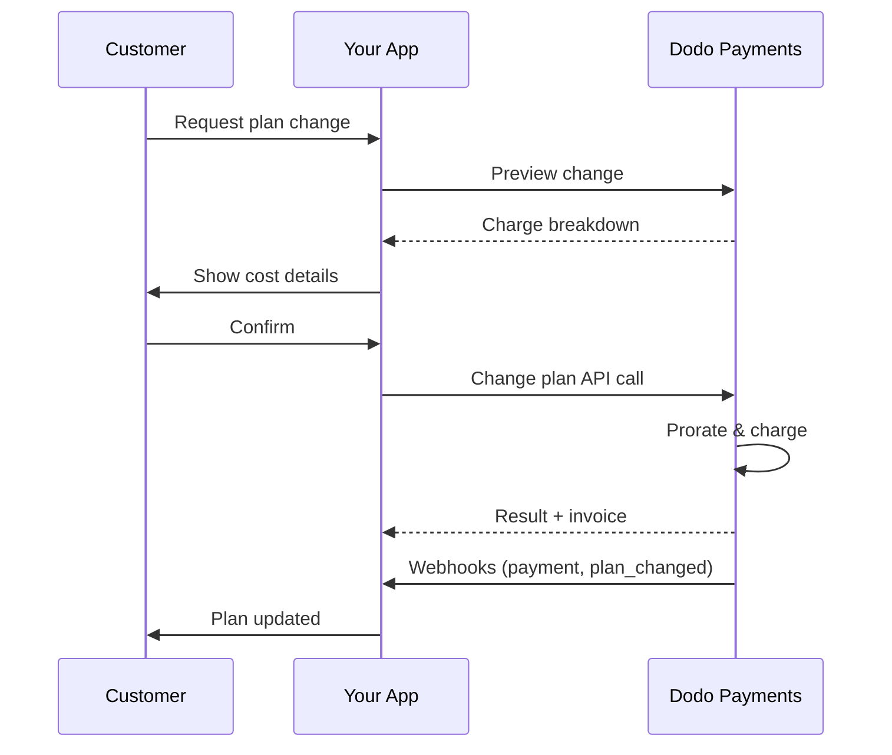
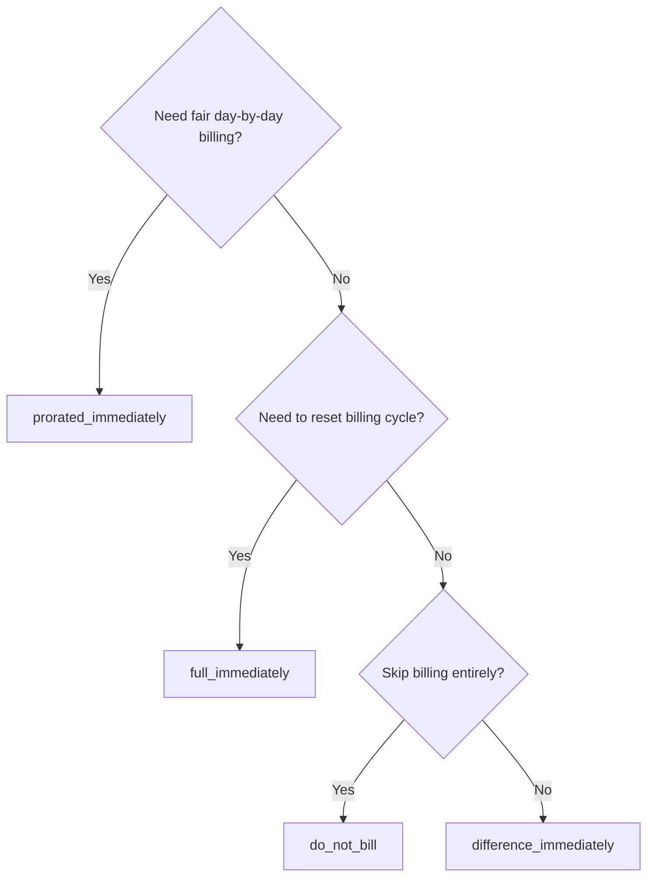
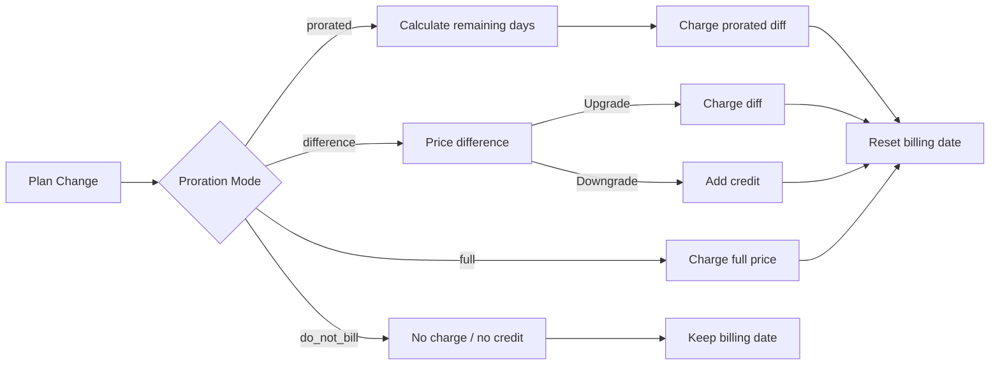

<CardGroup cols={3}>
<Card title="Change Plan API" icon="code" href="/api-reference/subscriptions/change-plan">
  Full API docs for updating subscriptions.
</Card>
<Card title="Plan Change Preview" icon="eye" href="/api-reference/subscriptions/preview-change-plan">
  See charge amounts before changing plans.
</Card>
<Card title="Integration Guide" icon="book" href="/developer-resources/subscription-integration-guide">
  Step-by-step subscription setup.
</Card>
</CardGroup>

## What is a subscription upgrade or downgrade?

Changing plans lets you move a customer between subscription tiers or quantities. Use it to:
- Align pricing with usage or features
- Move from monthly to annual (or vice versa)
- Adjust quantity for seat-based products

<Info>
Plan changes can trigger an immediate charge depending on the proration mode you choose.
</Info>

## When to use plan changes

- Upgrade when a customer needs more features, usage, or seats
- Downgrade when usage decreases
- Migrate users to a new product or price without cancelling their subscription

## Plan Change Flow



## Prerequisites

Before implementing subscription plan changes, ensure you have:

- A Dodo Payments merchant account with active subscription products
- API credentials (API key and webhook secret key) from the dashboard
- An existing active subscription to modify
- Webhook endpoint configured to handle subscription events

<Info>
For detailed setup instructions, see our [Integration Guide](/developer-resources/integration-guide#dashboard-setup).
</Info>

## Step-by-Step Implementation Guide

Follow this comprehensive guide to implement subscription plan changes in your application:

<Steps>
<Step title="Understand Plan Change Requirements">
Before implementing, determine:
- Which subscription products can be changed to which others
- What proration mode fits your business model
- How to handle failed plan changes gracefully
- Which webhook events to track for state management

<Tip>
Test plan changes thoroughly in test mode before implementing in production.
</Tip>
</Step>

<Step title="Choose Your Proration Strategy">
Select the billing approach that aligns with your business needs:

<Tabs>
<Tab title="prorated_immediately">
Best for: SaaS applications wanting to charge fairly for unused time
- Calculates exact prorated amount based on remaining cycle time
- Charges a prorated amount based on unused time remaining in the cycle
- Provides transparent billing to customers
</Tab>

<Tab title="difference_immediately">
Best for: Clear upgrade/downgrade scenarios
- Upgrade: Charge immediate difference (e.g., $30→$80 = charge $50)
- Downgrade: Credit remaining value for future renewals
- Simplifies billing logic and customer communication
</Tab>

<Tab title="full_immediately">
Best for: When you want to reset the billing cycle
- Charges full amount of new plan immediately
- Ignores remaining time from old plan
- Useful for annual to monthly transitions
</Tab>

<Tab title="do_not_bill">
Best for: Free migrations, courtesy switches, or absorbing cost differences
- No charges or credits calculated
- Customer moves to the new plan immediately without any billing adjustment
- Billing cycle remains unchanged
</Tab>
</Tabs>
</Step>

<Step title="Implement the Change Plan API">
Use the Change Plan API to modify subscription details:

<ParamField path="subscription_id" type="string" required>
The ID of the active subscription to modify.
</ParamField>

<ParamField path="product_id" type="string" required>
The new product ID to change the subscription to.
</ParamField>

<ParamField path="quantity" type="integer" required>
Jumlah unit untuk rencana baru (untuk produk berbasis kursi).
</ParamField>

<ParamField path="proration_billing_mode" type="string" required>
How to handle immediate billing: `prorated_immediately`, `full_immediately`, `difference_immediately`, or `do_not_bill`.
</ParamField>

<ParamField path="addons" type="array">
Optional addons for the new plan. Leaving this empty removes any existing addons.
</ParamField>

<ParamField path="on_payment_failure" type="string">
Controls behavior when the plan change payment fails:
- `prevent_change`: Keep subscription on current plan until payment succeeds
- `apply_change` (default): Apply plan change immediately regardless of payment outcome

If not specified, uses the business-level default setting.
</ParamField>

<ParamField path="collect_via_payment_link" type="boolean">
Kumpulkan jumlah perubahan paket melalui tautan pembayaran, bukan dengan menagih metode pembayaran tersimpan milik subscription. Customer membayar di halaman checkout yang di-host.


Memerlukan capability `allow_plan_change_via_payment_link` milik business (**Settings → Subscriptions → Collect Plan Change Payments by Payment Link**), `effective_at: immediately`, dan `on_payment_failure: prevent_change`. Lihat [Collecting Payment via a Checkout Link](#collecting-payment-via-a-checkout-link).

Diabaikan oleh preview route.
</ParamField>

<ParamField path="discount_codes" type="array">
Kode diskon **stacked** opsional yang diterapkan ke paket baru (maks. 20, diterapkan sesuai urutan array). Perilakunya bergantung pada nilai yang Anda kirim:

- **Tidak diberikan / `null`** — diskon yang ada dengan `preserve_on_plan_change=true` dipertahankan jika berlaku untuk produk baru.
- **`[]` (array kosong)** — menghapus semua diskon yang ada dari subscription.
- **`["CODE_A", "CODE_B", ...]`** — mengganti diskon yang ada dengan set stacked ini.
</ParamField>

<ParamField path="discount_code" type="string" deprecated>
**Deprecated** — gunakan `discount_codes` untuk integrasi baru. Field ini masih berfungsi untuk kompatibilitas mundur, tetapi tidak dapat digabungkan dengan `discount_codes` dalam request yang sama.
</ParamField>

<ParamField path="effective_at" type="string" default="immediately">
Kapan perubahan paket diterapkan:
- `immediately` (default): Terapkan perubahan paket segera
- `next_billing_date`: Jadwalkan perubahan untuk tanggal penagihan berikutnya. Customer mempertahankan paket saat ini hingga periode penagihan berakhir.

Gunakan `next_billing_date` untuk downgrade agar customer tetap memperoleh manfaat paket saat ini hingga akhir periode penagihan.
</ParamField>
</Step>

<Step title="Handle Webhook Events">
Siapkan penanganan webhook untuk melacak hasil perubahan paket:

- `subscription.active`: Perubahan paket berhasil, subscription diperbarui
- `subscription.plan_changed`: Paket subscription diubah (upgrade/downgrade/pembaruan addon)
- `subscription.on_hold`: Penagihan perubahan paket gagal, renewal dihentikan
- `payment.succeeded`: Penagihan segera untuk perubahan paket berhasil
- `payment.failed`: Penagihan segera gagal

<Warning>
Selalu verifikasi signature webhook dan terapkan pemrosesan event yang idempoten.
</Warning>
</Step>

<Step title="Update Your Application State">
Berdasarkan event webhook, perbarui aplikasi Anda:
- Berikan/cabut fitur berdasarkan paket baru
- Perbarui dashboard customer dengan detail paket baru
- Kirim email konfirmasi tentang perubahan paket
- Catat perubahan billing untuk keperluan audit
</Step>

<Step title="Test and Monitor">
Uji implementasi Anda secara menyeluruh:
- Uji semua mode proration dengan berbagai skenario
- Pastikan penanganan webhook berfungsi dengan benar
- Pantau tingkat keberhasilan perubahan paket
- Siapkan alert untuk perubahan paket yang gagal

<Check>
Implementasi perubahan paket subscription Anda kini siap digunakan di production.
</Check>
</Step>
</Steps>

## Preview Perubahan Paket

Sebelum mengonfirmasi perubahan paket, gunakan Preview API untuk menunjukkan secara tepat kepada customer jumlah yang akan ditagihkan:

<Tabs>
<Tab title="Node.js SDK">

```javascript
const preview = await client.subscriptions.previewChangePlan('sub_123', {
  product_id: 'pdt_pro',
  quantity: 1,
  proration_billing_mode: 'prorated_immediately'
});

// Show customer the charge before confirming
console.log('Immediate charge:', preview.immediate_charge.summary);
console.log('New plan details:', preview.new_plan);
```

</Tab>

<Tab title="Python SDK">

```python
preview = client.subscriptions.preview_change_plan(
    subscription_id="sub_123",
    product_id="pdt_pro",
    quantity=1,
    proration_billing_mode="prorated_immediately"
)

# Show customer the charge before confirming
print("Immediate charge:", preview.immediate_charge.summary)
print("New plan details:", preview.new_plan)
```

</Tab>
</Tabs>

<Tip>
Gunakan preview API untuk membuat dialog konfirmasi yang menampilkan jumlah persis yang akan ditagihkan kepada customer sebelum mereka mengonfirmasi perubahan paket.
</Tip>

## Change Plan API

Gunakan Change Plan API untuk mengubah produk, kuantitas, dan perilaku proration pada subscription aktif.

### Contoh quick start

<Tabs>
  <Tab title="Node.js SDK">

    ```javascript
    import DodoPayments from 'dodopayments';

    const client = new DodoPayments({
      bearerToken: process.env.DODO_PAYMENTS_API_KEY,
      environment: 'test_mode', // defaults to 'live_mode'
    });

    async function changePlan() {
      // change-plan returns 200 with an empty body.
      await client.subscriptions.changePlan('sub_123', {
        product_id: 'pdt_new',
        quantity: 3,
        proration_billing_mode: 'prorated_immediately',
        on_payment_failure: 'prevent_change', // Optional: control behavior on payment failure
      });
      console.log('Plan change accepted; awaiting webhooks');
    }

    changePlan();
    ```

  </Tab>
  <Tab title="Python SDK">

    ```python
    import os
    from dodopayments import DodoPayments

    client = DodoPayments(
        bearer_token=os.environ.get("DODO_PAYMENTS_API_KEY"),
        environment="test_mode",  # defaults to "live_mode"
    )

    # change_plan returns 200 with an empty body.
    client.subscriptions.change_plan(
        subscription_id="sub_123",
        product_id="pdt_new",
        quantity=3,
        proration_billing_mode="prorated_immediately",
        on_payment_failure="prevent_change",  # Optional: control behavior on payment failure
    )
    print("Plan change accepted; awaiting webhooks")
    ```

  </Tab>
  <Tab title="Go SDK">

    ```go
    package main

    import (
      "context"
      "fmt"
      "github.com/dodopayments/dodopayments-go"
      "github.com/dodopayments/dodopayments-go/option"
    )

    func main() {
      client := dodopayments.NewClient(option.WithBearerToken("YOUR_TOKEN"))
      // ChangePlan returns no response body; a nil error means the change succeeded.
      err := client.Subscriptions.ChangePlan(context.TODO(), "sub_123", dodopayments.SubscriptionChangePlanParams{
        UpdateSubscriptionPlanReq: dodopayments.UpdateSubscriptionPlanReqParam{
          ProductID:            dodopayments.F("pdt_new"),
          Quantity:             dodopayments.F(int64(3)),
          ProrationBillingMode: dodopayments.F(dodopayments.UpdateSubscriptionPlanReqProrationBillingModeProratedImmediately),
          OnPaymentFailure:     dodopayments.F(dodopayments.UpdateSubscriptionPlanReqOnPaymentFailurePreventChange), // Optional
        },
      })
      if err != nil { panic(err) }
      fmt.Println("Plan change applied")
    }
    ```

  </Tab>
  <Tab title="HTTP">

    ```bash
    curl -X POST "$DODO_API_BASE/subscriptions/sub_123/change-plan" \
      -H "Authorization: Bearer $DODO_PAYMENTS_API_KEY" \
      -H "Content-Type: application/json" \
      -d '{
        "product_id": "pdt_new",
        "quantity": 3,
        "proration_billing_mode": "prorated_immediately",
        "on_payment_failure": "prevent_change"
      }'
    ```

  </Tab>
</Tabs>

Perubahan paket yang berhasil segera mengembalikan `200 OK` — sebelum penagihan apa pun benar-benar diselesaikan. Isi body (`ChangePlanResponse`) bergantung pada cara perubahan tersebut ditagihkan:

| Kasus | `payment_id` / `payment_link` / `client_secret` / `expires_on` |
|------|------------------------------------------------------------|
| Perubahan terjadwal (`effective_at: next_billing_date`) | Semua `null` — belum ada yang ditagihkan |
| `proration_billing_mode: do_not_bill` | Semua `null` — tidak ada yang perlu ditagihkan |
| Penagihan segera biasa (metode pembayaran tersimpan) | Semua `null` |
| `collect_via_payment_link: true` (tautan diterbitkan) | Semua **terisi** — handle checkout untuk customer |

<Note>
Dalam setiap kasus, response ini bukan hasil pembayaran — response ini hanya menunjukkan bahwa request telah diterima. Response ini tidak menyatakan apakah penagihan segera benar-benar berhasil.


Untuk **penagihan segera biasa**, hasilnya diselesaikan secara off-session, segera setelah pemanggilan.

Untuk **request `collect_via_payment_link`**, hasilnya diselesaikan kemudian secara asynchronous — response hanya memberikan tautan checkout, subscription tetap menggunakan paket saat ini, dan hasilnya belum diketahui sampai customer menyelesaikan pembayaran melalui tautan tersebut.

Bagaimanapun, jangan menyimpulkan hasil dari response ini. Konfirmasikan melalui webhook (<code>payment.succeeded</code>, <code>payment.failed</code>, <code>subscription.plan_changed</code>) atau dengan membaca ulang subscription menggunakan <code>GET /subscriptions/&#123;subscription_id&#125;</code> — lihat [What Happens While the Link Is Unpaid](#what-happens-while-the-link-is-unpaid) khusus untuk kasus payment-link.
</Note>

<Warning>
Jika penagihan segera gagal, subscription dapat berpindah ke status `subscription.on_hold` hingga pembayaran berhasil.
</Warning>

## Mengumpulkan Pembayaran melalui Tautan Checkout

Secara default, perubahan paket segera menagih metode pembayaran tersimpan milik subscription secara langsung. Atur `collect_via_payment_link: true` untuk mengarahkan customer ke halaman checkout yang di-host — berguna ketika tidak ada metode pembayaran tersimpan yang boleh Anda tagih secara off-session, atau ketika Anda ingin customer mengonfirmasi harga baru secara aktif.

<Info>
Hal ini juga menjadi dasar toggle **Collect Plan Change Payments by Payment Link** di **Settings → Subscriptions**, yang mengarahkan alur perubahan paket pada [Customer Portal](/features/customer-portal#collecting-plan-change-payments-by-payment-link) bawaan melalui checkout, bukan melalui kartu tersimpan.
</Info>

### Persyaratan

`collect_via_payment_link: true` hanya berhasil jika **semua** kondisi berikut terpenuhi — jika tidak, request gagal dengan `422`:

- Business telah mengaktifkan capability `allow_plan_change_via_payment_link` (**Settings → Subscriptions → Collect Plan Change Payments by Payment Link**).
- `effective_at` adalah `immediately` (default). Perubahan terjadwal (`next_billing_date`) tidak pernah memerlukan halaman checkout karena tidak ada penagihan sampai perubahan diterapkan.
- `on_payment_failure` **efektif** menghasilkan `prevent_change`. Anda tidak perlu mengirimkannya secara eksplisit — jika default tingkat business (lihat **Business & Collection Defaults** di bawah) sudah berupa `prevent_change`, penghilangan field ini juga memenuhi persyaratan. `apply_change` eksplisit, atau default terselesaikan berupa `apply_change`, akan gagal dengan `422`.

<Info>
`collect_via_payment_link` tidak terbatas pada upgrade — ini berlaku untuk perubahan segera apa pun yang menghasilkan penagihan, termasuk downgrade, selama persyaratan di atas terpenuhi.
</Info>

Jika perubahan menghasilkan **nol atau kredit** — `proration_billing_mode: do_not_bill`, atau mode lain yang kebetulan menghasilkan jumlah bersih nol pada siklus ini — tidak ada yang dapat dimasukkan ke halaman checkout. Tidak ada payment link yang diterbitkan, `payment_link` dan lainnya akan mengembalikan `null`, dan perubahan langsung diterapkan, sama seperti jika `collect_via_payment_link` tidak digunakan. Ini bukan `422`; flag hanya berlaku ketika ada jumlah positif yang perlu dikumpulkan. Jika Anda menetapkan `collect_via_payment_link` secara umum pada perubahan paket, bukan hanya pada upgrade yang jelas, panggil [Preview Plan Change](/api-reference/subscriptions/preview-change-plan) terlebih dahulu dan hanya minta tautan ketika jumlah hasil preview layak dikumpulkan.

<Tabs>
<Tab title="Node.js SDK">

```javascript
const response = await client.subscriptions.changePlan('sub_123', {
  product_id: 'pdt_pro',
  quantity: 1,
  proration_billing_mode: 'prorated_immediately',
  effective_at: 'immediately',
  on_payment_failure: 'prevent_change',
  collect_via_payment_link: true,
});

// Hand response.payment_link to your frontend and send the customer there
console.log(response.payment_link);
```

</Tab>
<Tab title="Python SDK">

```python
response = client.subscriptions.change_plan(
    subscription_id="sub_123",
    product_id="pdt_pro",
    quantity=1,
    proration_billing_mode="prorated_immediately",
    effective_at="immediately",
    on_payment_failure="prevent_change",
    collect_via_payment_link=True,
)

# Hand response.payment_link to your frontend and send the customer there
print(response.payment_link)
```

</Tab>
<Tab title="HTTP">

```bash
curl -X POST "$DODO_API_BASE/subscriptions/sub_123/change-plan" \
  -H "Authorization: Bearer $DODO_PAYMENTS_API_KEY" \
  -H "Content-Type: application/json" \
  -d '{
    "product_id": "pdt_pro",
    "quantity": 1,
    "proration_billing_mode": "prorated_immediately",
    "effective_at": "immediately",
    "on_payment_failure": "prevent_change",
    "collect_via_payment_link": true
  }'
```

</Tab>
</Tabs>

Request yang berhasil mengembalikan handle checkout:

```json
{
  "payment_id": "<payment_id>",
  "payment_link": "https://checkout.dodopayments.com/...",
  "client_secret": "<client_secret>",
  "expires_on": "<expires_on>"
}
```

### Yang Terjadi Selama Tautan Belum Dibayar

- Subscription tetap menggunakan paket **saat ini** — `product_id`, `recurring_pre_tax_amount`, dan `next_billing_date` semuanya tidak berubah sampai tautan dibayar.
- Request `change-plan` berikutnya pada subscription yang sama ditolak dengan `409 PendingPlanChangeExists` selama tautan masih tertunda. Batalkan perubahan *terjadwal* dengan `DELETE /subscriptions/{subscription_id}/change-plan/scheduled` jika diperlukan, tetapi endpoint tersebut tidak membatalkan perubahan payment-link yang tertunda — hanya pembayaran yang berhasil atau masa berlaku yang berakhir yang dapat melakukannya.
- Customer dapat mencoba kembali menggunakan kartu pada sesi checkout **yang sama** setelah penolakan; pemanggilan `change-plan` baru bukan jalur untuk mencoba kembali.
- Jika tautan tidak pernah dibayar, tautan berhenti berfungsi setelah `expires_on` — subscription secara otomatis dapat menerima request perubahan paket baru tidak lama kemudian.
- Jika perubahan *terjadwal* (`next_billing_date`) sudah ada dan Anda menggantinya dengan `cancel_scheduled_change_plan: true`, jadwal awal tetap berlaku selama tautan belum dibayar, dan baru dibatalkan setelah tautan dibayar — dalam transaksi yang sama saat paket baru diterapkan.

<Warning>
Setelah perubahan melalui payment-link segera diterbitkan, setiap request perubahan paket berikutnya pada subscription tersebut — termasuk preview yang tidak memiliki efek samping — diblokir sampai tautan terselesaikan. Jangan menerbitkan tautan yang tidak Anda inginkan untuk segera dibayar customer.
</Warning>

## Mengelola Addon

Saat mengubah paket subscription, Anda juga dapat mengubah addon:

```javascript
// Add addons to the new plan
await client.subscriptions.changePlan('sub_123', {
  product_id: 'pdt_new',
  quantity: 1,
  proration_billing_mode: 'difference_immediately',
  addons: [
    { addon_id: 'addon_123', quantity: 2 }
  ]
});

// Remove all existing addons
await client.subscriptions.changePlan('sub_123', {
  product_id: 'pdt_new',
  quantity: 1,
  proration_billing_mode: 'difference_immediately',
  addons: [] // Empty array removes all existing addons
});
```

<Info>
Addon disertakan dalam perhitungan proration dan akan ditagihkan sesuai mode proration yang dipilih.
</Info>

## Menerapkan Kode Diskon

Anda dapat menerapkan satu atau beberapa **kode diskon stacked** saat mengubah paket subscription (maks. 20, diterapkan sesuai urutan array). Ini berguna untuk menawarkan harga promosi pada upgrade atau migrasi.

<Tabs>
<Tab title="Node.js SDK">

```javascript
// Apply stacked discount codes during plan change
await client.subscriptions.changePlan('sub_123', {
  product_id: 'pdt_pro',
  quantity: 1,
  proration_billing_mode: 'prorated_immediately',
  discount_codes: ['UPGRADE20']
});
```

</Tab>
<Tab title="Python SDK">

```python
# Apply stacked discount codes during plan change
client.subscriptions.change_plan(
    subscription_id="sub_123",
    product_id="pdt_pro",
    quantity=1,
    proration_billing_mode="prorated_immediately",
    discount_codes=["UPGRADE20"]
)
```

</Tab>
<Tab title="HTTP">

```bash
curl -X POST "$DODO_API_BASE/subscriptions/sub_123/change-plan" \
  -H "Authorization: Bearer $DODO_PAYMENTS_API_KEY" \
  -H "Content-Type: application/json" \
  -d '{
    "product_id": "pdt_pro",
    "quantity": 1,
    "proration_billing_mode": "prorated_immediately",
    "discount_codes": ["UPGRADE20"]
  }'
```

</Tab>
</Tabs>

### Perilaku diskon saat perubahan paket

| Nilai `discount_codes` | Perilaku |
|------------------------|----------|
| Tidak diberikan / `null` | Diskon yang ada dengan `preserve_on_plan_change=true` secara otomatis dipertahankan jika berlaku untuk produk baru. |
| `[]` (array kosong) | **Semua** diskon yang ada dihapus dari subscription. |
| `["CODE_A", "CODE_B", ...]` | Mengganti diskon yang ada dengan set stacked ini, yang divalidasi dan diterapkan sesuai urutan array. |

<Info>
Field tunggal `discount_code` pada endpoint ini **deprecated**, tetapi masih berfungsi untuk kompatibilitas mundur — integrasi yang ada tidak perlu segera diubah. Field ini tidak dapat digabungkan dengan `discount_codes` dalam request yang sama. Migrasikan ke bentuk array jika sudah siap.
</Info>

<Tip>
Gunakan [Preview Plan Change API](/api-reference/subscriptions/preview-change-plan) dengan `discount_codes` untuk menunjukkan kepada customer jumlah yang dapat mereka hemat sebelum mengonfirmasi perubahan paket.
</Tip>

## Mode Proration

Pilih cara menagih customer saat mengubah paket:

#### `prorated_immediately`
- Menagih selisih sebagian untuk siklus saat ini
- Jika sedang trial, segera menagih dan beralih ke paket baru
- Downgrade: dapat menghasilkan kredit prorata yang diterapkan pada renewal mendatang

#### `full_immediately`
- Menagih jumlah penuh paket baru segera
- Mengabaikan sisa waktu dari paket lama

<Info>
Kredit yang dibuat oleh downgrade menggunakan <code>difference_immediately</code> memiliki cakupan subscription dan berbeda dari entitlement <a href="/features/credit-based-billing">Credit-Based Billing</a>. Kredit tersebut secara otomatis diterapkan pada renewal mendatang untuk subscription yang sama dan tidak dapat dipindahtangankan antar-subscription.
</Info>

#### `difference_immediately`
- Upgrade: segera menagih selisih harga antara paket lama dan baru
- Downgrade: menambahkan nilai tersisa sebagai kredit internal ke subscription dan menerapkannya otomatis pada renewal

#### `do_not_bill`
- Tidak ada penagihan atau kredit yang dihitung
- Customer segera beralih ke paket baru tanpa penyesuaian billing
- Siklus billing tetap tidak berubah
- Cocok untuk migrasi sebagai bentuk goodwill, perpindahan ke paket gratis, atau penyerapan perbedaan biaya

| Fitur | `prorated_immediately` | `difference_immediately` | `full_immediately` | `do_not_bill` |
|---------|----------------------|------------------------|-------------------|--------------|
| **Penagihan upgrade** | Selisih prorata untuk sisa hari | Selisih harga penuh antar-paket | Harga penuh paket baru | Tanpa penagihan |
| **Kredit downgrade** | Kredit prorata untuk sisa hari | Selisih harga penuh sebagai kredit | Tanpa kredit | Tanpa kredit |
| **Siklus billing** | Diatur ulang ke hari ini | Diatur ulang ke hari ini | Diatur ulang ke hari ini | Tidak berubah |
| **Perilaku trial** | Mengakhiri trial, segera menagih | Mengakhiri trial, menagih segera | Mengakhiri trial, menagih jumlah penuh | Mengakhiri trial, tanpa penagihan |
| **Cocok untuk** | Billing berbasis waktu yang adil | Perhitungan upgrade/downgrade sederhana | Mengatur ulang siklus billing | Migrasi gratis atau perpindahan sebagai goodwill |
| **Kompleksitas** | Sedang (perhitungan hari) | Rendah (pengurangan sederhana) | Rendah (penagihan penuh) | Tidak ada |



### Skenario contoh

Gunakan angka kanonis berikut secara konsisten:
- Paket saat ini: **Basic** seharga **$30/bulan**
- Target upgrade: **Pro** seharga **$80/bulan**
- Target downgrade (dari Pro): **Starter** seharga **$20/bulan**
- Siklus billing: **30 hari**, dimulai pada **January 1**
- Perubahan paket terjadi pada **January 16** (tersisa 15 hari, 15 hari telah digunakan)

<AccordionGroup>
  <Accordion title="Upgrade: Basic ($30) → Pro ($80) with prorated_immediately">

    ```
    Step 1: Calculate unused credit from current plan
      Unused days = 15 out of 30 days
      Credit = $30 × (15/30) = $15.00

    Step 2: Calculate prorated cost of new plan
      Remaining days = 15 out of 30 days
      New plan cost = $80 × (15/30) = $40.00

    Step 3: Calculate immediate charge
      Charge = New plan cost − Credit
      Charge = $40.00 − $15.00 = $25.00

    → Customer pays $25.00 now
    → Billing cycle resets to today (January 16)
    → Next renewal (Feb 15): $80.00/month
    ```

    ```javascript
    await client.subscriptions.changePlan('sub_123', {
      product_id: 'pdt_pro',
      quantity: 1,
      proration_billing_mode: 'prorated_immediately'
    })
    ```

  </Accordion>

  <Accordion title="Downgrade: Pro ($80) → Starter ($20) with prorated_immediately">

    ```
    Step 1: Calculate unused credit from current plan
      Unused days = 15 out of 30 days
      Credit = $80 × (15/30) = $40.00

    Step 2: Calculate prorated cost of new plan
      Remaining days = 15 out of 30 days
      New plan cost = $20 × (15/30) = $10.00

    Step 3: Calculate credit balance
      Credit = $40.00 − $10.00 = $30.00

    → No charge — $30.00 credit added to subscription
    → Billing cycle resets to today (January 16)
    → Credit auto-applies to future renewals
    → Next renewal (Feb 15): $20.00 − $20.00 (from credit) = $0.00 ($10.00 credit remaining)
    → Following renewal (Mar 15): $20.00 − $10.00 remaining credit = $10.00
    ```

    ```javascript
    await client.subscriptions.changePlan('sub_123', {
      product_id: 'pdt_starter',
      quantity: 1,
      proration_billing_mode: 'prorated_immediately'
    })
    ```

  </Accordion>

  <Accordion title="Upgrade: Basic ($30) → Pro ($80) with difference_immediately">

    ```
    Immediate charge = New plan price − Old plan price
                     = $80 − $30
                     = $50.00

    → Customer pays $50.00 now (regardless of cycle position)
    → Billing cycle resets to today (January 16)
    → Next renewal (Feb 15): $80.00/month
    ```

    ```javascript
    await client.subscriptions.changePlan('sub_123', {
      product_id: 'pdt_pro',
      quantity: 1,
      proration_billing_mode: 'difference_immediately'
    })
    ```

  </Accordion>

  <Accordion title="Downgrade: Pro ($80) → Starter ($20) with difference_immediately">

    ```
    Credit = Old plan price − New plan price
           = $80 − $20
           = $60.00

    → No charge — $60.00 credit added to subscription
    → Credit auto-applies to future renewals
    → Next renewal: $20.00 − $20.00 (from credit) = $0.00
    → Following renewal: $20.00 − $20.00 (from credit) = $0.00
    → Third renewal: $20.00 − $20.00 (from remaining credit) = $0.00
    ```

    ```javascript
    await client.subscriptions.changePlan('sub_123', {
      product_id: 'pdt_starter',
      quantity: 1,
      proration_billing_mode: 'difference_immediately'
    })
    ```

  </Accordion>

  <Accordion title="Upgrade: Basic ($30) → Pro ($80) with full_immediately">

    ```
    Immediate charge = Full new plan price = $80.00

    → Customer pays $80.00 now
    → No credit for unused time on old plan
    → Billing cycle resets to today (January 16)
    → Next renewal: February 16 at $80.00/month
    ```

    ```javascript
    await client.subscriptions.changePlan('sub_123', {
      product_id: 'pdt_pro',
      quantity: 1,
      proration_billing_mode: 'full_immediately'
    })
    ```

  </Accordion>

  <Accordion title="Mid-cycle upgrade with add-ons using prorated_immediately">

    ```
    Current: Basic plan ($30/month), no add-ons
    New: Pro plan ($80/month) + Extra Seats add-on ($10/seat × 3 seats = $30/month)
    Change on day 16 of 30 (15 days remaining)

    Step 1: Credit from current plan
      Credit = $30 × (15/30) = $15.00

    Step 2: Prorated cost of new plan + add-ons
      New plan = $80 × (15/30) = $40.00
      Add-ons = $30 × (15/30) = $15.00
      Total new = $55.00

    Step 3: Immediate charge
      Charge = $55.00 − $15.00 = $40.00

    → Customer pays $40.00 now
    → Next renewal: $80.00 + $30.00 = $110.00/month
    ```

    ```javascript
    await client.subscriptions.changePlan('sub_123', {
      product_id: 'pdt_pro',
      quantity: 1,
      proration_billing_mode: 'prorated_immediately',
      addons: [
        { addon_id: 'addon_seats', quantity: 3 }
      ]
    })
    ```

  </Accordion>
</AccordionGroup>

### Cara setiap mode memproses billing



<Tip>
Pilih `prorated_immediately` untuk perhitungan berbasis waktu yang adil; pilih `full_immediately` untuk memulai ulang billing; gunakan `difference_immediately` untuk upgrade sederhana dan kredit otomatis saat downgrade; atau gunakan `do_not_bill` untuk berganti paket tanpa penyesuaian billing apa pun.
</Tip>

## Menangani Kegagalan Pembayaran

Kontrol apa yang terjadi ketika pembayaran perubahan paket gagal menggunakan parameter `on_payment_failure`.

### Mode Kegagalan Pembayaran

<Tabs>
<Tab title="prevent_change (Recommended for critical upgrades)">
**Perilaku**: Pertahankan subscription pada paket saat ini hingga pembayaran berhasil.

- Perubahan paket ditandai sebagai "pending"
- Customer tetap memiliki akses ke paket saat ini
- Subscription berpindah ke status `active` hanya setelah pembayaran berhasil
- Berguna ketika Anda ingin memastikan pembayaran sebelum memberikan fitur yang ditingkatkan

```javascript
await client.subscriptions.changePlan('sub_123', {
  product_id: 'pdt_pro',
  quantity: 1,
  proration_billing_mode: 'prorated_immediately',
  on_payment_failure: 'prevent_change'
});
```

</Tab>

<Tab title="apply_change (Default)">
**Perilaku**: Terapkan perubahan paket segera, apa pun hasil pembayarannya.

- Perubahan paket diterapkan meskipun pembayaran gagal
- Customer langsung memperoleh akses ke paket baru
- Subscription dapat berpindah ke status `on_hold` jika pembayaran gagal
- Cocok untuk upgrade yang tidak kritis atau ketika Anda mempercayai customer

```javascript
await client.subscriptions.changePlan('sub_123', {
  product_id: 'pdt_pro',
  quantity: 1,
  proration_billing_mode: 'prorated_immediately',
  on_payment_failure: 'apply_change' // This is the default
});
```

</Tab>
</Tabs>

<Info>
Jika tidak ditentukan, parameter `on_payment_failure` menggunakan pengaturan default tingkat business yang dikonfigurasi di dashboard.
</Info>

### Kapan Menggunakan Setiap Mode

| Skenario | Mode yang Direkomendasikan | Alasan |
|----------|------------------|--------|
| Upgrade ke fitur premium | `prevent_change` | Pastikan pembayaran sebelum memberikan akses |
| Penambahan kuantitas (lebih banyak seat) | `prevent_change` | Cegah penggunaan tanpa pembayaran |
| Downgrade paket | `apply_change` | Customer mengurangi pengeluaran |
| Customer enterprise tepercaya | `apply_change` | Risiko tidak membayar lebih rendah |
| Konversi trial ke berbayar | `prevent_change` | Momen pembayaran yang kritis |

## Default Business & Collection

Daripada mengirim parameter proration pada setiap perubahan paket, Anda dapat menetapkan **perilaku default upgrade & downgrade** sekali di tingkat business. Default ini berlaku untuk semua perubahan paket melalui customer portal dan dapat **ditimpa pada setiap product collection**.

Terdapat default terpisah untuk upgrade dan downgrade:

| Pengaturan | Field (upgrade / downgrade) | Default (upgrade) | Default (downgrade) |
|---------|-----------------------------|-------------------|---------------------|
| Kapan paket baru dimulai | `effective_at_on_upgrade` / `effective_at_on_downgrade` | `immediately` | `next_billing_date` |
| Cara customer ditagih | `proration_billing_mode_on_upgrade` / `proration_billing_mode_on_downgrade` | `difference_immediately` | `difference_immediately` |
| Jika pembayaran customer gagal | `on_payment_failure` | `apply_change` | `apply_change` |

Konfigurasikan default business di **Settings → Subscriptions**, dan override collection pada setiap product collection. Setiap field collection bersifat independen — biarkan tidak diatur untuk **mewarisi dari default business**, atau tetapkan nilai untuk menimpanya hanya pada collection tersebut.

### Urutan resolusi

Untuk perubahan paket apa pun, setiap pengaturan di-resolve dalam urutan berikut:

```
per-request value (Change Plan API) → collection field (if set) → business field → system default
```

<Info>
Nilai yang dikirim secara eksplisit ke [Change Plan API](/api-reference/subscriptions/change-plan) selalu menjadi prioritas. Default business dan collection hanya berlaku jika tidak ada nilai eksplisit yang diberikan — seperti pada semua perubahan paket yang dimulai dari customer portal.
</Info>

<Tip>
Konfigurasi umum: pertahankan upgrade pada `immediately` + `difference_immediately` agar customer membayar selisih dan langsung memperoleh akses, serta pertahankan downgrade pada `next_billing_date` agar customer tetap menggunakan paket saat ini hingga siklus berakhir.
</Tip>

## Menangani webhook

Lacak status subscription melalui webhook untuk mengonfirmasi perubahan paket dan pembayaran.

### Jenis event yang perlu ditangani
- `subscription.active`: subscription diaktifkan
- `subscription.plan_changed`: paket subscription diubah (upgrade/downgrade/perubahan addon)
- `subscription.on_hold`: penagihan gagal, renewal dihentikan
- `subscription.renewed`: renewal berhasil
- `payment.succeeded`: pembayaran untuk perubahan paket atau renewal berhasil
- `payment.failed`: pembayaran gagal

<Info>
Kami menyarankan agar logika bisnis didorong oleh event subscription, dan event pembayaran digunakan untuk konfirmasi serta rekonsiliasi.
</Info>

### Memverifikasi signature dan menangani intent

<Tabs>
  <Tab title="Next.js Route Handler">

    ```javascript
    import { NextRequest, NextResponse } from 'next/server';
    
    export async function POST(req) {
      const webhookId = req.headers.get('webhook-id');
      const webhookSignature = req.headers.get('webhook-signature');
      const webhookTimestamp = req.headers.get('webhook-timestamp');
      const secret = process.env.DODO_WEBHOOK_SECRET;
    
      const payload = await req.text();
      // verifySignature is a placeholder – in production, use a Standard Webhooks library
      const { valid, event } = await verifySignature(
        payload,
        { id: webhookId, signature: webhookSignature, timestamp: webhookTimestamp },
        secret
      );
      if (!valid) return NextResponse.json({ error: 'Invalid signature' }, { status: 400 });
    
      switch (event.type) {
        case 'subscription.active':
          // mark subscription active in your DB
          break;
        case 'subscription.plan_changed':
          // refresh entitlements and reflect the new plan in your UI
          break;
        case 'subscription.on_hold':
          // notify user to update payment method
          break;
        case 'subscription.renewed':
          // extend access window
          break;
        case 'payment.succeeded':
          // reconcile payment for plan change
          break;
        case 'payment.failed':
          // log and alert
          break;
        default:
          // ignore unknown events
          break;
      }
    
      return NextResponse.json({ received: true });
    }
    ```

  </Tab>
  <Tab title="Express.js">

    ```javascript
    import express from 'express';
    
    const app = express();
    app.post('/webhooks/dodo', express.raw({ type: 'application/json' }), async (req, res) => {
      const webhookId = req.header('webhook-id');
      const webhookSignature = req.header('webhook-signature');
      const webhookTimestamp = req.header('webhook-timestamp');
      const secret = process.env.DODO_WEBHOOK_SECRET;
      const payload = req.body.toString('utf8');
    
      const { valid, event } = await verifySignature(
        payload,
        { id: webhookId, signature: webhookSignature, timestamp: webhookTimestamp },
        secret
      );
      if (!valid) return res.status(400).send('Invalid signature');
    
      // handle events like above
      res.json({ received: true });
    });
    
    app.listen(3000);
    ```

  </Tab>
</Tabs>

<Note>
Untuk schema payload terperinci, lihat <a href="/developer-resources/webhooks/intents/subscription">Subscription webhook payloads</a> dan <a href="/developer-resources/webhooks/intents/payment">Payment webhook payloads</a>.
</Note>

## Praktik Terbaik

Ikuti rekomendasi berikut untuk perubahan paket subscription yang andal:

### Strategi Perubahan Paket
- **Uji secara menyeluruh**: Selalu uji perubahan paket dalam test mode sebelum production
- **Pilih proration dengan cermat**: Pilih mode proration yang sesuai dengan model bisnis Anda
- **Tangani kegagalan dengan baik**: Terapkan penanganan error dan logika retry yang tepat
- **Pantau tingkat keberhasilan**: Lacak tingkat keberhasilan/kegagalan perubahan paket dan selidiki masalah

### Implementasi Webhook
- **Verifikasi signature**: Selalu validasi signature webhook untuk memastikan keaslian
- **Terapkan idempotensi**: Tangani event webhook duplikat dengan baik
- **Proses secara asynchronous**: Jangan menghambat response webhook dengan operasi berat
- **Catat semuanya**: Simpan log terperinci untuk debugging dan audit

### User Experience
- **Berkomunikasi dengan jelas**: Beri tahu customer tentang perubahan dan waktu billing
- **Berikan konfirmasi**: Kirim konfirmasi email untuk perubahan paket yang berhasil
- **Tangani kasus khusus**: Pertimbangkan periode trial, proration, dan pembayaran yang gagal
- **Perbarui UI segera**: Tampilkan perubahan paket pada antarmuka aplikasi Anda

## Masalah Umum dan Solusi

Atasi masalah umum yang ditemui selama perubahan paket subscription:

<AccordionGroup>
<Accordion title="Charge created but subscription not updated">
**Gejala**: Pemanggilan API berhasil, tetapi subscription tetap menggunakan paket lama

**Penyebab umum**:
- Pemrosesan webhook gagal atau tertunda
- State aplikasi tidak diperbarui setelah menerima webhook
- Masalah transaksi database saat memperbarui state

**Solusi**:
- Terapkan penanganan webhook yang kuat dengan logika retry
- Gunakan operasi idempoten untuk pembaruan state
- Tambahkan monitoring untuk mendeteksi dan memberi alert atas event webhook yang terlewat
- Pastikan endpoint webhook dapat diakses dan merespons dengan benar
</Accordion>

<Accordion title="Credits not applied after downgrade">
**Gejala**: Customer melakukan downgrade tetapi tidak melihat saldo kredit

**Penyebab umum**:
- Ekspektasi mode proration: downgrade memberikan kredit selisih harga paket penuh dengan `difference_immediately`, sedangkan `prorated_immediately` membuat kredit prorata berdasarkan sisa waktu dalam siklus
- Kredit bersifat spesifik untuk subscription dan tidak berpindah antar-subscription
- Saldo kredit tidak terlihat di dashboard customer

**Solusi**:
- Gunakan `difference_immediately` untuk downgrade jika Anda menginginkan kredit otomatis
- Jelaskan kepada customer bahwa kredit berlaku untuk renewal mendatang pada subscription yang sama
- Implementasikan customer portal untuk menampilkan saldo kredit
- Periksa preview invoice berikutnya untuk melihat kredit yang diterapkan
</Accordion>

<Accordion title="Webhook signature verification fails">
**Gejala**: Event webhook ditolak karena signature tidak valid

**Penyebab umum**:
- Secret key webhook salah
- Raw request body diubah sebelum verifikasi signature
- Algoritma verifikasi signature salah

**Solusi**:
- Pastikan Anda menggunakan `DODO_WEBHOOK_SECRET` yang benar dari dashboard
- Baca raw request body sebelum middleware parsing JSON apa pun
- Gunakan library verifikasi webhook standar untuk platform Anda
- Uji verifikasi signature webhook di environment development
</Accordion>

<Accordion title="Plan change fails with 422 error">
**Gejala**: API mengembalikan error 422 Unprocessable Entity

**Penyebab umum**:
- ID subscription atau ID produk tidak valid
- Subscription tidak dalam state aktif
- Parameter wajib tidak ada
- Produk tidak tersedia untuk perubahan paket

**Solusi**:
- Pastikan subscription ada dan aktif
- Periksa ID produk valid dan tersedia
- Pastikan semua parameter wajib diberikan
- Tinjau dokumentasi API untuk persyaratan parameter
</Accordion>

<Accordion title="Immediate charge fails during plan change">
**Gejala**: Perubahan paket dimulai, tetapi penagihan segera gagal

**Penyebab umum**:
- Dana pada metode pembayaran customer tidak mencukupi
- Metode pembayaran kedaluwarsa atau tidak valid
- Bank menolak transaksi
- Deteksi fraud memblokir penagihan

**Solusi**:
- Tangani event webhook `payment.failed` dengan tepat
- Beri tahu customer untuk memperbarui metode pembayaran
- Terapkan logika retry untuk kegagalan sementara
- Pertimbangkan untuk mengizinkan perubahan paket meskipun penagihan segera gagal
</Accordion>

<Accordion title="Subscription on hold after plan change">
**Gejala**: Penagihan perubahan paket gagal dan subscription berpindah ke state `on_hold`

**Yang terjadi**:
Ketika penagihan perubahan paket gagal, subscription secara otomatis ditempatkan dalam state `on_hold`. Subscription tidak akan melakukan renewal secara otomatis sampai metode pembayaran diperbarui.

**Solusi**: Perbarui metode pembayaran untuk mengaktifkan kembali subscription

Untuk mengaktifkan kembali subscription dari state `on_hold` setelah perubahan paket gagal:

1. **Perbarui metode pembayaran** menggunakan Update Payment Method API
2. **Pembuatan penagihan otomatis**: API secara otomatis membuat penagihan untuk jumlah terutang yang tersisa
3. **Pembuatan invoice**: Invoice dibuat untuk penagihan tersebut
4. **Pemrosesan pembayaran**: Pembayaran diproses menggunakan metode pembayaran baru
5. **Pengaktifan kembali**: Setelah pembayaran berhasil, subscription diaktifkan kembali ke state `active`

<CodeGroup>

```javascript Node.js
// Reactivate subscription from on_hold after failed plan change
async function reactivateAfterFailedPlanChange(subscriptionId) {
  // Update payment method - automatically creates charge for remaining dues
  const response = await client.subscriptions.updatePaymentMethod(subscriptionId, {
    payment_method: { type: 'new', return_url: 'https://example.com/return' }
  });
  
  if (response.payment_id) {
    console.log('Charge created for remaining dues:', response.payment_id);
    console.log('Payment link:', response.payment_link);
    
    // Redirect customer to payment_link to complete payment
    // Monitor webhooks for:
    // 1. payment.succeeded - charge succeeded
    // 2. subscription.active - subscription reactivated
  }
  
  return response;
}

// Or use existing payment method if available
async function reactivateWithExistingPaymentMethod(subscriptionId, paymentMethodId) {
  const response = await client.subscriptions.updatePaymentMethod(subscriptionId, {
    payment_method: { type: 'existing', payment_method_id: paymentMethodId }
  });
  
  // Monitor webhooks for payment.succeeded and subscription.active
  return response;
}
```

```python Python
# Reactivate subscription from on_hold after failed plan change
def reactivate_after_failed_plan_change(subscription_id):
    # Update payment method - automatically creates charge for remaining dues
    response = client.subscriptions.update_payment_method(
        subscription_id=subscription_id,
        payment_method={"type": "new", "return_url": "https://example.com/return"},
    )
    
    if response.payment_id:
        print("Charge created for remaining dues:", response.payment_id)
        print("Payment link:", response.payment_link)
        
        # Redirect customer to payment_link to complete payment
        # Monitor webhooks for:
        # 1. payment.succeeded - charge succeeded
        # 2. subscription.active - subscription reactivated
    
    return response

# Or use existing payment method if available
def reactivate_with_existing_payment_method(subscription_id, payment_method_id):
    response = client.subscriptions.update_payment_method(
        subscription_id=subscription_id,
        payment_method={"type": "existing", "payment_method_id": payment_method_id},
    )
    
    # Monitor webhooks for payment.succeeded and subscription.active
    return response
```

</CodeGroup>

**Event webhook yang perlu dipantau**:
- `subscription.on_hold`: Subscription ditahan (diterima saat penagihan perubahan paket gagal)
- `payment.succeeded`: Pembayaran untuk jumlah terutang yang tersisa berhasil (setelah metode pembayaran diperbarui)
- `subscription.active`: Subscription diaktifkan kembali setelah pembayaran berhasil

**Praktik terbaik**:
- Beri tahu customer segera ketika penagihan perubahan paket gagal
- Berikan instruksi yang jelas tentang cara memperbarui metode pembayaran
- Pantau event webhook untuk melacak status pengaktifan kembali
- Pertimbangkan untuk menerapkan logika retry otomatis bagi kegagalan pembayaran sementara

<Card title="Update Payment Method API Reference" icon="code" href="/api-reference/subscriptions/update-payment-method">
Lihat dokumentasi API lengkap untuk memperbarui metode pembayaran dan mengaktifkan kembali subscription.
</Card>
</Accordion>
</AccordionGroup>

## Menguji Implementasi Anda

Ikuti langkah-langkah berikut untuk menguji implementasi perubahan paket subscription Anda secara menyeluruh:

<Steps>
<Step title="Set up test environment">
- Gunakan API key test dan produk test
- Buat subscription test dengan berbagai jenis paket
- Konfigurasikan endpoint webhook test
- Siapkan monitoring dan logging
</Step>

<Step title="Test different proration modes">
- Uji `prorated_immediately` dengan berbagai posisi dalam siklus billing
- Uji `difference_immediately` untuk upgrade dan downgrade
- Uji `full_immediately` untuk mengatur ulang siklus billing
- Uji `do_not_bill` untuk perpindahan paket tanpa penagihan/kredit
- Pastikan perhitungan kredit sudah benar
</Step>

<Step title="Test webhook handling">
- Pastikan semua event webhook yang relevan diterima
- Uji verifikasi signature webhook
- Tangani event webhook duplikat dengan baik
- Uji skenario kegagalan pemrosesan webhook
</Step>

<Step title="Test error scenarios">
- Uji dengan ID subscription yang tidak valid
- Uji dengan metode pembayaran yang kedaluwarsa
- Uji kegagalan jaringan dan timeout
- Uji dengan dana yang tidak mencukupi
</Step>

<Step title="Monitor in production">
- Siapkan alert untuk perubahan paket yang gagal
- Pantau waktu pemrosesan webhook
- Lacak tingkat keberhasilan perubahan paket
- Tinjau tiket dukungan customer untuk masalah perubahan paket
</Step>
</Steps>

## Penanganan Error

Tangani error API umum dengan baik dalam implementasi Anda:

### HTTP Status Codes

<AccordionGroup>
<Accordion title="200 OK">
Request perubahan paket berhasil diproses. Body response kosong, kecuali untuk request `collect_via_payment_link` yang berhasil, yang mengembalikan handle checkout — lihat [Collecting Payment via a Checkout Link](#collecting-payment-via-a-checkout-link). Jika `on_payment_failure=prevent_change`, perubahan paket tetap tertunda sampai pembayaran berhasil.
</Accordion>

<Accordion title="400 Bad Request">
Parameter request tidak valid. Pastikan semua field wajib diberikan dan diformat dengan benar.
</Accordion>

<Accordion title="401 Unauthorized">
API key tidak valid atau tidak ada. Pastikan `DODO_PAYMENTS_API_KEY` Anda benar dan memiliki permission yang sesuai.
</Accordion>

<Accordion title="404 Not Found">
ID subscription tidak ditemukan atau bukan milik akun Anda.
</Accordion>

<Accordion title="409 Conflict">
Perubahan paket yang tertunda sudah ada untuk subscription ini (`PendingPlanChangeExists`). Untuk perubahan *terjadwal*, batalkan dengan `DELETE /subscriptions/{subscription_id}/change-plan/scheduled` sebelum mengirim yang baru. Untuk perubahan *payment-link* yang tertunda, tidak ada endpoint pembatalan — subscription menerima request perubahan paket baru setelah customer membayar atau tautan kedaluwarsa.
</Accordion>

<Accordion title="422 Unprocessable Entity">
Subscription tidak aktif atau bersifat on-demand, atau request tidak memenuhi syarat untuk `collect_via_payment_link` — business belum mengaktifkan capability, `effective_at` bukan `immediately`, atau `on_payment_failure` bukan `prevent_change`. Lihat [Requirements](#requirements).
</Accordion>

<Accordion title="500 Internal Server Error">
Terjadi error server. Coba lagi request setelah jeda singkat.
</Accordion>
</AccordionGroup>

### Format Error Response

```json
{
  "error": {
    "code": "subscription_not_found",
    "message": "The subscription with ID 'sub_123' was not found",
    "details": {
      "subscription_id": "sub_123"
    }
  }
}
```

## Langkah berikutnya

- Tinjau <a href="/api-reference/subscriptions/change-plan">Change Plan API</a>
- Jelajahi <a href="/features/credit-based-billing">Credit-Based Billing</a>
- Implementasikan alert untuk `subscription.on_hold`
- Lihat <a href="/developer-resources/webhooks">Webhook Integration Guide</a>
