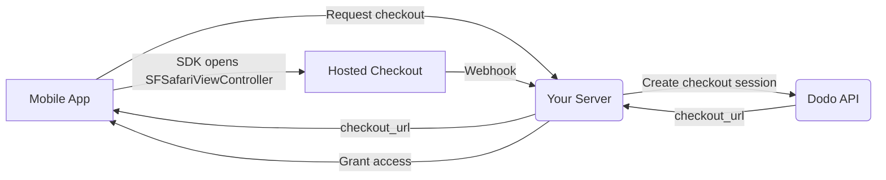

## Pendahuluan

Dodo Payments memberdayakan pengembang untuk menjual barang dan layanan digital di aplikasi iOS, menangani aspek kompleks seperti kepatuhan pajak, konversi mata uang, dan pembayaran. Panduan komprehensif ini menjelaskan cara mengintegrasikan Dodo Payments ke dalam aplikasi iOS Anda, khususnya untuk alat SaaS, langganan konten, dan utilitas digital.

## Ikhtisar

Dodo Payments berfungsi sebagai **Merchant of Record (MoR)** Anda, mengelola aspek kritis dari bisnis digital Anda:

<Tabs>
<Tab title="What We Handle">
- Pengumpulan dan pelunasan pajak (PPN, GST, dan pajak regional lainnya)
- Pembayaran global sesuai kebijakan dan metode pembayaran lokal
- Konversi mata uang dan valuta asing
- Chargeback dan pencegahan penipuan
- Penagihan dan tanda terima bagi pelanggan akhir
- Kepatuhan terhadap regulasi regional
</Tab>

<Tab title="What You Get">
- API terpadu untuk platform web dan seluler
- Dukungan untuk checkout di dalam aplikasi (UPI, kartu, dompet, BNPL)
- Dukungan pembayaran global (Payoneer, Wise, transfer bank lokal)
- Dasbor analitik dan pelaporan
- Pemrosesan pembayaran yang aman
</Tab>
</Tabs>

## Kasus Penggunaan

<CardGroup cols={2}>
<Card title="Subscriptions" icon="repeat">
- Akses konten atau fitur premium
- Penagihan berulang dengan opsi fleksibel, uji coba gratis, prorata, atau peningkatan dan penurunan
</Card>

<Card title="Courses and Learning" icon="graduation-cap">
- Akses bayar per kursus
- Paket konten bundel
- Lisensi seumur hidup atau dapat diperbarui
- Integrasi pelacakan kemajuan
</Card>

<Card title="Digital Downloads" icon="download">
- Pembelian sekali bayar (PDF, musik, alat)
- Pengiriman aset digital
- Manajemen kunci lisensi
</Card>

<Card title="SaaS Tools" icon="screwdriver-wrench">
- Langganan Software-as-a-Service
- Penagihan berdasarkan penggunaan
- Rencana tim dan perusahaan
</Card>
</CardGroup>

## Alur Integrasi

Aplikasi Anda membuka hosted checkout milik Dodo dengan
[iOS checkout SDK](/developer-resources/sdks/ios), yang menampilkannya di
`SFSafariViewController` dan mengembalikan hasil bertipe.

<Warning>
Gunakan SDK, bukan menyematkan checkout di dalam `WebView`. Apple Pay hanya
tersedia di permukaan browser nyata, sehingga `WebView` dapat secara diam-diam mengurangi konversi
wallet Anda — dan alur pembayaran di dalam `WebView` merupakan penyebab umum penolakan dalam peninjauan
App Store.
</Warning>

### Langkah Integrasi

<Steps>
<Step title="Mobile App to Your Server">
Aplikasi Anda meminta URL checkout dari backend Anda sendiri, yang diautentikasi dengan
token sesi pengguna yang telah masuk.
</Step>

<Step title="Your Server to Dodo API">
Backend Anda membuat [checkout session](/developer-resources/checkout-session)
dengan API key Anda dan mengembalikan `checkout_url` ke aplikasi.

<Warning>
Buat checkout sessions di server Anda, jangan pernah di aplikasi. API key yang disertakan
di dalam app binary dapat diekstrak dari bundle.
</Warning>
</Step>

<Step title="Mobile App Opens Checkout">
Teruskan `checkout_url` ke `DodoCheckout.start(...)`. SDK menampilkannya di
`SFSafariViewController` dan menyelesaikannya dengan hasil bertipe ketika pelanggan
menyelesaikan atau menutup checkout.
</Step>

<Step title="Dodo Payments to Your Server">
Dodo Payments memanggil endpoint webhook Anda ketika pembayaran berhasil atau
subscription diaktifkan.
</Step>

<Step title="Your Server Grants Access">
Buka akses ke konten yang dibeli dari webhook tersebut, bukan dari hasil yang diterima aplikasi.
Hasil SDK adalah petunjuk UI, bukan bukti pembayaran.
</Step>
</Steps>

<CardGroup cols={2}>
<Card title="iOS Checkout SDK" icon="apple" href="/developer-resources/sdks/ios">
  Langkah instalasi dan contract `start(...)` lengkap untuk Swift.
</Card>
<Card title="Mobile Integration Guide" icon="mobile" href="/developer-resources/mobile-integration">
  Alur end-to-end, serta contract yang sama untuk Android, React Native, dan Flutter.
</Card>
</CardGroup>

## Ketersediaan Regional

Dodo Payments memungkinkan alur pembelian alternatif dalam aplikasi hanya di wilayah App Store tempat Apple secara eksplisit mengizinkan pembayaran eksternal, atau tempat regulator maupun perintah pengadilan mewajibkannya.

### Wilayah yang Didukung

<AccordionGroup>
<Accordion title="United States">
Didukung sejauh diizinkan oleh perintah pengadilan yang berlaku saat ini dan pedoman Apple yang telah diperbarui.

- Tersedia berdasarkan ketentuan khusus yang diwajibkan pengadilan
- Bergantung pada kepatuhan Apple terhadap persyaratan hukum
- Harus mengikuti pedoman implementasi Apple
</Accordion>

<Accordion title="European Union (EU) App Store">
Didukung melalui Apple's EU Alternative Terms dan External Purchase Entitlement.

- Diaktifkan melalui Apple's EU Alternative Terms
- Memerlukan persetujuan External Purchase Entitlement
- Harus mematuhi persyaratan EU Digital Markets Act
</Accordion>

<Accordion title="South Korea">
Didukung melalui StoreKit External Purchase Entitlement untuk binary khusus Korea.

- Tersedia melalui StoreKit External Purchase Entitlement
- Memerlukan app binary khusus Korea
- Harus mematuhi hukum telekomunikasi Korea
</Accordion>
</AccordionGroup>

<Warning>
Selalu tinjau dan patuhi entitlement khusus wilayah Apple serta persyaratan App Store Connect sebelum mengaktifkan Dodo Payments untuk storefront mana pun. Menggunakan alur pembayaran alternatif di wilayah yang tidak didukung dapat menyebabkan aplikasi ditolak atau dihapus.
</Warning>

<Note>
Untuk beberapa model bisnis — seperti layanan atau kategori konten tertentu — Apple mungkin sama sekali tidak mewajibkan penggunaan in-app purchase (IAP). Dodo Payments juga mendukung model-model ini. Selalu verifikasi klasifikasi aplikasi Anda dan pedoman terbaru Apple untuk menentukan apakah IAP wajib digunakan dalam kasus penggunaan Anda.
</Note>

### Pelajari Lebih Lanjut

Untuk penjelasan terperinci mengenai kebijakan global, preseden hukum, dan pendekatan strategis untuk menghindari biaya App Store, lihat panduan komprehensif kami:

<Card title="Bypassing App Store & Play Store Fees: A Strategic and Legal Playbook" icon="shield-check" href="/features/bypassing-app-store-fees">
Pelajari di mana dan bagaimana Anda dapat menerapkan alur pembayaran alternatif secara legal, dengan panduan regional terbaru dan tips kepatuhan.
</Card>